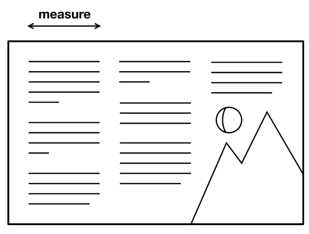
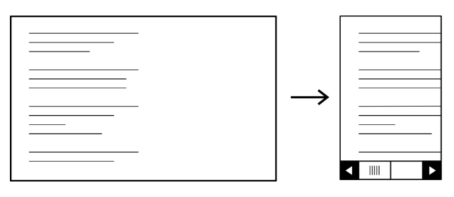
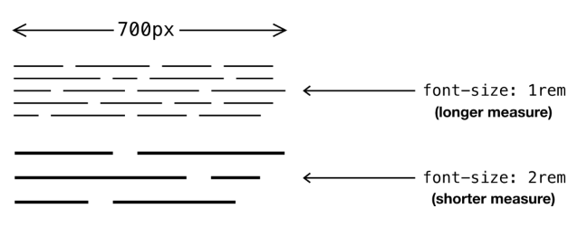
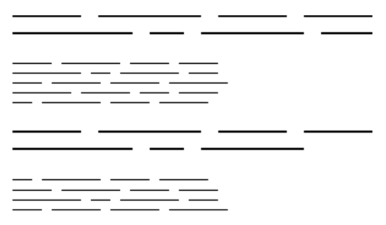

# Axiomas

Como [_el matemático Euclides era consciente_ ↗](https://mathworld.wolfram.com/EuclidsPostulates.html), incluso las geometrías más complejas se fundamentan en axiomas (o _postulados_) simples e irreducibles. A menos que tu diseño se base en axiomas, tu resultado será inconsistente y malformado. El tema de esta sección es cómo honrar un sistema de axiomas de diseño en todo el sistema, usando la _medida tipográfica_ como ejemplo.

??? info "Explicacion"

    Este fragmento está usando una analogía con las matemáticas y la geometría de Euclides.

    La idea es la siguiente:

    * En geometría, todo se construye a partir de unas pocas reglas básicas llamadas **axiomas** o **postulados**. Estas reglas no se demuestran; simplemente se aceptan y sirven como base para todo lo demás.

    Por ejemplo, si cambias una regla básica, toda la geometría cambia.

    El texto dice que **el diseño de interfaces debería funcionar igual**. Es decir, en lugar de elegir tamaños, espacios y medidas de forma arbitraria, deberías definir unas pocas reglas fundamentales y construir todo a partir de ellas.

    __Ejemplo con la tipografía__

    Supongamos que decides:

    * Tamaño base del texto: `1rem` (16 px).
    * Escala tipográfica: multiplicar por `1.25`.

    Esos serían tus "axiomas".

    Entonces:

    ```css
    --size-0: 1rem;      /* 16px */
    --size-1: 1.25rem;   /* 20px */
    --size-2: 1.56rem;   /* 25px */
    --size-3: 1.95rem;   /* 31px */
    ```

    Y todo el sistema se construye con esas medidas:

    * Títulos.
    * Márgenes.
    * Espaciados.
    * Padding.
    * Componentes.

    De esta manera, todas las partes del diseño mantienen una relación coherente entre sí.

    __¿Qué ocurre si no tienes axiomas?__

    Empiezas a poner valores al azar:

    ```css
    font-size: 19px;
    padding: 13px;
    margin: 27px;
    gap: 22px;
    ```

    Cada componente termina teniendo proporciones distintas y el diseño se siente inconsistente. A eso se refiere con:

    > "tu resultado será inconsistente y malformado".

    __En resumen__

    El autor está diciendo:

    > **Antes de construir componentes, define unas pocas reglas fundamentales (axiomas) para tamaños, espaciados, colores, etc. Luego deriva todo lo demás a partir de esas reglas.**

    Así como toda la geometría de Euclides surge de unos pocos postulados, un sistema de diseño sólido surge de unas pocas decisiones fundamentales.


## Medida (*measure*)

El ancho de una línea de texto, en caracteres, se conoce como su [_medida_](https://en.wikipedia.org/wiki/Line_length) (_measure_). Elegir una medida es crítico para el escaneo cómodo de líneas sucesivas. [_The Elements Of Typographic Style_ ↗](https://webtypography.net/2.1.2) considera que cualquier valor entre 45 y 75 es razonable.

Establecer una medida para medios impresos es relativamente sencillo. Es simplemente el ancho del artefacto de papel dividido por el número de columnas de texto colocadas dentro de él — menos los [_márgenes y canalones (gutters)_ ↗](https://en.wikipedia.org/wiki/Column_(typography)), por supuesto.



La web no es estática o predecible como la impresión. Cada palabra está separada por un _espacio de ruptura (breaking space)_ (unicode point U+0020 ↗), liberando secuencias de texto para que se ajusten dinámicamente según el espacio disponible. La cantidad de espacio disponible está determinada por una serie de factores interrelacionados que incluyen el tamaño y la orientación del dispositivo, el tamaño del texto y el nivel de zoom.

Como diseñadores, buscamos controlar la experiencia de los usuarios. Pero, como John Allsopp escribió en [_The Dao Of Web Design_ ↗](https://alistapart.com/article/dao/) del año 2000, intentar el control _directo_ sobre la forma en que los usuarios consumen contenido en la web es temerario. Imponer una medida específica significaría establecer un ancho fijo. Muchos usuarios experimentarían desplazamiento horizontal y funcionalidad de zoom rota.



Para diseñar "páginas adaptables" (término de Allsopp), debemos ceder el control a los algoritmos (como el ajuste de texto) que los navegadores usan para maquetar páginas web automáticamente. Pero eso no significa que no haya lugar para el layout. Piensa en ti mismo como el _mentor_ del navegador, en lugar de su _microgestor_.

??? info "Explicacion"

    Este texto habla de uno de los principios más importantes de la tipografía y del diseño web: la **medida** (*measure*), es decir, **cuántos caracteres tiene una línea de texto**.

    __1. ¿Qué es la medida?__

    La medida es simplemente la longitud de una línea de texto.

    Por ejemplo:

    ```text
    Esta línea es demasiado corta.
    ```

    ```text
    Esta línea tiene una longitud razonable y resulta cómoda para leer porque el ojo puede pasar fácilmente a la siguiente línea sin perderse.
    ```

    ```text
    Esta línea es exageradamente larga y el lector tiene que recorrer una gran distancia con la vista para encontrar el comienzo de la siguiente línea, lo que vuelve la lectura cansada y lenta.
    ```

    Según el libro *The Elements of Typographic Style*, una longitud de **45 a 75 caracteres por línea** suele ser la más cómoda para leer.

    ---

    __2. En papel es fácil controlar esto__

    Si diseñas una revista o un libro, sabes exactamente:

    * el tamaño de la hoja;
    * los márgenes;
    * cuántas columnas habrá.

    Por eso puedes controlar perfectamente la longitud de las líneas.

    ```
    ----------------------------------
    | margen | columna | margen      |
    |         | texto   |             |
    |         | texto   |             |
    ----------------------------------
    ```

    ---

    __3. En la web todo cambia constantemente__

    En cambio, una página web puede verse en:

    * un teléfono;
    * una tablet;
    * un monitor de 27";
    * con el navegador ampliado al 200%;
    * con distintos tamaños de letra.

    Además, los navegadores van moviendo automáticamente las palabras a la siguiente línea gracias a los espacios entre ellas.

    Por ejemplo:

    ```html
    <p>
    Lorem ipsum dolor sit amet consectetur adipisicing elit...
    </p>
    ```

    En una pantalla ancha podría verse así:

    ```text
    Lorem ipsum dolor sit amet consectetur adipisicing elit,
    sed do eiusmod tempor incididunt ut labore.
    ```

    Y en una pantalla pequeña:

    ```text
    Lorem ipsum dolor sit
    amet consectetur
    adipisicing elit,
    sed do eiusmod tempor
    incididunt ut labore.
    ```

    El navegador decide dónde romper las líneas.

    ---

    __4. No debemos intentar controlar todo__

    El autor menciona a John Allsopp, quien decía que tratar de controlar exactamente cómo verá el usuario una página es una batalla perdida.

    Sería un error decir:

    ```css
    width: 600px;
    ```

    porque en un teléfono de 360 px aparecería una barra de desplazamiento horizontal.

    El usuario tendría que hacer esto:

    ```
    ←────────────→
    desplazarse lateralmente
    ```

    y además el zoom podría comportarse mal.

    ---

    __5. En vez de microgestionar, debemos guiar al navegador__

    Esta es la idea más profunda del texto.

    No eres un "dictador" del layout, sino una especie de **mentor del navegador**.

    En vez de imponer:

    ```css
    width: 600px;
    ```

    le das límites razonables:

    ```css
    .article {
        max-width: 65ch;
    }
    ```

    `ch` representa aproximadamente el ancho de un carácter.

    Así, el navegador intentará mantener unas 65 letras por línea:

    * En pantallas grandes, la línea no será excesivamente larga.
    * En pantallas pequeñas, el ancho se reducirá automáticamente.
    * El zoom seguirá funcionando.
    * El texto continuará siendo legible.

    ---

    __La idea principal de todo el párrafo__

    En diseño web no debes pensar:

    > «Yo voy a decidir exactamente dónde termina cada línea».

    Sino:

    > «Voy a establecer reglas y dejar que el navegador haga el trabajo».

    Por eso el autor dice:

    > **Piensa en ti mismo como el mentor del navegador, y no como su microgestor.**

    Es una filosofía muy importante del diseño web moderno: **cooperar con los algoritmos del navegador en lugar de luchar contra ellos**.

## El axioma de la medida

Es una buena práctica intentar enunciar un axioma de diseño en una frase u oración corta. En este caso, esa declaración podría ser: _"la medida nunca debería exceder 60ch"_.

¿La medida de _qué_? ¿Y _dónde_? No hay razón por la que _ninguna_ línea de texto deba volverse demasiado larga. Este axioma, como todos los axiomas, debería impregnar el diseño sin calificaciones ni excepciones. La verdadera pregunta es: ¿cómo? En _Global and local styling_ establecimos tres niveles principales de estilo:

1. Estilos universales (incluyendo heredados)
2. Primitivas de layout
3. Clases de utilidad

El axioma de la medida debería sembrarse tan pervasiveamente como sea posible en los estilos universales, pero también estar disponible para las primitivas de layout (ver _Composición_) y las clases de utilidad. Pero primero, ¿qué propiedad y qué valor deberían inscribir la regla?

??? info "Explicacion"

    __1. El axioma__

    El autor propone esta frase:

    > **"La medida nunca debería exceder 60ch".**

    Es decir:

    > Ninguna línea de texto debería ser demasiado larga.

    La idea es expresarla en una frase corta, igual que un principio fundamental.

    Por ejemplo:

    * "Los colores deben provenir de la paleta."
    * "Los espacios deben seguir la escala modular."
    * "La medida nunca debe exceder 60ch."

    Estas frases son los **axiomas del sistema de diseño**.

    ---

    __2. ¿La medida de qué?__

    El autor se hace dos preguntas:

    > ¿La medida de qué?

    > ¿Y dónde?

    Porque podrías pensar:

    * ¿Solo los párrafos?
    * ¿Solo los artículos?
    * ¿Solo en escritorio?

    Y la respuesta es:

    > **De cualquier línea de texto y en cualquier parte.**

    No existe ninguna razón para que un texto se vuelva excesivamente largo.

    Por eso dice:

    > Este axioma debería impregnar el diseño sin excepciones.

    Es decir, la regla debería estar presente en todo el sistema.

    ---

    __3. ¿Qué significa "impregnar"?__

    Imagina que una empresa tiene una cultura de puntualidad.

    No basta con poner un cartel:

    ```text
    Sea puntual
    ```

    La puntualidad debe reflejarse en:

    * los horarios;
    * las reuniones;
    * los procesos;
    * las políticas.

    Toda la organización está "impregnada" de esa idea.

    Con el diseño sucede igual.

    La regla:

    > "La medida nunca debe superar 60ch"

    debería aparecer en todos los niveles del sistema.

    ---

    __4. Los tres niveles de estilo__

    El autor recuerda que anteriormente definió tres niveles:

    __Estilos universales__

    Son los estilos globales.

    Por ejemplo:

    ```css
    body {
        font-family: sans-serif;
    }
    ```

    o

    ```css
    p {
        line-height: 1.5;
    }
    ```

    Estos afectan a todo el documento.

    ---

    __Primitivas de layout__

    Son componentes básicos reutilizables.

    Por ejemplo:

    ```css
    .stack {}
    .cluster {}
    .sidebar {}
    .center {}
    ```

    No representan un botón o una tarjeta, sino estructuras para organizar elementos.

    ---

    __Clases de utilidad__

    Son clases pequeñas y específicas:

    ```css
    .measure {}
    .mt-2 {}
    .text-center {}
    ```

    que puedes aplicar cuando las necesites.

    ---

    __5. El axioma debe existir en los tres niveles__

    El autor dice:

    > El axioma debería sembrarse tan ampliamente como sea posible.

    La palabra "sembrarse" es importante.

    Significa que la idea debe aparecer en todas partes.

    __En estilos globales__

    ```css
    p {
        ...
    }
    ```

    __En primitivas__

    ```css
    .center {
        ...
    }
    ```

    __En utilidades__

    ```css
    .measure {
        ...
    }
    ```

    Así, la regla deja de depender de la memoria del desarrollador.

    El sistema mismo ayuda a cumplirla.

    ---

    __6. La pregunta importante__

    Todo esto conduce a una pregunta:

    > Si la regla es:

    ```text
    La medida nunca debería exceder 60ch.
    ```

    ¿Con qué propiedad CSS y con qué valor se implementa?

    Es decir:

    ```css
    ¿width?
    ¿max-width?
    ¿700px?
    ¿60ch?
    ```

    Y precisamente esa es la pregunta que la siguiente sección va a responder.

    ---

    En el fondo, esta parte no trata sobre CSS todavía. Trata sobre una filosofía:

    > **Un principio de diseño valioso no debería existir solo en la documentación o en la cabeza del diseñador. Debe estar incorporado en todas las capas del sistema para que se cumpla de manera natural.**


## La declaración `max-width`

¡Los anchos (y alturas) fijos son anatema para el diseño responsivo, como establecimos en _Boxes_ y nuevamente aquí. En su lugar, deberíamos trabajar con _tolerancias_. La propiedad `max-width`, por ejemplo, tolera cualquier longitud de texto _hasta_ un cierto valor.

```css linenums="1"
p {
  max-width: 700px;
}
```

Esa es la propiedad cubierta. Sin embargo, la unidad `px` es problemática. Podemos juzgar, a simple vista, que `700px` crea una medida razonable para el `font-size` dado. Pero el `font-size` dado es realmente solo el `font-size` que nuestra pantalla resulta estar mostrando en ese momento — es nuestra visión _parroquial_ de nuestro propio diseño.

Cambiar `font-size` para los párrafos, o ajustar el tamaño de fuente del sistema por defecto, creará una medida (máxima) diferente. Debido a que no hay una _relación_ entre la longitud de caracteres y el ancho en píxeles, no tenemos un algoritmo que pueda garantizar el valor correcto de medida máxima.



Afortunadamente, CSS incluye la unidad `ch`. El valor de `1ch` se basa en el ancho del carácter `0` de la fuente. Importantemente, esto significa que cambiar el `font-size` cambia el valor de `1ch`, adaptando así la medida. Usar unidades `ch` es un enfoque innatamente algorítmico para la medida, porque el resultado se basa en un cálculo que permites que el navegador haga por ti.

Usar `ch` nos permite imponer el axioma independientemente del `font-size`, permitiendo que sea altamente pervasivo y sin peligro de "salir mal". Donde "_la medida nunca debería exceder 60ch_" podría haber sido una nota en alguna documentación, puede en su lugar ser una calidad directamente codificada en el carácter del diseño.

??? Example 

??? info "Explicacion"

    Esta sección responde a la pregunta que dejó pendiente la anterior:

    > **¿Con qué propiedad y con qué valor implementamos el axioma "la medida nunca debería exceder 60ch"?**

    ---

    __1. Los anchos fijos son enemigos del diseño responsivo__

    El autor dice que los anchos y alturas fijos son "anatema" para el diseño responsivo.

    En otras palabras:

    > **Son algo que deberíamos evitar.**

    Por ejemplo:

    ```css
    p {
        width: 700px;
    }
    ```

    Aquí el párrafo tendrá siempre exactamente 700 píxeles.

    Da igual si:

    * la pantalla es pequeña;
    * el usuario hizo zoom;
    * el tamaño de fuente aumentó.

    El ancho seguirá siendo 700 px.

    Eso rompe la adaptabilidad.

    ---

    __2. Debemos trabajar con tolerancias__

    En lugar de imponer:

    > "Debes medir exactamente esto"

    debemos decir:

    > "Puedes tener cualquier tamaño, siempre y cuando no sobrepases cierto límite".

    Por eso se utiliza:

    ```css
    p {
        max-width: 700px;
    }
    ```

    `max-width` significa:

    > "Puedes ser más estrecho si hace falta, pero nunca más ancho que esto".

    Por ejemplo:

    __Pantalla pequeña__

    ```text
    ┌──────┐
    │texto │
    │texto │
    └──────┘
    ```

    __Pantalla grande__

    ```text
    ┌─────────────────┐
    │ texto texto     │
    │ texto texto     │
    └─────────────────┘
    ```

    ---

    __3. Pero 700px tiene un problema__

    Supongamos:

    ```css
    p {
        max-width: 700px;
        font-size: 16px;
    }
    ```

    Visualmente puede verse bien.

    Quizá entren unas 60 letras por línea.

    Pero mañana decides:

    ```css
    font-size: 24px;
    ```

    Ahora las letras son más grandes.

    Sin embargo:

    ```css
    max-width: 700px;
    ```

    sigue siendo 700 px.

    Por tanto, ya no caben 60 caracteres.

    Quizá ahora solo entren 40.

    La medida cambió.

    ---

    __4. Los píxeles no saben nada sobre caracteres__

    Aquí está la idea fundamental.

    No existe una relación fija entre:

    ```text
    700px
    ```

    y

    ```text
    60 caracteres
    ```

    Porque depende de:

    * la fuente;
    * el tamaño de la letra;
    * el zoom del navegador;
    * la configuración del usuario.

    Por eso el autor dice:

    > No tenemos un algoritmo que garantice una medida correcta usando píxeles.

    ---

    __5. Entonces aparece `ch`__

    CSS tiene una unidad especial:

    ```css
    1ch
    ```

    que equivale aproximadamente al ancho del carácter:

    ```text
    0
    ```

    de la fuente actual.

    ---

    __6. Lo importante de `ch`__

    Si tienes:

    ```css
    font-size: 16px;
    ```

    entonces:

    ```css
    1ch
    ```

    vale cierta cantidad.

    Pero si aumentas:

    ```css
    font-size: 24px;
    ```

    el ancho del carácter también aumenta.

    Y por tanto:

    ```css
    1ch
    ```

    también aumenta.

    Así:

    ```css
    60ch
    ```

    crece automáticamente.

    ---

    __Con píxeles__

    ```css
    font-size: 16px;
    max-width: 700px;
    ```

    ↓

    caben unas 60 letras.

    Luego:

    ```css
    font-size: 24px;
    max-width: 700px;
    ```

    ↓

    caben quizá 40 letras.

    La medida cambia.

    ---

    __Con `ch`__

    ```css
    font-size: 16px;
    max-width: 60ch;
    ```

    ↓

    unas 60 letras.

    Luego:

    ```css
    font-size: 24px;
    max-width: 60ch;
    ```

    ↓

    siguen siendo aproximadamente 60 letras.

    La medida se conserva.

    ---

    __7. Por eso el autor habla de un enfoque algorítmico__

    Tú no haces los cálculos.

    Simplemente escribes:

    ```css
    max-width: 60ch;
    ```

    Y le dices al navegador:

    > "Mantén aproximadamente 60 caracteres por línea. Tú calcula cuánto ancho necesitas".

    El navegador hará el resto.

    ---

    __8. El axioma se vuelve parte del sistema__

    Antes la regla podía existir solo en un documento:

    ```text
    No superar 60 caracteres por línea.
    ```

    Y alguien podía olvidarla.

    Pero si escribes:

    ```css
    .measure {
        max-width: 60ch;
    }
    ```

    o

    ```css
    article {
        max-width: 60ch;
    }
    ```

    entonces la regla deja de ser una recomendación.

    Ahora está incorporada en el CSS.

    El diseño mismo la hace cumplir.

    ---

    __La idea más profunda de toda esta sección__

    El autor quiere que dejes de pensar así:

    > "Con mi pantalla y mi tamaño de letra, 700px se ven bien."

    porque eso es una visión muy limitada y centrada en tu propia computadora.

    Y quiere que empieces a pensar así:

    > "No sé qué pantalla tendrá el usuario ni qué tamaño de letra usará. Le diré al navegador cuál es mi intención (unas 60 letras por línea) y dejaré que él haga las cuentas."

    Esa es una de las filosofías más importantes del diseño responsivo moderno: **describir restricciones y objetivos, no imponer dimensiones rígidas**.

## Diseñar sin ver

Diseñar por axioma requiere un cambio mental. Los axiomas no crean directamente artefactos visuales, solo las _características_ de los artefactos que podrían emerger.

A veces los artefactos resultantes se ven y se comportan de maneras que podrías no haber previsto. Por ejemplo, en un contenedor que es más ancho que la medida acordada aplicada al tamaño de fuente base, los elementos con diferentes tamaños de fuente ocuparán diferentes proporciones del ancho de ese contenedor. Esto se debe a que `1ch` es más ancho para un tamaño de fuente más grande.



Al momento de concebir el axioma, es posible que no hayas imaginado este efecto visual específico. Pero eso no significa que no sea sólido o deseable. De hecho, es tu CSS haciendo exactamente lo que pretendías: mantener una medida razonable independientemente del contexto.

Fundamentalmente, diseñar para la web es diseñar _sin ver_. Simplemente no puedes anticipar todas las combinaciones visuales producidas por:

1. La colocación modular de tus componentes de layout
2. Las circunstancias y configuraciones de cada usuario final

En lugar de pensar en diseñar para la web como crear artefactos visuales, piensa en ello como escribir _programas que generan_ artefactos visuales. Los axiomas son las reglas que influyen en cómo el navegador crea esos artefactos, y cuanto mejor pensados estén, mejor puede el navegador acomodar al usuario.

??? info "Explicacion"

    Esta es una de las ideas más profundas del libro. El autor está diciendo que **diseñar para la web no consiste en dibujar exactamente cómo se verá algo**, sino en establecer reglas para que el navegador produzca resultados adecuados en muchísimas situaciones distintas.

    ---

    __1. Los axiomas no crean imágenes, crean propiedades__

    Supongamos que defines este axioma:

    ```css
    max-width: 60ch;
    ```

    Ese axioma no dice:

    > "Quiero una caja de exactamente 600 píxeles."

    Tampoco dice:

    > "Quiero que el texto se vea exactamente así."

    Lo único que expresa es:

    > "No quiero líneas excesivamente largas."

    Es decir, estás describiendo una **característica deseable**, no una apariencia concreta.

    ---

    __2. Pueden aparecer resultados que no imaginaste__

    Supón un contenedor ancho:

    ```text
    -------------------------------------
    |                                   |
    |                                   |
    -------------------------------------
    ```

    Y dentro tienes:

    ```html
    <h1>Título</h1>
    <p>Párrafo...</p>
    ```

    con:

    ```css
    h1 {
        font-size: 3rem;
        max-width: 60ch;
    }

    p {
        font-size: 1rem;
        max-width: 60ch;
    }
    ```

    Como `1ch` depende del tamaño de la fuente:

    * en el título, `60ch` será más ancho;
    * en el párrafo, `60ch` será más estrecho.

    Por eso ambos elementos ocuparán proporciones diferentes del contenedor.

    ```text
    Contenedor
    ------------------------------------------------

    Título (3rem)

    ┌─────────────────────────────┐
    │ GRAN TITULO                 │
    └─────────────────────────────┘

    Párrafo (1rem)

    ┌───────────────┐
    │ texto texto   │
    │ texto texto   │
    └───────────────┘
    ```

    Quizá nunca imaginaste ese resultado visual.

    ---

    __3. Pero eso no significa que esté mal__

    El autor dice:

    > Que no lo hayas previsto no significa que no sea correcto.

    De hecho, el navegador está obedeciendo perfectamente la intención original:

    > Mantener una longitud cómoda de lectura para cualquier tamaño de letra.

    El sistema está funcionando.

    ---

    __4. Diseñar para la web es diseñar sin ver__

    Esta frase es muy importante:

    > **Diseñar para la web es diseñar sin ver.**

    ¿Por qué?

    Porque es imposible prever todas las combinaciones posibles.

    Los usuarios pueden tener:

    * pantallas grandes;
    * teléfonos;
    * tablets;
    * zoom al 200%;
    * fuentes distintas;
    * tamaños de letra aumentados;
    * configuraciones de accesibilidad;
    * componentes organizados de muchas maneras diferentes.

    No puedes dibujar todas esas posibilidades.

    ---

    __5. Tampoco puedes prever cómo se combinarán tus componentes__

    Supón que tienes componentes independientes:

    ```text
    Stack
    Sidebar
    Cluster
    Center
    Card
    ```

    Un desarrollador podría combinarlos así:

    ```text
    Sidebar
    └── Stack
          ├── Card
          ├── Card
          └── Cluster
    ```

    Otro podría hacerlo de otra forma completamente distinta.

    Los componentes son modulares.

    Y eso genera muchísimas disposiciones posibles.

    ---

    __6. Por eso CSS se parece más a la programación que al dibujo__

    Normalmente pensamos:

    ```text
    Diseño
    ↓
    Imagen final
    ```

    Pero el autor propone otra visión:

    ```text
    Reglas
    ↓
    Navegador
    ↓
    Imagen final
    ```

    Es decir, el navegador es quien genera el resultado.

    Tú no dibujas directamente la página.

    Tú escribes un programa:

    ```css
    max-width: 60ch;
    line-height: 1.5;
    display: flex;
    gap: 1rem;
    ```

    Y el navegador produce la interfaz.

    ---

    __7. Los axiomas son como leyes físicas__

    Imagina que Dios creara el universo.

    No tendría que colocar manualmente cada ola, cada nube o cada montaña.

    Simplemente establecería las leyes:

    * gravedad;
    * electromagnetismo;
    * movimiento.

    Y a partir de ellas emergerían millones de formas distintas.

    El autor propone algo parecido para el diseño.

    Los axiomas son las "leyes de la física" de tu sistema:

    ```css
    max-width: 60ch;
    line-height: 1.5;
    gap: 1rem;
    padding: var(--space-m);
    ```

    A partir de esas leyes, el navegador genera las distintas interfaces.

    ---

    __La idea más profunda de toda esta sección__

    El autor quiere que abandones esta mentalidad:

    > «Estoy creando una imagen.»

    y adoptes esta:

    > **«Estoy escribiendo un conjunto de reglas para que el navegador genere imágenes correctas en circunstancias que ni siquiera puedo prever.»**

    Por eso afirma:

    > **Diseñar para la web es escribir programas que producen artefactos visuales, no dibujar artefactos visuales directamente.**

    Esa es una de las filosofías fundamentales detrás del diseño responsivo moderno y de la arquitectura CSS basada en sistemas.

## Valores por defecto globales

Para realizar el axioma, necesitamos asegurar que todos los elementos aplicables estén sujetos a él. Esto es una cuestión de selectores. Podríamos crear un selector de clase…

```css linenums="1"
.measure-cap {
  max-width: 60ch;
}
```

…pero es un error pensar en términos de clases (de utilidad) demasiado pronto. Significaría aplicar el estilo manualmente, a elementos individuales en el HTML, dondequiera que sintiéramos que es aplicable. La intervención manual es laboriosa, propensa a errores (omitir elementos), y llevará a un marcado inflado.

En su lugar, deberíamos preguntarnos a qué _tipos_ de elementos podría aplicarse la regla. Ciertamente, los elementos de flujo diseñados para texto. Elementos inline como `<em>` y `<small>` no necesitarían ser incluidos, ya que ocuparían solo una parte de la medida total de sus elementos de flujo padre.

```css linenums="1"
p,
h1,
h2,
h3,
h4,
h5,
h6,
li,
figcaption {
  max-width: 60ch;
}
```

??? info "Explicacion"

    Esta sección continúa con la filosofía de los **axiomas** y responde a la pregunta:

    > **¿Cómo hacemos que el axioma "la medida nunca debe superar 60ch" se cumpla en toda la página?**

    La respuesta del autor es:

    > **Usando estilos globales, no aplicando clases manualmente a cada elemento.**

    ---

    __1. La solución obvia: una clase__

    Podrías crear:

    ```css
    .measure-cap {
        max-width: 60ch;
    }
    ```

    y luego escribir:

    ```html
    <p class="measure-cap">
    ...
    </p>

    <h2 class="measure-cap">
    ...
    </h2>

    <li class="measure-cap">
    ...
    </li>
    ```

    Funciona.

    Pero el autor dice que **es un error pensar así demasiado pronto**.

    ---

    __2. ¿Por qué es una mala idea?__

    Porque ahora dependes de la memoria humana.

    Debes acordarte de escribir:

    ```html
    class="measure-cap"
    ```

    en todos lados.

    Y tarde o temprano sucederá esto:

    ```html
    <p>
    Olvidé poner la clase.
    </p>
    ```

    o:

    ```html
    <h3>
    Otro desarrollador tampoco la puso.
    </h3>
    ```

    Y el axioma se rompe.

    ---

    __3. Además, el HTML se llena de clases__

    Terminas con cosas como:

    ```html
    <h1 class="measure-cap">
    ...
    </h1>

    <p class="measure-cap">
    ...
    </p>

    <li class="measure-cap">
    ...
    </li>

    <figcaption class="measure-cap">
    ...
    </figcaption>
    ```

    La misma clase repetida una y otra vez.

    Eso hace que el marcado se vuelva innecesariamente grande y ruidoso.

    ---

    __4. El cambio de mentalidad__

    En vez de preguntarte:

    > ¿Dónde debería poner esta clase?

    deberías preguntarte:

    > ¿Qué tipos de elementos necesitan esta regla?

    Y la respuesta es:

    * párrafos;
    * encabezados;
    * elementos de listas;
    * pies de figura;
    * cualquier elemento cuyo propósito principal sea contener texto.

    ---

    __5. Entonces usamos selectores globales__

    ```css
    p,
    h1,
    h2,
    h3,
    h4,
    h5,
    h6,
    li,
    figcaption {
        max-width: 60ch;
    }
    ```

    Ahora sucede automáticamente:

    ```html
    <p>...</p>
    <h2>...</h2>
    <li>...</li>
    ```

    Todos ellos respetarán el axioma sin hacer nada más.

    ---

    __6. ¿Por qué no se incluyen elementos inline?__

    Por ejemplo:

    ```html
    <p>
    Texto <em>importante</em>.
    </p>
    ```

    o

    ```html
    <p>
    Texto <small>pequeño</small>.
    </p>
    ```

    `<em>` y `<small>` son elementos **inline**.

    No forman líneas independientes.

    Viven dentro del párrafo:

    ```text
    ---------------------------------
    Texto importante.
    ---------------------------------
    ↑
    todo esto es el párrafo
    ```

    Si el `<p>` tiene:

    ```css
    max-width:60ch;
    ```

    entonces:

    ```html
    <em>
    ```

    y

    ```html
    <small>
    ```

    ya están contenidos dentro de esos 60 caracteres.

    No necesitan una regla propia.

    ---

    __7. La filosofía que hay detrás__

    El autor quiere aprovechar una de las mayores fortalezas de CSS:

    > **Los estilos globales.**

    En lugar de decir:

    > "Este párrafo tiene esta clase."

    dice:

    > "Todos los párrafos son así."

    En lugar de:

    > "Este h2 tiene esta clase."

    dice:

    > "Todos los h2 son así."

    ---

    __8. ¿Por qué esto encaja con los axiomas?__

    Porque un axioma es una regla universal.

    No dice:

    > Algunos párrafos tendrán una medida razonable.

    Ni:

    > Solo los elementos que recuerde marcar.

    Dice:

    > **Ninguna línea de texto debe ser demasiado larga.**

    Por tanto, es lógico que la regla se implemente de manera global.

    ---

    __La idea principal de toda esta sección es:__

    > **Si una regla es universal, impleméntala con selectores globales y no obligues a los desarrolladores a recordarla manualmente mediante clases.**

    Es otra manifestación de una filosofía que aparece constantemente en este libro:

    > **Haz que el sistema haga automáticamente lo correcto, en lugar de depender de la disciplina y memoria de las personas.**

## Estilo basado en excepciones

Es difícil saber si nos hemos acordado de todo aquí. Un enfoque basado en excepciones es más inteligente, ya que solo tenemos que recordar qué elementos _no_ deberían estar sujetos a la regla. Observa que los elementos inline _no_ están incluidos en el siguiente ejemplo pero, dado que ocuparían un espacio horizontal igual o menor que sus padres, no surgirían efectos negativos.

```css linenums="1"
* {
  max-width: 60ch;
}
html,
body,
div,
header,
nav,
main,
footer {
  max-width: none;
}
```

El elemento `<div>` particularmente tiende a usarse como contenedor/envoltorio genérico. Es probable que algunos de estos elementos contengan múltiples cajas adyacentes, con una o más de cada una deseando ocupar los `60ch` completos. Esto hace que sus padres sean excepciones lógicas.

Un enfoque basado en excepciones para CSS nos permite hacer _la mayor parte_ de nuestro estilo con _la menor cantidad_ de nuestro código. Si no estás adoptando un enfoque basado en excepciones, puede ser porque hacer excepciones se siente como _corregir errores_. Pero esto está lejos de ser el caso. CSS, con su _cascada y otras características_ ↗, está diseñado para esto. En la tesis _ITCSS (Inverted Triangle CSS)_ ↗ de Harry Roberts, la especificidad (qué tan específicos son los selectores) es inversamente proporcional al alcance (a cuántos elementos deberían afectar).

## Un valor universal

Antes de empezar a usar el valor de medida en todas partes, es mejor definirlo como una custom property. De esa manera, cualquier cambio en el valor se propagará por todo el diseño.

Observa que no todas las custom properties tienen que ser globales, pero en este caso queremos que nuestros elementos, props y clases de utilidad estén de acuerdo. Por lo tanto, colocamos la custom property en el elemento `:root`.

```css linenums="1"
:root {
  --measure: 60ch;
}
```

Esto se pasa a nuestro bloque universal…

```css linenums="1"
* {
  max-width: var(--measure);
}
html,
body,
div,
header,
nav,
main,
footer {
  max-width: none;
}
```

…y a cualquier clase de utilidad que podamos encontrar que necesitemos.

```css linenums="1"
.max-width\:measure {
  max-width: var(--measure);
}
.max-width\:measure\/2 {
  max-width: calc(var(--measure) / 2);
}
```

### Escapado

Las barras invertidas son necesarias en el ejemplo anterior para escapar los caracteres especiales de barra diagonal y dos puntos.

## Medida en layouts compuestos

Ciertas _primitivas de layout_ inevitablemente aceptan props relacionadas con la medida, y algunas establecen valores por defecto para esas props usando `var(--measure)`. El _Switcher_ tiene una prop `threshold` que define el ancho del contenedor en el cual el layout cambia entre una configuración horizontal y vertical:

```js linenums="1"
get threshold() {
  return this.getAttribute('threshold') || 'var(--measure)';
}
set threshold(val) {
  return this.setAttribute('threshold', val);
}
```

Este es un valor por defecto sensato, pero puede anularse fácilmente con cualquier valor de cadena:

```html linenums="1"
<switcher-l threshold="20rem">...</switcher-l>
```

Si pasamos un valor ilegítimo a `threshold`, la declaración será descartada, y el _Switcher_ aplicará la hoja de estilo de respaldo (_fallback stylesheet_) con el valor por defecto de todos modos.

Nuestro enfoque de la medida es uno en el que asumimos el control, pero un tipo de control moderado que es deferente hacia la forma en que los navegadores funcionan y los usuarios los operan. Muchos de los 'axiomas' que gobiernan tu diseño, como _"la fuente del cuerpo será la Fuente X"_ o _"los encabezados serán azul oscuro"_, no tendrán un impacto en el layout como tal, lo que los hace mucho más simples de aplicar solo con estilos globales. Cuando el layout entra en la ecuación, ten cuidado con las diferentes configuraciones y orientaciones. Elige propiedades, valores y unidades que permitan al navegador calcular el layout más adecuado en tu nombre.

