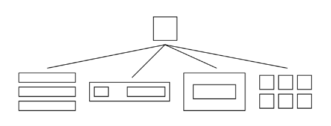
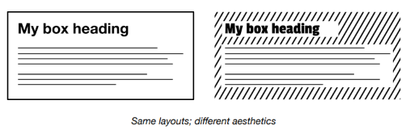
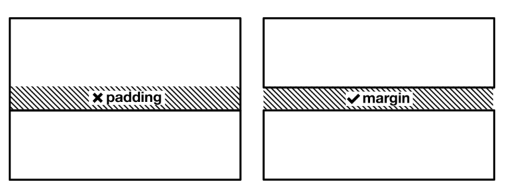
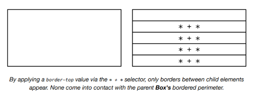
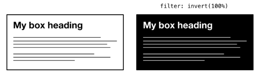
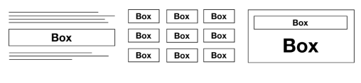
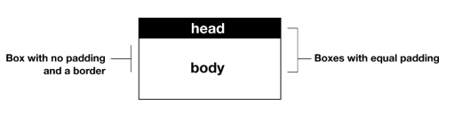

# The Box

## El problema

Como establecí en _Boxes_, cada elemento renderizado crea una forma de caja. Entonces, ¿cuál es el uso de un layout `Box`, encapsulado como un componente dedicado?

Todos los layouts subsiguientes se ocupan de _ordenar cajas juntas_; distribuyéndolas de alguna manera para que formen una estructura visual compuesta. Por ejemplo, el layout `Stack` toma una serie de cajas e inserta margen vertical entre ellas.

Es importante que al `Stack` no se le dé otro propósito que insertar márgenes verticales. Si comenzara a asumir otras responsabilidades, su descripción de trabajo se volvería un sinsentido, y las otras primitivas de layout dentro del sistema no sabrían cómo comportarse alrededor del `Stack`.

En otras palabras, es una cuestión de[ _separar concerns_ ↗ (separación de intereses)](https://en.wikipedia.org/wiki/Separation_of_concerns). Al igual que en ciencias de la computación, en el diseño visual beneficia a tu sistema dar a cada parte funcional una responsabilidad dedicada y única. El diseño emerge a través de la _composición_.



El rol de `Box` dentro de este sistema de layouts es encargarse de cualquier estilo que pueda considerarse intrínseco a elementos individuales; estilos que no son dictados, heredados o inferidos de los meta-layouts a los que un elemento individual pueda estar sujeto. Pero, ¿cuáles son estos estilos? Pareciera que podrían ser innumerables.

No necesariamente. Mientras que algunos enfoques de CSS te dan el poder (o el *dolor*, dependiendo de tu perspectiva) de aplicar cualquier estilo a un elemento individual, hay muchos estilos que no necesitan ser escritos de esta manera fragmentada. Estilos como `font-family`, `color` y `line-height` pueden ser heredados o aplicados globalmente, como se establece en *Global and local styling*. Y así debería ser, porque establecer estos estilo casa por caso es redundante.

```css linenums="1"
:root {
  font-family: sans-serif;
}
.box {
  /* ↓ No es necesario porque el estilo se hereda */
  /* font-family: sans-serif; */
}
```

Por supuesto, es probable que emplees más de una `font-family` en tu diseño. Pero es más eficiente aplicar estilos por defecto (o 'base') y luego hacer excepciones que estilizar todo como si fuera un caso especial.

Convenientemente, los estilos globales tienden a ser estilos relacionados con la marca (*branding*) — estilos que afectan la estética pero no las *proporciones* del elemento(s) en cuestión. El propósito de este proyecto es explorar la creación de un *sistema de layout* específicamente, y no estamos interesados en el branding (o la estética) como tal. Estamos construyendo wireframes dinámicos y responsivos. La estética puede aplicarse después.



Esto limita la cantidad de propiedades entre las que tenemos que elegir. Para reducir aún más este conjunto de propiedades potenciales, tenemos que preguntarnos qué propiedades específicas de layout son mejor manejadas por los elementos padre o ancestros del simple `Box`.

??? info "Explicacion"

    Este es uno de los capítulos más importantes de **Every Layout**, porque explica la filosofía detrás de todo el sistema. La idea principal no es aprender un nuevo componente, sino entender **por qué existe el componente `Box`**.

    Vamos por partes.

    ---

    __1. "Cada elemento renderizado crea una forma de caja"__

    Cuando escribes:

    ```html
    <div>Hola</div>
    ```

    o

    ```html
    <p>Hola</p>
    ```

    o

    ```html
    <section>...</section>
    ```

    Todos esos elementos se representan como una **caja**.

    Por eso el autor pregunta:

    > Si todos los elementos ya son cajas...
    >
    > **¿Para qué crear un componente llamado Box?**

    Es una pregunta lógica.

    ---

    __2. La respuesta: separar responsabilidades__

    Hasta ahora ya conoces el `Stack`.

    ¿Cuál era el trabajo del `Stack`?

    Solo uno:

    > **Agregar separación vertical entre elementos.**

    Nada más.

    Por ejemplo:

    ```text
    Título

    Párrafo

    Botón
    ```

    El `Stack` únicamente decide cuánto espacio hay entre ellos.

    No debería decidir:

    * color
    * borde
    * padding
    * sombra
    * fondo

    Porque dejaría de ser un Stack puro.

    ---

    __Piensa en un empleado__

    Imagina una empresa.

    Tienes un contador.

    Su trabajo es:

    ✔ Llevar la contabilidad.

    No debería también:

    * diseñar el logo
    * atender clientes
    * limpiar la oficina

    Porque terminaría haciendo demasiadas cosas.

    En programación ocurre igual.

    Cada componente debería tener **una sola responsabilidad**.

    Esto se conoce como el principio de **responsabilidad única (Single Responsibility Principle)**.

    ---

    __3. ¿Entonces qué hace Box?__

    El `Box` hace el trabajo que **no le corresponde al Stack**.

    Por ejemplo:

    ```text
    ┌────────────────────────┐
    │                        │
    │     Contenido          │
    │                        │
    └────────────────────────┘
    ```

    El Box se preocupa por la propia caja.

    No por cómo se relaciona con otras cajas.

    ---

    __El Stack piensa así__

    > ¿Cuánto espacio hay entre esta caja y la siguiente?

    ---

    __El Box piensa así__

    > ¿Cuánto padding tiene esta caja?

    > ¿Tiene borde?

    > ¿Tiene un ancho máximo?

    > ¿Tiene overflow?

    ---

    Son problemas distintos.

    ---

    __4. "Los demás layouts ordenan cajas"__

    Imagina una página.

    ```text
    ┌─────────────────────────────┐
    │ Header                      │
    ├─────────────────────────────┤
    │                             │
    │ Artículo                    │
    │                             │
    ├─────────────────────────────┤
    │ Footer                      │
    └─────────────────────────────┘
    ```

    El `Stack` organiza esas cajas.

    Pero...

    ¿Qué ocurre dentro del Header?

    Tal vez:

    ```text
    ┌─────────────────────────────┐
    │ Logo                        │
    │                             │
    │ Menú                        │
    └─────────────────────────────┘
    ```

    Ahí aparece un `Box`.

    ---

    __5. ¿Qué estilos pertenecen al Box?__

    El autor dice:

    > El Box se encarga de los estilos intrínsecos.

    La palabra importante es **intrínsecos**.

    Significa:

    > Propiedades propias del elemento.

    Por ejemplo:

    ```css
    padding
    border
    overflow
    ```

    Son propiedades de la caja.

    No dependen de que exista otra caja al lado.

    ---

    En cambio:

    ```css
    margin-top
    ```

    No es una propiedad intrínseca.

    Porque depende del elemento anterior.

    Por eso Every Layout dice:

    > El margen pertenece al Stack.

    No al Box.

    ---

    __6. ¿Y qué pasa con font-family?__

    Aquí entra otro concepto importante.

    El autor dice:

    No hagas esto:

    ```css
    .box {
        font-family: sans-serif;
    }
    ```

    ¿Por qué?

    Porque la fuente ya puede heredarse.

    ---

    Por ejemplo:

    ```css
    :root {
        font-family: sans-serif;
    }
    ```

    Ahora:

    ```html
    <div>
        Hola
    </div>
    ```

    ya usa esa fuente.

    No hace falta escribir:

    ```css
    .box {
        font-family: sans-serif;
    }
    ```

    en todos lados.

    ---

    Lo mismo ocurre con:

    ```css
    color
    line-height
    ```

    Todas esas propiedades se heredan.

    Entonces...

    ¿Para qué repetirlas?

    ---

    __7. "Es mejor escribir reglas generales y luego excepciones"__

    Supón que toda tu aplicación usa:

    ```css
    font-family: Inter;
    ```

    Lo haces una sola vez:

    ```css
    :root {
        font-family: Inter;
    }
    ```

    Después aparece un título especial.

    Solo ese:

    ```css
    .hero-title {
        font-family: Georgia;
    }
    ```

    En lugar de escribir:

    ```css
    .box1 {
        font-family: Inter;
    }

    .box2 {
        font-family: Inter;
    }

    .box3 {
        font-family: Inter;
    }

    .box4 {
        font-family: Inter;
    }
    ```

    ---

    Es la misma filosofía que viste con:

    ```css
    --space
    ```

    Regla general.

    Luego excepciones.

    ---

    __8. Branding vs Layout__

    El autor hace otra separación muy importante.

    Hay estilos relacionados con:

    __El aspecto__

    Ejemplo:

    ```css
    color
    background
    font-family
    border-radius
    ```

    Eso pertenece al diseño visual.

    Al branding.

    ---

    Y existen estilos relacionados con:

    __La estructura__

    Ejemplo:

    ```css
    padding
    margin
    display
    width
    height
    ```

    Eso pertenece al layout.

    Every Layout se concentra únicamente en esto último.

    ---

    __9. ¿Qué pregunta se hacen al final?__

    Dice:

    > ¿Qué propiedades son mejor manejadas por el padre?

    Aquí vuelve la filosofía de Every Layout.

    Por ejemplo:

    Supón:

    ```text
    Título

    Texto

    Botón
    ```

    ¿Quién debería decidir el espacio entre ellos?

    ¿El botón?

    ¿El título?

    ¿El párrafo?

    No.

    Lo decide el padre.

    Es decir:

    ```css
    .stack {
        ...
    }
    ```

    Porque el padre es quien conoce cómo deben relacionarse sus hijos.

    ---

    __La idea central de este capítulo__

    Every Layout propone dividir las responsabilidades para que cada componente haga una sola cosa bien:

    * **`Stack`**: controla la relación **entre** las cajas (espaciado vertical).
    * **`Box`**: controla las propiedades **de la propia caja** (padding, bordes, límites de tamaño, etc.).
    * **Estilos globales** (`:root`, `body`): definen aspectos compartidos como la tipografía, los colores base o la altura de línea.

    Así, en lugar de crear componentes "todopoderosos" que mezclan espaciado, tipografía, colores y estructura, construyes la interfaz combinando piezas pequeñas y especializadas. Eso hace que el CSS sea más fácil de entender, reutilizar y mantener.


## La solución

`Margin` es aplicable al `Box`, pero solo inducido por contexto — como ya establecí. `width` y `height` también deberían ser inferidos, ya sea por un valor extrínseco (como el ancho calculado por `flex-basis`, `flex-grow` y `flex-shrink` trabajando juntos) o por la naturaleza del contenido sostenido dentro del `Box`.

Piénsalo así: Si no tienes nada que poner en una caja, no necesitas una caja. Si tienes algo que poner en una caja, la mejor caja es una que tenga justo el espacio suficiente y nada más.

??? info "Explicacion"

    Esta parte continúa la filosofía del capítulo anterior: **¿qué propiedades le pertenecen realmente al `Box` y cuáles no?**

    Vamos frase por frase.

    ---

    __"Margin es aplicable al Box, pero solo inducido por contexto"__

    Aquí el autor hace una aclaración importante.

    Dice que **una caja puede tener un margen**, pero ese margen **no debería decidirlo la propia caja**.

    ¿Por qué?

    Porque el margen depende de lo que hay alrededor.

    Imagina este botón:

    ```html
    <button>Guardar</button>
    ```

    ¿Debe tener siempre un margen superior de `2rem`?

    No.

    Depende del contexto.

    Si está en un formulario:

    ```text
    Nombre

    [________]

    Guardar
    ```

    Tal vez necesite `2rem`.

    Pero si está en una barra de herramientas:

    ```text
    Nuevo  Guardar  Eliminar
    ```

    Ese margen ya no tiene sentido.

    Por eso Every Layout dice:

    > El margen no es una característica del botón.

    Es una característica del **layout que organiza al botón**.

    Por eso el margen normalmente lo pone el `Stack`, el `Cluster`, el `Sidebar`, etc.

    ---

    __"width y height también deberían ser inferidos"__

    Aquí el autor dice algo muy interesante.

    Normalmente hacemos esto:

    ```css
    .card {
        width: 300px;
    }
    ```

    Every Layout pregunta:

    > ¿De verdad necesitas decirle cuánto mide?

    Muchas veces la respuesta es **no**.

    ---

    __Ejemplo 1__

    ```html
    <div class="card">
        Hola
    </div>
    ```

    Si no escribes nada:

    ```css
    .card {
    }
    ```

    El navegador ya sabe cuánto mide.

    Su ancho dependerá del layout.

    Su alto dependerá del contenido.

    ---

    __Ejemplo 2__

    Dentro de Flexbox:

    ```css
    display:flex;
    ```

    el ancho puede salir automáticamente de:

    ```css
    flex-grow
    flex-shrink
    flex-basis
    ```

    No necesitas escribir:

    ```css
    width:350px;
    ```

    ---

    __Ejemplo 3__

    En Grid ocurre igual.

    ```css
    grid-template-columns:
    repeat(3,1fr);
    ```

    Las cajas ya reciben automáticamente su ancho.

    No hace falta:

    ```css
    width:33%;
    ```

    ---

    __¿Qué significa "inferidos"?__

    Inferir significa:

    > **Que el navegador pueda deducir el valor sin que tú se lo digas.**

    Por ejemplo:

    ```html
    <p>Hola</p>
    ```

    ¿Cuál es el alto?

    No lo escribiste.

    El navegador lo calcula.

    ---

    Otro ejemplo:

    ```html
    <div>
        
    </div>
    ```

    ¿Cuánto mide el `div`?

    Lo suficiente para contener la imagen.

    Otra vez:

    No lo escribiste.

    El navegador lo dedujo.

    ---

    __"Si no tienes nada que poner en una caja, no necesitas una caja"__

    Esto es más una filosofía de diseño.

    No hagas:

    ```html
    <div>
        <div>
            <div>
                <div>

                </div>
            </div>
        </div>
    </div>
    ```

    Solo porque sí.

    Cada caja debería existir porque tiene un propósito.

    ---

    __"La mejor caja es una que tenga justo el espacio suficiente"__

    Esta frase resume una característica fundamental del CSS.

    Imagina:

    ```html
    <div>
        Hola
    </div>
    ```

    ¿Qué tamaño tiene?

    El necesario para mostrar:

    ```text
    Hola
    ```

    Nada más.

    Eso se llama **contenido intrínseco**.

    ---

    __Piensa en una caja de cartón__

    Tienes una pelota.

    Puedes usar una caja enorme.

    ```text
    ┌──────────────────────────────┐
    │                              │
    │          ⚽                  │
    │                              │
    └──────────────────────────────┘
    ```

    O una caja del tamaño justo.

    ```text
    ┌──────┐
    │ ⚽   │
    └──────┘
    ```

    Every Layout dice:

    La mejor es la segunda.

    En CSS ocurre igual.

    Si un elemento necesita medir exactamente lo que mide su contenido...

    déjalo.

    No le pongas:

    ```css
    width:600px;
    height:400px;
    ```

    si no hace falta.

    ---

    __¿Por qué insiste tanto en esto?__

    Porque muchos desarrolladores escriben:

    ```css
    .card{
        width:300px;
        height:500px;
    }
    ```

    Y luego:

    ```text
    Título

    Texto corto
    ```

    queda muchísimo espacio vacío.

    O al revés.

    El texto crece.

    ```text
    Título

    Muchísimo contenido...
    ```

    y se rompe el diseño.

    Si en cambio dejas:

    ```css
    height:auto;
    ```

    (el valor por defecto)

    la caja crece sola.

    ---

    __La filosofía que quiere transmitir__

    El autor propone una regla mental muy útil:

    > **No le digas a una caja cuánto debe medir, salvo que exista una razón clara para hacerlo.**

    Primero deja que el navegador use sus algoritmos de layout para calcular el tamaño en función del contenido, de Flexbox, de Grid o del contenedor. Solo cuando realmente necesites imponer una restricción (por ejemplo, un `max-width` para mejorar la legibilidad de un artículo o una altura fija para un encabezado) especifica `width` o `height`.

    En otras palabras, **el tamaño debe ser una consecuencia del contenido y del contexto**, no una decisión arbitraria de la propia caja. Esa idea hace que los diseños sean mucho más adaptables y responsivos.

## Padding

`Padding` es diferente. `Padding` penetra en un elemento; es introspectivo. `Padding` debería ser una opción de estilo en `Box`. La pregunta es, ¿cuánto control sobre el `padding` para nuestro `Box` es necesario? Después de todo, CSS nos ofrece `padding-top`, `padding-right`, `padding-bottom` y `padding-left`, así como el shorthand `padding`.

Recuerda que estamos construyendo un sistema de layout, y no una API para crear un sistema de layout. CSS en sí mismo ya es la API. El elemento `Box` debería tener `padding` en todos los lados, o en ningún lado. ¿Por qué? Porque un elemento con `padding` específico (y asimétrico) no es un `Box`; es otra cosa tratando de resolver un problema más específico. La mayoría de las veces, este problema se relaciona con agregar espacio entre elementos, que es para lo que sirve `margin`. `Margin` se extiende fuera del borde del elemento.



En el siguiente ejemplo, estoy usando un valor correspondiente al primer punto de mi escala modular. Se aplica a todos los lados y tiene el propósito singular de alejar el contenido del `Box` de sus bordes.

```css linenums="1"
.box {
  padding: var(--s1);
}
```
??? info "Explicacion"

    Este capítulo sigue la misma filosofía que hemos venido viendo: **cada layout debe tener una única responsabilidad**. Ahora el autor explica por qué **el `padding` sí pertenece al `Box`**, pero con ciertas reglas.

    Vamos paso a paso.

    ---

    __1. "Padding es diferente"__

    Hasta ahora vimos que el `margin` pertenece al `Stack`.

    ¿Por qué?

    Porque el margen afecta la relación entre un elemento y los demás.

    Por ejemplo:

    ```text
    ┌───────┐

    └───────┘
      ↑
    margin

    ┌───────┐

    └───────┘
    ```

    El margen está **fuera** de la caja.

    En cambio, el padding está **dentro**.

    ```text
    ┌───────────────────┐
    │ ← padding        │
    │ ┌───────────────┐ │
    │ │  Contenido    │ │
    │ └───────────────┘ │
    │                  │
    └───────────────────┘
    ```

    Por eso el autor dice:

    > El padding es introspectivo.

    Es decir:

    > **Solo afecta al interior de la caja.**

    No cambia la separación con otras cajas.

    ---

    __2. ¿Por qué el padding sí pertenece al Box?__

    Porque es una característica de la propia caja.

    Por ejemplo:

    ```html
    <div class="box">
        Hola mundo
    </div>
    ```

    Sin padding:

    ```text
    ┌─────────────┐
    │Hola mundo   │
    └─────────────┘
    ```

    Con padding:

    ```text
    ┌──────────────────┐
    │                  │
    │   Hola mundo     │
    │                  │
    └──────────────────┘
    ```

    Observa que:

    No cambió la distancia respecto a otros elementos.

    Solo cambió el espacio **entre el borde y el contenido**.

    Eso es responsabilidad del Box.

    ---

    __3. ¿Por qué no permitir cualquier padding?__

    Aquí viene la idea interesante.

    CSS permite hacer esto:

    ```css
    padding-top
    padding-right
    padding-bottom
    padding-left
    ```

    o

    ```css
    padding:
    10px 30px 5px 40px;
    ```

    El autor pregunta:

    > ¿Necesitamos todo ese poder en nuestro componente Box?

    Su respuesta es:

    > No.

    ---

    __¿Por qué no?__

    Porque Every Layout intenta construir **primitivas**, no componentes complejos.

    Un `Box` representa simplemente:

    > Una caja.

    No debería representar:

    * una tarjeta de producto
    * un menú
    * un formulario
    * un banner

    Solo una caja.

    ---

    __Entonces el padding debería ser simple__

    El Box debería permitir solamente:

    ```css
    padding: var(--s1);
    ```

    que significa:

    ```text
    arriba = 1rem
    derecha = 1rem
    abajo = 1rem
    izquierda = 1rem
    ```

    Todo igual.

    ---

    __¿Y si quiero esto?__

    ```css
    padding:
    10px
    40px
    5px
    20px;
    ```

    El autor dice:

    Probablemente ya no estás construyendo un Box.

    Estás construyendo algo mucho más específico.

    Por ejemplo:

    ```text
    ┌─────────────────────────┐
    │                         │
    │   Logo                  │
    │                         │
    │               Botón     │
    └─────────────────────────┘
    ```

    Ese componente ya tiene un diseño particular.

    No es una caja genérica.

    ---

    __¿Qué problema intenta evitar?__

    Muchos desarrolladores terminan haciendo cosas como:

    ```css
    .card {
        padding-top: 40px;
        padding-left: 20px;
        padding-bottom: 15px;
        padding-right: 50px;
    }
    ```

    Luego otro componente:

    ```css
    .panel {
        padding-top: 18px;
        padding-left: 35px;
        padding-bottom: 8px;
        padding-right: 22px;
    }
    ```

    Y después:

    ```css
    .modal {
        padding-top: 17px;
        padding-left: 29px;
        padding-bottom: 13px;
    }
    ```

    Cada componente tiene un padding diferente.

    Al final el diseño pierde consistencia.

    ---

    __¿Qué propone Every Layout?__

    Usar una escala.

    Por ejemplo:

    ```css
    --s0
    --s1
    --s2
    --s3
    ```

    Entonces:

    ```css
    .box {
        padding: var(--s1);
    }
    ```

    o

    ```css
    .box {
        padding: var(--s2);
    }
    ```

    Pero siempre:

    ```text
    ┌──────────────────┐
    │ padding igual    │
    │ en los 4 lados   │
    └──────────────────┘
    ```

    ---

    __¿Y si necesito más espacio arriba?__

    El autor diría:

    Pregunta primero:

    > ¿Realmente es un problema del Box?

    Muchas veces la respuesta es:

    No.

    Es un problema del layout.

    Por ejemplo:

    ```text
    Título

    Caja
    ```

    Si quieres separar el título de la caja...

    No pongas:

    ```css
    padding-top:50px;
    ```

    en la caja.

    Pon:

    ```css
    margin-bottom
    ```

    en el Stack.

    ---

    __La frase más importante__

    Dice:

    > La mayoría de las veces, este problema se relaciona con agregar espacio entre elementos, que es para lo que sirve `margin`.

    Esa frase resume todo.

    Muchísima gente usa padding para separar elementos.

    Por ejemplo:

    ```css
    .card {
        padding-top:40px;
    }
    ```

    cuando realmente querían esto:

    ```text
    Título

    ──────────────

    Tarjeta
    ```

    Eso no es un problema interno de la tarjeta.

    Es un problema de separación entre elementos.

    Y eso lo resuelve el Stack mediante márgenes.

    ---

    __La filosofía que quiere transmitir__

    El `Box` solo debe encargarse de **crear espacio entre su borde y su contenido**, por lo que un `padding` uniforme en los cuatro lados suele ser suficiente. Si empiezas a usar `padding-top`, `padding-left`, etc., con valores distintos, normalmente ya no estás definiendo una caja genérica, sino un componente muy específico.

    Every Layout busca que cada pieza sea simple y reutilizable:

    * **`padding`** → espacio **dentro** de la caja (responsabilidad del `Box`).
    * **`margin`** → espacio **entre** cajas (responsabilidad del layout, como `Stack`).
    * **Tipografía y colores** → estilos globales o de marca.

    Separar estas responsabilidades hace que los componentes sean más consistentes y fáciles de combinar.


## El modelo de caja

Como se estableció en *Boxes*, evitarás algunos problemas de tamaño aplicando `box-sizing: border-box`. Sin embargo, esto ya debería aplicarse a *todos* los elementos, no solo al `Box` nombrado.

```css linenums="1"
* {
  box-sizing: border-box;
}
```
??? info "Explicacion"

    Este apartado es corto, pero explica una de las reglas más importantes para evitar problemas con el tamaño de los elementos en CSS.

    ---

    __Primero: ¿qué es el modelo de caja (Box Model)?__

    En CSS, **todo elemento es una caja**.

    Cada caja tiene cuatro partes:

    ```text
    ┌───────────────────────────────┐
    │            Margin             │
    │  ┌─────────────────────────┐  │
    │  │         Border          │  │
    │  │  ┌───────────────────┐  │  │
    │  │  │     Padding       │  │  │
    │  │  │ ┌───────────────┐ │  │  │
    │  │  │ │  Contenido    │ │  │  │
    │  │  │ └───────────────┘ │  │  │
    │  │  └───────────────────┘  │  │
    │  └─────────────────────────┘  │
    └───────────────────────────────┘
    ```

    De adentro hacia afuera:

    1. **Contenido** (`content`)
    2. **Padding**
    3. **Border**
    4. **Margin**

    ---

    __El problema por defecto__

    Supón que escribes:

    ```css
    .caja {
        width: 300px;
        padding: 20px;
    }
    ```

    Muchos pensarían:

    > "La caja mide 300 px."

    Pero **por defecto no es así**.

    CSS usa:

    ```css
    box-sizing: content-box;
    ```

    Eso significa que los **300 px corresponden solo al contenido**.

    Luego se suma el padding.

    Si además tienes:

    ```css
    padding: 20px;
    ```

    el ancho real será:

    ```text
    300
    +20 (izquierda)
    +20 (derecha)
    --------------
    340 px
    ```

    Visualmente:

    ```text
    ┌──────────────────────────────┐
    │ padding                      │
    │ ┌──────────────────────────┐ │
    │ │    contenido 300px       │ │
    │ └──────────────────────────┘ │
    │ padding                      │
    └──────────────────────────────┘

    Ancho total = 340px
    ```

    Y si agregas un borde:

    ```css
    border: 5px solid;
    ```

    ahora sería:

    ```text
    300
    +40 padding
    +10 border
    -------------
    350 px
    ```

    ---

    __¿Qué hace `border-box`?__

    Con:

    ```css
    box-sizing: border-box;
    ```

    el navegador interpreta el ancho de otra manera.

    Ahora:

    ```css
    .caja {
        width: 300px;
        padding: 20px;
    }
    ```

    significa:

    > **Toda la caja debe medir 300 px**, incluyendo el padding y el borde.

    Entonces:

    ```text
    ┌────────────────────────────┐
    │ padding                    │
    │ ┌────────────────────────┐ │
    │ │ contenido              │ │
    │ └────────────────────────┘ │
    │ padding                    │
    └────────────────────────────┘

    Total = 300px
    ```

    El contenido se hace un poco más pequeño para que el tamaño exterior siga siendo de 300 px.

    ---

    __¿Por qué Every Layout recomienda esto?__

    Porque hace que el tamaño sea mucho más predecible.

    Por ejemplo:

    ```css
    .card {
        width: 400px;
        padding: 30px;
    }
    ```

    Con `border-box` sabes que:

    ```text
    Ancho total = 400px
    ```

    Siempre.

    No tienes que estar haciendo cuentas.

    ---

    __¿Por qué usan el selector `*`?__

    Escriben:

    ```css
    * {
        box-sizing: border-box;
    }
    ```

    El selector:

    ```css
    *
    ```

    significa:

    > **Todos los elementos.**

    Entonces:

    ```html
    <div></div>
    <p></p>
    <section></section>
    <button></button>
    
    ```

    Todos usarán:

    ```css
    box-sizing: border-box;
    ```

    ---

    __¿Por qué no aplicarlo solo al Box?__

    El autor dice:

    > Esto ya debería aplicarse a todos los elementos, no solo al Box.

    Porque el problema del tamaño **no es exclusivo del componente `Box`**.

    Cualquier elemento puede tener:

    * padding
    * border
    * width

    Entonces todos se benefician de `border-box`.

    ---

    __De hecho, hoy en día es una práctica común__

    Muchos proyectos comienzan con un pequeño "reset" como este:

    ```css
    *,
    *::before,
    *::after {
        box-sizing: border-box;
    }
    ```

    ¿Por qué también `::before` y `::after`?

    Porque los pseudoelementos también generan cajas y es conveniente que sigan la misma regla.

    ---

    __Resumen__

    * Por defecto (`content-box`), `width` y `height` solo miden el **contenido**. El `padding` y el `border` se **suman**, haciendo que la caja ocupe más espacio del esperado.
    * Con `box-sizing: border-box`, el `width` y el `height` representan el **tamaño total de la caja**, incluyendo contenido, padding y borde. El navegador ajusta el tamaño del contenido para mantener esas dimensiones.
    * Every Layout recomienda establecer `box-sizing: border-box` para **todos los elementos** porque simplifica los cálculos, evita sorpresas y hace que los layouts sean mucho más consistentes y fáciles de mantener.
    

## La caja visible

Un `Box` solo es realmente un `Box` si tiene una forma similar a una caja. Sí, todos los elementos tienen forma de caja, pero un `Box` debería típicamente *mostrarte* esto. Los métodos más comunes usan ya sea un `border` o un `background`.

Al igual que `padding`, `border` debería aplicarse en todos los lados o en ninguno. En casos donde los bordes se usan para *separar* elementos, deberían aplicarse contextualmente, a través de un padre, como `margin` lo hace en el `Stack`. De lo contrario, los bordes entrarán en contacto y se 'duplicarán'.



> Aplicando un `border-top` a través del selector `* + *`, solo aparecen bordes entre los elementos hijos. Ninguno entra en contacto con el perímetro bordeado del `Box` padre.

Si has escrito CSS antes, sin duda has usado `background-color` para crear una forma de caja visual. Cambiar el `background-color` a menudo requiere que cambies el `color` para asegurar que el contenido siga siendo legible. Esto se puede facilitar aplicando `color: inherit` a cualquier elemento dentro de ese `Box`.

```css linenums="1"
.box {
  padding: var(--s1);
}
.box * {
  color: inherit;
}
```

Forzando la herencia, puedes cambiar el `color` — junto con el `background-color` — en un solo lugar: en el propio `Box`. En el siguiente ejemplo, estoy usando una clase `.invert` para intercambiar las propiedades `color` y `background-color`. Las propiedades personalizadas hacen posible ajustar los valores específicos claros y oscuros en un solo lugar.

```css linenums="1"
.box {
  --color-light: #eee;
  --color-dark: #222;
  color: var(--color-dark);
  background-color: var(--color-light);
  padding: var(--s1);
}
.box * {
  color: inherit;
}
.box.invert {
  /* ↓ Oscuro se vuelve claro, y claro se vuelve oscuro */
  color: var(--color-light);
  background-color: var(--color-dark);
}
```
??? info "Explicacion"

    Este capítulo es muy interesante porque explica **qué hace que un `Box` realmente parezca una caja**, y continúa con la filosofía de *Every Layout*: **cada componente tiene una responsabilidad específica**.

    Vamos paso a paso.

    ---

    __1. "Un Box solo es realmente un Box si tiene una forma similar a una caja"__

    El autor dice:

    > Todos los elementos ya son cajas.

    Por ejemplo:

    ```html
    <div>Hola</div>
    ```

    Ese `div` ya es una caja según el navegador.

    Pero visualmente puede verse así:

    ```text
    Hola
    ```

    No ves ninguna caja.

    ---

    En cambio, si haces:

    ```css
    .box {
        border: 1px solid;
    }
    ```

    obtienes:

    ```text
    ┌──────────────┐
    │ Hola         │
    └──────────────┘
    ```

    Ahora sí **parece una caja**.

    ---

    También puedes usar:

    ```css
    background-color: lightgray;
    ```

    Resultado:

    ```text
    ███████████████
    █   Hola      █
    ███████████████
    ```

    No hay borde, pero el fondo dibuja claramente una caja.

    Por eso dice:

    > Los métodos más comunes son usar un **border** o un **background**.

    ---

    __¿Por qué el borde debe estar en todos los lados?__

    El autor insiste en la consistencia.

    Esto:

    ```css
    border:1px solid;
    ```

    produce

    ```text
    ┌─────────────┐
    │             │
    └─────────────┘
    ```

    Una caja completa.

    ---

    Pero esto:

    ```css
    border-top:1px solid;
    ```

    produce

    ```text
    ──────────────
    Contenido
    ```

    Eso ya no parece una caja.

    Parece otra cosa.

    ---

    __¿Cuándo sí usar solo un borde?__

    Cuando quieres separar elementos.

    Por ejemplo:

    ```text
    Elemento 1
    ──────────────
    Elemento 2
    ──────────────
    Elemento 3
    ```

    Ahí el borde no pertenece a cada elemento.

    Pertenece al **layout**.

    Por eso el autor dice:

    > El borde debe aplicarse contextualmente.

    ---

    __¿Cómo?__

    Con el padre.

    Igual que hacía el Stack.

    Por ejemplo:

    ```css
    .stack > * + * {
        border-top:1px solid;
    }
    ```

    ---

    Visualmente:

    ```text
    ┌────────────────────┐
    │ Elemento 1         │
    ├────────────────────┤
    │ Elemento 2         │
    ├────────────────────┤
    │ Elemento 3         │
    └────────────────────┘
    ```

    Solo aparecen líneas entre los elementos.

    ---

    __¿Qué pasa si cada hijo tuviera su propio borde?__

    Imagina esto:

    ```css
    .item{
        border:1px solid;
    }
    ```

    Ahora:

    ```text
    ┌────────────┐
    │Elemento 1  │
    └────────────┘
    ┌────────────┐
    │Elemento 2  │
    └────────────┘
    ```

    Cuando se tocan:

    ```text
    ────────────
    ────────────
    ```

    ves **dos líneas**.

    Eso es lo que el autor llama:

    > Los bordes se duplican.

    Porque cada elemento dibuja su propio borde.

    ---

    __Background y color__

    Luego habla de otra práctica muy común.

    ```css
    .box{
        background:black;
    }
    ```

    Ahora el fondo es negro.

    Pero...

    ¿Qué ocurre con el texto?

    Si sigue siendo negro...

    ```text
    ██████████████
    ██████████████
    ```

    No se ve.

    Entonces normalmente haces:

    ```css
    .box{
        background:black;
        color:white;
    }
    ```

    ---

    __¿Qué problema aparece?__

    Imagina esto:

    ```html
    <div class="box">

        <h1>Título</h1>

        <p>Texto</p>

    </div>
    ```

    Pero el `<h1>` tiene:

    ```css
    h1{
        color:red;
    }
    ```

    Ahora:

    ```text
    Caja negra

    Título rojo

    Texto blanco
    ```

    Ya no todos los elementos usan el mismo color.

    ---

    __¿Qué hace `color: inherit`?__

    El autor escribe:

    ```css
    .box *{
        color:inherit;
    }
    ```

    Significa:

    > Todo elemento dentro del Box debe heredar el color del padre.

    ---

    Entonces:

    ```css
    .box{
        color:white;
    }
    ```

    y

    ```css
    .box *{
        color:inherit;
    }
    ```

    hacen que:

    ```text
    Título → blanco

    Párrafo → blanco

    Botón → blanco
    ```

    Todos toman el color del Box.

    ---

    __¿Qué significa `inherit`?__

    Es una palabra reservada de CSS.

    Significa:

    > Usa exactamente el mismo valor que tiene tu padre.

    Ejemplo:

    ```css
    .padre{
        color:blue;
    }
    ```

    ```css
    .hijo{
        color:inherit;
    }
    ```

    Resultado:

    ```text
    Padre → azul

    Hijo → azul
    ```

    Aunque nunca escribiste:

    ```css
    color:blue;
    ```

    en el hijo.

    ---

    __¿Qué hace `.invert`?__

    Aquí aparece un patrón muy elegante.

    Primero:

    ```css
    .box{

        --color-light:#eee;

        --color-dark:#222;

        color:var(--color-dark);

        background-color:var(--color-light);

    }
    ```

    Resultado:

    ```text
    Fondo claro

    Texto oscuro
    ```

    ---

    Luego:

    ```css
    .box.invert{

        color:var(--color-light);

        background-color:var(--color-dark);

    }
    ```

    Ahora:

    ```text
    Fondo oscuro

    Texto claro
    ```

    Simplemente intercambió ambos.

    ---

    __¿Por qué usan variables?__

    Porque si mañana decides cambiar los colores:

    Antes:

    ```css
    --color-light:#eee;
    ```

    Después:

    ```css
    --color-light:#fafafa;
    ```

    Solo cambias un lugar.

    Todo el proyecto se actualiza.

    ---

    __La filosofía detrás de todo este capítulo__

    Fíjate cómo el autor sigue separando responsabilidades:

    | Responsabilidad                       | Quién la tiene                                   |
    | ------------------------------------- | ------------------------------------------------ |
    | Espacio entre cajas                   | `Stack` (con `margin`)                           |
    | Espacio dentro de la caja             | `Box` (con `padding`)                            |
    | Apariencia de la caja (fondo y borde) | `Box`                                            |
    | Líneas que separan varios elementos   | El **layout padre**, no cada elemento individual |
    | Color del texto dentro de la caja     | Se hereda del `Box` con `color: inherit`         |

    La idea es que el `Box` sea un componente **simple y coherente**: se ocupa de cómo luce y protege su contenido, mientras que el layout (como `Stack`) decide cómo se relaciona esa caja con las demás. De esa forma, puedes combinar ambos componentes sin que uno invada la responsabilidad del otro.
    
## Inversión por filtro

En un diseño en escala de grises, es posible cambiar entre oscuro-sobre-claro y claro-sobre-oscuro con una simple declaración `filter`. Considera el siguiente código:

```css linenums="1"
.box {
  --color-light: hsl(0, 0%, 80%);
  --color-dark: hsl(0, 0%, 20%);
  color: var(--color-dark);
  background-color: var(--color-light);
}
.box.invert {
  filter: invert(100%);
}
```

Debido a que `--color-light` es tan claro en 20% como `--color-dark` es oscuro en 80%, son efectivamente opuestos. Cuando se aplica `filter: invert(100%)`, toman los lugares del otro. Puedes crear un *theme switcher* (alternador de tema) claro/oscuro ↗ con una técnica similar.



Cuando el tono (*hue*) está involucrado, también se invierte, y el efecto probablemente sea menos deseable.

En ausencia de un borde, un `background-color` es insuficiente para describir una forma de caja. Esto se debe a que los *high contrast themes* (temas de alto contraste) ↗ tienden a eliminar los fondos. Sin embargo, empleando un `outline` transparente se puede restaurar la forma de la caja.

```css linenums="1"
.box {
  --color-light: #eee;
  --color-dark: #222;
  color: var(--color-dark);
  background-color: var(--color-light);
  padding: var(--s1);
  outline: 0.125rem solid transparent;
  outline-offset: -0.125rem;
}
```

¿Cómo funciona esto? Cuando no se está ejecutando un tema de alto contraste, el `outline` es invisible. La propiedad `outline` tampoco tiene impacto en el layout (crece desde el elemento para cubrir otros elementos si está presente). Cuando *Windows High Contrast Mode* está activado ↗, le da color al `outline` y la caja se dibuja.

El `outline-offset` negativo mueve el `outline` hacia el interior del perímetro del `Box` para que se comporte como un borde y ya no aumente el tamaño general de la caja.

??? info "Explicacion"

    Este apartado mezcla dos temas distintos:

    1. **Cómo invertir automáticamente un tema claro/oscuro.**
    2. **Cómo hacer que las cajas sigan siendo visibles en el modo de alto contraste de Windows.**

    Vamos por partes.

    ---

    __Parte 1: Inversión con `filter: invert()`__

    Primero tenemos un `Box` normal:

    ```css
    .box {
      --color-light: hsl(0, 0%, 80%);
      --color-dark: hsl(0, 0%, 20%);

      color: var(--color-dark);
      background-color: var(--color-light);
    }
    ```

    Visualmente:

    ```text
    ┌─────────────────────┐
    │ Fondo claro         │
    │ Texto oscuro        │
    └─────────────────────┘
    ```

    ---

    __¿Qué hace `filter: invert(100%)`?__

    La propiedad:

    ```css
    filter: invert(100%);
    ```

    invierte **todos los colores renderizados** del elemento.

    No cambia las variables CSS.

    No cambia `background-color`.

    No cambia `color`.

    Simplemente, **después de dibujar el elemento**, el navegador invierte cada color.

    Es como si tomaras una fotografía y luego aplicases el efecto "negativo".

    ---

    __Un ejemplo sencillo__

    Supongamos:

    ```css
    background:white;
    color:black;
    ```

    Original:

    ```text
    ████████████████
    █ Fondo blanco █
    █ Texto negro  █
    ████████████████
    ```

    Con:

    ```css
    filter: invert(100%);
    ```

    se convierte en:

    ```text
    ████████████████
    █ Fondo negro  █
    █ Texto blanco █
    ████████████████
    ```

    Sin cambiar el CSS.

    ---

    __¿Por qué funciona aquí?__

    Mira estos colores:

    ```css
    --color-light: hsl(0,0%,80%);
    ```

    y

    ```css
    --color-dark: hsl(0,0%,20%);
    ```

    Observa el último número.

    ```text
    80%

    20%
    ```

    En HSL ese número representa la **luminosidad**.

    Son prácticamente opuestos.

    Uno es muy claro.

    Uno es muy oscuro.

    Cuando inviertes los colores:

    ```text
    80%  → 20%

    20%  → 80%
    ```

    Quedan intercambiados.

    ---

    __¿Por qué dice "en escala de grises"?__

    Porque aquí el tono es:

    ```text
    Hue = 0
    Saturation = 0
    ```

    Eso significa:

    No hay color.

    Solo blanco, gris y negro.

    ---

    __¿Qué ocurre si existen colores?__

    Supongamos:

    ```css
    background:red;
    ```

    Al invertir:

    No obtienes:

    ```text
    rojo
    ↓

    rojo oscuro
    ```

    Obtienes algo parecido a:

    ```text
    rojo

    ↓

    cian
    ```

    Porque la inversión afecta todos los canales RGB.

    Por eso el autor dice:

    > Cuando hay tono (Hue), probablemente el efecto sea menos deseable.

    Es decir:

    La inversión automática funciona muy bien para interfaces monocromáticas.

    No tanto para interfaces llenas de colores.

    ---

    __Parte 2: El problema del alto contraste__

    Aquí cambia completamente de tema.

    Habla del **Modo Alto Contraste de Windows**.

    Ese modo existe para personas con discapacidad visual.

    Muchas veces Windows elimina los fondos.

    Imagina esta caja:

    ```css
    .box{
        background:#eee;
    }
    ```

    Normalmente:

    ```text
    ┌───────────────┐
    │               │
    │   Texto       │
    │               │
    └───────────────┘
    ```

    ---

    Pero Windows puede eliminar el fondo.

    Entonces queda:

    ```text
    Texto
    ```

    Ya no ves ninguna caja.

    ---

    __¿Cómo solucionarlo?__

    Con:

    ```css
    outline:
    0.125rem solid transparent;
    ```

    ---

    __¿Qué es `outline`?__

    Es parecido al borde.

    ```css
    border:2px solid red;
    ```

    y

    ```css
    outline:2px solid red;
    ```

    dibujan algo parecido.

    Pero tienen diferencias.

    ---

    __El borde (`border`)__

    Forma parte del modelo de caja.

    ```text
    Contenido

    ↓

    Padding

    ↓

    Border
    ```

    Aumenta el tamaño del elemento.

    ---

    __El outline__

    No pertenece al modelo de caja.

    Se dibuja encima.

    No modifica:

    * ancho
    * alto

    ---

    __¿Por qué usar un outline transparente?__

    Mira:

    ```css
    outline:
    solid transparent;
    ```

    Normalmente:

    ```text
    No se ve.
    ```

    Porque es transparente.

    ---

    Pero en modo de alto contraste...

    Windows reemplaza ese color transparente por uno visible.

    Entonces aparece:

    ```text
    ┌───────────────┐
    │               │
    │ Texto         │
    │               │
    └───────────────┘
    ```

    Aunque el fondo haya desaparecido.

    ---

    __¿Qué hace `outline-offset`?__

    Por defecto:

    ```text
    ┌───────────────┐ ← outline
    ┌───────────────┐ ← caja
    │               │
    └───────────────┘
    ```

    El outline queda por fuera.

    ---

    Con:

    ```css
    outline-offset:-0.125rem;
    ```

    lo mueve hacia adentro.

    Ahora:

    ```text
    ┌───────────────┐
    │               │
    │               │
    └───────────────┘
    ```

    Se comporta casi igual que un borde.

    ---

    __¿Por qué usan un valor negativo?__

    Porque quieren que el outline coincida con el borde del Box.

    No que quede separado.

    ---

    __La filosofía detrás de todo este capítulo__

    Hay dos ideas muy útiles:

    __1. `filter: invert(100%)` puede ser una forma muy sencilla de crear una versión oscura de una interfaz **si trabajas principalmente con grises**. En cuanto introduces muchos colores, la inversión deja de producir resultados naturales, porque cambia todos los colores a sus complementarios.__

    __2. El diseño no debe depender únicamente del color de fondo para definir una caja. En modos de alto contraste, el sistema operativo puede ignorar los `background-color`. Al añadir un `outline` transparente, permites que esos modos de accesibilidad dibujen automáticamente un contorno visible, manteniendo la forma de la caja sin afectar el layout.__

    En otras palabras, el autor está recordando que un buen sistema de diseño no solo debe verse bien en condiciones normales, sino también seguir siendo usable y reconocible para personas que utilizan configuraciones de accesibilidad.


## Casos de uso

El caso de uso básico, y altamente prolífico, de un `Box` es agrupar y demarcar contenido. Este contenido puede aparecer como un mensaje o 'nota' entre otro contenido de flujo textual, como una tarjeta en una cuadrícula de muchas, o como el envoltorio interno de un elemento de diálogo posicionado.



También puedes combinar solo cajas para hacer algunas composiciones útiles. Un `Box` con un elemento 'header' se puede hacer a partir de dos cajas hermanas, anidadas dentro de otro `Box` padre.



??? info "Explicacion"

    Esta sección es la conclusión del capítulo del **Box**. Ya no explica cómo construirlo, sino **cuándo deberías usarlo**.

    La idea principal es:

    > **Usa un `Box` siempre que quieras encerrar o delimitar visualmente un contenido.**

    Veamos cada parte.

    ---

    __"El caso de uso básico... es agrupar y demarcar contenido."__

    Hay dos palabras importantes.

    __Agrupar__

    Significa que varios elementos pertenecen al mismo conjunto.

    Por ejemplo:

    ```text
    Título

    Descripción

    Botón
    ```

    Esos tres elementos forman una unidad.

    Entonces los metes dentro de un Box.

    ```text
    ┌────────────────────────┐
    │ Título                 │
    │                        │
    │ Descripción            │
    │                        │
    │ Botón                  │
    └────────────────────────┘
    ```

    El Box le dice al usuario:

    > "Todo esto pertenece al mismo componente."

    ---

    __Demarcar__

    Demarcar significa **delimitar** o **marcar los límites**.

    Por ejemplo:

    ```text
    Texto del artículo...

    ────────────────────────

    NOTA

    Recuerda guardar el archivo.

    ────────────────────────

    Más texto...
    ```

    Es mucho más fácil distinguir la nota del resto del contenido.

    Visualmente podría verse así:

    ```text
    Artículo...

    ┌──────────────────────┐
    │ Nota                 │
    │                      │
    │ Guarda el archivo.   │
    └──────────────────────┘

    Más artículo...
    ```

    Ese es un uso típico del Box.

    ---

    __"Como un mensaje o nota"__

    Por ejemplo:

    ```text
    ┌────────────────────────────┐
    │ ⚠ Importante               │
    │                            │
    │ Haz una copia de seguridad │
    └────────────────────────────┘
    ```

    Todo eso es un Box.

    El Stack probablemente organiza el contenido dentro.

    Pero el Box crea la caja.

    ---

    __"Como una tarjeta"__

    Ejemplo:

    ```text
    ┌─────────────────────┐
    │ Imagen              │
    │                     │
    │ Camiseta            │
    │                     │
    │ $25                 │
    │                     │
    │ Comprar             │
    └─────────────────────┘
    ```

    Aquí:

    * El Box dibuja la tarjeta.
    * El Stack organiza:

      * imagen
      * título
      * precio
      * botón

    ---

    __"Como una tarjeta en una cuadrícula"__

    Imagina una tienda.

    ```text
    ┌─────────┐ ┌─────────┐ ┌─────────┐
    │ Card    │ │ Card    │ │ Card    │
    └─────────┘ └─────────┘ └─────────┘
    ```

    Cada tarjeta es un Box.

    La cuadrícula (Grid) solo decide dónde colocarlas.

    ---

    __"Como el envoltorio interno de un diálogo"__

    Por ejemplo:

    ```text
    ──────── pantalla ───────

          ┌──────────────┐
          │ Confirmar    │
          │              │
          │ ¿Eliminar?   │
          │              │
          │ Sí   No      │
          └──────────────┘
    ```

    Ese cuadro blanco es un Box.

    El componente Modal se encarga de:

    * centrarlo
    * oscurecer el fondo

    Pero el contenido está dentro de un Box.

    ---

    __"También puedes combinar solo cajas"__

    Aquí muestran una idea muy interesante.

    Un Box no tiene que existir solo.

    Puedes combinar varios.

    ---

    __Ejemplo__

    Un panel con encabezado.

    ```text
    ┌───────────────────────────┐
    │ Header                    │
    ├───────────────────────────┤
    │                           │
    │ Contenido                 │
    │                           │
    └───────────────────────────┘
    ```

    Podrías pensar:

    > "Necesito un componente Panel."

    Every Layout dice:

    No necesariamente.

    Puedes construirlo usando varios Box.

    ---

    __Estructura__

    ```html
    <div class="box">

        <div class="box">
            Header
        </div>

        <div class="box">
            Contenido
        </div>

    </div>
    ```

    Es decir:

    ```text
    Box padre
    │
    ├── Box (Header)
    │
    └── Box (Contenido)
    ```

    Cada Box mantiene su responsabilidad:

    * padding
    * borde
    * fondo

    Nada más.

    ---

    __¿Por qué hacer esto?__

    Porque no necesitas crear un componente diferente para cada diseño.

    En lugar de tener:

    ```text
    Card

    Panel

    Widget

    Caja

    Dialog

    Notice

    Warning

    InfoBox
    ```

    Puedes construir casi todos con:

    * Box
    * Stack
    * Grid
    * Sidebar
    * Cluster

    Combinándolos.

    ---

    __La filosofía que quiere transmitir__

    Este capítulo resume perfectamente la idea de *Every Layout*:

    * **El `Box` no representa un componente específico**, como una tarjeta o un diálogo.
    * **Representa una pieza fundamental**: una caja con padding, borde o fondo que agrupa contenido.
    * Luego, mediante la composición, construyes componentes más complejos.

    Por ejemplo, una tarjeta de producto podría verse así:

    ```text
    Grid
    │
    ├── Box
    │    └── Stack
    │         ├── Imagen
    │         ├── Título
    │         ├── Precio
    │         └── Botón
    │
    ├── Box
    │    └── Stack
    │         ├── Imagen
    │         ├── Título
    │         ├── Precio
    │         └── Botón
    │
    └── ...
    ```

    Observa que **ningún componente hace demasiadas cosas**:

    * **`Grid`** decide dónde va cada tarjeta.
    * **`Box`** define la caja visual (padding, borde, fondo).
    * **`Stack`** organiza verticalmente el contenido dentro de la caja.

    Esa separación de responsabilidades es el principio central de *Every Layout*: construir interfaces complejas a partir de primitivas pequeñas, simples y reutilizables.


## El generador

Usa esta herramienta para generar CSS y HTML básicos. Proporciona la capacidad de crear cajas básicas de dos tonos, incluyendo temas claro-sobre-oscuro y oscuro-sobre-claro ('invertidos'). Consulta la sección *La caja visible* para más información.

La herramienta generadora de código solo está disponible en el *sitio de documentación adjunto* ↗. Aquí está la solución básica, con comentarios:

**CSS**

```css linenums="1"
.box {
  /* ↓ Padding establecido al primer punto de la escala modular */
  padding: var(--s1);
  /* ↓ Asume que tienes una variable --border-thin */
  border: var(--border-thin) solid;
  /* ↓ Siempre aplica el outline transparente, para el modo de alto contraste */
  outline: var(--border-thin) transparent;
  outline-offset: calc(var(--border-thin) * -1);
  /* ↓ Las variables de color claro y oscuro */
  --color-light: #fff;
  --color-dark: #000;
  color: var(--color-dark);
  background-color: var(--color-light);
}
.box * {
  /* ↓ Forzar colores a heredar del padre
  y honrar la inversión (abajo) */
  color: inherit;
}
.box.invert {
  /* ↓ Las variables de color invertidas */
  color: var(--color-light);
  background-color: var(--color-dark);
}
```

**HTML**

```html linenums="1"
<div class="box">
  <!-- el contenido de la caja -->
</div>
```

## El componente

Una implementación de elemento personalizado del `Box` está disponible para descargar ↗.

## API de Props

Las siguientes props (atributos) harán que el componente se renderice nuevamente cuando se alteren. Pueden ser alterados a mano — en las herramientas de desarrollo del navegador — o como sujetos del estado de la aplicación heredada.

| Nombre | Tipo | Default | Descripción |
|---|---|---|---|
| `padding` | string | `"var(--s1)"` | Un valor CSS de `padding` |
| `borderWidth` | string | `"var(--border-thin)"` | Un valor CSS de `border-width` |
| `invert` | boolean | `false` | Si se debe aplicar un tema invertido. Solo recomendado para diseños en escala de grises. |

??? info "Explicacion"

    Esta sección es muy parecida a la que viste con el `Stack`. La diferencia es que ahora las **props** controlan el comportamiento del componente **`Box`**.

    La frase inicial significa:

    > **Cada vez que cambies alguno de estos atributos, el componente `Box` se actualizará automáticamente para reflejar el nuevo valor.**

    Por ejemplo:

    ```html
    <box-l padding="2rem"></box-l>
    ```

    Si luego cambias ese atributo:

    ```javascript
    box.setAttribute("padding", "4rem");
    ```

    El componente se vuelve a renderizar y ahora tendrá un `padding` de `4rem`.

    ---

    __1. `padding`__

    | Tipo   | Valor por defecto |
    | ------ | ----------------- |
    | string | `"var(--s1)"`     |

    Controla el **espacio interior** del Box.

    Por ejemplo:

    ```html
    <box-l padding="2rem">
        Hola
    </box-l>
    ```

    Equivale aproximadamente a:

    ```css
    .box {
        padding: 2rem;
    }
    ```

    Visualmente:

    ```text
    ┌─────────────────────┐
    │                     │
    │      Hola           │
    │                     │
    └─────────────────────┘
    ```

    También puedes usar variables CSS:

    ```html
    <box-l padding="var(--s3)">
    ```

    o cualquier valor válido:

    ```html
    <box-l padding="20px">
    ```

    ```html
    <box-l padding="5%">
    ```

    ---

    __2. `borderWidth`__

    | Tipo   | Valor por defecto      |
    | ------ | ---------------------- |
    | string | `"var(--border-thin)"` |

    Controla **el grosor del borde**, **no el color**.

    Por ejemplo:

    ```html
    <box-l borderWidth="1px">
    ```

    produce un borde fino.

    ```text
    ┌─────────────┐
    │ Contenido   │
    └─────────────┘
    ```

    Mientras que:

    ```html
    <box-l borderWidth="8px">
    ```

    genera un borde mucho más grueso.

    ```text
    ████████████████
    █ Contenido    █
    ████████████████
    ```

    Observa que el atributo se llama **`borderWidth`**, no `border`.

    Eso significa que el componente probablemente ya define internamente algo como:

    ```css
    border-style: solid;
    border-width: var(--border-width);
    ```

    y tú solo decides qué tan grueso será.

    ---

    __¿Por qué usa `var(--border-thin)`?__

    Porque sigue la misma filosofía que el espaciado.

    En lugar de escribir:

    ```css
    border-width: 1px;
    ```

    en todos lados, defines una variable:

    ```css
    --border-thin: 1px;
    ```

    Y todos los `Box` usan esa referencia.

    Si mañana decides que el borde fino debe ser de `2px`:

    ```css
    --border-thin: 2px;
    ```

    Todos los componentes cambian automáticamente.

    ---

    __3. `invert`__

    | Tipo    | Valor por defecto |
    | ------- | ----------------- |
    | boolean | false             |

    Activa el modo invertido.

    Normalmente:

    ```text
    ┌───────────────────┐
    │ Fondo claro       │
    │ Texto oscuro      │
    └───────────────────┘
    ```

    Si haces:

    ```html
    <box-l invert>
    ```

    obtienes:

    ```text
    ┌───────────────────┐
    │ Fondo oscuro      │
    │ Texto claro       │
    └───────────────────┘
    ```

    Recuerda que el autor recomienda esto **solo para interfaces en escala de grises**, porque internamente utiliza la inversión de colores (`filter: invert(100%)` o una técnica similar). Si tu interfaz tiene muchos colores (rojos, azules, verdes, etc.), la inversión puede producir resultados poco naturales.

    ---

    __¿Por qué todas son `string` excepto `invert`?__

    Porque `padding` y `borderWidth` esperan **valores CSS**.

    Por ejemplo:

    ```html
    padding="2rem"
    ```

    ```html
    padding="5%"
    ```

    ```html
    padding="calc(2rem + 10px)"
    ```

    Todos son textos (`string`) que CSS sabe interpretar.

    En cambio:

    ```html
    invert
    ```

    solo responde a una pregunta:

    > ¿Está activado?

    Sí o no.

    Por eso es un **boolean**.

    ---

    __Relación con CSS__

    Internamente, estas props probablemente terminan convirtiéndose en algo parecido a esto:

    ```css
    .box {
        padding: var(--padding);
        border-width: var(--border-width);
    }

    .box[invert] {
        filter: invert(100%);
    }
    ```

    Tú no modificas directamente el CSS; cambias los atributos del componente y este actualiza sus estilos.

    __En resumen__

    Las tres props controlan aspectos muy concretos del `Box`:

    * **`padding`** → cuánto espacio hay entre el contenido y los bordes de la caja.
    * **`borderWidth`** → qué tan grueso es el borde de la caja.
    * **`invert`** → si la caja debe mostrarse con un tema invertido (claro ↔ oscuro), pensado principalmente para diseños en escala de grises.

    Observa que, igual que con `Stack`, estas props son pocas y están muy enfocadas. Esa simplicidad es deliberada: el objetivo de *Every Layout* es que cada componente tenga una responsabilidad clara y una API pequeña, en lugar de ofrecer decenas de opciones que mezclen distintos conceptos.


## Ejemplos

### Box básico

El `Box` viene con `padding` y `border` por defecto. El valor de `padding` está establecido al primer punto de la escala modular (`var(--s1)`) y el `border-width` usa la variable `var(--border-thin)`.

```html linenums="1"
<box-l>
  <!-- contenido de la caja -->
</box-l>
```
??? info "Explicacion"

    Este ejemplo muestra la configuración **predeterminada** del componente `Box`. No está agregando nada especial; simplemente usa los valores por defecto que definió el autor.

    ```html
    <box-l>
      <!-- contenido de la caja -->
    </box-l>
    ```

    La idea es que, **sin escribir una sola línea de CSS**, ya obtengas una caja útil.

    ---

    __¿Qué significa "viene con padding y border por defecto"?__

    Internamente, el componente hace algo parecido a esto:

    ```css
    .box {
        padding: var(--s1);
        border: var(--border-thin) solid;
    }
    ```

    No es exactamente el código real, pero conceptualmente funciona así.

    Entonces, si escribes:

    ```html
    <box-l>
        Hola mundo
    </box-l>
    ```

    Visualmente obtienes algo como:

    ```text
    ┌──────────────────────┐
    │                      │
    │     Hola mundo       │
    │                      │
    └──────────────────────┘
    ```

    Observa que:

    * Hay espacio alrededor del texto (**padding**).
    * Hay un borde que dibuja la caja (**border**).

    ---

    __¿Qué es `var(--s1)`?__

    Es una variable CSS.

    Por ejemplo:

    ```css
    :root {
        --s1: 1rem;
    }
    ```

    Entonces:

    ```css
    padding: var(--s1);
    ```

    es equivalente a:

    ```css
    padding: 1rem;
    ```

    ---

    __¿Qué es `var(--border-thin)`?__

    También es una variable CSS.

    Por ejemplo:

    ```css
    :root {
        --border-thin: 1px;
    }
    ```

    Entonces:

    ```css
    border-width: var(--border-thin);
    ```

    equivale a:

    ```css
    border-width: 1px;
    ```

    ---

    __¿Por qué usan variables y no valores fijos?__

    Imagina que todos los `Box` usan:

    ```css
    padding: var(--s1);
    ```

    y un día decides que el espaciado de toda la aplicación debe aumentar.

    Solo cambias:

    ```css
    :root {
        --s1: 1.25rem;
    }
    ```

    Sin tocar ningún `Box`, **todos aumentan automáticamente su padding**.

    Lo mismo ocurre con el borde.

    ---

    __¿Por qué el Box tiene esos valores por defecto?__

    Porque el autor quiere que un `Box` sea útil desde el primer momento.

    Si cada vez tuvieras que escribir:

    ```css
    padding: 1rem;
    border: 1px solid;
    ```

    estarías repitiendo el mismo código una y otra vez.

    En cambio, basta con:

    ```html
    <box-l>
        Contenido
    </box-l>
    ```

    y ya obtienes una caja consistente con el resto del sistema.

    ---

    __La idea principal__

    El `Box` tiene una configuración base pensada para cubrir la mayoría de los casos de uso:

    * **`padding: var(--s1)`** → separa el contenido de los bordes.
    * **`border-width: var(--border-thin)`** → dibuja una caja con un borde fino y consistente.

    Si en un caso concreto necesitas más espacio o un borde más grueso, entonces usas las props que viste antes (`padding` o `borderWidth`) para hacer una excepción. Esa es la filosofía de *Every Layout*: **proporcionar buenos valores por defecto y modificar solo cuando realmente sea necesario**.


### Un Box dentro de un Stack

??? info "Explicacion"

    Este ejemplo es importante porque demuestra cómo **se combinan dos primitivas de Every Layout** sin estorbarse entre sí.

    Recuerda las responsabilidades:

    * **Stack** → controla el espacio **entre** los elementos.
    * **Box** → controla el espacio **dentro** de una caja.

    Cada uno hace una sola cosa.

    ---

    __El código__

    ```html
    <stack-l>
      <p>...</p>
      <blockquote>...</blockquote>
      <box-l>
        <!-- Box separado por márgenes verticales -->
      </box-l>
      <p>...</p>
      <div role="figure">...</div>
    </stack-l>
    ```

    Los hijos del `Stack` son:

    ```text
    1. <p>
    2. <blockquote>
    3. <box-l>
    4. <p>
    5. <div>
    ```

    Como el `Stack` tiene una regla como esta:

    ```css
    .stack > * + * {
        margin-top: var(--space);
    }
    ```

    ocurre lo siguiente.

    ---

    __Primer elemento__

    ```html
    <p>...</p>
    ```

    No tiene un hermano anterior.

    Entonces:

    ```text
    margin-top = 0
    ```

    ---

    __Segundo elemento__

    ```html
    <blockquote>...</blockquote>
    ```

    Sí tiene un hermano anterior.

    Entonces el Stack le agrega:

    ```css
    margin-top: var(--space);
    ```

    Visualmente:

    ```text
    Párrafo

    ↑ espacio

    Cita
    ```

    ---

    __Tercer elemento__

    Ahora viene el Box.

    ```html
    <box-l>
    ```

    Como también tiene un hermano anterior:

    ```html
    <blockquote>
    ```

    El Stack le agrega:

    ```css
    margin-top: var(--space);
    ```

    Visualmente:

    ```text
    Cita

    ↑ margen del Stack

    ┌───────────────┐
    │               │
    │   Box         │
    │               │
    └───────────────┘
    ```

    Fíjate que **el margen no lo pone el Box**.

    Lo pone el Stack.

    ---

    __¿Y el padding?__

    Dentro del Box ocurre otra cosa.

    El Box tiene:

    ```css
    padding: var(--s1);
    ```

    Entonces:

    ```text
    ┌──────────────────────┐
    │                      │
    │     Contenido        │
    │                      │
    └──────────────────────┘
    ```

    Ese espacio interior pertenece al Box.

    ---

    __¿Qué espacios existen entonces?__

    Supongamos que el Stack usa:

    ```css
    margin-top:24px;
    ```

    y el Box usa:

    ```css
    padding:16px;
    ```

    Visualmente:

    ```text
    Párrafo

    ← 24 px (Stack)

    ┌────────────────────┐
    │                    │
    │ ←16px→Contenido    │
    │                    │
    └────────────────────┘
    ```

    Observa que son dos espacios completamente distintos.

    ---

    __El Stack crea este espacio__

    ```text
    Elemento A

    ↓↓↓↓↓↓↓↓

    Elemento B
    ```

    ---

    __El Box crea este espacio__

    ```text
    ┌──────────────────┐
    │                  │
    │   Contenido      │
    │                  │
    └──────────────────┘
    ```

    ---

    __¿Por qué funciona tan bien?__

    Porque ninguno invade el trabajo del otro.

    Si el Box también añadiera margen:

    ```css
    .box{
        margin-top:20px;
    }
    ```

    y el Stack hiciera:

    ```css
    .stack>*+*{
        margin-top:20px;
    }
    ```

    tendrías:

    ```text
    Párrafo

    20px

    20px

    Box
    ```

    Es decir:

    **40 px** de separación.

    Habría dos componentes intentando resolver el mismo problema.

    ---

    __Esa es precisamente la filosofía de Every Layout__

    Cuando un `Box` está dentro de un `Stack`:

    * El **Stack** decide **dónde** se coloca el `Box` respecto a los demás elementos (mediante `margin-top`).
    * El **Box** decide **cómo se ve por dentro** (padding, borde, fondo).

    Por eso pueden combinarse sin conflictos.

    __Una forma fácil de recordarlo__

    Piensa en una caja de cartón colocada sobre una mesa.

    * **La mesa** decide **a qué distancia está la caja de las demás cajas**. Eso es el **`Stack`** (`margin`).
    * **La caja** decide **cuánto espacio hay entre sus paredes y lo que guarda dentro**. Eso es el **`Box`** (`padding`).

    Así, cada componente tiene una responsabilidad clara y el diseño resulta predecible y fácil de mantener.
   

    En el contexto de un `Stack`, al `Box` se le aplicará `margin-top` si está precedido por un elemento hermano.

    ```html linenums="1"
    <stack-l>
      <p>...</p>
      <blockquote>...</blockquote>
      <box-l>
        <!-- Box separado por márgenes verticales -->
      </box-l>
      <p>...</p>
      <div role="figure">...</div>
    </stack-l>
    ```

### Box con encabezado

Una implementación del ejemplo anidado de la sección *Casos de uso*. El atributo booleano `invert` invierte los colores usando `filter: invert(100%)`.

```html linenums="1"
<box-l padding="0">
  <box-l borderWidth="0" invert>head</box-l>
  <box-l borderWidth="0">body</box-l>
</box-l>
```

??? info "Explicacion"

    Este ejemplo demuestra una de las ideas más poderosas de **Every Layout**:

    > **No necesitas crear un componente nuevo para un panel con encabezado. Puedes construirlo combinando varios `Box`.**

    Veamos cómo funciona.

    ---

    __El código__

    ```html
    <box-l padding="0">
      <box-l borderWidth="0" invert>head</box-l>
      <box-l borderWidth="0">body</box-l>
    </box-l>
    ```

    La estructura es:

    ```text
    Box padre
    │
    ├── Box hijo (head)
    │
    └── Box hijo (body)
    ```

    ---

    __Paso 1. El Box padre__

    ```html
    <box-l padding="0">
    ```

    Normalmente un `Box` tiene:

    ```css
    padding: var(--s1);
    ```

    Pero aquí dice:

    ```html
    padding="0"
    ```

    Entonces el Box padre **no tiene padding**.

    ¿Por qué?

    Porque si lo tuviera, quedaría un espacio alrededor del encabezado y del cuerpo.

    Visualmente sería algo así:

    ```text
    ┌─────────────────────────┐
    │                         │
    │   Header                │
    │                         │
    │   Body                  │
    │                         │
    └─────────────────────────┘
    ```

    Y eso no es lo que quieren.

    Quieren que el encabezado toque los bordes.

    ---

    __Paso 2. El Box del encabezado__

    ```html
    <box-l borderWidth="0" invert>
    ```

    Tiene dos modificaciones.

    __Primera__

    ```html
    borderWidth="0"
    ```

    Significa:

    ```css
    border-width:0;
    ```

    No dibuja borde.

    ¿Por qué?

    Porque el Box padre ya tiene uno.

    Si este también tuviera borde:

    ```text
    ┌────────────────────────────┐
    │┌──────────────────────────┐│
    ││ Header                   ││
    │└──────────────────────────┘│
    └────────────────────────────┘
    ```

    Verías varios bordes uno dentro de otro.

    No se vería limpio.

    ---

    __Segunda__

    ```html
    invert
    ```

    Hace esto:

    Antes:

    ```text
    Fondo claro

    Texto oscuro
    ```

    Después:

    ```text
    Fondo oscuro

    Texto claro
    ```

    Entonces el encabezado destaca.

    Visualmente:

    ```text
    ███████████████████████
    █ Header              █
    ███████████████████████
    ```

    ---

    __Paso 3. El Box del cuerpo__

    ```html
    <box-l borderWidth="0">
    ```

    Otra vez:

    ```css
    border-width:0;
    ```

    Porque el borde ya lo dibuja el padre.

    Este Box solamente conserva:

    * padding
    * color normal

    ---

    __Resultado completo__

    Visualmente sería algo parecido a:

    ```text
    ┌────────────────────────────┐
    │████████████████████████████│
    │█ Header                  █│
    │████████████████████████████│
    │                            │
    │ Body                       │
    │                            │
    └────────────────────────────┘
    ```

    Observa que:

    Solo existe un borde exterior.

    El encabezado tiene otro fondo.

    El cuerpo tiene fondo normal.

    ---

    __¿Por qué usar tres Box?__

    El autor quiere demostrar la composición.

    En vez de crear un componente especial llamado:

    ```text
    Panel

    CardHeader

    DialogHeader

    Widget
    ```

    Construye todo usando:

    ```text
    Box

    +

    Box

    +

    Box
    ```

    Cada uno sigue haciendo exactamente el mismo trabajo.

    ---

    __¿Por qué el Box padre tiene padding = 0?__

    Porque el espacio interior ahora lo proporcionan los hijos.

    Mira:

    El padre:

    ```text
    ┌──────────────────────┐
    │                      │
    │                      │
    └──────────────────────┘
    ```

    No añade espacio.

    Luego el hijo:

    ```text
    ┌──────────────────────┐
    │ Header               │
    └──────────────────────┘
    ```

    Sí tiene su propio padding.

    Y el otro hijo también.

    Así cada sección controla su propio espacio interno.

    ---

    __¿Por qué quitar el borde de los hijos?__

    Porque ya existe un borde exterior.

    Si todos dibujaran bordes:

    ```text
    ┌──────────────────────┐
    │┌────────────────────┐│
    ││ Header             ││
    │└────────────────────┘│
    │┌────────────────────┐│
    ││ Body               ││
    │└────────────────────┘│
    └──────────────────────┘
    ```

    Sería innecesario y visualmente recargado.

    ---

    __La idea principal__

    Este ejemplo demuestra el concepto de **composición**:

    * **Box padre**: aporta el borde exterior y define el límite del componente.
    * **Box del encabezado**: aporta su propio padding y un fondo invertido para destacarse.
    * **Box del cuerpo**: aporta su propio padding y mantiene el estilo normal.

    En lugar de crear un componente especial para un panel con encabezado, *Every Layout* muestra que puedes construirlo reutilizando la misma primitiva (`Box`) varias veces. Cada `Box` mantiene una única responsabilidad, y el resultado final surge de combinarlos inteligentemente. Esa es una de las ideas centrales de esta metodología.
    