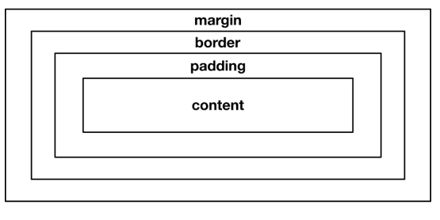
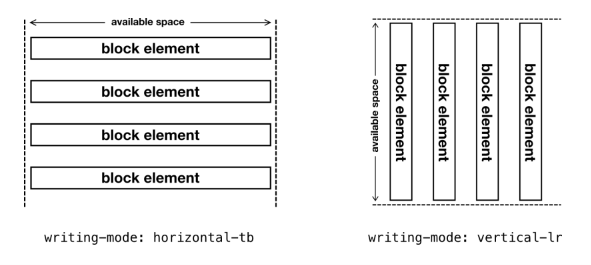
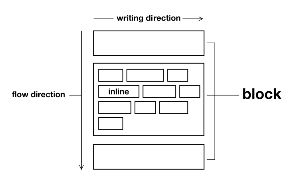
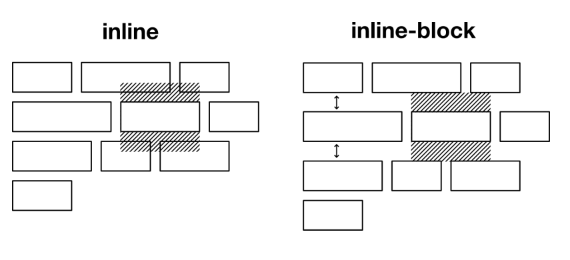
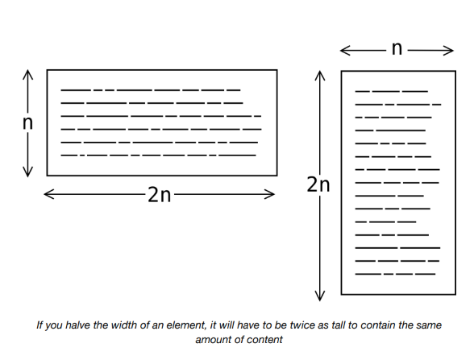
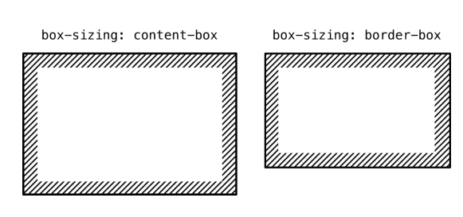
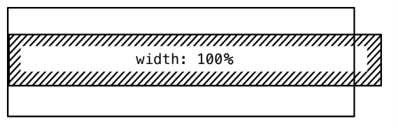

# Cajas

Como Rachel Andrew nos ha recordado, [*todo en el diseño web es una caja*↗ ](https://www.smashingmagazine.com/2019/05/display-box-generation/), o la ausencia de una caja. No todo se ve necesariamente como una caja — `border-radius`, `clip-path` y `transform` pueden ser engañosos — pero todo ocupa un espacio con forma de caja. El layout es, inevitablemente, la disposición de cajas.

Antes de embarcarse en combinar cajas para hacer *layouts compuestos*,  es importante familiarizarse con cómo las cajas mismas están diseñadas para comportarse por defecto.

## El modelo de caja (*box model*)

El  [*box model*](https://www.w3.org/TR/CSS2/box.html#box-dimensions) es la fórmula sobre la cual se basan las cajas de layout, y comprende contenido (*content*), relleno (*padding*), borde (*border*) y margen (*margin*). CSS nos permite alterar estos valores para cambiar el tamaño y la forma general de la visualización de los elementos.



Los navegadores web aplican estilos CSS por defecto (*user agent styles*) a algunos elementos, lo que significa que se distribuyen de una forma razonablemente legible, incluso donde no se ha aplicado CSS del autor.

En Chrome, los estilos de agente de usuario por defecto para los párrafos (`<p>`) se ven así:

```css linenums="1"
p {
  display: block;
  margin-block-start: 1em;
  margin-block-end: 1em;
  margin-inline-start: 0px;
  margin-inline-end: 0px;
}
```

... y los estilos para listas desordenadas (`<ul>`) se ven así:

```css linenums="1"
ul {
  display: block;
  list-style-type: disc;
  margin-block-start: 1em;
  margin-block-end: 1em;
  margin-inline-start: 0px;
  margin-inline-end: 0px;
  padding-inline-start: 40px;
}
```

## La propiedad `display`

En ambos ejemplos anteriores, la propiedad `display` del elemento está establecida como `block`. Los elementos en bloque asumen todo el espacio disponible en una dimensión. Típicamente, esta es la dimensión horizontal, porque `writing-mode` está establecido como `horizontal-tb` (horizontal; con una dirección de flujo de arriba a abajo). En algunos casos, y para algunos idiomas [como el japonés↗](https://w3c.github.io/i18n-drafts/articles/vertical-text/index.en) , `vertical-rl` es el modo de escritura apropiado.



!!! example "`writing-mode`: `horizontal-tb`"

    <div class="contenedor-1">
          <div class="contenedor-1-display">Block Element</div>
          <div class="contenedor-1-display">Block Element</div>
          <div class="contenedor-1-display">Block Element</div>
    </div>

      ```css hl_lines="2"
      .contenedor-1 {
            writing-mode: horizontal-tb;
        }

      .contenedor-1-display {
            margin-bottom: 5px;
            border-radius: 3px;
            background-color:#1976d2;
            padding: 10px;
            
        }

      ```
       

!!! example "`writing-mode`: `vertical-lr`"

    <div class="containerr-2">
          <div class="containerr-2-display">Block Element</div>
          <div class="containerr-2-display">Block Element</div>
          <div class="containerr-2-display">Block Element</div>
    </div>

      ```css hl_lines="2"
      .contenedor-2 {
          writing-mode: vertical-lr;
        }

      .contenedor-2-display {
        margin: 5px;
        border-radius: 3px;
        background-color:#1976d2;
        padding: 10px;
            
        }

      ```
       
### Elementos inline

Los elementos *inline* (con el valor `display: inline`) se comportan de manera diferente. Se distribuyen dentro del contexto actual, siguiendo el modo de escritura y la dirección en línea (`direction`). Solo son tan anchos como su contenido y se colocan adyacentemente donde haya espacio para hacerlo.Los elementos en bloque siguen la *dirección de flujo* (*flow direction*), y los elementos inline siguen la *dirección de escritura* (*writing direction*). 



Pensando tipográficamente, podría decirse que los elementos en bloque son como párrafos, y los elementos inline son como palabras.

Los elementos en bloque (también llamados elementos de *bloque*) te brindan control sobre ambas dimensiones (horizontal y vertical) de la caja. Es decir, puedes aplicar `width`, `height`, `margin` y `padding` a un elemento en bloque y tendrán efecto. Por otro lado, los elementos inline tienen un tamaño determinado por su contenido (los valores prescritos de `width` y `height` no tienen efecto) y solo se permiten valores de `margin` y `padding` en la dimensión inline. Los elementos inline están diseñados para conformarse al flujo de colocación horizontal entre otros elementos inline.

### `display: none`

Una propiedad de visualización relativamente nueva, `inline-block` es un híbrido de `block` y `inline` . Puedes establecer propiedades verticales en los elementos `inline-block`,aunque esto no siempre es deseable, como se muestra en el siguiente ejemplo.



De los tipos básicos, solo queda `display: none`. Este valor elimina el elemento del layout por completo. No tiene presencia visual ni impacto en el layout de los elementos circundantes. Es como si el elemento mismo hubiera sido eliminado del HTML. En consecuencia, los navegadores no comunican la presencia o el contenido de los elementos con `display: none` a las tecnologías de asistencia como los lectores de pantalla (*screen readers*).

## Contextos de formato (*formatting contexts*)

Cuando aplicas `display: flex` o `display: grid` a un `<div>`, este continúa comportándose como un elemento en bloque, usando `display: block`. Sin embargo, cambia la forma en que se comportan sus elementos *hijos*. Por ejemplo, con solo `display: flex` (y sin otras propiedades relacionadas con Flexbox) aplicado al padre, sus hijos se distribuirán horizontalmente. O, dicho de otro modo, la *dirección de flujo* (*flow direction*) se cambia de vertical a horizontal.

Los contextos de formato son la base de muchos de los layouts documentados en este proyecto. Convierten los elementos en componentes de layout. En *Composición*, exploraremos cómo diferentes contextos de formato pueden anidarse para crear layouts compuestos.

## Contenido en cajas

La web es un conducto para información principalmente textual, complementada por medios como imágenes y videos, a menudo referidos colectivamente como *contenido*. Los navegadores incorporan algoritmos de ajuste de línea (*line wrapping*) y desplazamiento (*scrolling*) para asegurar que el contenido se transmita al usuario en su totalidad, independientemente del tamaño y dimensión de su pantalla, y de configuraciones como el nivel de zoom. La web es en gran medida *responsiva* ↗ por defecto.

Sin intervención, es el contenido de un elemento lo que determina su tamaño y forma. El contenido hace que los elementos crezcan horizontalmente y los elementos crecen verticalmente. Dejado a su suerte, el *tamaño* de una caja está determinado por el área del contenido que contiene. Debido a que el contenido web es *dinámico* (sujeto a cambios), las representaciones estáticas de los layouts web son extremadamente engañosas. Trabajar directamente con CSS y su flexibilidad desde el principio, como hacemos aquí, es altamente recomendable.



## La propiedad `box-sizing`

Por defecto, las dimensiones de una caja son las dimensiones del *contenido* de la caja *más* sus valores de `padding` y `border` (implícitamente: `box-sizing: content-box`). Es decir, si estableces que un elemento tenga `10rem` de ancho, luego agregas `1rem` de padding a cada lado, tendrá `12rem` de ancho: `10rem` más `1rem` de padding izquierdo y `1rem` de padding derecho.

Si optas por `box-sizing: border-box`, el área de contenido se reduce para acomodar el padding y el ancho total equivale al ancho prescrito de `10rem`.



Generalmente, se considera preferible usar el modelo `border-box` para todas las cajas. Hace que calcular/anticipar las dimensiones de las cajas sea más fácil.

Cualquier estilo, como `box-sizing: border-box`, que sea aplicable a *todos* los elementos se aplica mejor usando el selector universal (`*`). Como se cubre en detalle en *Estilos globales y locales*, poder afectar el layout de múltiples elementos (en este caso, *todos* los elementos) simultáneamente es cómo CSS aporta eficiencia al diseño de layouts.

```css linenums="1"
* {
  box-sizing: border-box;
}
```

## Excepciones

Hay excepciones a esta regla general, como en el *Center layout* donde la medición del *contenido* es crítica. La *cascada* de CSS está diseñada para acomodar excepciones a las reglas generales.

```css linenums="1"
* {
  box-sizing: border-box;
}
.center-l {
  box-sizing: content-box;
}
```

Solo cuando la altura o el ancho de una caja está restringida, la diferencia entre `border-box` y `content-box` entra en juego. A modo de ilustración, considera un elemento en bloque colocado dentro de otro elemento en bloque. Usando el modelo `border-box` y un padding de `1rem`, el elemento hijo desbordará (*overflow*) por `2rem` cuando se aplique `width: 100%`.



¿Por qué? Porque `width: 100%` significa "haz que el ancho de este elemento sea igual al del elemento padre". Ya que estamos usando el modelo `content-box`, el `content` se hace `100%` de ancho, luego el padding se suma a este valor.

Pero si usamos `width: auto` (podemos simplemente eliminar `width: 100%`, ya que `width: auto` es el valor por defecto) la caja hija encaja perfectamente dentro de la caja padre. E independientemente del valor `box-sizing`


Implicitamente, el `height` también está configurado como `auto`, lo que significa que se deriva del contenido. Nuevamente, `box-sizing` no tiene efecto.

La lección aquí es que las dimensiones de nuestros elementos deberían derivarse en gran medida de su contenido interno y contexto externo. Cuando tratamos de prescribir dimensiones, las cosas tienden a salir mal. Todo lo que deberíamos hacer como diseñadores visuales es hacer sugerencias sobre cómo debería tomar forma el layout. Podríamos, por ejemplo, aplicar un `min-height` (como en el *Cover layout*) u ofrecer un `flex-basis` (como en el *Sidebar*).

El CSS de la sugerencia está en el corazón del diseño de layout algorítmico. En lugar de decirle a los navegadores qué hacer, permitimos que los navegadores hagan sus propios cálculos y saquen sus propias conclusiones, para adaptarse mejor al usuario, su pantalla y su dispositivo. Nadie debería experimentar contenido oscurecido bajo ninguna circunstancia.


