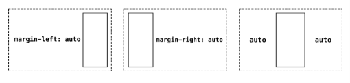
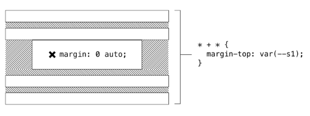
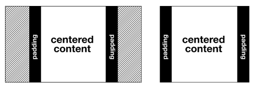
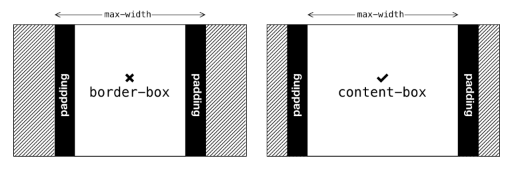
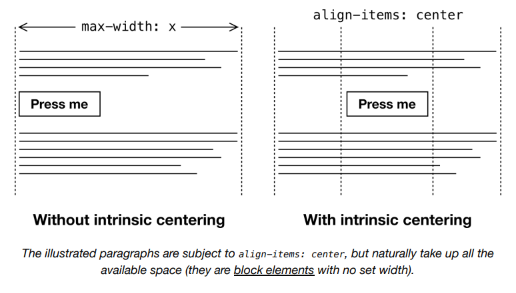

# The Center

## El problema

En los primeros días de HTML, existían varios elementos de presentación; elementos diseñados puramente para afectar la apariencia de su contenido. El `<center>` ↗ era uno de esos elementos, pero hace tiempo que se considera obsoleto. Curiosamente, todavía es compatible en algunos navegadores, incluido Google Chrome. Presumiblemente esto se debe a que la página de búsqueda de Google todavía usa un `<center>` para centrar su famoso input de búsqueda.

Dejando de lado el uso caprichoso de elementos obsoletos por parte de los gigantes tecnológicos, en su mayoría nos alejamos del uso de marcado de presentación en los años 2000. Al hacer que el estilo sea responsabilidad de una tecnología separada —CSS— pudimos gestionar el estilo y la estructura por separado. En consecuencia, un cambio en la dirección de arte ya no significaría reconstituir nuestro contenido.

Más tarde descubrimos que estilizar HTML puramente en términos de semántica y contexto era bastante ambicioso, y llevó a selectores poco manejables como:

```css linenums="1"
body > div > div > a {
  /* Estilos de enlace específicamente para enlaces
     anidados dos <div>s dentro del elemento body */
}
```

Por el bien de un mantenimiento de CSS más fácil y la modularidad del estilo, muchos de nosotros adoptamos una posición de compromiso usando clases. Debido a que las clases se pueden colocar en cualquier elemento, somos libres de estilizar, por ejemplo, un `<div>` no semántico o un `<nav>` reconocido por lectores de pantalla exactamente de la misma manera, usando el mismo token, pero sin comprometer la accesibilidad.

```html linenums="1"
<div class="text-align:center"></div>
<nav class="text-align:center"></nav>
```

## Convenciones de nomenclatura

Notarás mi convención de nomenclatura *on the nose* (directa) en el ejemplo anterior. Mi elección de nomenclatura para las clases de utilidad se cubre en la sección *Measure*. En resumen, la estructura `property-name:value` está diseñada para ayudar con el recuerdo.

Todo lo que `<center>` hacía, y todo lo que `text-align: center` hace, es centrar texto. Y para la mayoría del contenido —especialmente contenido que incluye texto de párrafo— querrás evitarlo. *Es terrible para la legibilidad* ↗.

Pero lo que sería útil es un componente que pueda crear una columna centrada horizontalmente. Con tal componente, podríamos crear una 'franja' centrada de contenido dentro de cualquier contenedor, limitando su ancho para preservar una *medida* razonable.

## La solución

Una de las formas más fáciles de resolver una columna centrada es usar márgenes `auto`. La palabra clave `auto`, como su nombre lo sugiere, le indica al navegador que calcule el margen por ti. Es quizás uno de los ejemplos más rudimentarios de una técnica CSS *algorithmica*: una que difiere a la lógica del navegador para determinar el layout en lugar de 'codificar' un valor específico.



Mis primeras columnas centradas usaban el shorthand `margin`, a menudo en el elemento `<body>`.

```css linenums="1"
.center {
  max-width: 60ch;
  margin: 0 auto;
}
```

El problema con el shorthand `margin` — aunque ahorra unos bytes — es que tienes que declarar ciertos valores, incluso cuando no son aplicables. Es importante establecer solo los valores CSS necesarios para lograr el layout específico que intentas. Nunca sabes qué valores inferidos o heredados podrías estar deshaciendo.

Por ejemplo, podría querer colocar mi elemento personalizado `<center-l>` dentro de un contexto `Stack`. `Stack` establece `margin-top` en sus hijos, y cualquier `<center-l>` con `margin: 0 auto` desharía eso.



En su lugar, podría usar las propiedades explícitas `margin-left` y `margin-right`. De esta forma, cualquier margen vertical aplicado contextualmente se preservaría, y el componente estaría preparado para la composición/anidación entre otros componentes de layout.

```css linenums="1"
.center {
  max-width: 60ch;
  margin-left: auto;
  margin-right: auto;
}
```

## Medida

El `max-width` debería típicamente — como en el ejemplo de código anterior — establecerse en `ch`, ya que lograr una medida razonable es primordial. La sección *Axioms* detalla cómo establecer una medida razonable.

## Margen mínimo

En un contexto más estrecho que `60ch`, el contenido actualmente quedará pegado a cualquiera de los lados del elemento padre o viewport. En lugar de permitir que esto suceda, deberíamos asegurar un espacio *mínimo* a cada lado.

Necesito abordar esto de una manera que preserve el centrado y el ancho máximo. Como no podemos entrar en un cálculo con `auto` (como `calc(auto + 1rem)`), probablemente deberíamos delegar en `padding`.



Pero tengo que tener cuidado con el modelo de caja. Si, como se sugirió en *Boxes*, he configurado todos los elementos para adoptar `box-sizing: border-box`, cualquier `padding` agregado a mi `<center-l>` contribuirá al total de `60ch`. En otras palabras, agregar `padding` hará que el *contenido* de mi elemento sea más estrecho. Sin embargo, como se cubre en *Axioms*, CSS está diseñado para excepciones. Solo necesito sobrescribir con `box-sizing: content-box`, y permitir que el `padding` 'crezca hacia afuera' desde el umbral de contenido de `60ch`.



Aquí hay una versión que preserva el `max-width` de `60ch`, pero asegura que haya, al menos, "márgenes" a cada lado (`var(--s1)` es el primer punto en la escala modular basada en propiedades personalizadas).

```css linenums="1"
.center {
  box-sizing: content-box;
  max-width: 60ch;
  margin-left: auto;
  margin-right: auto;
  padding-left: var(--s1);
  padding-right: var(--s1);
}
```

## Centrado intrínseco

La solución de `margin: auto` es consagrada y perfectamente funcional. Pero hay una oportunidad usando el módulo de layout Flexbox para soportar el centrado *intrínseco*. Esto es, centrar elementos basándose en sus anchos naturales basados en el contenido. Considera el siguiente código.

```css linenums="1"
.center {
  box-sizing: content-box;
  max-width: 60ch;
  margin-left: auto;
  margin-right: auto;
  display: flex;
  flex-direction: column;
  align-items: center;
}
```

Dentro de un componente `<center-l>`, esperaría que los contenidos se organizaran verticalmente, como una columna, de ahí `flex-direction: column`. Esto me permite establecer `align-items: center`, que centrará cualquier hijo *independientemente* de su ancho.

El resultado es que cualquier elemento que sea más estrecho que `60ch` se centrará automáticamente dentro del área de `60ch`. Estos elementos pueden incluir elementos naturalmente pequeños como botones, o elementos con su propio `max-width` establecido bajo `60ch`.



> Los párrafos ilustrados están sujetos a `align-items: center`, pero naturalmente ocupan todo el espacio disponible (son elementos `block` sin ancho establecido).

## ⚠ Accesibilidad

Ten en cuenta que, cada vez que mueves contenido lejos del borde izquierdo (en una dirección de escritura de izquierda a derecha), hay un posible problema de accesibilidad. Cuando un usuario ha hecho zoom en la interfaz, es posible que el contenido centrado se haya movido fuera del viewport. Puede que nunca se den cuenta de que está ahí.

Mientras tu interfaz sea flexible y responsiva, y no se establezca un ancho fijo en el contenedor, el contenido centrado debería ser visible en la mayoría de las circunstancias.

## Casos de uso

Siempre que desees centrar algo horizontalmente, el `Center` es tu amigo. En el siguiente ejemplo, estoy emulando el layout básico para el sitio de documentación de *Every Layout* (que puedes estar viendo ahora, a menos que estés leyendo el EPUB). Comprende un `Sidebar`, con un `Center` al lado derecho. Los elementos están separados verticalmente tanto en la barra lateral como en el `Center` usando `Stack`. Un `Center` anidado con el booleano `intrinsic` aplicado centra el botón 'Launch demo'.

(Puede que necesites abrirlo en su propia ventana (de escritorio) para ver el centrado en acción.) 

[This interactive demo is only available on the Every Layout site ↗.](https://every-layout.dev/demos/center-documentation-layout/)

## El generador

Usa esta herramienta para generar CSS y HTML básicos de Center.

La herramienta generadora de código solo está disponible en el *sitio de documentación adjunto* ↗. Aquí está la solución básica, con comentarios (omitiendo el código de centrado intrínseco):

**CSS**

```css linenums="1"
.center {
  /* ↓ Elimina el padding del cálculo del ancho */
  box-sizing: content-box;
  /* ↓ El ancho máximo es la medida máxima */
  max-width: 60ch;
  /* ↓ Solo afecta los márgenes horizontales */
  margin-left: auto;
  margin-right: auto;
  /* ↓ Aplica el espacio horizontal mínimo */
  padding-left: var(--s1);
  padding-right: var(--s1);
}
```

**HTML**

```html linenums="1"
<div class="center">
  <!-- contenido centrado -->
</div>
```

## El componente

Una implementación de elemento personalizado del `Center` está disponible para descargar ↗.

**API de Props**

Las siguientes props (atributos) harán que el componente se renderice nuevamente cuando se alteren. Pueden ser alterados a mano — en las herramientas de desarrollo del navegador — o como sujetos del estado de la aplicación heredada.

| Nombre | Tipo | Default | Descripción |
|---|---|---|---|
| `max` | string | `"var(--measure)"` | Un valor CSS de `max-width` |
| `andText` | boolean | `false` | Centrar el texto también (`text-align: center`) |
| `gutters` | string | `"0"` | El espacio mínimo a cada lado del contenido |
| `intrinsic` | boolean | `false` | Centrar elementos hijos según su ancho de contenido |

## Ejemplos

### Básico

Puedes crear una página web de una sola columna simplemente anidando un `Stack` dentro de un `Center` dentro de un `Box`. El `Box` teniendo `padding` por defecto significa que proporcionar padding a los lados del `Center` usando la prop `gutters` no es necesario.

```html linenums="1"
<box-l>
  <center-l>
    <stack-l>
      <!-- Cualquier contenido de flujo aquí (encabezados, párrafos, etc.) -->
    </stack-l>
  <center-l>
</box-l>
```

### Layout de documentación

El marcado del ejemplo en *Casos de uso*. En el ejemplo, se han agregado roles de landmarks WAI-ARIA para soporte de lectores de pantalla. Nota que el `Center` se ha envuelto en un contenedor `<div>` genérico. Este `<div>` está sujeto a la lógica del layout `Sidebar`, liberando al `Center` para aplicar su propia lógica dentro de él. El `Sidebar` envuelve cuando el `<div>` comienza a ocupar menos del 66.666% del espacio horizontal disponible. Lee *Sidebar* para una explicación completa.

```html linenums="1"
<sidebar-l contentMin="66.666%" sideWidth="10rem">
  <stack-l role="navigation">
    <!-- elementos de navegación (API refs) -->
  </stack-l>
  <div>
    <center-l role="main">
      <!-- contenido principal de la página -->
    </center-l>
  </div>
</sidebar-l>
```

### Centrado vertical y horizontal

Usando composición y el componente `Cover`, es trivial centrar un elemento horizontal *y* verticalmente. El booleano `intrinsic` se usa aquí para centrar el párrafo independientemente del ancho de su contenido.

```html linenums="1"
<cover-l centered="center-l">
  <center-l intrinsic>
    <p>Estoy en el centro absoluto.</p>
  </center-l>
</cover-l>
```

