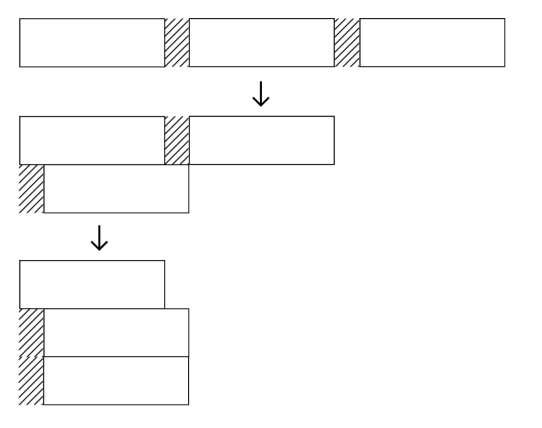
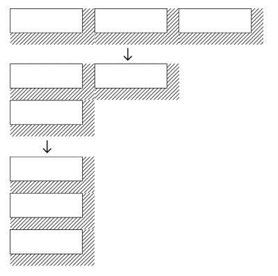
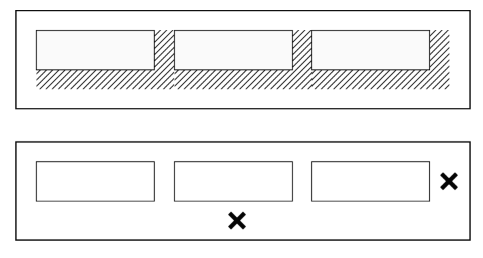
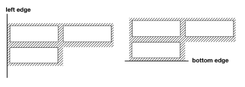
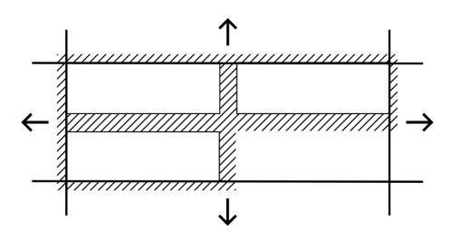
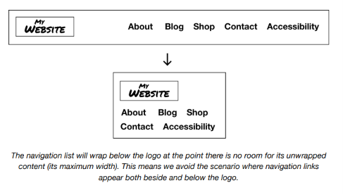

# The Cluster

## El problema

A veces las cuadrículas (*grids*) son un marco apropiado para distribuir contenido, porque quieres que ese contenido se alinee estrictamente a las líneas horizontales y verticales que son esos límites de filas y columnas.

Pero no todo se beneficia de esta rigidez prescrita — al menos no en todas las circunstancias. El texto mismo no puede adherirse a las estricturas de una cuadrícula, porque las palabras vienen en diferentes formas y longitudes. En su lugar, el algoritmo de ajuste de texto del navegador distribuye el texto para llenar el espacio disponible lo mejor que puede. El texto alineado a la izquierda tiene un borde derecho 'irregular', porque cada línea será inevitablemente de una longitud diferente.

Gracias al leading (`line-height`) y los espacios entre palabras (el carácter `U+0020` SPACE, o una pulsación de tecla para ti), las palabras pueden espaciarse razonablemente de manera uniforme, a pesar de su diversidad de forma. Cuando estamos tratando con grupos de elementos de tamaño/forma indeterminada, a menudo nos gustaría que se distribuyeran de una manera igualmente fluida.

Un enfoque es establecer el valor `display` de estos elementos a `inline-block`. Esto te da cierto control sobre el `padding` y `margin` mientras retiene el tamaño intrínseco. Esto es, los elementos aún se dimensionan según las dimensiones de su contenido.

Sin embargo, como las palabras, los elementos `inline-block` todavía están separados por caracteres de espacio (cuando están presentes en el código fuente). El ancho de este espacio se sumará a cualquier `margin` que apliques. Este espacio se puede eliminar, pero solo estableciendo `font-size: 0` en el padre, y restableciendo el valor en los hijos.

```css linenums="1"
.parent {
  font-size: 0;
}
.parent > * {
  font-size: 1rem;
}
```

Esto tiene la desventaja de que no podemos usar `em` en mis elementos hijos porque sería igual a `0`. En su lugar, necesitamos establecer el `font-size` relativo al elemento `:root` con la unidad `rem`. El tener que restablecer el tamaño de fuente de esta manera es algo restrictivo.

Incluso con el espacio eliminado, todavía hay problemas de márgenes relacionados con el wrapping. Si se aplica `margin` a elementos sucesivos, la apariencia es aceptable donde no ocurre wrapping. Pero donde ocurre wrapping, hay indentaciones inesperadas contra el lado alineado, y el espaciado vertical falta por completo.



Una solución parcial es posible colocando márgenes derecho e inferior en cada elemento.



Sin embargo, esto solo resuelve el caso de alineación a la izquierda — además, se produce espacio duplicado donde el margen sobrante interactúa con el `padding` de un elemento padre.



## La solución

Para crear un sistema de diseño eficiente y manejable, necesitamos idear soluciones robustas y generales para nuestros problemas de layout.

Primero, hacemos del padre un contexto Flexbox. Esto nos permite configurar los elementos en grupos (*clusters*), sin tener que lidiar con espacios de palabras no deseados. También tiene varias ventajas sobre el uso de floats: no necesitamos proporcionar un *clear fix* ↗, y la alineación vertical (usando `align-items`) es posible.

```css linenums="1"
.cluster {
  display: flex;
  flex-wrap: wrap;
}
```

## Agregando y oscureciendo el margen

La única forma en que actualmente podemos agregar márgenes que respeten el comportamiento de wrapping, independientemente de la alineación elegida, es agregarlos *simétricamente*; a todos los lados. Desafortunadamente, esto separa los elementos de cualquier borde con el que entren en contacto.



Nota que el valor del espacio entre un elemento hijo y el borde de un elemento padre es siempre la *mitad* del espacio entre dos elementos hijos (ya que sus márgenes se combinan). La solución es usar un margen negativo en el padre para *atraer* a los hijos hacia sus propios bordes.



Podemos hacer que la creación de espacio en el componente sea más fácil usando propiedades personalizadas. La variable `--space` define el espaciado deseado entre elementos, y `calc()` adapta este valor en consecuencia. Nota que se incluye un elemento envoltorio adicional para *aislar* el contenido adyacente del margen negativo. Aún queremos que el componente respete el espacio en blanco aplicado por un componente padre `Stack`.

```css linenums="1"
.cluster {
  --space: 1rem;
}
.cluster > * {
  display: flex;
  flex-wrap: wrap;
  /* ↓ multiplicar por -1 para negar el valor dividido */
  margin: calc(var(--space) / 2 * -1);
}
.cluster > * > * {
  /* ↓ la mitad del valor, por la 'duplicación' */
  margin: calc(var(--space) / 2);
}
```

## La propiedad gap

Creo que estarás de acuerdo en que la técnica anterior es un poco engorrosa. También puede causar la aparición de la barra de desplazamiento horizontal, bajo algunas circunstancias.

Afortunadamente, desde mediados de 2021, *todos los navegadores principales ahora soportan la propiedad `gap` con Flexbox* ↗. La propiedad `gap` inyecta espaciado *entre* los elementos hijos, eliminando la necesidad de márgenes negativos y del elemento envoltorio adicional. Incluso el `calc()` se puede jubilar, ya que el valor de `gap` es ¡solo ese!

```css linenums="1"
.cluster {
  display: flex;
  flex-wrap: wrap;
  gap: var(--space, 1rem);
}
```

## Valores de respaldo (fallback)

Observa cómo estamos definiendo y declarando el valor `gap` todo en una línea. El segundo argumento de la función `var()` es el *valor de respaldo* para cuando la variable no está definida ↗.

## Degradación elegante

A pesar de la tranquilizadora imagen de soporte para `gap`, debemos ser conscientes del layout en navegadores donde no es compatible. Problemáticamente, `gap` puede ser compatible con el módulo Grid layout (ver *Grid*) pero no con Flexbox, por lo que usar `gap` en un bloque `@supports` puede dar un falso positivo.

En navegadores donde `gap` solo es compatible con el módulo Grid, lo siguiente resultaría en que no se aplique ningún margen.

```css linenums="1"
/* Esto no funcionará */
.cluster > * {
  display: flex;
  flex-wrap: wrap;
  margin: 1rem;
}
@supports (gap: 1rem) {
  .cluster > * {
    margin: 0;
  }
  .cluster {
    gap: var(--space, 1rem);
  }
}
```

Hoy en día, recomendamos usar `gap` sin detección de características, aceptando que los layouts se volverán *flush* (pegados) en navegadores más antiguos. Incluimos la técnica de margen negativo arriba si esa es tu preferencia.

## Justificación

Los grupos o *clusters* de elementos pueden tomar cualquier valor de `justify-content`, y el espacio/gap se respetará independientemente del wrapping. Alinear el `Cluster` a la derecha sería un caso para `justify-content: flex-end`.

En la demostración a seguir, un `Cluster` contiene una lista de palabras clave enlazadas. Esto se coloca dentro de un `Box` con un valor de `padding` igual al del espacio del `Cluster`.

*Esta demostración interactiva solo está disponible en el sitio de Every Layout* ↗.

## Casos de uso

Los componentes `Cluster` son adecuados para cualquier grupo de elementos que difieran en longitud y sean propensos a hacer wrap. Los botones que aparecen juntos al final de los formularios son candidatos ideales, así como las listas de etiquetas, palabras clave u otra meta-información. Usa el `Cluster` para alinear cualquier grupo de elementos distribuidos horizontalmente a la izquierda o derecha, o en el centro.

Aplicando `justify-content: space-between` y `align-items: center` puedes incluso diseñar el encabezado de tu página con logo y navegación. Esto hará wrap de forma natural, y sin necesidad de un breakpoint `@media`:



> La lista de navegación hará wrap debajo del logo en el punto donde no haya espacio para su contenido sin wrap (su ancho máximo). Esto significa que evitamos el escenario donde los enlaces de navegación aparecen tanto al lado como debajo del logo.

A continuación hay una demostración del layout de encabezado mencionado, usando una estructura anidada. El `Cluster` exterior usa `justify-content: space-between` y `align-items: center`. El `Cluster` para los enlaces de navegación usa `justify-content: flex-start` para alinear sus elementos a la izquierda después del wrapping.

*Esta demostración interactiva solo está disponible en el sitio de Every Layout* ↗.

## El generador

Usa esta herramienta para generar CSS y HTML básicos de Cluster.

La herramienta generadora de código solo está disponible en el *sitio de documentación adjunto* ↗. Aquí está la solución básica, con comentarios:

**CSS**

```css linenums="1"
.cluster {
  /* ↓ Establece el contexto Flexbox */
  display: flex;
  /* ↓ Habilita el wrapping */
  flex-wrap: wrap;
  /* ↓ Establece el espacio/gap */
  gap: var(--space, 1rem);
  /* ↓ Elige tu justificación (flex-start es el defecto) */
  justify-content: center;
  /* ↓ Elige tu alineación (flex-start es el defecto) */
  align-items: center;
}
```

**HTML**

```html linenums="1"
<ul class="cluster">
  <li><!-- hijo --></li>
  <li><!-- hijo --></li>
  <li><!-- etc --></li>
</ul>
```

## El componente

Una implementación de elemento personalizado del `Cluster` está disponible para descargar ↗.

**API de Props**

Las siguientes props (atributos) harán que el componente se renderice nuevamente cuando se alteren. Pueden ser alterados a mano — en las herramientas de desarrollo del navegador — o como sujetos del estado de la aplicación heredada.

| Nombre | Tipo | Default | Descripción |
|---|---|---|---|
| `justify` | string | `"flex-start"` | Un valor CSS de `justify-content` |
| `align` | string | `"flex-start"` | Un valor CSS de `align-items` |
| `space` | string | `"var(--s1)"` | Un valor CSS de `gap`. El espacio mínimo entre los elementos hijos del cluster. |

## Ejemplos

### Básico

Usando los valores por defecto.

```html linenums="1"
<cluster-l>
  <!-- elemento hijo aquí -->
  <!-- otro elemento hijo -->
  <!-- etc -->
  <!-- etc -->
  <!-- etc -->
  <!-- etc -->
</cluster-l>
```

### Lista

Dado que los `Clusters` típicamente representan grupos de elementos similares, se benefician de ser marcados como una lista. Los elementos de lista presentan información no visual, para el software lector de pantalla. Es importante que los usuarios de lectores de pantalla sean conscientes de que *hay* una lista presente, y cuántos elementos contiene.

Dado que nuestro elemento personalizado `<cluster-l>` no es un `<ul>` (y los elementos `<li>` no pueden existir sin un padre `<ul>`), podemos proporcionar la semántica de lista usando ARIA en su lugar: `role="list"` y `role="listitem"`:

```html linenums="1"
<cluster-l role="list">
  <div role="listitem"><!-- contenido del primer elemento de la lista --></div>
  <div role="listitem"><!-- contenido del segundo elemento de la lista --></div>
  <div role="listitem"><!-- etc --></div>
  <div role="listitem"><!-- etc --></div>
</cluster-l>
```
