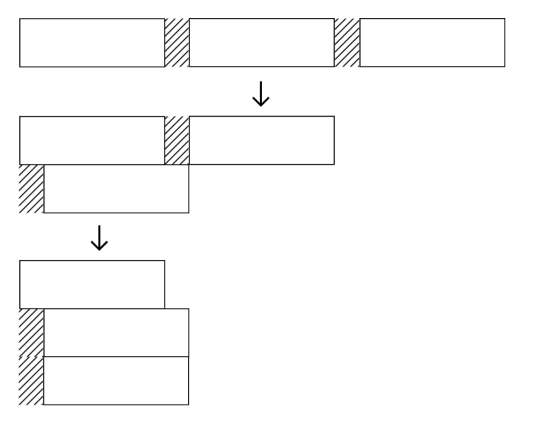
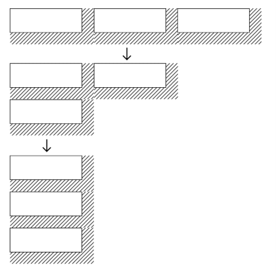
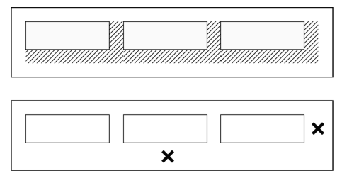
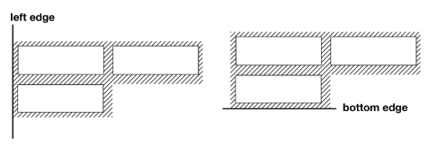
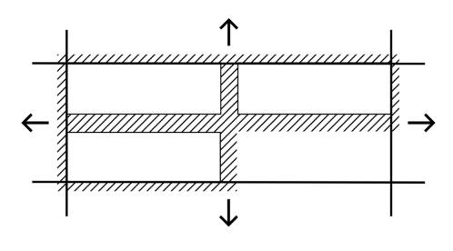
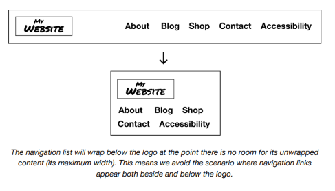

# The Cluster

## El problema

A veces las cuadrículas (*grids*) son un marco apropiado para distribuir contenido, porque quieres que ese contenido se alinee estrictamente a las líneas horizontales y verticales que son esos límites de filas y columnas.

Pero no todo se beneficia de esta rigidez prescrita — al menos no en todas las circunstancias. El texto mismo no puede adherirse a las estricturas de una cuadrícula, porque las palabras vienen en diferentes formas y longitudes. En su lugar, el algoritmo de ajuste de texto del navegador distribuye el texto para llenar el espacio disponible lo mejor que puede. El texto alineado a la izquierda tiene un borde derecho 'irregular', porque cada línea será inevitablemente de una longitud diferente.

Gracias al leading (`line-height`) y los espacios entre palabras (el carácter `U+0020` SPACE, o una pulsación de tecla para ti), las palabras pueden espaciarse razonablemente de manera uniforme, a pesar de su diversidad de forma. Cuando estamos tratando con grupos de elementos de tamaño/forma indeterminada, a menudo nos gustaría que se distribuyeran de una manera igualmente fluida.

Un enfoque es establecer el valor `display` de estos elementos a `inline-block`. Esto te da cierto control sobre el `padding` y `margin` mientras retiene el tamaño intrínseco. Esto es, los elementos aún se dimensionan según las dimensiones de su contenido.

Sin embargo, como las palabras, los elementos `inline-block` todavía están separados por caracteres de espacio (cuando están presentes en el código fuente). El ancho de este espacio se sumará a cualquier `margin` que apliques. Este espacio se puede eliminar, pero solo estableciendo `font-size: 0` en el padre, y restableciendo el valor en los hijos.

```css linenums="1"
.parent {
  font-size: 0;
}
.parent > * {
  font-size: 1rem;
}
```

Esto tiene la desventaja de que no podemos usar `em` en mis elementos hijos porque sería igual a `0`. En su lugar, necesitamos establecer el `font-size` relativo al elemento `:root` con la unidad `rem`. El tener que restablecer el tamaño de fuente de esta manera es algo restrictivo.

Incluso con el espacio eliminado, todavía hay problemas de márgenes relacionados con el wrapping. Si se aplica `margin` a elementos sucesivos, la apariencia es aceptable donde no ocurre wrapping. Pero donde ocurre wrapping, hay indentaciones inesperadas contra el lado alineado, y el espaciado vertical falta por completo.



Una solución parcial es posible colocando márgenes derecho e inferior en cada elemento.



Sin embargo, esto solo resuelve el caso de alineación a la izquierda — además, se produce espacio duplicado donde el margen sobrante interactúa con el `padding` de un elemento padre.



??? info "Explicacion"

    Claro. Este texto de **Every Layout** está preparando el terreno para explicar el componente **Cluster**. La idea central es bastante sencilla:

    > **Cluster sirve para colocar elementos en una fila flexible que puede saltar a varias líneas, manteniendo un espaciado uniforme.**

    Vamos paso a paso.

    ---

    __1. ¿Cuál es el problema que quiere resolver?__

    Imagina que tienes varios elementos:

    ```html
    <div class="parent">
      <a>Inicio</a>
      <a>Productos</a>
      <a>Servicios</a>
      <a>Contacto</a>
    </div>
    ```

    Podrías usar **CSS Grid**:

    ```css
    .parent {
      display: grid;
    }
    ```

    Pero Grid funciona muy bien cuando quieres que los elementos respeten una estructura rígida de **filas y columnas**.

    Por ejemplo:

    ```text
    ┌──────────┬──────────┬──────────┐
    │ Producto │ Producto │ Producto │
    ├──────────┼──────────┼──────────┤
    │ Producto │ Producto │ Producto │
    └──────────┴──────────┴──────────┘
    ```

    Cada elemento se coloca dentro de una celda.

    El problema es que hay situaciones donde **no quieres esa rigidez**.

    ---

    __2. El texto es un buen ejemplo__

    Mira este párrafo:

    ```text
    Hola, mi nombre es Alex y estoy aprendiendo
    CSS y diseño de interfaces web.
    ```

    El navegador no dice:

    > "Cada línea debe tener exactamente 20 caracteres".

    No.

    El navegador intenta aprovechar el espacio disponible:

    ```text
    Hola, mi nombre es Alex y estoy aprendiendo
    CSS y diseño de interfaces web.
    ```

    Si reduces la pantalla:

    ```text
    Hola, mi nombre es Alex y estoy
    aprendiendo CSS y diseño de
    interfaces web.
    ```

    El texto se adapta automáticamente.

    Esto es importante:

    > **El contenido determina cómo se distribuye.**

    No estás imponiendo una cuadrícula rígida.

    ---

    __3. El concepto de tamaño intrínseco__

    Esto conecta directamente con lo que veníamos hablando sobre **intrinsic**.

    Supongamos:

    ```html
    <a>Inicio</a>
    <a>Productos</a>
    <a>Contacto</a>
    ```

    Cada elemento tiene un tamaño diferente porque su contenido tiene una longitud diferente:

    ```text
    ┌────────┐
    │ Inicio │
    └────────┘

    ┌─────────────┐
    │  Productos  │
    └─────────────┘

    ┌────────────┐
    │  Contacto  │
    └────────────┘
    ```

    El tamaño se adapta al contenido.

    Eso es comportamiento **intrínseco**.

    No dices:

    ```css
    width: 150px;
    ```

    para todos.

    Cada elemento dice, básicamente:

    > "Yo necesito el espacio que necesito".

    ---

    __4. Una primera solución: `inline-block`__

    El texto menciona:

    ```css
    .parent > * {
      display: inline-block;
    }
    ```

    Esto permite que los elementos se comporten un poco como palabras.

    Por ejemplo:

    ```html
    <div class="parent">
      <button>Inicio</button>
      <button>Productos</button>
      <button>Servicios</button>
      <button>Contacto</button>
    </div>
    ```

    Visualmente:

    ```text
    [Inicio] [Productos] [Servicios] [Contacto]
    ```

    Y si no hay espacio:

    ```text
    [Inicio] [Productos] [Servicios]
    [Contacto]
    ```

    Esto parece exactamente lo que queremos.

    Pero aparece un problema.

    ---

    __5. El problema del espacio entre `inline-block`__

    Mira este HTML:

    ```html
    <div class="parent">
      <button>Uno</button>
      <button>Dos</button>
    </div>
    ```

    Entre los elementos existe un espacio en el código HTML:

    ```html
    <button>Uno</button> [ESPACIO]
    <button>Dos</button>
    ```

    El navegador interpreta ese espacio como un espacio real.

    Por eso:

    ```text
    [Uno] [Dos]
    ```

    Ya existe una separación.

    Si además haces:

    ```css
    button {
      margin: 1rem;
    }
    ```

    terminas con:

    ```text
    [Uno]    [Dos]
    ```

    Porque tienes:

    ```text
    margin + espacio HTML + margin
    ```

    Es decir, el espacio natural del HTML se suma a tus márgenes.

    ---

    __6. La solución extraña: `font-size: 0`__

    El texto propone:

    ```css
    .parent {
      font-size: 0;
    }

    .parent > * {
      font-size: 1rem;
    }
    ```

    ¿Por qué funciona?

    Porque los espacios entre elementos `inline-block` son tratados como caracteres de texto.

    Y si el padre tiene:

    ```css
    font-size: 0;
    ```

    ese espacio tiene un ancho de:

    ```text
    0
    ```

    Por tanto:

    ```text
    [Uno][Dos][Tres]
    ```

    Pero ahora aparece otro problema.

    Si el hijo usa:

    ```css
    font-size: 1em;
    ```

    ¿De dónde toma el `em`?

    Del tamaño de fuente del padre.

    El padre tiene:

    ```css
    font-size: 0;
    ```

    Entonces:

    ```css
    1em = 0
    ```

    Por eso tendrías que usar:

    ```css
    font-size: 1rem;
    ```

    Porque `rem` se calcula respecto al tamaño de fuente del elemento raíz (`:root` / normalmente `<html>`), no respecto al padre.

    Pero esto es bastante incómodo.

    ---

    __7. El problema de los márgenes cuando los elementos hacen `wrap`__

    Ahora viene el problema más importante.

    Imagina:

    ```css
    .item {
      display: inline-block;
      margin: 1rem;
    }
    ```

    Y tienes:

    ```text
    [Uno] [Dos] [Tres] [Cuatro]
    ```

    Todo cabe en una línea.

    Perfecto.

    Pero reduces el ancho:

    ```text
    [Uno] [Dos] [Tres]
    [Cuatro]
    ```

    Ahora aparece el **wrapping**.

    `wrap` significa simplemente:

    > Cuando ya no cabe más contenido en una línea, pasa a la siguiente.

    El problema es que los márgenes no saben que visualmente estás creando una nueva fila.

    Por ejemplo:

    ```text
    ┌──────────────────────────────┐
    │ [Uno] [Dos] [Tres]           │
    │                              │
    │     [Cuatro]                 │
    └──────────────────────────────┘
    ```

    Puede quedar un margen extraño en el lado izquierdo.

    ¿Por qué?

    Porque `margin` pertenece al elemento individual.

    No está pensando:

    > "Ah, ahora soy el primer elemento de una nueva fila".

    Simplemente aplica:

    ```css
    margin: 1rem;
    ```

    a todos.

    ---

    __8. ¿Y si usamos `margin-right` y `margin-bottom`?__

    El libro propone como solución parcial:

    ```css
    .item {
      margin-right: 1rem;
      margin-bottom: 1rem;
    }
    ```

    Entonces:

    ```text
    [Uno] [Dos] [Tres]
    [Cuatro] [Cinco]
    ```

    Puedes obtener algo parecido a:

    ```text
    [Uno] → [Dos] → [Tres] →
    ↓
    [Cuatro] → [Cinco] →
    ↓
    ```

    Cada elemento tiene:

    ```text
    margen derecho
    +
    margen inferior
    ```

    Eso genera separación horizontal y vertical.

    Pero tampoco es perfecto.

    ---

    __9. ¿Cuál es el problema de esta solución?__

    Supongamos que tienes:

    ```text
    [Uno] [Dos] [Tres]
    [Cuatro] [Cinco]
    ```

    Si todos tienen:

    ```css
    margin-right: 1rem;
    ```

    el último elemento de cada fila también tiene margen derecho.

    Entonces:

    ```text
    [Uno] [Dos] [Tres]→
                      ↑
                margen sobrante
    ```

    Y si el contenedor tiene `padding`, puedes terminar con algo como:

    ```text
    ┌──────────────────────────────┐
    │ [Uno] [Dos] [Tres]    ←      │
    │                              │
    │ [Cuatro] [Cinco]      ←      │
    └──────────────────────────────┘
    ```

    Ese margen sobrante se suma al espacio interno del contenedor.

    Y si intentas resolverlo con trucos como:

    ```css
    .item:last-child {
      margin-right: 0;
    }
    ```

    no funciona correctamente cuando hay wrapping.

    Porque `:last-child` solamente identifica el último elemento del **contenedor completo**, no el último elemento de **cada fila visual**.

    CSS no sabe fácilmente cuál es:

    ```text
    último de la primera fila
    último de la segunda fila
    último de la tercera fila
    ```

    ---

    __10. Entonces, ¿qué problema está resolviendo `Cluster`?__

    Aquí está la idea clave:

    El libro está diciendo:

    > Tenemos elementos de tamaño intrínseco. Queremos colocarlos uno al lado del otro. Queremos que se ajusten automáticamente cuando no haya espacio. Y queremos que la separación entre ellos sea uniforme, tanto horizontal como verticalmente.

    Es decir:

    ```text
    Pantalla grande

    [ A ] [ B ] [ C ] [ D ] [ E ]
    ```

    Pantalla más pequeña:

    ```text
    [ A ] [ B ] [ C ]
    [ D ] [ E ]
    ```

    Pantalla aún más pequeña:

    ```text
    [ A ] [ B ]
    [ C ] [ D ]
    [ E ]
    ```

    Y queremos que **todo siga teniendo un espacio consistente**, sin tener que calcular manualmente:

    * cuál es el último elemento de cada fila;
    * dónde quitar márgenes;
    * cuánto espacio queda al borde;
    * cómo eliminar espacios del HTML;
    * cómo gestionar el wrapping.

    ---

    __11. La solución moderna: Flexbox + `gap`__

    Aquí es donde entra **Cluster**.

    Conceptualmente, un Cluster suele hacer algo parecido a:

    ```css
    .cluster {
      display: flex;
      flex-wrap: wrap;
      gap: 1rem;
    }
    ```

    Ahora tenemos:

    ```text
    [ A ] [ B ] [ C ]
    ```

    Si falta espacio:

    ```text
    [ A ] [ B ]
    [ C ] [ D ]
    ```

    Y `gap` controla la separación:

    ```text
    [ A ] ← 1rem → [ B ] ← 1rem → [ C ]
    ```

    y también:

    ```text
    [ A ]
      ↕
    1rem
      ↕
    [ D ]
    ```

    La gran ventaja es que **`gap` pertenece al contenedor**, no a los elementos individuales.

    Por eso no necesitas decir:

    ```css
    .item {
      margin-right: 1rem;
      margin-bottom: 1rem;
    }
    ```

    Ni preocuparte por quitar el margen del último.

    El contenedor dice:

    > "Entre mis hijos debe existir `1rem` de separación".

    Y listo.

    ---

    __La diferencia fundamental__

    __Con márgenes__

    ```css
    .item {
      margin-right: 1rem;
      margin-bottom: 1rem;
    }
    ```

    Piensas desde el elemento:

    ```text
    Elemento → tengo margen
    Elemento → tengo margen
    Elemento → tengo margen
    ```

    Esto genera problemas en los bordes y al hacer wrapping.

    ---

    __Con `gap`__

    ```css
    .cluster {
      display: flex;
      flex-wrap: wrap;
      gap: 1rem;
    }
    ```

    Piensas desde el grupo:

    ```text
    Contenedor → quiero 1rem entre mis elementos
    ```

    Y el navegador se encarga de la distribución.

    ---

    __12. La filosofía de Every Layout__

    Esto conecta con todo lo que hemos estado viendo de **Every Layout**.

    El objetivo no es crear:

    ```css
    .card {
      width: 300px;
      margin-left: 17px;
      margin-right: 23px;
    }
    ```

    y luego crear 15 media queries para arreglar cada situación.

    La idea es construir componentes que respondan naturalmente al espacio disponible.

    El **Cluster** dice:

    > "Tengo un grupo de elementos de tamaño intrínseco. Los voy a colocar juntos y, si no caben, los voy a envolver automáticamente manteniendo un espacio consistente."

    Por eso se usa mucho para:

    ```text
    Menús

    [Inicio] [Productos] [Servicios] [Contacto]
    ```

    Etiquetas:

    ```text
    [CSS] [HTML] [JavaScript] [Vue] [React]
    ```

    Botones:

    ```text
    [Guardar] [Cancelar] [Eliminar]
    ```

    Enlaces:

    ```text
    GitHub · LinkedIn · Twitter
    ```

    Listas de elementos pequeños:

    ```text
    [Item] [Item] [Item]
    [Item] [Item]
    ```

    ---

    __En una frase__

    **Grid** piensa:

    > "Voy a organizar los elementos dentro de una estructura de filas y columnas."

    **Cluster** piensa:

    > "Voy a agrupar elementos de tamaño intrínseco y dejar que fluyan, salten de línea cuando sea necesario y mantengan un espacio uniforme."

    Y esta es precisamente la razón por la que el capítulo empieza hablando de **Grid → texto → `inline-block` → márgenes → wrapping**: está mostrando por qué esas soluciones no son suficientemente robustas y por qué **Flexbox con `flex-wrap` + `gap`** es una solución más natural para este patrón.

## La solución

Para crear un sistema de diseño eficiente y manejable, necesitamos idear soluciones robustas y generales para nuestros problemas de layout.

Primero, hacemos del padre un contexto Flexbox. Esto nos permite configurar los elementos en grupos (*clusters*), sin tener que lidiar con espacios de palabras no deseados. También tiene varias ventajas sobre el uso de floats: no necesitamos proporcionar un *clear fix* ↗, y la alineación vertical (usando `align-items`) es posible.

```css linenums="1"
.cluster {
  display: flex;
  flex-wrap: wrap;
}
```
??? info "Explicacion"

    Claro. Aquí el libro empieza a mostrar la **solución real al problema anterior**. Vamos línea por línea.

    ---

    __1. "Necesitamos soluciones robustas y generales"__

    El texto dice:

    > Para crear un sistema de diseño eficiente y manejable, necesitamos idear soluciones robustas y generales para nuestros problemas de layout.

    Esto significa que **Every Layout** no quiere que soluciones cada diseño con trucos específicos.

    Por ejemplo, imagina que haces esto:

    ```css
    .item {
      margin-right: 20px;
    }

    .item:last-child {
      margin-right: 0;
    }
    ```

    Eso puede funcionar en un caso concreto.

    Pero ¿qué pasa si los elementos hacen `wrap`?

    ```text
    [ A ] [ B ] [ C ]
    [ D ] [ E ] [ F ]
    ```

    Ahora `C` es el último de la primera fila, pero CSS no lo considera `:last-child`.

    Entonces el truco deja de funcionar.

    La filosofía de Every Layout es:

    > **No quiero una solución que funcione solamente en una situación. Quiero una solución que se adapte automáticamente a diferentes tamaños de contenido y espacio.**

    ---

    __2. "Hacemos del padre un contexto Flexbox"__

    Aquí está la primera línea:

    ```css
    .cluster {
      display: flex;
    }
    ```

    Supongamos que tienes:

    ```html
    <div class="cluster">
      <div>Uno</div>
      <div>Dos</div>
      <div>Tres</div>
    </div>
    ```

    Por defecto, un `<div>` es `display: block`.

    Por eso normalmente tienes:

    ```text
    Uno

    Dos

    Tres
    ```

    Pero cuando haces:

    ```css
    .cluster {
      display: flex;
    }
    ```

    el padre se convierte en un **Flex Container**.

    Entonces sus hijos pasan a ser **Flex Items**.

    Ahora:

    ```text
    Uno   Dos   Tres
    ```

    Es decir:

    ```text
    .cluster
        │
        ├── Uno
        ├── Dos
        └── Tres
    ```

    El padre controla cómo se distribuyen sus hijos.

    ---

    __3. ¿Por qué dice "sin espacios de palabras no deseados"?__

    Recuerda el problema que vimos con `inline-block`.

    Tenías:

    ```html
    <div class="parent">
      <button>Uno</button>
      <button>Dos</button>
      <button>Tres</button>
    </div>
    ```

    Como los elementos eran `inline-block`, el espacio entre ellos en el HTML podía afectar:

    ```text
    [Uno] [Dos] [Tres]
          ↑
    espacio del HTML
    ```

    Y tenías que recurrir al truco:

    ```css
    .parent {
      font-size: 0;
    }
    ```

    Pero con Flexbox:

    ```css
    .parent {
      display: flex;
    }
    ```

    el espacio de texto entre los elementos ya **no se comporta como un espacio visual entre Flex Items**.

    Por lo tanto, puedes escribir tranquilamente:

    ```html
    <div class="cluster">
      <button>Uno</button>
      <button>Dos</button>
      <button>Tres</button>
    </div>
    ```

    Y controlar el espacio de forma explícita con:

    ```css
    .cluster {
      gap: 1rem;
    }
    ```

    Así:

    ```text
    [Uno] ← 1rem → [Dos] ← 1rem → [Tres]
    ```

    Esto es mucho más limpio.

    ---

    __4. Ahora viene `flex-wrap`__

    La segunda línea es:

    ```css
    .cluster {
      display: flex;
      flex-wrap: wrap;
    }
    ```

    Esta línea es **fundamental** para entender el Cluster.

    Por defecto, Flexbox intenta mantener todos los elementos en una sola línea.

    Por ejemplo:

    ```text
    [ A ] [ B ] [ C ] [ D ] [ E ]
    ```

    Si la pantalla se hace pequeña, podría intentar seguir colocando todo en la misma línea.

    Con:

    ```css
    flex-wrap: wrap;
    ```

    le dices:

    > **Si los elementos ya no caben en la línea actual, permite que pasen a la siguiente.**

    Entonces:

    Pantalla grande:

    ```text
    [ A ] [ B ] [ C ] [ D ] [ E ]
    ```

    Pantalla más pequeña:

    ```text
    [ A ] [ B ] [ C ]
    [ D ] [ E ]
    ```

    Pantalla todavía más pequeña:

    ```text
    [ A ] [ B ]
    [ C ] [ D ]
    [ E ]
    ```

    Esto es el **wrapping**.

    ---

    __5. Entonces, ¿qué hace exactamente este código?__

    ```css
    .cluster {
      display: flex;
      flex-wrap: wrap;
    }
    ```

    Puedes leerlo así:

    > **"Convierte a mis hijos en elementos Flexbox y permite que salten a nuevas líneas cuando no haya suficiente espacio."**

    Visualmente:

    ```text
                CLUSTER
        ┌─────────────────────────┐
        │ [A] [B] [C] [D]         │
        │ [E] [F] [G]             │
        └─────────────────────────┘
    ```

    Los elementos tienen libertad para distribuirse según el espacio disponible.

    No estás diciendo:

    ```css
    grid-template-columns: 100px 100px 100px;
    ```

    Ni:

    ```css
    width: 300px;
    ```

    Ni:

    ```css
    .item:nth-child(3) {
      ...
    }
    ```

    Estás diciendo:

    > "Organízate de manera flexible."

    ---

    __6. ¿Por qué es mejor que `float`?__

    Antes de Flexbox, era común hacer layouts usando `float`.

    Por ejemplo:

    ```css
    .item {
      float: left;
    }
    ```

    Esto podía generar problemas porque los elementos flotantes podían "salirse" del flujo normal del documento.

    Imagina:

    ```html
    <div class="parent">
      <div class="item">Uno</div>
      <div class="item">Dos</div>
    </div>

    <footer>
      Footer
    </footer>
    ```

    Con `float`, el contenedor padre podía comportarse como si no tuviera altura suficiente para contener sus hijos.

    Algo conceptualmente así:

    ```text
    ┌──────────────────┐
    │                  │
    └──────────────────┘
      [Uno] [Dos]
      
    Footer
    ```

    Los elementos flotantes quedan fuera del flujo normal.

    Por eso aparecieron técnicas de **clearfix** para obligar al padre a contener los floats.

    Con Flexbox:

    ```css
    .parent {
      display: flex;
    }
    ```

    los hijos forman parte del contexto Flexbox del padre y no necesitas ese tipo de `clearfix`.

    Es una solución mucho más limpia.

    ---

    __7. La otra ventaja: `align-items`__

    El texto también dice:

    > la alineación vertical (usando `align-items`) es posible.

    Mira estos elementos de diferentes alturas:

    ```text
    [ Botón ]

    [ Botón mucho más alto ]
    ```

    Con Flexbox puedes decir:

    ```css
    .cluster {
      display: flex;
      align-items: center;
    }
    ```

    Entonces Flexbox puede alinear los elementos en el eje transversal.

    Por ejemplo:

    ```text
          [ A ]
          [ A ]

    [ B ]  [ B ]  [ C ]
          [ B ]
    ```

    En lugar de que cada elemento quede pegado arriba:

    ```text
    [ A ]
    [ B ] [ B ]
    [ B ] [ C ]
    ```

    `align-items` te permite controlar cómo se alinean.

    Por ejemplo:

    ```css
    align-items: center;
    ```

    Los centra en el eje transversal.

    ```css
    align-items: flex-start;
    ```

    Los coloca al inicio.

    ```css
    align-items: flex-end;
    ```

    Los coloca al final.

    ---

    __8. Pero aquí hay algo importante__

    Como estamos hablando de un **Cluster que puede hacer wrap**, hay que tener cuidado con la palabra "vertical".

    Cuando tienes:

    ```css
    .cluster {
      display: flex;
      flex-wrap: wrap;
    }
    ```

    el eje principal sigue siendo, por defecto, horizontal:

    ```text
    Eje principal →
    [A] [B] [C] [D]
    ```

    Y el eje transversal es vertical:

    ```text
            ↑
            │
            │
    [A] [B] [C]
            │
            ↓
    ```

    Por eso:

    ```css
    align-items: center;
    ```

    controla cómo se alinean los elementos **dentro de cada línea flex** en el eje transversal.

    No significa necesariamente:

    > "Céntrame todo el Cluster verticalmente dentro de su padre".

    Eso sería otro concepto.

    Aquí estamos hablando de **alinear los hijos entre sí**.

    ---

    __9. El Cluster empieza a tomar forma__

    Con solo estas dos propiedades:

    ```css
    .cluster {
      display: flex;
      flex-wrap: wrap;
    }
    ```

    ya tenemos:

    __1. Tamaño intrínseco__

    Los elementos mantienen su tamaño natural.

    ```text
    [Inicio] [Productos] [Contacto]
    ```

    No necesitan tener todos el mismo ancho.

    ---

    __2. Distribución flexible__

    Los elementos fluyen:

    ```text
    [Inicio] [Productos]
    [Contacto]
    ```

    ---

    __3. Sin espacios HTML accidentales__

    No necesitas:

    ```css
    font-size: 0;
    ```

    como ocurría con `inline-block`.

    ---

    __4. Sin clearfix__

    No necesitas arreglar los problemas típicos de `float`.

    ---

    __5. Posibilidad de alineación__

    Puedes utilizar:

    ```css
    align-items
    ```

    para controlar la alineación de los elementos.

    ---

    __La idea completa__

    El código:

    ```css
    .cluster {
      display: flex;
      flex-wrap: wrap;
    }
    ```

    es básicamente el **esqueleto del Cluster**.

    Puedes imaginar que le estás diciendo al navegador:

    > **"Tengo un grupo de elementos relacionados. Quiero que se coloquen juntos en una fila, que conserven su tamaño natural y que, cuando no quepan, pasen automáticamente a la siguiente línea."**

    Después, el Cluster de **Every Layout** añade otras propiedades para controlar cosas como el **espaciado (`gap`)**, la **alineación** y la **dirección del flujo**.

    La clave para que entiendas el componente es esta:

    ```text
                CLUSTER
                    │
          display: flex
                    │
          "Organiza mis hijos"
                    │
          flex-wrap: wrap
                    │
      "Si no caben, crea otra línea"
                    │
                  ↓
          [A] [B] [C] [D]
          [E] [F] [G]
    ```

    Y aquí está la diferencia conceptual con **Grid**:

    ```text
    GRID
    "Yo defino una estructura de filas y columnas."

    CLUSTER
    "Yo tengo un grupo de elementos y dejo
    que fluyan naturalmente según el espacio."
    ```

    **Cluster es, en esencia, un patrón para grupos de elementos que deben "fluir" como las palabras de un texto, pero con las capacidades de Flexbox.**

## Agregando y oscureciendo el margen

La única forma en que actualmente podemos agregar márgenes que respeten el comportamiento de wrapping, independientemente de la alineación elegida, es agregarlos *simétricamente*; a todos los lados. Desafortunadamente, esto separa los elementos de cualquier borde con el que entren en contacto.



Nota que el valor del espacio entre un elemento hijo y el borde de un elemento padre es siempre la *mitad* del espacio entre dos elementos hijos (ya que sus márgenes se combinan). La solución es usar un margen negativo en el padre para *atraer* a los hijos hacia sus propios bordes.



Podemos hacer que la creación de espacio en el componente sea más fácil usando propiedades personalizadas. La variable `--space` define el espaciado deseado entre elementos, y `calc()` adapta este valor en consecuencia. Nota que se incluye un elemento envoltorio adicional para *aislar* el contenido adyacente del margen negativo. Aún queremos que el componente respete el espacio en blanco aplicado por un componente padre `Stack`.

```css linenums="1"
.cluster {
  --space: 1rem;
}
.cluster > * {
  display: flex;
  flex-wrap: wrap;
  /* ↓ multiplicar por -1 para negar el valor dividido */
  margin: calc(var(--space) / 2 * -1);
}
.cluster > * > * {
  /* ↓ la mitad del valor, por la 'duplicación' */
  margin: calc(var(--space) / 2);
}
```

??? info "Explicacion"

    Sí. Esta parte es probablemente **la más confusa del Cluster de Every Layout**, porque aquí todavía están usando **márgenes**, no `gap`. Y además aparece un truco de **margen negativo**.

    Vamos a desmontarlo paso a paso.

    ---

    __1. El problema: queremos espacio entre elementos__

    Supongamos que tenemos:

    ```html
    <div class="cluster">
      <div>
        <button>Uno</button>
        <button>Dos</button>
        <button>Tres</button>
      </div>
    </div>
    ```

    Y queremos:

    ```text
    [ Uno ]    [ Dos ]    [ Tres ]
    ```

    Es decir:

    ```text
    [ Uno ] ← espacio → [ Dos ]
    ```

    El problema aparece cuando hacemos `wrap`:

    ```text
    [ Uno ]    [ Dos ]
    [ Tres ]   [ Cuatro ]
    ```

    Queremos que el espacio sea consistente:

    ```text
    [ Uno ] ← 1rem → [ Dos ]
        ↕
      1rem
        ↕
    [ Tres ] ← 1rem → [ Cuatro ]
    ```

    Pero además queremos que los elementos puedan tocar los bordes del contenedor cuando corresponda.

    ---

    __2. ¿Por qué no ponemos simplemente `margin: 1rem`?__

    Podríamos pensar:

    ```css
    .cluster > * > * {
      margin: 1rem;
    }
    ```

    Entonces:

    ```text
    ┌───────────────────────────────┐
    │                               │
    │   [ Uno ]   [ Dos ]   [Tres]  │
    │                               │
    └───────────────────────────────┘
    ```

    Pero observa que ahora tenemos espacio entre los elementos **y también entre los elementos y el borde**.

    Es decir:

    ```text
    ┌───────────────────────────────┐
    │ ← espacio                     │
    │   [ Uno ]   [ Dos ]           │
    │                               │
    └───────────────────────────────┘
    ```

    El elemento no puede tocar el borde.

    El margen está alrededor de cada elemento:

    ```text
          margin
        ↓       ↓
      ┌─────────┐
      │  Uno    │
      └─────────┘
        ↑       ↑
          margin
    ```

    Esto provoca que el primer elemento tenga un margen a la izquierda y el último tenga un margen a la derecha.

    ---

    __3. "La única forma ... es agregarlos simétricamente"__

    El texto dice que para que el sistema funcione independientemente de cómo se alineen los elementos, debemos aplicar el margen **a los cuatro lados**.

    Es decir:

    ```css
    .item {
      margin: 1rem;
    }
    ```

    En vez de:

    ```css
    .item {
      margin-right: 1rem;
    }
    ```

    ¿Por qué?

    Porque si usamos solamente:

    ```css
    margin-right: 1rem;
    ```

    funciona más o menos cuando los elementos están alineados a la izquierda:

    ```text
    [A]  [B]  [C]
    ```

    Pero si cambiamos la alineación:

    ```css
    justify-content: center;
    ```

    o:

    ```css
    justify-content: flex-end;
    ```

    el sistema de márgenes puede producir resultados inconsistentes.

    La idea es que **cada elemento tenga el mismo espacio en todos sus lados**:

    ```text
            1rem
            ↓
          [ A ]
          ↑ ↑
        1rem
    ```

    Pero entonces aparece el problema de los bordes.

    ---

    __4. El problema de la "mitad"__

    Aquí viene la parte importante.

    Supongamos:

    ```css
    .item {
      margin: 1rem;
    }
    ```

    Tenemos:

    ```text
    [ A ]  1rem  [ B ]
    ```

    Pero recuerda que hay:

    ```text
    A → margin-right: 1rem
    B → margin-left: 1rem
    ```

    Entonces entre ellos tenemos:

    ```text
    [A] + 1rem + 1rem + [B]
    ```

    Es decir:

    ```text
    [A] ← 2rem → [B]
    ```

    Por eso Every Layout propone que cada elemento tenga:

    ```css
    margin: 0.5rem;
    ```

    Entonces:

    ```text
    [A] + 0.5rem + 0.5rem + [B]
    ```

    Resultado:

    ```text
    [A] ← 1rem → [B]
    ```

    ¡Ahí está el concepto de **"duplicación"**!

    Cada elemento aporta **la mitad del espacio**.

    ```text
    [A] 0.5rem | 0.5rem [B]
          \       /
            1rem
    ```

    ---

    __5. Pero aparece otro problema__

    Si cada elemento tiene:

    ```css
    margin: 0.5rem;
    ```

    tenemos:

    ```text
    ┌──────────────────────────┐
    │ 0.5rem                   │
    │   [A]  [B]  [C]         │
    │                          │
    └──────────────────────────┘
    ```

    El primer elemento tiene:

    ```text
    0.5rem
    ↓
    [A]
    ```

    Y el último:

    ```text
    [C]
    ↓
    0.5rem
    ```

    Pero nosotros queremos que el espacio **entre elementos** sea `1rem`, mientras que el borde exterior no tenga ese espacio adicional.

    Queremos:

    ```text
    ┌──────────────────────────┐
    │[A] ←1rem→ [B] ←1rem→ [C]│
    └──────────────────────────┘
    ```

    No:

    ```text
    ┌──────────────────────────┐
    │  [A] ←1rem→ [B] ←1rem→ [C]  │
    └──────────────────────────┘
    ```

    Entonces necesitamos "compensar" esos `0.5rem` que sobran en los bordes.

    ---

    __6. Aquí entra el margen negativo__

    La solución es poner:

    ```css
    margin: -0.5rem;
    ```

    en el padre.

    Imagina:

    ```text
    Padre
    │
    │ margen negativo
    ↓
    ┌──────────────────────────┐
    │[A] ←1rem→ [B] ←1rem→ [C]│
    └──────────────────────────┘
    ```

    El margen negativo "tira" del contenido hacia afuera.

    Por eso el texto dice:

    > usar un margen negativo en el padre para atraer a los hijos hacia sus propios bordes.

    La idea matemática es:

    ```text
    Margen de cada hijo = +0.5rem
    Margen del padre = -0.5rem
    ```

    Entonces:

    ```text
    -0.5rem + 0.5rem = 0
    ```

    En los bordes:

    ```text
    Borde
    │
    -0.5rem del padre
    │
    +0.5rem del primer hijo
    │
    [A]
    ```

    Se compensan.

    Pero entre dos hijos:

    ```text
    [A]
    +0.5rem
    +0.5rem
    [B]
    ```

    No se cancelan.

    Se suman:

    ```text
    0.5rem + 0.5rem = 1rem
    ```

    ¡Ese es el truco!

    ---

    __7. Visualmente__

    Tenemos:

    ```text
                  PADRE
    ┌────────────────────────────────┐
    │                                │
    │   [ A ]      [ B ]      [ C ]  │
    │                                │
    └────────────────────────────────┘
    ```

    Cada hijo tiene:

    ```text
    margin: 0.5rem;
    ```

    Por tanto:

    ```text
            0.5rem
              ↓
          ┌─────────┐
          │    A    │
          └─────────┘
              ↑
            0.5rem
    ```

    Entre A y B:

    ```text
    [A] ← 0.5rem + 0.5rem → [B]

    [A] ←──── 1rem ────→ [B]
    ```

    Ahora el padre aplica:

    ```css
    margin: -0.5rem;
    ```

    Eso elimina el espacio exterior:

    ```text
    -0.5rem + 0.5rem = 0
    ```

    Por tanto:

    ```text
    ┌────────────────────────────┐
    │[ A ] ←1rem→ [ B ] ←1rem→ [C]│
    └────────────────────────────┘
    ```

    Ese es el principio completo.

    ---

    __8. Ahora vamos al código__

    El código es:

    ```css
    .cluster {
      --space: 1rem;
    }
    ```

    Aquí defines cuánto quieres que haya **entre los elementos**.

    En este caso:

    ```text
    --space = 1rem
    ```

    Queremos:

    ```text
    [A] ← 1rem → [B]
    ```

    ---

    __Primera regla__

    ```css
    .cluster > * {
      display: flex;
      flex-wrap: wrap;
      margin: calc(var(--space) / 2 * -1);
    }
    ```

    Aquí tenemos algo importante.

    El HTML tiene:

    ```text
    .cluster
        │
        └── envoltorio
              │
              ├── A
              ├── B
              └── C
    ```

    Por eso:

    ```css
    .cluster > *
    ```

    selecciona el **elemento envoltorio**, no directamente los elementos A, B y C.

    Ese envoltorio recibe:

    ```css
    display: flex;
    flex-wrap: wrap;
    ```

    Así:

    ```text
    ┌─────────────── cluster ────────────────┐
    │                                        │
    │  ┌──────────── wrapper ─────────────┐  │
    │  │ [A] [B] [C] [D]                 │  │
    │  │ [E] [F]                         │  │
    │  └─────────────────────────────────┘  │
    │                                        │
    └────────────────────────────────────────┘
    ```

    Y recibe:

    ```css
    margin: calc(var(--space) / 2 * -1);
    ```

    Como:

    ```css
    --space: 1rem;
    ```

    tenemos:

    ```text
    1rem / 2 = 0.5rem
    ```

    Luego:

    ```text
    0.5rem × -1 = -0.5rem
    ```

    Resultado:

    ```css
    margin: -0.5rem;
    ```

    ---

    __9. La segunda regla__

    ```css
    .cluster > * > * {
      margin: calc(var(--space) / 2);
    }
    ```

    Aquí seleccionamos los elementos que están dentro del envoltorio:

    ```text
    .cluster
        │
        └── > *       ← wrapper
              │
              └── > * ← elementos
    ```

    Cada elemento recibe:

    ```css
    margin: 0.5rem;
    ```

    Porque:

    ```text
    1rem / 2 = 0.5rem
    ```

    Entonces tenemos:

    ```text
    Wrapper: -0.5rem
    Elementos: +0.5rem
    ```

    Y entre elementos:

    ```text
    Elemento A       Elemento B
        │                │
    +0.5rem          +0.5rem
        └──── 1rem ─────┘
    ```

    ---

    __10. ¿Por qué existe ese `wrapper`?__

    Esto es muy importante.

    El código tiene:

    ```html
    <div class="cluster">
      <div>
        <button>Uno</button>
        <button>Dos</button>
        <button>Tres</button>
      </div>
    </div>
    ```

    Tenemos dos niveles:

    ```text
    .cluster
        │
        └── wrapper
              │
              ├── Uno
              ├── Dos
              └── Tres
    ```

    El `wrapper` permite aplicar:

    ```css
    margin: -0.5rem;
    ```

    al contenido del Cluster sin que ese margen negativo afecte directamente al componente que está alrededor.

    Esto es lo que el libro llama:

    > **aislar el contenido adyacente del margen negativo**

    Imagina que tienes un `Stack`:

    ```text
    ┌───────────────────────────────┐
    │                               │
    │  Título                       │
    │                               │
    │  [A] [B] [C]                  │
    │                               │
    │  Otro contenido               │
    │                               │
    └───────────────────────────────┘
    ```

    El `Stack` controla el espacio vertical entre sus hijos.

    No quieres que el margen negativo del Cluster destruya ese espacio.

    El wrapper actúa como una especie de **capa de aislamiento**.

    ---

    __11. El código completo entendido visualmente__

    Tenemos:

    ```html
    <div class="cluster">
      <div class="wrapper">
        <button>A</button>
        <button>B</button>
        <button>C</button>
        <button>D</button>
      </div>
    </div>
    ```

    Y CSS:

    ```css
    .cluster {
      --space: 1rem;
    }

    .cluster > * {
      display: flex;
      flex-wrap: wrap;
      margin: -0.5rem;
    }

    .cluster > * > * {
      margin: 0.5rem;
    }
    ```

    La estructura mental es:

    ```text
    .cluster
    │
    │  wrapper: -0.5rem
    │  ┌──────────────────────────────┐
    │  │                              │
    │  │ [A]  [B]  [C]  [D]          │
    │  │                              │
    │  └──────────────────────────────┘
    │
    │  Cada elemento: +0.5rem
    │
    └──────────────────────────────────
    ```

    Entre dos elementos:

    ```text
    [A] + 0.5rem + 0.5rem + [B]
    ```

    Resultado:

    ```text
    [A] ←──── 1rem ────→ [B]
    ```

    En los bordes:

    ```text
    -0.5rem + 0.5rem = 0
    ```

    Resultado:

    ```text
    ┌──────────────────────────────┐
    │[A] ←1rem→ [B] ←1rem→ [C]    │
    └──────────────────────────────┘
    ```

    Y si hace `wrap`:

    ```text
    ┌──────────────────────────────┐
    │[A] ←1rem→ [B] ←1rem→ [C]    │
    │                              │
    │[D] ←1rem→ [E]               │
    └──────────────────────────────┘
    ```

    Cada fila conserva el mismo principio.

    ---

    __12. La idea clave que debes quedarte__

    Este patrón hace algo muy inteligente:

    ```text
            ESPACIO DESEADO
                  1rem
                  │
                  ▼
            ┌─────────────┐
            │             │
        0.5rem       0.5rem
            │             │
            ▼             ▼
          [A]           [B]
    ```

    Los elementos aportan **la mitad del espacio cada uno**:

    ```text
    A → 0.5rem
    B → 0.5rem

    0.5rem + 0.5rem = 1rem
    ```

    Y el padre compensa el exceso exterior:

    ```text
    Padre: -0.5rem
    Hijo:  +0.5rem

    -0.5rem + 0.5rem = 0
    ```

    Por eso:

    > **Dentro hay `1rem` de separación. En los bordes no queda espacio adicional.**

    ---

    __Una observación importante para tu aprendizaje__

    Este capítulo pertenece a una forma de construir el **Cluster basada en márgenes negativos**, que es una técnica clásica de Every Layout. En CSS moderno, si tu objetivo es simplemente crear separación entre elementos Flexbox, normalmente escribirías:

    ```css
    .cluster {
      display: flex;
      flex-wrap: wrap;
      gap: 1rem;
    }
    ```

    Eso es muchísimo más sencillo.

    Pero **la técnica que estás estudiando sigue siendo muy útil para entender CSS**, porque te enseña algo fundamental: **los márgenes pertenecen a los elementos, mientras que `gap` pertenece al espacio entre los elementos**. La solución del libro intenta simular precisamente ese comportamiento de `gap` usando márgenes simétricos y compensación con margen negativo.

    Si quieres entender **Every Layout de verdad**, yo te recomendaría dominar primero esta lógica de **`margin: 0.5rem` + `margin: -0.5rem`**, porque explica muy bien cómo se construyen layouts robustos sin depender de casos especiales.


## La propiedad gap

Creo que estarás de acuerdo en que la técnica anterior es un poco engorrosa. También puede causar la aparición de la barra de desplazamiento horizontal, bajo algunas circunstancias.

Afortunadamente, desde mediados de 2021, *todos los navegadores principales ahora soportan la propiedad `gap` con Flexbox* ↗. La propiedad `gap` inyecta espaciado *entre* los elementos hijos, eliminando la necesidad de márgenes negativos y del elemento envoltorio adicional. Incluso el `calc()` se puede jubilar, ya que el valor de `gap` es ¡solo ese!

```css linenums="1"
.cluster {
  display: flex;
  flex-wrap: wrap;
  gap: var(--space, 1rem);
}
```
??? info "Expliacion"

    Sí. Aquí el libro básicamente dice: **"Todo el truco complicado que vimos antes ya no hace falta en navegadores modernos."** 😄

    Vamos paso a paso.

    ---

    __1. Recordemos la solución anterior__

    Antes teníamos algo así:

    ```css
    .cluster {
      --space: 1rem;
    }

    .cluster > * {
      display: flex;
      flex-wrap: wrap;
      margin: calc(var(--space) / 2 * -1);
    }

    .cluster > * > * {
      margin: calc(var(--space) / 2);
    }
    ```

    Esto requería:

    * Un elemento envoltorio adicional.
    * Márgenes positivos en los hijos.
    * Margen negativo en el padre.
    * `calc()`.
    * Entender la compensación de márgenes.

    Todo para conseguir esto:

    ```text
    [A] ← 1rem → [B] ← 1rem → [C]
    ```

    Y cuando hacemos `wrap`:

    ```text
    [A] ← 1rem → [B] ← 1rem → [C]
                            ↓
                          1rem
                            ↓
    [D] ← 1rem → [E]
    ```

    Funcionaba, pero era bastante enredado.

    ---

    __2. ¿Qué problema podía causar el margen negativo?__

    Recuerda que teníamos:

    ```css
    margin: -0.5rem;
    ```

    El margen negativo hace que el elemento se extienda más allá de su espacio normal.

    Por ejemplo:

    ```text
    ┌──────────────────────────┐
    │                          │
    │    [ A ] [ B ] [ C ]     │
    │                          │
    └──────────────────────────┘
          ↑
          │
      margen negativo
    ```

    En ciertas circunstancias, ese margen negativo puede provocar que el navegador considere que existe contenido que se extiende horizontalmente más allá del viewport.

    Entonces puedes terminar con:

    ```text
    ┌───────────────────────────────┐
    │ [A] [B] [C]                  →│
    └───────────────────────────────┘
                                  scrollbar
    ```

    Aparece una barra de desplazamiento horizontal:

    ```text
    ←──────────────────────────────→
    ```

    Aunque visualmente no querías que existiera.

    Por eso el libro dice que la técnica anterior puede ser **engorrosa y problemática**.

    ---

    __3. Aparece `gap`__

    Ahora llegamos a la solución moderna:

    ```css
    .cluster {
      display: flex;
      flex-wrap: wrap;
      gap: 1rem;
    }
    ```

    La propiedad:

    ```css
    gap
    ```

    fue diseñada precisamente para decir:

    > **"Quiero que haya este espacio entre mis elementos hijos."**

    Por ejemplo:

    ```css
    gap: 1rem;
    ```

    Significa:

    ```text
    [A] ←── 1rem ──→ [B]
    ```

    Y si hay varias filas:

    ```text
    [A] ←── 1rem ──→ [B] ←── 1rem ──→ [C]

                        ↕
                      1rem

    [D] ←── 1rem ──→ [E]
    ```

    Fíjate en algo muy importante:

    > **`gap` crea espacio entre los elementos.**

    No crea un margen alrededor de cada elemento.

    ---

    __4. Esta es la gran diferencia__

    Con `margin`:

    ```css
    .item {
      margin: 1rem;
    }
    ```

    Cada elemento dice:

    > "Tengo un espacio alrededor de mí".

    Visualmente:

    ```text
      espacio
        ↓
      [ A ]
        ↑
      espacio
    ```

    En cambio con:

    ```css
    .cluster {
      gap: 1rem;
    }
    ```

    El contenedor dice:

    > "Entre mis hijos debe existir 1rem".

    Así:

    ```text
    [A] ←── 1rem ──→ [B]
    ```

    La diferencia conceptual es:

    ```text
    MARGIN

      espacio       espacio
          ↓             ↓
      [ A ]          [ B ]
          ↑             ↑
      espacio       espacio


    GAP

      [ A ] ←── espacio ──→ [ B ]
    ```

    Con `gap`, el espacio pertenece **a la relación entre los elementos**, no al elemento individual.

    ---

    __5. ¿Qué pasa con los bordes?__

    Este era uno de los grandes problemas anteriores.

    Con márgenes:

    ```text
    ┌───────────────────────────────┐
    │  [A] ← 1rem → [B] ← 1rem → [C]  │
    └───────────────────────────────┘
    ↑                             ↑
    espacio exterior              espacio exterior
    ```

    Tenías que compensar esos espacios con:

    ```css
    margin: -0.5rem;
    ```

    Con `gap`:

    ```css
    gap: 1rem;
    ```

    obtienes:

    ```text
    ┌───────────────────────────┐
    │[A] ←1rem→ [B] ←1rem→ [C] │
    └───────────────────────────┘
    ```

    No necesitas:

    ```css
    margin: -0.5rem;
    ```

    No necesitas:

    ```css
    margin: 0.5rem;
    ```

    No necesitas:

    ```css
    calc()
    ```

    No necesitas un `wrapper` solo para solucionar este problema.

    ---

    __6. El código queda muchísimo más sencillo__

    La versión anterior:

    ```css
    .cluster {
      --space: 1rem;
    }

    .cluster > * {
      display: flex;
      flex-wrap: wrap;
      margin: calc(var(--space) / 2 * -1);
    }

    .cluster > * > * {
      margin: calc(var(--space) / 2);
    }
    ```

    La versión moderna:

    ```css
    .cluster {
      display: flex;
      flex-wrap: wrap;
      gap: 1rem;
    }
    ```

    ¡Y listo!

    La intención se vuelve clarísima.

    ```css
    display: flex;
    ```

    > Organiza mis hijos con Flexbox.

    ```css
    flex-wrap: wrap;
    ```

    > Si no caben, permite que pasen a otra línea.

    ```css
    gap: 1rem;
    ```

    > Mantén 1rem de separación entre ellos.

    ---

    __7. ¿Qué significa `gap` cuando hay `wrap`?__

    Aquí está una de las razones por las que `gap` es perfecto para Cluster.

    Supón:

    ```css
    .cluster {
      display: flex;
      flex-wrap: wrap;
      gap: 1rem;
    }
    ```

    Pantalla grande:

    ```text
    [A] [B] [C] [D] [E]
    ```

    Con espacios:

    ```text
    [A] ←1rem→ [B] ←1rem→ [C] ←1rem→ [D] ←1rem→ [E]
    ```

    La pantalla se reduce:

    ```text
    [A] ←1rem→ [B] ←1rem→ [C]
                    ↕
                  1rem
                    ↕
    [D] ←1rem→ [E]
    ```

    El `gap` se aplica:

    * horizontalmente entre elementos de la misma fila;
    * verticalmente entre las filas creadas por el `wrap`.

    No tienes que calcular nada.

    ---

    __8. Ahora vamos a esta parte__

    El código del libro dice:

    ```css
    .cluster {
      display: flex;
      flex-wrap: wrap;
      gap: var(--space, 1rem);
    }
    ```

    Aquí aparece algo nuevo:

    ```css
    var(--space, 1rem)
    ```

    Esto significa:

    > **Usa `--space` si está definida; si no existe, usa `1rem`.**

    Por ejemplo:

    ```css
    .cluster {
      --space: 2rem;
    }
    ```

    Entonces:

    ```css
    gap: var(--space, 1rem);
    ```

    equivale a:

    ```css
    gap: 2rem;
    ```

    Pero si no defines:

    ```css
    --space
    ```

    entonces utiliza el valor alternativo:

    ```css
    1rem
    ```

    Es decir:

    ```text
    --space existe
          ↓
    gap: --space

    --space no existe
          ↓
    gap: 1rem
    ```

    Ese segundo valor:

    ```css
    1rem
    ```

    es el **valor de respaldo**, también llamado fallback.

    ---

    __9. ¿Por qué es interesante usar una Custom Property?__

    Porque ahora puedes personalizar el Cluster fácilmente:

    ```css
    .cluster {
      display: flex;
      flex-wrap: wrap;
      gap: var(--space, 1rem);
    }
    ```

    Por defecto:

    ```text
    gap = 1rem
    ```

    Pero puedes cambiarlo:

    ```css
    .cluster {
      --space: 2rem;
    }
    ```

    Ahora:

    ```text
    [A] ←── 2rem ──→ [B]
    ```

    Incluso podrías tener diferentes Clusters:

    ```css
    .cluster-small {
      --space: 0.5rem;
    }

    .cluster-large {
      --space: 2rem;
    }
    ```

    La misma lógica de componente, diferentes espaciados.

    ---

    __10. Lo más importante de todo__

    La técnica antigua intentaba **simular** el concepto de espacio entre elementos:

    ```text
          margen       margen
              ↓           ↓
            [ A ]       [ B ]
              ↑           ↑
          margen       margen

          + compensación
          + margen negativo
    ```

    Mientras que `gap` expresa directamente la intención:

    ```text
    [ A ] ←──── gap ────→ [ B ]
    ```

    Es decir:

    > **`margin` dice "yo tengo espacio alrededor de mí".**

    > **`gap` dice "quiero espacio entre mis hermanos".**

    Esa es la idea fundamental.

    ---

    __Y el Cluster moderno queda así__

    ```css
    .cluster {
      display: flex;
      flex-wrap: wrap;
      gap: var(--space, 1rem);
    }
    ```

    Puedes leerlo como una frase:

    > **"Crea un grupo flexible de elementos, permite que se envuelvan a nuevas líneas y mantén un espacio uniforme entre ellos."**

    Visualmente:

    ```text
    Pantalla grande

    ┌─────────────────────────────────────┐
    │ [A] ←1rem→ [B] ←1rem→ [C] ←1rem→ [D]│
    └─────────────────────────────────────┘


    Pantalla pequeña

    ┌─────────────────────────┐
    │ [A] ←1rem→ [B] ←1rem→ [C]│
    │            ↕             │
    │           1rem           │
    │            ↕             │
    │ [D] ←1rem→ [E]          │
    └─────────────────────────┘
    ```

    Y aquí se entiende por qué **Cluster es un patrón de composición**: no estás diseñando cada fila manualmente. Simplemente le dices al navegador **"estos elementos forman un grupo; distribúyelos naturalmente según el espacio disponible"**.

    Una pequeña precisión respecto al texto: **`gap` en Flexbox no se limita a un solo valor horizontal**. Si quieres controlar por separado el espacio entre filas y columnas puedes usar:

    ```css
    gap: 1rem 2rem;
    ```

    donde:

    ```text
    1rem → espacio entre filas
    2rem → espacio entre columnas
    ```

    o explícitamente:

    ```css
    row-gap: 1rem;
    column-gap: 2rem;
    ```

    Eso hace que `gap` sea todavía más potente para construir layouts responsivos.
        
## Valores de respaldo (fallback)

Observa cómo estamos definiendo y declarando el valor `gap` todo en una línea. El segundo argumento de la función `var()` es el *valor de respaldo* para cuando la variable no está definida ↗.

??? info "Explicacion"

    Claro. Esta parte es sencilla, pero es importante porque estás aprendiendo **Custom Properties (`--variable`)** y la función **`var()`**.

    El código que veníamos viendo era:

    ```css
    .cluster {
      display: flex;
      flex-wrap: wrap;
      gap: var(--space, 1rem);
    }
    ```

    La parte que nos interesa es:

    ```css
    gap: var(--space, 1rem);
    ```

    ---

    __1. ¿Qué hace `var()`?__

    `var()` sirve para **leer el valor de una variable CSS**.

    Por ejemplo:

    ```css
    :root {
      --space: 2rem;
    }

    .cluster {
      gap: var(--space);
    }
    ```

    El navegador interpreta:

    ```css
    gap: var(--space);
    ```

    como:

    ```css
    gap: 2rem;
    ```

    Porque:

    ```css
    --space: 2rem;
    ```

    ---

    __2. ¿Qué significa la coma?__

    Ahora tenemos:

    ```css
    var(--space, 1rem)
    ```

    La estructura es:

    ```text
    var(
      variable,
      valor de respaldo
    )
    ```

    Por tanto:

    ```css
    var(--space, 1rem)
    ```

    significa:

    > **"Usa el valor de `--space`; pero si `--space` no está definida, utiliza `1rem`."**

    Entonces:

    ```text
    ¿Existe --space?
          │
      ┌───┴───┐
      │       │
      Sí      No
      │       │
      ▼       ▼
    Usarla   Usar 1rem
    ```

    ---

    __3. Caso 1: la variable existe__

    Tenemos:

    ```css
    .cluster {
      --space: 2rem;
      gap: var(--space, 1rem);
    }
    ```

    El navegador ve:

    ```css
    --space: 2rem;
    ```

    Entonces:

    ```css
    var(--space, 1rem)
    ```

    se convierte en:

    ```css
    2rem
    ```

    Y finalmente:

    ```css
    gap: 2rem;
    ```

    Visualmente:

    ```text
    [A] ←──── 2rem ────→ [B]
    ```

    ---

    __4. Caso 2: la variable no existe__

    Tenemos:

    ```css
    .cluster {
      gap: var(--space, 1rem);
    }
    ```

    Pero nunca definimos:

    ```css
    --space
    ```

    Entonces el navegador dice:

    > "`--space` no existe. Voy a usar el segundo valor."

    El resultado es:

    ```css
    gap: 1rem;
    ```

    Visualmente:

    ```text
    [A] ←── 1rem ──→ [B]
    ```

    Ese `1rem` es el **fallback**, o valor de respaldo.

    ---

    __5. Por eso el libro dice que está definiendo y declarando el `gap` en una línea__

    Mira:

    ```css
    .cluster {
      --space: 1rem;
    }

    .cluster {
      gap: var(--space);
    }
    ```

    Aquí tienes dos pasos:

    ```text
    1. Definir la variable
      --space: 1rem

    2. Usar la variable
      gap: var(--space)
    ```

    Pero con:

    ```css
    gap: var(--space, 1rem);
    ```

    puedes hacer ambas cosas conceptualmente en una sola declaración:

    ```text
    Usa --space
        │
        ├── existe → usa su valor
        │
        └── no existe → usa 1rem
    ```

    Por eso el libro dice:

    > "estamos definiendo y declarando el valor `gap` todo en una línea".

    ---

    __6. Una analogía sencilla__

    Imagina que tienes una instrucción:

    > "Dame el valor de `--space`. Si no lo encuentras, dame `1rem`."

    Eso es exactamente:

    ```css
    var(--space, 1rem)
    ```

    Es como decir:

    ```text
    Buscar --space
        │
        ├── Encontrada → usarla
        │
        └── No encontrada → usar 1rem
    ```

    ---

    __7. Esto permite personalizar el componente__

    Imagina que tienes el Cluster:

    ```css
    .cluster {
      display: flex;
      flex-wrap: wrap;
      gap: var(--space, 1rem);
    }
    ```

    Por defecto:

    ```text
    [A] ← 1rem → [B]
    ```

    Pero alguien puede personalizarlo:

    ```css
    .cluster {
      --space: 2rem;
    }
    ```

    Ahora:

    ```text
    [A] ← 2rem → [B]
    ```

    O:

    ```css
    .cluster {
      --space: 0.5rem;
    }
    ```

    Ahora:

    ```text
    [A] ← 0.5rem → [B]
    ```

    El componente sigue siendo el mismo. Solo cambias su configuración.

    ---

    __8. ¿Y qué pasa si pongo solo `var(--space)`?__

    Si haces:

    ```css
    gap: var(--space);
    ```

    y `--space` no existe, el valor de `gap` será inválido.

    Es decir:

    ```css
    gap: var(--space);
    ```

    equivale a:

    > "Usa `--space`".

    Pero si no existe:

    > "No tengo un valor válido para `gap`".

    En cambio:

    ```css
    gap: var(--space, 1rem);
    ```

    dice:

    > "Usa `--space`; si no existe, usa `1rem`."

    Por eso el fallback hace que el componente sea más **robusto**.

    ---

    __Resumen__

    ```css
    gap: var(--space, 1rem);
    ```

    significa:

    ```text
                  var()
                  │
            ┌──────┴──────┐
            │             │
        --space          1rem
      variable        fallback
            │             │
            ▼             ▼
      Si existe       Si NO existe
            │             │
            └──────┬──────┘
                  ▼
              valor de gap
    ```

    Por ejemplo:

    ```css
    --space: 2rem;
    ```

    Resultado:

    ```css
    gap: 2rem;
    ```

    Si `--space` no está definida:

    ```css
    gap: 1rem;
    ```

    __La idea que debes recordar__

    > **El primer argumento de `var()` es la variable que quieres usar. El segundo argumento es el plan B.**

    ```css
    var(--variable, plan-b)
    ```

    Así que:

    ```css
    var(--space, 1rem)
    ```

    se lee literalmente como:

    > **"Usa `--space`; si no está disponible, usa `1rem`."**

    Y esto encaja perfectamente con la filosofía de **Every Layout**: crear componentes que tengan **valores predeterminados razonables**, pero que puedan ser personalizados cuando sea necesario.

## Degradación elegante

A pesar de la tranquilizadora imagen de soporte para `gap`, debemos ser conscientes del layout en navegadores donde no es compatible. Problemáticamente, `gap` puede ser compatible con el módulo Grid layout (ver *Grid*) pero no con Flexbox, por lo que usar `gap` en un bloque `@supports` puede dar un falso positivo.

En navegadores donde `gap` solo es compatible con el módulo Grid, lo siguiente resultaría en que no se aplique ningún margen.

```css linenums="1"
/* Esto no funcionará */
.cluster > * {
  display: flex;
  flex-wrap: wrap;
  margin: 1rem;
}
@supports (gap: 1rem) {
  .cluster > * {
    margin: 0;
  }
  .cluster {
    gap: var(--space, 1rem);
  }
}
```

Hoy en día, recomendamos usar `gap` sin detección de características, aceptando que los layouts se volverán *flush* (pegados) en navegadores más antiguos. Incluimos la técnica de margen negativo arriba si esa es tu preferencia.

## Justificación

Los grupos o *clusters* de elementos pueden tomar cualquier valor de `justify-content`, y el espacio/gap se respetará independientemente del wrapping. Alinear el `Cluster` a la derecha sería un caso para `justify-content: flex-end`.

En la demostración a seguir, un `Cluster` contiene una lista de palabras clave enlazadas. Esto se coloca dentro de un `Box` con un valor de `padding` igual al del espacio del `Cluster`.

*Esta demostración interactiva solo está disponible en el sitio de Every Layout* ↗.

## Casos de uso

Los componentes `Cluster` son adecuados para cualquier grupo de elementos que difieran en longitud y sean propensos a hacer wrap. Los botones que aparecen juntos al final de los formularios son candidatos ideales, así como las listas de etiquetas, palabras clave u otra meta-información. Usa el `Cluster` para alinear cualquier grupo de elementos distribuidos horizontalmente a la izquierda o derecha, o en el centro.

Aplicando `justify-content: space-between` y `align-items: center` puedes incluso diseñar el encabezado de tu página con logo y navegación. Esto hará wrap de forma natural, y sin necesidad de un breakpoint `@media`:



> La lista de navegación hará wrap debajo del logo en el punto donde no haya espacio para su contenido sin wrap (su ancho máximo). Esto significa que evitamos el escenario donde los enlaces de navegación aparecen tanto al lado como debajo del logo.

A continuación hay una demostración del layout de encabezado mencionado, usando una estructura anidada. El `Cluster` exterior usa `justify-content: space-between` y `align-items: center`. El `Cluster` para los enlaces de navegación usa `justify-content: flex-start` para alinear sus elementos a la izquierda después del wrapping.

*Esta demostración interactiva solo está disponible en el sitio de Every Layout* ↗.

## El generador

Usa esta herramienta para generar CSS y HTML básicos de Cluster.

La herramienta generadora de código solo está disponible en el *sitio de documentación adjunto* ↗. Aquí está la solución básica, con comentarios:

**CSS**

```css linenums="1"
.cluster {
  /* ↓ Establece el contexto Flexbox */
  display: flex;
  /* ↓ Habilita el wrapping */
  flex-wrap: wrap;
  /* ↓ Establece el espacio/gap */
  gap: var(--space, 1rem);
  /* ↓ Elige tu justificación (flex-start es el defecto) */
  justify-content: center;
  /* ↓ Elige tu alineación (flex-start es el defecto) */
  align-items: center;
}
```

**HTML**

```html linenums="1"
<ul class="cluster">
  <li><!-- hijo --></li>
  <li><!-- hijo --></li>
  <li><!-- etc --></li>
</ul>
```

## El componente

Una implementación de elemento personalizado del `Cluster` está disponible para descargar ↗.

**API de Props**

Las siguientes props (atributos) harán que el componente se renderice nuevamente cuando se alteren. Pueden ser alterados a mano — en las herramientas de desarrollo del navegador — o como sujetos del estado de la aplicación heredada.

| Nombre | Tipo | Default | Descripción |
|---|---|---|---|
| `justify` | string | `"flex-start"` | Un valor CSS de `justify-content` |
| `align` | string | `"flex-start"` | Un valor CSS de `align-items` |
| `space` | string | `"var(--s1)"` | Un valor CSS de `gap`. El espacio mínimo entre los elementos hijos del cluster. |

## Ejemplos

### Básico

Usando los valores por defecto.

```html linenums="1"
<cluster-l>
  <!-- elemento hijo aquí -->
  <!-- otro elemento hijo -->
  <!-- etc -->
  <!-- etc -->
  <!-- etc -->
  <!-- etc -->
</cluster-l>
```

### Lista

Dado que los `Clusters` típicamente representan grupos de elementos similares, se benefician de ser marcados como una lista. Los elementos de lista presentan información no visual, para el software lector de pantalla. Es importante que los usuarios de lectores de pantalla sean conscientes de que *hay* una lista presente, y cuántos elementos contiene.

Dado que nuestro elemento personalizado `<cluster-l>` no es un `<ul>` (y los elementos `<li>` no pueden existir sin un padre `<ul>`), podemos proporcionar la semántica de lista usando ARIA en su lugar: `role="list"` y `role="listitem"`:

```html linenums="1"
<cluster-l role="list">
  <div role="listitem"><!-- contenido del primer elemento de la lista --></div>
  <div role="listitem"><!-- contenido del segundo elemento de la lista --></div>
  <div role="listitem"><!-- etc --></div>
  <div role="listitem"><!-- etc --></div>
</cluster-l>
```
