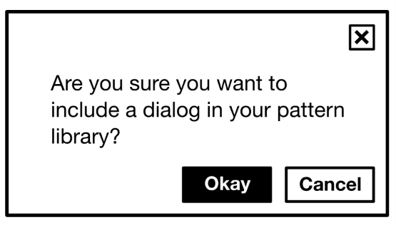
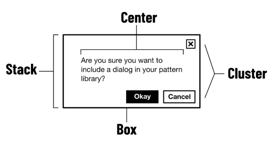
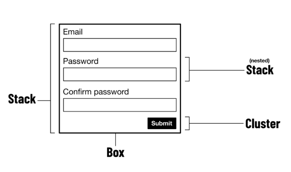
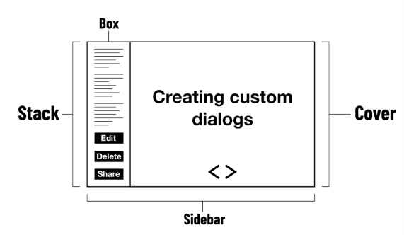

# Composición

Si eres programador, es posible que hayas oído hablar del principio [composition over inheritance ↗](https://en.wikipedia.org/wiki/Composition_over_inheritance) (composición frente a herencia). La idea es que combinar partes independientes simples (objetos; clases; funciones) te da más flexibilidad y conduce a más eficiencia que conectar todo — a través de la herencia — a un origen compartido.

*Composition over inheritance* no tiene por qué aplicarse solo a la "lógica de negocio". También es beneficioso favorecer la composición en la arquitectura front-end y el diseño visual ( [la documentación de React incluso tiene una página dedicada a ello ↗](https://legacy.reactjs.org/docs/composition-vs-inheritance.html) ).

## Composición y layout

Para entender cómo la composición beneficia a un layout, consideremos un componente de ejemplo. Digamos que este componente es un cuadro de diálogo, porque la interfaz (por razones en las que no entraremos ahora) requiere un cuadro de diálogo. Aquí se ve cómo es:



Pero, ¿cómo llega a verse así? Una forma es escribir CSS dedicado para el diálogo. Podrías darle al cuadro de diálogo un identificador de "bloque" (`.dialog` en CSS, y `class="dialog"` en HTML) y usar esto como tu espacio de nombres para adjuntar declaraciones de estilo.

```css linenums="1"
.dialog {
  /* ... */
}
.dialog__header {
  /* ... */
}
.dialog__body {
  /* ... */
}
.dialog__foot {
  /* ... */
}
```

Alternativamente, estos estilos de diálogo podrían importarse de una librería/framework CSS de terceros. En cualquier caso, gran parte del CSS utilizado para hacer que el diálogo _se vea_ como un diálogo, podría usarse para hacer otros layouts similares. Pero como todo aquí tiene el espacio de nombres `.dialog`, cuando lleguemos a hacer el siguiente componente, terminaremos duplicando estilos que podrían ser compartidos. De ahí proviene la mayor parte de la hinchazón del CSS.

El _namespacing_ es la clave aquí. La mentalidad de herencia nos anima a pensar en cómo deberían llamarse las partes finalizadas de la UI antes siquiera de haber decidido qué _hacen_, o qué otras partes más pequeñas pueden _hacer por ellas_. Ahí es donde entra la composición.

## Primitivas de layout

El error en el ejemplo anterior fue pensar que todo sobre la forma del diálogo es aislado y único cuando, en realidad, es solo una composición de layouts más simples. El propósito de _Every Layout_ es identificar y documentar qué es cada uno de estos layouts más pequeños. En conjunto, los llamamos _primitivas_.

El término _primitiva_ tiene connotaciones lingüísticas, matemáticas y computacionales. En cada caso, una primitiva es algo sin su propio significado o propósito como tal, pero que puede usarse _en composición_ para hacer algo significativo, o _léxico_. En el lenguaje podría ser una palabra o frase, en matemáticas una ecuación, en diseño un patrón, o en desarrollo un componente.

En JavaScript, el tipo de dato Boolean es una primitiva. Solo mirar el valor `true` (o `false`) fuera de contexto te dice muy poco sobre la aplicación JavaScript más grande. El tipo de dato Object, por otro lado, es primitiva. No puedes escribir un objeto sin designar tus propias propiedades. Los objetos son, por lo tanto, significativos; necesariamente te dicen algo sobre la intención del autor.

El diálogo es significativo, como pieza de UI, pero sus partes constituyentes no lo son. Así es como podríamos componer el cuadro de diálogo usando las primitivas de layout de _Every Layout_:



Usando muchas de las mismas primitivas, podemos crear un formulario de registro… 



o un layout de diapositiva para una charla de conferencia:



## Intrínsecamente responsive

Cada layout en _Every Layout_ es intrínsecamente responsive. Es decir, se ajustará y reconfigurará internamente para asegurar que el contenido sea visible (y bien espaciado) para adaptarse a cualquier contexto/pantalla.

Puede que te sientas compelido a agregar _breakpoints_ de `@media`, pero estos se consideran "anulaciones manuales" y las primitivas de _Every Layout_ no dependen de ellos.

Sin tipos de datos primitivos, tendrías que estar constantemente enseñando a tu lenguaje de programación cómo hacer operaciones básicas. Rápidamente perderías de vista la tarea _significativa_ específica que te propusiste lograr con el lenguaje en primer lugar. Un sistema de diseño que no aprovecha las primitivas es igualmente problemático. Si cada componente en tu biblioteca de patrones sigue sus propias reglas de layout, abundarán las ineficiencias e inconsistencias.

Las primitivas tienen cada una una responsabilidad simple: "espaciar elementos verticalmente", "rellenar elementos uniformemente", "separar elementos horizontalmente", etc. Están diseñadas para usarse en composición, como padres, hijos o hermanos unas de otras.

Probablemente no puedas crear _literalmente_ todos los layouts usando solo las primitivas de _Every Layout_. Pero ciertamente puedes hacer la mayoría, si no todos, los layouts web comunes, y lograr muchas de tus propias concepciones únicas.

En cualquier caso, deberías llevarte un entendimiento y aprecio por los beneficios de la composición, y el poder de crear todo tipo de interfaces con solo un poco de código reutilizable. El alfabeto inglés tiene solo 26 letras, ¡y piensa en todas las grandes obras creadas con eso!


