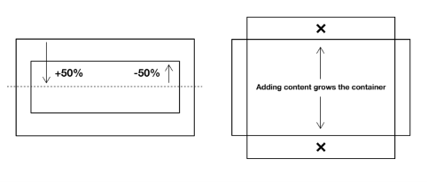
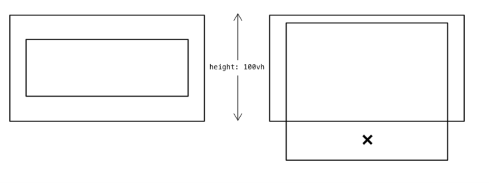
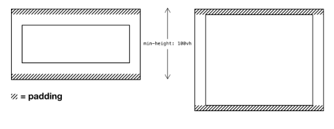
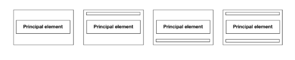
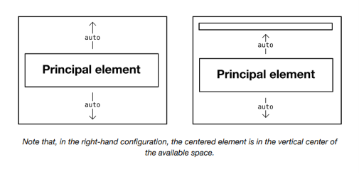
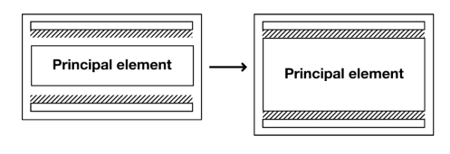

# The Cover

## El problema

Durante años, hubo consternación sobre lo difícil que era centrar algo horizontal y verticalmente con CSS. Fue utilizado por los detractores de CSS como una especie de "prueba" ejemplar de sus deficiencias.

La verdad es que hay numerosas formas de centrar contenido con CSS. Sin embargo, solo hay ciertas maneras de hacerlo sin temor a desbordamientos, superposiciones u otras roturas. Por ejemplo, podríamos usar `position: relative` y `transform` para centrar verticalmente un elemento dentro de un padre:

```css linenums="1"
.parent {
  /* ↓ Darle al padre la altura del viewport */
  height: 100vh;
}
.parent > .child {
  position: relative;
  /* ↓ Empujar el elemento hacia abajo el 50% del padre */
  top: 50%;
  /* ↓ Luego ajustarlo por el 50% de su propia altura */
  transform: translateY(-50%);
}
```

Lo bueno de esto es la parte `transform: translateY(-50%)`, que compensa la altura del elemento en sí mismo — sin importar cuál sea esa altura. Lo menos bueno es el desbordamiento superior e inferior que se produce cuando el contenido del elemento hijo lo hace más alto que el padre. No hemos, hasta ahora, diseñado el layout para tolerar contenido dinámico.



Quizás el método más robusto es combinar `justify-content: center` (horizontal) y `align-items: center` (vertical) de Flexbox.

```css linenums="1"
.centered {
  display: flex;
  justify-content: center;
  align-items: center;
}
```

## Manejo adecuado de la altura

Solo aplicar el CSS de Flexbox no tendrá, por sí solo, un efecto visible en el centrado vertical porque, por defecto, la altura del elemento `.centered` está determinada por la altura de su contenido (implícitamente, `height: auto`). Esto es algo a veces referido como *intrinsic sizing*, y se cubre con más detalle en la documentación del layout `Sidebar`.

Establecer una altura fija — como en el ejemplo poco confiable de `transform` anterior — sería imprudente: no sabemos de antemano cuánto contenido habrá, o cuánto espacio vertical ocupará. En otras palabras, no hay nada que impida que ocurra un desbordamiento.



En su lugar, podemos establecer un `min-height`. De esta manera, el elemento se expandirá verticalmente para acomodar el contenido, donde sea que la altura natural (`auto`) sea mayor que el `min-height`. Cuando esto sucede, la provisión de algo de padding vertical asegura que el contenido centrado no llegue a los bordes.



## Box sizing

Para asegurar que el elemento padre retenga una altura de `100vh`, a pesar del padding adicional, se debe aplicar un valor de `box-sizing: border-box`. Donde no se aplica, el padding se *agrega* a la altura total.

El `box-sizing: border-box` es tan deseable, que usualmente se aplica a todos los elementos en un bloque de declaración global. El uso del selector universal (`*`) significa que todos los elementos se ven afectados.

```css linenums="1"
* {
  box-sizing: border-box;
  /* otros estilos globales */
}
```

Esto es perfectamente funcional donde solo un elemento centrado está en juego. Pero tenemos la costumbre de querer incluir otros elementos, arriba y abajo del centrado. Quizás es un botón de cerrar en la esquina superior derecha, o un indicador de "leer más" en la parte inferior central. En cualquier caso, necesito manejar estos casos de manera modular, y sin producir roturas.

## La solución

Lo que necesito es un componente de layout que pueda manejar contenido centrado verticalmente (bajo un `min-height`) y pueda acomodar elementos de top/header y bottom/footer. Para hacer el componente *componible*, también debería poder agregar y eliminar estos elementos en el HTML sin tener que adaptar el CSS. Debería ser modular y, por lo tanto, no una imposición de codificación para los editores de contenido.

El componente `Cover` es un contexto Flexbox con `flex-direction: column`. Esta declaración significa que los elementos hijos se colocan verticalmente en lugar de horizontalmente. En otras palabras, la 'dirección de flujo' del contexto de formato Flexbox se devuelve a la de un elemento block estándar.

```css linenums="1"
.cover {
  display: flex;
  flex-direction: column;
}
```



El `Cover` tiene un elemento *principal* que siempre debe gravitar hacia el centro. Además, puede tener un elemento top/header y/o un elemento bottom/footer.

¿Cómo manejamos todos estos casos sin tener que adaptar el CSS? Primero, le damos al elemento centrado (`h1` en el ejemplo, pero podría ser cualquier elemento) márgenes `auto`:

```css linenums="1"
.cover {
  display: flex;
  flex-direction: column;
}
.cover > h1 {
  margin-top: auto;
  margin-bottom: auto;
}
```

Estos *empujan* el elemento lejos de cualquier cosa arriba y abajo de él, moviéndolo al centro del espacio disponible. Críticamente, empujará contra el borde interior de un padre o el borde superior/inferior de un elemento hermano.



> *Nota que, en la configuración de la derecha, el elemento centrado está en el centro vertical del espacio disponible.*

Todo lo que queda es asegurar que haya espacio entre los (hasta) tres elementos hijos donde el `min-height` no se haya excedido. 



Actualmente, los márgenes simplemente se colapsan a nada. Dado que no podemos entrar en una función `calc()` para adaptar el margen `auto` (`calc(auto + 1rem)` es inválido), lo mejor que podemos hacer es agregar `margin` a los elementos header y footer contextualmente.

```css linenums="1"
.cover > * {
  margin-top: 1rem;
  margin-bottom: 1rem;
}
.cover > h1 {
  margin-top: auto;
  margin-bottom: auto;
}
.cover > :first-child:not(h1) {
  margin-top: 0;
}
.cover > :last-child:not(h1) {
  margin-bottom: 0;
}
```

Nota el uso de la *cascada, especificidad* ↗ y la negación `:not()` para apuntar a los elementos correctos. Primero, aplicamos márgenes superior e inferior a todos los hijos, usando un selector universal de hijos. Luego sobrescribimos esto para el elemento a centrar (`h1`) para lograr los márgenes `auto`. Finalmente, usamos la función `:not()` para eliminar el margen extraño de los elementos superior e inferior si *no* son el elemento centrado. Si hay un elemento centrado y un footer, pero no hay header, el elemento centrado será el `:first-child` y debe retener `margin-top: auto`.

## ⚠ Shorthands

Nota cómo escribimos `margin-top` y `margin-bottom` por separado en el primer bloque de declaración, en lugar de usar el shorthand `margin: 1rem 0`. La razón es que este componente solo se preocupa por los márgenes verticales para lograr su layout. Al hacer los márgenes horizontales `0`, podríamos estar deshaciendo indebidamente estilos aplicados o heredados por un componente ancestro.

*Solo establece lo que necesitas establecer.*

*Esta demostración interactiva solo está disponible en el sitio de Every Layout* ↗.

Ahora es seguro agregar espaciado alrededor del interior del contenedor usando `padding`. Ya sea que haya uno, dos o tres elementos presentes, el espaciado permanece *simétrico* y nuestro componente modular sin intervención de estilo.

```css linenums="1"
.cover {
  padding: 1rem;
  min-height: 100vh;
}
```

El `min-height` está establecido a `100vh`, de modo que el elemento cubre el 100% de la altura del viewport (de ahí el nombre). Sin embargo, no hay razón por la que el `min-height` no pueda establecerse a otro valor. `100vh` se considera un *sensible default*, y es el valor por defecto para la prop `minHeight` en la implementación del componente personalizado a continuación.

## Centrado horizontal

Hasta ahora no he abordado el centrado horizontal, y eso es bastante deliberado. Los componentes de layout deberían tratar de resolver solo un problema — y el problema del centrado modular es peculiar. El layout `Center` maneja el centrado horizontal y se puede usar en composición con el `Cover`. Podrías envolver el `Cover` en un `Center` o hacer que uno o más de sus hijos sean un `Center`. Todo se trata de *composición*.

## Casos de uso

Un uso típico del `Cover` sería crear el contenido introductorio "above the fold" para una página web. En la siguiente demostración, un `Cluster` anidado se usa para diseñar el logo y el menú de navegación. En este caso, se usa una clase de utilidad (`.text-align\:center`) para centrar horizontalmente el `<h1>` y los elementos footer.

*Esta demostración interactiva solo está disponible en el sitio de Every Layout* ↗.

Podría ser que trates cada sección de la página como un `Cover`, y uses la API Intersection Observer para animar aspectos del cover a medida que entra en vista. Una implementación simple se proporciona a continuación (donde el atributo `data-visible` se agrega a medida que el elemento entra en vista).

```javascript linenums="1"
if ('IntersectionObserver' in window) {
  const targets = Array.from(document.querySelectorAll('cover-l'));
  targets.forEach(t => t.setAttribute('data-observe', ''));
  const callback = (entries, observer) => {
    entries.forEach(entry => {
      entry.target.setAttribute('data-visible', entry.isIntersecting);
    });
  };
  const observer = new IntersectionObserver(callback);
  targets.forEach(t => observer.observe(t));
}
```

## El generador

Usa esta herramienta para generar CSS y HTML básicos de Cover.

La herramienta generadora de código solo está disponible en el *sitio de documentación adjunto* ↗. Aquí está la solución básica, con comentarios. Asume que el elemento centrado es un `<h1>`, en este caso, pero podría ser cualquier elemento.

**CSS**

```css linenums="1"
.cover {
  --space: var(--s1);
  /* ↓ Establece un contexto flex en columna */
  display: flex;
  flex-direction: column;
  /* ↓ Establece una altura mínima para igualar la altura del viewport
  (cualquier mínimo estaría bien) */
  min-height: 100vh;
  /* Establece un valor de padding */
  padding: var(--space);
}
.cover > * {
  /* ↓ Dale a cada hijo un margen superior e inferior */
  margin-top: var(--s1);
  margin-bottom: var(--s1);
}
.cover > :first-child:not(h1) {
  /* ↓ Elimina el margen superior del primer hijo
  si _no_ coincide con el elemento centrado */
  margin-top: 0;
}
.cover > :last-child:not(h1) {
  /* ↓ Elimina el margen inferior del último hijo
  si _no_ coincide con el elemento centrado */
  margin-bottom: 0;
}
.cover > h1 {
  /* ↓ Centra el elemento centrado (h1 aquí)
  en el espacio vertical disponible */
  margin-top: auto;
  margin-bottom: auto;
}
```

**HTML**

Asume que el elemento centrado es un `<h1>`, y está en la posición `nth-child(2)`.

```html linenums="1"
<div class="cover">
  <div><!-- primer hijo --></div>
  <h1><!-- hijo centrado --></h1>
  <div><!-- tercer hijo --></div>
</div>
```

## El componente

Una implementación de elemento personalizado del `Cover` está disponible para descargar ↗.

**API de Props**

Las siguientes props (atributos) harán que el componente se renderice nuevamente cuando se alteren. Pueden ser alterados a mano — en las herramientas de desarrollo del navegador — o como sujetos del estado de la aplicación heredada.

| Nombre | Tipo | Default | Descripción |
|---|---|---|---|
| `centered` | string | `"h1"` | Un selector simple como un selector de elemento o clase, que representa el elemento centrado (principal) en el cover |
| `space` | string | `"var(--s1)"` | El espacio mínimo entre y alrededor de todos los elementos hijos |
| `minHeight` | string | `"100vh"` | La altura mínima para el Cover |
| `noPad` | boolean | `false` | Si el espaciado también se aplica como padding al elemento contenedor |

## Ejemplos

### Básico

Solo un elemento centrado (un `<h1>`) sin compañeros header o footer. El contexto/padre adopta el `min-height` por defecto de `100vh`.

```html linenums="1"
<cover-l>
  <h1>Welcome!</h1>
</cover-l>
```

### ⚠ Un `<h1>` por página

Por razones de estructura de documento accesible, solo debe haber un elemento `<h1>` por página. Este es el encabezado principal de la página para los usuarios de lectores de pantalla. Si agregas varios `<cover-l>` sucesivos, todos excepto el primero deberían tener un `<h2>` para indicar que es una *subsección* en la estructura del documento.
