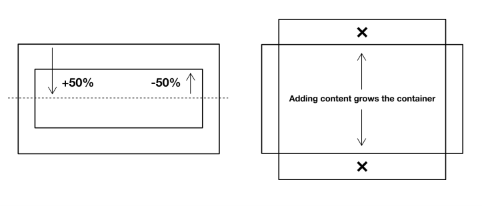
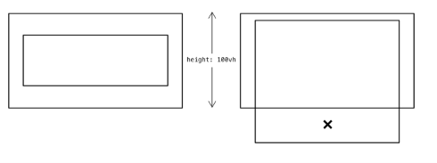
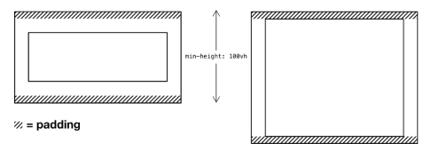
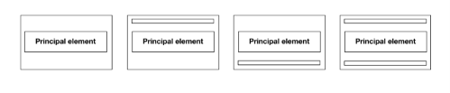
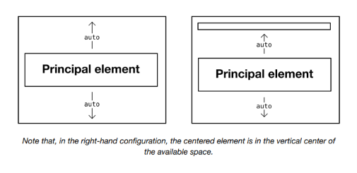
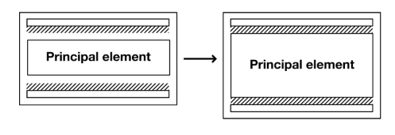

# The Cover

## El problema

Durante años, hubo consternación sobre lo difícil que era centrar algo horizontal y verticalmente con CSS. Fue utilizado por los detractores de CSS como una especie de "prueba" ejemplar de sus deficiencias.

La verdad es que hay numerosas formas de centrar contenido con CSS. Sin embargo, solo hay ciertas maneras de hacerlo sin temor a desbordamientos, superposiciones u otras roturas. Por ejemplo, podríamos usar `position: relative` y `transform` para centrar verticalmente un elemento dentro de un padre:

```css linenums="1"
.parent {
  /* ↓ Darle al padre la altura del viewport */
  height: 100vh;
}
.parent > .child {
  position: relative;
  /* ↓ Empujar el elemento hacia abajo el 50% del padre */
  top: 50%;
  /* ↓ Luego ajustarlo por el 50% de su propia altura */
  transform: translateY(-50%);
}
```

Lo bueno de esto es la parte `transform: translateY(-50%)`, que compensa la altura del elemento en sí mismo — sin importar cuál sea esa altura. Lo menos bueno es el desbordamiento superior e inferior que se produce cuando el contenido del elemento hijo lo hace más alto que el padre. No hemos, hasta ahora, diseñado el layout para tolerar contenido dinámico.



Quizás el método más robusto es combinar `justify-content: center` (horizontal) y `align-items: center` (vertical) de Flexbox.

```css linenums="1"
.centered {
  display: flex;
  justify-content: center;
  align-items: center;
}
```
??? info "Explicacion"
    
    Este apartado de **Every Layout** no está diciendo que *no se pueda* centrar con CSS. Lo que está diciendo es algo más importante:

    > **Centrar es fácil. Centrar de forma robusta, para contenido de tamaño desconocido, es lo difícil.**

    Veamos por partes.

    ---

    __El primer método: `position` + `transform`__

    ```css
    .parent {
      height: 100vh;
    }

    .child {
      position: relative;
      top: 50%;
      transform: translateY(-50%);
    }
    ```

    Imagina que el padre mide **600px** de alto.

    ```
    ┌──────────────────────────┐
    │                          │
    │                          │
    │         (50%)            │ ← top:50%
    │                          │
    │                          │
    └──────────────────────────┘
    ```

    __¿Qué hace `top: 50%`?__

    Mueve el hijo **300px hacia abajo**, porque el 50% se calcula sobre la altura del padre.

    Si el hijo mide 100px de alto:

    ```
    Antes

    ┌──────────────────────────┐
    │████████                  │
    │████████                  │
    └──────────────────────────┘

    Después de top:50%

    ┌──────────────────────────┐
    │                          │
    │                          │
    │                          │
    │████████                  │
    │████████                  │
    └──────────────────────────┘
    ```

    Pero ahora el elemento **no está centrado**.

    ¿Por qué?

    Porque lo que quedó en el centro fue **su borde superior**, no el centro del elemento.

    ---

    __Entonces aparece `translateY(-50%)`__

    ```css
    transform: translateY(-50%);
    ```

    Aquí ocurre algo muy importante.

    Ese **50% ya no se calcula respecto al padre**.

    Se calcula respecto **al propio elemento**.

    Si el hijo mide 100px:

    ```
    translateY(-50%)
    ```

    significa

    ```
    sube 50px
    ```

    porque es la mitad de **su propia altura**.

    Entonces ocurre esto:

    ```
    top:50%

          ████████
          ████████

    translateY(-50%)

        ████████
        ████████
    ```

    Ahora sí queda exactamente en el centro.

    ---

    __¿Por qué dicen que esto tiene un problema?__

    Porque funciona mientras el contenido tenga un tamaño razonable.

    Supongamos esto.

    Padre:

    ```
    600px
    ```

    Hijo:

    ```
    100px
    ```

    Todo perfecto.

    Pero mañana el contenido cambia.

    Ahora el hijo mide

    ```
    900px
    ```

    porque agregaste mucho texto.

    Entonces sucede esto:

    ```
    ┌──────────────────────┐
    │██████████████████████│ ← se sale arriba
    │██████████████████████│
    │██████████████████████│
    │██████████████████████│
    │██████████████████████│
    │██████████████████████│
    │██████████████████████│
    │██████████████████████│ ← también se sale abajo
    └──────────────────────┘
    ```

    Como el centro del elemento debe coincidir con el centro del padre, el elemento empieza a sobresalir por arriba y por abajo.

    Ese es el desbordamiento del que habla el libro.

    No está preparado para contenido dinámico.

    ---

    __Ahora Flexbox__

    ```css
    .centered {
        display: flex;
        justify-content: center;
        align-items: center;
    }
    ```

    Aquí ya no estamos moviendo manualmente el elemento.

    Le estamos diciendo al navegador:

    > "Coloca este elemento en el centro."

    El navegador hace todos los cálculos.

    ---

    __`justify-content`__

    En un `flex-direction: row` (el valor por defecto):

    ```
    ←────────────→

    justify-content
    ```

    Controla el eje horizontal.

    ```
    ┌──────────────────────┐
    │        ████          │
    └──────────────────────┘
    ```

    ---

    __`align-items`__

    Controla el eje vertical.

    ```
    ┌──────────────────────┐
    │                      │
    │        ████          │
    │                      │
    └──────────────────────┘
    ```

    ---

    __Los dos juntos__

    ```
    display:flex;
    justify-content:center;
    align-items:center;
    ```

    Resultado:

    ```
    ┌──────────────────────────┐
    │                          │
    │                          │
    │        ████████          │
    │        ████████          │
    │                          │
    │                          │
    └──────────────────────────┘
    ```

    Todo queda perfectamente centrado.

    ---

    __¿Por qué es más robusto?__

    Porque no depende de:

    * cuánto mide el hijo;
    * hacer cálculos manuales;
    * usar `top`;
    * usar `transform`;
    * conocer la altura del contenido.

    Si el contenido cambia de tamaño, Flexbox vuelve a calcular automáticamente la distribución.

    Por ejemplo:

    Elemento pequeño:

    ```
          ██
    ```

    Elemento grande:

    ```
    ████████████████
    ████████████████
    ████████████████
    ```

    Ambos siguen centrados sin cambiar una sola línea de CSS.

    ---

    __Entonces, ¿por qué Every Layout dice que el primer método no es robusto?__

    Porque **el diseño moderno debe asumir que el contenido puede cambiar**:

    * el texto puede traducirse a otro idioma y ocupar más espacio;
    * un usuario puede aumentar el tamaño de la fuente;
    * puede aparecer una imagen más grande;
    * puede agregarse más contenido desde una base de datos.

    Un buen layout no debería romperse cuando eso ocurre.

    Por eso, en diseño moderno se prefieren herramientas como **Flexbox** (y también **Grid**) para centrar elementos. No solo centran, sino que **se adaptan mucho mejor al contenido dinámico**, reduciendo el riesgo de desbordamientos y otros problemas de mantenimiento.


## Manejo adecuado de la altura

Solo aplicar el CSS de Flexbox no tendrá, por sí solo, un efecto visible en el centrado vertical porque, por defecto, la altura del elemento `.centered` está determinada por la altura de su contenido (implícitamente, `height: auto`). Esto es algo a veces referido como *intrinsic sizing*, y se cubre con más detalle en la documentación del layout `Sidebar`.

Establecer una altura fija — como en el ejemplo poco confiable de `transform` anterior — sería imprudente: no sabemos de antemano cuánto contenido habrá, o cuánto espacio vertical ocupará. En otras palabras, no hay nada que impida que ocurra un desbordamiento.



En su lugar, podemos establecer un `min-height`. De esta manera, el elemento se expandirá verticalmente para acomodar el contenido, donde sea que la altura natural (`auto`) sea mayor que el `min-height`. Cuando esto sucede, la provisión de algo de padding vertical asegura que el contenido centrado no llegue a los bordes.




??? info "Explicacion"

    Esta es una de las ideas más importantes de **Every Layout**: **no diseñes para el contenido que tienes hoy, diseña para el contenido que podría existir mañana**.

    Vamos paso por paso.

    ---

    __El problema de `height`__

    Supongamos que haces un contenedor centrado así:

    ```css
    .centered {
        display: flex;
        justify-content: center;
        align-items: center;
        height: 100vh;
    }
    ```

    Todo parece perfecto.

    ```
    ┌────────────────────────────┐
    │                            │
    │                            │
    │        CONTENIDO           │
    │                            │
    │                            │
    └────────────────────────────┘
    ```

    Pero imagina que después el contenido cambia.

    En lugar de una palabra ahora tienes un formulario enorme.

    ```
    Título

    Nombre
    Apellido
    Correo
    Dirección
    Ciudad
    Provincia
    ...
    ...
    ...
    ```

    Ahora ese formulario mide más que la pantalla.

    ---

    __¿Qué ocurre con `height`?__

    Si el contenedor tiene exactamente

    ```css
    height: 100vh;
    ```

    su altura **nunca puede crecer**.

    Siempre será igual al alto de la ventana.

    Por ejemplo:

    ```
    Viewport = 700px

    height = 700px
    ```

    Aunque el contenido necesite 1200px.

    Entonces sucede esto:

    ```
    ┌──────────────────────────────┐
    │                              │
    │          Formulario          │
    │                              │
    │                              │
    │                              │
    │------------------------------│
    │    resto del formulario      │ ← ya no cabe
    │    queda fuera               │
    └──────────────────────────────┘
    ```

    Ahí aparece el desbordamiento (*overflow*).

    ---

    __Entonces aparece `min-height`__

    En lugar de decir

    ```css
    height: 100vh;
    ```

    decimos

    ```css
    min-height: 100vh;
    ```

    La palabra **min** significa:

    > "Como mínimo quiero esta altura, pero si necesitas más, puedes crecer."

    Es decir,

    ```
    Altura mínima = 700px

    Si el contenido necesita 700px
    → mide 700px

    Si necesita 900px
    → mide 900px

    Si necesita 1500px
    → mide 1500px
    ```

    Ya no está bloqueado.

    ---

    __Visualmente__

    Con `height`

    ```
    ┌──────────────┐
    │              │
    │██████████████│
    │██████████████│
    │██████████████│
    └──────────────┘
          ▲
          no puede crecer
    ```

    Con `min-height`

    ```
    ┌──────────────┐
    │              │
    │██████████████│
    │██████████████│
    │██████████████│
    │██████████████│
    │██████████████│
    │██████████████│
    └──────────────┘
    ```

    Simplemente aumenta su tamaño.

    ---

    __¿Qué tiene que ver el "intrinsic sizing"?__

    Aquí aparece un concepto muy importante.

    Los elementos HTML tienen por defecto

    ```css
    height: auto;
    ```

    Eso significa:

    > "Mi altura será la necesaria para contener mi contenido."

    Por ejemplo

    ```html
    <div>
        Hola
    </div>
    ```

    ```
    ┌───────────┐
    │   Hola    │
    └───────────┘
    ```

    La altura es pequeña.

    Ahora:

    ```html
    <div>
    Lorem ipsum...
    Lorem ipsum...
    Lorem ipsum...
    Lorem ipsum...
    </div>
    ```

    ```
    ┌───────────┐
    │Lorem...   │
    │Lorem...   │
    │Lorem...   │
    │Lorem...   │
    └───────────┘
    ```

    La altura aumenta sola.

    Eso es el comportamiento **intrínseco** (*intrinsic sizing*): el tamaño lo determina el contenido.

    Every Layout intenta aprovechar este comportamiento natural en lugar de luchar contra él fijando alturas rígidas.

    ---

    __Entonces, ¿por qué no basta con Flexbox?__

    Si solo escribes

    ```css
    .centered {
        display:flex;
        justify-content:center;
        align-items:center;
    }
    ```

    no ocurre ningún centrado vertical.

    ¿Por qué?

    Porque el contenedor mide exactamente lo mismo que su hijo.

    Imagina esto.

    ```
    Padre

    ┌──────────────┐
    │██████████████│
    └──────────────┘
    ```

    El padre tiene exactamente la altura del hijo.

    No existe espacio libre arriba ni abajo.

    Y **`align-items` solo distribuye el espacio libre del eje transversal**. Si ese espacio es 0, no hay nada que centrar.

    Es como intentar poner un cuadro en el centro de una caja que tiene exactamente el mismo tamaño que el cuadro: ya está ocupando todo el espacio disponible.

    ---

    __¿Por qué recomiendan además `padding`?__

    Imagina que el contenido termina siendo muy alto.

    Con solo

    ```css
    min-height:100vh;
    ```

    podría quedar pegado a los bordes.

    ```
    ┌───────────────────────┐
    │███████████████████████│
    │███████████████████████│
    │███████████████████████│
    │███████████████████████│
    └───────────────────────┘
    ```

    En cambio, si agregas

    ```css
    padding-block: 2rem;
    ```

    obtienes un margen interno arriba y abajo.

    ```
    ┌───────────────────────┐
    │                       │
    │███████████████████████│
    │███████████████████████│
    │███████████████████████│
    │                       │
    └───────────────────────┘
    ```

    Así, cuando el contenido crezca y el contenedor se expanda, seguirá respirando y no quedará pegado a los bordes.

    ---

    __La idea principal de este apartado__

    El mensaje de Every Layout es:

    * ❌ Evita `height` fija cuando el contenido puede variar.
    * ✅ Usa `min-height` para establecer un tamaño mínimo sin impedir que el contenedor crezca.
    * ✅ Aprovecha el comportamiento intrínseco (`height: auto`) para que el contenido determine el tamaño cuando sea necesario.
    * ✅ Añade `padding` para mantener un espacio cómodo cuando el contenido haga crecer el contenedor.

    Ese enfoque hace que el diseño sea mucho más resistente a cambios en el contenido, distintos tamaños de pantalla y ajustes de accesibilidad como aumentar el tamaño de la fuente.

## Box sizing

Para asegurar que el elemento padre retenga una altura de `100vh`, a pesar del padding adicional, se debe aplicar un valor de `box-sizing: border-box`. Donde no se aplica, el padding se *agrega* a la altura total.

El `box-sizing: border-box` es tan deseable, que usualmente se aplica a todos los elementos en un bloque de declaración global. El uso del selector universal (`*`) significa que todos los elementos se ven afectados.

```css linenums="1"
* {
  box-sizing: border-box;
  /* otros estilos globales */
}
```

Esto es perfectamente funcional donde solo un elemento centrado está en juego. Pero tenemos la costumbre de querer incluir otros elementos, arriba y abajo del centrado. Quizás es un botón de cerrar en la esquina superior derecha, o un indicador de "leer más" en la parte inferior central. En cualquier caso, necesito manejar estos casos de manera modular, y sin producir roturas.

??? info "Explicacion"
    
    Esta explicación es importante porque conecta dos conceptos: **`box-sizing`** y **`min-height: 100vh`**.

    Hay una frase que puede pasar desapercibida:

    > "Para asegurar que el elemento padre retenga una altura de `100vh`, a pesar del padding adicional..."

    ¿Por qué el `padding` afecta la altura? Veámoslo.

    ---

    __El modelo de caja (Box Model)__

    Todo elemento HTML está formado por cuatro partes:

    ```text
    ┌─────────────────────────────┐
    │          Margin             │
    │ ┌─────────────────────────┐ │
    │ │        Border           │ │
    │ │ ┌─────────────────────┐ │ │
    │ │ │      Padding        │ │ │
    │ │ │ ┌─────────────────┐ │ │ │
    │ │ │ │    Content      │ │ │ │
    │ │ │ └─────────────────┘ │ │ │
    │ │ └─────────────────────┘ │ │
    │ └─────────────────────────┘ │
    └─────────────────────────────┘
    ```

    El problema está en cómo CSS calcula el tamaño.

    ---

    __Sin `box-sizing`__

    Por defecto, todos los navegadores usan:

    ```css
    box-sizing: content-box;
    ```

    Eso significa:

    > **El `width` y el `height` solo corresponden al contenido.**

    Supongamos:

    ```css
    height: 100vh;
    padding: 20px;
    ```

    Imagina que el viewport mide 800 px.

    Entonces ocurre esto.

    Contenido:

    ```text
    800 px
    ```

    Padding arriba:

    ```text
    20 px
    ```

    Padding abajo:

    ```text
    20 px
    ```

    La altura real será:

    ```text
    800
    +20
    +20
    ----
    840 px
    ```

    Visualmente:

    ```text
    Viewport (800px)

    ┌────────────────────────────┐
    │ padding 20px               │
    │                            │
    │                            │
    │   contenido (800px)        │
    │                            │
    │                            │
    │ padding 20px               │
    └────────────────────────────┘

    Altura total = 840px
    ```

    Ahora el elemento **ya no mide 100vh**, sino más.

    ---

    __¿Qué problema produce?__

    Supongamos que el Cover debe ocupar exactamente la pantalla.

    Pero como mide 840 px, aparece un pequeño scroll.

    ```text
    ┌────────────────────┐
    │                    │
    │     Cover          │
    │                    │
    └────────────────────┘
    ↓↓↓↓↓↓↓↓↓

    20 px extra
    ```

    Ese scroll no lo querías.

    Fue causado únicamente por el `padding`.

    ---

    __Con `border-box`__

    Ahora escribimos:

    ```css
    box-sizing: border-box;
    ```

    La regla cambia completamente.

    Ahora CSS interpreta:

    > "Los 100vh incluyen el padding y el borde."

    Entonces:

    ```css
    height:100vh;
    padding:20px;
    ```

    significa:

    ```text
    Altura total = 800px
    ```

    No 840.

    El navegador hace las cuentas por ti.

    Contenido:

    ```text
    760 px
    ```

    Padding:

    ```text
    20 px arriba

    20 px abajo
    ```

    Total:

    ```text
    760
    +20
    +20
    ----
    800 px
    ```

    Visualmente:

    ```text
    ┌──────────────────────────┐
    │ padding                  │
    │                          │
    │ contenido                │
    │                          │
    │ padding                  │
    └──────────────────────────┘

    Todo sigue midiendo 100vh.
    ```

    ---

    __¿Por qué lo ponen globalmente?__

    Muestran esto:

    ```css
    * {
        box-sizing:border-box;
    }
    ```

    El selector universal

    ```css
    *
    ```

    significa:

    > Todos los elementos.

    Es decir,

    ```html
    <div>

    <section>

    <p>

    <h1>

    

    <button>

    <input>
    ```

    todos tendrán

    ```css
    box-sizing:border-box;
    ```

    ---

    __¿Por qué hacen eso?__

    Porque casi siempre es el comportamiento que realmente queremos.

    Imagina un botón.

    ```css
    width:200px;
    padding:20px;
    ```

    Con `content-box`

    mide

    ```text
    240px
    ```

    Con `border-box`

    mide

    ```text
    200px
    ```

    Esto hace muchísimo más fáciles los cálculos.

    Por eso hoy en día prácticamente todos los frameworks (Bootstrap, Tailwind, Material UI, etc.) empiezan con algo parecido a:

    ```css
    *,
    *::before,
    *::after {
        box-sizing:border-box;
    }
    ```

    ---

    __¿Y por qué después vuelve a hablar de header y footer?__

    Fíjate que el párrafo cambia de tema.

    Primero explica:

    > "Necesitamos `box-sizing` para que el padding no aumente el tamaño."

    Y enseguida dice:

    > "Pero normalmente queremos añadir elementos arriba y abajo."

    Es decir:

    Primero resolvió el problema del tamaño.

    Ahora empieza otro problema.

    ```text
    ┌───────────────────────────┐
    │ Header                    │
    │                           │
    │                           │
    │        Contenido          │
    │                           │
    │                           │
    │ Footer                    │
    └───────────────────────────┘
    ```

    Ya no basta con centrar un único elemento.

    Hay que mantener el centrado **aunque aparezcan hermanos**.

    Ese es precisamente el problema que luego resuelve con:

    ```css
    margin-top:auto;
    margin-bottom:auto;
    ```

    ---

    __Un detalle importante__

    En el texto hablan de **`height: 100vh`**, pero el `Cover` realmente utiliza:

    ```css
    min-height:100vh;
    ```

    Con `min-height`, `box-sizing: border-box` sigue siendo útil por la misma razón: garantiza que ese **mínimo** incluya el `padding`. Así, cuando el contenido es pequeño, el `Cover` ocupa exactamente el alto de la ventana sin crecer por culpa del `padding`. Y si el contenido necesita más espacio, el contenedor puede expandirse gracias a `min-height`, manteniendo el comportamiento flexible que busca Every Layout.


## La solución

Lo que necesito es un componente de layout que pueda manejar contenido centrado verticalmente (bajo un `min-height`) y pueda acomodar elementos de top/header y bottom/footer. Para hacer el componente *componible*, también debería poder agregar y eliminar estos elementos en el HTML sin tener que adaptar el CSS. Debería ser modular y, por lo tanto, no una imposición de codificación para los editores de contenido.

El componente `Cover` es un contexto Flexbox con `flex-direction: column`. Esta declaración significa que los elementos hijos se colocan verticalmente en lugar de horizontalmente. En otras palabras, la 'dirección de flujo' del contexto de formato Flexbox se devuelve a la de un elemento block estándar.

```css linenums="1"
.cover {
  display: flex;
  flex-direction: column;
}
```



El `Cover` tiene un elemento *principal* que siempre debe gravitar hacia el centro. Además, puede tener un elemento top/header y/o un elemento bottom/footer.

¿Cómo manejamos todos estos casos sin tener que adaptar el CSS? Primero, le damos al elemento centrado (`h1` en el ejemplo, pero podría ser cualquier elemento) márgenes `auto`:

```css linenums="1"
.cover {
  display: flex;
  flex-direction: column;
}
.cover > h1 {
  margin-top: auto;
  margin-bottom: auto;
}
```

Estos *empujan* el elemento lejos de cualquier cosa arriba y abajo de él, moviéndolo al centro del espacio disponible. Críticamente, empujará contra el borde interior de un padre o el borde superior/inferior de un elemento hermano.



> *Nota que, en la configuración de la derecha, el elemento centrado está en el centro vertical del espacio disponible.*

Todo lo que queda es asegurar que haya espacio entre los (hasta) tres elementos hijos donde el `min-height` no se haya excedido. 



Actualmente, los márgenes simplemente se colapsan a nada. Dado que no podemos entrar en una función `calc()` para adaptar el margen `auto` (`calc(auto + 1rem)` es inválido), lo mejor que podemos hacer es agregar `margin` a los elementos header y footer contextualmente.

```css linenums="1"
.cover > * {
  margin-top: 1rem;
  margin-bottom: 1rem;
}
.cover > h1 {
  margin-top: auto;
  margin-bottom: auto;
}
.cover > :first-child:not(h1) {
  margin-top: 0;
}
.cover > :last-child:not(h1) {
  margin-bottom: 0;
}
```

Nota el uso de la [*cascada, especificidad* ↗](https://piccalil.li/blog/a-primer-on-the-cascade-and-specificity/) y la negación `:not()` para apuntar a los elementos correctos. Primero, aplicamos márgenes superior e inferior a todos los hijos, usando un selector universal de hijos. Luego sobrescribimos esto para el elemento a centrar (`h1`) para lograr los márgenes `auto`. Finalmente, usamos la función `:not()` para eliminar el margen extraño de los elementos superior e inferior si *no* son el elemento centrado. Si hay un elemento centrado y un footer, pero no hay header, el elemento centrado será el `:first-child` y debe retener `margin-top: auto`.

??? info "Explicacion"

    Este es probablemente uno de los layouts más ingeniosos de **Every Layout**. La idea no es simplemente "centrar un elemento", sino crear un componente que funcione correctamente **sin importar qué elementos existan**.

    Veámoslo paso a paso.

    ---

    __¿Qué problema intenta resolver?__

    Imagina una página como esta:

    ```text
    +-------------------------+
    | Header                  |
    |                         |
    |                         |
    |      Contenido          |
    |                         |
    |                         |
    | Footer                  |
    +-------------------------+
    ```

    Pero otras veces podrías tener:

    ```text
    +-------------------------+
    |                         |
    |      Contenido          |
    |                         |
    +-------------------------+
    ```

    O:

    ```text
    +-------------------------+
    | Header                  |
    |                         |
    |      Contenido          |
    |                         |
    +-------------------------+
    ```

    O:

    ```text
    +-------------------------+
    |                         |
    |      Contenido          |
    |                         |
    | Footer                  |
    +-------------------------+
    ```

    El CSS debería funcionar **para las cuatro situaciones**, sin cambiar una sola línea.

    Ese es el objetivo del **Cover**.

    ---

    __Primer paso__

    ```css
    .cover {
        display: flex;
        flex-direction: column;
    }
    ```

    ¿Por qué `column`?

    Porque ahora el eje principal es vertical.

    Normalmente Flexbox organiza así:

    ```text
    A   B   C
    ```

    Con `column` pasa a ser

    ```text
    A
    B
    C
    ```

    Es decir, los hijos se apilan uno debajo del otro.

    ---

    __Ahora aparece el truco__

    Supongamos que tenemos

    ```html
    <div class="cover">
        <header>Header</header>
        <h1>Título</h1>
        <footer>Footer</footer>
    </div>
    ```

    y al `h1` le ponen

    ```css
    h1 {
        margin-top: auto;
        margin-bottom: auto;
    }
    ```

    Aquí ocurre la magia.

    ---

    __¿Qué hace `margin:auto` en Flexbox?__

    Muchísima gente cree que `margin:auto` solo sirve para centrar horizontalmente.

    En Flexbox hace mucho más.

    Un margen `auto` significa:

    > "Absorbe todo el espacio libre que puedas."

    ---

    Imagina que el contenedor mide

    ```text
    800 px
    ```

    Y los elementos ocupan

    ```text
    Header = 100

    Título = 100

    Footer = 100
    ```

    Total:

    ```text
    300 px
    ```

    Quedan libres

    ```text
    500 px
    ```

    ---

    Como el `h1` tiene

    ```css
    margin-top:auto;
    margin-bottom:auto;
    ```

    los 500 px libres se reparten entre ambos márgenes.

    ```text
    Header

    250px  ← margin-top:auto

    Título

    250px ← margin-bottom:auto

    Footer
    ```

    Resultado:

    ```text
    Header


          Título


    Footer
    ```

    El título queda exactamente en el centro del espacio disponible.

    ---

    __¿Y si no hay footer?__

    Tenemos

    ```html
    <header></header>

    <h1></h1>
    ```

    El espacio libre ahora es

    ```text
    Header

    250px

    Título

    250px

    (fin del contenedor)
    ```

    El margen inferior empuja contra el borde del padre.

    Sigue funcionando.

    ---

    __¿Y si no hay header?__

    ```html
    <h1></h1>

    <footer></footer>
    ```

    Ahora sucede

    ```text
    (inicio)

    250px

    Título

    250px

    Footer
    ```

    Otra vez funciona.

    ---

    __¿Y si solo existe el contenido?__

    ```html
    <h1></h1>
    ```

    Entonces

    ```text
    300px

    Título

    300px
    ```

    También funciona.

    Por eso dicen que es **componible**.

    El CSS no necesita saber qué hijos existen.

    ---

    __¿Por qué agregan márgenes a todos?__

    Luego escriben

    ```css
    .cover > * {
        margin-top:1rem;
        margin-bottom:1rem;
    }
    ```

    ¿Por qué?

    Porque cuando NO sobra espacio, los `auto` dejan de actuar.

    Imagina

    ```text
    Header
    Título
    Footer
    ```

    Si el contenido llena casi todo el contenedor, los márgenes `auto` prácticamente valen 0.

    Entonces todo queda pegado.

    ```text
    Header
    Título
    Footer
    ```

    Sin separación.

    ---

    Con

    ```css
    margin:1rem;
    ```

    obtienes

    ```text
    Header

    Título

    Footer
    ```

    Siempre existe un pequeño espacio.

    ---

    __Entonces... ¿por qué vuelven a escribir el CSS del `h1`?__

    ```css
    .cover > h1 {
        margin-top:auto;
        margin-bottom:auto;
    }
    ```

    Porque sobrescribe el margen anterior.

    La cascada funciona así:

    Primero

    ```css
    * {
        margin-top:1rem;
    }
    ```

    Luego

    ```css
    h1 {
        margin-top:auto;
    }
    ```

    Como el segundo selector es más específico y aparece después, gana.

    El `h1` termina con:

    ```css
    margin-top:auto;
    margin-bottom:auto;
    ```

    Mientras que el header y footer conservan:

    ```css
    margin:1rem;
    ```

    ---

    __¿Y para qué sirven estos selectores?__

    ```css
    .cover > :first-child:not(h1)
    ```

    y

    ```css
    .cover > :last-child:not(h1)
    ```

    Veamos un ejemplo.

    Supón que existe

    ```html
    <header></header>

    <h1></h1>
    ```

    El header es el primer hijo.

    Tiene

    ```css
    margin-top:1rem;
    ```

    Eso produce un espacio arriba.

    ```text
    ↑ 1rem

    Header
    ```

    Pero ese espacio no aporta nada: el header ya está pegado al borde superior del contenedor.

    Por eso eliminan ese margen.

    ```css
    margin-top:0;
    ```

    Lo mismo ocurre con el footer:

    ```html
    <h1></h1>

    <footer></footer>
    ```

    No hace falta dejar un margen debajo del último elemento.

    ---

    __¿Por qué usan `:not(h1)`?__

    Porque puede ocurrir esto:

    ```html
    <h1></h1>
    <footer></footer>
    ```

    Aquí el `h1` es el **primer hijo**.

    Si escribieran simplemente:

    ```css
    :first-child {
        margin-top:0;
    }
    ```

    Le quitarían el

    ```css
    margin-top:auto;
    ```

    al elemento que precisamente debe centrarse.

    Eso rompería el layout.

    Con

    ```css
    :first-child:not(h1)
    ```

    están diciendo:

    > "Quita el margen superior al primer hijo... **excepto si ese primer hijo es el elemento que debe quedar centrado**."

    Lo mismo aplica para `:last-child:not(h1)`.

    ---

    __La idea clave del `Cover`__

    Este layout aprovecha una característica muy potente de Flexbox: los márgenes `auto` absorben el espacio libre. En lugar de calcular posiciones o depender de que existan un encabezado y un pie, deja que el navegador distribuya automáticamente ese espacio.

    Por eso el `Cover` puede adaptarse a cualquiera de estas estructuras sin modificar el CSS:

    * Solo contenido principal.
    * Encabezado + contenido.
    * Contenido + pie.
    * Encabezado + contenido + pie.

    Esa capacidad de funcionar correctamente aunque cambie la composición del HTML es precisamente lo que Every Layout llama un componente **componible**.

## ⚠ Shorthands

Nota cómo escribimos `margin-top` y `margin-bottom` por separado en el primer bloque de declaración, en lugar de usar el shorthand `margin: 1rem 0`. La razón es que este componente solo se preocupa por los márgenes verticales para lograr su layout. Al hacer los márgenes horizontales `0`, podríamos estar deshaciendo indebidamente estilos aplicados o heredados por un componente ancestro.

*Solo establece lo que necesitas establecer.*

??? info "Demo"

    [*Esta demostración interactiva solo está disponible en el sitio de Every Layout* ↗.](https://every-layout.dev/demos/cover-html-book/)

Ahora es seguro agregar espaciado alrededor del interior del contenedor usando `padding`. Ya sea que haya uno, dos o tres elementos presentes, el espaciado permanece *simétrico* y nuestro componente modular sin intervención de estilo.

```css linenums="1"
.cover {
  padding: 1rem;
  min-height: 100vh;
}
```

El `min-height` está establecido a `100vh`, de modo que el elemento cubre el 100% de la altura del viewport (de ahí el nombre). Sin embargo, no hay razón por la que el `min-height` no pueda establecerse a otro valor. `100vh` se considera un *sensible default*, y es el valor por defecto para la prop `minHeight` en la implementación del componente personalizado a continuación.

??? info "Explicacion"

    Este apartado habla de dos ideas importantes de Every Layout:

    1. **No modificar propiedades que no necesitas tocar.**
    2. **Hacer que el componente sea reutilizable y no interfiera con otros componentes.**

    Veámoslo.

    ---

    __¿Por qué no usan `margin: 1rem 0`?__

    Podrían escribir:

    ```css
    margin: 1rem 0;
    ```

    porque significa

    ```css
    margin-top: 1rem;
    margin-right: 0;
    margin-bottom: 1rem;
    margin-left: 0;
    ```

    Es exactamente igual que escribir:

    ```css
    margin-top: 1rem;
    margin-right: 0;
    margin-bottom: 1rem;
    margin-left: 0;
    ```

    Pero Every Layout dice que eso **no es una buena práctica** aquí.

    ---

    __¿Por qué?__

    Porque el componente **solo necesita controlar el espacio vertical**.

    No le interesa el horizontal.

    Entonces escribe únicamente:

    ```css
    margin-top: 1rem;
    margin-bottom: 1rem;
    ```

    y deja intactos:

    ```css
    margin-left
    margin-right
    ```

    ---

    __Imagina este caso__

    Supón que tienes un componente padre.

    ```css
    .card > * {
        margin-inline: auto;
    }
    ```

    Eso centra horizontalmente todos los hijos.

    Ahora dentro colocas un `Cover`.

    Si el `Cover` escribiera

    ```css
    margin: 1rem 0;
    ```

    estaría haciendo esto sin que te des cuenta:

    ```css
    margin-left: 0;
    margin-right: 0;
    ```

    Acabas de destruir el centrado horizontal que había definido el componente padre.

    ---

    Visualmente:

    Antes

    ```text
          Título
    ```

    Después

    ```text
    Título
    ```

    El `Cover` rompió otro componente.

    ---

    __En cambio__

    Si solamente hace

    ```css
    margin-top: 1rem;
    margin-bottom: 1rem;
    ```

    Los márgenes laterales siguen siendo los del padre.

    ```text
          Título
    ```

    Todo continúa funcionando.

    ---

    __Ese es el principio__

    Every Layout resume esta idea en una frase:

    > **Solo establece lo que necesitas establecer.**

    Es una regla muy poderosa.

    Un componente no debería modificar propiedades que no son de su responsabilidad.

    Si el componente solo controla:

    * distribución vertical,
    * espacio vertical,

    entonces no debería tocar:

    * márgenes laterales,
    * colores,
    * fuentes,
    * alineación horizontal,
    * etc.

    ---

    __Ahora hablan del `padding`__

    Luego muestran

    ```css
    .cover {
        padding: 1rem;
        min-height: 100vh;
    }
    ```

    ¿Por qué ahora sí es seguro poner `padding`?

    Porque ya resolvieron el problema del centrado.

    Antes tenían esto:

    ```text
    ┌────────────────────────┐
    │                        │
    │      Contenido         │
    │                        │
    └────────────────────────┘
    ```

    Si el contenido crece:

    ```text
    ┌────────────────────────┐
    │████████████████████████│
    │████████████████████████│
    │████████████████████████│
    └────────────────────────┘
    ```

    Queda pegado al borde.

    ---

    Con

    ```css
    padding:1rem;
    ```

    obtienes

    ```text
    ┌────────────────────────┐
    │                        │
    │  ████████████████████  │
    │  ████████████████████  │
    │                        │
    └────────────────────────┘
    ```

    Siempre existe un espacio alrededor.

    ---

    __¿Por qué el `padding` no rompe el centrado?__

    Porque el área disponible para Flexbox pasa a ser el interior del `padding`.

    Imagina:

    ```text
    Viewport
    ```

    ```
    ┌────────────────────────────┐
    │ padding                    │
    │ ┌────────────────────────┐ │
    │ │                        │ │
    │ │     Contenido          │ │
    │ │                        │ │
    │ └────────────────────────┘ │
    │ padding                    │
    └────────────────────────────┘
    ```

    Flexbox centra dentro de esa zona interior.

    Todo sigue siendo simétrico.

    ---

    __¿Por qué `min-height:100vh`?__

    Recuerda la diferencia.

    No hacen

    ```css
    height:100vh;
    ```

    porque impediría crecer al contenedor.

    Hacen

    ```css
    min-height:100vh;
    ```

    que significa

    > "Como mínimo ocupa toda la pantalla."

    Si el contenido es pequeño:

    ```text
    Viewport

    ┌────────────────────┐
    │                    │
    │      Título        │
    │                    │
    └────────────────────┘
    ```

    Ocupa toda la pantalla.

    ---

    Si el contenido aumenta:

    ```text
    Viewport

    ┌────────────────────┐
    │                    │
    │Formulario          │
    │Formulario          │
    │Formulario          │
    │Formulario          │
    │Formulario          │
    │                    │
    └────────────────────┘

            ↓ sigue creciendo
    ```

    La altura ya no es 100vh.

    Ahora puede ser:

    * 120vh
    * 150vh
    * 300vh

    Lo que el contenido necesite.

    ---

    __¿Qué significa "sensible default"?__

    Cuando dicen:

    > "`100vh` se considera un *sensible default*"

    quieren decir:

    > **Es un valor predeterminado razonable, pero no obligatorio.**

    En la mayoría de los casos, un `Cover` se usa para secciones que deben llenar al menos toda la ventana del navegador, por eso `100vh` es una buena elección inicial.

    Sin embargo, el componente sigue siendo flexible. Puedes cambiarlo si el contexto lo requiere:

    ```css
    .cover {
        min-height: 50vh;
    }
    ```

    o incluso:

    ```css
    .cover {
        min-height: 30rem;
    }
    ```

    El componente seguirá funcionando igual; simplemente cambiará el espacio mínimo que intenta cubrir.

    ---

    __La filosofía detrás de este apartado__

    Este fragmento refleja muy bien la filosofía de Every Layout:

    * **Haz que cada componente tenga una responsabilidad clara.**
    * **No sobrescribas propiedades que no necesitas controlar.**
    * **Usa valores predeterminados útiles, pero que puedan reemplazarse fácilmente.**
    * **Permite que el contenido determine el tamaño cuando sea necesario, en lugar de imponer dimensiones rígidas.**

    Ese enfoque hace que los componentes sean más reutilizables y evita que interfieran entre sí cuando se combinan en una interfaz más grande.

## Centrado horizontal

Hasta ahora no he abordado el centrado horizontal, y eso es bastante deliberado. Los componentes de layout deberían tratar de resolver solo un problema — y el problema del centrado modular es peculiar. El layout `Center` maneja el centrado horizontal y se puede usar en composición con el `Cover`. Podrías envolver el `Cover` en un `Center` o hacer que uno o más de sus hijos sean un `Center`. Todo se trata de *composición*.

??? info "Explicacion"

    Este párrafo resume una de las filosofías centrales de **Every Layout**: **cada layout debe resolver un solo problema**.

    La frase clave es:

    > **Los componentes de layout deberían tratar de resolver solo un problema.**

    Veamos por qué.

    ---

    __La tentación__

    Cuando construimos un componente, solemos pensar:

    > "Ya que estoy haciendo un `Cover`, también voy a centrar horizontalmente."

    Entonces escribiríamos algo así:

    ```css
    .cover {
        display: flex;
        flex-direction: column;
        justify-content: center;
        align-items: center;
    }
    ```

    Parece una buena idea.

    Pero Every Layout dice que **no lo es**.

    ---

    __¿Por qué?__

    Porque ahora el `Cover` está resolviendo **dos problemas distintos**.

    1. Centrar verticalmente.
    2. Centrar horizontalmente.

    Y puede que tú no quieras ambas cosas.

    ---

    __Ejemplo__

    Imagina una página de inicio.

    ```text
    LOGO


    Bienvenido


    Botón
    ```

    Quieres que todo esté centrado horizontalmente.

    Perfecto.

    Pero ahora imagina un formulario.

    ```text
    Bienvenido

    Nombre
    [____________]

    Correo
    [____________]

    Dirección
    [____________]
    ```

    Verticalmente quieres que esté en el centro.

    Horizontalmente no.

    Los campos normalmente ocupan todo el ancho disponible.

    Si el `Cover` también hiciera

    ```css
    align-items:center;
    ```

    obtendrías algo así:

    ```text
              Nombre
          [__________]

              Correo
          [__________]
    ```

    Todo comprimido en el centro.

    Probablemente no era lo que buscabas.

    ---

    __Entonces aparece otro layout: `Center`__

    Every Layout ya tiene un layout especializado para eso.

    El **Cover** dice:

    > Yo solo centro verticalmente.

    El **Center** dice:

    > Yo solo centro horizontalmente.

    Cada uno tiene una única responsabilidad.

    ---

    __¿Cómo se combinan?__

    Supongamos que tienes

    ```html
    <Center>
        <Cover>
            ...
        </Cover>
    </Center>
    ```

    Visualmente:

    ```text
    Center
    ┌─────────────────────────┐
    │                         │
    │    Cover                │
    │    ┌─────────────────┐  │
    │    │                 │  │
    │    │     Contenido   │  │
    │    │                 │  │
    │    └─────────────────┘  │
    │                         │
    └─────────────────────────┘
    ```

    El `Center` controla el eje horizontal.

    El `Cover` controla el eje vertical.

    Cada uno hace su trabajo.

    ---

    También puedes hacer lo contrario.

    ```html
    <Cover>
        <Center>
            <h1>Título</h1>
        </Center>

        <p>...</p>
    </Cover>
    ```

    Aquí solamente el título queda centrado horizontalmente.

    El resto no.

    Eso sería imposible si el `Cover` centrara automáticamente todo.

    ---

    __Esa es la composición__

    Cuando Every Layout habla de **composición**, quiere decir:

    > Construye interfaces combinando pequeñas piezas especializadas.

    En lugar de un único componente enorme que hace de todo.

    ---

    __Una analogía con LEGO__

    Imagina piezas LEGO.

    Una pieza sirve para hacer una esquina.

    Otra sirve para hacer una ventana.

    Otra sirve para hacer un techo.

    No existe una pieza llamada:

    > Casa completa.

    Las vas ensamblando.

    Every Layout propone exactamente lo mismo.

    No existe un layout llamado:

    > Centrar verticalmente + horizontalmente + limitar ancho + poner padding + responsive + ...

    Existen pequeños layouts:

    * **Center** → centra horizontalmente.
    * **Cover** → organiza y centra verticalmente.
    * **Stack** → apila elementos con separación.
    * **Cluster** → agrupa elementos en varias filas si hace falta.
    * **Sidebar** → crea una barra lateral adaptable.
    * **Switcher** → cambia entre columnas y filas según el espacio.

    Y los combinas según necesites.

    ---

    __¿Por qué es mejor?__

    Porque cada layout:

    * Tiene una única responsabilidad.
    * Es más fácil de entender.
    * Es más fácil de mantener.
    * Se puede reutilizar en muchos contextos.
    * No impone comportamientos que quizá no quieras.

    Este enfoque sigue un principio muy conocido en ingeniería de software: el **principio de responsabilidad única (Single Responsibility Principle, SRP)**. Cada componente hace una sola cosa y la hace bien. Cuando necesitas varias capacidades, no las mezclas en un único componente; las obtienes **componiendo** varios layouts especializados. Esa es precisamente la filosofía que Every Layout intenta llevar al diseño con CSS.

## Casos de uso

Un uso típico del `Cover` sería crear el contenido introductorio "above the fold" para una página web. En la siguiente demostración, un `Cluster` anidado se usa para diseñar el logo y el menú de navegación. En este caso, se usa una clase de utilidad (`.text-align\:center`) para centrar horizontalmente el `<h1>` y los elementos footer.

??? info "Demo"

    [*Esta demostración interactiva solo está disponible en el sitio de Every Layout* ↗](https://every-layout.dev/demos/cover-page-intro/).

Podría ser que trates cada sección de la página como un `Cover`, y uses la API Intersection Observer para animar aspectos del cover a medida que entra en vista. Una implementación simple se proporciona a continuación (donde el atributo `data-visible` se agrega a medida que el elemento entra en vista).

```javascript linenums="1"
if ('IntersectionObserver' in window) {
  const targets = Array.from(document.querySelectorAll('cover-l'));
  targets.forEach(t => t.setAttribute('data-observe', ''));
  const callback = (entries, observer) => {
    entries.forEach(entry => {
      entry.target.setAttribute('data-visible', entry.isIntersecting);
    });
  };
  const observer = new IntersectionObserver(callback);
  targets.forEach(t => observer.observe(t));
}
```
??? info "Explicacion"

    Este apartado ya no explica cómo funciona el `Cover`, sino **para qué sirve en proyectos reales**.

    Hay dos casos de uso principales.

    ---

    __1. Hero o sección "above the fold"__

    La expresión **above the fold** viene de los periódicos.

    Cuando un periódico estaba doblado, solo veías la mitad superior.

    Lo más importante iba allí.

    En la web significa:

    > **La parte de la página que el usuario ve sin hacer scroll.**

    Por ejemplo:

    ```text
    ┌──────────────────────────────────┐
    │ Logo              Menú           │
    │                                  │
    │                                  │
    │      Aprende CSS Moderno         │
    │                                  │
    │     Empieza ahora                │
    │                                  │
    │                                  │
    └──────────────────────────────────┘
    ↑
    Lo que se ve al abrir la página
    ```

    Aquí el `Cover` es perfecto porque tiene exactamente esa estructura:

    * Header
    * Contenido principal
    * Footer

    Visualmente sería

    ```text
    Cover

    Header
    ───────────────

            Hero

    ───────────────
    Footer
    ```

    ---

    __¿Por qué usan un `Cluster` dentro?__

    Dice:

    > Un Cluster anidado se usa para diseñar el logo y el menú.

    Imagina el header.

    ```text
    Logo   Inicio   Cursos   Blog   Contacto
    ```

    Eso no lo hace el `Cover`.

    Eso lo hace un **Cluster**, porque su trabajo es organizar elementos horizontalmente con separación.

    Entonces la estructura queda:

    ```text
    Cover

        Header
            Cluster
                Logo
                Inicio
                Blog
                Contacto

        Hero

        Footer
    ```

    Observa la composición.

    Cada layout hace una cosa distinta.

    ---

    __¿Por qué no centra horizontalmente el Cover?__

    Dice que utilizan una utilidad

    ```css
    .text-align:center
    ```

    para el título.

    ¿Por qué?

    Porque el `Cover` **no quiere hacerse responsable del centrado horizontal**.

    Simplemente agregan otra herramienta.

    Por ejemplo

    ```html
    <Cover>

    <header>
    ...
    </header>

    <h1 class="text-align:center">
    Bienvenido
    </h1>

    <footer class="text-align:center">
    ...
    </footer>

    </Cover>
    ```

    Así mantienen separadas las responsabilidades.

    ---

    __2. Cada sección como un Cover__

    Luego muestran una idea muy interesante.

    Supongamos una landing page.

    ```text
    ──────────────
    Hero
    ──────────────

    ──────────────
    Servicios
    ──────────────

    ──────────────
    Productos
    ──────────────

    ──────────────
    Contacto
    ──────────────
    ```

    Cada sección puede ser un `Cover`.

    Cada una ocupa como mínimo toda la pantalla.

    ```text
    Cover 1

    ↓

    Cover 2

    ↓

    Cover 3

    ↓

    Cover 4
    ```

    ---

    __¿Qué hace Intersection Observer?__

    Aquí ya entra JavaScript.

    ```javascript
    const observer = new IntersectionObserver(callback);
    ```

    Este objeto observa cuándo un elemento entra o sale de la pantalla.

    Por ejemplo.

    El usuario hace scroll.

    Antes

    ```text
    ──────────────
    Hero
    ──────────────

    ──────────────
    Servicios
    ──────────────
    ```

    Solo el Hero está visible.

    Luego baja.

    ```text
    ──────────────
    Servicios
    ──────────────

    ──────────────
    Productos
    ──────────────
    ```

    Ahora el Hero salió y Servicios entró.

    Intersection Observer detecta exactamente ese momento.

    ---

    __¿Qué hace el callback?__

    ```javascript
    entry.target.setAttribute(
        'data-visible',
        entry.isIntersecting
    );
    ```

    Supón que el Hero acaba de aparecer.

    Entonces

    ```html
    <cover-l data-visible="true">
    ```

    Cuando desaparece

    ```html
    <cover-l data-visible="false">
    ```

    Nada más.

    Solo agrega un atributo.

    ---

    __¿Para qué sirve ese atributo?__

    Para CSS.

    Por ejemplo

    ```css
    cover-l {
        opacity:0;
        transform:translateY(50px);
    }

    cover-l[data-visible="true"] {
        opacity:1;
        transform:none;
    }
    ```

    Entonces ocurre esto.

    Antes de aparecer

    ```text
    (opaco)

    ████████
    ```

    Cuando entra en pantalla

    ```text
    ████████
    ```

    Se anima.

    ---

    __¿Qué hace esta parte?__

    ```javascript
    const targets =
        document.querySelectorAll('cover-l');
    ```

    Busca todos los componentes

    ```html
    <cover-l>
    ```

    de la página.

    Por ejemplo

    ```html
    <cover-l>...</cover-l>

    <cover-l>...</cover-l>

    <cover-l>...</cover-l>
    ```

    Obtiene una lista.

    ---

    Después

    ```javascript
    observer.observe(t);
    ```

    Le dice al observador:

    > "Empieza a vigilar este elemento."

    Lo hace con todos los Covers.

    ---

    __¿Qué hace esto?__

    ```javascript
    if ('IntersectionObserver' in window)
    ```

    Es una comprobación de compatibilidad.

    Pregunta:

    > "¿Este navegador soporta Intersection Observer?"

    Si la respuesta es sí,

    ejecuta el código.

    Si no,

    simplemente no hace nada.

    Así la página sigue funcionando aunque no haya animaciones.

    ---

    __La idea principal del apartado__

    Este ejemplo muestra cómo **Cover** no solo sirve para centrar un encabezado en una página, sino como un bloque reutilizable para construir una interfaz completa.

    Cada sección importante puede ser un `Cover`, mientras que otros layouts se encargan de problemas distintos:

    * **Cover** → distribución vertical y contenido principal centrado.
    * **Cluster** → organización horizontal del encabezado (logo y navegación).
    * **Center** o una utilidad como `text-align: center` → centrado horizontal cuando se necesita.

    Después, con `IntersectionObserver`, puedes añadir comportamiento dinámico (como animaciones al hacer scroll) **sin modificar el layout**. El CSS define la estructura, y JavaScript únicamente informa cuándo una sección entra o sale del área visible. Esa separación de responsabilidades es coherente con toda la filosofía de Every Layout.


## El generador

Usa esta herramienta para generar CSS y HTML básicos de Cover.

La herramienta generadora de código solo está disponible en el [*sitio de documentación adjunto* ↗](https://every-layout.dev/layouts/cover/#the-generator). Aquí está la solución básica, con comentarios. Asume que el elemento centrado es un `<h1>`, en este caso, pero podría ser cualquier elemento.

**CSS**

```css linenums="1"
.cover {
  --space: var(--s1);
  /* ↓ Establece un contexto flex en columna */
  display: flex;
  flex-direction: column;
  /* ↓ Establece una altura mínima para igualar la altura del viewport
  (cualquier mínimo estaría bien) */
  min-height: 100vh;
  /* Establece un valor de padding */
  padding: var(--space);
}
.cover > * {
  /* ↓ Dale a cada hijo un margen superior e inferior */
  margin-top: var(--s1);
  margin-bottom: var(--s1);
}
.cover > :first-child:not(h1) {
  /* ↓ Elimina el margen superior del primer hijo
  si _no_ coincide con el elemento centrado */
  margin-top: 0;
}
.cover > :last-child:not(h1) {
  /* ↓ Elimina el margen inferior del último hijo
  si _no_ coincide con el elemento centrado */
  margin-bottom: 0;
}
.cover > h1 {
  /* ↓ Centra el elemento centrado (h1 aquí)
  en el espacio vertical disponible */
  margin-top: auto;
  margin-bottom: auto;
}
```

**HTML**

Asume que el elemento centrado es un `<h1>`, y está en la posición `nth-child(2)`.

```html linenums="1"
<div class="cover">
  <div><!-- primer hijo --></div>
  <h1><!-- hijo centrado --></h1>
  <div><!-- tercer hijo --></div>
</div>
```
??? info "Explicacion"

    Este es el CSS completo del **Cover**. A estas alturas ya conoces las piezas por separado; ahora conviene verlo como un todo para entender cómo cooperan.

    ---

    __Estructura HTML__

    ```html
    <div class="cover">
      <div><!-- Header (opcional) --></div>
      <h1><!-- Contenido principal --></h1>
      <div><!-- Footer (opcional) --></div>
    </div>
    ```

    Observa que **no es obligatorio** tener los tres elementos.

    También podrían existir estas estructuras:

    Solo el contenido principal:

    ```html
    <div class="cover">
        <h1>Hola</h1>
    </div>
    ```

    Header + contenido:

    ```html
    <div class="cover">
        <header>...</header>
        <h1>Hola</h1>
    </div>
    ```

    Contenido + footer:

    ```html
    <div class="cover">
        <h1>Hola</h1>
        <footer>...</footer>
    </div>
    ```

    O los tres.

    ---

    __Analizando el CSS__

    __1. Variable de espacio__

    ```css
    .cover {
        --space: var(--s1);
    }
    ```

    Aquí crean una variable propia del componente.

    En lugar de escribir muchas veces

    ```css
    var(--s1)
    ```

    escriben

    ```css
    var(--space)
    ```

    Además, otro desarrollador podría hacer:

    ```css
    .cover {
        --space: 3rem;
    }
    ```

    sin tocar el resto del CSS.

    ---

    __2. Crear el contexto Flexbox__

    ```css
    display: flex;
    flex-direction: column;
    ```

    Convierte el contenedor en un Flexbox vertical.

    Antes:

    ```text
    A  B  C
    ```

    Ahora:

    ```text
    A
    B
    C
    ```

    El eje principal pasa a ser vertical.

    ---

    __3. Altura mínima__

    ```css
    min-height: 100vh;
    ```

    No significa:

    > "Siempre mediré exactamente una pantalla."

    Significa:

    > "Como mínimo ocuparé una pantalla."

    Si el contenido crece:

    ```text
    100vh

    ↓

    150vh

    ↓

    220vh
    ```

    El componente puede aumentar de tamaño.

    ---

    __4. Padding__

    ```css
    padding: var(--space);
    ```

    Agrega espacio interior.

    Sin padding:

    ```text
    ┌──────────────┐
    │██████████████│
    └──────────────┘
    ```

    Con padding:

    ```text
    ┌──────────────┐
    │              │
    │ ████████████ │
    │              │
    └──────────────┘
    ```

    ---

    __5. Márgenes para todos los hijos__

    ```css
    .cover > * {
        margin-top: var(--s1);
        margin-bottom: var(--s1);
    }
    ```

    Todos los hijos reciben separación vertical.

    Por ejemplo:

    ```text
    Header

    Hero

    Footer
    ```

    Siempre tendrán un pequeño espacio entre ellos.

    ---

    __6. Eliminar el margen superior del primer hijo__

    ```css
    .cover > :first-child:not(h1) {
        margin-top: 0;
    }
    ```

    Supón:

    ```html
    <div class="cover">
        <header></header>
        <h1></h1>
    </div>
    ```

    El `header` ya toca el borde superior del contenedor.

    No hace falta añadir otro margen encima.

    Por eso se elimina.

    ---

    __7. Eliminar el margen inferior del último hijo__

    ```css
    .cover > :last-child:not(h1) {
        margin-bottom: 0;
    }
    ```

    Es exactamente el mismo razonamiento para el pie.

    ---

    __8. El verdadero truco__

    ```css
    .cover > h1 {
        margin-top: auto;
        margin-bottom: auto;
    }
    ```

    Aquí sucede toda la magia.

    Imagina:

    ```text
    Header

    ???????

    Hero

    ???????

    Footer
    ```

    Los signos de interrogación representan el espacio libre.

    Los márgenes automáticos absorben ese espacio.

    El resultado es:

    ```text
    Header


    Hero


    Footer
    ```

    El `Hero` termina exactamente en el centro del espacio disponible.

    ---

    __¿Por qué `:not(h1)`?__

    Este detalle es muy importante.

    Imagina que solo tienes:

    ```html
    <div class="cover">
        <h1>Título</h1>
        <footer>...</footer>
    </div>
    ```

    El `h1` es el primer hijo.

    Si escribieran:

    ```css
    :first-child {
        margin-top: 0;
    }
    ```

    ocurriría esto:

    ```css
    margin-top:auto;
    ```

    ↓

    ```css
    margin-top:0;
    ```

    El elemento dejaría de centrarse.

    Por eso escriben:

    ```css
    :first-child:not(h1)
    ```

    Solo eliminan el margen si el primer hijo **no** es el elemento principal.

    ---

    __¿Por qué asumen que el elemento centrado es un `<h1>`?__

    No porque el `Cover` solo sirva para títulos.

    Es simplemente un ejemplo.

    Podría ser perfectamente:

    ```html
    <main>
    ```

    o

    ```html
    <section>
    ```

    o

    ```html
    <form>
    ```

    o

    ```html
    <article>
    ```

    Lo único importante es que exista **un elemento principal** que absorberá el espacio mediante:

    ```css
    margin-top:auto;
    margin-bottom:auto;
    ```

    ---

    __Una limitación de esta implementación__

    Este CSS funciona porque sabe de antemano que el elemento principal es un `<h1>`.

    Si mañana decides escribir:

    ```html
    <div class="cover">
        <header></header>
        <main>...</main>
        <footer></footer>
    </div>
    ```

    el CSS dejaría de centrar el contenido, porque busca específicamente:

    ```css
    .cover > h1
    ```

    En la implementación real de Every Layout esto se resuelve de una forma más flexible: el componente permite indicar **qué hijo es el elemento centrado** (por ejemplo, mediante un atributo o una propiedad del componente personalizado). Así, el patrón no queda limitado a un `<h1>`, sino que puede centrar cualquier elemento principal sin cambiar el resto del comportamiento del layout.


## El componente

Una implementación de elemento personalizado del `Cover` está disponible para descargar ↗.

**API de Props**

Las siguientes props (atributos) harán que el componente se renderice nuevamente cuando se alteren. Pueden ser alterados a mano — en las herramientas de desarrollo del navegador — o como sujetos del estado de la aplicación heredada.

| Nombre | Tipo | Default | Descripción |
|---|---|---|---|
| `centered` | string | `"h1"` | Un selector simple como un selector de elemento o clase, que representa el elemento centrado (principal) en el cover |
| `space` | string | `"var(--s1)"` | El espacio mínimo entre y alrededor de todos los elementos hijos |
| `minHeight` | string | `"100vh"` | La altura mínima para el Cover |
| `noPad` | boolean | `false` | Si el espaciado también se aplica como padding al elemento contenedor |

## Ejemplos

### Básico

Solo un elemento centrado (un `<h1>`) sin compañeros header o footer. El contexto/padre adopta el `min-height` por defecto de `100vh`.

```html linenums="1"
<cover-l>
  <h1>Welcome!</h1>
</cover-l>
```

??? info "Explicacion"

    Este es el ejemplo más simple del **Cover**.

    ```html
    <cover-l>
      <h1>Welcome!</h1>
    </cover-l>
    ```

    Solo existe un hijo:

    ```text
    Cover
    │
    └── h1
    ```

    No hay:

    * Header
    * Footer

    Solo el contenido principal.

    ---

    __¿Qué hace el Cover aquí?__

    Recordemos una de sus reglas:

    * El elemento principal (`<h1>` en este ejemplo) tiene:

    ```css
    margin-top: auto;
    margin-bottom: auto;
    ```

    Como no existe ningún otro elemento, el navegador reparte todo el espacio libre entre ambos márgenes.

    Supongamos que el viewport mide 800 px de alto y el `<h1>` mide aproximadamente 100 px.

    ```
    Espacio total = 800 px

    Título = 100 px

    Espacio libre = 700 px
    ```

    Ese espacio se divide entre los dos márgenes automáticos.

    ```
    350 px

    Welcome!

    350 px
    ```

    Visualmente queda así:

    ```text
    ┌──────────────────────────────┐
    │                              │
    │                              │
    │          Welcome!            │
    │                              │
    │                              │
    └──────────────────────────────┘
    ```

    ---

    __¿Por qué ocupa toda la pantalla?__

    Porque el `Cover` tiene:

    ```css
    min-height: 100vh;
    ```

    Eso significa:

    > "Como mínimo mediré lo mismo que la ventana del navegador."

    Aunque el contenido sea solo una palabra, el contenedor seguirá ocupando toda la altura del viewport.

    ---

    __¿Por qué no usan Flexbox para centrar horizontalmente?__

    Observa que en el ejemplo solo aparece:

    ```html
    <h1>Welcome!</h1>
    ```

    El `Cover` **no garantiza** que el texto quede centrado horizontalmente.

    Si quieres ese resultado, debes añadir otra solución, por ejemplo:

    ```html
    <cover-l>
      <h1 class="text-align:center">Welcome!</h1>
    </cover-l>
    ```

    o envolver el contenido en un **Center**.

    Esto mantiene la filosofía de Every Layout:

    * **Cover** → resuelve el centrado y la distribución **vertical**.
    * **Center** o `text-align: center` → resuelven el centrado **horizontal**.

    Cada layout tiene una única responsabilidad y luego se combinan mediante composición.

### ⚠ Un `<h1>` por página

Por razones de estructura de documento accesible, solo debe haber un elemento `<h1>` por página. Este es el encabezado principal de la página para los usuarios de lectores de pantalla. Si agregas varios `<cover-l>` sucesivos, todos excepto el primero deberían tener un `<h2>` para indicar que es una *subsección* en la estructura del documento.

??? info "Explicacion"

    Este apartado ya no habla de CSS, sino de **HTML semántico y accesibilidad**.

    La idea principal es:

    > **No elijas un `<h1>` porque el `Cover` lo necesita. Elige el encabezado correcto según la estructura del documento.**

    ---

    __¿Qué representa un `<h1>`?__

    Un `<h1>` es el **título principal de toda la página**.

    Por ejemplo:

    ```html
    <h1>Curso de CSS Moderno</h1>
    ```

    Ese es el tema principal del documento.

    Los lectores de pantalla utilizan los encabezados (`<h1>`, `<h2>`, `<h3>`, etc.) para construir un esquema de la página y permitir que los usuarios naveguen rápidamente entre secciones.

    ---

    __Un ejemplo correcto__

    ```html
    <h1>Curso de CSS Moderno</h1>

    <h2>Introducción</h2>

    <h2>Flexbox</h2>

    <h2>Grid</h2>

    <h2>Conclusión</h2>
    ```

    La jerarquía sería:

    ```text
    H1  Curso de CSS Moderno
    ├── H2 Introducción
    ├── H2 Flexbox
    ├── H2 Grid
    └── H2 Conclusión
    ```

    Tiene sentido: hay un tema principal y varias secciones.

    ---

    __¿Qué sería incorrecto?__

    Si cada `Cover` tuviera un `<h1>`:

    ```html
    <cover-l>
        <h1>Inicio</h1>
    </cover-l>

    <cover-l>
        <h1>Servicios</h1>
    </cover-l>

    <cover-l>
        <h1>Contacto</h1>
    </cover-l>
    ```

    La estructura sería:

    ```text
    H1 Inicio

    H1 Servicios

    H1 Contacto
    ```

    Eso puede resultar confuso porque parece que la página tiene varios títulos principales.

    ---

    __Lo correcto__

    ```html
    <cover-l>
        <h1>Inicio</h1>
    </cover-l>

    <cover-l>
        <h2>Servicios</h2>
    </cover-l>

    <cover-l>
        <h2>Contacto</h2>
    </cover-l>
    ```

    Ahora la estructura es:

    ```text
    H1 Inicio
    ├── H2 Servicios
    └── H2 Contacto
    ```

    Mucho más clara para tecnologías de asistencia.

    ---

    __¿Pero el CSS del Cover no buscaba un `<h1>`?__

    Sí, **en el ejemplo del generador**.

    El libro lo aclara varias veces:

    > "Asume que el elemento centrado es un `<h1>`."

    Es una simplificación para explicar el patrón.

    En una implementación real no deberías limitar el `Cover` a un `<h1>`. El componente debería poder centrar cualquier elemento que sea el contenido principal de esa sección, ya sea un `<h1>`, `<h2>`, `<main>`, `<article>`, `<form>`, etc.

    ---

    __Una nota sobre HTML5__

    Es posible que hayas visto recomendaciones antiguas que decían que solo debía existir un `<h1>` por página. En HTML5, **es válido** tener varios `<h1>` en determinadas estructuras (por ejemplo, dentro de secciones con su propio contexto). Sin embargo, en la práctica, muchos equipos siguen prefiriendo usar **un único `<h1>` como título principal de la página** y luego continuar con `<h2>`, `<h3>`, etc., porque produce una jerarquía más clara y consistente para usuarios, herramientas y tecnologías de asistencia.

    Por eso Every Layout recomienda que, si tienes varios `Cover` consecutivos, el primero contenga el `<h1>` y los siguientes usen `<h2>` para indicar que representan subsecciones del contenido principal.
