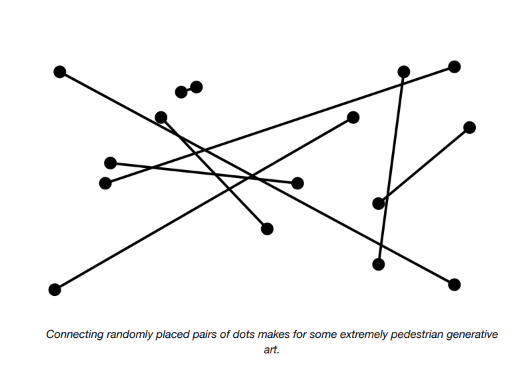
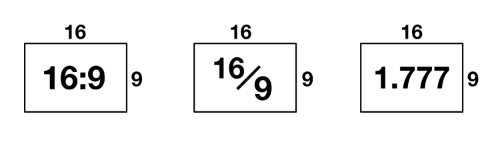
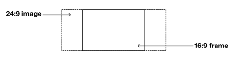
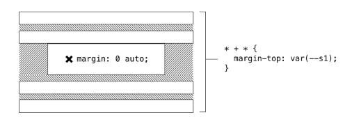
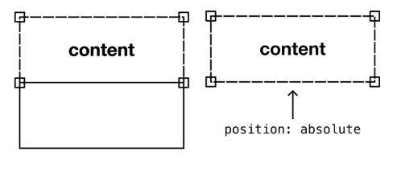
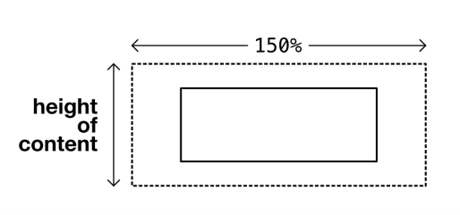

# The Frame

## El problema

Algunas cosas existen como relaciones. Una línea existe como la relación entre dos puntos; sin ambos puntos, la línea no puede llegar a ser.

Cuando se trata de dibujar líneas, hay factores que no necesariamente sabemos, y otros que absolutamente *sabemos*. No necesariamente sabemos dónde, en el universo, aparecerá cada uno de los puntos. Eso podría estar fuera de nuestro control. Pero sabemos que, sin importar dónde aparezcan los puntos, podremos dibujar una línea recta entre ellos.



> Conectar pares de puntos colocados aleatoriamente resulta en un arte generativo extremadamente pedestre.

La posición de los puntos es variable, pero la naturaleza de su relación es constante. Capitalizar las constantes que existen a pesar de las variables es cómo damos forma a los sistemas dinámicos.

## Relación de aspecto (Aspect ratio)

La relación de aspecto es otra constante que surge mucho, especialmente cuando se trabaja con imágenes. Encuentras la relación de aspecto dividiendo el ancho de una imagen por su altura.



El elemento `` es un *replaced element* ↗; es un elemento *reemplazado* por la fuente cargada externamente a la que apunta.

Esta fuente (un archivo de imagen como PNG, JPEG o SVG) tiene ciertas características fuera de tu control como escritor de CSS. La relación de aspecto es una de esas características, y se determina cuando la imagen se crea y recorta originalmente.

Hacer que tus imágenes sean responsivas es cuestión de asegurar que no desborden su contenedor. Un valor `max-width` de `100%` hace exactamente eso.

```css linenums="1"
img {
  max-width: 100%;
}
```

## Imágenes responsivas globales

Dado que este comportamiento responsivo básico debería ser el predeterminado para todas las imágenes, aplico el estilo con un selector de elemento no específico. No todos tus estilos son específicos de componentes; lee *Global and local styling* para más información.

Ahora el ancho de la imagen coincidirá con uno de dos valores:

- Su propio ancho intrínseco/natural, basado en los datos del archivo
- El ancho del espacio horizontal ofrecido por el elemento contenedor

Importantemente, la altura — en cualquier caso — está determinada por la relación de aspecto. Es lo mismo que escribir `height: auto`, pero esa declaración explícita no es necesaria en los navegadores modernos compatibles.

```
height == width / aspect ratio
```

A veces queremos dictar la relación de aspecto, en lugar de heredarla del archivo de imagen. La única forma de lograrlo sin aplastar o distorsionar la imagen es recortarla dinámicamente. Declarar `object-fit: cover` en una imagen hará exactamente eso: recortarla para que se ajuste al espacio sin aumentar su relación de aspecto. El contenedor se convierte en una ventana hacia la imagen no distorsionada.



Lo que podría ser útil es una solución general mediante la cual podamos dibujar un rectángulo, basado en una relación de aspecto dada, y convertirlo en una ventana hacia cualquier contenido que coloquemos dentro.

## La solución

Lo primero que necesitamos hacer es encontrar una forma de darle a un elemento arbitrario una relación de aspecto *sin* codificar su ancho y altura. Esto es, necesitamos hacer que un contenedor se comporte como una imagen (reemplazada).

En el momento de escribir esto, el *CSS Working Group ha propuesto una propiedad `aspect-ratio`* ↗ que tomaría un valor `x/n`:

```css linenums="1"
.frame {
  aspect-ratio: 16/9;
}
```

Es temprano, y ningún navegador ha implementado esta propiedad hasta ahora. Mientras tanto, podemos apoyarnos en una *técnica de relación intrínseca* ↗ escrita por primera vez en 2009. La técnica capitaliza el hecho de que el `padding`, incluso en la dimensión vertical, es relativo al ancho del elemento. Esto es, `padding-bottom: 56.25%` hará que un elemento vacío (sin altura establecida) sea *nueve dieciseisavos más alto que ancho* — una relación de aspecto de `16:9`. Encuentras `56.25%` dividiendo `9` (que representa la altura) por `16` (que representa el ancho) — al revés de encontrar la relación de aspecto en sí misma.



Usando propiedades personalizadas y `calc()`, podemos crear una interfaz que acepte cualquier número para los valores izquierdo (numerador, o `n`) y derecho (denominador, o `d`) de la relación:

```css linenums="1"
.frame {
  padding-bottom: calc(var(--n) / var(--d) * 100%);
}
```

Asumiendo que `class="frame"` es un elemento a nivel de bloque (como un `<div>`), su ancho coincidirá automáticamente con el de su padre. Cualquiera que sea el valor de ancho calculado, la altura se determina multiplicándolo por `9 / 16`.

## Colocando el contenido

Cualquier contenido agregado al elemento actualmente se mostrará visualmente *por encima* del padding inferior que constituye la altura deseada. Obtenemos el contenido, luego el gran espacio que el padding crea debajo de él, que no es lo que queremos.

En su lugar, podemos colocar el elemento *sobre* el área con relleno usando posicionamiento.

```css linenums="1"
.frame {
  --n: 9;  /* ancho */
  --d: 16; /* altura */
  padding-bottom: calc(var(--n) / var(--d) * 100%);
  position: relative;
}
.frame > * {
  overflow: hidden;
  position: absolute;
  top: 0;
  right: 0;
  bottom: 0;
  left: 0;
}
```


### ⚠ Cuidado con el posicionamiento absoluto

Cuando le das a un elemento `position: absolute`, lo eliminas del flujo natural del documento. Se coloca como si los elementos a su alrededor no existieran. En la mayoría de las circunstancias, esto es altamente indeseable, y puede llevar fácilmente a problemas como superposición y contenido oscurecido.

En este caso, estamos usando el posicionamiento absoluto de manera controlada, fijando el elemento hijo a cada una de las esquinas de su padre. Esperamos que ocurra recorte, y nos negamos a "enmarcar" cualquier contenido que necesite verse en su totalidad.

## Recorte (Cropping)

Entonces, ¿cómo funciona el recorte? Para elementos reemplazados, como elementos `` y `<video />`, solo necesitamos darles un `width` y `height` del `100%`, junto con `object-fit: cover`.

```css linenums="1"
.frame > img,
.frame > video {
  width: 100%;
  height: 100%;
  object-fit: cover;
}
```

## Posición de recorte

Implícitamente, el valor de la propiedad complementaria `object-position` es `50% 50%`, lo que significa que el medio se recorta alrededor de su punto central. Es probable que esta sea la posición de recorte más deseable (ya que la mayoría de las imágenes tienen un punto focal en algún lugar hacia su centro). Ten en cuenta que `object-position` está a tu disposición para ajustes.

### Elementos no reemplazados

La propiedad `object-fit` no está diseñada para elementos normales no reemplazados, por lo que tendremos que incluir algo más para manejarlos. Afortunadamente, la justificación y alineación de Flexbox pueden tener un efecto similar. Dado que Flexbox no tiene efecto en elementos reemplazados, podemos agregar de manera segura todos los estilos a todos los elementos, con el selector `*`.

```css linenums="1"
.frame {
  --n: 9;  /* ancho */
  --d: 16; /* altura */
  padding-bottom: calc(var(--n) / var(--d) * 100%);
  position: relative;
}
.frame > * {
  overflow: hidden;
  position: absolute;
  top: 0;
  right: 0;
  bottom: 0;
  left: 0;
  display: flex;
  justify-content: center;
  align-items: center;
}
.frame > img,
.frame > video {
  width: 100%;
  height: 100%;
  object-fit: cover;
}
```

Ahora cualquier elemento simple se colocará en el centro del `Frame`, y se recortará donde sea más alto o más ancho que el propio `Frame`. Si el contenido del elemento lo hace más alto que el padre, se recortará en la parte superior e inferior. Dado que el contenido inline se envuelve, podría ser necesario un ancho específico para causar recorte a la izquierda y derecha. Para asegurar que el recorte ocurra en todos los contextos, y en todos los niveles de zoom, un valor basado en `ch` funcionará.



## ⚠ Imágenes de fondo

Otra forma de recortar una imagen para que cubra la forma de su padre es suministrarla como imagen de fondo, y usar `background-size: cover`. Para esta implementación, asumimos que la imagen debe tratarse como *contenido* y, por lo tanto, proporcionarse con *alternative text* ↗.

Las imágenes de fondo no pueden tomar texto alternativo directamente, y también son eliminadas por algunos modos/temas de alto contraste que algunos de tus usuarios pueden estar ejecutando. Usar una imagen "real", a través de una etiqueta ``, es generalmente preferible para la accesibilidad.

## Casos de uso

El `Frame` es útil principalmente para recortar medios (videos e imágenes) a una relación de aspecto deseada. Una vez que comienzas a controlar la relación de aspecto, puedes, por supuesto, adaptarla a las circunstancias actuales. Por ejemplo, podrías querer dar a las imágenes una relación de aspecto diferente dependiendo de la orientación del viewport.

Es posible lograr esto cambiando los valores de las propiedades personalizadas a través de una consulta de orientación. En el siguiente ejemplo, los elementos `Frame` del ejemplo anterior se hacen cuadrados (en lugar de `16:9`) donde hay relativamente más espacio vertical disponible.

```css linenums="1"
@media (orientation: portrait) {
  .frame {
    --n: 1;
    --d: 1;
  }
}
```

La provisión de Flexbox significa que puedes recortar cualquier tipo de HTML a la relación de aspecto dada, incluyendo elementos `<canvas>` si esos son tus medios elegidos para crear imágenes. Un conjunto de componentes tipo tarjeta podría contener cada uno una imagen o — donde no haya ninguna disponible— un respaldo textual.

*Esta demostración interactiva solo está disponible en el sitio de Every Layout* ↗.

## El generador

Usa esta herramienta para generar CSS y HTML básicos de Frame.

La herramienta generadora de código solo está disponible en el *sitio de documentación adjunto* ↗. Aquí está la solución básica, con comentarios.

Reemplaza los valores `--n` (numerador) y `--d` (denominador) con los que desees, para crear la relación de aspecto.

**CSS**

```css linenums="1"
.frame {
  --n: 9;  /* ancho */
  --d: 16; /* altura */
  padding-bottom: calc(var(--n) / var(--d) * 100%);
  position: relative;
}
.frame > * {
  overflow: hidden;
  position: absolute;
  top: 0;
  right: 0;
  bottom: 0;
  left: 0;
  display: flex;
  justify-content: center;
  align-items: center;
}
.frame > img,
.frame > video {
  width: 100%;
  height: 100%;
  object-fit: cover;
}
```

**HTML**

El siguiente ejemplo usa una imagen. Debe haber solo un elemento hijo, ya sea un elemento reemplazado o de otro tipo.

```html linenums="1"
<div class="frame">
  
</div>
```

## El componente

Una implementación de elemento personalizado del `Frame` está disponible para descargar ↗.

**API de Props**

Las siguientes props (atributos) harán que el componente se renderice nuevamente cuando se alteren. Pueden ser alterados a mano — en las herramientas de desarrollo del navegador — o como sujetos del estado de la aplicación heredada.

| Nombre | Tipo | Default | Descripción |
|---|---|---|---|
| `ratio` | string | `"16:9"` | La relación de aspecto del elemento |

## Ejemplos

### Frame de imagen

El elemento personalizado toma una expresión `ratio`, como `4:3` (`16:9` es el predeterminado).

```html linenums="1"
<frame-l ratio="4:3">
  
</frame-l>
```
