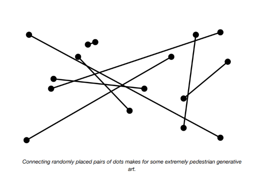
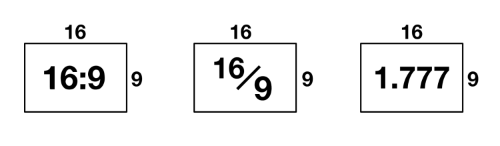
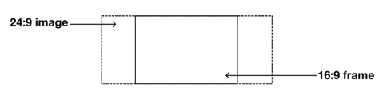
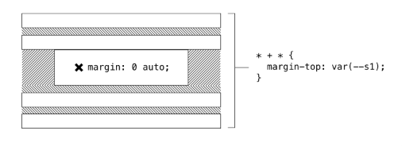
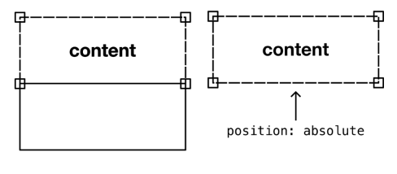
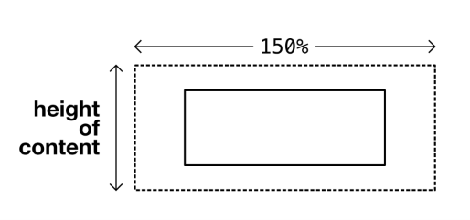

# The Frame

## El problema

Algunas cosas existen como relaciones. Una línea existe como la relación entre dos puntos; sin ambos puntos, la línea no puede llegar a ser.

Cuando se trata de dibujar líneas, hay factores que no necesariamente sabemos, y otros que absolutamente *sabemos*. No necesariamente sabemos dónde, en el universo, aparecerá cada uno de los puntos. Eso podría estar fuera de nuestro control. Pero sabemos que, sin importar dónde aparezcan los puntos, podremos dibujar una línea recta entre ellos.



> Conectar pares de puntos colocados aleatoriamente resulta en un arte generativo extremadamente pedestre.

La posición de los puntos es variable, pero la naturaleza de su relación es constante. Capitalizar las constantes que existen a pesar de las variables es cómo damos forma a los sistemas dinámicos.

??? info "Explicacion"

    Claro. Esta parte de **Every Layout** está introduciendo una idea fundamental: **diseñar pensando en relaciones estables, no en posiciones fijas**.

    Vamos por partes.

    __1. ¿Qué significa que algo "existe como una relación"?__

    El texto empieza con:

    > Una línea existe como la relación entre dos puntos.

    Piensa en esto:

    ```text
    ●────────────●
    A            B
    ```

    La línea depende de que existan **A y B**.

    No importa demasiado dónde estén:

    ```text
    ●────●


            ●──────────────●


      ●
          ●
    ```

    Mientras existan dos puntos, podemos establecer una relación entre ellos: **una línea que los conecta**.

    Por eso dice que la línea no existe de manera independiente. Su existencia depende de la relación entre los dos puntos.

    ---

    __2. ¿Qué cosas conocemos y qué cosas no conocemos?__

    Aquí está la parte importante para CSS.

    Supongamos que estás diseñando una interfaz y tienes dos elementos:

    ```html
    <div class="A"></div>
    <div class="B"></div>
    ```

    Tú quizá **no sabes exactamente dónde estarán** cuando la página se ejecute.

    Por ejemplo:

    * en un monitor grande estarán separados;
    * en un celular estarán mucho más juntos;
    * el usuario puede cambiar el tamaño de la ventana;
    * el contenido de A puede crecer;
    * B puede tener diferente tamaño;
    * el idioma puede cambiar la longitud del texto.

    Es decir:

    **la posición concreta es variable.**

    Pero hay algo que sí puedes afirmar:

    > Quiero que A y B tengan una relación determinada.

    Por ejemplo:

    ```text
    A ───────── B
    ```

    Quieres que estén conectados, separados por cierta distancia, alineados, etc.

    ---

    __3. Esto es exactamente lo que busca el diseño responsivo__

    Aquí está el salto conceptual.

    Un enfoque tradicional podría decir:

    > "En 1920px pongo A aquí, en 1024px lo pongo aquí y en 600px lo pongo allá."

    Eso significa que estás intentando controlar **posiciones concretas**.

    Por ejemplo:

    ```css
    .element {
        position: absolute;
        left: 350px;
        top: 200px;
    }
    ```

    Pero eso es frágil.

    Porque estás diciendo:

    > "Sé exactamente dónde estará este elemento."

    Y en una interfaz responsive eso normalmente es falso.

    ---

    __4. El enfoque de Every Layout__

    Every Layout propone algo diferente:

    > **No intentes conocer todas las posiciones. Define las relaciones que deben mantenerse.**

    Por ejemplo, en vez de pensar:

    ```text
    A debe estar en x = 200px
    B debe estar en x = 500px
    ```

    piensas:

    ```text
    A ← cierta distancia → B
    ```

    O:

    ```text
    A
    ↓
    B
    ```

    O:

    ```text
    A    B    C
    ```

    manteniendo una relación coherente entre ellos.

    CSS moderno es especialmente bueno para esto gracias a:

    * Flexbox
    * Grid
    * `gap`
    * `min()`
    * `max()`
    * `clamp()`
    * tamaños relativos
    * wrapping
    * intrinsic sizing

    ---

    __5. La frase más importante__

    El texto dice:

    > **La posición de los puntos es variable, pero la naturaleza de su relación es constante.**

    Esta frase es prácticamente la filosofía de **The Frame**.

    Imagina que tienes:

    ```text
    ●              ●
    ```

    No sabes dónde aparecerán los puntos.

    Pero sabes:

    > "Estos dos puntos deben estar conectados."

    Entonces tu sistema no necesita conocer sus coordenadas.

    Solo necesita conocer la **regla de relación**:

    ```text
    punto A ───────── punto B
    ```

    Eso es muchísimo más robusto.

    ---

    __6. ¿Qué tiene que ver esto con "The Frame"?__

    Aquí empieza a aparecer el concepto de **Frame**.

    Un *frame* (marco) establece una relación entre un elemento y los límites que lo contienen.

    Por ejemplo, imagina:

    ```text
    ┌──────────────────────────────┐
    │                              │
    │         CONTENIDO            │
    │                              │
    └──────────────────────────────┘
    ```

    El contenido no necesita saber:

    > "Estoy exactamente a 173px del borde izquierdo."

    Puede establecer una relación:

    > "Tengo un margen determinado respecto al marco."

    Y el marco puede cambiar:

    ```text
    ┌──────────────────────┐
    │                      │
    │      CONTENIDO       │
    │                      │
    └──────────────────────┘
    ```

    o:

    ```text
    ┌──────────────────────────────────────────┐
    │                                          │
    │              CONTENIDO                   │
    │                                          │
    └──────────────────────────────────────────┘
    ```

    La relación sigue funcionando.

    ---

    __7. La idea de "constantes dentro de variables"__

    Esta es probablemente la idea más profunda del fragmento.

    Tenemos:

    ### Variables

    Lo que no controlamos:

    * tamaño de pantalla
    * cantidad de contenido
    * tamaño de fuente
    * posición de los elementos
    * ancho disponible
    * preferencias del usuario

    ### Constantes

    Lo que sí podemos definir:

    * separación mínima
    * alineación
    * relación entre elementos
    * ancho máximo
    * comportamiento al quedarse sin espacio
    * límites del contenido

    Entonces construimos el sistema alrededor de las constantes.

    Visualmente:

    ```text
    VARIABLE                    CONSTANTE

    pantalla 1920px ─────┐
                        │
    pantalla 1366px ─────┼──→ misma relación
                        │
    pantalla 768px ──────┤
                        │
    pantalla 375px ──────┘
    ```

    La pantalla cambia.

    **La regla no.**

    Eso es lo que hace que el layout sea robusto.

    ---

    __8. Y esto conecta directamente con lo que has estado estudiando__

    Recuerda lo que vimos sobre **Cluster, Sidebar, Switcher, Cover y Grid**.

    Todos esos patrones siguen esta filosofía.

    Por ejemplo, un **Switcher** no dice:

    > "Cuando la pantalla tenga exactamente 768px, cambia."

    Dice algo más parecido a:

    > "Mientras haya espacio, coloca los elementos horizontalmente; cuando ya no quepan, permite que se apilen."

    La posición concreta es variable.

    La relación es constante.

    Otro ejemplo: **Grid**.

    En lugar de decir:

    ```text
    1920px → 4 columnas
    1366px → 4 columnas
    1024px → 3 columnas
    768px  → 2 columnas
    375px  → 1 columna
    ```

    puedes expresar una relación basada en el **espacio disponible**:

    > "Cada elemento necesita al menos X espacio."

    Y CSS decide cuántos caben.

    Eso es mucho más cercano a la filosofía de Every Layout.

    ---

    __En una frase__

    **The Frame te está enseñando a dejar de diseñar "dónde están las cosas" y empezar a diseñar "cómo se relacionan las cosas".**

    O todavía más simple:

    > **No controles las coordenadas; controla las relaciones.**

    Esa es una de las ideas que hacen que un sistema de layout pueda sobrevivir a pantallas, contenidos y contextos que tú nunca anticipaste.

## Relación de aspecto (Aspect ratio)

La relación de aspecto es otra constante que surge mucho, especialmente cuando se trabaja con imágenes. Encuentras la relación de aspecto dividiendo el ancho de una imagen por su altura.



El elemento `` es un *replaced element* ↗; es un elemento *reemplazado* por la fuente cargada externamente a la que apunta.

Esta fuente (un archivo de imagen como PNG, JPEG o SVG) tiene ciertas características fuera de tu control como escritor de CSS. La relación de aspecto es una de esas características, y se determina cuando la imagen se crea y recorta originalmente.

Hacer que tus imágenes sean responsivas es cuestión de asegurar que no desborden su contenedor. Un valor `max-width` de `100%` hace exactamente eso.

```css linenums="1"
img {
  max-width: 100%;
}
```

??? info "Explicacion"

    Sí. Esta sección sigue exactamente con la misma filosofía que vimos antes: **hay cosas que no controlas, pero puedes diseñar alrededor de las constantes que sí conoces**.

    __1. ¿Qué es la relación de aspecto?__

    La **relación de aspecto** describe la proporción entre el ancho y la altura.

    Se calcula:

    [
    \text{aspect ratio} = \frac{\text{ancho}}{\text{alto}}
    ]

    Por ejemplo, una imagen de:

    ```text
    1200 × 800
    ```

    tiene:

    [
    1200 / 800 = 1.5
    ]

    Su relación de aspecto es **1.5:1**, que normalmente se expresa como **3:2**.

    Visualmente:

    ```text
    ┌──────────────────────────────┐
    │                              │
    │                              │
    │                              │  800
    │                              │
    └──────────────────────────────┘
                1200
    ```

    Si reduces el tamaño manteniendo la misma proporción:

    ```text
    ┌─────────────────────┐
    │                     │
    │                     │
    └─────────────────────┘
          600 × 400
    ```

    La imagen sigue teniendo **3:2**.

    ---

    __2. ¿Por qué dice que es una constante?__

    Aquí está la conexión con lo anterior.

    Cuando recibes una imagen:

    ```text
    foto.jpg
    ```

    tú no decides necesariamente su proporción.

    La fotografía pudo haberse creado originalmente como:

    ```text
    4000 × 3000
    ```

    → 4:3

    o:

    ```text
    6000 × 4000
    ```

    → 3:2

    o:

    ```text
    1920 × 1080
    ```

    → 16:9

    Esa característica viene con la imagen.

    Por eso el texto dice:

    > "ciertas características fuera de tu control como escritor de CSS."

    Tú controlas el **layout**, pero no necesariamente las características originales del archivo.

    ---

    __3. ¿Qué significa `replaced element`?__

    Esto es importante.

    Un `` no funciona exactamente como un `<div>`.

    Cuando escribes:

    ```html
    
    ```

    HTML está diciendo:

    > "Aquí debe aparecer el recurso externo ubicado en `foto.jpg`."

    El navegador carga ese recurso y lo **reemplaza visualmente** dentro del elemento ``.

    Por eso se llama **replaced element**.

    Otros ejemplos incluyen elementos como:

    ```html
    
    <video>
    <iframe>
    ```

    Su contenido visual depende de una fuente externa o de un recurso que no está definido simplemente como texto HTML.

    ---

    __4. ¿Qué problema aparece en responsive?__

    Supongamos que tienes:

    ```html
    <div class="container">
        
    </div>
    ```

    Y la imagen mide:

    ```text
    1200px
    ```

    pero el contenedor solamente mide:

    ```text
    500px
    ```

    Si la imagen conserva sus dimensiones originales, podría terminar así:

    ```text
    ┌───────────────┐
    │   CONTENEDOR  │
    │               │
    └───────────────┘
    ████████████████████████████
          IMAGEN
    ```

    La imagen **desborda el contenedor**.

    Y eso es justamente lo que quieres evitar en un diseño responsive.

    ---

    __5. ¿Qué hace `max-width: 100%`?__

    Aquí aparece la solución:

    ```css
    img {
      max-width: 100%;
    }
    ```

    Esto significa:

    > **La imagen no puede ser más ancha que su contenedor.**

    Por ejemplo:

    ```text
    contenedor = 500px
    imagen     = 1200px
    ```

    CSS permite que la imagen se reduzca:

    ```text
    ┌──────────────────────────────┐
    │                              │
    │          IMAGEN              │
    │                              │
    └──────────────────────────────┘
                500px
    ```

    Pero hay algo muy importante:

    __`max-width` no dice que la imagen siempre tenga 100%.__

    Dice:

    > **Como máximo puede tener el 100% del ancho disponible.**

    Por eso, si la imagen mide originalmente 400px y el contenedor mide 1000px:

    ```text
    contenedor = 1000px
    imagen     = 400px
    ```

    no se estira automáticamente a 1000px solamente por esto.

    ```css
    img {
        max-width: 100%;
    }
    ```

    La imagen puede seguir teniendo 400px.

    ---

    __6. ¿Y qué pasa con la altura?__

    Aquí entra nuevamente la **relación de aspecto**.

    Supongamos:

    ```text
    imagen original: 1200 × 800
    ```

    La relación es:

    ```text
    3:2
    ```

    Si el navegador necesita reducirla a:

    ```text
    600px de ancho
    ```

    la altura correspondiente será:

    ```text
    400px
    ```

    Entonces:

    ```text
    1200 × 800
        ↓
    600 × 400
    ```

    La relación permanece:

    ```text
    3:2
    ```

    Por eso `max-width: 100%` es tan útil para imágenes: permite que la imagen **se adapte al ancho disponible sin perder su proporción**.

    ---

    __7. Aquí aparece nuevamente la filosofía de Every Layout__

    Fíjate en lo elegante del enfoque.

    No estás diciendo:

    ```css
    img {
        width: 500px;
    }
    ```

    porque eso supone conocer el contexto.

    Tampoco estás diciendo:

    ```css
    img {
        width: 50vw;
    }
    ```

    porque estás vinculando directamente la imagen al viewport.

    Estás diciendo:

    ```css
    img {
        max-width: 100%;
    }
    ```

    Es decir:

    > **"No sé cuánto espacio tendrás disponible, pero sé que nunca debes desbordarlo."**

    Eso es exactamente la idea que explicábamos antes:

    **la posición y el tamaño disponibles son variables; la regla de relación es constante.**

    ---

    __8. Una distinción importante__

    No confundas:

    ```css
    width: 100%;
    ```

    con:

    ```css
    max-width: 100%;
    ```

    __`width: 100%`__

    Le dices:

    > "Hazte tan ancho como tu contenedor."

    ```text
    contenedor: 1000px
    imagen:     1000px
    ```

    Puede incluso **agrandar** una imagen pequeña.

    __`max-width: 100%`__

    Le dices:

    > "No permitas que seas más ancho que tu contenedor."

    ```text
    contenedor: 1000px
    imagen:      400px
    ```

    → permanece en 400px.

    Pero:

    ```text
    contenedor: 500px
    imagen:    1200px
    ```

    → se reduce a 500px.

    ---

    __La idea central__

    Puedes resumir todo este apartado así:

    ```text
    ┌──────────────────────────────────────┐
    │           CONTENEDOR                 │
    │                                      │
    │     ┌──────────────────────┐         │
    │     │        IMAGEN        │         │
    │     │                      │         │
    │     └──────────────────────┘         │
    │                                      │
    └──────────────────────────────────────┘
    ```

    **El contenedor puede cambiar.**

    **El tamaño de la imagen puede cambiar.**

    **Pero su relación de aspecto puede mantenerse.**

    Y CSS se encarga de mantener la imagen dentro del espacio disponible:

    ```css
    img {
        max-width: 100%;
    }
    ```

    Esa es la constante que el sistema puede garantizar.

## Imágenes responsivas globales

Dado que este comportamiento responsivo básico debería ser el predeterminado para todas las imágenes, aplico el estilo con un selector de elemento no específico. No todos tus estilos son específicos de componentes; lee *Global and local styling* para más información.

Ahora el ancho de la imagen coincidirá con uno de dos valores:

- Su propio ancho intrínseco/natural, basado en los datos del archivo
- El ancho del espacio horizontal ofrecido por el elemento contenedor

Importantemente, la altura — en cualquier caso — está determinada por la relación de aspecto. Es lo mismo que escribir `height: auto`, pero esa declaración explícita no es necesaria en los navegadores modernos compatibles.

```
height == width / aspect ratio
```

A veces queremos dictar la relación de aspecto, en lugar de heredarla del archivo de imagen. La única forma de lograrlo sin aplastar o distorsionar la imagen es recortarla dinámicamente. Declarar `object-fit: cover` en una imagen hará exactamente eso: recortarla para que se ajuste al espacio sin aumentar su relación de aspecto. El contenedor se convierte en una ventana hacia la imagen no distorsionada.



Lo que podría ser útil es una solución general mediante la cual podamos dibujar un rectángulo, basado en una relación de aspecto dada, y convertirlo en una ventana hacia cualquier contenido que coloquemos dentro.

??? info "Explicacion"

    Exacto. Aquí el texto da un paso más: primero explica **cómo hacer que todas las imágenes sean responsivas**, y luego introduce el problema de **cuando tú quieres controlar la relación de aspecto**.

    Vamos por partes.

    __1. ¿Por qué usar `img` como selector global?__

    En lugar de hacer esto:

    ```css
    .card img {
      max-width: 100%;
    }

    .hero img {
      max-width: 100%;
    }

    .gallery img {
      max-width: 100%;
    }
    ```

    Every Layout propone simplemente:

    ```css
    img {
      max-width: 100%;
    }
    ```

    ¿Por qué?

    Porque esto no es realmente un comportamiento específico de un componente.

    No importa si la imagen está dentro de:

    * una tarjeta,
    * un artículo,
    * un `header`,
    * una galería,
    * un sidebar,
    * etc.

    La regla general es:

    > **Una imagen nunca debería desbordar horizontalmente su contenedor.**

    Por eso tiene sentido convertirlo en un **estilo global**.

    ---

    __2. ¿Qué significa "ancho intrínseco"?__

    Esta palabra es importante:

    > **intrínseco = propio del elemento.**

    Supongamos que tienes:

    ```text
    foto.jpg
    1200 × 800
    ```

    Su ancho intrínseco es:

    ```text
    1200px
    ```

    Ahora imagina que su contenedor tiene:

    ```text
    1500px
    ```

    Como la imagen solamente mide naturalmente 1200px:

    ```text
    contenedor = 1500px
    imagen     = 1200px
    ```

    `max-width: 100%` **no la estira**.

    ---

    Pero si ocurre lo contrario:

    ```text
    contenedor = 600px
    imagen     = 1200px
    ```

    entonces:

    ```css
    img {
      max-width: 100%;
    }
    ```

    obliga a que:

    ```text
    imagen → 600px
    ```

    Por eso el texto dice que el ancho será uno de estos dos valores:

    > **su propio ancho natural o el ancho disponible del contenedor.**

    En términos conceptuales:

    ```text
    ancho final = min(ancho natural, ancho disponible)
    ```

    Eso es bastante elegante.

    ---

    __3. ¿Y qué pasa con la altura?__

    Aquí vuelve la relación de aspecto.

    Supongamos:

    ```text
    imagen original
    1200 × 800
    ```

    Su relación:

    ```text
    1200 / 800 = 1.5
    ```

    Si el ancho termina siendo 600px:

    ```text
    height = width / aspect ratio

    height = 600 / 1.5

    height = 400px
    ```

    Por tanto:

    ```text
    600 × 400
    ```

    La imagen mantiene su proporción.

    Por eso el texto dice:

    ```text
    height == width / aspect ratio
    ```

    No significa que literalmente debas escribir eso en CSS. Es una forma matemática de explicar cómo se determina la altura.

    ---

    __4. ¿Por qué no necesitamos `height: auto`?__

    Podrías escribir:

    ```css
    img {
      max-width: 100%;
      height: auto;
    }
    ```

    Y durante mucho tiempo fue una práctica muy común.

    Pero los navegadores modernos ya conservan correctamente la relación de aspecto de las imágenes en este escenario.

    Por eso basta con:

    ```css
    img {
      max-width: 100%;
    }
    ```

    La imagen puede reducirse horizontalmente y su altura se ajusta proporcionalmente.

    ---

    __5. Ahora aparece un problema diferente__

    Hasta aquí hemos dicho:

    > "Respeta la relación de aspecto que trae la imagen."

    Pero imagina que tienes una interfaz donde **todas las imágenes deben ocupar un rectángulo de 16:9**.

    Por ejemplo:

    ```text
    ┌──────────────────────────────┐
    │                              │
    │           IMAGEN             │
    │                              │
    └──────────────────────────────┘
                16:9
    ```

    Pero recibes imágenes con diferentes proporciones:

    ```text
    foto A → 4:3
    foto B → 3:2
    foto C → 16:9
    foto D → 1:1
    ```

    Si simplemente haces:

    ```css
    img {
      width: 100%;
    }
    ```

    cada una tendrá una altura diferente.

    Resultado:

    ```text
    ┌───────────────┐
    │               │
    │     FOTO      │
    │               │
    └───────────────┘

    ┌───────────────┐
    │               │
    │               │
    │     FOTO      │
    │               │
    └───────────────┘

    ┌───────────────┐
    │               │
    │     FOTO      │
    └───────────────┘
    ```

    Para una galería puede quedar bastante feo.

    ---

    __6. ¿Por qué no podemos simplemente cambiar la relación de aspecto?__

    Porque si fuerzas una imagen 4:3 dentro de un espacio 16:9 sin recortarla, tienes dos posibilidades:

    ### Opción A: deformarla

    ```text
    original:

    ┌──────────────┐
    │              │
    │              │
    └──────────────┘

    forzada:

    ┌──────────────────────┐
    │                      │
    └──────────────────────┘
    ```

    La persona de la fotografía podría quedar como si hubiera sido estirada por los extremos. 😄

    Eso es lo que queremos evitar.

    ### Opción B: recortarla

    En lugar de deformar la imagen:

    ```text
    imagen original

    ┌────────────────────────┐
    │                        │
    │       fotografía       │
    │                        │
    └────────────────────────┘
    ```

    creamos una ventana:

    ```text
    ┌──────────────────────┐
    │                      │
    │    parte visible     │
    │                      │
    └──────────────────────┘
    ```

    La imagen **sigue siendo 4:3**, pero solamente mostramos una parte.

    ---

    __7. Aquí entra `object-fit: cover`__

    Esto:

    ```css
    img {
      object-fit: cover;
    }
    ```

    significa, conceptualmente:

    > **"Haz que la imagen cubra completamente el espacio disponible, manteniendo su proporción. Si sobra imagen, recórtala."**

    Por ejemplo:

    ```text
    espacio 16:9

    ┌──────────────────────────────┐
    │                              │
    │         ┌────────────┐       │
    │         │            │       │
    │         │   FOTO     │       │
    │         │            │       │
    │         └────────────┘       │
    │                              │
    └──────────────────────────────┘
    ```

    La imagen se escala hasta cubrir todo el rectángulo.

    Lo que no cabe se corta.

    ---

    __8. "El contenedor se convierte en una ventana"__

    Esta es probablemente la metáfora más importante del texto.

    Imagínate una fotografía enorme:

    ```text
    ┌───────────────────────────────────────┐
    │                                       │
    │          IMAGEN COMPLETA              │
    │                                       │
    │                                       │
    │                 ┌──────────────┐      │
    │                 │              │      │
    │                 │   VENTANA    │      │
    │                 │              │      │
    │                 └──────────────┘      │
    │                                       │
    └───────────────────────────────────────┘
    ```

    La imagen **no se deforma**.

    La ventana determina qué parte vemos.

    Eso es `cover`.

    ---

    __9. Pero hay un detalle importante__

    Para que `object-fit: cover` tenga un efecto realmente útil, normalmente necesitas darle a la imagen un **espacio con dimensiones determinadas**.

    Por ejemplo:

    ```css
    img {
      width: 100%;
      height: 300px;
      object-fit: cover;
    }
    ```

    Ahora tienes:

    ```text
    ┌──────────────────────────────┐
    │                              │
    │            FOTO              │
    │                              │
    └──────────────────────────────┘
            300px de alto
    ```

    La imagen cubrirá ese espacio.

    Pero aquí aparece la pregunta interesante:

    > **¿Cómo conseguimos un rectángulo con una relación de aspecto concreta sin tener que calcular manualmente su altura?**

    Por ejemplo:

    > "Quiero un espacio 16:9, independientemente de cuánto mida el ancho."

    Y **esa es precisamente la puerta de entrada al siguiente concepto de The Frame**.

    ---

    __10. La evolución de la idea__

    Hasta ahora tenemos tres niveles:

    __Nivel 1 — Imagen natural__

    ```css
    img {
      max-width: 100%;
    }
    ```

    La imagen dice:

    > "Yo tengo mi propia proporción."

    ---

    __Nivel 2 — Imagen recortada__

    ```css
    img {
      object-fit: cover;
    }
    ```

    El contenedor dice:

    > "Aquí tienes un espacio determinado; tú debes cubrirlo sin deformarte."

    ---

    __Nivel 3 — The Frame__

    Ahora queremos algo más abstracto:

    > **"Quiero poder crear un marco con una relación de aspecto determinada y meter cualquier contenido dentro."**

    Por ejemplo:

    ```text
    16:9
    ┌────────────────────────────┐
    │                            │
    │          contenido         │
    │                            │
    └────────────────────────────┘
    ```

    o:

    ```text
    1:1
    ┌───────────────┐
    │               │
    │   contenido   │
    │               │
    └───────────────┘
    ```

    o:

    ```text
    4:3
    ┌────────────────────┐
    │                    │
    │     contenido      │
    │                    │
    └────────────────────┘
    ```

    Y lo interesante es que **el contenido puede ser una imagen, vídeo, iframe, mapa, etc.**

    Ahí es donde `The Frame` deja de ser simplemente "hacer imágenes responsive" y se convierte en un **patrón de layout reutilizable**: el marco controla la geometría y el contenido simplemente vive dentro de esa "ventana".

## La solución

Lo primero que necesitamos hacer es encontrar una forma de darle a un elemento arbitrario una relación de aspecto *sin* codificar su ancho y altura. Esto es, necesitamos hacer que un contenedor se comporte como una imagen (reemplazada).

En el momento de escribir esto, el *CSS Working Group ha propuesto una propiedad `aspect-ratio`* ↗ que tomaría un valor `x/n`:

```css linenums="1"
.frame {
  aspect-ratio: 16/9;
}
```

Es temprano, y ningún navegador ha implementado esta propiedad hasta ahora. Mientras tanto, podemos apoyarnos en una *técnica de relación intrínseca* ↗ escrita por primera vez en 2009. La técnica capitaliza el hecho de que el `padding`, incluso en la dimensión vertical, es relativo al ancho del elemento. Esto es, `padding-bottom: 56.25%` hará que un elemento vacío (sin altura establecida) sea *nueve dieciseisavos más alto que ancho* — una relación de aspecto de `16:9`. Encuentras `56.25%` dividiendo `9` (que representa la altura) por `16` (que representa el ancho) — al revés de encontrar la relación de aspecto en sí misma.



Usando propiedades personalizadas y `calc()`, podemos crear una interfaz que acepte cualquier número para los valores izquierdo (numerador, o `n`) y derecho (denominador, o `d`) de la relación:

```css linenums="1"
.frame {
  padding-bottom: calc(var(--n) / var(--d) * 100%);
}
```

Asumiendo que `class="frame"` es un elemento a nivel de bloque (como un `<div>`), su ancho coincidirá automáticamente con el de su padre. Cualquiera que sea el valor de ancho calculado, la altura se determina multiplicándolo por `9 / 16`.

??? info "Explicacion"

    Sí. Esta parte es clave porque aquí Every Layout construye **el mecanismo que permite crear un `Frame` con cualquier relación de aspecto**. Y además explica una técnica antigua que hoy podemos entender mucho mejor gracias a `aspect-ratio`.

    ---

    __1. ¿Cuál es el problema que quieren resolver?__

    Hasta ahora tenemos una imagen:

    ```html
    
    ```

    La imagen ya conoce su relación de aspecto porque el archivo la trae incorporada.

    Pero ahora queremos hacer algo como:

    ```html
    <div class="frame">
        ...
    </div>
    ```

    Y queremos decir:

    > "Este `div` debe tener una relación 16:9."

    El problema es que un `div` normalmente **no tiene una relación de aspecto intrínseca**.

    Por ejemplo:

    ```text
    ┌──────────────────────────┐
    │                          │
    │          div             │
    │                          │
    └──────────────────────────┘
    ```

    CSS sabe cuánto mide de ancho, pero la altura depende normalmente de su contenido.

    ---

    __2. Hoy existe `aspect-ratio`__

    El texto menciona una propuesta que en ese momento todavía no estaba implementada.

    Actualmente sí podemos hacer directamente:

    ```css
    .frame {
      aspect-ratio: 16 / 9;
    }
    ```

    Eso significa:

    > **Por cada 16 unidades de ancho, quiero 9 de alto.**

    Por ejemplo:

    ```text
    1600 × 900
    ```

    o:

    ```text
    800 × 450
    ```

    o:

    ```text
    400 × 225
    ```

    Todas son 16:9.

    Así que hoy, para un caso moderno, `aspect-ratio` es la solución natural.

    ---

    __3. Pero el libro está enseñando una técnica histórica muy interesante__

    Antes de `aspect-ratio`, se utilizaba un truco basado en `padding`.

    Y aquí está la parte que inicialmente parece absurda:

    ```css
    .frame {
      padding-bottom: 56.25%;
    }
    ```

    Uno podría pensar:

    > "¿Cómo puede un `padding-bottom` determinar la altura?"

    Y todavía más extraño:

    > "¿Por qué el porcentaje de `padding-bottom` se calcula respecto al **ancho**?"

    Ahí está el truco.

    ---

    __4. El porcentaje de `padding` se basa en el ancho__

    En CSS, cuando escribes:

    ```css
    padding-bottom: 50%;
    ```

    ese `50%` se calcula respecto al **ancho del elemento contenedor**.

    Supongamos:

    ```text
    ancho = 1000px
    ```

    Entonces:

    ```css
    padding-bottom: 50%;
    ```

    produce:

    ```text
    padding-bottom = 500px
    ```

    Es decir:

    ```text
    1000 × 0.5 = 500
    ```

    Visualmente:

    ```text
    ┌──────────────────────────────┐
    │                              │
    │                              │
    │                              │ 500px
    │                              │
    └──────────────────────────────┘
                1000px
    ```

    Por tanto tienes una relación:

    ```text
    1000 : 500
    ```

    que simplificada es:

    ```text
    2 : 1
    ```

    ---

    __5. Ahora hagamos 16:9__

    Queremos:

    ```text
    ancho = 16
    alto  = 9
    ```

    Necesitamos saber qué porcentaje representa 9 respecto de 16:

    [
    9 / 16 = 0.5625
    ]

    Multiplicamos por 100:

    [
    0.5625 × 100 = 56.25%
    ]

    Por eso:

    ```css
    .frame {
      padding-bottom: 56.25%;
    }
    ```

    Y eso crea una relación:

    ```text
    ancho = 16
    alto  = 9
    ```

    Es decir:

    ```text
    16:9
    ```

    ---

    __6. Mira qué ocurre con un ancho real__

    Supongamos:

    ```text
    ancho del frame = 1600px
    ```

    Entonces:

    ```text
    padding-bottom = 1600 × 56.25%
    ```

    es:

    ```text
    1600 × 0.5625 = 900px
    ```

    Tenemos:

    ```text
    1600 × 900
    ```

    ¡16:9!

    Ahora el navegador reduce el ancho:

    ```text
    ancho = 800px
    ```

    Entonces:

    ```text
    800 × 0.5625 = 450px
    ```

    Tenemos:

    ```text
    800 × 450
    ```

    Otra vez:

    ```text
    16:9
    ```

    Y si el ancho es:

    ```text
    400px
    ```

    obtenemos:

    ```text
    400 × 0.5625 = 225px
    ```

    Otra vez:

    ```text
    16:9
    ```

    Eso es precisamente lo que querían:

    > **Una relación de aspecto que se adapta al ancho disponible sin especificar un ancho ni una altura concreta.**

    ---

    __7. Ahora viene la parte inteligente: hacerlo genérico__

    No quieren crear una clase para cada relación:

    ```css
    .frame-16-9 {
      padding-bottom: 56.25%;
    }

    .frame-4-3 {
      padding-bottom: 75%;
    }

    .frame-1-1 {
      padding-bottom: 100%;
    }
    ```

    Quieren que el sistema acepte:

    ```text
    n = numerador
    d = denominador
    ```

    Por ejemplo:

    ```text
    16 / 9
    ```

    o:

    ```text
    4 / 3
    ```

    o:

    ```text
    1 / 1
    ```

    Entonces escriben:

    ```css
    .frame {
      padding-bottom: calc(var(--n) / var(--d) * 100%);
    }
    ```

    ---

    __8. ¿Qué hace exactamente ese `calc()`?__

    Supongamos que tenemos:

    ```css
    .frame {
      padding-bottom: calc(var(--n) / var(--d) * 100%);
    }
    ```

    y:

    ```css
    --n: 9;
    --d: 16;
    ```

    Entonces conceptualmente CSS calcula:

    ```text
    9 / 16 × 100%
    ```

    que es:

    ```text
    56.25%
    ```

    Por tanto termina siendo equivalente a:

    ```css
    padding-bottom: 56.25%;
    ```

    Y obtenemos:

    ```text
    16:9
    ```

    ---

    __9. ¿Por qué llaman a `n` y `d` así?__

    Porque:

    ```text
    n = numerador
    d = denominador
    ```

    Por ejemplo:

    ```text
    9
    ──
    16
    ```

    tenemos:

    ```text
    n = 9
    d = 16
    ```

    **Ojo con esto**, porque puede resultar confuso al principio.

    Cuando hablamos de una relación de aspecto normalmente decimos:

    ```text
    16:9
    ```

    pero para calcular la **altura respecto al ancho** necesitamos:

    ```text
    9 / 16
    ```

    Es decir:

    ```text
    aspect ratio:
    16 / 9

    altura relativa:
    9 / 16
    ```

    Son operaciones inversas porque estamos calculando **qué altura corresponde a determinado ancho**.

    ---

    __10. ¿Qué significa que el `div` tome el ancho de su padre?__

    El texto dice:

    > "Asumiendo que `class="frame"` es un elemento a nivel de bloque..."

    Un `<div>` es normalmente un elemento de bloque.

    Por defecto, si está dentro de:

    ```html
    <div class="parent">
        <div class="frame"></div>
    </div>
    ```

    el `.frame` ocupará el ancho disponible de su padre.

    Por ejemplo:

    ```text
    PADRE
    ┌──────────────────────────────────────┐
    │                                      │
    │ FRAME                                │
    │ ┌──────────────────────────────────┐ │
    │ │                                  │ │
    │ │                                  │ │
    │ └──────────────────────────────────┘ │
    │                                      │
    └──────────────────────────────────────┘
    ```

    Si el padre tiene:

    ```text
    1200px
    ```

    el frame tendrá aproximadamente:

    ```text
    1200px
    ```

    de ancho.

    Y si configuramos:

    ```text
    16:9
    ```

    su altura será:

    ```text
    1200 × 9/16 = 675px
    ```

    Por tanto:

    ```text
    ┌──────────────────────────────────────┐
    │                                      │
    │                                      │ 675px
    │                                      │
    └──────────────────────────────────────┘
                    1200px
    ```

    ---

    __11. La fórmula que debes quedarte__

    El corazón de todo esto es:

    [
    \boxed{\text{altura} = \text{ancho} \times \frac{9}{16}}
    ]

    Para cualquier relación:

    [
    \boxed{\text{altura} = \text{ancho} \times \frac{n}{d}}
    ]

    Por eso:

    ```css
    padding-bottom: calc(var(--n) / var(--d) * 100%);
    ```

    está haciendo matemáticamente lo mismo.

    ---

    __12. Y aquí aparece la verdadera idea de The Frame__

    Esto es lo bonito del patrón.

    No estamos diciendo:

    ```css
    width: 800px;
    height: 450px;
    ```

    Eso sería un tamaño fijo.

    Estamos diciendo:

    > **"No sé cuánto ancho tendrás. Pero cualquiera que sea ese ancho, tu altura deberá ser proporcional."**

    Por ejemplo:

    ```text
    1920 → 1080
    1600 → 900
    1200 → 675
    800  → 450
    400  → 225
    ```

    Todos mantienen:

    ```text
    16:9
    ```

    El ancho es **variable**.

    La relación es **constante**.

    Y esa frase conecta directamente con lo que explicaba el primer apartado:

    > **La posición y el tamaño pueden variar; la naturaleza de la relación permanece constante.**

    Eso es exactamente lo que está haciendo `The Frame`.

    ---

    __Y una actualización importante respecto al texto__

    Como estás leyendo una versión de Every Layout que describe el estado de CSS de aquella época, ten presente que esa parte está **desactualizada en un punto concreto**: hoy no necesitamos recurrir al hack de `padding-bottom` para crear una relación de aspecto.

    Podemos escribir directamente:

    ```css
    .frame {
      aspect-ratio: 16 / 9;
    }
    ```

    La técnica del `padding` sigue siendo excelente para entender **por qué funciona el patrón y de dónde viene**, pero en CSS moderno `aspect-ratio` es mucho más claro y mantenible.


## Colocando el contenido

Cualquier contenido agregado al elemento actualmente se mostrará visualmente *por encima* del padding inferior que constituye la altura deseada. Obtenemos el contenido, luego el gran espacio que el padding crea debajo de él, que no es lo que queremos.

En su lugar, podemos colocar el elemento *sobre* el área con relleno usando posicionamiento.

```css linenums="1"
.frame {
  --n: 9;  /* ancho */
  --d: 16; /* altura */
  padding-bottom: calc(var(--n) / var(--d) * 100%);
  position: relative;
}
.frame > * {
  overflow: hidden;
  position: absolute;
  top: 0;
  right: 0;
  bottom: 0;
  left: 0;
}
```


## ⚠ Cuidado con el posicionamiento absoluto

Cuando le das a un elemento `position: absolute`, lo eliminas del flujo natural del documento. Se coloca como si los elementos a su alrededor no existieran. En la mayoría de las circunstancias, esto es altamente indeseable, y puede llevar fácilmente a problemas como superposición y contenido oscurecido.

En este caso, estamos usando el posicionamiento absoluto de manera controlada, fijando el elemento hijo a cada una de las esquinas de su padre. Esperamos que ocurra recorte, y nos negamos a "enmarcar" cualquier contenido que necesite verse en su totalidad.

??? info "Explicacion"

    Exactamente. Aquí aparece la segunda mitad del truco de **The Frame**. La sección anterior consiguió crear el **rectángulo con la proporción correcta**; ahora hay que conseguir que el contenido **ocupe ese rectángulo**, en lugar de quedar encima del `padding`.

    Hay un detalle de nombres que conviene aclarar desde el principio: en el código:

    ```css
    --n: 9;  /* ancho */
    --d: 16; /* altura */
    ```

    esos comentarios parecen estar **invertidos** respecto a cómo se está usando la fórmula. Para `16:9`, estamos calculando `9 / 16`, es decir, **altura / ancho**.

    ---

    __1. El problema del `padding-bottom`__

    Tenemos:

    ```css
    .frame {
      --n: 9;
      --d: 16;
      padding-bottom: calc(var(--n) / var(--d) * 100%);
    }
    ```

    Supongamos que el frame tiene:

    ```text
    ancho = 800px
    ```

    Entonces:

    ```text
    padding-bottom = 800 × 9/16
                  = 450px
    ```

    Visualmente podríamos imaginar:

    ```text
    ┌───────────────────────────────┐
    │                               │
    │         CONTENIDO             │
    │                               │
    ├───────────────────────────────┤
    │                               │
    │       padding-bottom          │
    │                               │
    │          450px                │
    │                               │
    └───────────────────────────────┘
    ```

    El problema es que el contenido participa normalmente en el flujo del documento **antes de ese padding**.

    Entonces puedes terminar con algo parecido a:

    ```text
    ┌───────────────────────────────┐
    │ CONTENIDO                     │
    │                               │
    ├───────────────────────────────┤
    │                               │
    │                               │
    │       ESPACIO DEL PADDING     │
    │                               │
    └───────────────────────────────┘
    ```

    No queremos eso.

    Queremos:

    ```text
    ┌───────────────────────────────┐
    │                               │
    │          CONTENIDO            │
    │                               │
    │                               │
    └───────────────────────────────┘
    ```

    Es decir:

    > **El contenido debe ocupar el rectángulo creado por el padding.**

    ---

    __2. La solución: sacar el contenido del flujo normal__

    Aquí entra:

    ```css
    .frame {
      position: relative;
    }
    ```

    y:

    ```css
    .frame > * {
      position: absolute;
    }
    ```

    La idea es que el `.frame` se convierta en el **referente de posicionamiento**.

    Tenemos:

    ```text
    FRAME
    ┌───────────────────────────────┐
    │                               │
    │                               │
    │                               │
    │                               │
    └───────────────────────────────┘
    ```

    Y colocamos el contenido absolutamente dentro de él.

    ---

    __3. ¿Por qué `position: relative`?__

    Esta línea:

    ```css
    .frame {
      position: relative;
    }
    ```

    es fundamental.

    No estamos usando `relative` para mover el frame.

    Estamos diciendo:

    > **"Si algún descendiente usa `position: absolute`, quiero que se posicione respecto a este elemento."**

    Por ejemplo:

    ```html
    <div class="frame">
        
    </div>
    ```

    La relación será:

    ```text
    .frame
      │
      └── img
    ```

    Como `.frame` tiene:

    ```css
    position: relative;
    ```

    la imagen puede usarlo como referencia.

    ---

    __4. ¿Qué significa `top: 0`, `right: 0`, etc.?__

    Tenemos:

    ```css
    .frame > * {
      position: absolute;
      top: 0;
      right: 0;
      bottom: 0;
      left: 0;
    }
    ```

    Esto es muy importante.

    Estamos diciendo:

    > **"Pega el elemento hijo a los cuatro lados del frame."**

    Visualmente:

    ```text
    ┌───────────────────────────────┐ ← top: 0
    │                               │
    │          CONTENIDO            │
    │                               │
    └───────────────────────────────┘
    ↑                             ↑
    left: 0                     right: 0

              bottom: 0
    ```

    Por tanto el hijo ocupa todo el espacio del frame.

    Es equivalente conceptualmente a:

    ```text
    izquierda = 0
    derecha   = 0
    arriba    = 0
    abajo     = 0
    ```

    ---

    __5. ¿Por qué `absolute` arregla el problema?__

    Porque un elemento con:

    ```css
    position: absolute;
    ```

    sale del **flujo normal del documento**.

    Antes:

    ```text
    FRAME
    │
    ├── CONTENIDO
    │
    └── PADDING
    ```

    Ahora:

    ```text
    FRAME
    │
    ├── padding → crea el tamaño
    │
    └── CONTENIDO → colocado encima
    ```

    Visualmente:

    ```text
    ┌───────────────────────────────┐
    │ ┌───────────────────────────┐ │
    │ │                           │ │
    │ │        CONTENIDO          │ │
    │ │                           │ │
    │ └───────────────────────────┘ │
    └───────────────────────────────┘
    ```

    El contenido está **superpuesto al espacio que el padding creó**.

    Esa es exactamente la frase del texto:

    > "podemos colocar el elemento sobre el área con relleno usando posicionamiento."

    ---

    __6. Ahora `overflow: hidden`__

    Tenemos también:

    ```css
    .frame > * {
      overflow: hidden;
    }
    ```

    Aquí hay que hacer una pequeña distinción.

    `overflow: hidden` aplicado al hijo significa:

    > **Si el contenido de ese hijo se sale de sus propios límites, se oculta.**

    Pero el efecto que realmente nos interesa para la imagen normalmente se combina con:

    ```css
    img {
      width: 100%;
      height: 100%;
      object-fit: cover;
    }
    ```

    Entonces tienes:

    ```text
    FRAME
    ┌───────────────────────────────┐
    │                               │
    │        IMAGEN ORIGINAL        │
    │                               │
    │                               │
    └───────────────────────────────┘
    ```

    El frame define la **ventana**.

    La imagen llena esa ventana.

    Y `object-fit: cover` decide cómo debe encajar la imagen dentro de ella.

    ---

    __7. Vamos a juntar todo__

    El patrón antiguo completo sería algo conceptualmente así:

    ```css
    .frame {
      --n: 9;
      --d: 16;

      padding-bottom: calc(var(--n) / var(--d) * 100%);
      position: relative;
    }

    .frame > * {
      position: absolute;

      top: 0;
      right: 0;
      bottom: 0;
      left: 0;

      overflow: hidden;
    }
    ```

    Y podríamos tener:

    ```html
    <div class="frame">
        
    </div>
    ```

    La arquitectura queda:

    ```text
                        FRAME
    ┌───────────────────────────────────┐
    │                                   │
    │   ┌───────────────────────────┐   │
    │   │                           │   │
    │   │          IMAGEN           │   │
    │   │                           │   │
    │   └───────────────────────────┘   │
    │                                   │
    └───────────────────────────────────┘
          ↑                       ↑
          │                       │
        padding               padding
        determina             determina
        proporción             altura
    ```

    El frame tiene una función muy clara:

    > **Definir la geometría.**

    El contenido tiene otra:

    > **Adaptarse a esa geometría.**

    ---

    __8. Y aquí se entiende por qué se llama "Frame"__

    Piensa en un cuadro:

    ```text
    ┌───────────────────────────┐
    │                           │
    │         IMAGEN            │
    │                           │
    └───────────────────────────┘
    ```

    El marco **no modifica la fotografía**.

    El marco determina:

    > "Esta es el área que puedes ver."

    Eso es exactamente el concepto:

    **Frame = una ventana con una geometría determinada.**

    Puedes meter dentro:

    ```text
    ┌───────────────┐
    │     IMG       │
    └───────────────┘
    ```

    o:

    ```text
    ┌───────────────┐
    │    VIDEO      │
    └───────────────┘
    ```

    o:

    ```text
    ┌───────────────┐
    │     MAPA      │
    └───────────────┘
    ```

    o incluso:

    ```text
    ┌───────────────┐
    │    TEXTO      │
    └───────────────┘
    ```

    El **frame controla la relación de aspecto**, no el contenido.

    ---

    __9. Y con CSS moderno todo esto se simplifica muchísimo__

    El libro está enseñando la técnica histórica con `padding-bottom`, pero hoy podemos expresar la intención directamente:

    ```css
    .frame {
      aspect-ratio: 16 / 9;
      position: relative;
      overflow: hidden;
    }

    .frame > * {
      width: 100%;
      height: 100%;
      object-fit: cover;
    }
    ```

    Mucho más legible.

    Ahora CSS entiende directamente:

    ```text
    ┌────────────────────────────┐
    │                            │
    │          FRAME             │
    │                            │
    └────────────────────────────┘
              16 : 9
    ```

    Y el contenido se adapta a esa "ventana".

    __La idea que debes llevarte__

    Hasta ahora **The Frame** ha construido tres cosas:

    1. **Una relación de aspecto constante**

      ```css
      aspect-ratio: 16 / 9;
      ```

    2. **Un contenedor que actúa como ventana**

      ```css
      overflow: hidden;
      ```

    3. **Un contenido que llena esa ventana sin deformarse**

      ```css
      object-fit: cover;
      ```

    La clave conceptual es preciosa: **el frame controla el espacio; el contenido no necesita saber qué tamaño tiene la pantalla.** Ese es el mismo principio de Every Layout que vienes estudiando: establecer relaciones y restricciones, en lugar de perseguir coordenadas concretas.

## Recorte (Cropping)

Entonces, ¿cómo funciona el recorte? Para elementos reemplazados, como elementos `` y `<video />`, solo necesitamos darles un `width` y `height` del `100%`, junto con `object-fit: cover`.

```css linenums="1"
.frame > img,
.frame > video {
  width: 100%;
  height: 100%;
  object-fit: cover;
}
```

??? info "Explicacion"

    Exacto. Aquí el texto está explicando **la última pieza del rompecabezas**: cómo hacer que una imagen o video ocupe completamente el `Frame` **sin deformarse**, aunque sus proporciones originales sean diferentes.

    __1. El problema__

    Supongamos que nuestro `Frame` es:

    ```text
    16:9
    ```

    y tenemos una imagen cuadrada:

    ```text
    imagen = 1:1
    ```

    Si simplemente hacemos:

    ```css
    img {
      width: 100%;
      height: 100%;
    }
    ```

    la imagen se estira para ocupar ambas dimensiones.

    ```text
    Frame 16:9

    ┌──────────────────────────────┐
    │                              │
    │       IMAGEN ESTIRADA        │
    │                              │
    └──────────────────────────────┘
    ```

    La imagen originalmente era:

    ```text
    ┌──────────┐
    │          │
    │          │
    └──────────┘
    ```

    pero ahora la estamos obligando a convertirse en:

    ```text
    ┌──────────────────────┐
    │                      │
    └──────────────────────┘
    ```

    **Se distorsiona.**

    ---

    __2. ¿Qué hace `object-fit: cover`?__

    Aquí está la solución:

    ```css
    .frame > img {
      width: 100%;
      height: 100%;
      object-fit: cover;
    }
    ```

    `width: 100%` y `height: 100%` dicen:

    > "Ocupa todo el espacio del Frame."

    Pero `object-fit: cover` agrega:

    > "Hazlo manteniendo la relación de aspecto original."

    Entonces, si la imagen es cuadrada:

    ```text
    Imagen original:

    ┌──────────────┐
    │              │
    │              │
    │              │
    └──────────────┘
    ```

    y el Frame es 16:9:

    ```text
    ┌───────────────────────────────┐
    │                               │
    │                               │
    └───────────────────────────────┘
    ```

    la imagen se **agranda hasta cubrir completamente el Frame**.

    Pero como la imagen es cuadrada, sobra contenido por arriba y abajo:

    ```text
            IMAGEN COMPLETA
        ┌───────────────────┐
        │                   │ ← se recorta
        │                   │
        │ ┌───────────────┐ │
        │ │               │ │
        │ │   VENTANA     │ │
        │ │    16:9       │ │
        │ └───────────────┘ │
        │                   │
        │                   │ ← se recorta
        └───────────────────┘
    ```

    Lo que vemos finalmente es:

    ```text
    ┌───────────────────────────────┐
    │                               │
    │          IMAGEN               │
    │                               │
    └───────────────────────────────┘
    ```

    La imagen **no fue deformada**. Simplemente se ocultaron las partes que no cabían.

    ---

    __3. ¿Por qué `cover`?__

    La palabra es bastante literal.

    ```css
    object-fit: cover;
    ```

    significa aproximadamente:

    > **"Haz que el contenido cubra completamente el área disponible."**

    No importa que tenga que perderse parte de la imagen.

    La prioridad es:

    ```text
    1. Cubrir todo el Frame
    2. Mantener la proporción
    3. Recortar lo que sobre
    ```

    ---

    __4. ¿Qué diferencia hay con `contain`?__

    Esto es muy importante porque son conceptos opuestos.

    __`cover`__

    ```css
    object-fit: cover;
    ```

    > Llena todo el espacio → puede recortar.

    ```text
    ┌──────────────────────────────┐
    │██████████████████████████████│
    │██████████████████████████████│
    └──────────────────────────────┘
    ```

    __`contain`__

    ```css
    object-fit: contain;
    ```

    > Muestra todo el contenido → puede dejar espacio vacío.

    ```text
    ┌──────────────────────────────┐
    │                              │
    │       ┌──────────────┐       │
    │       │    IMAGEN    │       │
    │       └──────────────┘       │
    │                              │
    └──────────────────────────────┘
    ```

    Por eso:

    **`cover` = prioriza llenar el marco.**

    **`contain` = prioriza mostrar todo el contenido.**

    ---

    __5. ¿Por qué necesitamos `width` y `height` al 100%?__

    Esto:

    ```css
    .frame > img,
    .frame > video {
      width: 100%;
      height: 100%;
      object-fit: cover;
    }
    ```

    tiene tres instrucciones diferentes.

    __`width: 100%`__

    ```text
    Imagen → ancho completo del Frame
    ```

    __`height: 100%`__

    ```text
    Imagen → alto completo del Frame
    ```

    __`object-fit: cover`__

    ```text
    Pero conserva la proporción original
    y recorta lo que no quepa.
    ```

    Las tres trabajan juntas.

    ---

    __6. Visualízalo como una ventana__

    Esta es la mejor manera de entenderlo.

    Imagina que tienes una fotografía gigante:

    ```text
    ┌─────────────────────────────────────┐
    │                                     │
    │          FOTOGRAFÍA                 │
    │                                     │
    │              👤                     │
    │                                     │
    │                                     │
    └─────────────────────────────────────┘
    ```

    Ahora colocas delante una ventana:

    ```text
    ┌──────────────────────────┐
    │                          │
    │         👤              │
    │                          │
    └──────────────────────────┘
    ```

    La fotografía sigue existiendo completa detrás de la ventana.

    **El Frame solamente decide qué parte puedes ver.**

    Eso es exactamente lo que hace `object-fit: cover`.

    ---

    __7. Y esto funciona igual con vídeo__

    Por eso el selector incluye:

    ```css
    .frame > img,
    .frame > video
    ```

    Un vídeo puede tener:

    ```text
    16:9
    ```

    mientras que tu Frame podría ser:

    ```text
    1:1
    ```

    o al revés.

    Con:

    ```css
    object-fit: cover;
    ```

    el vídeo llena el Frame manteniendo sus proporciones.

    Esto es muy común en:

    * miniaturas de vídeos
    * tarjetas
    * galerías
    * portadas
    * perfiles
    * banners
    * interfaces tipo Netflix/YouTube

    ---

    __8. El patrón completo__

    Si juntamos todo lo que hemos visto, conceptualmente tenemos:

    ```css
    .frame {
      aspect-ratio: 16 / 9;
      overflow: hidden;
    }

    .frame > img,
    .frame > video {
      width: 100%;
      height: 100%;
      object-fit: cover;
    }
    ```

    Y la relación es:

    ```text
                FRAME
            ┌─────────────────┐
            │                 │
            │     CONTENIDO   │
            │                 │
            └─────────────────┘
                  16:9
    ```

    El **Frame** decide:

    > "Mi espacio es 16:9."

    La imagen decide:

    > "Yo mantengo mi propia proporción."

    `object-fit: cover` resuelve el conflicto:

    > "Perfecto. Te escalo hasta llenar el Frame y recorto lo que sobre."

    Y ahí está la esencia de este patrón:

    **el contenedor controla la geometría; el contenido conserva su integridad.**

## Posición de recorte

Implícitamente, el valor de la propiedad complementaria `object-position` es `50% 50%`, lo que significa que el medio se recorta alrededor de su punto central. Es probable que esta sea la posición de recorte más deseable (ya que la mayoría de las imágenes tienen un punto focal en algún lugar hacia su centro). Ten en cuenta que `object-position` está a tu disposición para ajustes.

??? info "Explicacion"

    Exacto. Esta sección añade una pieza pequeña pero importante a `object-fit: cover`: **¿qué parte de la imagen se conserva cuando tenemos que recortarla?**

    __1. `object-fit: cover` ya sabemos qué hace__

    Tenemos un `Frame`:

    ```css
    .frame {
      aspect-ratio: 16 / 9;
      overflow: hidden;
    }
    ```

    y una imagen:

    ```css
    .frame > img {
      width: 100%;
      height: 100%;
      object-fit: cover;
    }
    ```

    Si la imagen y el Frame tienen relaciones de aspecto diferentes, hay que recortar.

    Por ejemplo:

    ```text
    Imagen 1:1

    ┌──────────────┐
    │              │
    │      👤      │
    │              │
    │              │
    └──────────────┘

          ↓ cover

    Frame 16:9

    ┌────────────────────────────┐
    │                            │
    │            👤              │
    │                            │
    └────────────────────────────┘
    ```

    Pero aparece una pregunta:

    > **¿De qué parte de la imagen recortamos?**

    Ahí entra `object-position`.

    ---

    __2. El valor predeterminado es `50% 50%`__

    Si no escribes nada:

    ```css
    object-position: 50% 50%;
    ```

    esencialmente estás diciendo:

    ```text
    horizontal = 50%
    vertical   = 50%
    ```

    Es decir:

    > **El punto central de la imagen se alinea con el punto central del Frame.**

    Visualmente:

    ```text
              IMAGEN
    ┌───────────────────────────┐
    │                           │
    │                           │
    │            ●              │ ← centro
    │                           │
    │                           │
    └───────────────────────────┘
                │
                │
                ▼
              FRAME
          ┌───────────────┐
          │               │
          │       ●       │
          │               │
          └───────────────┘
    ```

    Por eso, cuando `object-fit: cover` recorta una imagen, normalmente **el recorte ocurre alrededor del centro**.

    ---

    __3. ¿Por qué suele ser una buena opción?__

    Porque en muchas fotografías el elemento importante está aproximadamente en el centro:

    ```text
    ┌──────────────────────────────┐
    │                              │
    │                              │
    │             👤               │
    │                              │
    │                              │
    └──────────────────────────────┘
    ```

    Entonces, si recortas simétricamente:

    ```text
    ┌──────────────────────────────┐
    │                              │
    │            👤                │
    │                              │
    └──────────────────────────────┘
    ```

    el sujeto continúa visible.

    Por eso el valor predeterminado:

    ```css
    object-position: 50% 50%;
    ```

    es razonable para un comportamiento general.

    ---

    __4. Pero el centro no siempre es el punto importante__

    Aquí está lo interesante.

    Imagina una fotografía donde el sujeto está a la derecha:

    ```text
    ┌─────────────────────────────────────┐
    │                                     │
    │                         👤          │
    │                                     │
    │                                     │
    └─────────────────────────────────────┘
    ```

    Si usamos:

    ```css
    object-fit: cover;
    ```

    con la posición predeterminada:

    ```css
    object-position: 50% 50%;
    ```

    podríamos terminar cortando precisamente al sujeto:

    ```text
    ┌──────────────────────┐
    │                      │
    │                👤    │ ← parte perdida
    │                      │
    └──────────────────────┘
    ```

    No queremos eso.

    Entonces podemos decirle a CSS:

    > "Quiero que conserves más la parte derecha."

    Por ejemplo:

    ```css
    object-position: 75% 50%;
    ```

    Ahora el punto de referencia horizontal está más hacia la derecha.

    ---

    __5. Puedes mover el "punto de interés"__

    Por ejemplo:

    __Centro__

    ```css
    object-position: 50% 50%;
    ```

    ```text
            ●
            │
            ▼
          centro
    ```

    __Izquierda__

    ```css
    object-position: 0% 50%;
    ```

    ```text
    ●──────────────
    ↑
    izquierda
    ```

    __Derecha__

    ```css
    object-position: 100% 50%;
    ```

    ```text
    ──────────────●
                  ↑
                derecha
    ```

    También puedes modificar verticalmente:

    ```css
    object-position: 50% 0%;
    ```

    significa:

    > prioriza la parte superior.

    Y:

    ```css
    object-position: 50% 100%;
    ```

    significa:

    > prioriza la parte inferior.

    ---

    __6. Un ejemplo muy práctico: una persona__

    Supongamos una fotografía vertical:

    ```text
    ┌──────────────┐
    │              │
    │      👤      │
    │              │
    │              │
    │              │
    │              │
    └──────────────┘
    ```

    Queremos meterla en un Frame horizontal:

    ```text
    ┌──────────────────────────────┐
    │                              │
    │              👤              │
    │                              │
    └──────────────────────────────┘
    ```

    Si la cabeza está hacia arriba, quizá queramos:

    ```css
    object-position: 50% 20%;
    ```

    En lugar de:

    ```css
    object-position: 50% 50%;
    ```

    Así le estamos diciendo:

    > "Cuando tengas que recortar verticalmente, dale prioridad a la zona superior."

    ---

    __7. Esto es especialmente útil con caras y sujetos__

    Por ejemplo:

    ```css
    .avatar img {
      object-fit: cover;
      object-position: 50% 30%;
    }
    ```

    Puede ser mejor que el centro si la fotografía tiene:

    ```text
    ┌───────────────┐
    │      👤       │ ← rostro
    │               │
    │               │
    │               │
    │               │
    └───────────────┘
    ```

    porque evita que el recorte se coma la cabeza.

    ---

    __8. Lo importante: `object-fit` y `object-position` son cosas diferentes__

    Esta distinción te conviene memorizarla:

    __`object-fit`__

    Decide **cómo encaja el contenido**.

    ```css
    object-fit: cover;
    ```

    → llena el Frame y recorta lo que sobra.

    __`object-position`__

    Decide **qué parte queda priorizada cuando se produce el recorte**.

    ```css
    object-position: 50% 50%;
    ```

    → centro.

    ```css
    object-position: 0% 50%;
    ```

    → izquierda.

    ```css
    object-position: 100% 50%;
    ```

    → derecha.

    ---

    __La idea completa__

    Puedes pensarlo como una cámara detrás de una ventana:

    ```text
            IMAGEN COMPLETA
    ┌───────────────────────────────┐
    │                               │
    │              👤               │
    │                               │
    │                               │
    └───────────────────────────────┘
                  ▲
                  │
            object-position
                  │
                  ▼
          ┌───────────────┐
          │               │
          │    VENTANA    │ ← Frame
          │               │
          └───────────────┘
    ```

    **`object-fit: cover`** determina cuánto tienes que acercarte para llenar la ventana.

    **`object-position`** determina hacia dónde apuntas la ventana.

    Y esa es la razón por la que el texto dice que `object-position` está "a tu disposición": **`50% 50%` es un buen valor general, pero cuando conoces el contenido concreto, puedes mover el recorte hacia el punto focal.**

## Elementos no reemplazados

La propiedad `object-fit` no está diseñada para elementos normales no reemplazados, por lo que tendremos que incluir algo más para manejarlos. Afortunadamente, la justificación y alineación de Flexbox pueden tener un efecto similar. Dado que Flexbox no tiene efecto en elementos reemplazados, podemos agregar de manera segura todos los estilos a todos los elementos, con el selector `*`.

```css linenums="1"
.frame {
  --n: 9;  /* ancho */
  --d: 16; /* altura */
  padding-bottom: calc(var(--n) / var(--d) * 100%);
  position: relative;
}
.frame > * {
  overflow: hidden;
  position: absolute;
  top: 0;
  right: 0;
  bottom: 0;
  left: 0;
  display: flex;
  justify-content: center;
  align-items: center;
}
.frame > img,
.frame > video {
  width: 100%;
  height: 100%;
  object-fit: cover;
}
```

Ahora cualquier elemento simple se colocará en el centro del `Frame`, y se recortará donde sea más alto o más ancho que el propio `Frame`. Si el contenido del elemento lo hace más alto que el padre, se recortará en la parte superior e inferior. Dado que el contenido inline se envuelve, podría ser necesario un ancho específico para causar recorte a la izquierda y derecha. Para asegurar que el recorte ocurra en todos los contextos, y en todos los niveles de zoom, un valor basado en `ch` funcionará.



??? info "Explicacion"

    Aquí el texto está resolviendo un problema importante: **`object-fit: cover` funciona para imágenes y vídeos, pero no para un `<div>`, `<p>`, `<span>`, etc.** Entonces necesitan otra estrategia para esos elementos.

    La solución es usar **Flexbox + `overflow: hidden`**.

    ---

    __1. Primero: ¿qué significa "elemento no reemplazado"?__

    Hasta ahora teníamos:

    ```html
    
    <video src="video.mp4"></video>
    ```

    Estos son **replaced elements**.

    Por eso podemos hacer:

    ```css
    img,
    video {
      object-fit: cover;
    }
    ```

    Pero imagina:

    ```html
    <div>
      Hola mundo
    </div>
    ```

    Ese `<div>` **no tiene `object-fit`**.

    Si escribes:

    ```css
    div {
      object-fit: cover;
    }
    ```

    no conseguirás el comportamiento que buscas.

    Por eso necesitamos otra técnica.

    ---

    __2. La solución: Flexbox__

    El código añade:

    ```css
    .frame > * {
      display: flex;
      justify-content: center;
      align-items: center;
    }
    ```

    Estas dos propiedades son fundamentales:

    ```css
    justify-content: center;
    align-items: center;
    ```

    Como `flex-direction` no se ha cambiado, el eje principal sigue siendo horizontal.

    Entonces:

    ```css
    justify-content: center;
    ```

    centra horizontalmente.

    Y:

    ```css
    align-items: center;
    ```

    centra verticalmente.

    Resultado:

    ```text id="0ow2qy"
    ┌──────────────────────────────┐
    │                              │
    │                              │
    │        CONTENIDO             │
    │                              │
    │                              │
    └──────────────────────────────┘
    ```

    ---

    __3. ¿Por qué esto sirve para elementos normales?__

    Imagina:

    ```html
    <div class="frame">
      <div>
        Hola mundo
      </div>
    </div>
    ```

    El `.frame` crea el rectángulo:

    ```text id="x4f4pg"
    ┌──────────────────────────────┐
    │                              │
    │                              │
    │                              │
    └──────────────────────────────┘
    ```

    El `div` interno está posicionado absolutamente:

    ```css
    .frame > * {
      position: absolute;
      top: 0;
      right: 0;
      bottom: 0;
      left: 0;
    }
    ```

    Así ocupa todo el Frame.

    Luego:

    ```css
    display: flex;
    justify-content: center;
    align-items: center;
    ```

    centra **su contenido**.

    ```text id="4k9eoj"
    ┌──────────────────────────────┐
    │                              │
    │                              │
    │         Hola mundo           │
    │                              │
    │                              │
    └──────────────────────────────┘
    ```

    ---

    __4. ¿Y qué significa `overflow: hidden`?__

    Esta es la otra pieza fundamental:

    ```css
    overflow: hidden;
    ```

    Significa:

    > **Todo lo que salga de los límites del elemento queda oculto.**

    Por ejemplo, si tenemos un contenido enorme:

    ```text id="j1g27w"
    CONTENIDO
    ┌────────────────────────────────────────────┐
    │                                            │
    │              TEXTO ENORME                  │
    │                                            │
    └────────────────────────────────────────────┘
    ```

    pero el Frame solamente permite:

    ```text id="8tqv3c"
    ┌───────────────────────┐
    │                       │
    │       TEXTO           │
    │                       │
    └───────────────────────┘
    ```

    todo lo que queda fuera:

    ```text id="4brp80"
    ████████████████████████████████
    ████████████████████████████████
    ```

    queda oculto.

    ---

    __5. Ahora aparece el "recorte" para contenido normal__

    Con una imagen:

    ```css
    object-fit: cover;
    ```

    hace el recorte.

    Con un elemento normal:

    ```css
    display: flex;
    justify-content: center;
    align-items: center;
    overflow: hidden;
    ```

    produce un efecto parecido.

    Por ejemplo:

    ```html id="2sh4ph"
    <div class="frame">
      <div>
        Este es un texto muy grande...
      </div>
    </div>
    ```

    Si el contenido es demasiado alto:

    ```text id="f7xwcx"
    ┌──────────────────────────────┐
    │                              │
    │         contenido            │
    │                              │
    └──────────────────────────────┘
          ↑                ↑
          │                │
          corte            corte
    ```

    Se recorta arriba y abajo porque está centrado.

    ---

    __6. ¿Por qué se recorta arriba y abajo?__

    Porque tenemos:

    ```css
    align-items: center;
    ```

    El contenido se centra verticalmente.

    Supongamos que:

    ```text id="9rxrmy"
    Frame = 300px alto
    contenido = 500px alto
    ```

    No cabe.

    Como está centrado:

    ```text id="xx4gll"
        contenido 500px
    ┌──────────────────────┐
    │      ← 100px →       │
    │ ┌──────────────────┐ │
    │ │                  │ │
    │ │                  │ │
    │ │     CONTENIDO    │ │
    │ │                  │ │
    │ │                  │ │
    │ └──────────────────┘ │
    │      ← 100px →       │
    └──────────────────────┘
          Frame 300px
    ```

    Se pierden aproximadamente 100px arriba y 100px abajo.

    Es exactamente la misma idea de `object-position: 50% 50%`.

    **Centro = recorte simétrico.**

    ---

    __7. ¿Y por qué dicen que Flexbox no afecta a elementos reemplazados?__

    Esta frase es importante:

    > "Dado que Flexbox no tiene efecto en elementos reemplazados..."

    El selector:

    ```css
    .frame > * {
      display: flex;
      justify-content: center;
      align-items: center;
    }
    ```

    afecta a **todos los hijos**.

    Pero si el hijo es:

    ```html
    
    ```

    esas propiedades de Flexbox no hacen lo que harían sobre un contenedor normal.

    Por eso pueden utilizar tranquilamente:

    ```css
    .frame > *
    ```

    para todos.

    Después hacen algo específico para imágenes y vídeos:

    ```css
    .frame > img,
    .frame > video {
      width: 100%;
      height: 100%;
      object-fit: cover;
    }
    ```

    Así:

    ```text id="kq8b1n"
                        FRAME
                          │
              ┌───────────┴───────────┐
              │                       │
          <div>                    
              │                       │
          Flexbox               object-fit
              │                       │
          centra                cover + crop
    ```

    Es una arquitectura bastante elegante.

    ---

    __8. ¿Qué significa la parte del texto sobre el ancho?__

    Esta parte es más sutil:

    > "Dado que el contenido inline se envuelve, podría ser necesario un ancho específico para causar recorte a la izquierda y derecha."

    Imagina un texto:

    ```text id="48thc0"
    Este es un texto muy largo que
    puede ocupar varias líneas.
    ```

    Los textos normales tienen capacidad de **envolverse** (*wrap*).

    Entonces, aunque el texto sea muy largo, simplemente puede hacer:

    ```text id="q2o8jh"
    ┌───────────────────────┐
    │ Este es un texto muy  │
    │ largo que puede       │
    │ ocupar varias líneas. │
    └───────────────────────┘
    ```

    No necesariamente se produce desbordamiento horizontal.

    Por tanto, `overflow: hidden` podría no tener nada que cortar horizontalmente.

    ---

    __9. ¿Qué tiene que ver `ch`?__

    El texto menciona:

    > "un valor basado en `ch` funcionará."

    `ch` es una unidad relativa al ancho aproximado del carácter `0` de la fuente.

    Por ejemplo:

    ```css id="f2kkw6"
    width: 30ch;
    ```

    significa aproximadamente:

    > "Haz que este elemento tenga un ancho equivalente a unos 30 caracteres."

    Entonces puedes hacer que un texto sea deliberadamente más ancho que el Frame:

    ```css id="x6es3q"
    .frame > * {
      width: 100ch;
    }
    ```

    Si el Frame solamente mide:

    ```text id="ck9hkd"
    30ch
    ```

    pero el contenido mide:

    ```text id="o1aj7y"
    100ch
    ```

    entonces sí existe contenido que puede sobresalir horizontalmente:

    ```text id="4jym3j"
    ┌──────────────────────────┐
    │       CONTENIDO →→→→→→→→│
    └──────────────────────────┘
    ```

    y:

    ```css
    overflow: hidden;
    ```

    lo corta.

    ---

    __10. ¿Por qué `ch` es interesante aquí?__

    Porque no quieren decir:

    ```css
    width: 500px;
    ```

    Eso sería demasiado específico.

    Con:

    ```css
    width: 100ch;
    ```

    están diciendo algo relacionado con el **contenido tipográfico**, no con una pantalla concreta.

    Eso sigue la filosofía de Every Layout:

    > No sabemos exactamente qué ancho tendrá el Frame, pero podemos establecer una relación que haga que el contenido sea potencialmente mayor que él.

    ---

    __11. Entonces, el Frame ya puede manejar dos mundos__

    __Contenido reemplazado__

    ```html
    
    <video>
    ```

    Utiliza:

    ```css
    width: 100%;
    height: 100%;
    object-fit: cover;
    ```

    __Contenido normal__

    ```html
    <div>
    <p>
    <span>
    ```

    Utiliza:

    ```css
    display: flex;
    justify-content: center;
    align-items: center;
    overflow: hidden;
    ```

    Y ambos terminan comportándose como una **ventana**:

    ```text id="3j1b0x"
                        FRAME
          ┌────────────────────────┐
          │                        │
          │       CONTENIDO        │
          │                        │
          └────────────────────────┘
    ```

    El Frame dice:

    > **"Este es el espacio visible."**

    El contenido dice:

    > **"Yo tengo mis propias dimensiones."**

    Y `overflow: hidden` dice:

    > **"Todo lo que salga de esta ventana, no se ve."**

    ---

    __La conexión con todo lo anterior__

    Aquí ya puedes ver el patrón completo de **The Frame**:

    ```text id="j3k8xh"
            RELACIÓN CONSTANTE
                  ↓
            aspect-ratio
                  ↓
          ┌─────────────────┐
          │                 │
          │      FRAME      │
          │                 │
          └─────────────────┘
                  ↑
                  │
            ventana visible
                  │
          ┌────────┴────────┐
          │                 │
                    <div>
          │                 │
    object-fit          Flexbox
      cover              center
          │                 │
          └────────┬────────┘
                  ↓
            overflow:hidden
    ```

    Y fíjate en lo coherente que es con la filosofía que vimos al principio: **el Frame no necesita saber qué contenido recibirá**. Solo establece una relación espacial constante y deja que el contenido se adapte a ella.

## ⚠ Imágenes de fondo

Otra forma de recortar una imagen para que cubra la forma de su padre es suministrarla como imagen de fondo, y usar `background-size: cover`. Para esta implementación, asumimos que la imagen debe tratarse como *contenido* y, por lo tanto, proporcionarse con *alternative text* ↗.

Las imágenes de fondo no pueden tomar texto alternativo directamente, y también son eliminadas por algunos modos/temas de alto contraste que algunos de tus usuarios pueden estar ejecutando. Usar una imagen "real", a través de una etiqueta ``, es generalmente preferible para la accesibilidad.

??? info "Explicacion"

    Sí. Esta sección introduce una **alternativa técnica** a ` + object-fit: cover`, pero Every Layout está diciendo algo importante: **que algo se pueda hacer con CSS no significa que sea la mejor solución semántica o accesible**.

    __1. Una imagen se puede poner de dos maneras__

    __Como elemento HTML__

    ```html
    
    ```

    Aquí la imagen forma parte del **contenido del documento**.

    El navegador y las tecnologías de asistencia saben:

    > "Esto es una imagen y tiene una descripción alternativa."

    ---

    __Como imagen de fondo__

    ```css
    .box {
      background-image: url("foto.jpg");
    }
    ```

    Aquí la imagen es parte de la **presentación visual del elemento**.

    Conceptualmente:

    ```text
    HTML                  CSS

                     background-image
      ↓                         ↓
    contenido                decoración
    ```

    Y esta diferencia es fundamental.

    ---

    __2. ¿Cómo funciona `background-size: cover`?__

    Supongamos:

    ```css
    .frame {
      background-image: url("foto.jpg");
      background-size: cover;
    }
    ```

    `cover` tiene una idea prácticamente equivalente a:

    ```css
    img {
      object-fit: cover;
    }
    ```

    La imagen de fondo se escala hasta **cubrir completamente el elemento**.

    Si el Frame es:

    ```text id="5c3v6p"
    16:9
    ┌──────────────────────────────┐
    │                              │
    │                              │
    └──────────────────────────────┘
    ```

    y la imagen es:

    ```text id="75y2fz"
    1:1
    ┌───────────────┐
    │               │
    │               │
    └───────────────┘
    ```

    `background-size: cover` la amplía hasta cubrir:

    ```text id="1n5y6a"
    ┌──────────────────────────────┐
    │                              │
    │           IMAGEN             │
    │                              │
    └──────────────────────────────┘
    ```

    La parte que sobra queda fuera de la zona visible.

    ---

    __3. También existe `background-position`__

    Y aquí tenemos un equivalente conceptual de:

    ```css
    object-position
    ```

    Para fondos:

    ```css
    background-position: center;
    ```

    Por defecto, normalmente se trabaja con el centro.

    También puedes hacer:

    ```css
    background-position: top;
    ```

    o:

    ```css
    background-position: right center;
    ```

    Por ejemplo:

    ```css
    .frame {
      background-image: url("persona.jpg");
      background-size: cover;
      background-position: center top;
    }
    ```

    Eso permite controlar qué zona de la imagen queda visible.

    ---

    __4. Entonces, ¿por qué no usar siempre `background-image`?__

    Porque hay una diferencia fundamental:

    __``__

    ```html
    
    ```

    La imagen es **contenido**.

    __`background-image`__

    ```css
    .frame {
      background-image: url("persona.jpg");
    }
    ```

    La imagen es considerada parte de la **presentación del elemento**.

    Por eso el texto dice:

    > "asumimos que la imagen debe tratarse como contenido"

    Si la imagen realmente transmite información, **es mejor utilizar ``**.

    ---

    __5. El problema del `alt`__

    Con `` puedes hacer:

    ```html
    
    ```

    El atributo:

    ```html
    alt="..."
    ```

    proporciona una descripción alternativa.

    Pero no puedes hacer:

    ```css
    .frame {
      background-image: url("montana.jpg");
      alt: "Montaña cubierta de nieve";
    }
    ```

    `alt` **no funciona en CSS**.

    No existe un equivalente directo.

    Por eso una imagen de fondo no puede transmitir esa información de la misma manera.

    ---

    __6. ¿Cuándo sí tiene sentido `background-image`?__

    Cuando la imagen es **decorativa**.

    Por ejemplo:

    ```text id="ezr1qs"
    ┌─────────────────────────────┐
    │                             │
    │       TÍTULO DEL SITIO      │
    │                             │
    └─────────────────────────────┘
    ```

    Si tienes una textura detrás:

    ```css
    .header {
      background-image: url("textura.png");
    }
    ```

    esa textura probablemente no aporta información importante.

    Si desaparece:

    ```text id="0p3wzo"
    ┌─────────────────────────────┐
    │                             │
    │       TÍTULO DEL SITIO      │
    │                             │
    └─────────────────────────────┘
    ```

    el usuario sigue entendiendo perfectamente la página.

    En ese caso un background puede ser apropiado.

    ---

    __7. Pero si la imagen es contenido...__

    Por ejemplo:

    ```text id="p4es0a"
    Foto de un producto
    Foto de una persona
    Foto de un lugar
    Diagrama
    Gráfico
    Fotografía informativa
    ```

    entonces generalmente:

    ```html
    
    ```

    es la opción correcta.

    Porque puedes proporcionar:

    ```html
    alt="..."
    ```

    y además el navegador entiende semánticamente que existe una imagen.

    ---

    __8. ¿Qué quiere decir lo del alto contraste?__

    Esta parte es especialmente importante.

    Algunos usuarios utilizan configuraciones de **alto contraste** o modos especiales de accesibilidad.

    Dependiendo del sistema, navegador o modo utilizado, las imágenes de fondo pueden ser ocultadas porque el sistema considera que son elementos puramente decorativos.

    Por ejemplo, tú podrías tener:

    ```css
    .hero {
      background-image: url("persona.jpg");
    }
    ```

    y visualmente normalmente:

    ```text id="07e7sg"
    ┌──────────────────────────────┐
    │                              │
    │          👤                  │
    │                              │
    └──────────────────────────────┘
    ```

    Pero en determinados modos de accesibilidad podría desaparecer el fondo.

    Si esa imagen era simplemente decoración:

    **no hay problema.**

    Pero si la imagen era información importante:

    **sí hay un problema.**

    ---

    __9. Por eso el texto pone el ⚠️__

    No significa:

    > "`background-image` está mal."

    Significa:

    > **"Cuidado: no confundas una técnica visual con una solución semántica."**

    Puedes usar perfectamente:

    ```css
    background-size: cover;
    ```

    pero primero debes preguntarte:

    > **¿Esta imagen es contenido o decoración?**

    __Si es decoración:__

    ```css
    background-image
    ```

    puede ser una buena opción.

    __Si es contenido:__

    ```html
    
    ```

    normalmente es preferible.

    ---

    __10. Comparación rápida__

    | Característica               | ``   | `background-image` |
    | ---------------------------- | --------- | ------------------ |
    | Imagen como contenido        | ✅         | ❌                  |
    | `alt`                        | ✅         | ❌                  |
    | `object-fit: cover`          | ✅         | ❌                  |
    | `background-size: cover`     | ❌         | ✅                  |
    | Fácil de recortar            | ✅         | ✅                  |
    | Buena opción para decoración | Puede ser | ✅                  |
    | Accesibilidad para contenido | ✅         | ⚠️                 |

    ---

    __La idea que Every Layout quiere que conserves__

    El patrón **Frame** no consiste simplemente en:

    > "¿Cómo hago que una imagen llene un rectángulo?"

    La pregunta más profunda es:

    > **"¿Qué tipo de contenido estoy colocando dentro de este marco y cuál es la forma correcta de representarlo?"**

    Si es una imagen informativa:

    ```html
    <div class="frame">
      
    </div>
    ```

    Si es una textura decorativa:

    ```css
    .frame {
      background-image: url("...");
      background-size: cover;
    }
    ```

    **Primero la semántica; después la presentación.** Esa es la decisión correcta.


## Casos de uso

El `Frame` es útil principalmente para recortar medios (videos e imágenes) a una relación de aspecto deseada. Una vez que comienzas a controlar la relación de aspecto, puedes, por supuesto, adaptarla a las circunstancias actuales. Por ejemplo, podrías querer dar a las imágenes una relación de aspecto diferente dependiendo de la orientación del viewport.

Es posible lograr esto cambiando los valores de las propiedades personalizadas a través de una consulta de orientación. En el siguiente ejemplo, los elementos `Frame` del ejemplo anterior se hacen cuadrados (en lugar de `16:9`) donde hay relativamente más espacio vertical disponible.

```css linenums="1"
@media (orientation: portrait) {
  .frame {
    --n: 1;
    --d: 1;
  }
}
```

La provisión de Flexbox significa que puedes recortar cualquier tipo de HTML a la relación de aspecto dada, incluyendo elementos `<canvas>` si esos son tus medios elegidos para crear imágenes. Un conjunto de componentes tipo tarjeta podría contener cada uno una imagen o — donde no haya ninguna disponible— un respaldo textual.

*Esta demostración interactiva solo está disponible en el sitio de Every Layout* ↗.

??? info "Explicacion"

    Sí. Esta sección ya no está enseñando una nueva técnica fundamental, sino **para qué sirve realmente `Frame` y cómo puedes adaptar su relación de aspecto al contexto**.

    __1. El uso principal de `Frame`__

    La primera frase resume el patrón:

    > El `Frame` es útil principalmente para recortar medios a una relación de aspecto deseada.

    Por ejemplo, tienes fotografías con tamaños diferentes:

    ```text
    foto A → 4000 × 3000
    foto B → 1920 × 1080
    foto C → 3000 × 3000
    foto D → 1080 × 1920
    ```

    Pero quieres que todas las tarjetas tengan una apariencia uniforme:

    ```text
    ┌───────────────────────┐
    │                       │
    │        IMAGEN         │
    │                       │
    └───────────────────────┘
            16:9
    ```

    El `Frame` establece esa geometría.

    La imagen se adapta mediante:

    ```css
    object-fit: cover;
    ```

    Y las imágenes que originalmente tenían relaciones diferentes se recortan sin deformarse.

    ---

    __2. Lo interesante: la relación de aspecto también puede ser responsive__

    Aquí aparece una idea muy importante.

    No solamente podemos hacer que:

    ```css
    .frame {
      aspect-ratio: 16 / 9;
    }
    ```

    sea flexible en cuanto al **tamaño**.

    También podemos hacer que cambie la **relación de aspecto** según el contexto.

    Por ejemplo:

    ```text
    pantalla horizontal
            ↓
          16:9

    pantalla vertical
            ↓
          1:1
    ```

    Esto es distinto de simplemente hacer la imagen más pequeña.

    Estamos cambiando la **geometría del Frame**.

    ---

    __3. ¿Qué significa `orientation: portrait`?__

    Tenemos:

    ```css
    @media (orientation: portrait) {
      .frame {
        --n: 1;
        --d: 1;
      }
    }
    ```

    La consulta:

    ```css
    @media (orientation: portrait)
    ```

    pregunta:

    > **¿El viewport está en orientación vertical?**

    Por ejemplo:

    ```text
    ┌─────────────┐
    │             │
    │             │
    │             │
    │             │
    └─────────────┘
      portrait
    ```

    Si la respuesta es sí:

    ```css
    --n: 1;
    --d: 1;
    ```

    Entonces:

    ```text
    1 / 1 = 1
    ```

    y el Frame se vuelve cuadrado.

    ---

    __4. ¿Qué ocurre en orientación horizontal?__

    Supongamos que inicialmente tenemos:

    ```css
    .frame {
      --n: 9;
      --d: 16;
    }
    ```

    Eso produce:

    ```text
    16:9
    ```

    En horizontal:

    ```text
    ┌────────────────────────────┐
    │                            │
    │          IMAGEN            │
    │                            │
    └────────────────────────────┘
    ```

    Pero al poner el dispositivo vertical:

    ```css
    @media (orientation: portrait) {
      .frame {
        --n: 1;
        --d: 1;
      }
    }
    ```

    pasamos a:

    ```text
    1:1
    ```

    y obtenemos:

    ```text
    ┌────────────────────┐
    │                    │
    │      IMAGEN        │
    │                    │
    └────────────────────┘
    ```

    La imagen sigue siendo la misma.

    **Lo que cambió fue la ventana.**

    ---

    __5. Esto conecta perfectamente con la filosofía de Every Layout__

    Recuerda la idea que vimos al principio:

    > Las variables cambian; las relaciones pueden permanecer constantes.

    Aquí tenemos una pequeña evolución:

    ```text
    CONTEXTO
      │
      ├── landscape → relación 16:9
      │
      └── portrait  → relación 1:1
    ```

    La relación sigue siendo una regla explícita.

    Lo que cambia es **qué regla queremos utilizar en cada contexto**.

    ---

    __6. Pero aquí hay algo importante respecto a lo que has venido estudiando__

    En los capítulos anteriores has visto que Every Layout intenta evitar `@media` siempre que sea posible.

    Aquí sí utilizan:

    ```css
    @media (orientation: portrait)
    ```

    ¿Por qué?

    Porque este caso no se puede expresar tan fácilmente como una simple relación basada en el espacio disponible.

    La pregunta aquí es específicamente:

    > **"¿El dispositivo está en orientación vertical u horizontal?"**

    Eso es información contextual que CSS puede consultar mediante una media query.

    Por tanto, no hay que interpretar Every Layout como:

    > "Nunca uses media queries."

    La idea es más bien:

    > **No uses breakpoints para parchear layouts que CSS puede resolver naturalmente mediante relaciones, wrapping, sizing, etc.**

    Cuando realmente necesitas información contextual como la orientación, una media query puede ser perfectamente válida.

    ---

    __7. La parte de Flexbox es muy interesante__

    El texto dice:

    > "puedes recortar cualquier tipo de HTML a la relación de aspecto dada"

    Esto significa que `Frame` no está limitado a:

    ```html
    
    ```

    o:

    ```html
    <video>
    ```

    También puedes meter:

    ```html
    <div>
    <p>
    <canvas>
    <svg>
    ```

    etc.

    Por ejemplo:

    ```html
    <div class="frame">
      <canvas></canvas>
    </div>
    ```

    El Frame sigue definiendo:

    ```text
    16:9
    ```

    y Flexbox permite centrar el contenido dentro de él.

    ---

    __8. ¿Por qué mencionan `<canvas>`?__

    Porque `<canvas>` puede utilizarse para generar imágenes dinámicamente mediante JavaScript.

    Por ejemplo:

    ```html
    <canvas></canvas>
    ```

    podría contener:

    * gráficos,
    * dibujos,
    * visualizaciones,
    * videojuegos,
    * animaciones,
    * imágenes generadas dinámicamente.

    Y el Frame puede tratarlo como cualquier otro contenido.

    Conceptualmente:

    ```text
    ┌──────────────────────────────┐
    │                              │
    │          CANVAS              │
    │                              │
    └──────────────────────────────┘
                16:9
    ```

    No importa demasiado **qué hay dentro**.

    El Frame se preocupa de:

    > "Este espacio tiene esta geometría."

    ---

    __9. Y aquí aparece un caso de uso muy real: las tarjetas__

    Imagina una lista de productos:

    ```text
    ┌──────────────────────┐
    │                      │
    │       IMAGEN         │
    │                      │
    ├──────────────────────┤
    │ Producto A           │
    │ Descripción...       │
    └──────────────────────┘

    ┌──────────────────────┐
    │                      │
    │       IMAGEN         │
    │                      │
    ├──────────────────────┤
    │ Producto B           │
    │ Descripción...       │
    └──────────────────────┘
    ```

    La tarjeta puede recibir:

    ```html
    
    ```

    si existe una imagen.

    Pero puede que un producto no tenga imagen.

    Entonces puedes poner:

    ```html
    <div class="frame">
      <p>Sin imagen disponible</p>
    </div>
    ```

    Gracias a Flexbox:

    ```css
    display: flex;
    justify-content: center;
    align-items: center;
    ```

    el texto queda centrado:

    ```text
    ┌──────────────────────┐
    │                      │
    │   Sin imagen         │
    │   disponible         │
    │                      │
    └──────────────────────┘
    ```

    Y la tarjeta mantiene exactamente la misma geometría.

    Esto es muy útil.

    ---

    __10. Sin Frame tendrías un problema__

    Sin una relación de aspecto consistente:

    ```text
    Tarjeta A

    ┌────────────────────┐
    │      IMAGEN        │
    └────────────────────┘

    Tarjeta B

    ┌────────────────────┐
    │                    │
    │      IMAGEN        │
    │                    │
    └────────────────────┘

    Tarjeta C

    ┌────────────────────┐
    │                    │
    │                    │
    │      IMAGEN        │
    │                    │
    │                    │
    └────────────────────┘
    ```

    Las tarjetas empiezan a tener alturas diferentes.

    Con Frame:

    ```text
    Tarjeta A       Tarjeta B       Tarjeta C

    ┌──────────┐    ┌──────────┐    ┌──────────┐
    │          │    │          │    │          │
    │  IMAGEN  │    │  IMAGEN  │    │ SIN IMG  │
    │          │    │          │    │           │
    └──────────┘    └──────────┘    └──────────┘
    ```

    Todas comparten una **geometría estable**.

    ---

    __11. Y esto es lo realmente poderoso__

    El Frame no necesita saber si recibe:

    ```text
    📷 imagen
    🎥 vídeo
    🎨 canvas
    📝 texto
    🖼️ SVG
    ```

    El Frame solamente dice:

    > **"El espacio disponible tiene esta relación de aspecto."**

    Y el contenido se adapta.

    Es un principio muy parecido a un contrato:

    ```text
    FRAME
    ────────────────────
    Contrato:
    "Te doy un espacio 16:9"
    ────────────────────

          ↓

    CONTENIDO
    "Me adapto a ese espacio."
    ```

    ---

    __12. Resumen de todo el patrón__

    Después de todas las secciones que hemos visto, puedes entender `Frame` así:

    ```text
                    FRAME
                      │
                      ▼
            ┌─────────────────────┐
            │                     │
            │     ventana         │
            │                     │
            └─────────────────────┘
                      │
                      │
              relación constante
                      │
                  16:9 / 1:1
                      │
                      ▼
            ┌─────────────────────┐
            │                     │
            │      contenido      │
            │                     │
            └─────────────────────┘
    ```

    Y dependiendo del contenido:

    __Imagen / vídeo__

    ```css
    object-fit: cover;
    ```

    __HTML normal__

    ```css
    display: flex;
    justify-content: center;
    align-items: center;
    overflow: hidden;
    ```

    __Relación de aspecto moderna__

    ```css
    aspect-ratio: 16 / 9;
    ```

    __Adaptación contextual__

    ```css
    @media (orientation: portrait) {
      .frame {
        aspect-ratio: 1 / 1;
      }
    }
    ```

    ---

    __La idea fundamental que Every Layout quiere que te quede__

    **El Frame no está diseñado para una imagen concreta.**

    Está diseñado para una **relación espacial**.

    Eso permite que el contenido cambie sin romper el layout:

    ```text
    imagen → Frame
    video  → Frame
    canvas  → Frame
    texto   → Frame
    ```

    Y también permite que la relación cambie según el contexto:

    ```text
    landscape → 16:9
    portrait  → 1:1
    ```

    Por eso `Frame` es un **patrón de layout**, no simplemente un truco para recortar imágenes.

## El generador

Usa esta herramienta para generar CSS y HTML básicos de Frame.

La herramienta generadora de código solo está disponible en el *sitio de documentación adjunto* ↗. Aquí está la solución básica, con comentarios.

Reemplaza los valores `--n` (numerador) y `--d` (denominador) con los que desees, para crear la relación de aspecto.

**CSS**

```css linenums="1"
.frame {
  --n: 9;  /* ancho */
  --d: 16; /* altura */
  padding-bottom: calc(var(--n) / var(--d) * 100%);
  position: relative;
}
.frame > * {
  overflow: hidden;
  position: absolute;
  top: 0;
  right: 0;
  bottom: 0;
  left: 0;
  display: flex;
  justify-content: center;
  align-items: center;
}
.frame > img,
.frame > video {
  width: 100%;
  height: 100%;
  object-fit: cover;
}
```

**HTML**

El siguiente ejemplo usa una imagen. Debe haber solo un elemento hijo, ya sea un elemento reemplazado o de otro tipo.

```html linenums="1"
<div class="frame">
  
</div>
```

??? info "Explicacion"

    Sí. Esta es básicamente **la receta completa del patrón Frame**, juntando todo lo que hemos visto. Vamos a leerla de abajo hacia arriba, porque así se entiende mejor qué problema resuelve cada línea.

    ---

    __1. Primero, ¿qué estamos intentando conseguir?__

    Queremos poder escribir:

    ```html
    <div class="frame">
      
    </div>
    ```

    y garantizar que el área de la imagen tenga, por ejemplo, una relación:

    ```text
    16:9
    ```

    sin importar cuánto mida el contenedor.

    Visualmente:

    ```text
    ┌──────────────────────────────┐
    │                              │
    │           IMAGEN             │
    │                              │
    └──────────────────────────────┘
                16:9
    ```

    La imagen puede ser originalmente:

    ```text
    4000 × 3000
    ```

    o:

    ```text
    1920 × 1080
    ```

    o:

    ```text
    1000 × 1000
    ```

    No importa. El Frame establece su propia geometría.

    ---

    __2. `--n` y `--d`__

    Tenemos:

    ```css
    .frame {
      --n: 9;
      --d: 16;
    }
    ```

    Aquí conviene corregir una pequeña confusión de los comentarios del texto.

    Para obtener un Frame **16:9**, la operación que realmente hacemos es:

    ```text
    9 / 16
    ```

    es decir:

    ```text
    altura / ancho
    ```

    Por tanto:

    ```css
    --n: 9;
    --d: 16;
    ```

    produce:

    ```text
    9 ÷ 16 = 0.5625
    ```

    y después:

    ```text
    0.5625 × 100 = 56.25%
    ```

    ---

    __3. ¿Por qué `padding-bottom`?__

    Tenemos:

    ```css
    padding-bottom: calc(var(--n) / var(--d) * 100%);
    ```

    Esto aprovecha una particularidad histórica de CSS:

    > El porcentaje del `padding` vertical se calcula tomando como referencia el **ancho** del elemento.

    Supongamos:

    ```text
    ancho = 800px
    ```

    Entonces:

    ```text
    padding-bottom = 800 × 9/16
                  = 450px
    ```

    Por tanto:

    ```text
    ancho = 800px
    alto  = 450px
    ```

    Tenemos:

    ```text
    800 / 450 = 16 / 9
    ```

    ¡Frame 16:9!

    ---

    __4. `position: relative`__

    Después:

    ```css
    position: relative;
    ```

    Esto prepara al Frame para que su hijo pueda utilizarlo como referencia de posicionamiento.

    Porque después hacemos:

    ```css
    .frame > * {
      position: absolute;
    }
    ```

    La relación queda:

    ```text
    .frame
      │
      └── hijo
            ↑
            │
      se posiciona
      respecto al frame
    ```

    ---

    __5. El hijo ocupa todo el Frame__

    Tenemos:

    ```css
    .frame > * {
      position: absolute;

      top: 0;
      right: 0;
      bottom: 0;
      left: 0;
    }
    ```

    Esto es equivalente conceptualmente a:

    ```text
    top    = 0
    right  = 0
    bottom = 0
    left   = 0
    ```

    Así el hijo ocupa toda la caja:

    ```text
    ┌──────────────────────────────┐
    │┌────────────────────────────┐│
    ││                            ││
    ││          HIJO              ││
    ││                            ││
    │└────────────────────────────┘│
    └──────────────────────────────┘
    ```

    En la práctica, el hijo queda pegado a los cuatro lados del Frame.

    ---

    __6. ¿Por qué `overflow: hidden`?__

    ```css
    overflow: hidden;
    ```

    Esto convierte el Frame en una especie de **ventana**.

    Si el contenido sobresale:

    ```text
    ┌──────────────────────────────┐
    │       CONTENIDO →→→→→→→→→→→ │
    └──────────────────────────────┘
    ```

    la parte que queda fuera del área visible desaparece.

    ```text
    ┌──────────────────────────────┐
    │       CONTENIDO              │
    └──────────────────────────────┘
    ```

    Esto es lo que permite hablar de **cropping (recorte)**.

    ---

    __7. ¿Por qué Flexbox?__

    Estas tres líneas:

    ```css
    display: flex;
    justify-content: center;
    align-items: center;
    ```

    permiten que el Frame funcione también con contenido que **no sea `` o `<video>`**.

    Por ejemplo:

    ```html
    <div class="frame">
      <div>Sin imagen disponible</div>
    </div>
    ```

    El contenido queda centrado:

    ```text
    ┌──────────────────────────────┐
    │                              │
    │                              │
    │    Sin imagen disponible     │
    │                              │
    │                              │
    └──────────────────────────────┘
    ```

    Así el patrón no depende exclusivamente de imágenes.

    ---

    __8. ¿Y las imágenes y vídeos?__

    Aquí tenemos una regla específica:

    ```css
    .frame > img,
    .frame > video {
      width: 100%;
      height: 100%;
      object-fit: cover;
    }
    ```

    Hay tres instrucciones:

    __`width: 100%`__

    La imagen ocupa todo el ancho.

    __`height: 100%`__

    La imagen ocupa todo el alto.

    __`object-fit: cover`__

    Pero **sin deformarse**.

    Si sobra contenido:

    > se recorta.

    ---

    __9. Por eso hay dos mecanismos diferentes__

    Este es uno de los puntos más importantes del patrón.

    __`` / `<video>`__

    Utilizan:

    ```css
    object-fit: cover;
    ```

    ```text
    imagen grande
          ↓
      escalar
          ↓
      mantener proporción
          ↓
        recortar
    ```

    __`<div>` / `<p>` / etc.__

    Utilizan:

    ```css
    display: flex;
    justify-content: center;
    align-items: center;
    overflow: hidden;
    ```

    ```text
    contenido
        ↓
    centrar
        ↓
    desbordar
        ↓
    ocultar lo que sobra
    ```

    El resultado visual puede ser muy parecido.

    ---

    __10. ¿Por qué debe haber un solo hijo?__

    El texto dice:

    > "Debe haber solo un elemento hijo."

    Esto es importante.

    Tenemos:

    ```html
    <div class="frame">
      
    </div>
    ```

    Perfecto.

    Pero esto:

    ```html
    <div class="frame">
      
      <p>Texto</p>
    </div>
    ```

    ya cambia completamente la situación.

    Porque el selector:

    ```css
    .frame > *
    ```

    seleccionaría **los dos**:

    ```text
    .frame
    ├── img
    └── p
    ```

    Y ambos recibirían:

    ```css
    position: absolute;
    top: 0;
    right: 0;
    bottom: 0;
    left: 0;
    ```

    Por lo que terminarían superpuestos:

    ```text
    ┌───────────────────────────┐
    │      IMG                  │
    │         +                 │
    │      TEXTO                │
    └───────────────────────────┘
    ```

    No es lo que el patrón pretende.

    Por eso:

    > **Un Frame → un solo hijo.**

    ---

    __11. ¿Qué pasa si necesitas imagen + texto?__

    Entonces puedes introducir otro contenedor:

    ```html
    <div class="frame">
      <div class="content">
        
        <span>Texto</span>
      </div>
    </div>
    ```

    Ahora el Frame solamente tiene:

    ```text
    .frame
      │
      └── .content
              ├── img
              └── span
    ```

    Y puedes controlar internamente `.content`.

    La regla fundamental sigue cumpliéndose:

    ```text
    FRAME
      ↓
    UN SOLO HIJO
    ```

    ---

    __12. ¿Cómo cambiarías la relación?__

    Aquí está la gracia de:

    ```css
    --n
    --d
    ```

    Para `16:9`:

    ```css
    --n: 9;
    --d: 16;
    ```

    Para `1:1`:

    ```css
    --n: 1;
    --d: 1;
    ```

    Para `4:3`:

    ```css
    --n: 3;
    --d: 4;
    ```

    Para `3:2`:

    ```css
    --n: 2;
    --d: 3;
    ```

    Para `21:9`:

    ```css
    --n: 9;
    --d: 21;
    ```

    Siempre piensa:

    ```text
                altura
                  ↓
    --n / --d = ─────────
                  ancho
    ```

    ---

    __13. Y aquí puedes ver por qué el patrón es reutilizable__

    Puedes tener:

    ```html
    <div class="frame">
      
    </div>
    ```

    en una tarjeta.

    Otro:

    ```html
    <div class="frame">
      <video ...></video>
    </div>
    ```

    en un reproductor.

    Otro:

    ```html
    <div class="frame">
      <canvas></canvas>
    </div>
    ```

    en una visualización.

    Otro:

    ```html
    <div class="frame">
      <p>Sin imagen</p>
    </div>
    ```

    como fallback.

    Todos utilizan la misma idea:

    ```text
    ┌───────────────────────────┐
    │                           │
    │         FRAME             │
    │                           │
    └───────────────────────────┘
            relación fija
    ```

    ---

    __14. Una observación moderna importante__

    Este código es la **técnica clásica** de Every Layout usando `padding-bottom`.

    Hoy, en CSS moderno, podemos expresar directamente la relación de aspecto:

    ```css
    .frame {
      aspect-ratio: 16 / 9;
    }
    ```

    Eso elimina el antiguo truco de:

    ```css
    padding-bottom: calc(var(--n) / var(--d) * 100%);
    ```

    Pero **el concepto de Frame sigue siendo exactamente el mismo**.

    La diferencia es que antes había que engañar un poco al navegador para crear la geometría:

    ```text
    padding-bottom → crea altura
    ```

    Hoy podemos decir directamente:

    ```text
    aspect-ratio → crea relación
    ```

    ---

    __Qué deberías memorizar de todo este capítulo__

    No memorices las líneas una por una. Quédate con este modelo mental:

    ```text
                        FRAME
                          │
                          ▼
                define una proporción
                          │
                    ┌────┴────┐
                    │         │
                  imagen    contenido
                    │         │
                object-fit   Flexbox
                    │         │
                    └────┬────┘
                          ▼
                  overflow:hidden
                          │
                          ▼
                    RECORTE
    ```

    Y la regla de oro:

    > **El Frame define la forma. El hijo proporciona el contenido. El contenido puede ser más grande que la ventana, y lo que sobra se recorta.**

    Eso es **The Frame** en esencia.

## El componente

Una implementación de elemento personalizado del `Frame` está disponible para descargar ↗.

**API de Props**

Las siguientes props (atributos) harán que el componente se renderice nuevamente cuando se alteren. Pueden ser alterados a mano — en las herramientas de desarrollo del navegador — o como sujetos del estado de la aplicación heredada.

| Nombre | Tipo | Default | Descripción |
|---|---|---|---|
| `ratio` | string | `"16:9"` | La relación de aspecto del elemento |

## Ejemplos

### Frame de imagen

El elemento personalizado toma una expresión `ratio`, como `4:3` (`16:9` es el predeterminado).

```html linenums="1"
<frame-l ratio="4:3">
  
</frame-l>
```
??? info "Explicacion"

    Sí. Aquí ya están mostrando **cómo se usaría el patrón Frame en la práctica**, pero mediante un **elemento HTML personalizado** (`<frame-l>`) en lugar de escribir directamente `<div class="frame">`.

    Vamos por partes.

    __1. ¿Qué es `<frame-l>`?__

    Tenemos:

    ```html
    <frame-l ratio="4:3">
      
    </frame-l>
    ```

    `<frame-l>` es un **custom element** (elemento HTML personalizado).

    No es una etiqueta HTML estándar como:

    ```html
    <div>
    
    <video>
    ```

    sino un componente creado para representar el patrón **Frame**.

    Conceptualmente:

    ```text
    <frame-l>
        │
        └── 
    ```

    El componente se encarga de aplicar toda la lógica que acabamos de estudiar.

    ---

    __2. `ratio="4:3"`__

    Aquí está la parte interesante:

    ```html
    <frame-l ratio="4:3">
    ```

    Le estamos diciendo al componente:

    > "Quiero que este Frame tenga una relación de aspecto 4:3."

    Visualmente:

    ```text
    ┌────────────────────────┐
    │                        │
    │                        │
    │        IMAGEN          │
    │                        │
    └────────────────────────┘
              4:3
    ```

    La imagen puede tener cualquier tamaño original.

    El Frame será siempre proporcional a:

    ```text
    ancho : alto
    4     : 3
    ```

    ---

    __3. ¿Qué significa que `16:9` sea el predeterminado?__

    El texto dice:

    > "`16:9` es el predeterminado."

    Por tanto, si escribieras simplemente:

    ```html
    <frame-l>
      
    </frame-l>
    ```

    el componente asumiría:

    ```text
    16:9
    ```

    Es decir:

    ```text
    ┌──────────────────────────────┐
    │                              │
    │            FOTO              │
    │                              │
    └──────────────────────────────┘
                  16:9
    ```

    Pero si quieres otra proporción:

    ```html
    <frame-l ratio="4:3">
    ```

    obtienes:

    ```text
    4:3
    ```

    ---

    __4. ¿Qué está pasando internamente?__

    Aunque tú escribes algo muy sencillo:

    ```html
    <frame-l ratio="4:3">
      
    </frame-l>
    ```

    por debajo el componente tiene que hacer algo equivalente a lo que acabamos de estudiar:

    ```text
                    <frame-l>
                        │
                        ▼
                  calcula 4:3
                        │
                        ▼
                crea el Frame
                        │
                        ▼
                  posiciona img
                        │
                        ▼
              object-fit: cover
                        │
                        ▼
                    RECORTE
    ```

    Por eso un componente es útil:

    > **Oculta toda la complejidad del patrón detrás de una interfaz sencilla.**

    ---

    __5. Mira la diferencia__

    Sin componente tendrías que escribir algo parecido a:

    ```html
    <div class="frame">
      
    </div>
    ```

    y CSS:

    ```css
    .frame {
      aspect-ratio: 4 / 3;
      position: relative;
      overflow: hidden;
    }

    .frame > img {
      width: 100%;
      height: 100%;
      object-fit: cover;
    }
    ```

    Con el componente:

    ```html
    <frame-l ratio="4:3">
      
    </frame-l>
    ```

    La intención queda mucho más evidente:

    > **"Esto es un Frame con proporción 4:3."**

    ---

    __6. Y aquí aparece una idea importante de diseño de componentes__

    El atributo:

    ```html
    ratio="4:3"
    ```

    es una **API** del componente.

    El usuario del componente no necesita saber:

    ```css
    padding-bottom
    position: absolute
    object-fit
    overflow
    calc()
    ```

    Solo necesita conocer:

    ```html
    <frame-l ratio="4:3">
    ```

    Es exactamente como una función:

    ```text
    Entrada:
    ratio = "4:3"

            ↓

        FRAME-L

            ↓

    Salida:
    Frame 4:3
    ```

    Eso es una buena abstracción.

    ---

    __7. ¿Y por qué `ratio` es mejor que algo como `width="4" height="3"`?__

    Porque estamos expresando directamente **la relación**, que es lo que realmente nos importa.

    No estamos diciendo:

    ```html
    width="400"
    height="300"
    ```

    porque eso establecería dimensiones concretas.

    Estamos diciendo:

    ```html
    ratio="4:3"
    ```

    que significa:

    > "No me importa cuánto midas; mantén esta proporción."

    Por ejemplo:

    ```text
    400 × 300
    800 × 600
    1200 × 900
    1600 × 1200
    ```

    todos son:

    ```text
    4:3
    ```

    Eso conecta directamente con la filosofía que vimos al principio de **The Frame**:

    > **No necesitamos conocer las dimensiones exactas; conocemos la relación entre ellas.**

    ---

    __En resumen__

    Este:

    ```html
    <frame-l ratio="4:3">
      
    </frame-l>
    ```

    significa:

    **`frame-l`** → crea el marco.

    **`ratio="4:3"`** → establece su geometría.

    **`img`** → proporciona el contenido.

    **`alt`** → proporciona la información alternativa necesaria para accesibilidad.

    Y el Frame se encarga de que la imagen:

    ```text
    mantenga su proporción
            +
    llene el Frame
            +
    se recorte si es necesario
    ```

    Es la misma idea que acabamos de estudiar, pero convertida en un componente reutilizable con una interfaz mucho más limpia.
