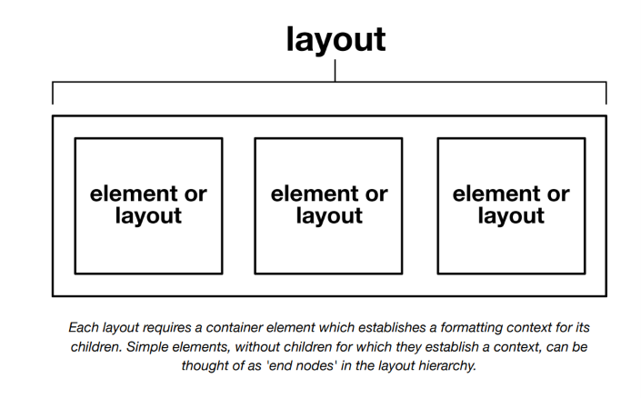
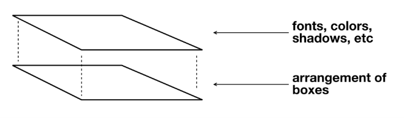
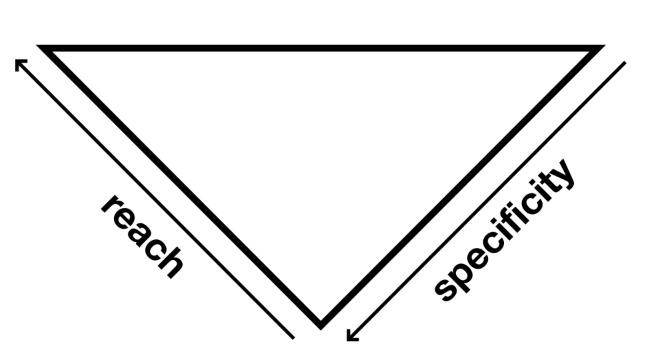
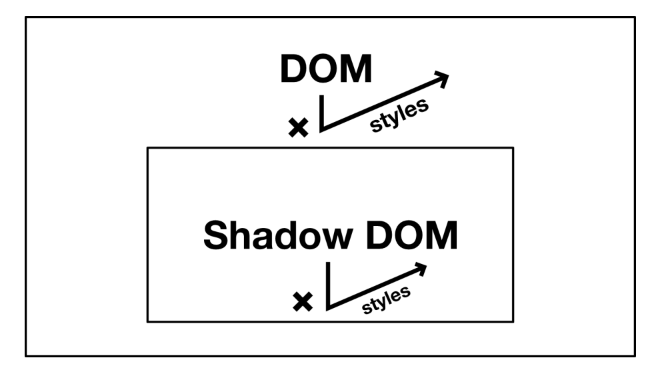
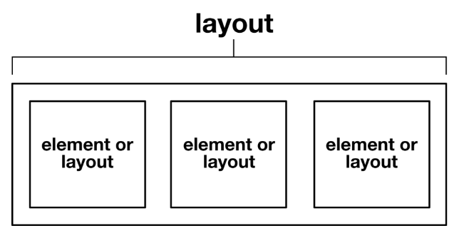

# Estilos globales y locales

En la sección _Composición_ cubrimos cómo componentes pequeños y _no léxicos_ para layout pueden usarse para crear composites más grandes, pero no todos los estilos dentro de un sistema de diseño eficiente y consistente basado en CSS deberían ser estrictamente basados en componentes. Esta sección contextualizará los componentes de layout en un sistema más grande que incluye estilos globales.

## ¿Qué son los estilos globales?

Cuando la gente habla sobre la naturaleza _global_ de CSS, pueden referirse a una de varias cosas diferentes. Pueden estar refiriéndose a reglas en los selectores `:root` o `<body>` que se _heredan_ globalmente (con solo algunas excepciones).

```css linenums="1"
:root {
  /* ↓ Ahora (casi) todos los elementos muestran una fuente sans-serif */
  font-family: sans-serif;
}
```

Alternativamente, pueden referirse a usar el _selector universal_ `*` ↗ sin calificar para estilizar todos los elementos _directamente_.

```css linenums="1"
* {
  /* ↓ Ahora literalmente todos los elementos muestran una fuente sans-serif */
  font-family: sans-serif;
}
```

Los selectores de elemento son más específicos, y solo apuntan a los elementos que nombran. Pero siguen siendo "globales" porque pueden _alcanzar_ esos elementos dondequiera que estén situados.

```css linenums="1"
p {
  /* ↓ Dondequiera que pongas un párrafo, será sans-serif */
  font-family: sans-serif;
}
```

Un uso liberal de selectores de elemento es la característica distintiva de un sistema de diseño integral. Los selectores de elemento se encargan de _átomos_ ↗ genéricos como encabezados, párrafos, enlaces y botones. A diferencia de cuando se usan clases (ver más abajo), los selectores de elemento pueden apuntar al contenido arbitrario y no atribuido producido por editores _WYSIWYG_ ↗ y _markdown_ ↗.

Los layouts de _Every Layout_ no exploran ni prescriben estilos para elementos simples; eso es para que tú lo decidas. Es la _imbricación_ de elementos simples en layouts compuestos lo que nos interesa aquí.



> Cada layout requiere un elemento contenedor que establece un _contexto de formato_ para sus hijos. Los elementos simples, sin hijos para los cuales establecen un contexto, pueden considerarse como 'nodos finales' en la jerarquía de layout.

Finalmente, los estilos basados en clases, una vez definidos, pueden adherirse a cualquier elemento HTML, en cualquier lugar de un documento. Estos son más portátiles y componibles que los estilos de elemento, pero requieren que el autor afecte el marcado directamente.

```css linenums="1"
.sans-serif {
  font-family: sans-serif;
}
```

```html
<div class="sans-serif">...</div>
<small class="sans-serif">...</small>
<h2 class="sans-serif">...</h2>
```

Debe apreciarse lo importante que es aprovechar el alcance global de las reglas CSS. CSS _existe_ para permitir el estilo de HTML globalmente, y por categoría, en lugar de elemento por elemento. Cuando se usa como se pretende, es la forma más eficiente de crear cualquier tipo de layout o estética en la web. Cuando las técnicas de estilo global (como las anteriores) se usan apropiadamente, es mucho más fácil separar la marca/estética del layout, y tratar los dos como _concerns separados_ ↗.



## Clases de utilidad

Como ya dijimos, las clases difieren de los otros métodos de estilo global en términos de su portabilidad: puedes usar clases entre diferentes elementos HTML y sus tipos. Esto nos permite _diverger_ de los estilos heredados, universales y de elemento _globalmente_.

Por ejemplo, todos nuestros elementos `<h2>` pueden estar estilizados, por defecto, con un `font-size` de `2.25rem`:

```css linenums="1"
h2 {
  font-size: 2.25rem;
}
h3 {
  font-size: 1.75rem;
}
```

Sin embargo, puede haber casos específicos donde queramos que ese `font-size` se reduzca ligeramente (quizás el espacio horizontal es limitado, o el encabezado está en un lugar donde debería tener menos peso visual). Si cambiáramos a un elemento `<h3>` para afectar este cambio visual, _haríamos una tontería de la estructura del documento_ ↗.

En su lugar, podríamos construir un selector más complejo que pertenezca al contexto del `<h2>` más pequeño:

```css linenums="1"
.sidebar h2 {
  font-size: 1.75rem;
}
```

Si bien esto es mejor que desordenar la estructura del documento, hemos cometido el error de no tener en cuenta el sistema emergente: Hemos resuelto el problema para un elemento específico, en un contexto específico, cuando deberíamos estar resolviendo el problema general (necesidad de ajustar `font-size`) para _cualquier_ elemento en _cualquier_ contexto. Aquí es donde entran las clases de utilidad.

```css linenums="1"
/* ↓ Barra invertida para escapar los dos puntos */
.font-size\:base {
  font-size: 1rem;
}
.font-size\:biggish {
  font-size: 1.75rem;
}
.font-size\:big {
  font-size: 2.25rem;
}
```

Usamos una convención de nomenclatura muy _precisa_, que emula la estructura de declaración CSS: `property-name:value`. Esto ayuda con el recuerdo de los nombres de las clases de utilidad, especialmente donde el valor se hace eco del valor real, como `.text-align:center`.

Compartir valores entre elementos y utilidades es un trabajo para las _propiedades personalizadas (custom properties)_ ↗. Observa que hemos hecho las propiedades personalizadas mismas globalmente disponibles adjuntándolas al elemento `:root` (`<html>`):

```css linenums="1"
:root {
  --font-size-base: 1rem;
  --font-size-biggish: 1.75rem;
  --font-size-big: 2.25rem;
}
/* elementos */
h3 {
  font-size: var(--font-size-biggish);
}
h2 {
  font-size: var(--font-size-big);
}
/* utilidades */
.font-size\:base {
  font-size: var(--font-size-base) !important;
}
.font-size\:biggish {
  font-size: var(--font-size-biggish) !important;
}
.font-size\:big {
  font-size: var(--font-size-big) !important;
}
```

Cada clase de utilidad tiene un sufijo `!important` para maximizar su especificidad. Las clases de utilidad son para ajustes finales, y no deberían ser anuladas por nada que venga antes que ellas.



> Una arquitectura CSS sensata tiene "alcance" (cuántos elementos se ven afectados) inversamente proporcional a la especificidad (qué tan complejos son los selectores). Esto fue formalizado por Harry Roberts como ITCSS, donde IT significa _Inverted Triangle_ (Triángulo Invertido).

Los valores en el ejemplo anterior son solo para ilustración. Para consistencia en todo el diseño, tus tamaños deberían derivarse probablemente de una _escala modular_. Consulta _Modular scale_ para más información.

### ⚠ Demasiadas clases de utilidad

Algo que recomendamos encarecidamente es no incluir clases de utilidad hasta que las necesites. No quieres enviar a los usuarios datos no utilizados o redundantes. Para este proyecto, mantenemos un archivo `helpers.css` y agregamos utilidades a medida que encontramos que las necesitamos. Si encontramos que la clase `text-align:center` no está teniendo efecto, es que no la hemos agregado en el CSS aún — así que la ponemos en nuestro archivo `helpers.css` para uso presente y futuro.

En un enfoque _utility first_ ↗ de CSS, los estilos heredados, universales y de elemento no se aprovechan realmente. En su lugar, se aplican combinaciones de estilos individuales caso por caso a elementos individuales e independientes. Usando el _framework utility-first Tailwind_, esto podría resultar — como ejemplifica la propia documentación de Tailwind — en valores de clase como los siguientes:

```css
class="rounded-lg px-4 md:px-5 xl:px-4 py-3 md:py-4 xl:py-3 bg-teal-500 hover:bg-teal-600 md:text-lg xl:text-base text-white font-semibold leading-tight shadow-md"
```

Puede haber razones, bajo circunstancias específicas, por las que uno querría ir por este camino. Quizás hay una gran cantidad de detalle y disparidad en el diseño visual que se beneficia de tener este tipo de control granular, o quizás quieres prototipar algo rápidamente sin cambiar de contexto entre CSS y HTML.

El enfoque de _Every Layout_ asume que quieres crear robustez y consistencia con el mínimo de intervención manual. Por lo tanto, los conceptos y técnicas aquí expuestos aprovechan _axiomas_, primitivas y los algoritmos de estilo que se extrapolan de ellos.

## Estilos locales o con ámbito (*scoped*)

Notablemente, el atributo/propiedad `id` (por razones de _accesibilidad_ ↗, sobre todo) solo puede usarse en un elemento HTML por documento. Estilizar a través del selector `id` está por lo tanto limitado a una instancia.

```css linenums="1"
#unique {
  /* ↓ Solo estiliza id="unique" */
  font-family: sans-serif;
}
```

El selector `id` tiene una _especificidad_ ↗ muy alta porque se asume que los estilos únicos están destinados a anular estilos genéricos competidores en todos los casos.

Por supuesto, no hay nada más "local" o _específico de instancia_ que aplicar estilos directamente a los elementos usando el atributo/propiedad `style`:

```html
<p style="font-family: sans-serif">...</p>
```

El único estándar restante para localizar estilos es dentro de Shadow DOM. Al hacer que un elemento sea un `shadowRoot`, se pueden usar selectores de baja especificidad que solo afectan a los elementos dentro de ese padre.

```js
const elem = document.querySelector('div');
const shadowRoot = elem.attachShadow({mode: 'open'});
shadowRoot.innerHTML = `
  <style>
    p {
      /* ↓ Solo estiliza los <p> dentro del Shadow DOM del elemento */
      font-family: sans-serif;
    }
  </style>
  <p>Un párrafo sans-serif</p>
`;
```

### Inconvenientes

El selector `id`, los estilos inline y Shadow DOM tienen todos inconvenientes:

- **Selectores `id`:** Muchos encuentran que la alta especificidad causa problemas sistémicos. También está la necesidad de inventar el nombre del `id` en cada caso. Generar dinámicamente una cadena única es a menudo preferible.

- **Estilos inline:** Una pesadilla de mantenimiento, que es la razón por la que CSS fue concebido antídoto en primer lugar.

- **Shadow DOM:** No solo los estilos evitan "filtrarse" fuera de la raíz del Shadow DOM, sino que (la mayoría) de los estilos no pueden _entrar_ tampoco — lo que significa que ya no puedes aprovechar el estilo global.



Lo que necesitamos es una forma de aprovechar simultáneamente el estilo global, pero aplicar estilos locales y específicos de instancia de manera controlada.

## Primitivas y props

Como se estableció en _Composición_, el enfoque principal de _Every Layout_ son las _primitivas de layout_ simples que ayudan a organizar elementos/cajas juntos. Estas son las herramientas principales para generar layout y ocupan su lugar entre los estilos globales genéricos y las utilidades.

1. Estilos universales (incluyendo heredados)
2. Primitivas de layout
3. Clases de utilidad

Manifestados como componentes reutilizables, usando la _especificación de custom elements_ ↗, estos layouts pueden usarse globalmente. Pero _configuraciones_ únicas de estos layouts son posibles usando props (propiedades).

## Interoperabilidad

Los custom elements se usan en lugar de componentes de React, Preact o Vue (que también usan props) en _Every Layout_ porque son nativos y pueden usarse en _diferentes_ frameworks de aplicaciones web. Cada layout también viene con un generador de código para producir solo el código CSS necesario para lograr el layout. Puedes usar esto para crear una primitiva de layout específica para Vue (por ejemplo).

## Valores por defecto

Cada componente de layout tiene una hoja de estilo adjunta que define sus estilos básicos y por defecto. Por ejemplo, la hoja de estilo del _Stack_ (`Stack.css`) se ve de la siguiente manera.

```css linenums="1"
stack-l {
  display: block;
}
stack-l > * + * {
  margin-top: var(--s1);
}
```

Algunas cosas a tener en cuenta:

- La declaración `display: block` es necesaria ya que los custom elements se renderizan como elementos inline por defecto. Consulta _Boxes_ para más información sobre el comportamiento de elementos block e inline.

- El valor `margin-top` es lo que hace que el _Stack_ sea un _stack_: inserta margen entre una pila vertical de elementos. Por defecto, ese valor de margen coincide con el primer punto en nuestra _escala modular_: `--s1`.

- El selector `*` se aplica a cualquier elemento, pero nuestro uso de `+` (combinador de _hermano adyacente_ ↗) está calificado para coincidir con cualquier elemento hijo sucesivo de un `<stack-l>` (observa el `> *`). La primitiva de layout es una composición en abstracto, y no debería prescribir el contenido, así que uso `*` para coincidir con cualquier tipo de elemento hijo que se le dé.



En la definición del custom element en sí, aplicamos el valor por defecto a la propiedad `space`:

```js linenums="1"
get space() {
  return this.getAttribute('space') || 'var(--s1)';
}
```

Cada custom element de _Every Layout_ construye una hoja de estilo incrustada basada en los valores de propiedad de la instancia. Es decir, esto…

```html linenums="1"
<stack-l space="var(--s3)">
  <div>...</div>
  <div>...</div>
  <div>...</div>
</stack-l>
```

…se convertiría en esto…

```html  linenums="1"
<stack-l data-i="Stack-var(--s3)" space="var(--s3)">
  <div>...</div>
  <div>...</div>
  <div>...</div>
</stack-l>
```

…y generaría esto:

```html  linenums="1"
<style id="Stack-var(--s3)">
  [data-i='Stack-var(--s3)'] > * + * {
    margin-top: var(--s3);
  }
</style>
```

Sin embargo — y esta parte es importante — la cadena `Stack-var(--s3)` solo representa una _configuración_ única para un layout, no una instancia única. Un elemento `<style>` con `id="Stack-var(--s3)"` se usa para servir _todas_ las instancias de `<stack-l>` que compartan la configuración representada por la cadena `Stack-var(--s3)`. Entre instancias de la _misma_ configuración, lo único que las diferencia es su _contenido_.

Si bien cada elemento de contenido dentro de una página web debería generalmente ofrecer información única, el _layout_ debería ser consistente y regular, usando patrones, motivos y disposiciones familiares y repetidos. Aprovechar los estilos globales junto con configuraciones de layout controladas resulta en consistencia y cohesión, y con un código mínimo.


