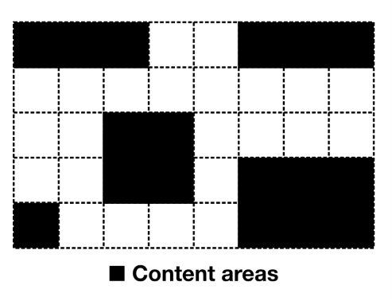
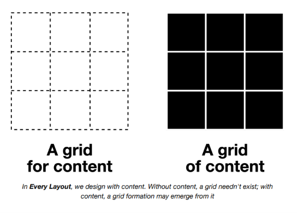
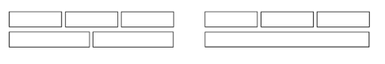
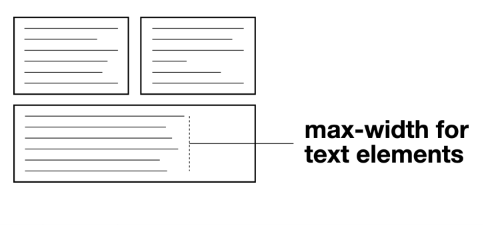
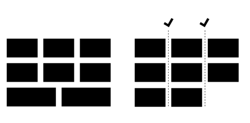
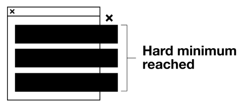
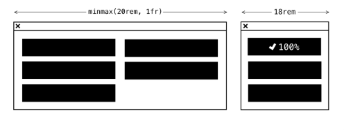

# The Grid

## El problema

Los diseñadores a veces hablan de diseñar *con una cuadrícula*. Colocan la grilla — una matriz de líneas horizontales y verticales — primero, luego pueblan ese espacio, haciendo que las palabras y las imágenes abarquen las cajas que esas líneas que se intersectan crean.



Un enfoque 'primero la grilla' para el layout solo es realmente sostenible cuando dos cosas se conocen de antemano:

1. El espacio
2. El contenido

Para un layout de revista destinado a papel, como el descrito en *Axioms*, estas cosas son alcanzables. Para un layout web independiente del dispositivo y de la pantalla que contiene contenido dinámico (léase: cambiable), fundamentalmente no lo son.

El módulo CSS Grid es radical porque te permite colocar contenido en cualquier lugar dentro de una grilla predefinida, y como tal trae el *diseño con una cuadrícula* a la web. Pero cuanto más particular y deliberada es la colocación del contenido en la grilla, más ajustes manuales, en forma de breakpoints `@media`, se necesitan para adaptar el layout a diferentes espacios. Ya sea la definición de la grilla en sí, la posición del contenido dentro de ella, o ambas, tendrán que ser cambiadas a mano, y con código adicional.

Como cubrí en *The Switcher*, los breakpoints `@media` pertenecen solo a las dimensiones del viewport, y no al espacio disponible inmediato ofrecido por un contenedor padre. Eso significa que los componentes de layout definidos usando breakpoints `@media` son fundamentalmente no independientes del contexto: un gran problema para un sistema de diseño modular.

No es, ni siquiera teóricamente, posible diseñar *con una cuadrícula* de una manera independiente del contexto y automáticamente responsiva. Sin embargo, es posible crear formaciones básicas tipo grilla: conjuntos de elementos divididos tanto en columnas como en filas.



> En *Every Layout*, diseñamos con contenido. Sin contenido, una grilla no necesita existir; con contenido, una formación de grilla puede emerger de él.

El compromiso es inevitable, así que es una cuestión de encontrar la solución más arquetípica y a la vez eficiente.

## Flexbox para grillas

Usando Flexbox, puedo crear una formación de grilla usando `flex-basis` para determinar un ancho *ideal* para cada una de las celdas de la grilla:

```css linenums="1"
.flex-grid {
  display: flex;
  flex-wrap: wrap;
}
.flex-grid > * {
  flex: 1 1 30ch;
}
```

La declaración `display: flex` define el contexto Flexbox, `flex-wrap: wrap` permite el wrapping, y `flex: 1 1 30ch` dice: "el ancho ideal debería ser `30ch`, pero se debe permitir que los elementos crezcan y se contraigan según el espacio disponible". Importantemente, el número de columnas no se prescribe basándose en un esquema de grilla fijo; se determina *algorithmicamente* basándose en el `flex-basis` y el espacio disponible. El contenido y el contexto definen la grilla, no un árbitro humano.

En *The Switcher*, identificamos una interacción entre el wrapping y el crecimiento que lleva a que los elementos 'rompan' la forma de la grilla bajo ciertas circunstancias:



Por un lado, el layout ocupa todo el espacio horizontal de su contenedor, y no hay huecos antiestéticos. Por otro lado, una formación de grilla genérica probablemente debería hacer que cada uno de sus elementos se alinee tanto a las reglas horizontales como verticales.

## Mitigación

Recordarás la regla global de *measure* explorada en la sección *Axioms*. Esto aseguraba que todos los elementos aplicables no pudieran volverse más anchos que una longitud de línea cómodamente legible.

Donde un layout similar a una grilla creado con Flexbox resulta en un elemento `:last-child` de ancho completo, la medida de sus elementos de texto contenidos estaría en peligro de volverse demasiado larga. No con ese estilo de medida global en su lugar. El beneficio de las reglas globales (*axioms*) está en no tener que considerar cada principio de diseño por layout. Muchos ya están cuidados.



## CSS Grid para grillas

El acertadamente nombrado módulo CSS Grid nos acerca a una formación de grilla responsiva 'verdadera' en un sentido específico: Es posible hacer que los elementos crezcan, se contraigan y se envuelvan juntos *sin* violar los límites de las columnas.



Este comportamiento está más cerca de la grilla responsiva arquetípica que tengo en mente, y será el layout que persigamos aquí. Solo hay un problema importante de implementación que resolver. Considera el siguiente código:

```css linenums="1"
.grid {
  display: grid;
  grid-gap: 1rem;
  grid-template-columns: repeat(auto-fit, minmax(250px, 1fr));
}
```

Este es el patrón *Layout Land* ↗, que descubrí por primera vez en la serie de videos de Jen Simmons. Para desglosarlo:

1. `display: grid` establece el contexto grid, que crea celdas de grilla para sus hijos.
2. `grid-gap` coloca un 'gutter' *entre* cada elemento de la grilla (ahorrándonos tener que emplear la técnica de margen negativo descrita primero en *The Cluster*).
3. `grid-template-columns` normalmente definiría una grilla rígida para *diseñar con una cuadrícula*, pero usado con `repeat` y `auto-fit` permite la generación dinámica y el wrapping de columnas para crear un comportamiento similar a la solución de Flexbox anterior.
4. `minmax()` asegura que cada columna, y por lo tanto cada celda de contenido, comparta un ancho entre un valor mínimo y máximo. Dado que `1fr` representa una parte del espacio disponible, las columnas crecen juntas para llenar el contenedor.

La deficiencia de este layout es el valor *mínimo* en `minmax()`. A diferencia de `flex-basis`, que permite cualquier cantidad de crecimiento o contracción desde un solo valor 'ideal', `minmax()` establece un alcance con límites duros.

Sin un mínimo fijo (`250px`, en este caso) no hay nada que *active* el wrapping. Un valor de `0` produciría solo una fila de anchos cada vez más diminutos. Pero que sea un mínimo fijo tiene una consecuencia clara: en cualquier contexto más estrecho que el mínimo, ocurrirá desbordamiento.



Para ponerlo simplemente: el patrón tal como está solo puede producir layouts de manera segura donde las columnas convergen en un ancho que está por debajo del mínimo estimado para el contenedor. Unos `250px` son razonablemente seguros porque la mayoría de los viewports de dispositivos móviles no son más anchos. Pero, ¿qué pasa si quiero que mis columnas crezcan considerablemente más allá de este ancho, donde el espacio está disponible? Con Flexbox y `flex-basis` eso es bastante posible, pero con CSS Grid no lo es sin asistencia.

## La solución

Cada uno de los layouts descritos hasta ahora en *Every Layout* han manejado el dimensionamiento y el wrapping con solo CSS, y sin consultas `@media`. A veces no es posible confiar solo en CSS para la reconfiguración automática. En estas circunstancias, recurrir a breakpoints `@media` está fuera de discusión, porque socava la modularidad del sistema de layout. En su lugar, difiero a JavaScript.

Pero debería hacerlo *juiciosamente*, y usando progressive enhancement.

`ResizeObserver` ↗ (*pronto Container Queries*) es una API altamente optimizada para rastrear y responder a cambios en las dimensiones de los elementos. Es el método más eficiente hasta ahora para crear *container queries* ↗ con JavaScript. No recomendaría usarlo como cuestión de rutina, pero empleado *solo* para resolver problemas de layout difíciles es aceptable.

Considera el siguiente código:

```css linenums="1"
.grid {
  display: grid;
  grid-gap: 1rem;
}
.grid.aboveMin {
  grid-template-columns: repeat(auto-fit, minmax(500px, 1fr));
}
```

La clase `.aboveMin` preside una declaración que anula y produce la grilla responsiva. Luego se instruye a `ResizeObserver` para agregar y eliminar la clase dependiendo del ancho del contenedor. El valor mínimo de `500px` (en el ejemplo anterior) se aplica *solo* donde el contenedor mismo es más ancho que ese umbral. Aquí hay una función independiente para activar el `ResizeObserver` en un elemento de grilla.

```javascript linenums="1"
function observeGrid(gridNode) {
  // Detección de características de ResizeObserver
  if ('ResizeObserver' in window) {
    // Obtener el valor min de data-min="[min]"
    const min = gridNode.dataset.min;
    // Crear un elemento proxy para medir y convertir
    // el valor `min` (que podría ser em, rem, etc) a `px`
    const test = document.createElement('div');
    test.style.width = min;
    gridNode.appendChild(test);
    const minToPixels = test.offsetWidth;
    gridNode.removeChild(test);
    const ro = new ResizeObserver(entries => {
      for (let entry of entries) {
        // Obtener las dimensiones actuales del elemento
        const cr = entry.contentRect;
        // `true` si el contenedor es más ancho que el mínimo
        const isWide = cr.width > minToPixels;
        // alternar la clase condicionalmente
        gridNode.classList.toggle('aboveMin', isWide);
      }
    });
    ro.observe(gridNode);
  }
}
```

Si `ResizeObserver` no es compatible, el layout de una sola columna de respaldo se aplica perpetuamente. Este respaldo básico se incluye aquí por brevedad, pero podrías en su lugar recurrir a la solución de Flexbox funcional pero imperfecta cubierta en la sección anterior. En cualquier caso, ningún contenido se pierde u oculta, y tienes la capacidad de usar valores mínimos más grandes para formaciones de grilla más expresivas. Y dado que ya no estamos sujetos a límites absolutos, podemos comenzar a emplear `minmax()` con *unidades relativas*.



*Aquí hay un ejemplo de inicialización (el código está omitido por brevedad)*

### La función `min()`

Si bien vale la pena cubrir `ResizeObserver` porque puede servirte bien en otras circunstancias, en realidad ya no es necesario para resolver este problema en particular. Esto se debe a que tenemos la *función CSS `min()` recientemente ampliamente adoptada* ↗. Perdón por la falsa alarma, pero podemos, de hecho, escribir este layout sin JavaScript después de todo.

Como respaldo, configuramos la grilla en una sola columna. Luego usamos `@supports` para probar `min()` y mejorar desde allí:

```css linenums="1"
.grid {
  display: grid;
  grid-gap: 1rem;
}
@supports (width: min(250px, 100%)) {
  .grid {
    grid-template-columns: repeat(auto-fit, minmax(min(250px, 100%), 1fr));
  }
}
```

La forma en que funciona `min()` es que calcula la *longitud más corta* a partir de un conjunto de valores separados por comas. Esto es: `min(250px, 100%)` devolvería `100%` donde `100%` se evalúa como *más pequeña* que los `250px` evaluados, y viceversa. Este útil algoritmo decide por nosotros dónde el ancho debe tener un tope máximo de `100%`.

## `<watched-box>`

Si estás buscando una solución general para *container queries* ↗, he creado `<watched-box>` ↗. Es directo y declarativo, y soporta cualquier unidad de longitud CSS.

Se recomienda que `<watched-box>` se use como una anulación manual de "último recurso". En todos los casos excepto los inusuales, uno de los layouts puramente basados en CSS documentados en *Every Layout* proporcionará un layout sensible al contexto automáticamente.

## Casos de uso

Las grillas son excelentes para navegar por avances de enlaces permanentes o productos. Puedo componer rápidamente un componente de tarjeta para albergar cada uno de mis avances usando un `Box` y un `Stack`.

*Esta demostración interactiva solo está disponible en el sitio de Every Layout* ↗.

### Altura compartida

Cada tarjeta comparte la misma altura, independientemente de su contenido, porque el valor predeterminado para `align-items` es `stretch`. Esto es fortuito ya que pocos esperarían tarjetas de diferentes tamaños, o los huecos antiestéticos que las alturas desiguales crearían.

## El generador

Usa esta herramienta para generar CSS y HTML básicos de Grid.

La herramienta generadora de código solo está disponible en el *sitio de documentación adjunto* ↗. Aquí está la solución básica, con comentarios:

**CSS**

```css linenums="1"
.grid {
  /* ↓ Establece un contexto grid */
  display: grid;
  /* ↓ Establece un gap entre los elementos grid */
  grid-gap: 1rem;
  /* ↓ Establece el ancho mínimo de columna */
  --minimum: 20ch;
}
@supports (width: min(var(--minimum), 100%)) {
  .grid {
    /* ↓ Mejora con la función min()
    en múltiples columnas */
    grid-template-columns: repeat(auto-fit, minmax(min(var(--minimum), 100%),
    1fr));
  }
}
```

**Layout implícito de una sola columna**

Nota que `grid-template-columns` no se establece excepto en el bloque de mejora (`@supports`). Implícitamente, es una grilla de una sola columna a menos que `min()` sea compatible.

**HTML**

```html linenums="1"
<div class="grid">
  <div><!-- elemento hijo --></div>
  <div><!-- otro elemento hijo --></div>
  <div><!-- etc --></div>
</div>
```

## El componente

Una implementación de elemento personalizado del `Grid` está disponible para descargar ↗.

**API de Props**

Las siguientes props (atributos) harán que el componente se renderice nuevamente cuando se alteren. Pueden ser alterados a mano — en las herramientas de desarrollo del navegador — o como sujetos del estado de la aplicación heredada.

| Nombre | Tipo | Default | Descripción |
|---|---|---|---|
| `min` | string | `"250px"` | Un valor CSS de longitud que representa x en `minmax(min(x, 100%), 1fr)` |
| `space` | string | `"var(--s1)"` | El espacio entre las celdas de la grilla |

## Ejemplos

### Cards

El código para el ejemplo de cards de *Casos de uso*. Nota que el valor `min` es una fracción del *measure* estándar. Hay más sobre la medida tipográfica en *Axioms* (el rudimento).

```html linenums="1"
<grid-l min="calc(var(--measure) / 3)">
  <box-l>
    <stack-l>
      <!-- contenido de la tarjeta -->
    </stack-l>
  </box-l>
  <box-l>
    <stack-l>
      <!-- contenido de la tarjeta -->
    </stack-l>
  </box-l>
  <box-l>
    <stack-l>
      <!-- contenido de la tarjeta -->
    </stack-l>
  </box-l>
  <box-l>
    <stack-l>
      <!-- contenido de la tarjeta -->
    </stack-l>
  </box-l>
  <!-- etc -->
</grid-l>
```
