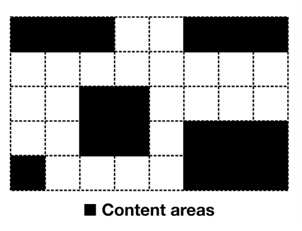
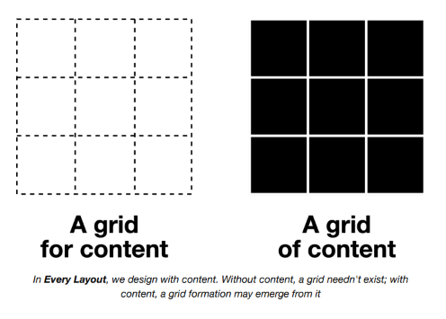
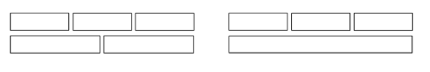
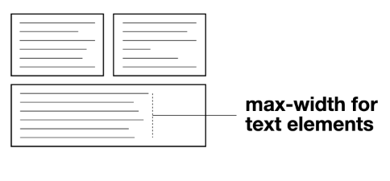
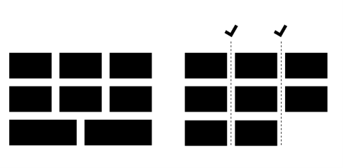
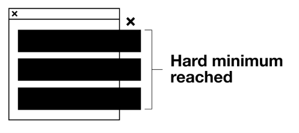
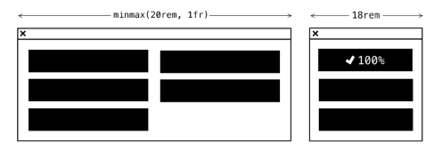

# The Grid

## El problema

Los diseñadores a veces hablan de diseñar *con una cuadrícula*. Colocan la grilla — una matriz de líneas horizontales y verticales — primero, luego pueblan ese espacio, haciendo que las palabras y las imágenes abarquen las cajas que esas líneas que se intersectan crean.



Un enfoque 'primero la grilla' para el layout solo es realmente sostenible cuando dos cosas se conocen de antemano:

1. El espacio
2. El contenido

Para un layout de revista destinado a papel, como el descrito en *Axioms*, estas cosas son alcanzables. Para un layout web independiente del dispositivo y de la pantalla que contiene contenido dinámico (léase: cambiable), fundamentalmente no lo son.

El módulo CSS Grid es radical porque te permite colocar contenido en cualquier lugar dentro de una grilla predefinida, y como tal trae el *diseño con una cuadrícula* a la web. Pero cuanto más particular y deliberada es la colocación del contenido en la grilla, más ajustes manuales, en forma de breakpoints `@media`, se necesitan para adaptar el layout a diferentes espacios. Ya sea la definición de la grilla en sí, la posición del contenido dentro de ella, o ambas, tendrán que ser cambiadas a mano, y con código adicional.

Como cubrí en *The Switcher*, los breakpoints `@media` pertenecen solo a las dimensiones del viewport, y no al espacio disponible inmediato ofrecido por un contenedor padre. Eso significa que los componentes de layout definidos usando breakpoints `@media` son fundamentalmente no independientes del contexto: un gran problema para un sistema de diseño modular.

No es, ni siquiera teóricamente, posible diseñar *con una cuadrícula* de una manera independiente del contexto y automáticamente responsiva. Sin embargo, es posible crear formaciones básicas tipo grilla: conjuntos de elementos divididos tanto en columnas como en filas.



> En *Every Layout*, diseñamos con contenido. Sin contenido, una grilla no necesita existir; con contenido, una formación de grilla puede emerger de él.

El compromiso es inevitable, así que es una cuestión de encontrar la solución más arquetípica y a la vez eficiente.

??? info "Explicacion"

    Este texto plantea un problema central del diseño con grillas (grids) aplicado a la web, y lo resuelve con una distinción importante. Te lo desgloso:
    
    __El problema de fondo__
    
    Cuando un diseñador "diseña con una cuadrícula" en el sentido clásico (piensa en una revista impresa), sigue este orden:
    
    1. Primero define la grilla (las líneas que dividen el espacio en celdas)
    2. Después coloca el contenido dentro de esas celdas
    
    Este enfoque funciona en papel porque **el diseñador conoce dos cosas fijas de antemano**: el tamaño exacto de la página y el contenido exacto que va a poner. Puede decidir "este titular va en estas tres columnas, esta imagen ocupa estas dos filas", porque nada de eso va a cambiar.
    
    __Por qué esto se rompe en la web__
    
    En la web, ninguna de esas dos certezas existe:
    
    - **El espacio es variable**: el mismo layout se ve en un móvil, una tablet, un monitor ultrawide, una ventana redimensionada.
    - **El contenido es dinámico**: un título puede tener 3 palabras o 15, una lista puede tener 2 ítems o 20, según lo que cargue una base de datos o escriba un usuario.
    
    CSS Grid te da el poder técnico de colocar cualquier elemento en cualquier celda de una grilla predefinida (algo que antes no existía en CSS). Pero ese poder es una trampa si lo usas para replicar el enfoque "primero la grilla": cuanto más precisa es la posición que le asignas a cada elemento (ej. "este div va en la columna 2, fila 3"), más vas a necesitar breakpoints `@media` para reajustar esas posiciones cuando cambie el espacio disponible.
    
    Y ahí está el segundo problema, que conecta con otro artículo suyo (*The Switcher*): los `@media` solo reaccionan al tamaño del **viewport** (la ventana del navegador), no al espacio real que tiene disponible un componente dentro de su contenedor padre. Entonces un componente diseñado así deja de ser reutilizable de forma predecible — no es "context-independent" — porque su comportamiento depende de dónde esté anclado en la ventana completa, no de cuánto espacio realmente tiene alrededor. Eso es un problema serio si tu objetivo es construir un sistema de diseño modular, donde un mismo componente debería comportarse bien sin importar dónde lo insertes.
    
    __La solución que proponen__
    
    La conclusión no es "abandona las grillas", sino un cambio de dirección:
    
    - ❌ No es posible diseñar *con* una cuadrícula predefinida de forma responsiva y libre de contexto de manera automática.
    - ✅ Sí es posible dejar que **formaciones tipo grilla emerjan del contenido mismo** — es decir, en vez de definir filas y columnas fijas y forzar el contenido a encajar, defines reglas de comportamiento (como tamaños mínimos de columna) y dejas que el navegador calcule cuántas columnas y filas caben según el espacio y el contenido disponibles en cada momento.
    
    La frase clave resume la filosofía de todo el proyecto *Every Layout*: **"diseñamos con contenido"**. La grilla no es el punto de partida fijo; es un resultado que surge naturalmente cuando hay suficiente contenido para necesitarla. Sin contenido no hace falta que la grilla "exista" como estructura predefinida.
    
    Es, en esencia, el argumento a favor de patrones como `grid-template-columns: repeat(auto-fit, minmax(...))` en vez de definir un `grid-template-columns: 1fr 1fr 1fr` fijo con breakpoints manuales para cada tamaño de pantalla.

## Flexbox para grillas

Usando Flexbox, puedo crear una formación de grilla usando `flex-basis` para determinar un ancho *ideal* para cada una de las celdas de la grilla:

```css linenums="1"
.flex-grid {
  display: flex;
  flex-wrap: wrap;
}
.flex-grid > * {
  flex: 1 1 30ch;
}
```

La declaración `display: flex` define el contexto Flexbox, `flex-wrap: wrap` permite el wrapping, y `flex: 1 1 30ch` dice: "el ancho ideal debería ser `30ch`, pero se debe permitir que los elementos crezcan y se contraigan según el espacio disponible". Importantemente, el número de columnas no se prescribe basándose en un esquema de grilla fijo; se determina *algorithmicamente* basándose en el `flex-basis` y el espacio disponible. El contenido y el contexto definen la grilla, no un árbitro humano.

En *The Switcher*, identificamos una interacción entre el wrapping y el crecimiento que lleva a que los elementos 'rompan' la forma de la grilla bajo ciertas circunstancias:



Por un lado, el layout ocupa todo el espacio horizontal de su contenedor, y no hay huecos antiestéticos. Por otro lado, una formación de grilla genérica probablemente debería hacer que cada uno de sus elementos se alinee tanto a las reglas horizontales como verticales.

??? info "Explicacion"

    __El intento con Flexbox__
    
    Esta sección muestra un primer intento de crear formaciones tipo grilla sin usar CSS Grid, sino con Flexbox — y expone por qué, aunque casi funciona, se queda corto.
    
    __Cómo funciona el código__
    
    ```css
    .flex-grid {
      display: flex;
      flex-wrap: wrap;
    }
    .flex-grid > * {
      flex: 1 1 30ch;
    }
    ```
    
    - `display: flex` activa Flexbox en el contenedor.
    - `flex-wrap: wrap` permite que los elementos hijos pasen a una nueva línea cuando ya no caben en la fila actual, en vez de aplastarse todos en una sola línea.
    - `flex: 1 1 30ch` es la parte clave, y es shorthand de `flex-grow: 1; flex-shrink: 1; flex-basis: 30ch;`. Se traduce como: "el ancho ideal de este elemento es `30ch` (aprox. 30 caracteres de ancho), pero si sobra espacio en la fila, puede crecer para llenarlo (`grow: 1`), y si falta espacio, puede encogerse (`shrink: 1`)".
    
    __Por qué esto es importante conceptualmente__
    
    Aquí está la conexión con el artículo anterior: **nadie decidió cuántas columnas tiene esta grilla**. No hay un `grid-template-columns: repeat(3, 1fr)` que fije el número de columnas de antemano. En cambio, el navegador calcula cuántos elementos de ~30ch cada uno caben en el ancho disponible del contenedor, y ese cálculo determina el número de columnas *en cada momento*, para cada contenedor, en cada tamaño de pantalla — sin un solo breakpoint `@media`.
    
    Eso es justo lo que se planteaba como ideal: la grilla emerge del contenido y el espacio disponible, no de una decisión humana fija de antemano.
    
    __El problema: el wrapping rompe la grilla__
    
    Sin embargo, hay un defecto que ya se había identificado en *The Switcher* (otro artículo de la misma serie). Cuando los elementos usan `flex-grow` para estirarse y llenar el espacio sobrante de una fila, puede pasar que **la última fila tenga menos elementos que las anteriores**, y esos elementos restantes se estiren para llenar todo el ancho — quedando mucho más anchos que los elementos de las filas de arriba.
    
    El resultado (ilustrado en la imagen `littleboxes.png`) es una tensión entre dos objetivos que en realidad chocan:
    
    - ✅ **A favor**: el layout aprovecha todo el ancho disponible, sin huecos vacíos feos al final de una fila incompleta.
    - ❌ **En contra**: los elementos ya no están alineados en columnas verticales consistentes. Si esperas que una "grilla" tenga tanto filas como columnas alineadas (como una tabla), este comportamiento la rompe — el ancho de cada celda varía de fila a fila según cuántos elementos le tocó compartir esa fila.
    
    Esto deja planteado el problema que el resto del artículo probablemente resuelve: Flexbox es genial para filas flexibles, pero no fue diseñado para garantizar alineación en dos dimensiones (filas *y* columnas) — que es exactamente para lo que CSS Grid sí sirve, y por eso el argumento probablemente avanza hacia usar Grid con `auto-fit`/`minmax()` como la solución más "arquetípica y eficiente" que mencionaba el texto anterior.
    
## Mitigación

Recordarás la regla global de *measure* explorada en la sección *Axioms*. Esto aseguraba que todos los elementos aplicables no pudieran volverse más anchos que una longitud de línea cómodamente legible.

Donde un layout similar a una grilla creado con Flexbox resulta en un elemento `:last-child` de ancho completo, la medida de sus elementos de texto contenidos estaría en peligro de volverse demasiado larga. No con ese estilo de medida global en su lugar. El beneficio de las reglas globales (*axioms*) está en no tener que considerar cada principio de diseño por layout. Muchos ya están cuidados.



??? info "Explicacion"

    Esta sección conecta dos piezas del sistema para mostrar que el problema que acabamos de ver (el `:last-child` que se estira a todo el ancho) **no siempre necesita una solución nueva** — a veces ya está resuelto por otra regla que ya existe en el sistema.
    
    __La idea central__
    
    En el artículo *Axioms* (que mencionaste antes), se estableció una regla global de *measure*: ningún elemento de texto debería poder crecer más allá de un ancho de línea cómodamente legible (algo así como `max-width: 60ch` o similar, aplicado globalmente a los elementos de texto).
    
    Ahora, volviendo al problema anterior: cuando la última fila de la formación Flexbox tiene un solo elemento sobrante, ese elemento se estira con `flex-grow` para llenar todo el ancho del contenedor — pudiendo volverse mucho más ancho que sus hermanos. El riesgo real de esto **no es la desalineación visual en sí**, sino que si ese elemento contiene texto, las líneas de texto se vuelven demasiado largas para leerse cómodamente (líneas muy anchas son fatigantes de leer).
    
    __Por qué esto es una mitigación, no una solución completa__
    
    El punto clave es que, si la regla de *measure* ya está aplicada globalmente a nivel del sistema, entonces **el contenido de texto dentro de ese elemento ancho de todos modos no se estirará** más allá del límite legible — aunque la *caja* del elemento (`:last-child`) sí ocupe todo el ancho disponible.
    
    Es decir:
    - La caja contenedora puede seguir viéndose "rota" en términos de alineación de grilla (ese último elemento sigue siendo visualmente más ancho que los demás, como mostraba `littleboxes.png`).
    - Pero el **contenido de texto dentro de esa caja** no sufre las consecuencias negativas de ese ancho excesivo, porque *measure* ya le pone un tope.
    
    __La lección de fondo sobre el sistema__
    
    Esto ilustra la filosofía de diseño de *Every Layout* en general: al tener **axiomas globales** (reglas base aplicadas ampliamente, como *measure*), no tienes que resolver cada problema de legibilidad individualmente en cada layout nuevo que diseñes. El problema del `:last-child` ancho sigue existiendo a nivel estructural/estético, pero uno de sus efectos secundarios más dañinos (texto illegible por líneas demasiado largas) ya está neutralizado de fábrica.
    
    Dicho de otro modo: no todos los defectos de un layout necesitan arreglarse *en* el layout — algunos ya están cubiertos por reglas que operan en una capa distinta y más general del sistema.

## CSS Grid para grillas

El acertadamente nombrado módulo CSS Grid nos acerca a una formación de grilla responsiva 'verdadera' en un sentido específico: Es posible hacer que los elementos crezcan, se contraigan y se envuelvan juntos *sin* violar los límites de las columnas.



Este comportamiento está más cerca de la grilla responsiva arquetípica que tengo en mente, y será el layout que persigamos aquí. Solo hay un problema importante de implementación que resolver. Considera el siguiente código:

```css linenums="1"
.grid {
  display: grid;
  grid-gap: 1rem;
  grid-template-columns: repeat(auto-fit, minmax(250px, 1fr));
}
```

Este es el patrón [*Layout Land* ↗](https://www.youtube.com/watch?v=tFKrK4eAiUQ), que descubrí por primera vez en la serie de videos de Jen Simmons. Para desglosarlo:

1. `display: grid` establece el contexto grid, que crea celdas de grilla para sus hijos.
2. `grid-gap` coloca un 'gutter' *entre* cada elemento de la grilla (ahorrándonos tener que emplear la técnica de margen negativo descrita primero en *The Cluster*).
3. `grid-template-columns` normalmente definiría una grilla rígida para *diseñar con una cuadrícula*, pero usado con `repeat` y `auto-fit` permite la generación dinámica y el wrapping de columnas para crear un comportamiento similar a la solución de Flexbox anterior.
4. `minmax()` asegura que cada columna, y por lo tanto cada celda de contenido, comparta un ancho entre un valor mínimo y máximo. Dado que `1fr` representa una parte del espacio disponible, las columnas crecen juntas para llenar el contenedor.

La deficiencia de este layout es el valor *mínimo* en `minmax()`. A diferencia de `flex-basis`, que permite cualquier cantidad de crecimiento o contracción desde un solo valor 'ideal', `minmax()` establece un alcance con límites duros.

Sin un mínimo fijo (`250px`, en este caso) no hay nada que *active* el wrapping. Un valor de `0` produciría solo una fila de anchos cada vez más diminutos. Pero que sea un mínimo fijo tiene una consecuencia clara: en cualquier contexto más estrecho que el mínimo, ocurrirá desbordamiento.



Para ponerlo simplemente: el patrón tal como está solo puede producir layouts de manera segura donde las columnas convergen en un ancho que está por debajo del mínimo estimado para el contenedor. Unos `250px` son razonablemente seguros porque la mayoría de los viewports de dispositivos móviles no son más anchos. Pero, ¿qué pasa si quiero que mis columnas crezcan considerablemente más allá de este ancho, donde el espacio está disponible? Con Flexbox y `flex-basis` eso es bastante posible, pero con CSS Grid no lo es sin asistencia.

??? info "Explicacion"

    Esta sección presenta la solución "casi ideal" con CSS Grid, y luego identifica su propio talón de Aquiles — preparando el terreno para lo que probablemente viene después (una técnica de asistencia adicional, muy probablemente usando `min()`).
    
    __El avance respecto a Flexbox__
    
    El problema del artículo anterior (el `:last-child` que se estira solo, rompiendo la alineación de columnas) queda resuelto aquí. Con CSS Grid, los elementos pueden crecer, encogerse y pasar a nueva línea **sin salirse de los límites de columna** — es decir, todos los elementos de una fila respetan el mismo ancho de columna que los de las filas de arriba y abajo, algo que Flexbox no podía garantizar porque `flex-grow` actúa fila por fila, de forma independiente.
    
    __Cómo funciona el código__
    
    ```css
    .grid {
      display: grid;
      grid-gap: 1rem;
      grid-template-columns: repeat(auto-fit, minmax(250px, 1fr));
    }
    ```
    
    - **`display: grid`**: activa el contexto de grilla.
    - **`grid-gap`**: crea espacio entre elementos sin necesitar el truco del margen negativo que se usaba en *The Cluster* (otro artículo de la serie).
    - **`repeat(auto-fit, ...)`**: en vez de escribir manualmente `1fr 1fr 1fr`, le pide al navegador que genere tantas columnas como quepan, dinámicamente — el mismo espíritu "algorítmico, no arbitrario" del ejemplo con Flexbox.
    - **`minmax(250px, 1fr)`**: cada columna tiene un ancho mínimo de `250px` y un máximo de `1fr` (una fracción proporcional del espacio sobrante). Como todas las columnas comparten `1fr` como máximo, crecen *juntas* y de forma pareja para llenar el contenedor — a diferencia de Flexbox, donde solo el elemento sobrante crecía.
    
    __El problema nuevo: el mínimo es una pared dura__
    
    Aquí está el matiz técnico importante: `flex-basis` es un punto de partida flexible — un elemento puede crecer o encogerse libremente desde ahí. Pero el mínimo de `minmax()` es un **límite duro (hard limit)**: la columna *nunca* puede ser más angosta que ese valor, pase lo que pase.
    
    Esto crea una paradoja de diseño:
    
    1. **Necesitas un mínimo fijo para que exista el wrapping en absoluto.** Si pusieras `minmax(0, 1fr)`, nunca habría suficiente "presión" para forzar una nueva fila — solo obtendrías una única fila con columnas cada vez más angostas y diminutas, sin límite.
    2. **Pero ese mismo mínimo fijo causa desbordamiento (overflow)** en cualquier contenedor que sea más angosto que ese valor. Si el contenedor mide 200px y tu mínimo es `250px`, el contenido se va a desbordar — no hay forma de que el navegador lo evite, porque le dijiste explícitamente que nunca baje de ese ancho.
    
    __Por qué `250px` "funciona" pero no es la solución real__
    
    `250px` es un valor relativamente seguro en la práctica porque la mayoría de los viewports móviles son más anchos que eso, así que rara vez ves el desbordamiento en el mundo real. Pero eso es suerte de rango, no una solución robusta — es exactamente el tipo de "ajuste manual basado en suposiciones sobre el espacio" que el artículo inicial (*El problema*) advertía que había que evitar.
    
    Y hay una segunda limitación, quizás más importante para el argumento: **el mínimo fijo también te impide crecer generosamente cuando sí hay espacio de sobra**. Con Flexbox, `flex-basis: 30ch` era solo un punto de referencia — los elementos podían crecer bastante más allá de eso si el contenedor era ancho. Con `minmax(250px, 1fr)`, aunque el máximo técnicamente es `1fr` (proporcional), en la práctica el sistema no tiene forma de decirle "prefiero columnas de ~250px, pero si hay mucho espacio, que crezcan más antes de multiplicarse" — solo sabe "mínimo 250px, y agregar tantas columnas de esas quepan".
    
    Esto dejar planteado el problema exacto que el artículo probablemente resuelve a continuación: necesitas una forma de decir *"el mínimo también debería ser relativo al contenedor, no un valor fijo en px"* — que es justo el terreno de la técnica con `min()` que hizo famosa esta serie (algo como `minmax(min(250px, 100%), 1fr)`), para eliminar el overflow en contenedores angostos sin sacrificar el mecanismo de wrapping.

    
## La solución

Cada uno de los layouts descritos hasta ahora en *Every Layout* han manejado el dimensionamiento y el wrapping con solo CSS, y sin consultas `@media`. A veces no es posible confiar solo en CSS para la reconfiguración automática. En estas circunstancias, recurrir a breakpoints `@media` está fuera de discusión, porque socava la modularidad del sistema de layout. En su lugar, difiero a JavaScript.

Pero debería hacerlo *juiciosamente*, y usando progressive enhancement.

[`ResizeObserver` ↗ ](https://developer.mozilla.org/en-US/docs/Web/API/ResizeObserver) [(*pronto Container Queries*)](https://caniuse.com/?search=ResizeObserver) es una API altamente optimizada para rastrear y responder a cambios en las dimensiones de los elementos. Es el método más eficiente hasta ahora para crear [*container queries* ↗](https://philipwalton.com/articles/responsive-components-a-solution-to-the-container-queries-problem/) con JavaScript. No recomendaría usarlo como cuestión de rutina, pero empleado *solo* para resolver problemas de layout difíciles es aceptable.

Considera el siguiente código:

```css linenums="1"
.grid {
  display: grid;
  grid-gap: 1rem;
}
.grid.aboveMin {
  grid-template-columns: repeat(auto-fit, minmax(500px, 1fr));
}
```

La clase `.aboveMin` preside una declaración que anula y produce la grilla responsiva. Luego se instruye a `ResizeObserver` para agregar y eliminar la clase dependiendo del ancho del contenedor. El valor mínimo de `500px` (en el ejemplo anterior) se aplica *solo* donde el contenedor mismo es más ancho que ese umbral. Aquí hay una función independiente para activar el `ResizeObserver` en un elemento de grilla.

```javascript linenums="1"
function observeGrid(gridNode) {
  // Detección de características de ResizeObserver
  if ('ResizeObserver' in window) {
    // Obtener el valor min de data-min="[min]"
    const min = gridNode.dataset.min;
    // Crear un elemento proxy para medir y convertir
    // el valor `min` (que podría ser em, rem, etc) a `px`
    const test = document.createElement('div');
    test.style.width = min;
    gridNode.appendChild(test);
    const minToPixels = test.offsetWidth;
    gridNode.removeChild(test);
    const ro = new ResizeObserver(entries => {
      for (let entry of entries) {
        // Obtener las dimensiones actuales del elemento
        const cr = entry.contentRect;
        // `true` si el contenedor es más ancho que el mínimo
        const isWide = cr.width > minToPixels;
        // alternar la clase condicionalmente
        gridNode.classList.toggle('aboveMin', isWide);
      }
    });
    ro.observe(gridNode);
  }
}
```

Si `ResizeObserver` no es compatible, el layout de una sola columna de respaldo se aplica perpetuamente. Este respaldo básico se incluye aquí por brevedad, pero podrías en su lugar recurrir a la solución de Flexbox funcional pero imperfecta cubierta en la sección anterior. En cualquier caso, ningún contenido se pierde u oculta, y tienes la capacidad de usar valores mínimos más grandes para formaciones de grilla más expresivas. Y dado que ya no estamos sujetos a límites absolutos, podemos comenzar a emplear `minmax()` con *unidades relativas*.



*Aquí hay un ejemplo de inicialización (el código está omitido por brevedad)*

```html linenums="1"
<div class="grid" data-min="250px">
<!-- Place children here -->
</div>
<script>
const grid = document.querySelector('.grid');
observeGrid(grid);
</script>
```

??? info "Explicacion"

    Aquí llega la solución definitiva al problema planteado en la sección anterior: cómo permitir mínimos de columna generosos (más allá de lo "seguro" como `250px`) sin arriesgarse al desbordamiento en contenedores angostos — sin recurrir a `@media`, que rompería la modularidad del sistema.
    
    __Por qué no `@media`__
    
    Ya se había establecido (en *The Switcher*) que los breakpoints `@media` reaccionan al viewport completo, no al espacio real disponible del contenedor padre de un componente. Eso hace que un componente se comporte de forma impredecible según dónde se inserte — lo opuesto a un sistema de diseño modular, donde cada componente debe responder a *su propio* contexto, sin importar dónde viva. Por eso, aunque `@media` podría "resolver" el overflow técnicamente, se descarta por principio.
    
    __La solución: JavaScript, pero solo como último recurso__
    
    La postura del autor es clara: CSS primero, siempre. JavaScript entra únicamente cuando CSS puro no puede resolver el problema — y aquí, ese es el caso, porque CSS no tiene (todavía) una forma nativa de preguntar "¿cuánto espacio tiene disponible *este* contenedor?" (eso es justo lo que las *Container Queries*, mencionadas como algo que vendrá "pronto", resolverán de forma nativa).
    
    La herramienta elegida es `ResizeObserver`: una API del navegador optimizada específicamente para detectar cambios en las dimensiones de un elemento — a diferencia de escuchar el evento `resize` de la ventana, que solo te dice del viewport, no del contenedor.
    
    __Cómo funciona el patrón__
    
    __CSS__
    
    ```css
    .grid {
      display: grid;
      grid-gap: 1rem;
    }
    .grid.aboveMin {
      grid-template-columns: repeat(auto-fit, minmax(500px, 1fr));
    }
    ```
    
    Fíjate en la estructura: por defecto, `.grid` **no tiene** `grid-template-columns` definido — así que, sin la clase adicional, se comporta como una sola columna (el contenido simplemente se apila verticalmente, que es un layout seguro y sin overflow posible). La clase `.aboveMin` es la que *activa* la formación multi-columna con un `minmax()` de mínimo generoso (`500px` en este ejemplo, mucho más ancho que los `250px` "seguros" de antes).
    
    La clase `.aboveMin` solo se añade cuando JavaScript confirma que el contenedor realmente tiene espacio suficiente para soportarla sin desbordarse.
    
    __JavaScript: `observeGrid()`__
    
    Desglosemos la función paso a paso:
    
    1. **Detección de características** (`if ('ResizeObserver' in window)`): esto es *progressive enhancement* en acción — si el navegador no soporta la API, la función simplemente no hace nada, y el layout se queda en su estado base seguro de una columna. Nunca se rompe nada; en el peor caso, se pierde la mejora visual, no la funcionalidad.
    
    2. **Leer el mínimo desde `data-min`**: en vez de hardcodear el valor `500px` en JavaScript, se lee de un atributo `data-min` en el HTML — así el mismo script sirve para cualquier grilla con cualquier mínimo, sin duplicar código.
    
    3. **El truco del "elemento proxy"**: aquí está el detalle más ingenioso. El valor de `data-min` podría estar en cualquier unidad CSS — `px`, `em`, `rem`, `ch`, etc. Pero `ResizeObserver` te devuelve las dimensiones del contenedor **solo en píxeles**. Entonces, para comparar peras con peras, el código crea un `<div>` invisible temporal, le asigna `width: [valor de data-min]`, lo inserta en el DOM (dentro del propio grid, para heredar el contexto correcto de unidades relativas), lee su `offsetWidth` (que sí está en píxeles), y luego lo elimina inmediatamente. Es una forma barata y confiable de hacer que el navegador haga la conversión de unidades por ti.
    
    4. **El observer en sí**: `ResizeObserver` ejecuta un callback cada vez que las dimensiones del elemento observado cambian. Dentro del callback, `entry.contentRect.width` te da el ancho actual del contenedor en píxeles. Se compara ese ancho contra el mínimo ya convertido (`minToPixels`), y el resultado booleano (`isWide`) se usa para **alternar** la clase `aboveMin` con `classList.toggle()`.
    
    __El resultado práctico__
    
    - Si el contenedor es más angosto que el mínimo → no tiene la clase `.aboveMin` → cae al layout de una columna → **cero riesgo de overflow**.
    - Si el contenedor es más ancho que el mínimo → se aplica `.aboveMin` → entra en juego el `minmax(500px, 1fr)` → columnas generosas y responsivas.
    - Ningún contenido se oculta ni se pierde nunca, en ningún escenario — solo cambia cuántas columnas hay.
    
    __Por qué esto es mejor que antes__
    
    Con este mecanismo, ya no dependes de elegir un mínimo "razonablemente seguro" como `250px` por miedo al overflow — porque JavaScript garantiza que ese mínimo *nunca* se aplique en un contenedor donde no cabe. Esto abre la puerta a usar mínimos mucho más expresivos y grandes (`500px`, o incluso valores en unidades relativas como `%` o `ch`), algo que era imposible de hacer con seguridad usando solo CSS puro en la sección anterior.
    
    En resumen: el patrón usa JavaScript de forma mínima y quirúrgica — no para controlar el layout entero, sino solo para decidir *cuándo* activar una regla CSS que, de otro modo, sería peligrosa de aplicar incondicionalmente. Es progressive enhancement en su forma más pura: la base funciona sin JS, y JS solo mejora la experiencia cuando está disponible.

### La función `min()`

Si bien vale la pena cubrir `ResizeObserver` porque puede servirte bien en otras circunstancias, en realidad ya no es necesario para resolver este problema en particular. Esto se debe a que tenemos la *función CSS `min()` recientemente ampliamente adoptada* ↗. Perdón por la falsa alarma, pero podemos, de hecho, escribir este layout sin JavaScript después de todo.

Como respaldo, configuramos la grilla en una sola columna. Luego usamos `@supports` para probar `min()` y mejorar desde allí:

```css linenums="1"
.grid {
  display: grid;
  grid-gap: 1rem;
}
@supports (width: min(250px, 100%)) {
  .grid {
    grid-template-columns: repeat(auto-fit, minmax(min(250px, 100%), 1fr));
  }
}
```

La forma en que funciona `min()` es que calcula la *longitud más corta* a partir de un conjunto de valores separados por comas. Esto es: `min(250px, 100%)` devolvería `100%` donde `100%` se evalúa como *más pequeña* que los `250px` evaluados, y viceversa. Este útil algoritmo decide por nosotros dónde el ancho debe tener un tope máximo de `100%`.

## `<watched-box>`

Si estás buscando una solución general para *container queries* ↗, he creado `<watched-box>` ↗. Es directo y declarativo, y soporta cualquier unidad de longitud CSS.

Se recomienda que `<watched-box>` se use como una anulación manual de "último recurso". En todos los casos excepto los inusuales, uno de los layouts puramente basados en CSS documentados en *Every Layout* proporcionará un layout sensible al contexto automáticamente.

## Casos de uso

Las grillas son excelentes para navegar por avances de enlaces permanentes o productos. Puedo componer rápidamente un componente de tarjeta para albergar cada uno de mis avances usando un `Box` y un `Stack`.

*Esta demostración interactiva solo está disponible en el sitio de Every Layout* ↗.

### Altura compartida

Cada tarjeta comparte la misma altura, independientemente de su contenido, porque el valor predeterminado para `align-items` es `stretch`. Esto es fortuito ya que pocos esperarían tarjetas de diferentes tamaños, o los huecos antiestéticos que las alturas desiguales crearían.

## El generador

Usa esta herramienta para generar CSS y HTML básicos de Grid.

La herramienta generadora de código solo está disponible en el *sitio de documentación adjunto* ↗. Aquí está la solución básica, con comentarios:

**CSS**

```css linenums="1"
.grid {
  /* ↓ Establece un contexto grid */
  display: grid;
  /* ↓ Establece un gap entre los elementos grid */
  grid-gap: 1rem;
  /* ↓ Establece el ancho mínimo de columna */
  --minimum: 20ch;
}
@supports (width: min(var(--minimum), 100%)) {
  .grid {
    /* ↓ Mejora con la función min()
    en múltiples columnas */
    grid-template-columns: repeat(auto-fit, minmax(min(var(--minimum), 100%),
    1fr));
  }
}
```

**Layout implícito de una sola columna**

Nota que `grid-template-columns` no se establece excepto en el bloque de mejora (`@supports`). Implícitamente, es una grilla de una sola columna a menos que `min()` sea compatible.

**HTML**

```html linenums="1"
<div class="grid">
  <div><!-- elemento hijo --></div>
  <div><!-- otro elemento hijo --></div>
  <div><!-- etc --></div>
</div>
```

## El componente

Una implementación de elemento personalizado del `Grid` está disponible para descargar ↗.

**API de Props**

Las siguientes props (atributos) harán que el componente se renderice nuevamente cuando se alteren. Pueden ser alterados a mano — en las herramientas de desarrollo del navegador — o como sujetos del estado de la aplicación heredada.

| Nombre | Tipo | Default | Descripción |
|---|---|---|---|
| `min` | string | `"250px"` | Un valor CSS de longitud que representa x en `minmax(min(x, 100%), 1fr)` |
| `space` | string | `"var(--s1)"` | El espacio entre las celdas de la grilla |

## Ejemplos

### Cards

El código para el ejemplo de cards de *Casos de uso*. Nota que el valor `min` es una fracción del *measure* estándar. Hay más sobre la medida tipográfica en *Axioms* (el rudimento).

```html linenums="1"
<grid-l min="calc(var(--measure) / 3)">
  <box-l>
    <stack-l>
      <!-- contenido de la tarjeta -->
    </stack-l>
  </box-l>
  <box-l>
    <stack-l>
      <!-- contenido de la tarjeta -->
    </stack-l>
  </box-l>
  <box-l>
    <stack-l>
      <!-- contenido de la tarjeta -->
    </stack-l>
  </box-l>
  <box-l>
    <stack-l>
      <!-- contenido de la tarjeta -->
    </stack-l>
  </box-l>
  <!-- etc -->
</grid-l>
```
