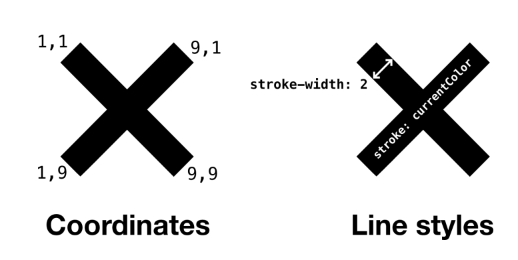
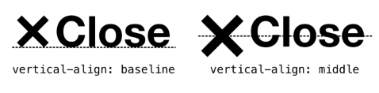
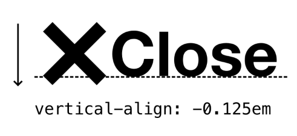
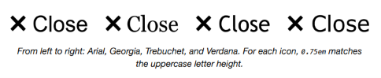
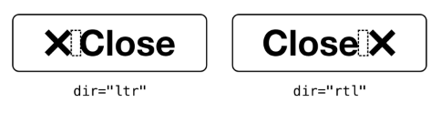
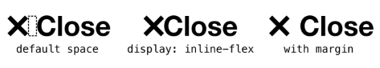
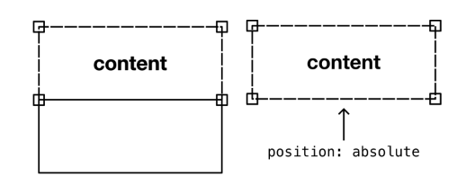

# The Icon

## El problema

La mayoría de los layouts en *Every Layout* toman la forma de *componentes block-level* ↗, si me permites la expresión. Esto es, establecen un contexto donde afectan el layout de los elementos hijos bajo su control. Como descubrirás en *Boxes*, los elementos con valores `display` de `block`, `flex` o `grid` son ellos mismos block-level (`flex` y `grid` difieren al afectar a sus elementos hijos de una manera especial).

Aquí, veremos algo mucho más pequeño, y no hay nada mucho más pequeño que un icono. Este será el primer layout para el cual el elemento personalizado conservará su modo de visualización inline predeterminado.

Hacer que las cosas se alineen y se vean bien puede ser un negocio precario. Cuando se trata de iconos, tenemos que preocuparnos por cosas como:

- La distancia entre el icono y el texto
- La altura del icono comparada con la altura del texto
- La alineación vertical del icono con el texto
- Qué sucede cuando el texto viene *después* del icono, en lugar de *antes*
- Qué sucede cuando cambias el tamaño del texto

## Un icono simple

Antes de analizar todo esto, primero te daré un curso rápido intensivo sobre iconografía SVG, ya que SVG es el formato de iconografía *de facto* en la web. Considera el siguiente código:

```html linenums="1"
<svg viewBox="0 0 10 10" width="0.75em" height="0.75em" stroke="currentColor" stroke-width="2">
  <line x1="1" y1="1" x2="9" y2="9" />
  <line x1="9" y1="1" x2="1" y2="9" />
</svg>
```

Esto define un icono simple: una cruz. Déjame explicar cada una de las características clave:

- **`viewBox`**: Esto define el sistema de coordenadas para el SVG. La parte `0 0` significa *"contar desde la esquina superior izquierda"* y la parte `10 10` significa darle al "lienzo" SVG 10 coordenadas horizontales y 10 verticales. Estamos definiendo un cuadrado, ya que todos nuestros iconos ocuparán un espacio cuadrado.
- **`width` y `height`**: Esto establece el tamaño del icono. Explicaré por qué usa la unidad `em`, y está configurado a `0.75em` en breve. Por ahora, ten en cuenta que establecemos el ancho y la altura en el SVG, en lugar de en CSS, porque queremos mantener el icono pequeño incluso si CSS falla al cargar. Los SVG se muestran muy grandes en la mayoría de los navegadores por defecto.
- **`stroke` y `stroke-width`**: Estos atributos de presentación le dan a los elementos `<line />` una forma visible. Pueden escribirse, o anularse, en CSS. Pero como no estamos usando muchos, es mejor asegurarse de que estos también sean independientes de CSS.
- **`<line />`**: El elemento dibuja una línea simple. Aquí tenemos una dibujada desde la esquina superior izquierda a la inferior derecha, seguida por una dibujada desde la esquina superior derecha a la inferior izquierda (haciendo nuestra cruz). Estoy usando `1` y `9`, no `0` y `10`, para compensar el `stroke-width` de la línea. De lo contrario, la línea desbordaría el "lienzo" SVG.



Hay muchas formas de dibujar la misma forma de cruz. Quizás la más eficiente es usar un elemento `<path />`. Un path te permite colocar todas las coordenadas en un atributo. El símbolo `M` marca el inicio de las coordenadas separadas de cada línea:

```html linenums="1"
<svg viewBox="0 0 10 10" width="0.75em" height="0.75em" stroke="currentColor" stroke-width="2">
  <path d="M1,1 9,9 M9,1 1,9" />
</svg>
```

Cuando tus datos SVG son tan concisos, no hay razón para no incluirlos inline en lugar de usar un `` que apunte a un archivo SVG. Hay otras ventajas además de poder prescindir de una solicitud HTTP, como la capacidad de usar `currentColor` como se muestra. Esta palabra clave hace que tu SVG inline adopte el `color` del texto circundante. Para los iconos de demostración a seguir, los iconos se incluyen a través del elemento `<use>`, que referencia uno de muchos `<symbol>`s de iconos definidos en un solo archivo `icons.svg` (y por lo tanto una sola solicitud HTTP). La técnica `currentColor` aún funciona al referenciar datos SVG de esta manera.

```html linenums="1"
<svg class="icon">
  <use href="/images/icons/icons.svg#cross"></use>
</svg>
```

En cualquier caso, SVG es un formato eficiente, mucho mejor adaptado a la iconografía que las imágenes rasterizadas como PNG, y sin los consiguientes *problemas de accesibilidad* ↗ de las fuentes de iconos.

Nuestra tarea aquí es crear un lienzo SVG confiable para iconos cuadrados, y asegurar que se ajuste perfectamente junto al texto, con el mínimo de configuración manual.

## La solución

### Alineación vertical

Como sugiere la nota anterior sobre `currentColor`, vamos a tratar nuestros iconos como texto, y hacer que acompañen al texto tan perfectamente como sea posible. Afortunadamente, el SVG se sentará en la *línea base* del texto por defecto, como si fuera una letra.

Para iconos más altos, podrías esperar poder usar `vertical-align: middle`. Sin embargo, contrario a la creencia popular, esto no alinea alrededor del medio vertical de la fuente, sino *el medio vertical de las letras minúsculas de la fuente*. Por lo tanto, el resultado probablemente será indeseable.



En su lugar, ajustar la alineación vertical para un icono más alto será probablemente cuestión de proporcionar el atributo `vertical-align` con una longitud. Esta longitud representa la distancia por encima de la línea base, y puede tomar un valor negativo.



Para nuestro layout `Icon`, nos limitaremos a colocar los iconos en la línea base. Este es el enfoque más robusto ya que los iconos que cuelgan debajo de la línea base pueden chocar con una línea sucesiva de texto donde ocurre wrapping.

### Coincidencia de altura

Una altura de icono adecuada, comenzando desde la línea base, depende algo de las mayúsculas/minúsculas de la fuente y la presencia o ausencia de *descenders* ↗. Donde las letras son todas minúsculas, e incluyen descendentes, las cosas pueden verse particularmente desequilibradas.

*Esta demostración interactiva solo está disponible en el sitio de Every Layout* ↗.

Este problema perceptual se puede mitigar asegurando que la primera letra del texto que acompaña al icono esté siempre en mayúscula, y que el icono en sí mismo tenga la altura de una letra mayúscula.

Igualar la altura de la letra mayúscula real es otro asunto. Podrías esperar que `1em` sea el valor, pero rara vez es el caso. `1em` se corresponde más estrechamente con la altura de la fuente en sí misma. Al hacer selecciones de texto de algunas fuentes, verás que la altura de la fuente es a menudo más alta que sus letras mayúsculas. Dicho de otra manera: `1em` corresponde a las métricas de la fuente, no a las métricas de las letras.

En mi experimentación, encontré que `0.75em` se aproxima más a la altura de las letras mayúsculas. Por lo tanto, los atributos de presentación para mi icono de cruz son `0.75em` cada uno, para hacer un cuadrado siguiendo el precedente establecido por el `viewBox`.

```html linenums="1"
<svg viewBox="0 0 10 10" width="0.75em" height="0.75em" stroke="currentColor" stroke-width="2">
  <path d="M1,1 9,9 M9,1 1,9" />
</svg>
```



> *De izquierda a derecha: Arial, Georgia, Trebuchet y Verdana. Para cada icono, `0.75em` coincide con la altura de la letra mayúscula.*

Sin embargo, la *emergente unidad `cap`* ↗ promete evaluar la fuente individual para una coincidencia más precisa. Dado que actualmente no es muy compatible, podemos usar `0.75em` como respaldo en nuestro CSS:

```css linenums="1"
.icon {
  height: 0.75em;
  height: 1cap;
  width: 0.75em;
  width: 1cap;
}
```

Mejor tener los valores `0.75em` en el CSS también, en caso de que un autor haya omitido los atributos de presentación.

Como Andy escribió en *Relative Sizing With EM units* ↗, el icono ahora escalará automáticamente con el texto: `0.75em` es relativo al `font-size` para el contexto. Por ejemplo:

```css linenums="1"
.small {
  font-size: 0.75em;
}
.small .icon {
  /* La altura del icono será automáticamente
  0.75 * 0.75em */
}
.big {
  font-size: 1.25em;
}
.big .icon {
  /* La altura del icono será automáticamente
  1.25 * 0.75em */
}
```

*Esta demostración interactiva solo está disponible en el sitio de Every Layout* ↗.

### Coincidencia de altura de letra minúscula

Si el texto de tu icono va a estar en minúsculas, puedes obtener mejores resultados haciendo coincidir la altura del icono con una letra minúscula. Esto ya es posible usando la unidad `ex` que pertenece a la altura de una 'x' minúscula. Es posible que también quieras forzar el tipo de letra minúscula.

```css linenums="1"
.icon {
  width: 1ex;
  height: 1ex;
}
/* Asume que este es el elemento padre o ancestro para el icono */
.with-icon {
  text-transform: lowercase;
}
```

### Espaciado entre icono y texto

Para establecer cómo gestionamos el espaciado de nuestros iconos, tenemos que sopesar la eficiencia contra la flexibilidad. En los sistemas de diseño, a veces la inflexibilidad puede ser una virtud, ya que impone regularidad y consistencia.

Considera nuestro icono de cruz en contexto, dentro de un elemento botón y junto al texto "Close":

```html linenums="1"
<button>
  <svg class="icon">...</svg> Close
</button>
```

Nota el espacio (punto unicode U+0020, si quieres ser científico) entre el SVG y el nodo de texto. Esto agrega un espacio visible entre el icono y el texto, como estoy seguro puedes imaginar. Ahora, no tienes control sobre este espacio. Incluso agregar un espacio extra de la misma variedad en el código fuente no te ayudará, ya que será colapsado a un solo espacio por el navegador. Pero es un espacio *adecuado*, porque coincide con el espacio entre cualquier palabra en el mismo contexto. De nuevo, estamos tratando el icono como texto.

Un par de otras cosas interesantes sobre usar el espaciado de texto simple con tus iconos:

1. Si el icono aparece solo, el espacio no aparece (haciendo que el espaciado dentro del botón se vea desigual) incluso si permanece en el código fuente. También se colapsa bajo esta condición.
2. Puedes usar el atributo `dir` con el valor `rtl` (right-to-left) para intercambiar visualmente el icono de izquierda a derecha. El espacio aún aparecerá *entre* el icono y el texto porque la dirección del texto, incluyendo el espaciado, se ha invertido.

```html linenums="1"
<button dir="rtl">
  <svg class="icon"></svg> Close
</button>
```



Es genial cuando podemos usar una característica fundamental de HTML para reconfigurar nuestro diseño, en lugar de tener que escribir estilos personalizados y adjuntarlos a clases arbitrarias.

Si deseas control sobre la longitud del espacio, tienes que aceptar un aumento en la complejidad y una disminución de la reutilización: No es realmente posible sin establecer un contexto para el icono para eliminar primero el espacio existente. En el siguiente código, el contexto es establecido por el elemento `.with-icon` y el espacio de palabras se elimina haciéndolo `inline-flex`.

```css linenums="1"
.icon {
  height: 0.75em;
  height: 1cap;
  width: 0.75em;
  width: 1cap;
}
.with-icon {
  display: inline-flex;
  align-items: baseline;
}
```

El valor `display: inline-flex` se comporta como su nombre sugiere: crea un contexto flex, pero el elemento que crea ese contexto en sí mismo se muestra como inline. Emplear `inline-flex` elimina el espacio de palabras, liberándonos para crear un espacio/gap puramente con `margin`.



Ahora podemos agregar algo de margen. ¿Cómo lo agregamos de tal manera que siempre aparezca en el lugar correcto, como lo hacía el espacio? Si uso `margin-right: 0.5em`, funcionará donde el icono está a la izquierda, antes del texto. Pero si agrego `dir="rtl"`, ese margen permanece a la derecha, creando un espacio en el lado equivocado.

La respuesta son las *CSS Logical Properties* ↗. Mientras que `margin-top`, `margin-right`, `margin-bottom` y `margin-left` pertenecen a la orientación y colocación *física*, las propiedades lógicas honran en su lugar la dirección del *contenido*. Esto difiere dependiendo de la dirección de flujo y escritura, como se explica en *Boxes*.

En este caso, usaría `margin-inline-end` con el elemento icono. Esto aplica margen *después* del elemento en la dirección del texto (de ahí `-inline-`):

```css linenums="1"
.icon {
  height: 0.75em;
  height: 1cap;
  width: 0.75em;
  width: 1cap;
}
.with-icon {
  display: inline-flex;
  align-items: baseline;
}
.with-icon .icon {
  margin-inline-end: var(--space, 0.5em);
}
```



Una desventaja con este enfoque más flexible para el espaciado es que el margen permanece incluso cuando no se proporciona texto. Desafortunadamente, aunque puedes apuntar a elementos solitarios con `:only-child`, no puedes apuntar a elementos solitarios *no acompañados por nodos de texto*. Por lo tanto, no es posible eliminar el margen con solo CSS.

En su lugar, podrías simplemente eliminar la clase `with-icon`, ya que solo crea las condiciones para el margen manual. De esta manera, los espacios permanecerán (y colapsarán automáticamente como se describió). En la *implementación del componente personalizado a continuación*, solo si se proporciona la prop `space` se convertirá el `<icon-l>` en un elemento `inline-flex`, y se eliminará el espacio de palabras.

## Casos de uso

Ya has visto iconos antes, ¿verdad? Más frecuentemente los encuentras como parte de controles de botones o enlaces, complementando una etiqueta con una señal visual. Con demasiada frecuencia nuestros controles usan *solo* iconos. Esto está bien para iconos/símbolos altamente familiares como el icono de cruz de ejemplos anteriores, pero los iconos más esotéricos probablemente deberían venir con una descripción textual — al menos en las primeras etapas del uso de la interfaz.

Donde no se proporciona una etiqueta textual (visible), es importante que haya al menos una etiqueta perceptible por el lector de pantalla de alguna forma. Puedes hacer una de las siguientes:

1. Ocultar visualmente ↗ una etiqueta textual (probablemente proporcionada en un `<span>`)
2. Agregar un `<title>` al `<svg>`
3. Agregar un `aria-label` directamente al elemento `<button>` padre

En el componente, si se agrega una prop `label` a `<icon-l>`, el elemento en sí mismo se trata como una imagen, con `role="img"` y `aria-label="[el valor de label]"` aplicados. Cuando es encontrado por un lector de pantalla *fuera* de un botón o enlace, el icono será identificado como una imagen o gráfico, y el valor `aria-label` se leerá. Cuando se coloca `<icon-l>` *dentro* de un botón o enlace, el rol de imagen no se anuncia. El elemento pseudo-imagen simplemente se utiliza como la etiqueta.

## El generador

Usa esta herramienta para generar CSS y HTML básicos de Icon.

La herramienta generadora de código solo está disponible en el *sitio de documentación adjunto* ↗. Aquí está la solución básica, con comentarios.

**HTML**

Podemos emplear el *elemento `<use>`* ↗ para incrustar el icono desde un archivo remoto `icons.svg`.

```html linenums="1"
<span class="with-icon">
  <svg class="icon">
    <use href="/path/to/icons.svg#cross"></use>
  </svg>
  Close
</span>
```

**CSS**

La clase `with-icon` solo es necesaria si deseas eliminar el espacio de palabras natural y emplear `margin` en su lugar.

```css linenums="1"
.icon {
  height: 0.75em;
  /* ↓ Anular el valor em con `1cap`
  donde `cap` sea compatible */
  height: 1cap;
  width: 0.75em;
  width: 1cap;
}
.with-icon {
  /* ↓ Establecer el contexto `inline-flex`,
  que elimina el espacio de palabras */
  display: inline-flex;
  align-items: baseline;
}
.with-icon .icon {
  /* ↓ Usar la propiedad de margen lógico
  y una variable --space con un respaldo */
  margin-inline-end: var(--space, 0.5em);
}
```

Como se describe en nuestra publicación de blog *Dynamic CSS Components Without JavaScript* ↗, puedes ajustar el valor del espacio declarativamente, en el elemento mismo, usando el atributo `style`:

```html linenums="1"
<span class="with-icon">
  <svg class="icon" style="--space: 0.333em">
    <use href="/images/icons/icons.svg#cross"></use>
  </svg>
  Close
</span>
```

## El componente

Una implementación de elemento personalizado del `Icon` está disponible para descargar ↗.

**API de Props**

Las siguientes props (atributos) harán que el componente se renderice nuevamente cuando se alteren. Pueden ser alterados a mano — en las herramientas de desarrollo del navegador — o como sujetos del estado de la aplicación heredada.

| Nombre | Tipo | Default | Descripción |
|---|---|---|---|
| `space` | string | `null` | El espacio entre el texto y el icono. Si es `null`, se preserva el espaciado natural de palabras |
| `label` | string | `null` | Convierte el elemento en una imagen en tecnologías de asistencia y agrega un `aria-label` con el valor |

## Ejemplos

### Botón con icono y texto que lo acompaña

En el siguiente ejemplo, el `<icon-l>` proporciona un icono y texto que acompaña a un botón. El `<icon-l>` asume el nombre accesible del botón, lo que significa que el botón será anunciado como *"Close, button"* (o equivalente) en el software de lector de pantalla. El SVG se ignora, ya que no proporciona información textual.

En este caso, se ha establecido un espacio/margen explícito de `0.5em`.

```html linenums="1"
<button>
  <icon-l space="0.5em">
    <svg>
      <use href="/images/icons/icons.svg#cross"></use>
    </svg>
    Close
  </icon-l>
</button>
```

### Botón con solo un icono

Cuando no se proporciona texto que lo acompañe, el botón corre el peligro de no tener un nombre accesible. Al proporcionar una prop `label`, el `<icon-l>` se comunica como una imagen etiquetada al software de lector de pantalla (usando `role="img"` y `aria-label="[el valor de la prop]"`). Este es el código creado:

```html linenums="1"
<button>
  <icon-l label="Close">
    <svg>
      <use href="/path/to/icons.svg#cross"></use>
    </svg>
  </icon-l>
</button>
```

Y este es el código después de la instanciación:

```html linenums="1"
<button>
  <icon-l space="0.5em" label="Close" role="img" aria-label="Close">
    <svg>
      <use href="/path/to/icons.svg#cross"></use>
    </svg>
  </icon-l>
</button>
```
