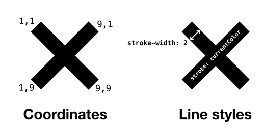
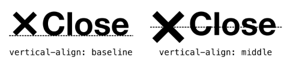
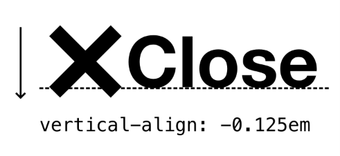
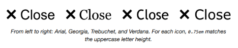
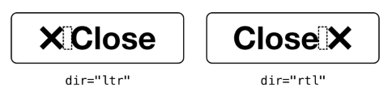
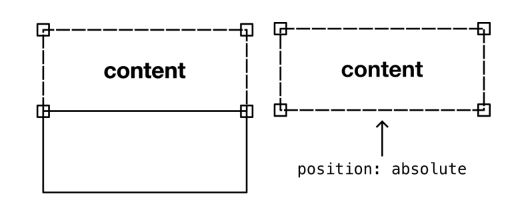

# The Icon

## El problema

La mayoría de los layouts en *Every Layout* toman la forma de [*componentes block-level* ↗](https://developer.mozilla.org/en-US/docs/Glossary/Block-level_content), si me permites la expresión. Esto es, establecen un contexto donde afectan el layout de los elementos hijos bajo su control. Como descubrirás en *Boxes*, los elementos con valores `display` de `block`, `flex` o `grid` son ellos mismos block-level (`flex` y `grid` difieren al afectar a sus elementos hijos de una manera especial).

Aquí, veremos algo mucho más pequeño, y no hay nada mucho más pequeño que un icono. Este será el primer layout para el cual el elemento personalizado conservará su modo de visualización inline predeterminado.

Hacer que las cosas se alineen y se vean bien puede ser un negocio precario. Cuando se trata de iconos, tenemos que preocuparnos por cosas como:

- La distancia entre el icono y el texto
- La altura del icono comparada con la altura del texto
- La alineación vertical del icono con el texto
- Qué sucede cuando el texto viene *después* del icono, en lugar de *antes*
- Qué sucede cuando cambias el tamaño del texto

??? info "Explicacion"

    Claro. Este fragmento está introduciendo un layout muy pequeño de **Every Layout**, probablemente el de **Icon**. La idea principal es: hasta ahora has visto layouts que organizan **bloques completos**, pero aquí quieren resolver algo mucho más pequeño: **cómo colocar un icono junto a un texto sin que se descuadre**.

    Vamos por partes.

    ---

    __1. «La mayoría de los layouts en Every Layout toman la forma de componentes block-level»__

    Cuando dice:

    > “La mayoría de los layouts ... toman la forma de componentes block-level”

    se refiere a que la mayoría de las primitivas de *Every Layout* funcionan como una **caja que ocupa una zona propia** de la página.

    Por ejemplo:

    ```html
    <div class="stack">
        <h1>Título</h1>
        <p>Texto</p>
        <p>Más texto</p>
    </div>
    ```

    El `.stack` es una especie de **contenedor de bloques**.

    Visualmente:

    ```text
    ┌──────────────────────────────┐
    │ Título                       │
    │                              │
    │ Texto                        │
    │                              │
    │ Más texto                    │
    └──────────────────────────────┘
    ```

    El layout `.stack` controla cómo se organizan sus hijos.

    ---

    __2. ¿Qué significa «block-level»?__

    Aquí hay que separar dos conceptos:

    __Elemento block-level__

    Normalmente ocupa todo el ancho disponible y comienza una nueva línea.

    Ejemplo:

    ```html
    <div>Uno</div>
    <div>Dos</div>
    ```

    Visualmente:

    ```text
    Uno
    Dos
    ```

    No quedan uno al lado del otro.

    ---

    __Elemento inline__

    Se comporta más como una palabra dentro de una línea:

    ```html
    <span>Uno</span>
    <span>Dos</span>
    ```

    Visualmente:

    ```text
    Uno Dos
    ```

    Por eso el texto es fundamentalmente **inline**.

    Por ejemplo:

    ```html
    <p>
        Hola mundo
    </p>
    ```

    Las palabras:

    ```text
    Hola mundo
    ```

    fluyen horizontalmente.

    ---

    __3. «Establecen un contexto donde afectan el layout de los elementos hijos»__

    Esta frase es importante.

    Un layout normalmente crea un **contexto de layout** para sus hijos.

    Por ejemplo:

    ```css
    .container {
        display: flex;
    }
    ```

    y:

    ```html
    <div class="container">
        <div>A</div>
        <div>B</div>
    </div>
    ```

    Ahora `.container` está diciendo:

    > “Yo soy Flexbox y voy a decidir cómo se colocan mis hijos”.

    Por eso:

    ```css
    .container {
        display: flex;
    }
    ```

    afecta directamente a:

    ```html
    <div>A</div>
    <div>B</div>
    ```

    y obtenemos:

    ```text
    ┌───────────────┐
    │ A │ B         │
    └───────────────┘
    ```

    En cambio, si no utilizáramos Flexbox:

    ```text
    A
    B
    ```

    ---

    __4. «Los elementos con display de block, flex o grid son ellos mismos block-level»__

    Aquí hay una distinción que suele confundir.

    Cuando escribes:

    ```css
    .box {
        display: block;
    }
    ```

    `.box` es **block-level**.

    Cuando escribes:

    ```css
    .box {
        display: flex;
    }
    ```

    también se comporta externamente como un elemento **block-level**.

    Y:

    ```css
    .box {
        display: grid;
    }
    ```

    también.

    Pero tienen una diferencia fundamental:

    **internamente organizan a sus hijos de manera diferente.**

    Por ejemplo:

    ```css
    .box {
        display: flex;
    }
    ```

    significa aproximadamente:

    ```text
                    .box
                      │
              ┌───────┴───────┐
              │               │
            hijo            hijo
    ```

    Mientras:

    ```css
    .box {
        display: grid;
    }
    ```

    crea un sistema de filas y columnas:

    ```text
    ┌──────────┬──────────┐
    │ hijo     │ hijo     │
    ├──────────┼──────────┤
    │ hijo     │ hijo     │
    └──────────┴──────────┘
    ```

    Por eso el texto dice:

    > “flex y grid difieren al afectar a sus elementos hijos de una manera especial”

    Es decir, **el elemento sigue siendo block-level hacia afuera**, pero hacia adentro se comporta como Flexbox o Grid.

    ---

    __5. Y ahora viene el cambio importante__

    El texto dice:

    > «Aquí, veremos algo mucho más pequeño»

    Hasta ahora estabas trabajando con cosas como:

    ```text
    Stack
    Sidebar
    Cluster
    Switcher
    Cover
    Imposter
    ```

    Son layouts que organizan **cajas completas**.

    Ahora quieren organizar algo mucho más pequeño:

    ```text
    🔗 texto
    ```

    o:

    ```text
    ❤️ Me gusta
    ```

    o:

    ```text
    📍 Ecuador
    ```

    Aquí el problema ya no es:

    > “¿Dónde pongo esta caja?”

    Sino:

    > **“¿Cómo hago que este pequeño icono y el texto se comporten como una sola unidad y queden bien alineados?”**

    ---

    __6. «No hay nada mucho más pequeño que un icono»__

    Es una frase medio poética del autor 😄.

    Está diciendo:

    > Vamos a construir un layout para elementos diminutos.

    Por ejemplo:

    ```text
    🔍 Buscar
    ```

    El icono puede ser un SVG:

    ```html
    <svg>...</svg>
    ```

    y el texto:

    ```html
    Buscar
    ```

    El conjunto es muy pequeño comparado con layouts como una página completa.

    ---

    __7. «Este será el primer layout para el cual el elemento personalizado conservará su modo de visualización inline predeterminado»__

    Aquí está una de las ideas más importantes.

    Normalmente, las primitivas de Every Layout pueden ser algo parecido a:

    ```html
    <div class="stack">
    ```

    y ese elemento funciona como un bloque.

    Pero para el icono quieren que el elemento sea **inline**.

    ¿Por qué?

    Porque un icono normalmente vive **dentro de una línea de texto**.

    Por ejemplo:

    ```html
    <p>
        Me gusta ❤️ mucho este lugar.
    </p>
    ```

    No quieres que el corazón haga esto:

    ```text
    Me gusta

    ❤️

    mucho este lugar.
    ```

    Quieres:

    ```text
    Me gusta ❤️ mucho este lugar.
    ```

    Por eso aquí tiene sentido conservar el comportamiento `inline`.

    ---

    __8. Ahora viene el verdadero problema: hacer que se vea bien__

    El texto enumera cinco problemas.

    Y estos son precisamente los problemas que el layout del icono pretende solucionar.

    ---

    __Problema 1: distancia entre icono y texto__

    Tenemos:

    ```text
    🔍Buscar
    ```

    Está demasiado pegado.

    Queremos:

    ```text
    🔍 Buscar
    ```

    Necesitamos controlar el espacio.

    Por ejemplo:

    ```css
    .icon {
        margin-inline-end: 0.5em;
    }
    ```

    Pero hay que pensar cuidadosamente cómo hacerlo para que funcione independientemente de dónde aparezca el icono.

    ---

    __9. Problema 2: altura del icono frente al texto__

    Imagina:

    ```text
    🔍 Buscar
    ```

    Pero el icono mide 30 px:

    ```text
    🔍
    Buscar
    ```

    mientras el texto mide 16 px.

    El icono puede verse demasiado grande.

    O al contrario:

    ```text
    · Buscar
    ```

    El icono puede ser demasiado pequeño.

    Entonces tenemos que conseguir una relación adecuada entre:

    ```text
    tamaño del icono
            ↓
    tamaño del texto
    ```

    Idealmente, si aumentamos el tamaño del texto:

    ```css
    font-size: 2rem;
    ```

    el icono también debería adaptarse.

    ---

    __10. Problema 3: alineación vertical__

    Este es probablemente el problema que más vas a encontrar con iconos.

    Mira:

    ```text
    🔍 Buscar
    ```

    Parece sencillo, pero internamente el navegador está trabajando con la **línea de texto**, la línea base (*baseline*), alturas de línea, etc.

    Podrías terminar con algo visualmente parecido a:

    ```text
    🔍
    Buscar
    ```

    o:

    ```text
    🔍
    Buscar
    ```

    cuando quieres:

    ```text
    🔍 Buscar
    ```

    El icono tiene que estar correctamente alineado con la línea de texto.

    ---

    __11. Problema 4: ¿qué pasa si el texto viene después?__

    Esto parece una tontería, pero es importante.

    Puedes tener:

    ```text
    🔗 Enlace
    ```

    Aquí:

    ```text
    ICONO → TEXTO
    ```

    Pero también podrías tener:

    ```text
    Enlace 🔗
    ```

    Aquí:

    ```text
    TEXTO → ICONO
    ```

    Si tu CSS dice algo como:

    ```css
    margin-right: 0.5em;
    ```

    funcionaría para:

    ```text
    🔗 Enlace
    ```

    pero produciría algo raro en:

    ```text
    Enlace 🔗
    ```

    porque el espacio estaría del lado incorrecto.

    La solución debe ser **independiente de qué lado esté el icono**.

    Ese es precisamente el tipo de problema que Every Layout intenta resolver con reglas generales en lugar de hacks específicos.

    ---

    __12. Problema 5: ¿qué sucede cuando cambias el tamaño del texto?__

    Este es todavía más importante.

    Supongamos:

    ```text
    🔍 Buscar
    ```

    con:

    ```css
    font-size: 16px;
    ```

    Todo perfecto.

    Pero el usuario aumenta el texto:

    ```css
    font-size: 32px;
    ```

    Ahora:

    ```text
    🔍 Buscar
    ```

    puede quedar mal porque el icono conserva su tamaño original.

    Queremos algo más parecido a:

    ```text
    🔍 Buscar
    ```

    pequeño:

    ```text
    16px
    ```

    y:

    ```text
    🔍 Buscar
    ```

    grande:

    ```text
    32px
    ```

    El icono debería **adaptarse al contexto del texto**.

    ---

    __La idea completa__

    Entonces todo el párrafo está preparando este problema:

    Tenemos algo pequeño:

    ```text
    [ICONO] [TEXTO]
    ```

    y queremos que funcione correctamente en todas estas situaciones:

    ```text
    🔍 Buscar
    ```

    ```text
    Buscar 🔍
    ```

    ```text
    🔍 Buscar
    ```

    con texto pequeño,

    ```text
    🔍 BUSCAR
    ```

    con texto grande,

    y además que:

    * haya una separación correcta;
    * el icono tenga un tamaño adecuado;
    * quede alineado verticalmente;
    * funcione a ambos lados del texto;
    * responda al cambio de tamaño del texto.

    ---

    __La idea que debes quedarte__

    Hasta aquí **todavía no te están enseñando el código de la solución**.

    Están definiendo el **problema de diseño**.

    La diferencia con los layouts anteriores es esta:

    ```text
    Layouts anteriores
            ↓
    organizan CAJAS
            ↓
    block / flex / grid
    ```

    Mientras que este nuevo layout:

    ```text
    Icon
    ↓
    organiza algo MUY PEQUEÑO
    ↓
    ICONO + TEXTO
    ↓
    inline
    ```

    Y por eso es interesante: **no todo en CSS debe resolverse convirtiendo todo en `flex` o `grid`**. Para un icono metido dentro de una frase, el modelo inline del navegador es justamente parte de lo que queremos aprovechar.


## Un icono simple

Antes de analizar todo esto, primero te daré un curso rápido intensivo sobre iconografía SVG, ya que SVG es el formato de iconografía *de facto* en la web. Considera el siguiente código:

```html linenums="1"
<svg viewBox="0 0 10 10" width="0.75em" height="0.75em" stroke="currentColor" stroke-width="2">
  <line x1="1" y1="1" x2="9" y2="9" />
  <line x1="9" y1="1" x2="1" y2="9" />
</svg>
```

Esto define un icono simple: una cruz. Déjame explicar cada una de las características clave:

- **`viewBox`**: Esto define el sistema de coordenadas para el SVG. La parte `0 0` significa *"contar desde la esquina superior izquierda"* y la parte `10 10` significa darle al "lienzo" SVG 10 coordenadas horizontales y 10 verticales. Estamos definiendo un cuadrado, ya que todos nuestros iconos ocuparán un espacio cuadrado.
- **`width` y `height`**: Esto establece el tamaño del icono. Explicaré por qué usa la unidad `em`, y está configurado a `0.75em` en breve. Por ahora, ten en cuenta que establecemos el ancho y la altura en el SVG, en lugar de en CSS, porque queremos mantener el icono pequeño incluso si CSS falla al cargar. Los SVG se muestran muy grandes en la mayoría de los navegadores por defecto.
- **`stroke` y `stroke-width`**: Estos atributos de presentación le dan a los elementos `<line />` una forma visible. Pueden escribirse, o anularse, en CSS. Pero como no estamos usando muchos, es mejor asegurarse de que estos también sean independientes de CSS.
- **`<line />`**: El elemento dibuja una línea simple. Aquí tenemos una dibujada desde la esquina superior izquierda a la inferior derecha, seguida por una dibujada desde la esquina superior derecha a la inferior izquierda (haciendo nuestra cruz). Estoy usando `1` y `9`, no `0` y `10`, para compensar el `stroke-width` de la línea. De lo contrario, la línea desbordaría el "lienzo" SVG.



Hay muchas formas de dibujar la misma forma de cruz. Quizás la más eficiente es usar un elemento `<path />`. Un path te permite colocar todas las coordenadas en un atributo. El símbolo `M` marca el inicio de las coordenadas separadas de cada línea:

```html linenums="1"
<svg viewBox="0 0 10 10" width="0.75em" height="0.75em" stroke="currentColor" stroke-width="2">
  <path d="M1,1 9,9 M9,1 1,9" />
</svg>
```

Cuando tus datos SVG son tan concisos, no hay razón para no incluirlos inline en lugar de usar un `` que apunte a un archivo SVG. Hay otras ventajas además de poder prescindir de una solicitud HTTP, como la capacidad de usar `currentColor` como se muestra. Esta palabra clave hace que tu SVG inline adopte el `color` del texto circundante. Para los iconos de demostración a seguir, los iconos se incluyen a través del elemento `<use>`, que referencia uno de muchos `<symbol>`s de iconos definidos en un solo archivo `icons.svg` (y por lo tanto una sola solicitud HTTP). La técnica `currentColor` aún funciona al referenciar datos SVG de esta manera.

```html linenums="1"
<svg class="icon">
  <use href="/images/icons/icons.svg#cross"></use>
</svg>
```

En cualquier caso, SVG es un formato eficiente, mucho mejor adaptado a la iconografía que las imágenes rasterizadas como PNG, y sin los consiguientes [*problemas de accesibilidad* ↗](https://cloudfour.com/thinks/seriously-dont-use-icon-fonts/) de las fuentes de iconos.

Nuestra tarea aquí es crear un lienzo SVG confiable para iconos cuadrados, y asegurar que se ajuste perfectamente junto al texto, con el mínimo de configuración manual.

??? info "Explicacion"

    Sí. Este fragmento ya entra en la **parte técnica de cómo construir el icono** que después van a integrar con texto. Hay varias cosas importantes aquí, especialmente `viewBox`, `em`, `stroke`, `path`, `currentColor` y `<use>`.

    Voy desde cero.

    ---

    __1. Primero: ¿qué es un SVG?__

    SVG significa **Scalable Vector Graphics**.

    A diferencia de un PNG:

    ```text
    PNG
    → píxeles
    → resolución fija
    → si lo agrandas mucho, pierde calidad
    ```

    SVG:

    ```text
    SVG
    → instrucciones geométricas
    → líneas, círculos, curvas, etc.
    → se puede escalar sin perder calidad
    ```

    Por ejemplo, esta cruz:

    ```text
    \ /
    X
    / \
    ```

    en SVG no se almacena como una fotografía de píxeles.

    Se almacena básicamente como:

    > "Dibuja una línea desde aquí hasta aquí y otra línea desde aquí hasta aquí".

    Eso es perfecto para iconos.

    ---

    __2. El primer SVG__

    Tenemos:

    ```html
    <svg
        viewBox="0 0 10 10"
        width="0.75em"
        height="0.75em"
        stroke="currentColor"
        stroke-width="2"
    >
        <line x1="1" y1="1" x2="9" y2="9" />
        <line x1="9" y1="1" x2="1" y2="9" />
    </svg>
    ```

    Vamos atributo por atributo.

    ---

    __3. `<svg>`__

    ```html
    <svg>
    ```

    Es simplemente:

    > "Aquí comienza un dibujo SVG".

    Todo lo que esté dentro pertenece al dibujo.

    ---

    __4. `viewBox="0 0 10 10"`__

    Este es probablemente el atributo que más debes entender.

    ```html
    viewBox="0 0 10 10"
    ```

    Tiene **cuatro números**:

    ```text
    viewBox="min-x min-y width height"
    ```

    Por tanto:

    ```text
    viewBox="0 0 10 10"
              │ │ │  │
              │ │ │  └── altura: 10
              │ │ └───── ancho: 10
              │ └─────── coordenada Y inicial: 0
              └───────── coordenada X inicial: 0
    ```

    Entonces estamos diciendo:

    > "Mi sistema de coordenadas empieza en `(0,0)` y tiene un área de `10 × 10`."

    Puedes imaginarlo así:

    ```text
    (0,0)                         (10,0)
      ┌────────────────────────────┐
      │                            │
      │                            │
      │                            │
      │                            │
      │                            │
      └────────────────────────────┘
    (0,10)                       (10,10)
    ```

    Ese es el **lienzo interno** del SVG.

    ---

    __5. Ojo: `viewBox` NO dice cuánto mide físicamente el SVG__

    Esto es muy importante.

    `viewBox` dice:

    > **"¿Cuál es mi sistema interno de coordenadas?"**

    Mientras que:

    ```html
    width="0.75em"
    height="0.75em"
    ```

    dice:

    > **"¿Cuánto espacio ocupo físicamente?"**

    Son dos cosas diferentes.

    Puedes tener:

    ```html
    <svg viewBox="0 0 10 10" width="15px" height="15px">
    ```

    y también:

    ```html
    <svg viewBox="0 0 10 10" width="100px" height="100px">
    ```

    En ambos casos el dibujo utiliza coordenadas:

    ```text
    0 → 10
    ```

    pero el segundo SVG se representa físicamente mucho más grande.

    ---

    __6. ¿Por qué `0 0 10 10`?__

    Porque quieren que **todos los iconos tengan un sistema cuadrado común**.

    Es decir:

    ```text
    10 × 10
    ```

    Así pueden pensar en todos los iconos de la misma manera:

    ```text
    ┌──────────┐
    │          │
    │   ICONO  │
    │          │
    └──────────┘
    ```

    Esto después será muy útil para el layout.

    ---

    __7. `width="0.75em"`__

    Ahora viene algo interesante:

    ```html
    width="0.75em"
    ```

    ¿Qué es `em`?

    `em` es una unidad relativa al **tamaño de fuente**.

    Si el texto tiene:

    ```css
    font-size: 16px;
    ```

    entonces:

    ```text
    1em = 16px
    ```

    Por tanto:

    ```text
    0.75em = 12px
    ```

    aproximadamente.

    Si el texto aumenta:

    ```css
    font-size: 24px;
    ```

    entonces:

    ```text
    1em = 24px
    0.75em = 18px
    ```

    Así que el icono crece junto con el texto.

    Esto conecta directamente con el problema que viste en el fragmento anterior.

    Querían que:

    > **el icono se adapte al tamaño del texto.**

    Y `em` ayuda a conseguirlo.

    ---

    __8. ¿Por qué `width` y `height` están dentro del SVG?__

    El autor dice algo muy interesante:

    > "queremos mantener el icono pequeño incluso si CSS falla al cargar."

    Supongamos que haces:

    ```html
    <svg class="icon">
    ```

    y todo el tamaño depende de:

    ```css
    .icon {
        width: 0.75em;
        height: 0.75em;
    }
    ```

    Pero por alguna razón CSS no carga.

    El navegador puede representar un SVG sin dimensiones explícitas de una forma que no quieres.

    Por eso:

    ```html
    <svg width="0.75em" height="0.75em">
    ```

    establece una especie de **valor de seguridad**.

    Es una filosofía bastante sensata:

    > El componente debe tener un comportamiento razonable incluso cuando algo externo falla.

    ---

    __9. `stroke="currentColor"`__

    Ahora:

    ```html
    stroke="currentColor"
    ```

    `stroke` significa básicamente:

    > "¿De qué color dibujo las líneas?"

    Pero aparece:

    ```text
    currentColor
    ```

    ¿Qué significa?

    Significa:

    > **usa el valor actual de `color`.**

    Por ejemplo:

    ```css
    button {
        color: red;
    }
    ```

    y:

    ```html
    <button>
        <svg stroke="currentColor">
            ...
        </svg>
    </button>
    ```

    El SVG será rojo.

    Si cambias:

    ```css
    button {
        color: blue;
    }
    ```

    el SVG será azul.

    No tienes que hacer:

    ```css
    .icon {
        stroke: blue;
    }
    ```

    El icono simplemente **hereda el concepto de color del contexto**.

    ---

    __10. ¿Por qué es tan útil?__

    Imagina:

    ```html
    <a>
        <svg>...</svg>
        Descargar
    </a>
    ```

    Si el enlace tiene:

    ```css
    a {
        color: purple;
    }
    ```

    el icono también será púrpura.

    Si:

    ```css
    a:hover {
        color: red;
    }
    ```

    el icono se vuelve rojo automáticamente.

    Esto es muy elegante.

    El icono no necesita saber:

    > "Soy rojo."

    Simplemente dice:

    > "Usaré el color que tenga mi contexto."

    ---

    __11. `stroke-width="2"`__

    Esto establece el grosor de la línea.

    Tenemos:

    ```html
    stroke-width="2"
    ```

    Nuestro lienzo es:

    ```text
    10 × 10
    ```

    y las líneas tienen grosor:

    ```text
    2
    ```

    Por eso la cruz será relativamente gruesa.

    ---

    __12. Ahora aparece `<line>`__

    Tenemos:

    ```html
    <line
        x1="1"
        y1="1"
        x2="9"
        y2="9"
    />
    ```

    Esto significa:

    > dibuja una línea desde `(1,1)` hasta `(9,9)`.

    Visualmente:

    ```text
    (0,0)
    ┌──────────┐
    │ ╲        │
    │   ╲      │
    │     ╲    │
    │       ╲  │
    │         ╲│
    └──────────┘
    ```

    ---

    __13. ¿Qué son `x1`, `y1`, `x2`, `y2`?__

    Muy sencillo:

    ```text
    x1 = X donde empieza
    y1 = Y donde empieza

    x2 = X donde termina
    y2 = Y donde termina
    ```

    Por tanto:

    ```html
    <line x1="1" y1="1" x2="9" y2="9" />
    ```

    significa:

    ```text
    inicio  → (1,1)
    final   → (9,9)
    ```

    ---

    __14. La segunda línea__

    ```html
    <line
        x1="9"
        y1="1"
        x2="1"
        y2="9"
    />
    ```

    Ahora:

    ```text
    inicio → (9,1)
    final  → (1,9)
    ```

    Es la diagonal contraria.

    Tenemos:

    ```text
    ┌──────────┐
    │ ╲      ╱ │
    │   ╲  ╱   │
    │    ╳     │
    │   ╱  ╲   │
    │ ╱      ╲ │
    └──────────┘
    ```

    Una cruz.

    ---

    __15. ¿Por qué usan `1` y `9` y no `0` y `10`?__

    Esta parte es muy importante.

    Podrías pensar:

    > "Si el lienzo va de 0 a 10, hagamos la línea de 0 a 10."

    Pero tenemos:

    ```html
    stroke-width="2"
    ```

    La línea tiene grosor.

    Entonces si haces:

    ```html
    <line x1="0" y1="0" x2="10" y2="10">
    ```

    la mitad de la línea está dentro del lienzo, pero la otra mitad **sale fuera**.

    Algo así:

    ```text
          ┌──────────┐
      ╲  │          │
        ╲│          │
          │          │
          │          │
          └──────────┘
    ```

    Por eso empiezan en:

    ```text
    1
    ```

    y terminan en:

    ```text
    9
    ```

    dejando aproximadamente un margen para el grosor:

    ```text
    0   1             9   10
    │   │─────────────│   │
        ↑             ↑
      margen        margen
    ```

    ---

    __16. Ahora el autor dice que hay otra forma__

    En lugar de:

    ```html
    <line />
    <line />
    ```

    podemos usar:

    ```html
    <path />
    ```

    Así:

    ```html
    <path d="M1,1 9,9 M9,1 1,9" />
    ```

    Esto parece más raro, pero conceptualmente está diciendo exactamente lo mismo.

    ---

    __17. ¿Qué es `<path>`?__

    `path` significa:

    > una ruta que puede contener diferentes instrucciones de dibujo.

    Por ejemplo:

    ```html
    <path d="..." />
    ```

    El atributo:

    ```text
    d
    ```

    contiene las instrucciones.

    Aquí:

    ```text
    M1,1 9,9 M9,1 1,9
    ```

    ---

    __18. ¿Qué significa `M`?__

    `M` significa **Move To**.

    Es decir:

    > "mueve el lápiz hasta aquí."

    Por ejemplo:

    ```text
    M1,1
    ```

    significa:

    > empieza en `(1,1)`.

    Después:

    ```text
    9,9
    ```

    significa continuar hasta `(9,9)`.

    Tenemos:

    ```text
    M1,1 9,9
    ```

    que equivale a:

    ```text
    mueve a (1,1)
    dibuja hasta (9,9)
    ```

    Luego:

    ```text
    M9,1 1,9
    ```

    hace:

    ```text
    mueve a (9,1)
    dibuja hasta (1,9)
    ```

    Por tanto:

    ```text
    M1,1 9,9 M9,1 1,9
    ```

    es simplemente una versión compacta de las dos líneas.

    ---

    __19. ¿Por qué el `<path>` puede ser más eficiente?__

    Porque en lugar de tener:

    ```html
    <line ... />
    <line ... />
    ```

    tienes:

    ```html
    <path d="..." />
    ```

    Menos elementos y menos markup.

    Para un icono con muchísimas formas, esto puede ser bastante útil.

    ---

    __20. Ahora llegamos a una parte MUY importante: inline SVG__

    El autor dice:

    > cuando tus datos SVG son tan concisos, no hay razón para no incluirlos inline.

    Es decir, en vez de:

    ```html
    
    ```

    puedes hacer:

    ```html
    <svg>
        ...
    </svg>
    ```

    directamente dentro del HTML.

    ---

    __21. ¿Cuál es la diferencia?__

    Con:

    ```html
    
    ```

    tienes:

    ```text
    HTML
    │
    └── solicita cross.svg
                  │
                  └── archivo externo
    ```

    Mientras que con:

    ```html
    <svg>
        ...
    </svg>
    ```

    el SVG ya está dentro del HTML.

    Una ventaja es que **no necesitas una solicitud HTTP adicional para ese SVG individual**.

    Pero el autor menciona otra ventaja todavía más interesante:

    ```text
    currentColor
    ```

    Porque al tener el SVG directamente en el DOM, puedes interactuar con sus propiedades de presentación de una forma muy conveniente.

    ---

    __22. Después introduce `<symbol>` y `<use>`__

    Aquí aparece otra técnica.

    Puedes tener un archivo:

    ```text
    icons.svg
    ```

    que contiene muchos iconos:

    ```text
    icons.svg
    │
    ├── cross
    ├── search
    ├── menu
    ├── arrow
    ├── check
    └── close
    ```

    Y luego desde tu HTML haces:

    ```html
    <svg class="icon">
        <use href="/images/icons/icons.svg#cross"></use>
    </svg>
    ```

    La parte:

    ```text
    #cross
    ```

    significa:

    > quiero utilizar el símbolo identificado como `cross`.

    ---

    __23. ¿Qué está pasando aquí?__

    En lugar de copiar todo el SVG de la cruz cada vez:

    ```html
    <svg>
        ...
    </svg>

    <svg>
        ...
    </svg>

    <svg>
        ...
    </svg>
    ```

    puedes tener una biblioteca central:

    ```text
    icons.svg
    ```

    y reutilizar:

    ```text
    cross
    cross
    cross
    search
    arrow
    check
    ```

    Es parecido a tener:

    ```text
    biblioteca de iconos
            ↓
          <use>
            ↓
        reutilizar
    ```

    ---

    __24. Y aquí aparece una idea muy de Every Layout__

    El autor quiere evitar que tengas que configurar cada icono manualmente.

    La meta es llegar a algo como:

    ```html
    <svg class="icon">
        <use href="...#cross"></use>
    </svg>
    ```

    y que el sistema se encargue del resto.

    Es decir:

    ```text
    Tú:
    "quiero un icono"

    Every Layout:
    "bien, yo me encargo de tamaño,
    alineación, espacio y comportamiento."
    ```

    ---

    __25. Finalmente: SVG frente a PNG__

    El autor dice que SVG está mejor adaptado a iconografía que una imagen rasterizada como PNG.

    ¿Por qué?

    Porque un icono normalmente consiste en:

    ```text
    líneas
    formas
    curvas
    geometría
    ```

    No en:

    ```text
    millones de píxeles
    ```

    Por eso SVG funciona muy bien.

    Puedes tener:

    ```text
    🔍
    ```

    y mostrarlo a:

    ```text
    12px
    ```

    o:

    ```text
    120px
    ```

    sin que se vea pixelado.

    ---

    __26. Y termina definiendo la verdadera misión del layout__

    Esta última frase es la clave de todo:

    > "Nuestra tarea aquí es crear un lienzo SVG confiable para iconos cuadrados, y asegurar que se ajuste perfectamente junto al texto, con el mínimo de configuración manual."

    Traducido a lenguaje sencillo:

    **Queremos construir un componente que haga esto:**

    ```text
    🔍 Buscar
    ```

    y que funcione automáticamente cuando:

    ```text
    el texto cambia de tamaño
            ↓
    el icono cambia de tamaño
    ```

    cuando:

    ```text
    el icono está antes del texto
            ↓
    🔍 Buscar
    ```

    o:

    ```text
    el icono está después
            ↓
    Buscar 🔍
    ```

    y que además:

    ```text
    se alinee correctamente
            ↓
    🔍 Buscar
    ```

    y:

    ```text
    use el color del texto
            ↓
    color: red
            ↓
    🔴 Buscar
    ```

    ---

    __La arquitectura mental que debes llevarte__

    Todo este fragmento se puede resumir así:

    ```text
                        ICONO
                          │
                          ▼
                ┌─────────────────┐
                │      SVG        │
                │                 │
                │  viewBox 10×10  │ ← coordenadas internas
                │                 │
                │    ╲      ╱     │
                │      ╳          │ ← dibujo
                │    ╱      ╲     │
                └─────────────────┘
                          │
                          ▼
                      0.75em
                          │
                          ▼
                  tamaño relativo
                  al texto
                          │
                          ▼
                  currentColor
                          │
                          ▼
                  color del texto
    ```

    Y **ese SVG todavía no es el layout completo**.

    El siguiente paso será precisamente el interesante: **cómo conseguir que este SVG se comporte correctamente como parte de una línea de texto**, que es donde entran `vertical-align`, `em`, el espacio entre elementos y las particularidades del modelo inline. Ahí es donde realmente empieza a tomar forma la primitiva de **Icon** de Every Layout.

## La solución

### Alineación vertical

Como sugiere la nota anterior sobre `currentColor`, vamos a tratar nuestros iconos como texto, y hacer que acompañen al texto tan perfectamente como sea posible. Afortunadamente, el SVG se sentará en la *línea base* del texto por defecto, como si fuera una letra.

Para iconos más altos, podrías esperar poder usar `vertical-align: middle`. Sin embargo, contrario a la creencia popular, esto no alinea alrededor del medio vertical de la fuente, sino *el medio vertical de las letras minúsculas de la fuente*. Por lo tanto, el resultado probablemente será indeseable.



En su lugar, ajustar la alineación vertical para un icono más alto será probablemente cuestión de proporcionar el atributo `vertical-align` con una longitud. Esta longitud representa la distancia por encima de la línea base, y puede tomar un valor negativo.



Para nuestro layout `Icon`, nos limitaremos a colocar los iconos en la línea base. Este es el enfoque más robusto ya que los iconos que cuelgan debajo de la línea base pueden chocar con una línea sucesiva de texto donde ocurre wrapping.


??? info "Explicacion"

    Exactamente. Aquí el autor está resolviendo **uno de los problemas que vimos antes: cómo alinear verticalmente el icono con el texto**.

    Y hay una idea fundamental: **el icono SVG se comporta como si fuera una letra dentro de la línea de texto**.

    Vamos paso por paso.

    ---

    __1. «Vamos a tratar nuestros iconos como texto»__

    Esta frase es la clave:

    > “vamos a tratar nuestros iconos como texto”

    No significa que el SVG se convierta literalmente en texto.

    Significa que queremos que participe en el **modelo de línea de texto (inline formatting)**.

    Por ejemplo:

    ```html
    <p>
        Este es un texto 🔍 interesante
    </p>
    ```

    El navegador tiene que decidir:

    * dónde colocar las letras;
    * dónde colocar el icono;
    * cuál es la línea base;
    * qué pasa si el texto hace wrapping.

    El autor quiere que el SVG se comporte como una especie de **carácter más**.

    ---

    __2. ¿Qué es la línea base?__

    Esta es probablemente la parte más importante.

    Cuando escribes:

    ```text
    Hola mundo
    ```

    las letras no se colocan simplemente dentro de una caja centrada.

    Existe una referencia llamada **baseline**, o **línea base**.

    Puedes imaginarla así:

    ```text
    H o l a   m u n d o
    ───────────────────
            baseline
    ```

    La línea base es aproximadamente la línea sobre la que "se apoyan" las letras.

    Pero ojo: **no es el límite inferior de las letras**.

    Hay letras que tienen partes que bajan por debajo de ella.

    Por ejemplo:

    ```text
    g
    p
    q
    y
    j
    ```

    Visualmente:

    ```text
          letras
          ↓
    Hola mundo
    ──────────────  ← baseline
          g
          ↓
    ```

    La parte que baja se llama **descender**.

    ---

    __3. ¿Qué pasa con un SVG?__

    El autor dice:

    > “afortunadamente, el SVG se sentará en la línea base del texto por defecto”

    Es decir, un SVG inline puede participar en esa línea de texto y alinearse respecto a la baseline.

    Por ejemplo:

    ```html
    <p>
        Buscar
        <svg>...</svg>
    </p>
    ```

    Conceptualmente:

    ```text
    Buscar  ✕
    ──────────────
      baseline
    ```

    El navegador está tratando el SVG como un elemento inline dentro de la línea.

    Esto es muy conveniente.

    ---

    __4. ¿Por qué esto es bueno?__

    Porque nuestro objetivo es:

    ```text
    🔍 Buscar
    ```

    no:

    ```text
      🔍
    Buscar
    ```

    ni:

    ```text
    🔍
    Buscar
    ```

    Queremos que el icono participe naturalmente en la línea.

    Por eso el autor dice:

    > “como si fuera una letra.”

    Es una excelente forma de imaginarlo.

    ---

    __5. Entonces aparece `vertical-align`__

    Ahora supongamos que el icono es pequeño:

    ```text
    🔍 Buscar
    ```

    Probablemente la alineación por defecto está bastante bien.

    Pero imagina que tenemos un icono más alto:

    ```text
      🔍
    Buscar
    ```

    Puede necesitar cierto ajuste vertical.

    Aquí podrías pensar:

    > "¡Uso `vertical-align: middle`!"

    Y ahí viene la trampa.

    ---

    __6. ¿Qué hace realmente `vertical-align: middle`?__

    El autor dice:

    > “contrario a la creencia popular, esto no alinea alrededor del medio vertical de la fuente”

    Esta es una aclaración importante.

    Mucha gente imagina que:

    ```css
    vertical-align: middle;
    ```

    significa:

    > "pon el elemento exactamente en el centro vertical del texto."

    Pero **no funciona exactamente así**.

    ---

    __7. ¿Entonces qué significa `middle`?__

    Para elementos inline, `middle` está relacionado con la **altura de las letras minúsculas**, no simplemente con el centro geométrico de toda la fuente.

    Una forma simplificada de imaginarlo:

    ```text
          ┌─────────┐
          │   H     │
          │         │
          │  abc    │
          │─────────│ ← baseline
          │   g     │
          └─────────┘
    ```

    Las letras minúsculas tienen una altura determinada por encima de la baseline.

    `middle` utiliza una referencia basada en esa zona.

    Por eso no necesariamente produce:

    ```text
    ┌──────────────┐
    │              │
    │     ICONO    │
    │              │
    └──────────────┘
    ```

    perfectamente centrado respecto a toda la altura de la fuente.

    ---

    __8. ¿Por qué puede verse mal?__

    Imagina un icono alto:

    ```text
          ┌───┐
          │ ✕ │
          │   │
          └───┘
    ────────────── baseline
    ```

    Si haces:

    ```css
    .icon {
        vertical-align: middle;
    }
    ```

    el navegador calcula la posición usando las reglas del modelo inline y la referencia de `middle`.

    No significa:

    ```text
    centro del icono
            =
    centro de la caja de texto
    ```

    Por eso puedes terminar con algo visualmente extraño.

    ---

    __9. Entonces el autor propone otra solución__

    Dice:

    > “ajustar la alineación vertical ... será probablemente cuestión de proporcionar `vertical-align` con una longitud.”

    Esto es interesante.

    En lugar de:

    ```css
    vertical-align: middle;
    ```

    puedes hacer algo como:

    ```css
    vertical-align: 0.1em;
    ```

    o:

    ```css
    vertical-align: -0.1em;
    ```

    Aquí ya no estás diciendo:

    > "usa una palabra clave."

    Estás diciendo:

    > **"mueve este elemento esta cantidad respecto a la línea base."**

    ---

    __10. ¿Qué significa una longitud?__

    Por ejemplo:

    ```css
    vertical-align: 0.2em;
    ```

    significa aproximadamente:

    ```text
    sube 0.2em
    ```

    Visualmente:

    ```text
          🔍
          ↑
    ────────────── baseline
    ```

    Mientras:

    ```css
    vertical-align: -0.2em;
    ```

    significa:

    ```text
    baja 0.2em
    ```

    ```text
    ────────────── baseline
          ↓
          🔍
    ```

    Por eso el texto dice:

    > “puede tomar un valor negativo.”

    ---

    __11. Esto es importante: no es `top` y `bottom`__

    No pienses:

    ```css
    vertical-align: -0.2em;
    ```

    como:

    > "alinea abajo".

    No.

    Es más parecido a:

    > **"desplázate cierta distancia respecto a la línea base."**

    La referencia es la baseline.

    Por eso:

    ```text
    vertical-align: 0.2em
    ```

    sube.

    Y:

    ```text
    vertical-align: -0.2em
    ```

    baja.

    ---

    __12. Pero Every Layout decide NO hacer eso__

    Y aquí está la decisión de diseño:

    > “Para nuestro layout Icon, nos limitaremos a colocar los iconos en la línea base.”

    Es decir:

    **no van a intentar centrar artificialmente el icono.**

    Quieren mantener:

    ```css
    vertical-align: baseline;
    ```

    o simplemente aprovechar el comportamiento predeterminado.

    ---

    __13. ¿Por qué?__

    Porque es más robusto.

    Imagina:

    ```text
    Este es un texto largo 🔍
    que continúa en la siguiente línea.
    ```

    El texto hace **wrapping**.

    Ahora imagina que el icono se ha movido hacia abajo:

    ```text
    Este es un texto largo
    🔍
    que continúa...
    ```

    El icono puede invadir o chocar visualmente con la siguiente línea.

    El autor dice:

    > “los iconos que cuelgan debajo de la línea base pueden chocar con una línea sucesiva de texto donde ocurre wrapping.”

    Es decir, si haces que el icono sobresalga demasiado hacia abajo:

    ```text
    línea 1:  Este es un texto 🔍
                          ↓
    línea 2:  que continúa aquí
    ```

    puede haber conflicto.

    ---

    __14. ¿Por qué la baseline es una opción más segura?__

    Porque la baseline está pensada precisamente para que los caracteres de una línea puedan convivir.

    Piensa en esto:

    ```text
    Hola mundo
    ──────────
    baseline
    ```

    y la siguiente línea:

    ```text
    Este es otro texto
    ──────────────────
    baseline
    ```

    El sistema de líneas del navegador está diseñado alrededor de esas referencias.

    Si nuestro icono respeta la línea base, se integra mejor en ese sistema.

    ---

    __15. Hay una sutileza importante__

    Recuerda que esto:

    ```text
    baseline
    ────────────
    ```

    no significa que **todo el icono quede por encima de ella**.

    El icono puede tener parte debajo de la baseline.

    Lo importante es **dónde está alineado su punto de referencia**, no que toda la caja esté encima.

    Es parecido a una letra:

    ```text
          A
          g
    ──────────── baseline
          ↓
    ```

    La `g` también puede extenderse debajo.

    Eso es normal en tipografía.

    ---

    __16. Entonces, ¿qué está diciendo realmente todo este apartado?__

    En lenguaje sencillo:

    > "Nuestro icono forma parte de una línea de texto. Por tanto, vamos a aprovechar el sistema de alineación inline del navegador. Los SVG ya se comportan de forma compatible con la baseline. Aunque `vertical-align: middle` podría parecer tentador, no significa exactamente 'centro del texto', así que puede dar resultados inconsistentes. Podríamos ajustar manualmente la posición con valores como `0.1em` o `-0.1em`, pero para nuestro componente queremos algo más robusto: dejar el icono alineado con la línea base."

    ---

    __17. Y esto conecta con el objetivo general del componente__

    Hasta ahora tenemos:

    __Tamaño__

    ```html
    width="0.75em"
    height="0.75em"
    ```

    → el icono escala con el texto.

    __Color__

    ```html
    stroke="currentColor"
    ```

    → el icono adopta el color del texto.

    __Coordenadas__

    ```html
    viewBox="0 0 10 10"
    ```

    → todos los iconos utilizan un lienzo cuadrado consistente.

    __Alineación__

    ```css
    vertical-align: baseline;
    ```

    → el icono participa naturalmente en la línea de texto.

    Entonces estamos construyendo algo que básicamente dice:

    ```text
                    TEXTO
                      │
                      ▼
              ┌───────────────┐
              │  ICON + TEXT  │
              └───────────────┘
                      │
              ┌───────┴───────┐
              ▼               ▼
          mismo color     mismo contexto
          mismo tamaño    misma baseline
    ```

    Y esa es la filosofía de **Every Layout** aquí: **no intentar pelearse con el navegador para imponer una posición perfecta a mano**, sino aprovechar el modelo de layout que ya existe y añadir solamente las reglas necesarias.

    La siguiente pieza importante será **el espacio entre el icono y el texto**, porque ahí aparece otra pequeña trampa del modelo `inline`: el espacio no se debería resolver simplemente con un `margin-right` pensando que el icono siempre estará antes del texto.


### Coincidencia de altura

Una altura de icono adecuada, comenzando desde la línea base, depende algo de las mayúsculas/minúsculas de la fuente y la presencia o ausencia de *descenders* ↗. Donde las letras son todas minúsculas, e incluyen descendentes, las cosas pueden verse particularmente desequilibradas.

[*Esta demostración interactiva solo está disponible en el sitio de Every Layout* ↗](https://every-layout.dev/demos/icon-casings/).

Este problema perceptual se puede mitigar asegurando que la primera letra del texto que acompaña al icono esté siempre en mayúscula, y que el icono en sí mismo tenga la altura de una letra mayúscula.

Igualar la altura de la letra mayúscula real es otro asunto. Podrías esperar que `1em` sea el valor, pero rara vez es el caso. `1em` se corresponde más estrechamente con la altura de la fuente en sí misma. Al hacer selecciones de texto de algunas fuentes, verás que la altura de la fuente es a menudo más alta que sus letras mayúsculas. Dicho de otra manera: `1em` corresponde a las métricas de la fuente, no a las métricas de las letras.

En mi experimentación, encontré que `0.75em` se aproxima más a la altura de las letras mayúsculas. Por lo tanto, los atributos de presentación para mi icono de cruz son `0.75em` cada uno, para hacer un cuadrado siguiendo el precedente establecido por el `viewBox`.

```html linenums="1"
<svg viewBox="0 0 10 10" width="0.75em" height="0.75em" stroke="currentColor" stroke-width="2">
  <path d="M1,1 9,9 M9,1 1,9" />
</svg>
```



> *De izquierda a derecha: Arial, Georgia, Trebuchet y Verdana. Para cada icono, `0.75em` coincide con la altura de la letra mayúscula.*

Sin embargo, la [*emergente unidad `cap`* ↗](https://drafts.csswg.org/css-values/#cap) promete evaluar la fuente individual para una coincidencia más precisa. Dado que actualmente no es muy compatible, podemos usar `0.75em` como respaldo en nuestro CSS:

```css linenums="1"
.icon {
  height: 0.75em;
  height: 1cap;
  width: 0.75em;
  width: 1cap;
}
```

Mejor tener los valores `0.75em` en el CSS también, en caso de que un autor haya omitido los atributos de presentación.

Como Andy escribió en [*Relative Sizing With EM units* ↗](https://piccalil.li/blog/relative-sizing-with-em-units/), el icono ahora escalará automáticamente con el texto: `0.75em` es relativo al `font-size` para el contexto. Por ejemplo:

```css linenums="1"
.small {
  font-size: 0.75em;
}
.small .icon {
  /* La altura del icono será automáticamente
  0.75 * 0.75em */
}
.big {
  font-size: 1.25em;
}
.big .icon {
  /* La altura del icono será automáticamente
  1.25 * 0.75em */
}
```

[*Esta demostración interactiva solo está disponible en el sitio de Every Layout* ↗](https://every-layout.dev/demos/icon-sizes/).

??? info "Explicacion"

    Aquí el autor está resolviendo el **segundo gran problema del icono**: no basta con que esté alineado en la línea base; también necesitamos que **su altura visual coincida con la altura de las letras**.

    Y aquí aparece una confusión muy común:

    > **`1em` NO significa "altura de una letra".**

    Ese es el punto central del fragmento.

    ---

    __1. El problema: ¿qué tan alto debe ser el icono?__

    Tenemos:

    ```text
    🔍 Buscar
    ```

    Queremos que el icono tenga una altura visual parecida a las letras.

    Pero ¿qué significa "parecida"?

    Mira una palabra con mayúsculas:

    ```text
    Buscar
    ^^^^^^
    ```

    La `B` tiene una altura determinada.

    Pero mira una palabra con minúsculas:

    ```text
    buscar
    ```

    y además algunas letras tienen **descenders**:

    ```text
    g
    p
    q
    y
    j
    ```

    Por ejemplo:

    ```text
    g
    ```

    tiene una parte que baja debajo de la línea base.

    ---

    __2. ¿Qué es un descender?__

    Ya que el texto utiliza la palabra:

    > *descenders*

    es importante visualizarlo.

    Tenemos:

    ```text
      altura de las letras
            ↓
      ┌─────────┐
      │  a b c  │
    ───┴─────────┴──── línea base
          g
          ↓
      descendente
    ```

    La parte de la `g` que baja debajo de la línea base es el **descender**.

    Lo mismo ocurre con:

    ```text
    p
    q
    y
    j
    ```

    ---

    __3. ¿Por qué esto afecta al icono?__

    Supongamos:

    ```text
    🔍 buscar
    ```

    El texto está compuesto solamente por minúsculas.

    Algunas letras pueden bajar:

    ```text
    🔍 buscar
          ↓
          g
    ```

    El ojo puede percibir que el icono queda demasiado alto o demasiado bajo respecto al conjunto.

    Visualmente puede parecer:

    ```text
      🔍
    buscar
    ```

    cuando queremos algo más equilibrado:

    ```text
    🔍 buscar
    ```

    Esto es un problema **perceptual**, no solamente matemático.

    Y esa palabra es importante: **perceptual**.

    No estamos buscando que las cajas tengan exactamente las mismas dimensiones.

    Estamos buscando que **visualmente parezcan equilibradas**.

    ---

    __4. La solución propuesta: mayúscula + icono del tamaño de una mayúscula__

    El autor dice que esto puede mitigarse haciendo que:

    > la primera letra del texto esté siempre en mayúscula.

    Por ejemplo:

    ```text
    🔍 Buscar
    ```

    en lugar de:

    ```text
    🔍 buscar
    ```

    ¿Por qué?

    Porque ahora tenemos una referencia visual clara:

    ```text
    B
    ```

    La letra mayúscula tiene una altura bastante definida.

    Entonces podemos hacer que el icono tenga aproximadamente:

    ```text
    altura del icono ≈ altura de la mayúscula
    ```

    Visualmente:

    ```text
    🔍 Buscar
    ↑   ↑
    │   │
    │   └── altura de B
    └────── altura del icono
    ```

    ---

    __5. Pero aparece una trampa: `1em`__

    Aquí viene lo importante.

    Uno podría pensar:

    > "Si quiero que el icono tenga la altura del texto, pongo `1em`."

    Por ejemplo:

    ```css
    .icon {
        width: 1em;
        height: 1em;
    }
    ```

    Parece lógico.

    Pero **no funciona como probablemente estás imaginando**.

    ---

    __6. ¿Qué representa realmente `1em`?__

    `em` está relacionado con el **tamaño de fuente**, pero no significa literalmente:

    > "altura física de las letras".

    Si tienes:

    ```css
    font-size: 16px;
    ```

    entonces:

    ```text
    1em = 16px
    ```

    Pero eso NO quiere decir que una `A` mida exactamente 16 px de alto.

    La fuente tiene métricas internas.

    Puedes imaginar:

    ```text
            ┌─────────────────┐
            │                 │
            │    espacio      │
            │                 │
            │      A          │
            │                 │
    ────────┴─────────────────┴── baseline
    ```

    El tamaño de `1em` pertenece a las **métricas tipográficas de la fuente**, no necesariamente al dibujo visible de la letra.

    ---

    __7. `em` representa las métricas de la fuente__

    Esta frase del autor es clave:

    > "`1em` corresponde a las métricas de la fuente, no a las métricas de las letras."

    Hay que separar:

    ```text
    font-size
      ↓
    métricas de la fuente
    ```

    de:

    ```text
    altura real visible de la A
    ```

    No son necesariamente iguales.

    Por eso:

    ```css
    font-size: 16px;
    ```

    no significa:

    ```text
    A = 16px de alto
    ```

    Significa más bien:

    ```text
    el contexto tipográfico utiliza un tamaño de 16px
    ```

    y la fuente decide cómo se distribuye ese espacio según sus métricas.

    ---

    __8. Entonces ¿qué descubrió el autor?__

    Después de probar distintas fuentes, encontró que:

    ```text
    0.75em
    ```

    se aproxima bastante a la altura visual de una letra mayúscula.

    Por eso utiliza:

    ```html
    width="0.75em"
    height="0.75em"
    ```

    En vez de:

    ```html
    width="1em"
    height="1em"
    ```

    ---

    __9. Visualmente__

    Podemos imaginar:

    ```text
    1em
    ┌─────────────┐
    │             │
    │     A       │
    │             │
    └─────────────┘
    ```

    La `A` no ocupa necesariamente todo ese espacio.

    En cambio:

    ```text
    0.75em
    ┌─────────┐
    │    A    │
    └─────────┘
    ```

    se aproxima mejor a la altura visual de la mayúscula en muchas fuentes.

    No es una ley universal.

    Es una **aproximación práctica**.

    ---

    __10. Por eso el SVG queda así__

    ```html
    <svg
        viewBox="0 0 10 10"
        width="0.75em"
        height="0.75em"
        stroke="currentColor"
        stroke-width="2"
    >
        <path d="M1,1 9,9 M9,1 1,9" />
    </svg>
    ```

    Observa que:

    ```text
    viewBox = 10 × 10
    ```

    y:

    ```text
    width = 0.75em
    height = 0.75em
    ```

    El `viewBox` define el **sistema interno de coordenadas**.

    El `width` y `height` definen el **tamaño externo**.

    Y ambos forman un cuadrado:

    ```text
    ┌───────────┐
    │           │
    │     X     │
    │           │
    └───────────┘
    ```

    ---

    __11. ¿Por qué cuadrado?__

    Porque el `viewBox` es:

    ```text
    0 0 10 10
    ```

    es decir:

    ```text
    ancho = 10
    alto  = 10
    ```

    Entonces:

    ```text
    10 / 10 = 1
    ```

    La relación de aspecto es:

    ```text
    1:1
    ```

    Y:

    ```html
    width="0.75em"
    height="0.75em"
    ```

    también:

    ```text
    0.75 / 0.75 = 1
    ```

    Así que mantenemos la misma proporción.

    ---

    __12. Ahora aparece `cap`__

    Esta es probablemente la parte más interesante del fragmento.

    El autor dice que existe una unidad nueva:

    ```css
    cap
    ```

    `cap` intenta representar la **altura de las letras mayúsculas** de la fuente actual.

    Es decir, conceptualmente:

    ```text
    1cap
    ↓
    altura de la mayúscula
    ```

    Esto es justo lo que necesitamos.

    En lugar de decir:

    ```css
    height: 0.75em;
    ```

    podríamos decir:

    ```css
    height: 1cap;
    ```

    Y eso sería mucho más preciso.

    ---

    __13. `em` vs `cap`__

    Piensa así:

    __`em`__

    ```text
    font-size
      ↓
    ┌─────────────┐
    │             │
    │      A      │
    │             │
    └─────────────┘
        1em
    ```

    __`cap`__

    ```text
          A
      ┌─────┐
      │     │
      │     │
      └─────┘
          ↑
        1cap
    ```

    `cap` intenta representar la altura de la parte mayúscula.

    Por eso conceptualmente:

    ```text
    1cap ≈ altura de "A"
    ```

    ---

    __14. ¿Entonces por qué no usan simplemente `1cap`?__

    Porque el soporte del navegador todavía no es suficientemente bueno según el texto.

    Entonces utilizan **fallback**.

    Y aquí aparece este CSS:

    ```css
    .icon {
        height: 0.75em;
        height: 1cap;

        width: 0.75em;
        width: 1cap;
    }
    ```

    Esto parece que está repitiendo propiedades.

    Pero **es intencional**.

    ---

    __15. ¿Cómo funciona ese fallback?__

    CSS procesa las declaraciones de arriba hacia abajo.

    Primero:

    ```css
    height: 0.75em;
    ```

    Si el navegador no entiende `cap`, ya tenemos un valor válido.

    Después:

    ```css
    height: 1cap;
    ```

    Si el navegador **sí entiende `cap`**, reemplaza el valor anterior.

    Por tanto:

    __Navegador moderno__

    ```text
    height: 0.75em
          ↓
    height: 1cap
          ↓
    usa cap
    ```

    __Navegador sin soporte__

    ```text
    height: 0.75em
          ↓
    height: 1cap
          ↓
    no entiende cap
          ↓
    ignora esa declaración
          ↓
    conserva 0.75em
    ```

    Eso es un **fallback progresivo**.

    Muy buena técnica.

    ---

    __16. ¿Por qué también lo ponen en CSS si ya está en el SVG?__

    Porque antes vimos esto:

    ```html
    <svg width="0.75em" height="0.75em">
    ```

    Pero el autor no quiere depender exclusivamente de que el autor del HTML haya puesto esos atributos.

    Por ejemplo, alguien podría escribir:

    ```html
    <svg class="icon">
    ```

    sin:

    ```html
    width="0.75em"
    height="0.75em"
    ```

    Entonces el CSS se asegura de que `.icon` tenga igualmente:

    ```css
    height: 0.75em;
    width: 0.75em;
    ```

    Es otra capa de seguridad.

    ---

    __17. Ahora viene algo MUY importante: `em` escala automáticamente__

    Tenemos:

    ```css
    .icon {
        height: 0.75em;
        width: 0.75em;
    }
    ```

    Recuerda:

    ```text
    em = relativo al font-size del contexto
    ```

    Por ejemplo, si tenemos:

    ```css
    body {
        font-size: 16px;
    }
    ```

    entonces:

    ```text
    0.75em × 16px = 12px
    ```

    El icono mide aproximadamente:

    ```text
    12px × 12px
    ```

    ---

    __18. ¿Qué pasa si el texto aumenta?__

    Supongamos:

    ```css
    .big {
        font-size: 20px;
    }
    ```

    Entonces dentro de `.big`:

    ```text
    1em = 20px
    ```

    Por tanto:

    ```text
    0.75em = 15px
    ```

    El icono automáticamente pasa a ser:

    ```text
    15px × 15px
    ```

    No tienes que hacer:

    ```css
    .big .icon {
        width: 15px;
        height: 15px;
    }
    ```

    Eso sería justamente el tipo de configuración manual que Every Layout quiere evitar.

    ---

    __19. Ahora mira el ejemplo del autor__

    Tenemos:

    ```css
    .small {
        font-size: 0.75em;
    }
    ```

    y:

    ```css
    .small .icon {
        /*
        altura = 0.75 × 0.75em
        */
    }
    ```

    Aquí hay que tener mucho cuidado con la interpretación.

    Supongamos que el contexto original tiene:

    ```text
    1em = 16px
    ```

    `.small` establece:

    ```text
    font-size = 0.75em
    ```

    Por tanto:

    ```text
    0.75 × 16px = 12px
    ```

    Ahora el icono dice:

    ```text
    height: 0.75em
    ```

    Pero ese `em` ahora se calcula respecto al nuevo tamaño de fuente:

    ```text
    0.75 × 12px = 9px
    ```

    Así que:

    ```text
    16px
    ↓
    font-size: 0.75em
    ↓
    12px
    ↓
    icon: 0.75em
    ↓
    9px
    ```

    Es decir:

    ```text
    icono = 0.75 × 0.75 × tamaño original
    ```

    ---

    __20. Con `.big`__

    Tenemos:

    ```css
    .big {
        font-size: 1.25em;
    }
    ```

    Si el tamaño original es:

    ```text
    16px
    ```

    entonces:

    ```text
    1.25 × 16 = 20px
    ```

    Ahora el icono:

    ```text
    0.75em
    ```

    significa:

    ```text
    0.75 × 20 = 15px
    ```

    Resultado:

    ```text
    texto = 20px
    icono = 15px
    ```

    ---

    __21. Visualmente__

    Tenemos:

    ```text
    .normal

    🔍 Buscar
    ```

    Luego:

    ```text
    .small

    🔍 Buscar
    ```

    Todo disminuye.

    Y:

    ```text
    .big

    🔍 Buscar
    ```

    todo aumenta.

    La relación se conserva.

    ---

    __22. Esta es la filosofía importante__

    El autor no quiere:

    ```css
    .icon {
        width: 12px;
        height: 12px;
    }
    ```

    porque eso sería rígido.

    Quiere:

    ```css
    .icon {
        width: 0.75em;
        height: 0.75em;
    }
    ```

    porque significa:

    > "Mi tamaño depende del contexto tipográfico."

    Eso es mucho más resistente.

    ---

    __23. Y aquí empieza a verse la verdadera potencia de `em`__

    Antes quizá veías:

    ```css
    font-size: 1em;
    ```

    y pensabas:

    > "Bueno, es como 16px."

    Pero aquí ves que `em` realmente significa:

    > **"relaciónate con el tamaño de fuente del contexto donde estás."**

    Eso permite construir componentes que se adaptan solos.

    Por ejemplo:

    ```text
    Botón pequeño
      ↓
    texto pequeño
      ↓
    icono pequeño
    ```

    y:

    ```text
    Botón grande
      ↓
    texto grande
      ↓
    icono grande
    ```

    Sin tocar el icono directamente.

    ---

    __24. Resumen del razonamiento completo__

    El autor está construyendo el icono en varias capas:

    __Primero: sistema interno__

    ```html
    viewBox="0 0 10 10"
    ```

    Define:

    > "Mi lienzo interno es cuadrado y va de 0 a 10."

    __Segundo: tamaño relativo__

    ```html
    width="0.75em"
    height="0.75em"
    ```

    Define:

    > "Mi tamaño depende del texto."

    __Tercero: color relativo__

    ```html
    stroke="currentColor"
    ```

    Define:

    > "Uso el color del texto."

    __Cuarto: alineación__

    ```text
    baseline
    ```

    Define:

    > "Me comporto como parte de la línea de texto."

    __Quinto: precisión futura__

    ```css
    height: 0.75em;
    height: 1cap;
    ```

    Define:

    > "Cuando el navegador pueda medir exactamente la altura de las mayúsculas, úsala; mientras tanto, tengo un fallback."

    ---

    __La idea que realmente debes llevarte__

    No memorices simplemente:

    ```css
    height: 0.75em;
    ```

    Lo importante es **por qué** está ahí.

    El autor quiere que exista una relación:

    ```text
              TEXTO
                │
                │ font-size
                ▼
          ┌───────────┐
          │ contexto  │
          └─────┬─────┘
                │
                │ 0.75em
                ▼
              ICONO
    ```

    Por eso si cambias:

    ```css
    font-size: 16px;
    ```

    a:

    ```css
    font-size: 24px;
    ```

    el icono **no necesita que nadie le diga que crezca**.

    Crece porque está expresado en `em`.

    Y eso encaja perfectamente con la filosofía que has venido estudiando de **Every Layout**: **definir relaciones y reglas que se adapten al contexto, en lugar de llenar el CSS de medidas y excepciones manuales.**


### Coincidencia de altura de letra minúscula

Si el texto de tu icono va a estar en minúsculas, puedes obtener mejores resultados haciendo coincidir la altura del icono con una letra minúscula. Esto ya es posible usando la unidad `ex` que pertenece a la altura de una 'x' minúscula. Es posible que también quieras forzar el tipo de letra minúscula.

```css linenums="1"
.icon {
  width: 1ex;
  height: 1ex;
}
/* Asume que este es el elemento padre o ancestro para el icono */
.with-icon {
  text-transform: lowercase;
}
```
??? info "Explicacion"

    Sí. Este apartado es básicamente la **versión para iconos que acompañan texto en minúsculas**. Y conecta directamente con lo que acabamos de ver de `cap`, `em` y la altura de las mayúsculas.

    ---

    __1. El problema cambia__

    Antes teníamos algo como:

    ```text
    🔍 Buscar
    ```

    y queríamos que el icono tuviera aproximadamente la altura de:

    ```text
    B
    ```

    Por eso usamos:

    ```css
    height: 0.75em;
    ```

    o, cuando está disponible:

    ```css
    height: 1cap;
    ```

    Pero ahora imagina:

    ```text
    🔍 buscar
    ```

    Aquí ya no tenemos una mayúscula como referencia principal.

    El texto está compuesto por minúsculas.

    Entonces el autor dice:

    > "Si tu texto va a estar en minúsculas, puedes obtener mejores resultados haciendo coincidir la altura del icono con una letra minúscula."

    ---

    __2. ¿Con qué letra minúscula podemos comparar?__

    Aquí aparece la letra:

    ```text
    x
    ```

    ¿Por qué `x`?

    Porque la `x` representa aproximadamente la **altura de las minúsculas que no tienen ascendentes ni descendentes**.

    Por ejemplo:

    ```text
    x
    a
    e
    o
    ```

    Estas letras ocupan la llamada **x-height**.

    Visualmente:

    ```text
            altura de x
            ↓
        ┌───────┐
        │  x    │
        └───────┘
    ─────────────── baseline
    ```

    ---

    __3. ¿Qué es `ex`?__

    `ex` es una unidad CSS relacionada con la **x-height** de la fuente.

    Es decir:

    ```css
    1ex
    ```

    aproximadamente significa:

    > **la altura de una `x` minúscula en la fuente actual.**

    Por tanto:

    ```css
    .icon {
        width: 1ex;
        height: 1ex;
    }
    ```

    está diciendo:

    > "Haz que el icono tenga aproximadamente la altura de una `x`."

    ---

    __4. Comparémoslo con `cap`__

    Ahora tenemos dos unidades diferentes:

    __`cap`__

    ```text
    1cap
    ↓
    altura de las MAYÚSCULAS
    ```

    __`ex`__

    ```text
    1ex
    ↓
    altura de las MINÚSCULAS tipo x
    ```

    Podemos visualizarlo así:

    ```text
          ┌─────────┐
          │    A    │ ← 1cap
          │         │
          │  x      │ ← 1ex
    ───────┴─────────┴──── baseline
    ```

    La altura `cap` normalmente es mayor que `ex`.

    ---

    __5. Entonces, si tenemos:__

    ```text
    🔍 Buscar
    ```

    podemos pensar:

    ```text
    icono ≈ B
    ```

    y utilizar:

    ```css
    height: 1cap;
    ```

    Pero si tenemos:

    ```text
    🔍 buscar
    ```

    podemos pensar:

    ```text
    icono ≈ x
    ```

    y utilizar:

    ```css
    height: 1ex;
    ```

    ---

    __6. ¿Por qué puede verse mejor?__

    Porque el ojo compara el icono con las letras que están inmediatamente alrededor.

    Por ejemplo:

    ```text
    🔍 buscar
    ```

    Si el icono tiene altura de una mayúscula:

    ```text
      🔍
    buscar
    ```

    puede parecer demasiado grande.

    En cambio, si tiene aproximadamente la altura de la `x`:

    ```text
    🔍 buscar
    ```

    el conjunto puede verse más equilibrado.

    La idea es:

    ```text
    texto en mayúsculas/minúsculas
              ↓
    elige una referencia visual
              ↓
    ┌──────────────────────┐
    │ Mayúscula → cap      │
    │ Minúscula → ex       │
    └──────────────────────┘
    ```

    ---

    __7. Ahora mira el CSS__

    El autor propone:

    ```css
    .icon {
        width: 1ex;
        height: 1ex;
    }
    ```

    Como siempre, hay dos propiedades:

    ```css
    width: 1ex;
    height: 1ex;
    ```

    ¿Por qué ambas?

    Porque quiere conservar el icono cuadrado:

    ```text
    ┌──────────┐
    │          │
    │    X     │
    │          │
    └──────────┘
    ```

    No quiere:

    ```text
    ┌───────────┐
    │     X     │
    └───────────┘
    ```

    ni:

    ```text
    ┌─────┐
    │  X  │
    │     │
    └─────┘
    ```

    Por eso:

    ```text
    width = 1ex
    height = 1ex
    ```

    ---

    __8. ¿Qué significa que `ex` depende de la fuente?__

    Exactamente igual que `cap`, `ex` es relativo a la fuente utilizada.

    Imagina dos fuentes:

    ```text
    Arial:
    x-height = 8px

    Georgia:
    x-height = 7px
    ```

    Entonces:

    ```css
    .icon {
        height: 1ex;
    }
    ```

    puede dar aproximadamente:

    ```text
    Arial   → 8px
    Georgia → 7px
    ```

    El icono se adapta a la tipografía.

    Eso es justamente lo que queremos.

    ---

    __9. Ahora aparece `text-transform: lowercase`__

    El autor añade:

    ```css
    .with-icon {
        text-transform: lowercase;
    }
    ```

    Esto significa:

    > "Convierte visualmente el texto a minúsculas."

    Por ejemplo:

    ```html
    <div class="with-icon">
        BUSCAR
    </div>
    ```

    con:

    ```css
    .with-icon {
        text-transform: lowercase;
    }
    ```

    se muestra como:

    ```text
    buscar
    ```

    ---

    __10. ¿Por qué querríamos forzar minúsculas?__

    Porque si hemos decidido que nuestro icono tenga:

    ```css
    height: 1ex;
    ```

    estamos diciendo:

    > "Mi icono está diseñado para acompañar la altura de las minúsculas."

    Entonces sería incoherente hacer:

    ```text
    🔍 BUSCAR
    ```

    porque ahora el texto tiene una altura de mayúsculas.

    El autor está planteando un contexto controlado:

    ```text
    .with-icon
          ↓
    texto en minúsculas
          ↓
    icono = 1ex
    ```

    ---

    __11. Ojo: `text-transform` no cambia realmente el contenido__

    Esto es importante.

    Si tienes:

    ```html
    <div class="with-icon">
        BUSCAR
    </div>
    ```

    y:

    ```css
    text-transform: lowercase;
    ```

    el navegador **lo muestra** como:

    ```text
    buscar
    ```

    pero el contenido original sigue siendo:

    ```text
    BUSCAR
    ```

    No es lo mismo que hacer:

    ```html
    <div>
        buscar
    </div>
    ```

    La transformación es principalmente visual.

    Esto también puede ser importante para accesibilidad, búsquedas, copiar texto, etc.

    ---

    __12. ¿Por qué dice "elemento padre o ancestro"?__

    El comentario dice:

    ```css
    /* Asume que este es el elemento padre o ancestro para el icono */
    .with-icon {
        text-transform: lowercase;
    }
    ```

    Porque `.with-icon` podría envolver al icono:

    ```html
    <div class="with-icon">
        <svg class="icon">
            ...
        </svg>

        Buscar
    </div>
    ```

    Entonces:

    ```css
    .with-icon {
        text-transform: lowercase;
    }
    ```

    afecta al contenido textual dentro de ese contexto.

    Conceptualmente:

    ```text
    .with-icon
        │
        ├── icon
        │
        └── texto
    ```

    ---

    __13. Pero aquí hay una cuestión conceptual importante__

    No significa que **siempre** debas utilizar `ex`.

    No es:

    ```text
    icono → siempre 1ex
    ```

    La decisión depende del tipo de texto que acompaña al icono.

    Puedes pensar:

    __Texto con mayúscula__

    ```text
    🔍 Buscar
    ```

    → referencia visual:

    ```text
    B
    ```

    → `cap`

    __Texto en minúsculas__

    ```text
    🔍 buscar
    ```

    → referencia visual:

    ```text
    x
    ```

    → `ex`

    ---

    __14. Comparación completa__

    Ahora tenemos tres unidades que conviene distinguir:

    | Unidad | Referencia                  |
    | ------ | --------------------------- |
    | `em`   | tamaño tipográfico/contexto |
    | `cap`  | altura de las mayúsculas    |
    | `ex`   | altura de la `x` minúscula  |

    Visualmente:

    ```text
            ┌─────────────┐
            │      A      │ ← cap
            │             │
            │      x      │ ← ex
            │             │
    ────────┴─────────────┴──── baseline
    ```

    Mientras que `em` representa el **tamaño tipográfico de referencia**, que no coincide necesariamente con la altura visible de `A` ni de `x`.

    ---

    __15. ¿Por qué esto es importante para Every Layout?__

    Porque la filosofía vuelve a ser la misma:

    No hacer:

    ```css
    .icon {
        width: 12px;
        height: 12px;
    }
    ```

    sino decir:

    ```css
    .icon {
        width: 1ex;
        height: 1ex;
    }
    ```

    Así estás expresando una **relación con la tipografía**.

    Si cambia la fuente:

    ```text
    Arial
    ↓
    x-height diferente
    ↓
    icono se adapta
    ```

    Si cambia el tamaño:

    ```text
    font-size pequeño
    ↓
    x-height pequeña
    ↓
    icono pequeño
    ```

    Si aumenta:

    ```text
    font-size grande
    ↓
    x-height grande
    ↓
    icono grande
    ```

    No necesitas recalcular nada.

    ---

    __16. La conexión con el apartado anterior__

    Mira la progresión:

    ```text
    Texto con mayúsculas
            ↓
    altura de la mayúscula
            ↓
        1cap
    ```

    Mientras:

    ```text
    Texto con minúsculas
            ↓
    altura de la x
            ↓
        1ex
    ```

    Y `em` sirve para algo diferente:

    ```text
    tamaño tipográfico del contexto
            ↓
        1em
    ```

    Por eso el autor primero utilizó:

    ```css
    height: 0.75em;
    ```

    como aproximación a la altura de una mayúscula.

    Después:

    ```css
    height: 1cap;
    ```

    como medida más precisa.

    Y ahora, para minúsculas:

    ```css
    height: 1ex;
    ```

    ---

    __La idea fundamental__

    No pienses:

    > "`ex` es una unidad mágica para hacer iconos pequeños."

    Piensa:

    > **"`ex` me permite decir que el icono debe tener la altura de la parte visible de una `x` minúscula de la fuente actual."**

    Entonces:

    ```text
    🔍 buscar
    ```

    puede usar:

    ```css
    .icon {
        width: 1ex;
        height: 1ex;
    }
    ```

    porque queremos que el icono visualmente pertenezca a la misma escala que las minúsculas.

    Y esto es justamente lo bonito del enfoque: **el tamaño del icono deja de ser un número arbitrario y pasa a estar expresado en términos de la tipografía que lo rodea.**

### Espaciado entre icono y texto

Para establecer cómo gestionamos el espaciado de nuestros iconos, tenemos que sopesar la eficiencia contra la flexibilidad. En los sistemas de diseño, a veces la inflexibilidad puede ser una virtud, ya que impone regularidad y consistencia.

Considera nuestro icono de cruz en contexto, dentro de un elemento botón y junto al texto "Close":

```html linenums="1"
<button>
  <svg class="icon">...</svg> Close
</button>
```

Nota el espacio (punto unicode U+0020, si quieres ser científico) entre el SVG y el nodo de texto. Esto agrega un espacio visible entre el icono y el texto, como estoy seguro puedes imaginar. Ahora, no tienes control sobre este espacio. Incluso agregar un espacio extra de la misma variedad en el código fuente no te ayudará, ya que será colapsado a un solo espacio por el navegador. Pero es un espacio *adecuado*, porque coincide con el espacio entre cualquier palabra en el mismo contexto. De nuevo, estamos tratando el icono como texto.

Un par de otras cosas interesantes sobre usar el espaciado de texto simple con tus iconos:

1. Si el icono aparece solo, el espacio no aparece (haciendo que el espaciado dentro del botón se vea desigual) incluso si permanece en el código fuente. También se colapsa bajo esta condición.
2. Puedes usar el atributo `dir` con el valor `rtl` (right-to-left) para intercambiar visualmente el icono de izquierda a derecha. El espacio aún aparecerá *entre* el icono y el texto porque la dirección del texto, incluyendo el espaciado, se ha invertido.

```html linenums="1"
<button dir="rtl">
  <svg class="icon"></svg> Close
</button>
```



Es genial cuando podemos usar una característica fundamental de HTML para reconfigurar nuestro diseño, en lugar de tener que escribir estilos personalizados y adjuntarlos a clases arbitrarias.

Si deseas control sobre la longitud del espacio, tienes que aceptar un aumento en la complejidad y una disminución de la reutilización: No es realmente posible sin establecer un contexto para el icono para eliminar primero el espacio existente. En el siguiente código, el contexto es establecido por el elemento `.with-icon` y el espacio de palabras se elimina haciéndolo `inline-flex`.

```css linenums="1"
.icon {
  height: 0.75em;
  height: 1cap;
  width: 0.75em;
  width: 1cap;
}
.with-icon {
  display: inline-flex;
  align-items: baseline;
}
```

El valor `display: inline-flex` se comporta como su nombre sugiere: crea un contexto flex, pero el elemento que crea ese contexto en sí mismo se muestra como inline. Emplear `inline-flex` elimina el espacio de palabras, liberándonos para crear un espacio/gap puramente con `margin`.


Ahora podemos agregar algo de margen. ¿Cómo lo agregamos de tal manera que siempre aparezca en el lugar correcto, como lo hacía el espacio? Si uso `margin-right: 0.5em`, funcionará donde el icono está a la izquierda, antes del texto. Pero si agrego `dir="rtl"`, ese margen permanece a la derecha, creando un espacio en el lado equivocado.

La respuesta son las [*CSS Logical Properties* ↗](https://developer.mozilla.org/en-US/docs/Web/CSS/Guides/Logical_properties_and_values). Mientras que `margin-top`, `margin-right`, `margin-bottom` y `margin-left` pertenecen a la orientación y colocación *física*, las propiedades lógicas honran en su lugar la dirección del *contenido*. Esto difiere dependiendo de la dirección de flujo y escritura, como se explica en *Boxes*.

En este caso, usaría `margin-inline-end` con el elemento icono. Esto aplica margen *después* del elemento en la dirección del texto (de ahí `-inline-`):

```css linenums="1"
.icon {
  height: 0.75em;
  height: 1cap;
  width: 0.75em;
  width: 1cap;
}
.with-icon {
  display: inline-flex;
  align-items: baseline;
}
.with-icon .icon {
  margin-inline-end: var(--space, 0.5em);
}
```



Una desventaja con este enfoque más flexible para el espaciado es que el margen permanece incluso cuando no se proporciona texto. Desafortunadamente, aunque puedes apuntar a elementos solitarios con `:only-child`, no puedes apuntar a elementos solitarios *no acompañados por nodos de texto*. Por lo tanto, no es posible eliminar el margen con solo CSS.

En su lugar, podrías simplemente eliminar la clase `with-icon`, ya que solo crea las condiciones para el margen manual. De esta manera, los espacios permanecerán (y colapsarán automáticamente como se describió). En la *implementación del componente personalizado a continuación*, solo si se proporciona la prop `space` se convertirá el `<icon-l>` en un elemento `inline-flex`, y se eliminará el espacio de palabras.

??? info "Explicacion"

    Aquí el autor está resolviendo **otro problema del componente `Icon`**: cuánto espacio debe haber entre el icono y el texto.

    Y hay una idea muy importante detrás de todo el apartado:

    > **Primero intenta aprovechar el comportamiento natural de HTML/CSS. Solo añade complejidad cuando realmente necesitas controlar algo.**

    Vamos por partes.

    ---

    __1. El caso más sencillo__

    Tenemos:

    ```html
    <button>
      <svg class="icon">...</svg> Close
    </button>
    ```

    Fíjate en esto:

    ```html
    </svg> Close
        ↑
      espacio
    ```

    Ese espacio que escribiste en HTML es un carácter real:

    ```text
    U+0020
    ```

    Es simplemente el carácter espacio.

    Visualmente:

    ```text
    [ X ] Close
      ↑
    espacio
    ```

    ---

    __2. ¿Por qué funciona?__

    Porque el SVG se está comportando como un elemento **inline**, es decir, como algo que participa en la línea de texto.

    Entonces el navegador ve aproximadamente:

    ```text
    SVG + espacio + texto
    ```

    y lo representa:

    ```text
    ✕ Close
    ```

    Esto tiene una ventaja enorme:

    **no necesitas CSS para crear el espacio.**

    El propio HTML ya te lo proporciona.

    ---

    __3. ¿Y si pongo dos espacios?__

    Podrías pensar:

    ```html
    <svg></svg>   Close
    ```

    es decir, tres espacios.

    Pero normalmente el navegador colapsa los espacios de texto:

    ```text
    "   "
    ↓
    " "
    ```

    Por eso terminas viendo:

    ```text
    ✕ Close
    ```

    no:

    ```text
    ✕   Close
    ```

    Esto es el comportamiento normal del HTML cuando `white-space` está en su comportamiento habitual.

    ---

    __4. Y aquí el autor hace una observación interesante__

    Dice:

    > "No tienes control sobre este espacio."

    ¿Por qué?

    Porque ese espacio no es realmente:

    ```css
    margin-right: 8px;
    ```

    Es simplemente:

    ```text
    un espacio de texto
    ```

    Por lo tanto, su tamaño depende de la tipografía.

    ---

    __5. Pero el autor dice que eso puede ser bueno__

    Porque ese espacio será aproximadamente el mismo tipo de espacio que existe entre palabras.

    Por ejemplo:

    ```text
    Hola mundo
    ```

    tiene:

    ```text
    Hola[espacio]mundo
    ```

    Y:

    ```text
    ✕ Close
    ```

    tiene:

    ```text
    ✕[espacio]Close
    ```

    Estamos tratando el icono **como si fuera parte del texto**.

    Eso mantiene una cierta coherencia tipográfica.

    ---

    __6. Esta es la filosofía__

    En vez de decir:

    ```css
    .icon {
        margin-right: 8px;
    }
    ```

    estamos diciendo:

    ```html
    <svg></svg> Close
    ```

    y dejando que el navegador gestione el espacio.

    Es muchísimo más simple.

    ---

    __7. Pero hay una situación interesante: icono solo__

    Supongamos:

    ```html
    <button>
        <svg class="icon"></svg>
    </button>
    ```

    No tenemos:

    ```text
    SVG + espacio + texto
    ```

    porque no hay texto después.

    Por tanto, ese espacio no aparece visualmente.

    Y esto es bueno.

    El mismo HTML podría ser:

    ```html
    <button>
        <svg class="icon"></svg> Close
    </button>
    ```

    o:

    ```html
    <button>
        <svg class="icon"></svg>
    </button>
    ```

    En el segundo caso, el espacio que pudiera existir en el código fuente **no produce un hueco visible entre elementos**, porque no hay otro contenido textual que separar.

    ---

    __8. Ahora viene algo muy bueno: `dir="rtl"`__

    Tenemos:

    ```html
    <button dir="rtl">
      <svg class="icon"></svg> Close
    </button>
    ```

    `rtl` significa:

    ```text
    right-to-left
    ```

    es decir:

    > de derecha a izquierda.

    Esto se utiliza, por ejemplo, en idiomas como árabe y hebreo.

    ---

    __9. ¿Qué ocurre con nuestro icono?__

    Sin `rtl`:

    ```text
    ✕ Close
    ```

    Con:

    ```html
    dir="rtl"
    ```

    la dirección visual se invierte:

    ```text
    Close ✕
    ```

    Pero fíjate en algo importante:

    **el espacio sigue estando entre los dos.**

    Antes:

    ```text
    ✕ [espacio] Close
    ```

    Después:

    ```text
    Close [espacio] ✕
    ```

    El espacio no está atado a:

    ```text
    margin-left
    ```

    ni:

    ```text
    margin-right
    ```

    Es simplemente **el espacio que separa los dos contenidos en la dirección del texto**.

    ---

    __10. Esto es muy importante__

    El autor está diciendo:

    > "Mira lo potente que es utilizar el comportamiento natural de HTML."

    No hemos escrito:

    ```css
    .icon {
        margin-right: ...
    }
    ```

    No hemos creado:

    ```css
    .rtl .icon {
        margin-left: ...
    }
    ```

    No hemos creado:

    ```css
    .ltr .icon {
        margin-right: ...
    }
    ```

    Simplemente:

    ```html
    dir="rtl"
    ```

    y el navegador hace el trabajo.

    Eso es **mucho más robusto**.

    ---

    __11. Pero aparece el problema: ¿qué pasa si quiero controlar el espacio?__

    Supongamos que el espacio normal no nos gusta.

    Queremos:

    ```text
    ✕ Close
    ```

    pero con más separación:

    ```text
    ✕    Close
    ```

    Entonces el espacio HTML ya no nos sirve porque no podemos controlar fácilmente su tamaño.

    Aquí necesitamos CSS.

    Y eso introduce complejidad.

    ---

    __12. El autor crea un contexto especial__

    Tenemos:

    ```css
    .with-icon {
        display: inline-flex;
        align-items: baseline;
    }
    ```

    Esto es importantísimo.

    Vamos primero con:

    ```css
    display: inline-flex;
    ```

    ---

    __13. ¿Qué significa `inline-flex`?__

    Son dos conceptos juntos:

    ```text
    inline + flex
    ```

    __`flex`__

    Significa:

    > "Este elemento crea un contexto Flexbox para sus hijos."

    __`inline`__

    Significa:

    > "El propio elemento participa en la línea como un elemento inline."

    Por eso:

    ```css
    display: inline-flex;
    ```

    es:

    > **"Soy inline hacia afuera, pero flex hacia adentro."**

    ---

    __14. Visualmente__

    Tenemos:

    ```html
    <span class="with-icon">
        <svg></svg>
        Close
    </span>
    ```

    El `.with-icon`:

    ```text
              inline
                ↓
    texto ── [ CONTENEDOR ] ── texto
                │
                │ flex
                ↓
          ┌──────────────┐
          │ SVG   Close  │
          └──────────────┘
    ```

    Es decir:

    ```text
    afuera → inline
    adentro → flex
    ```

    ---

    __15. ¿Por qué esto elimina el espacio HTML?__

    Esta parte es sutil.

    Con:

    ```html
    <svg></svg> Close
    ```

    el espacio forma parte del **contenido textual inline**.

    Pero cuando conviertes el contenedor en:

    ```css
    display: inline-flex;
    ```

    los elementos hijos pasan a ser **flex items**.

    Entonces:

    ```text
    SVG + espacio de texto + Close
    ```

    ya no se comporta como una simple secuencia de texto inline.

    El espacio textual deja de actuar como el separador visual que teníamos antes.

    Ahora podemos controlar la separación mediante CSS.

    ---

    __16. Aquí entra `margin`__

    El autor escribe:

    ```css
    .with-icon .icon {
        margin-inline-end: var(--space, 0.5em);
    }
    ```

    Esto significa:

    > "Pon un margen después del icono, en la dirección del contenido."

    Y aparece:

    ```css
    var(--space, 0.5em)
    ```

    que significa:

    > "Utiliza la variable `--space`; si no existe, usa `0.5em`."

    Por ejemplo:

    ```css
    --space: 1em;
    ```

    daría:

    ```text
    icono [ 1em ] texto
    ```

    Si no existe:

    ```text
    icono [0.5em] texto
    ```

    ---

    __17. ¿Por qué no `margin-right`?__

    Podríamos hacer:

    ```css
    .icon {
        margin-right: 0.5em;
    }
    ```

    Y en inglés, con dirección normal, funcionaría:

    ```text
    ✕ [espacio] Close
    ```

    Pero ahora:

    ```html
    dir="rtl"
    ```

    y tenemos:

    ```text
    Close [espacio equivocado] ✕
    ```

    Porque `right` significa literalmente:

    > **lado derecho físico de la pantalla.**

    No importa hacia dónde fluya el contenido.

    ---

    __18. Aquí entran las propiedades lógicas__

    El autor quiere que pensemos en:

    ```text
    NO:
    "pon margen a la derecha"

    SÍ:
    "pon margen después del contenido"
    ```

    Eso es una diferencia enorme.

    ---

    __19. Propiedades físicas__

    Tenemos:

    ```css
    margin-top
    margin-right
    margin-bottom
    margin-left
    ```

    Estas hablan de posiciones físicas:

    ```text
          top
            ↑
    left ← BOX → right
            ↓
          bottom
    ```

    No les importa el idioma.

    ---

    __20. Propiedades lógicas__

    Tenemos cosas como:

    ```css
    margin-inline-start
    margin-inline-end
    margin-block-start
    margin-block-end
    ```

    Estas hablan en términos de **flujo del contenido**.

    Por ejemplo:

    ```css
    margin-inline-end
    ```

    significa aproximadamente:

    > "margen al final de la dirección inline."

    En dirección normal:

    ```text
    LTR

    inicio ───────────→ fin

    ✕ [margen] Close
    ```

    El final está a la derecha.

    Pero en RTL:

    ```text
    RTL

    fin ←─────────── inicio
    ```

    el final está a la izquierda.

    Entonces:

    ```text
    LTR:
    ✕ [margen] Close

    RTL:
    Close [margen] ✕
    ```

    El margen sigue estando **entre icono y texto**.

    Eso es exactamente lo que queremos.

    ---

    __21. Por eso:__

    ```css
    margin-inline-end
    ```

    es mucho mejor que:

    ```css
    margin-right
    ```

    porque no estás describiendo una coordenada física.

    Estás describiendo una **relación semántica**:

    > "Pon espacio después del icono."

    ---

    __22. Mira todo el CSS junto__

    ```css
    .icon {
      height: 0.75em;
      height: 1cap;

      width: 0.75em;
      width: 1cap;
    }

    .with-icon {
      display: inline-flex;
      align-items: baseline;
    }

    .with-icon .icon {
      margin-inline-end: var(--space, 0.5em);
    }
    ```

    Podemos leerlo en español:

    __`.icon`__

    ```text
    Hazme del tamaño de una mayúscula.
    ```

    __`.with-icon`__

    ```text
    Haz que el conjunto sea inline,
    pero organiza sus hijos usando Flexbox.
    ```

    __`.with-icon .icon`__

    ```text
    Pon espacio después del icono,
    siguiendo la dirección del texto.
    ```

    ---

    __23. ¿Por qué `align-items: baseline`?__

    Esto conecta directamente con la sección anterior.

    Tenemos:

    ```css
    align-items: baseline;
    ```

    Esto le dice a Flexbox:

    > "Alinea los hijos respecto a su línea base."

    Queremos:

    ```text
    ✕ Close
    ↑
    alineados por la baseline
    ```

    en lugar de simplemente:

    ```css
    align-items: center;
    ```

    ¿Por qué?

    Porque estamos tratando el icono como parte de la tipografía.

    La línea base es una referencia tipográfica.

    Así mantenemos:

    ```text
    icono + texto
          ↓
    alineación tipográfica
    ```

    ---

    __24. Ahora aparece el problema del icono solitario__

    Con esta solución:

    ```css
    .with-icon .icon {
        margin-inline-end: var(--space, 0.5em);
    }
    ```

    tenemos:

    ```html
    <span class="with-icon">
        <svg class="icon"></svg>
        Close
    </span>
    ```

    Perfecto:

    ```text
    ✕ [espacio] Close
    ```

    Pero si tenemos:

    ```html
    <span class="with-icon">
        <svg class="icon"></svg>
    </span>
    ```

    el margen sigue existiendo:

    ```text
    ✕ [margen]
    ```

    Aunque no haya texto.

    ---

    __25. ¿Por qué no podemos hacer esto con `:only-child`?__

    Podríamos pensar:

    ```css
    .icon:only-child {
        margin-inline-end: 0;
    }
    ```

    Pero aquí aparece una distinción importante.

    `:only-child` detecta **elementos HTML hijos**, no nodos de texto.

    Por ejemplo:

    ```html
    <div>
        <svg></svg>
        Close
    </div>
    ```

    Para el árbol de elementos, básicamente tenemos:

    ```text
    div
    └── svg
    ```

    `Close` es un **text node**, no un elemento HTML.

    Entonces CSS no puede hacer una consulta del tipo:

    > "¿Este SVG es el único elemento y además no existe ningún nodo de texto después?"

    CSS no tiene un selector sencillo para eso.

    ---

    __26. Por eso el autor toma una decisión de diseño__

    Dice, básicamente:

    > Si no necesitas controlar el espacio manualmente, no uses `.with-icon`.

    Entonces:

    __Sin control personalizado__

    ```html
    <button>
        <svg class="icon"></svg> Close
    </button>
    ```

    El espacio natural del HTML hace el trabajo.

    __Con control personalizado__

    ```html
    <button class="with-icon">
        <svg class="icon"></svg> Close
    </button>
    ```

    Ahora:

    ```css
    .with-icon {
        display: inline-flex;
    }
    ```

    elimina el espacio textual y nosotros controlamos el margen.

    ---

    __27. Esto explica la última parte sobre `space`__

    El componente personalizado probablemente permite algo como:

    ```text
    <icon-l space="...">
    ```

    o conceptualmente una propiedad:

    ```text
    space
    ```

    Si el usuario **no proporciona `space`**, se mantiene el comportamiento sencillo:

    ```text
    SVG + espacio HTML + texto
    ```

    Si proporciona `space`, entonces el componente cambia de estrategia:

    ```text
    inline-flex
        +
    margin-inline-end
    ```

    Es decir:

    ```text
    NO NECESITAS CONTROL
          ↓
    usa HTML
          ↓
    simple y reutilizable


    NECESITAS CONTROL
          ↓
    inline-flex
          ↓
    margin lógico
          ↓
    más flexible
    ```

    ---

    __28. Y esta es probablemente la lección más importante del apartado__

    El autor está comparando dos estrategias.

    __Estrategia A — simple__

    ```html
    <svg></svg> Close
    ```

    Ventajas:

    * simple
    * poco CSS
    * reutilizable
    * funciona naturalmente con `rtl`
    * el espacio desaparece si no hay texto
    * el espacio sigue la tipografía

    Desventaja:

    ```text
    NO puedes controlar exactamente cuánto mide el espacio.
    ```

    ---

    __Estrategia B — controlada__

    ```css
    .with-icon {
        display: inline-flex;
        align-items: baseline;
    }

    .with-icon .icon {
        margin-inline-end: var(--space, 0.5em);
    }
    ```

    Ventajas:

    * puedes controlar el espacio
    * puedes utilizar `--space`
    * funciona correctamente con LTR/RTL
    * puedes establecer una escala de espaciado

    Desventajas:

    * más CSS
    * necesitas un contexto adicional
    * el margen queda incluso si el icono está solo
    * necesitas gestionar cuándo utilizar `.with-icon`

    ---

    __29. Y esto conecta PERFECTAMENTE con Every Layout__

    La filosofía vuelve a aparecer:

    > **No agregues una regla si la plataforma ya te da el comportamiento que necesitas.**

    Primero:

    ```html
    <svg></svg> Close
    ```

    y dejas que HTML haga su trabajo.

    Solo cuando dices:

    > "Necesito controlar exactamente ese espacio."

    entonces introduces:

    ```css
    inline-flex
    ```

    y:

    ```css
    margin-inline-end
    ```

    Es decir:

    ```text
                        ¿Necesito controlar el espacio?
                                  │
                        ┌─────────┴─────────┐
                      NO                  SÍ
                        │                   │
                        ▼                   ▼
                espacio HTML         inline-flex
                        │                   │
                        │             margin-inline-end
                        │                   │
                        ▼                   ▼
                  SIMPLE              CONTROLABLE
    ```

    Y eso es muy Every Layout: **primero la solución más sencilla y resistente; la complejidad solo entra cuando aporta una capacidad real.**

## Casos de uso

Ya has visto iconos antes, ¿verdad? Más frecuentemente los encuentras como parte de controles de botones o enlaces, complementando una etiqueta con una señal visual. Con demasiada frecuencia nuestros controles usan *solo* iconos. Esto está bien para iconos/símbolos altamente familiares como el icono de cruz de ejemplos anteriores, pero los iconos más esotéricos probablemente deberían venir con una descripción textual — al menos en las primeras etapas del uso de la interfaz.

Donde no se proporciona una etiqueta textual (visible), es importante que haya al menos una etiqueta perceptible por el lector de pantalla de alguna forma. Puedes hacer una de las siguientes:

1. [Ocultar visualmente ↗](https://www.scottohara.me/blog/2017/04/14/inclusively-hidden.html#hiding-content-visually) una etiqueta textual (probablemente proporcionada en un `<span>`)
2. Agregar un `<title>` al `<svg>`
3. Agregar un `aria-label` directamente al elemento `<button>` padre

En el componente, si se agrega una prop `label` a `<icon-l>`, el elemento en sí mismo se trata como una imagen, con `role="img"` y `aria-label="[el valor de label]"` aplicados. Cuando es encontrado por un lector de pantalla *fuera* de un botón o enlace, el icono será identificado como una imagen o gráfico, y el valor `aria-label` se leerá. Cuando se coloca `<icon-l>` *dentro* de un botón o enlace, el rol de imagen no se anuncia. El elemento pseudo-imagen simplemente se utiliza como la etiqueta.

??? info "Explicacion"

    Aquí el autor cambia de tema ligeramente. Ya no está hablando de **cómo hacer que el icono se vea bien**, sino de **qué significa el icono para una persona que no puede verlo**.

    La idea central es:

    > **Un icono puede ser visualmente obvio para nosotros y completamente inútil para un lector de pantalla.**

    Vamos por partes.

    ---

    __1. ¿Dónde usamos normalmente los iconos?__

    Principalmente dentro de:

    * botones
    * enlaces
    * controles de interfaz

    Por ejemplo:

    ```html
    <button>
        ✕ Close
    </button>
    ```

    El icono:

    ```text
    ✕
    ```

    complementa al texto:

    ```text
    Close
    ```

    Visualmente tenemos dos señales:

    ```text
    ✕ + Close
    │     │
    │     └── información textual
    └──────── señal visual
    ```

    El usuario puede entender el control de dos maneras.

    ---

    __2. El problema: iconos solos__

    Ahora imagina:

    ```html
    <button>
        ✕
    </button>
    ```

    Aquí ya no tenemos:

    ```text
    ✕ Close
    ```

    Tenemos solamente:

    ```text
    ✕
    ```

    Para una persona que ve la pantalla, probablemente es evidente:

    > "Ah, es cerrar."

    Pero un lector de pantalla no necesariamente sabe qué significa ese SVG.

    Puede encontrarse simplemente con:

    ```text
    imagen
    ```

    o algo igualmente poco útil.

    ---

    __3. ¿Por qué algunos iconos solos sí funcionan?__

    Porque hay símbolos extremadamente familiares.

    Por ejemplo:

    ```text
    ✕
    ```

    para cerrar.

    O quizá:

    ```text
    🔍
    ```

    para búsqueda.

    Pero el problema aparece con iconos más abstractos:

    ```text
    [icono extraño]
    ```

    Si nunca has visto ese símbolo, no sabes qué significa.

    El autor los llama:

    > **esoteric icons**

    es decir, iconos menos familiares o más difíciles de interpretar.

    ---

    __4. Por eso recomienda texto__

    Si el significado no es obvio, mejor:

    ```text
    🔗 Compartir
    ```

    que simplemente:

    ```text
    🔗
    ```

    Especialmente cuando el usuario todavía está aprendiendo la interfaz.

    La idea es:

    ```text
    icono + texto
    ```

    es mejor que:

    ```text
    icono solo
    ```

    cuando el símbolo no es suficientemente familiar.

    ---

    __5. Pero aparece otro problema: accesibilidad__

    Supongamos que tenemos:

    ```html
    <button>
        <svg class="icon">
            ...
        </svg>
    </button>
    ```

    Una persona vidente ve:

    ```text
    [ ✕ ]
    ```

    y entiende:

    > cerrar

    Pero un lector de pantalla no puede interpretar automáticamente el dibujo del SVG como nosotros.

    Por eso tenemos que proporcionar una **etiqueta accesible**.

    ---

    __6. ¿Qué significa "etiqueta perceptible"?__

    En el texto dice:

    > "al menos una etiqueta perceptible por el lector de pantalla"

    La idea es que el control tenga un nombre que pueda ser comunicado.

    Por ejemplo:

    ```text
    "Close"
    ```

    o:

    ```text
    "Cerrar"
    ```

    El lector de pantalla puede anunciar algo como:

    ```text
    Cerrar, botón
    ```

    Eso es mucho más útil que:

    ```text
    imagen
    ```

    ---

    __7. El autor propone tres formas__

    Dice que puedes hacer una de estas tres cosas.

    ---

    __Opción 1: ocultar visualmente el texto__

    Puedes tener:

    ```html
    <button>
        <svg class="icon"></svg>

        <span class="visually-hidden">
            Close
        </span>
    </button>
    ```

    Visualmente:

    ```text
    [ ✕ ]
    ```

    Pero para el lector de pantalla:

    ```text
    Close
    ```

    Es decir:

    ```text
    VISUALMENTE
    ✕


    LECTOR DE PANTALLA
    Close
    ```

    El texto existe en el HTML, pero se oculta visualmente mediante técnicas de **visually hidden**.

    ---

    __8. ¿Por qué no usar simplemente `display: none`?__

    Porque:

    ```css
    span {
        display: none;
    }
    ```

    normalmente elimina el contenido también del árbol de accesibilidad.

    Entonces el lector de pantalla tampoco tendría:

    ```text
    Close
    ```

    Por eso "ocultar visualmente" no significa:

    ```css
    display: none;
    ```

    Significa utilizar una técnica que haga el texto invisible para la vista pero todavía disponible para tecnologías asistivas.

    ---

    __9. Opción 2: `<title>` dentro del SVG__

    Otra posibilidad es:

    ```html
    <svg>
        <title>Close</title>

        ...
    </svg>
    ```

    El SVG ahora tiene una descripción textual:

    ```text
    SVG
    └── title = "Close"
    ```

    La intención es proporcionar un nombre accesible para ese gráfico.

    Esto es especialmente apropiado cuando el SVG funciona como una imagen/gráfico independiente.

    ---

    __10. Opción 3: `aria-label` en el botón__

    También puedes poner:

    ```html
    <button aria-label="Close">
        <svg class="icon">
            ...
        </svg>
    </button>
    ```

    Aquí la etiqueta no está en el SVG.

    Está en el **control que el usuario realmente está activando**:

    ```text
    button
      │
      ├── aria-label="Close"
      │
      └── SVG
    ```

    Entonces el botón tiene un nombre accesible:

    ```text
    Close
    ```

    Para un botón de icono solo, esta opción puede ser muy directa.

    ---

    __11. ¿Cuál es la diferencia conceptual?__

    Tenemos tres lugares donde podemos poner la información:

    __Texto oculto__

    ```text
    <button>
      SVG
      texto
    </button>
    ```

    __Dentro del SVG__

    ```text
    SVG
    └── title
    ```

    __En el control__

    ```text
    button
    └── aria-label
    ```

    No son exactamente la misma cosa semánticamente, pero las tres buscan que exista una descripción accesible.

    ---

    __12. Ahora viene `icon-l`__

    El autor está hablando de su componente personalizado:

    ```html
    <icon-l>
    ```

    Este componente probablemente encapsula todo el comportamiento que hemos estado estudiando.

    Y puede recibir una propiedad:

    ```html
    <icon-l label="Close">
    </icon-l>
    ```

    Aquí:

    ```text
    label = "Close"
    ```

    le estamos diciendo al componente:

    > "Este icono tiene este nombre accesible."

    ---

    __13. ¿Qué hace internamente el componente?__

    El autor dice que cuando proporcionas `label`, el componente se trata como una imagen.

    Es decir, internamente aplica:

    ```html
    role="img"
    ```

    y:

    ```html
    aria-label="Close"
    ```

    Conceptualmente:

    ```html
    <icon-l
        role="img"
        aria-label="Close">
    </icon-l>
    ```

    ---

    __14. ¿Qué significa `role="img"`?__

    Le estamos diciendo a la tecnología asistiva:

    > "Trata este elemento como una imagen/gráfico."

    No estamos diciendo:

    > "Esto es un botón."

    Eso es importante.

    El icono es un **gráfico**, mientras que el botón es el **control interactivo**.

    ---

    __15. Entonces tenemos dos conceptos diferentes__

    Por ejemplo:

    ```html
    <button>
        <icon-l label="Close"></icon-l>
    </button>
    ```

    Hay dos cosas:

    ```text
            BUTTON
              │
              │ acción
              ↓
          cerrar
              ↑
              │
          ICONO
    ```

    El botón es el control.

    El icono es la representación visual.

    ---

    __16. ¿Por qué dice que fuera de un botón o enlace se identifica como imagen?__

    Supongamos:

    ```html
    <icon-l label="Warning"></icon-l>
    ```

    El icono está solo.

    El componente puede convertirse conceptualmente en:

    ```html
    <icon-l
        role="img"
        aria-label="Warning">
    </icon-l>
    ```

    El lector de pantalla puede interpretar:

    ```text
    Warning, image
    ```

    o una formulación equivalente dependiendo del lector de pantalla.

    Eso tiene sentido porque el icono realmente está actuando como un gráfico informativo.

    ---

    __17. Pero dentro de un botón ocurre algo diferente__

    Ahora:

    ```html
    <button>
        <icon-l label="Close"></icon-l>
    </button>
    ```

    Tenemos:

    ```text
    button
    └── icon
    ```

    El autor dice algo importante:

    > "Cuando se coloca `<icon-l>` dentro de un botón o enlace, el rol de imagen no se anuncia."

    ¿Por qué?

    Porque el botón ya tiene su propio propósito.

    El usuario no necesita escuchar algo como:

    ```text
    imagen Close, botón
    ```

    Eso sería redundante.

    Idealmente queremos algo como:

    ```text
    Close, botón
    ```

    ---

    __18. El icono se convierte entonces en la etiqueta del control__

    Esta frase del texto es clave:

    > "El elemento pseudo-imagen simplemente se utiliza como la etiqueta."

    Es decir:

    ```html
    <button>
        <icon-l label="Close"></icon-l>
    </button>
    ```

    visualmente:

    ```text
    [ ✕ ]
    ```

    y semánticamente:

    ```text
    Close
    ```

    El icono proporciona el nombre del botón.

    Conceptualmente:

    ```text
                  BUTTON
                    │
            ┌──────┴──────┐
            │             │
          visual        accesibilidad
            │             │
            ✕           "Close"
    ```

    ---

    __19. ¿Por qué esto es mejor que anunciar el icono como imagen?__

    Imagina que el lector de pantalla dijera:

    ```text
    Close, imagen, botón
    ```

    Pero el usuario realmente necesita saber:

    ```text
    Close, botón
    ```

    La palabra "imagen" no aporta demasiado.

    Por eso el componente puede comportarse diferente según dónde esté.

    ---

    __20. Mira la diferencia__

    __Icono independiente__

    ```html
    <icon-l label="Warning"></icon-l>
    ```

    Conceptualmente:

    ```text
    role="img"
    aria-label="Warning"
    ```

    Lector:

    ```text
    Warning, image
    ```

    ---

    __Icono dentro de botón__

    ```html
    <button>
        <icon-l label="Close"></icon-l>
    </button>
    ```

    El icono sirve para darle nombre al botón.

    Lector:

    ```text
    Close, button
    ```

    No necesitas:

    ```text
    Close, image, button
    ```

    ---

    __21. Y aquí hay una idea muy importante sobre accesibilidad__

    El autor no está diciendo:

    > "Todo icono necesita texto visible."

    Está diciendo algo más preciso:

    __Si el significado ya está expresado mediante texto:__

    ```html
    <button>
        <svg></svg>
        Close
    </button>
    ```

    perfecto.

    El texto `Close` ya proporciona el nombre.

    __Si el icono es el único contenido:__

    ```html
    <button>
        <svg></svg>
    </button>
    ```

    entonces necesitas proporcionar un nombre accesible:

    ```html
    <button aria-label="Close">
    ```

    o mediante el mecanismo que implemente el componente.

    ---

    __22. El árbol mental que te recomiendo__

    Cuando uses un icono, piensa en estas dos preguntas:

    __Pregunta 1__

    **¿Hay texto visible que explique el icono?**

    ```text
    ✕ Close
    ```

    Sí → perfecto.

    __Pregunta 2__

    **Si no hay texto visible, ¿el lector de pantalla sabe qué significa?**

    ```text
    ✕
    ```

    Si no, necesitas:

    ```text
    texto oculto
            O
    <title>
            O
    aria-label
    ```

    ---

    __23. Esto conecta con todo lo anterior__

    Fíjate cómo la primitiva `Icon` que está construyendo Every Layout ya no es solamente:

    ```css
    .icon {
        width: ...
        height: ...
    }
    ```

    Es un componente que está resolviendo varias dimensiones del problema:

    ```text
                    ICONO
                      │
          ┌──────────┼───────────┐
          ↓          ↓           ↓
        tamaño    alineación   accesibilidad
          │          │           │
          cap        baseline    label
          │          │           │
          ↓          ↓           ↓
      tipografía   texto       screen reader
    ```

    Y también:

    ```text
                    ICONO
                      │
          ┌──────────┴──────────┐
          ↓                     ↓
      espaciado              dirección
          │                     │
    margin-inline-end         RTL/LTR
    ```

    Es decir, **la primitiva no intenta resolver solamente cómo se ve un icono; intenta resolver cómo se comporta un icono como parte de un sistema de interfaz.**

    ---

    __La idea fundamental de este apartado__

    Quédate con esta regla práctica:

    ```text
    ¿Icono + texto?
            ↓
        "Close"
            ↓
    El texto ya explica el control.
    ```

    Pero:

    ```text
    ¿Icono solo?
            ↓
          "✕"
            ↓
    ¿El significado es accesible?
            ↓
          NO
            ↓
    añade una etiqueta accesible
    ```

    Y si el icono está dentro de un botón:

    ```text
    <button>
        <icon-l label="Close">
    </button>
    ```

    el objetivo no es que el lector diga:

    > "imagen Close"

    sino que el **botón tenga un nombre accesible**:

    > **"Close, botón."**

    Ahí está la distinción clave: **el icono puede ser un gráfico, pero cuando está dentro de un control, su función principal puede ser proporcionar el nombre de ese control.**

## El generador

Usa esta herramienta para generar CSS y HTML básicos de Icon.

La herramienta generadora de código solo está disponible en el *sitio de documentación adjunto* ↗. Aquí está la solución básica, con comentarios.

**HTML**

Podemos emplear el *elemento `<use>`* ↗ para incrustar el icono desde un archivo remoto `icons.svg`.

```html linenums="1"
<span class="with-icon">
  <svg class="icon">
    <use href="/path/to/icons.svg#cross"></use>
  </svg>
  Close
</span>
```

**CSS**

La clase `with-icon` solo es necesaria si deseas eliminar el espacio de palabras natural y emplear `margin` en su lugar.

```css linenums="1"
.icon {
  height: 0.75em;
  /* ↓ Anular el valor em con `1cap`
  donde `cap` sea compatible */
  height: 1cap;
  width: 0.75em;
  width: 1cap;
}
.with-icon {
  /* ↓ Establecer el contexto `inline-flex`,
  que elimina el espacio de palabras */
  display: inline-flex;
  align-items: baseline;
}
.with-icon .icon {
  /* ↓ Usar la propiedad de margen lógico
  y una variable --space con un respaldo */
  margin-inline-end: var(--space, 0.5em);
}
```

Como se describe en nuestra publicación de blog *Dynamic CSS Components Without JavaScript* ↗, puedes ajustar el valor del espacio declarativamente, en el elemento mismo, usando el atributo `style`:

```html linenums="1"
<span class="with-icon">
  <svg class="icon" style="--space: 0.333em">
    <use href="/images/icons/icons.svg#cross"></use>
  </svg>
  Close
</span>
```

??? info "Explicacion"

    Perfecto. Aquí el autor ya no está introduciendo una idea nueva importante: **está juntando todo lo anterior en una implementación concreta**.

    La mejor forma de entenderlo es construirlo desde cero.

    ---

    __1. ¿Qué quiere conseguir?__

    Quiere poder escribir algo como:

    ```html
    <span class="with-icon">
      <svg class="icon">
        <use href="/path/to/icons.svg#cross"></use>
      </svg>

      Close
    </span>
    ```

    y obtener algo visualmente parecido a:

    ```text
    ✕ Close
    ```

    Pero además quiere que:

    * el icono tenga el tamaño correcto respecto al texto;
    * se alinee con la línea base;
    * funcione con diferentes tamaños de fuente;
    * funcione con `rtl`;
    * pueda tener un espacio configurable;
    * y pueda utilizarse un SVG externo reutilizable.

    ---

    __2. Primero: el HTML__

    Tenemos:

    ```html
    <span class="with-icon">
    ```

    El `span` es el contenedor.

    Conceptualmente:

    ```text
    with-icon
      │
      ├── svg
      │
      └── texto "Close"
    ```

    ¿Por qué `span`?

    Porque estamos trabajando con algo que debe comportarse **dentro de una línea de texto**.

    Un `div` sería block-level por defecto:

    ```text
    ┌───────────────┐
    │ div           │
    └───────────────┘
    ```

    Mientras que `span` es inline:

    ```text
    texto [span] texto
    ```

    Y aquí justamente queremos un componente pequeño que pueda convivir con texto.

    ---

    __3. Dentro tenemos el SVG__

    ```html
    <svg class="icon">
    ```

    Aquí aplicaremos:

    ```css
    .icon {
        ...
    }
    ```

    Por tanto, `.icon` será responsable de las características propias del dibujo:

    ```text
    .icon
      │
      ├── tamaño
      └── etc.
    ```

    ---

    __4. Pero el dibujo no está directamente dentro del `<svg>`__

    Tenemos:

    ```html
    <use href="/path/to/icons.svg#cross"></use>
    ```

    Aquí aparece `<use>`.

    La idea es que tenemos un archivo:

    ```text
    icons.svg
    ```

    que contiene muchos iconos.

    Por ejemplo, imaginariamente:

    ```xml
    <symbol id="cross">
      ...
    </symbol>

    <symbol id="search">
      ...
    </symbol>

    <symbol id="menu">
      ...
    </symbol>
    ```

    Entonces:

    ```html
    <use href="icons.svg#cross">
    ```

    significa:

    > "Utiliza el recurso identificado como `cross` dentro de `icons.svg`."

    ---

    __5. Esto permite reutilizar iconos__

    En lugar de escribir todo el dibujo cada vez:

    ```html
    <svg>
      <path ...>
      ...
    </svg>
    ```

    puedes hacer:

    ```html
    <svg>
        <use href="icons.svg#cross"></use>
    </svg>
    ```

    Y en otra parte:

    ```html
    <svg>
        <use href="icons.svg#search"></use>
    </svg>
    ```

    Todos reutilizan la misma colección.

    Conceptualmente:

    ```text
                      icons.svg
                        │
              ┌──────────┼──────────┐
              ↓          ↓          ↓
            #cross     #search     #menu
              ↑          ↑          ↑
              │          │          │
          <use>       <use>       <use>
    ```

    ---

    __6. Después viene el texto__

    Tenemos:

    ```html
    Close
    ```

    Por tanto:

    ```html
    <span class="with-icon">

      <svg class="icon">
        <use href="/path/to/icons.svg#cross"></use>
      </svg>

      Close

    </span>
    ```

    Visualmente:

    ```text
    ✕ Close
    ```

    Y recuerda que entre:

    ```html
    </svg>
    Close
    ```

    hay un espacio.

    Ese espacio es el **espacio natural de texto** del que hablábamos anteriormente.

    ---

    __7. Ahora viene la parte importante: `.icon`__

    Tenemos:

    ```css
    .icon {

      height: 0.75em;

      height: 1cap;

      width: 0.75em;

      width: 1cap;

    }
    ```

    Puede parecer raro que haya dos `height`:

    ```css
    height: 0.75em;
    height: 1cap;
    ```

    Pero no es un error.

    Es un **fallback**.

    ---

    __8. ¿Cómo funciona ese fallback?__

    CSS lee:

    ```css
    height: 0.75em;
    ```

    y después:

    ```css
    height: 1cap;
    ```

    Si el navegador entiende `cap`, utiliza:

    ```css
    height: 1cap;
    ```

    Si no entiende `cap`, la segunda declaración será inválida y conservará:

    ```css
    height: 0.75em;
    ```

    Es decir:

    ```text
    ¿Soporta cap?
        │
    ┌──┴──┐
    Sí    No
    │      │
    ↓      ↓
    1cap  0.75em
    ```

    Esto es **progressive enhancement**.

    Primero proporcionas una solución ampliamente compatible:

    ```css
    0.75em
    ```

    y después una solución más precisa:

    ```css
    1cap
    ```

    si el navegador la soporta.

    ---

    __9. Lo mismo ocurre con `width`__

    ```css
    width: 0.75em;
    width: 1cap;
    ```

    Por tanto, el icono termina siendo cuadrado:

    ```text
    width  = 1cap
    height = 1cap
    ```

    ```text
    ┌─────────┐
    │         │
    │    ✕    │
    │         │
    └─────────┘
    ```

    ---

    __10. ¿Por qué `1cap`?__

    Porque `cap` representa aproximadamente la altura de las letras mayúsculas.

    Así:

    ```text
    ✕ Close
    ```

    tendrá un icono cuya altura está relacionada con:

    ```text
    C
    ```

    en `Close`.

    Es decir:

    ```text
    ✕ ≈ C
    ```

    No estamos diciendo:

    ```text
    ✕ = 16px
    ```

    Estamos diciendo:

    ```text
    ✕ = 1cap
    ```

    Eso es mucho más adaptable.

    ---

    __11. Ahora `.with-icon`__

    Tenemos:

    ```css
    .with-icon {
      display: inline-flex;
      align-items: baseline;
    }
    ```

    Esta clase tiene una función muy concreta.

    Recuerda:

    > **Solo la necesitas si quieres eliminar el espacio natural de palabras y controlar tú el espacio mediante `margin`.**

    Normalmente:

    ```html
    <svg></svg> Close
    ```

    tiene:

    ```text
    SVG + espacio de texto + Close
    ```

    Pero si quieres controlar exactamente ese espacio:

    ```text
    SVG + [0.5em] + Close
    ```

    necesitas eliminar el espacio natural.

    Y para eso:

    ```css
    display: inline-flex;
    ```

    ---

    __12. `inline-flex` otra vez__

    Esta declaración:

    ```css
    display: inline-flex;
    ```

    significa:

    ```text
                        with-icon
                          │
                  ┌────────┴────────┐
                  │                 │
              SVG icon            Close
                  │                 │
                  └──── flex ───────┘
    ```

    El contenedor:

    * participa como `inline`;
    * organiza sus hijos mediante Flexbox.

    Por eso tenemos:

    ```text
    inline + flex
          ↓
    inline-flex
    ```

    ---

    __13. ¿Y `align-items: baseline`?__

    ```css
    align-items: baseline;
    ```

    Le dice a Flexbox:

    > "Alinea los elementos usando la línea base."

    Así:

    ```text
    ✕ Close
    └──────┘
    baseline
    ```

    en vez de:

    ```css
    align-items: center;
    ```

    que trataría de centrar verticalmente los elementos.

    Como el icono se está tratando como parte de la tipografía, `baseline` tiene mucho sentido.

    ---

    __14. Ahora viene el espacio controlado__

    ```css
    .with-icon .icon {
      margin-inline-end: var(--space, 0.5em);
    }
    ```

    Esto es probablemente la línea más importante del apartado.

    La podemos dividir:

    ```css
    .with-icon .icon
    ```

    significa:

    > "Selecciona un `.icon` que esté dentro de `.with-icon`."

    Después:

    ```css
    margin-inline-end
    ```

    significa:

    > "Pon margen después del icono siguiendo la dirección del texto."

    Y finalmente:

    ```css
    var(--space, 0.5em)
    ```

    significa:

    > "Usa `--space`; si no existe, usa `0.5em`."

    ---

    __15. Entonces el resultado por defecto es__

    Si no hemos definido `--space`:

    ```css
    var(--space, 0.5em)
    ```

    se convierte conceptualmente en:

    ```css
    margin-inline-end: 0.5em;
    ```

    Resultado:

    ```text
    ✕ [0.5em] Close
    ```

    ---

    __16. ¿Por qué `margin-inline-end` y no `margin-right`?__

    Porque queremos que funcione correctamente con:

    ```text
    LTR
    ```

    y:

    ```text
    RTL
    ```

    En LTR:

    ```text
    ✕ [espacio] Close
    ```

    En RTL:

    ```text
    Close [espacio] ✕
    ```

    El margen sigue estando **entre el icono y el texto**.

    Eso es precisamente lo que significa una propiedad lógica.

    ---

    __17. Ahora aparece `--space`__

    Aquí empieza algo muy interesante:

    ```css
    var(--space, 0.5em)
    ```

    `--space` es una **custom property de CSS**, es decir, una variable CSS.

    Podemos hacer:

    ```css
    --space: 1em;
    ```

    y entonces:

    ```css
    margin-inline-end: var(--space, 0.5em);
    ```

    utiliza:

    ```text
    1em
    ```

    en lugar de:

    ```text
    0.5em
    ```

    ---

    __18. ¿Y por qué dice que puede hacerse "declarativamente"?__

    Porque podemos cambiar el valor **desde el HTML**, sin crear otra clase CSS.

    Por ejemplo:

    ```html
    <svg
        class="icon"
        style="--space: 0.333em">
    ```

    Aquí estamos diciendo:

    ```text
    para ESTE icono:

    --space = 0.333em
    ```

    Entonces:

    ```css
    margin-inline-end: var(--space, 0.5em);
    ```

    recibe:

    ```text
    --space
      ↓
    0.333em
    ```

    y obtenemos:

    ```css
    margin-inline-end: 0.333em;
    ```

    ---

    __19. Mira el flujo completo__

    Tenemos:

    ```html
    <span class="with-icon">

      <svg class="icon" style="--space: 0.333em">

        <use href="/images/icons/icons.svg#cross"></use>

      </svg>

      Close

    </span>
    ```

    El navegador encuentra:

    ```text
    .with-icon
        │
        ↓
    inline-flex
        │
        ↓
    SVG + texto
        │
        ↓
    SVG tiene --space: 0.333em
        │
        ↓
    margin-inline-end: var(--space, 0.5em)
        │
        ↓
    margin-inline-end: 0.333em
    ```

    Resultado:

    ```text
    ✕ [0.333em] Close
    ```

    ---

    __20. ¿Qué pasa si no ponemos `style`?__

    Tenemos:

    ```html
    <svg class="icon">
    ```

    No existe:

    ```text
    --space
    ```

    Entonces:

    ```css
    var(--space, 0.5em)
    ```

    utiliza el fallback:

    ```text
    0.5em
    ```

    Resultado:

    ```text
    ✕ [0.5em] Close
    ```

    ---

    __21. ¿Qué está consiguiendo realmente el autor?__

    Está construyendo una pequeña API para el icono.

    Piensa en esto:

    ```html
    <svg class="icon">
    ```

    es la parte visual.

    ```html
    style="--space: 0.333em"
    ```

    es una configuración.

    Entonces el componente puede decir:

    ```text
    Icon
    ├── tamaño → automático según tipografía
    ├── alineación → baseline
    ├── dirección → lógica LTR/RTL
    └── espacio → configurable
    ```

    Y todo esto sin JavaScript.

    ---

    __22. La diferencia entre el espacio natural y el espacio personalizado__

    Esta distinción es fundamental.

    __Caso sencillo__

    ```html
    <svg></svg> Close
    ```

    Tienes:

    ```text
    SVG + espacio HTML + Close
    ```

    No necesitas:

    ```css
    .with-icon
    ```

    ---

    __Caso configurable__

    ```html
    <span class="with-icon">
        <svg class="icon"></svg>
        Close
    </span>
    ```

    Ahora:

    ```text
    SVG + margen CSS + Close
    ```

    y puedes controlar:

    ```html
    style="--space: 0.333em"
    ```

    ---

    __23. Por eso el autor dice que `.with-icon` "solo es necesaria" en determinadas circunstancias__

    No debes pensar que siempre tienes que escribir:

    ```html
    <span class="with-icon">
    ```

    La filosofía es:

    ```text
    ¿El espacio natural me sirve?
            │
          SÍ
            ↓
    No hago nada más.

          NO
            ↓
    Necesito controlar el espacio.
            ↓
    Uso .with-icon
            ↓
    inline-flex
            ↓
    margin-inline-end
    ```

    Esto evita CSS innecesario.

    ---

    __24. Y fíjate en la cantidad de cosas que están conectadas__

    El CSS parece pequeño:

    ```css
    .icon {
      height: 0.75em;
      height: 1cap;
      width: 0.75em;
      width: 1cap;
    }

    .with-icon {
      display: inline-flex;
      align-items: baseline;
    }

    .with-icon .icon {
      margin-inline-end: var(--space, 0.5em);
    }
    ```

    Pero cada línea tiene un propósito:

    | Código              | Propósito                                  |
    | ------------------- | ------------------------------------------ |
    | `0.75em`            | fallback de tamaño                         |
    | `1cap`              | altura aproximada de mayúsculas            |
    | `inline-flex`       | eliminar espacio textual y controlar hijos |
    | `baseline`          | alinear icono con la tipografía            |
    | `margin-inline-end` | espacio lógico después del icono           |
    | `--space`           | permitir configurar el espacio             |
    | `0.5em`             | valor por defecto                          |

    ---

    __25. Y hay una última idea que me parece especialmente importante__

    Mira esta línea:

    ```html
    style="--space: 0.333em"
    ```

    Podrías pensar:

    > "¿No es malo poner estilos inline?"

    **En general, para propiedades de diseño arbitrarias puede ser mala idea. Pero aquí el patrón es diferente.**

    No está diciendo:

    ```html
    style="margin-right: 5px"
    ```

    Está diciendo:

    ```html
    style="--space: 0.333em"
    ```

    Es decir:

    > "Estoy proporcionando un **dato/configuración** al componente."

    El CSS sigue siendo quien decide cómo utilizar ese dato:

    ```css
    margin-inline-end: var(--space, 0.5em);
    ```

    Eso es una distinción bastante elegante.

    ---

    __En resumen__

    El generador termina produciendo una primitiva que puedes imaginar así:

    ```text
                      ICON
                      │
          ┌───────────┼───────────┐
          ↓           ↓           ↓
        tamaño      alineación   espacio
          │           │           │
        1cap       baseline     --space
          │                       │
          │                    0.5em
          │                       │
          └───────────┬───────────┘
                      ↓
                  tipografía
                como sistema
    ```

    Y esa es la idea de fondo de todo este capítulo:

    > **El icono no debería ser una imagen de 16×16 px pegada al lado del texto. Debería comportarse como parte de la tipografía y del flujo del contenido.**

    Por eso aparecen `em`, `cap`, `baseline`, `inline-flex`, propiedades lógicas y variables CSS. No son trucos aislados: **son piezas de una misma estrategia.**

## El componente

Una implementación de elemento personalizado del `Icon` está disponible para descargar ↗.

**API de Props**

Las siguientes props (atributos) harán que el componente se renderice nuevamente cuando se alteren. Pueden ser alterados a mano — en las herramientas de desarrollo del navegador — o como sujetos del estado de la aplicación heredada.

| Nombre | Tipo | Default | Descripción |
|---|---|---|---|
| `space` | string | `null` | El espacio entre el texto y el icono. Si es `null`, se preserva el espaciado natural de palabras |
| `label` | string | `null` | Convierte el elemento en una imagen en tecnologías de asistencia y agrega un `aria-label` con el valor |

## Ejemplos

### Botón con icono y texto que lo acompaña

En el siguiente ejemplo, el `<icon-l>` proporciona un icono y texto que acompaña a un botón. El `<icon-l>` asume el nombre accesible del botón, lo que significa que el botón será anunciado como *"Close, button"* (o equivalente) en el software de lector de pantalla. El SVG se ignora, ya que no proporciona información textual.

En este caso, se ha establecido un espacio/margen explícito de `0.5em`.

```html linenums="1"
<button>
  <icon-l space="0.5em">
    <svg>
      <use href="/images/icons/icons.svg#cross"></use>
    </svg>
    Close
  </icon-l>
</button>
```

??? info "Explicacion"

    Exacto. Este ejemplo es donde **todo lo anterior empieza a encajar**. Vamos a desmontarlo desde el HTML y, sobre todo, a entender una cosa que puede resultar confusa: **¿por qué el `icon-l` puede proporcionar el nombre del botón?**

    ---

    __1. El HTML completo__

    Tenemos:

    ```html
    <button>

      <icon-l space="0.5em">

        <svg>
          <use href="/images/icons/icons.svg#cross"></use>
        </svg>

        Close

      </icon-l>

    </button>
    ```

    Visualmente queremos:

    ```text
    ┌─────────────────┐
    │   ✕  Close      │
    └─────────────────┘
    ```

    Pero semánticamente hay dos elementos importantes:

    ```text
    button
      │
      └── icon-l
          ├── SVG
          └── "Close"
    ```

    ---

    __2. ¿Qué hace `icon-l`?__

    `icon-l` es el componente personalizado que el autor está construyendo.

    No es simplemente:

    ```text
    "un SVG bonito"
    ```

    Sino que se encarga de varias cosas:

    ```text
    icon-l
    │
    ├── icono
    ├── texto
    ├── tamaño
    ├── alineación
    ├── espaciado
    └── accesibilidad
    ```

    En este ejemplo le pasamos:

    ```html
    <icon-l space="0.5em">
    ```

    Por tanto estamos configurando explícitamente el espacio.

    ---

    __3. ¿Qué significa `space="0.5em"`?__

    Significa:

    > "Quiero que haya `0.5em` de espacio entre el icono y el texto."

    Conceptualmente:

    ```text
    ✕ [0.5em] Close
    ```

    Recuerda que anteriormente el componente podía usar:

    ```css
    margin-inline-end: var(--space, 0.5em);
    ```

    Entonces la propiedad:

    ```html
    space="0.5em"
    ```

    terminará alimentando:

    ```css
    --space: 0.5em;
    ```

    Y CSS hace:

    ```css
    margin-inline-end: 0.5em;
    ```

    ---

    __4. ¿Por qué no poner simplemente un espacio en HTML?__

    Podríamos escribir:

    ```html
    <svg></svg> Close
    ```

    y listo.

    Pero aquí el autor quiere **espacio explícito y controlable**.

    Por eso utiliza:

    ```html
    space="0.5em"
    ```

    La diferencia conceptual es:

    __Espacio natural__

    ```html
    <svg></svg> Close
    ```

    ```text
    SVG + espacio HTML + Close
    ```

    __Espacio controlado__

    ```html
    <icon-l space="0.5em">
    ```

    ```text
    SVG + 0.5em de margen + Close
    ```

    ---

    __5. Ahora viene lo más importante: accesibilidad__

    El texto dice:

    > "`icon-l` asume el nombre accesible del botón"

    Esta frase es clave.

    Tenemos:

    ```html
    <button>
        <icon-l>
            ...
            Close
        </icon-l>
    </button>
    ```

    Visualmente:

    ```text
    ✕ Close
    ```

    Pero el lector de pantalla no necesita anunciar:

    ```text
    "imagen, Close, botón"
    ```

    El objetivo es:

    ```text
    "Close, button"
    ```

    ---

    __6. ¿De dónde sale "Close"?__

    Del contenido textual:

    ```html
    Close
    ```

    El componente `icon-l` puede utilizar ese texto como el **nombre accesible del botón padre**.

    Conceptualmente:

    ```text
    icon-l
      │
      └── "Close"
            ↓
    nombre accesible
            ↓
    button
            ↓
    "Close, button"
    ```

    ---

    __7. ¿Y qué pasa con el SVG?__

    Tenemos:

    ```html
    <svg>
        <use href="...#cross"></use>
    </svg>
    ```

    Visualmente:

    ```text
    ✕
    ```

    Pero el SVG no contiene información textual que el lector necesite anunciar.

    El texto real es:

    ```html
    Close
    ```

    Por eso el autor dice:

    > "El SVG se ignora, ya que no proporciona información textual."

    Es decir, para la accesibilidad, el SVG está actuando como **decoración** del texto.

    ---

    __8. Esta distinción es fundamental__

    Tenemos:

    ```text
            BOTÓN
              │
          ┌────┴────┐
          │         │
        SVG       texto
          │         │
      visual      Close
          │         │
          └────┬────┘
              ↓
          nombre del botón
              ↓
            Close
    ```

    El SVG:

    ```text
    ✕
    ```

    ayuda a una persona vidente.

    El texto:

    ```text
    Close
    ```

    proporciona el significado.

    ---

    __9. ¿Por qué dice que el SVG se ignora?__

    Porque no queremos que un lector de pantalla intente describir el dibujo.

    Imagina que no se ignorara:

    ```text
    "imagen, cruz, Close, botón"
    ```

    Eso sería innecesario.

    Queremos:

    ```text
    "Close, botón"
    ```

    Por eso, conceptualmente:

    ```text
    SVG = decoración
    texto = información
    ```

    ---

    __10. Esto es diferente del caso de un icono solo__

    Anteriormente vimos:

    ```html
    <button>
        <icon-l label="Close">
        </icon-l>
    </button>
    ```

    Ahí no tenemos texto visible.

    Por tanto:

    ```text
    SVG
    ↓
    necesitamos label
    ↓
    "Close"
    ```

    Pero ahora tenemos:

    ```html
    <button>
        <icon-l>
            SVG
            Close
        </icon-l>
    </button>
    ```

    Ya existe texto.

    Por tanto:

    ```text
    SVG + Close
          ↓
      texto visible
          ↓
    nombre accesible
    ```

    No necesitamos que el SVG diga "Close".

    ---

    __11. Hay una pequeña diferencia entre `label` y `space`__

    Esto te conviene tenerlo muy claro porque el componente empieza a parecer una API:

    ```html
    <icon-l
        label="Close"
        space="0.5em">
    ```

    Son dos cosas completamente diferentes.

    __`label`__

    ```text
    label
      ↓
    accesibilidad
      ↓
    ¿qué significa?
    ```

    __`space`__

    ```text
    space
      ↓
    presentación
      ↓
    ¿cuánto espacio quiero?
    ```

    Es decir:

    ```text
    label = significado
    space = apariencia
    ```

    ---

    __12. En este ejemplo solo aparece `space`__

    ```html
    <icon-l space="0.5em">
    ```

    ¿Por qué no aparece:

    ```html
    label="Close"
    ```

    ?

    Porque el propio componente tiene texto:

    ```html
    Close
    ```

    y ese texto proporciona el nombre accesible.

    Por eso no hace falta duplicarlo:

    ```html
    <icon-l label="Close">
        ...
        Close
    </icon-l>
    ```

    Sería redundante.

    ---

    __13. Fíjate en la arquitectura__

    El autor está consiguiendo algo bastante elegante:

    ```html
    <button>

      <icon-l space="0.5em">

        <svg>
          <use href="...#cross"></use>
        </svg>

        Close

      </icon-l>

    </button>
    ```

    Y `icon-l` puede encargarse de:

    ```text
                    icon-l
                      │
          ┌───────────┼────────────┐
          ↓           ↓            ↓
      visual      layout      accesibilidad
          │           │            │
        SVG        space         Close
                      │             │
                  0.5em         nombre
    ```

    Así el `<button>` queda extremadamente limpio.

    ---

    __14. ¿Por qué es importante que `space` sea una prop?__

    Porque puedes hacer:

    ```html
    <icon-l space="0.25em">
    ```

    o:

    ```html
    <icon-l space="0.5em">
    ```

    o:

    ```html
    <icon-l space="1em">
    ```

    sin tener que crear clases:

    ```css
    .icon-small-space { ... }
    .icon-medium-space { ... }
    .icon-large-space { ... }
    ```

    El componente recibe un parámetro.

    Es casi como una función:

    ```text
    icon-l(space)
    ```

    Por ejemplo:

    ```text
    icon-l(0.25em)
    icon-l(0.5em)
    icon-l(1em)
    ```

    Y eso es lo que significa que el componente sea **configurable declarativamente**.

    ---

    __15. ¿Qué está pasando realmente cuando se renderiza?__

    Puedes imaginar que el componente transforma conceptualmente:

    ```html
    <icon-l space="0.5em">
    ```

    en algo parecido a:

    ```html
    <span class="with-icon">
        <svg
            class="icon"
            style="--space: 0.5em">

            ...

        </svg>

        Close
    </span>
    ```

    Y entonces entra el CSS que vimos antes:

    ```css
    .with-icon {
        display: inline-flex;
        align-items: baseline;
    }

    .with-icon .icon {
        margin-inline-end: var(--space, 0.5em);
    }
    ```

    Resultado:

    ```text
    ✕ [0.5em] Close
    ```

    ---

    __16. Y observa la cadena completa__

    Este pequeño ejemplo utiliza prácticamente **todo el capítulo**:

    ```text
                    <button>
                        │
                        ↓
                    <icon-l>
                        │
              ┌──────────┴──────────┐
              ↓                     ↓
            <svg>                 Close
              │                     │
            <use>                   │
              │                     │
          icon.svg                  │
              │                     │
              └──────────┬──────────┘
                        ↓
                  icono + texto
                        │
                  ┌──────┴──────┐
                  ↓             ↓
              visual       accesibilidad
                  │             │
                  ✕           Close
    ```

    Y además:

    ```text
    space="0.5em"
          ↓
    --space: 0.5em
          ↓
    margin-inline-end
          ↓
    espacio entre ambos
    ```

    ---

    __17. La lección importante__

    Este ejemplo demuestra que **un componente de icono no debería pensarse únicamente como un SVG**.

    Un SVG solamente resuelve:

    > "¿Cómo dibujo esta forma?"

    Pero un componente `Icon` completo tiene que resolver:

    > "¿Cómo participa esta forma en el texto, el layout, la dirección del documento y la accesibilidad?"

    Por eso todo lo que hemos visto tiene sentido junto:

    ```text
    SVG
    ↓
    tamaño → cap/ex
    ↓
    alineación → baseline
    ↓
    espacio → margin-inline-end
    ↓
    dirección → propiedades lógicas
    ↓
    accesibilidad → label/texto
    ↓
    reutilización → <use>
    ```

    Y este ejemplo de:

    ```html
    <button>
      <icon-l space="0.5em">
        <svg>...</svg>
        Close
      </icon-l>
    </button>
    ```

    es prácticamente **la demostración final de toda esa filosofía aplicada a un caso real**.


### Botón con solo un icono

Cuando no se proporciona texto que lo acompañe, el botón corre el peligro de no tener un nombre accesible. Al proporcionar una prop `label`, el `<icon-l>` se comunica como una imagen etiquetada al software de lector de pantalla (usando `role="img"` y `aria-label="[el valor de la prop]"`). Este es el código creado:

```html linenums="1"
<button>
  <icon-l label="Close">
    <svg>
      <use href="/path/to/icons.svg#cross"></use>
    </svg>
  </icon-l>
</button>
```

Y este es el código después de la instanciación:

```html linenums="1"
<button>
  <icon-l space="0.5em" label="Close" role="img" aria-label="Close">
    <svg>
      <use href="/path/to/icons.svg#cross"></use>
    </svg>
  </icon-l>
</button>
```

??? info "Explicacion"

    Sí. Este ejemplo es el **caso contrario al anterior**: antes teníamos **icono + texto**; ahora tenemos **solo icono**.

    La diferencia fundamental es que ahora **no existe ningún texto visible que pueda darle nombre al botón**.

    ---

    __1. El problema__

    Tenemos:

    ```html
    <button>

      <icon-l label="Close">

        <svg>
          <use href="/path/to/icons.svg#cross"></use>
        </svg>

      </icon-l>

    </button>
    ```

    Visualmente:

    ```text
    ┌───────┐
    │   ✕   │
    └───────┘
    ```

    Para nosotros es evidente que `✕` significa:

    > Cerrar

    Pero mira el HTML:

    ```text
    button
      │
      └── icon-l
          │
          └── svg
    ```

    No hay:

    ```text
    "Close"
    ```

    como texto visible.

    ---

    __2. ¿Por qué esto es un problema?__

    Un botón necesita tener un **nombre accesible**.

    Por ejemplo, queremos que un lector de pantalla pueda anunciar:

    ```text
    Close, button
    ```

    Pero si tenemos solamente:

    ```html
    <button>
        <svg>...</svg>
    </button>
    ```

    ¿De dónde va a sacar "Close"?

    No existe ningún texto:

    ```text
    Close
    ```

    Por tanto, el botón podría terminar sin un nombre accesible útil.

    ---

    __3. Aquí aparece `label`__

    El autor agrega:

    ```html
    <icon-l label="Close">
    ```

    Esto significa:

    > "Este icono representa la acción `Close`."

    Ahora el componente tiene información textual aunque **no haya texto visible**.

    Tenemos:

    ```text
              icon-l
                │
          label="Close"
                │
                ↓
            "Close"
    ```

    ---

    __4. ¿Qué hace `icon-l` con ese `label`?__

    El componente transforma conceptualmente:

    ```html
    <icon-l label="Close">
    ```

    en algo parecido a:

    ```html
    <icon-l
        role="img"
        aria-label="Close">
    ```

    Es exactamente lo que muestra el segundo código.

    ---

    __5. ¿Qué significa `role="img"`?__

    ```html
    role="img"
    ```

    le dice a la tecnología asistiva:

    > "Trata este elemento como una imagen/gráfico."

    Entonces tenemos:

    ```html
    <icon-l
        role="img"
        aria-label="Close">
    ```

    Conceptualmente:

    ```text
    icon-l
      │
      ├── role = img
      │
      └── aria-label = Close
    ```

    ---

    __6. ¿Qué significa `aria-label="Close"`?__

    Esto es el texto accesible.

    ```html
    aria-label="Close"
    ```

    significa:

    > "El nombre accesible de este elemento es `Close`."

    No es texto visual.

    No aparecerá escrito en pantalla:

    ```text
    ❌ Close
    ```

    La pantalla sigue mostrando:

    ```text
    ✕
    ```

    Pero para tecnología asistiva existe:

    ```text
    Close
    ```

    ---

    __7. Entonces tenemos dos representaciones__

    Visualmente:

    ```text
    ┌───────┐
    │   ✕   │
    └───────┘
    ```

    Accesibilidad:

    ```text
    Close
    ```

    Esto es muy importante:

    > **Lo que ve el usuario y lo que recibe un lector de pantalla no necesariamente tiene que ser exactamente lo mismo.**

    ---

    __8. Ahora mira el HTML "antes"__

    El autor escribió:

    ```html
    <icon-l label="Close">

      <svg>
        <use href="/path/to/icons.svg#cross"></use>
      </svg>

    </icon-l>
    ```

    Esto es la **API que utiliza el desarrollador**.

    El desarrollador solo tiene que decir:

    ```text
    label="Close"
    ```

    No tiene que escribir manualmente:

    ```html
    role="img"
    aria-label="Close"
    ```

    ---

    __9. Después de la instanciación__

    El componente genera:

    ```html
    <icon-l
        space="0.5em"
        label="Close"
        role="img"
        aria-label="Close">
    ```

    Ahora podemos ver algo interesante.

    Aparecen:

    ```html
    label="Close"
    ```

    y:

    ```html
    aria-label="Close"
    ```

    ¿Por qué están los dos?

    Porque cumplen funciones diferentes.

    __`label`__

    Es una **propiedad/API del componente**:

    ```text
    label="Close"
    ```

    Le dice al componente:

    > "Quiero que este icono tenga esta etiqueta."

    __`aria-label`__

    Es el mecanismo de accesibilidad que finalmente utiliza el componente:

    ```text
    aria-label="Close"
    ```

    Le dice al navegador/tecnología asistiva:

    > "El nombre accesible de este elemento es Close."

    ---

    __10. Entonces `label` es como una entrada__

    Puedes pensar en `icon-l` como una función:

    ```text
    icon-l({
        label: "Close"
    })
    ```

    Y el componente internamente hace algo como:

    ```text
    si existe label:
        role = "img"
        aria-label = label
    ```

    Por eso:

    ```html
    <icon-l label="Close">
    ```

    termina produciendo:

    ```html
    <icon-l
        role="img"
        aria-label="Close">
    ```

    No necesitas hacer tú el trabajo.

    ---

    __11. ¿Y qué ocurre con el botón?__

    Aquí está la parte que puede confundir.

    Tenemos:

    ```html
    <button>

      <icon-l
          role="img"
          aria-label="Close">

          <svg>...</svg>

      </icon-l>

    </button>
    ```

    El `button` contiene un elemento que tiene:

    ```text
    role="img"
    aria-label="Close"
    ```

    El componente está proporcionando la información que permite que el botón tenga un nombre accesible.

    El resultado que busca el autor es:

    ```text
    Close, button
    ```

    y no algo absurdo como:

    ```text
    imagen, botón
    ```

    ---

    __12. Compáralo con el ejemplo anterior__

    __Antes: icono + texto__

    ```html
    <button>

      <icon-l>

        <svg>...</svg>

        Close

      </icon-l>

    </button>
    ```

    Tenemos:

    ```text
    ✕ Close
    ```

    El nombre accesible viene del texto:

    ```text
    Close
    ```

    ---

    __Ahora: icono solo__

    ```html
    <button>

      <icon-l label="Close">

        <svg>...</svg>

      </icon-l>

    </button>
    ```

    Tenemos:

    ```text
    ✕
    ```

    No hay texto visible.

    Entonces necesitamos:

    ```text
    label="Close"
    ```

    que se convierte en:

    ```text
    aria-label="Close"
    ```

    ---

    __13. La diferencia queda así__

    ```text
                    ICONO + TEXTO

            ✕ Close
              │
              ↓
        texto "Close"
              │
              ↓
        nombre accesible
    ```

    Mientras:

    ```text
                      ICONO SOLO

                ✕
                │
                ↓
          no hay texto
                │
                ↓
          label="Close"
                │
                ↓
        aria-label="Close"
                │
                ↓
        nombre accesible
    ```

    ---

    __14. ¿Y qué pasa con `space="0.5em"`?__

    En el código generado aparece:

    ```html
    space="0.5em"
    ```

    aunque **no hay texto**.

    Esto viene de la implementación del componente que vimos antes.

    Pero aquí hay algo importante: **si no hay texto acompañando al icono, ese espacio realmente no tiene una función visual útil**.

    El propio texto anterior de Every Layout explicaba precisamente el problema:

    > CSS no puede detectar fácilmente que el icono está acompañado o no por un nodo de texto.

    Por eso la implementación del componente puede decidir cuándo aplicar ese espacio.

    En este ejemplo, lo importante no es `space`; lo importante es:

    ```html
    label="Close"
    ```

    ---

    __15. ¿Por qué usar `label` en vez de escribir un `<span>`?__

    Podrías hacer:

    ```html
    <button>
        <span class="visually-hidden">
            Close
        </span>

        <svg>...</svg>
    </button>
    ```

    Y sería una solución válida.

    Pero el componente quiere darte una API más sencilla:

    ```html
    <icon-l label="Close">
    ```

    Así quien utiliza el componente no necesita conocer todos los detalles de accesibilidad.

    Eso es precisamente lo bueno de encapsular comportamiento en un componente.

    ---

    __16. El componente está ocultando complejidad__

    El desarrollador escribe:

    ```html
    <icon-l label="Close">
        <svg>...</svg>
    </icon-l>
    ```

    Pero detrás puede ocurrir:

    ```text
    label="Close"
          │
          ├── role="img"
          │
          ├── aria-label="Close"
          │
          ├── tamaño correcto
          │
          ├── baseline
          │
          ├── espaciado
          │
          └── comportamiento RTL
    ```

    Eso es una **API declarativa**.

    El desarrollador dice **qué quiere**:

    ```text
    label = Close
    ```

    y el componente decide **cómo implementarlo**.

    ---

    __17. La idea más importante de este ejemplo__

    Hay dos escenarios:

    __🟢 El botón tiene texto__

    ```html
    <button>
        <icon-l>
            <svg>...</svg>
            Close
        </icon-l>
    </button>
    ```

    El texto visible:

    ```text
    Close
    ```

    proporciona el significado.

    ---

    __🔵 El botón no tiene texto__

    ```html
    <button>
        <icon-l label="Close">
            <svg>...</svg>
        </icon-l>
    </button>
    ```

    Entonces:

    ```text
    label="Close"
    ```

    proporciona el significado accesible.

    ---

    __En una sola frase__

    **Cuando el icono está acompañado de texto, el texto puede nombrar el botón; cuando el icono está solo, `label` permite que `icon-l` proporcione ese nombre de forma accesible.**

    Y aquí aparece una de las ideas más bonitas de Every Layout: **la primitiva no solo resuelve píxeles; encapsula decisiones de layout, tipografía, dirección y accesibilidad para que quien use el componente no tenga que reinventar la rueda cada vez.**
