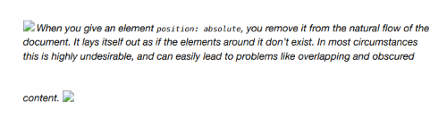
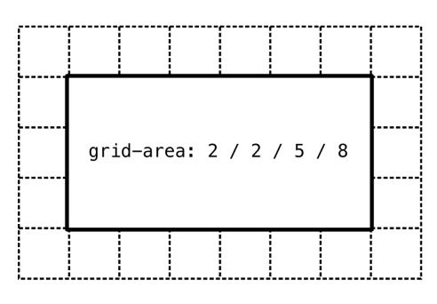
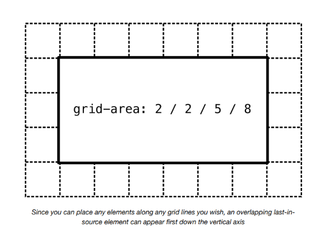
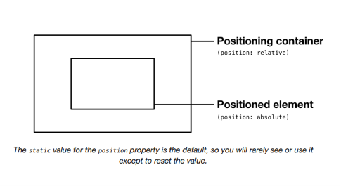
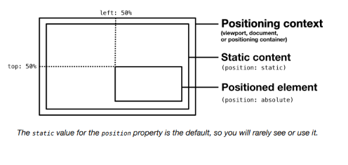
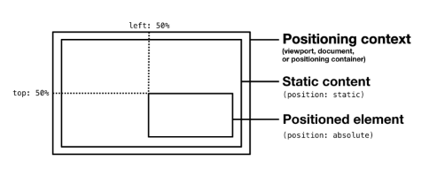
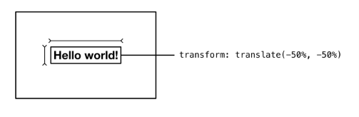
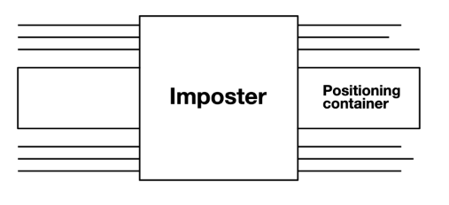
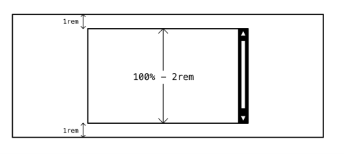
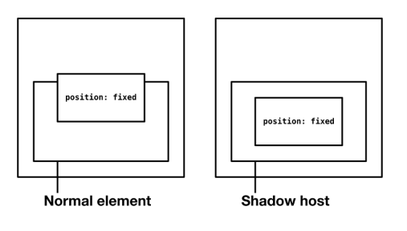

# The Imposter

## El problema

El posicionamiento en CSS, usando una o más instancias de los valores `relative`, `absolute`, `fixed` de la propiedad `position`, es como anular manualmente el layout web. Es *desactivar* el layout automático y tomar el asunto en tus propias manos. Como con pilotar un avión comercial, esta no es una responsabilidad que desearías asumir excepto en circunstancias raras y extremas.

En la documentación de *Frame*, se te advirtió sobre los peligros de evitar los algoritmos de layout estándar del navegador:



> Cuando le das a un elemento `position: absolute`, lo eliminas del flujo natural del documento. Se coloca como si los elementos a su alrededor no existieran. En la mayoría de las circunstancias, esto es altamente indeseable, y puede llevar fácilmente a problemas como superposición y contenido oscurecido.

Pero, ¿qué pasa si *querías* ocultar contenido, colocando otro contenido sobre él? Si has estado trabajando en desarrollo web por más de 23 minutos, es probable que ya hayas hecho esto, en la incorporación de un elemento de diálogo, "popup" o menú desplegable personalizado.

El propósito del elemento `Imposter` es agregar un elemento de *superposición* de propósito general a tu suite de layouts. Permitirá al autor posicionar centralmente un elemento sobre el viewport, el documento, o un elemento "contenedor de posicionamiento" seleccionado.

## La solución

Hay muchas formas de posicionar elementos centralmente verticalmente, y muchas más para posicionarlos horizontalmente (algunas alternativas se mencionaron como parte del layout `Center`). Sin embargo, solo hay algunas formas de posicionar elementos centralmente *sobre* otros elementos/contenido.

El enfoque contemporáneo es *usar CSS Grid* ↗. Una vez que tu grilla está establecida, puedes organizar el contenido por número de línea de grilla. El concepto de *flujo* se vuelve irrelevante, y la superposición es eminentemente alcanzable donde sea deseada.



## Orden de fuente y capas

Ya sea que estés posicionando contenido según las líneas de Grid o haciéndolo con la propiedad `position`, qué elementos aparecen *sobre* cuáles es, por defecto, una cuestión de orden de fuente. Esto es: si dos elementos comparten el mismo espacio, el que aparece *después* del otro será el que venga último en la fuente.



> *Dado que puedes colocar cualquier elemento a lo largo de cualquier línea de grilla que desees, un elemento superpuesto último en la fuente puede aparecer primero en el eje vertical*

Esto a menudo se pasa por alto, y algunos creen que se necesita `z-index` para acompañar a `position: absolute` en todos los casos para determinar las "capas". De hecho, `z-index` solo es necesario donde quieres poner en capas elementos posicionados independientemente de su orden de fuente. Es otro tipo de anulación, y debe evitarse siempre que sea posible.

Una carrera armamentista de valores `z-index` cada vez más altos se cita a menudo como una de esas cosas irritantes pero necesarias que tienes que manejar con CSS. Raramente tengo problemas, porque raramente uso posicionamiento, y soy consciente del orden de fuente cuando lo hago.

CSS Grid no precipita una solución general, porque solo funcionaría donde tu elemento de posicionamiento está configurado con `display: grid` de antemano, y el conteo de columnas/filas es adecuado. Necesitamos algo más flexible.

## Posicionamiento

Puedes posicionar un elemento en relación a una de tres cosas ("contextos de posicionamiento" de aquí en adelante):

1. El viewport
2. El documento
3. Un elemento ancestro

Para posicionar un elemento en relación al viewport, usarías `position: fixed`. Para posicionarlo en relación al documento, usas `position: absolute`.

Posicionarlo en relación a un elemento ancestro es posible cuando ese elemento (el "contenedor de posicionamiento" de aquí en adelante) también está explícitamente posicionado. La forma más fácil de hacerlo es darle al ancestro `position: relative`. Esto establece el contexto de posicionamiento localizado *sin* mover la posición del elemento ancestro, o sacarlo del flujo del documento.



> *El valor `static` para la propiedad `position` es el predeterminado, por lo que raramente lo verás o usarás excepto para restablecer el valor.*

## Centrado

¿Cómo posicionamos el elemento `Imposter` en el *centro* del documento, viewport o contenedor de posicionamiento? Para elementos posicionados, técnicas como `margin: auto` o `place-items: center` no funcionan. En la *anulación manual*, tenemos que usar una combinación de las propiedades `top`, `left`, `bottom` y/o `right`. Importantemente, los valores para cada una de estas propiedades se relacionan con el contexto de posicionamiento — no con el elemento padre inmediato.



Hasta ahora, mal: queremos que el elemento en sí mismo esté centrado, no su esquina superior. Donde conocemos el *ancho* del elemento, podemos compensar usando márgenes negativos. Por ejemplo, `margin-left: -20rem` y `margin-top: -10rem` volverán a centrar un elemento que es `40rem` de ancho y `20rem` de alto (el valor negativo es siempre la mitad de la dimensión).



Evitamos codificar dimensiones porque, como el posicionamiento, prescinde de los algoritmos del navegador para organizar elementos según el espacio disponible. Cada vez que codificas un ancho fijo en un elemento, las posibilidades de que ese elemento o sus contenidos se vuelvan oscurecidos en el dispositivo de alguien en algún lugar son casi inevitables.

No solo eso, sino que podríamos no conocer el ancho o la altura del elemento de antemano. Por lo tanto, no sabríamos qué valores de margen negativo usar para complementarlo.

En lugar de diseñar *para* layout, diseñamos *para* layout, permitiendo que el navegador tenga la última palabra. En este caso, es cuestión de usar transformaciones. La propiedad `transform` organiza los elementos según sus *propias* dimensiones, sean las que sean en el momento dado. En resumen: `transform: translate(-50%, -50%)` traducirá la posición del elemento en -50% de su ancho y altura respectivamente. No necesitamos conocer las dimensiones del elemento de antemano, porque el navegador puede calcularlas y actuar sobre ellas por nosotros.

Centrar el elemento sobre su contenedor de posicionamiento, sin importar sus dimensiones, es por lo tanto bastante simple:

```css linenums="1"
.imposter {
  /* ↓ Posicionar la esquina superior izquierda en el centro */
  position: absolute;
  top: 50%;
  left: 50%;
  /* ↓ Reposicionar para que el centro del elemento
  sea el centro del contenedor de posicionamiento */
  transform: translate(-50%, -50%);
}
```

Debe notarse en este punto que un elemento a nivel de bloque configurado con `position: absolute` ya no ocupa el espacio disponible a lo largo de la dirección de escritura del elemento (generalmente horizontal; izquierda a derecha). En su lugar, el elemento "envuelve" su contenido como si fuera inline.



Por defecto, el ancho del elemento será el 50%, o menos si su contenido ocupa menos del 50% del contenedor de posicionamiento. Si agregas un `width` o `height` explícito, se respetará y el elemento continuará centrado dentro del contenedor de posicionamiento — el algoritmo de traducción interna se encarga de eso.

## Desbordamiento

¿Qué sucede si el elemento `Imposter` se vuelve más ancho o más alto que su contenedor de posicionamiento? Con un diseño cuidadoso y una curación de contenido, deberías poder crear las tolerancias generosas que eviten que esto suceda en la mayoría de las circunstancias. Pero aún puede suceder.

Por defecto, el efecto verá al `Imposter` *asomando* por los bordes del contenedor de posicionamiento — y puede estar en peligro de oscurecer el contenido alrededor de ese contenedor.



Dado que `max-width` y `max-height` anulan `width` y `height` respectivamente, podemos permitir a los autores establecer dimensiones — o dimensiones mínimas — pero aún así asegurar que el elemento esté contenido. Todo lo que queda es agregar `overflow: auto` para asegurar que los contenidos del elemento restringido puedan desplazarse para verse.

```css linenums="1"
.imposter {
  position: absolute;
  top: 50%;
  left: 50%;
  transform: translate(-50%, -50%);
  max-width: 100%;
  max-height: 100%;
}
```

## Margen

En algunos casos, será deseable tener un espacio mínimo (gap; space; margin; como quieras llamarlo) entre el elemento `Imposter` y los bordes interiores de su contenedor de posicionamiento. Por dos razones, no podemos lograr esto agregando padding al contenedor de posicionamiento:

1. Insertaría cualquier contenido estático del contenedor, que probablemente no sea un efecto visual deseable
2. El posicionamiento absoluto no respeta el padding: nuestro elemento `Imposter` lo ignoraría y se superpondría

La respuesta, en su lugar, es ajustar los valores de `max-width` y `max-height`. La función `calc()` es especialmente útil para hacer este tipo de ajustes.

```css linenums="1"
.imposter {
  position: absolute;
  top: 50%;
  left: 50%;
  transform: translate(-50%, -50%);
  max-width: calc(100% - 2rem);
  max-height: calc(100% - 2rem);
}
```

El ejemplo anterior crearía un espacio mínimo de `1rem` en todos los lados: el valor `2rem` se elimina como `1rem` para cada extremo.



## Posicionamiento fijo

Cuando desees que el `Imposter` esté fijo en relación al *viewport*, en lugar del documento o un elemento (léase: contenedor de posicionamiento) dentro del documento, debes reemplazar `position: absolute` con `position: fixed`. Esto es a menudo deseable para diálogos, que deberían seguir al usuario mientras desplaza el documento y permanecer a la vista hasta que se atiendan.

En el siguiente ejemplo, el elemento tiene una propiedad personalizada `--positioning` con un valor predeterminado de `absolute`.

```css linenums="1"
.imposter {
  position: var(--positioning, absolute);
  top: 50%;
  left: 50%;
  transform: translate(-50%, -50%);
  max-width: calc(100% - 2rem);
  max-height: calc(100% - 2rem);
}
```

Como se describe en el artículo *Every Layout Dynamic CSS Components Without JavaScript* ↗, puedes anular este valor predeterminado en línea, dentro de un atributo `style` para casos especiales:

```html linenums="1"
<div class="imposter" style="--positioning: fixed">
  <!-- contenido del imposter -->
</div>
```

En la implementación del componente personalizado a seguir (bajo *El componente*), un mecanismo equivalente toma la forma de una prop booleana. Agregar el atributo `fixed` anula el posicionamiento `absolute` que es predeterminado.

## ⚠ Posicionamiento fijo y Shadow DOM

En la mayoría de los casos, usar un valor `fixed` para `position` posicionará el elemento en relación al viewport. Esto es, cualquier candidato a contenedor de posicionamiento (elementos ancestros posicionados) serán ignorados.

Sin embargo, un host `shadowRoot` ↗ será tratado como el elemento exterior de un documento anidado. Por lo tanto, cualquier elemento con `position: fixed` encontrado dentro de Shadow DOM se posicionará en su lugar en relación al host (el elemento que alberga el Shadow DOM). En efecto, se convierte en un contenedor de posicionamiento como en ejemplos anteriores.



## Casos de uso

Donde sea que el contenido necesite ser deliberadamente oscurecido, el patrón `Imposter` es tu amigo. Puede ser que el contenido aún no esté disponible. En cuyo caso, el `Imposter` puede consistir en una llamada a la acción para desbloquear ese contenido.

*Esta demostración interactiva solo está disponible en el sitio de Every Layout* ↗.

Puede ser que los artefactos oscurecidos por el `Imposter` sean más decorativos y no necesiten ser revelados en su totalidad.

Al crear un diálogo usando un `Imposter`, ten cuidado con las consideraciones de accesibilidad que deben incluirse — especialmente las relacionadas con la gestión del foco del teclado. *Inclusive Components* ↗ tiene un capítulo sobre diálogos que describe estas consideraciones en detalle.

## El generador

Usa esta herramienta para generar CSS y HTML básicos de Imposter.

La herramienta generadora de código solo está disponible en el *sitio de documentación adjunto* ↗. Aquí está la solución básica, con comentarios. La versión `.contain` contiene el elemento dentro de su contenedor de posicionamiento y maneja el desbordamiento.

**CSS**

```css linenums="1"
.imposter {
  /* ↓ Elegir el elemento de posicionamiento */
  position: var(--positioning, absolute);
  /* ↓ Posicionar la esquina superior izquierda en el centro */
  top: 50%;
  left: 50%;
  /* ↓ Reposicionar para que el centro del elemento
  sea el centro del contenedor */
  transform: translate(-50%, -50%);
}
.imposter.contain {
  /* ↓ Incluir una unidad, o la función calc será inválida */
  --margin: 0px;
  /* ↓ Proporcionar barras de desplazamiento para que el contenido no se oculte */
  overflow: auto;
  /* ↓ Restringir la altura y el ancho, incluyendo el espaciado/margen
  opcional entre el elemento y el contenedor de posicionamiento */
  max-width: calc(100% - (var(--margin) * 2));
  max-height: calc(100% - (var(--margin) * 2));
}
```

**HTML**

Debe proporcionarse un ancestro con un valor de posicionamiento `relative` o `absolute`. Este se convierte en el "contenedor de posicionamiento" sobre el cual se posiciona el elemento. En el siguiente ejemplo, se usa un simple `<div>` con el `style` inline.

```html linenums="1"
<div style="position: relative">
  <p>Contenido estático</p>
  <div class="imposter">
    <p>Contenido superpuesto</p>
  </div>
</div>
```

## El componente

Una implementación de elemento personalizado del `Imposter` está disponible para descargar ↗.

**API de Props**

Las siguientes props (atributos) harán que el componente se renderice nuevamente cuando se alteren. Pueden ser alterados a mano — en las herramientas de desarrollo del navegador — o como sujetos del estado de la aplicación heredada.

| Nombre | Tipo | Default | Descripción |
|---|---|---|---|
| `breakout` | boolean | `false` | Si se permite que el elemento salga del contenedor sobre el cual está posicionado |
| `margin` | string | `0` | El espacio mínimo entre el elemento y los bordes interiores del contenedor de posicionamiento sobre el cual está colocado (cuando breakout no está aplicado) |
| `fixed` | boolean | `false` | Si posicionar el elemento en relación al viewport |

## Ejemplos

### Ejemplo de demostración

El código para la demo en la sección *Casos de uso*. Nota el uso de `aria-hidden="true"` en el contenido hermano superpuesto. Es probable que el contenido superpuesto no esté disponible para los lectores de pantalla, ya que no está disponible (o al menos mayormente oscurecido) visualmente.

```html linenums="1"
<div style="position: relative">
  <text-l words="150" aria-hidden="true"></text-l>
  <imposter-l>
    <box-l style="background-color: var(--color-light)">
      <p class="h4"><strong>No puedes ver todo el contenido, debido a esta caja.</strong></p>
    </box-l>
  </imposter-l>
</div>
```

### Diálogo

El elemento `Imposter` podría tomar el atributo ARIA `role="dialog"` para ser comunicado como un diálogo en los lectores de pantalla. O, más simplemente, podrías simplemente colocar un `<dialog>` dentro del `Imposter`. Nota que el `Imposter` toma `fixed` aquí, para cambiar de una posición `absolute` a `fixed`. Esto significa que el diálogo permanecería centrado en el viewport mientras se desplaza el documento.

```html linenums="1"
<imposter-l fixed>
  <dialog aria-labelledby="message">
    <p id="message">¡Es hora de decidir, sol!</p>
    <button type="button">Sí</button>
    <button type="button">No</button>
  </dialog>
</imposter-l>
```
