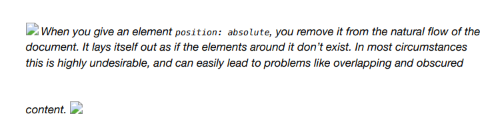
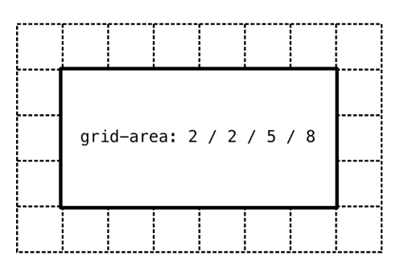
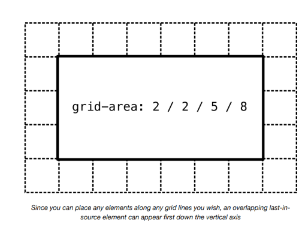
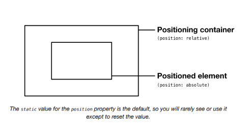
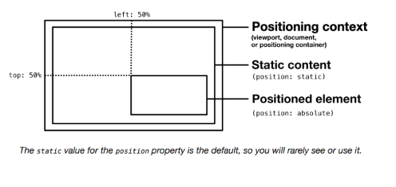
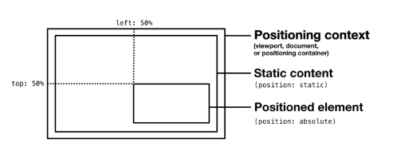
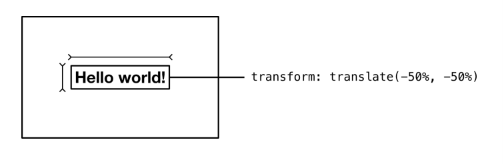
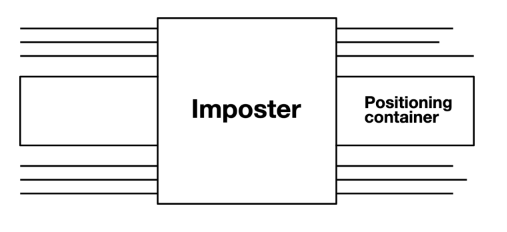
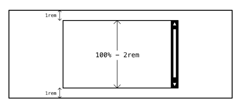
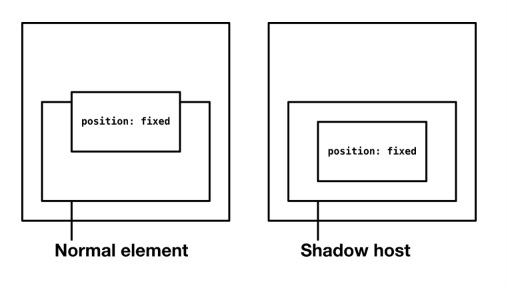

# The Imposter

## El problema

El posicionamiento en CSS, usando una o más instancias de los valores `relative`, `absolute`, `fixed` de la propiedad `position`, es como anular manualmente el layout web. Es *desactivar* el layout automático y tomar el asunto en tus propias manos. Como con pilotar un avión comercial, esta no es una responsabilidad que desearías asumir excepto en circunstancias raras y extremas.

En la documentación de *Frame*, se te advirtió sobre los peligros de evitar los algoritmos de layout estándar del navegador:



> Cuando le das a un elemento `position: absolute`, lo eliminas del flujo natural del documento. Se coloca como si los elementos a su alrededor no existieran. En la mayoría de las circunstancias, esto es altamente indeseable, y puede llevar fácilmente a problemas como superposición y contenido oscurecido.

Pero, ¿qué pasa si *querías* ocultar contenido, colocando otro contenido sobre él? Si has estado trabajando en desarrollo web por más de 23 minutos, es probable que ya hayas hecho esto, en la incorporación de un elemento de diálogo, "popup" o menú desplegable personalizado.

El propósito del elemento `Imposter` es agregar un elemento de *superposición* de propósito general a tu suite de layouts. Permitirá al autor posicionar centralmente un elemento sobre el viewport, el documento, o un elemento "contenedor de posicionamiento" seleccionado.


??? info "Explicaciom"

    Claro. Esta primitiva **Imposter** de *Every Layout* parece complicada por el tema de `position`, pero la idea central es bastante sencilla:

    > **Imposter sirve para poner temporalmente un elemento encima de otro contenido, normalmente centrado, sin que ese elemento participe en el layout normal.**

    La clave es entender **cuándo está justificado romper el flujo normal**.

    ---

    __1. Primero: ¿qué problema intenta resolver?__

    Normalmente, CSS funciona así:

    ```html
    <div>Contenido A</div>
    <div>Contenido B</div>
    <div>Contenido C</div>
    ```

    El navegador coloca los elementos siguiendo el flujo:

    ```text
    Contenido A
    Contenido B
    Contenido C
    ```

    Cada elemento ocupa su espacio y los demás saben que existe.

    Eso es lo que *Every Layout* intenta aprovechar: **dejar que los algoritmos del navegador hagan la mayor parte del trabajo**.

    Pero hay situaciones donde **precisamente quieres que algo ignore el flujo**.

    Por ejemplo:

    ```text
    ┌─────────────────────────────┐
    │                             │
    │       CONTENIDO             │
    │                             │
    │          ┌───────┐          │
    │          │ MODAL │          │
    │          └───────┘          │
    │                             │
    └─────────────────────────────┘
    ```

    El modal tiene que estar **encima** del contenido.

    No quieres esto:

    ```text
    Contenido
    Modal
    Más contenido
    ```

    Quieres esto:

    ```text
    Contenido
      ↑
    Modal encima
    ```

    Ahí entra **Imposter**.

    ---

    __2. ¿Por qué se llama "Imposter"?__

    La metáfora es bastante buena.

    Un *impostor* es algo que **se coloca en el lugar de otra cosa** o aparenta estar donde no debería.

    En CSS, el `Imposter` se mete visualmente **encima de otro contenido**, como si fuera una capa independiente.

    Por ejemplo:

    * un modal
    * un diálogo
    * un menú desplegable
    * un tooltip
    * un botón flotante
    * un indicador
    * un overlay
    * un mensaje temporal

    Todos tienen algo en común:

    > **No quieres que su existencia cambie el layout del contenido que está debajo.**

    ---

    __3. ¿Por qué `position: absolute`?__

    Supongamos que tienes:

    ```html
    <div class="contenido">
        Texto
    </div>

    <div class="modal">
        Hola
    </div>
    ```

    Normalmente:

    ```text
    ┌───────────────┐
    │ Texto         │
    ├───────────────┤
    │ Hola          │
    └───────────────┘
    ```

    Pero si haces:

    ```css
    .modal {
        position: absolute;
    }
    ```

    el modal sale del flujo normal.

    Ahora el navegador piensa aproximadamente:

    > "Este elemento ya no participa en cómo se distribuyen los demás elementos. Yo me encargo de colocarlo por separado."

    Entonces puedes conseguir:

    ```text
    ┌──────────────────────────┐
    │ Texto                    │
    │                          │
    │       ┌──────────┐       │
    │       │  Hola    │       │
    │       └──────────┘       │
    │                          │
    └──────────────────────────┘
    ```

    Eso es exactamente lo que **sí queremos** en este caso.

    Por eso el texto dice:

    > "¿Qué pasa si querías ocultar contenido colocando otro contenido sobre él?"

    Ahí está la excepción.

    ---

    __4. El problema con `absolute`__

    Aquí está la parte importante de *Every Layout*.

    No está diciendo:

    > "`position: absolute` es malo."

    Está diciendo:

    > **No uses `absolute` para resolver problemas que el layout normal puede resolver.**

    Por ejemplo, esto sería mala idea:

    ```css
    .card-title {
        position: absolute;
        top: 20px;
        left: 30px;
    }
    ```

    si simplemente querías colocar un título dentro de una tarjeta.

    Porque probablemente podrías resolverlo con:

    ```css
    .card {
        display: flex;
        flex-direction: column;
    }
    ```

    o Grid, Stack, Center, etc.

    Pero para un modal:

    ```css
    .modal {
        position: absolute;
    }
    ```

    tiene muchísimo sentido.

    Porque **el modal realmente debe estar fuera del flujo**.

    ---

    __5. ¿Qué significa "centralmente"?__

    El `Imposter` normalmente busca algo como esto:

    ```text
    ┌──────────────────────────────┐
    │                              │
    │                              │
    │          ┌────────┐          │
    │          │        │          │
    │          │Imposter│          │
    │          │        │          │
    │          └────────┘          │
    │                              │
    │                              │
    └──────────────────────────────┘
    ```

    Es decir:

    **centrar un elemento superpuesto dentro de algún contexto.**

    Y ese contexto puede ser:

    __El viewport__

    La ventana del navegador:

    ```text
    ┌──────────────────────────────┐
    │                              │
    │                              │
    │          ┌────────┐          │
    │          │ MODAL  │          │
    │          └────────┘          │
    │                              │
    └──────────────────────────────┘
    ```

    Perfecto para un modal.

    ---

    __El documento__

    También puede posicionarse respecto al documento.

    Esto puede ser útil cuando el elemento debe superponerse pero seguir perteneciendo a una determinada zona de la página.

    ---

    __Un contenedor__

    Esta es una idea muy importante.

    Imagina:

    ```html
    <div class="card">
        
        <div class="imposter">
            ...
        </div>
    </div>
    ```

    Quieres que el `Imposter` se posicione respecto a `.card`.

    Entonces `.card` se convierte en el **contenedor de posicionamiento**.

    Conceptualmente:

    ```text
    ┌──────────────────────────────┐
    │ CARD                         │
    │                              │
    │       ┌────────────┐         │
    │       │ IMPOSTER   │         │
    │       └────────────┘         │
    │                              │
    └──────────────────────────────┘
    ```

    Esto normalmente se consigue haciendo que el padre establezca el contexto de posicionamiento:

    ```css
    .card {
        position: relative;
    }
    ```

    y el hijo:

    ```css
    .imposter {
        position: absolute;
    }
    ```

    Entonces:

    ```text
    .card
      │
      └── establece el contexto
              │
              ▼
          .imposter
          se posiciona
          respecto a .card
    ```

    ---

    __6. Esto conecta directamente con lo que viste en Frame__

    Recuerda la idea de **Frame** que estabas estudiando.

    Frame intenta conseguir algo parecido a:

    ```text
    ┌────────────────────────────┐
    │                            │
    │                            │
    │         CONTENIDO          │
    │                            │
    │                            │
    └────────────────────────────┘
    ```

    pero **sin sacar elementos del flujo**.

    Por eso utiliza cosas como:

    ```css
    display: flex;
    flex-direction: column;
    ```

    y:

    ```css
    margin-block: auto;
    ```

    para distribuir el espacio.

    Eso es layout normal.

    ---

    __7. Imposter es casi lo contrario__

    Puedes verlo así:

    __Frame__

    > "Navegador, organiza los elementos por mí."

    ```text
    Layout automático
          ↓
    ┌──────────────┐
    │ elemento     │
    │ elemento     │
    │ elemento     │
    └──────────────┘
    ```

    __Imposter__

    > "Navegador, este elemento quiero colocarlo yo por encima."

    ```text
    Layout normal
          +
    elemento superpuesto
    ```

    ```text
    ┌──────────────────────┐
    │ contenido             │
    │       ┌────────┐      │
    │       │ overlay│      │
    │       └────────┘      │
    │ contenido             │
    └──────────────────────┘
    ```

    Por eso en *Every Layout* estas primitivas se complementan.

    No son recetas aisladas.

    ---

    __8. Un ejemplo real: modal__

    Supongamos:

    ```html
    <main>
        <h1>Mi página</h1>
        <p>Muchísimo contenido...</p>
    </main>

    <div class="modal">
        <h2>¿Eliminar elemento?</h2>
        <button>Cancelar</button>
        <button>Eliminar</button>
    </div>
    ```

    El contenido de `main` debe seguir existiendo debajo.

    El modal no debe empujar el contenido:

    ❌

    ```text
    Página
    Página
    Página
    Modal
    Página
    ```

    Debe aparecer **encima**:

    ✅

    ```text
    Página
    Página
      ┌───────────────┐
      │ ¿Eliminar?    │
      │               │
      │ Cancelar      │
      │ Eliminar      │
      └───────────────┘
    Página
    Página
    ```

    Ahí `Imposter` es exactamente la herramienta adecuada.

    ---

    __9. La frase más importante del texto__

    Esta:

    > "El propósito del elemento `Imposter` es agregar un elemento de superposición de propósito general a tu suite de layouts."

    Traducido a lenguaje más directo:

    > **Imposter es la primitiva que debes usar cuando necesitas romper deliberadamente el flujo para colocar una cosa encima de otra.**

    Ese es el concepto que debes llevarte.

    ---

    __10. ¿Cuándo usarlo?__

    Piensa en esta pregunta:

    > **¿Quiero que este elemento ocupe espacio dentro del layout o quiero que flote encima de él?**

    Si quieres que ocupe espacio:

    ```text
    Stack
    Cluster
    Switcher
    Sidebar
    Grid
    Frame
    Center
    ...
    ```

    Si quieres que esté **encima**:

    ```text
    Imposter
    ```

    Por ejemplo:

    | Situación                           | Primitiva    |
    | ----------------------------------- | ------------ |
    | Elementos uno debajo de otro        | Stack        |
    | Elementos agrupados horizontalmente | Cluster      |
    | Cambiar entre fila/columna          | Switcher     |
    | Imagen + contenido lateral          | Sidebar      |
    | Centrar contenido                   | Center       |
    | Distribuir contenido en una región  | Frame        |
    | **Poner algo encima de otra cosa**  | **Imposter** |

    Y ahí está la filosofía de *Every Layout*: **no memorizar trucos CSS, sino identificar qué problema de layout tienes y elegir la primitiva adecuada**.

    En tu caso, después de haber entendido `Frame`, `Sidebar`, `Switcher`, `Stack` y demás, **Imposter es una de las pocas primitivas donde realmente sí debes aceptar `position: absolute`**. No estás "haciendo trampa"; estás usando una herramienta especializada para un problema que el flujo normal no puede resolver elegantemente.

## La solución

Hay muchas formas de posicionar elementos centralmente verticalmente, y muchas más para posicionarlos horizontalmente (algunas alternativas se mencionaron como parte del layout `Center`). Sin embargo, solo hay algunas formas de posicionar elementos centralmente *sobre* otros elementos/contenido.

El enfoque contemporáneo es [*usar CSS Grid* ↗](https://mastery.games/post/overlapping-grid-items/). Una vez que tu grilla está establecida, puedes organizar el contenido por número de línea de grilla. El concepto de [*flujo* ↗](https://developer.mozilla.org/en-US/docs/Web/CSS/Guides/Display/In_flow_and_out_of_flow) se vuelve irrelevante, y la superposición es eminentemente alcanzable donde sea deseada.



??? info "Explicacion"

    Exactamente. Aquí *Every Layout* está dando un paso más interesante: **ya no está hablando simplemente de `position: absolute`**, sino de una forma moderna de conseguir superposición usando **CSS Grid**.

    La idea fundamental es esta:

    > **Grid permite que varios elementos ocupen la misma celda.**

    Y eso hace que puedan quedar **uno encima del otro sin necesidad de sacarlos del flujo mediante `position: absolute`**.

    ---

    __1. Primero: ¿qué significa "superponer"?__

    Imagina esto:

    ```text
    ┌──────────────────────────────┐
    │                              │
    │        IMAGEN                │
    │                              │
    │          ┌──────────┐        │
    │          │  TEXTO   │        │
    │          └──────────┘        │
    │                              │
    └──────────────────────────────┘
    ```

    Tenemos:

    * una imagen
    * texto encima de la imagen

    Con el layout tradicional, los elementos normalmente se colocan:

    ```text
    Imagen

    Texto
    ```

    Uno después del otro.

    Pero nosotros queremos:

    ```text
    Imagen
      ↑
    Texto encima
    ```

    Eso es **superposición**.

    ---

    __2. ¿Cómo lo hacemos con Grid?__

    La magia está en esto:

    ```css
    .imposter {
        display: grid;
    }
    ```

    Y luego hacemos que los elementos ocupen la misma área:

    ```css
    .imposter > * {
        grid-area: 1 / 1;
    }
    ```

    Ahora imagina:

    ```html
    <div class="imposter">
        
        <div class="texto">
            Hola
        </div>
    </div>
    ```

    Normalmente pensarías:

    ```text
    grid
    ├── imagen
    └── texto
    ```

    Pero ambos tienen:

    ```css
    grid-area: 1 / 1;
    ```

    por lo que Grid dice:

    > "Los dos van a la misma área."

    Resultado:

    ```text
    ┌──────────────────────┐
    │                      │
    │       IMAGEN         │
    │                      │
    │      ┌────────┐      │
    │      │  Hola  │      │
    │      └────────┘      │
    │                      │
    └──────────────────────┘
    ```

    ---

    __3. ¿Qué quiere decir el texto con "el concepto de flujo se vuelve irrelevante"?__

    Esta parte es importante.

    En un layout normal tienes algo como:

    ```text
    Elemento A
        ↓
    Elemento B
        ↓
    Elemento C
    ```

    El orden importa muchísimo.

    El navegador dice:

    > A ocupa este espacio, después pongo B, después C.

    Eso es el **flujo**.

    ---

    Con Grid puedes decir:

    ```text
    A → área 1
    B → área 1
    C → área 2
    ```

    Por ejemplo:

    ```text
    ┌──────────────────────┐
    │                      │
    │       A + B          │
    │       superpuestos   │
    │                      │
    ├──────────────────────┤
    │          C           │
    └──────────────────────┘
    ```

    A y B **no necesitan estar uno después del otro**.

    Ambos pueden estar en la misma celda.

    Por eso el texto dice:

    > "El concepto de flujo se vuelve irrelevante"

    No significa literalmente que CSS deje de tener flujo. Significa que **para decidir dónde se colocan esos elementos, ya no dependes de que uno tenga que ir después del otro**.

    Grid te permite declarar:

    > "Estos dos pertenecen a esta misma área."

    ---

    __4. ¿Qué significa "por número de línea de grilla"?__

    Aquí entra la parte que probablemente estás viendo en la imagen.

    Una grid tiene líneas:

    ```text
        línea 1       línea 2       línea 3
          ↓             ↓             ↓
          │             │             │
          │             │             │
          │             │             │
          │             │             │
    ```

    Por ejemplo:

    ```css
    .container {
        display: grid;
    }
    ```

    Creamos una grid de una columna:

    ```text
    línea 1
      │
      │
      │
    línea 2
    ```

    Entonces:

    ```css
    .elemento {
        grid-column: 1;
    }
    ```

    significa:

    > ocupa la columna que está entre las líneas 1 y 2.

    ---

    Pero puedes hacer algo mucho más interesante.

    Supongamos una grid:

    ```text
          1       2       3
          │       │       │
          │       │       │
          │       │       │
          │       │       │
    ```

    Puedes decir:

    ```css
    .imagen {
        grid-area: 1 / 1 / 3 / 3;
    }
    ```

    Y:

    ```css
    .texto {
        grid-area: 1 / 1 / 3 / 3;
    }
    ```

    Ambos ocupan **exactamente la misma área**.

    Por tanto:

    ```text
    ┌───────────────────────┐
    │                       │
    │       IMAGEN          │
    │                       │
    │        TEXTO          │
    │                       │
    └───────────────────────┘
    ```

    ---

    __5. Aquí aparece algo muy importante de Grid__

    Probablemente ya has visto Grid pensando:

    ```css
    display: grid;
    grid-template-columns: repeat(3, 1fr);
    ```

    y lo has asociado con:

    ```text
    ┌──────┬──────┬──────┐
    │      │      │      │
    ├──────┼──────┼──────┤
    │      │      │      │
    └──────┴──────┴──────┘
    ```

    Pero Grid también permite esto:

    ```text
    ┌──────────────────────┐
    │                      │
    │    elemento A        │
    │       +              │
    │    elemento B        │
    │                      │
    └──────────────────────┘
    ```

    Es decir:

    **Grid no solamente sirve para repartir elementos. También sirve para hacerlos compartir espacio.**

    Y esto es justamente lo que aprovecha `Imposter`.

    ---

    __6. ¿Y por qué es mejor que `absolute`?__

    Porque con `absolute` tienes que pensar en coordenadas:

    ```css
    .elemento {
        position: absolute;
        top: 50%;
        left: 50%;
        transform: translate(-50%, -50%);
    }
    ```

    Estás básicamente diciendo:

    > "Quiero que este elemento se coloque aquí."

    Eso es **posicionamiento manual**.

    Con Grid dices:

    ```css
    .container {
        display: grid;
    }

    .elemento {
        grid-area: 1 / 1;
    }
    ```

    Y estás diciendo:

    > "Este elemento pertenece a esta misma área que el otro."

    Es una diferencia conceptual importante.

    __`absolute`__

    ```text
    "Ponlo aquí."
            ↓
      coordenadas
    ```

    __Grid__

    ```text
    "Ponlo en esta área."
            ↓
      algoritmo de layout
    ```

    Y *Every Layout* prefiere la segunda filosofía cuando es posible.

    ---

    __7. Entonces, ¿Imposter ya no necesita `absolute`?__

    Aquí está el matiz.

    **No necesariamente.**

    El patrón `Imposter` tradicional puede implementarse con `position: absolute`, porque ese es precisamente el mecanismo clásico para crear una superposición.

    Pero el texto está diciendo:

    > **Hoy CSS Grid nos ofrece otra herramienta para conseguir el mismo tipo de composición.**

    Y para determinados casos puede ser incluso más elegante.

    Por ejemplo:

    ```css
    .imposter {
        display: grid;
    }

    .imposter > * {
        grid-area: 1 / 1;
    }
    ```

    Eso crea una especie de "escenario":

    ```text
                GRID
                  │
          ┌───────┴───────┐
          │               │
        imagen           texto
          │               │
          └───────┬───────┘
                  ↓
            misma área
                  ↓
          SUPERPOSICIÓN
    ```

    ---

    __8. Y aquí hay una conexión brutal con diseño__

    Esta técnica aparece muchísimo en interfaces modernas.

    Por ejemplo:

    __Imagen + degradado + texto__

    ```text
    ┌─────────────────────────┐
    │                         │
    │       FOTO              │
    │                         │
    │     ┌──────────────┐    │
    │     │ Título       │    │
    │     │ Descripción  │    │
    │     └──────────────┘    │
    └─────────────────────────┘
    ```

    Puedes tener:

    ```text
    Grid area 1
    ├── imagen
    ├── overlay
    └── texto
    ```

    Todos en la misma área.

    ---

    __Botón sobre imagen__

    ```text
    ┌─────────────────────────┐
    │                         │
    │         FOTO            │
    │                         │
    │        [ PLAY ]         │
    │                         │
    └─────────────────────────┘
    ```

    ---

    __Icono sobre avatar__

    ```text
          ┌──────────┐
          │          │
          │   FOTO   │
          │          │
          └──────────┘
                ●
    ```

    ---

    __Modal__

    ```text
    ┌─────────────────────────────┐
    │                             │
    │      página normal          │
    │                             │
    │       ┌────────────┐        │
    │       │   MODAL    │        │
    │       └────────────┘        │
    │                             │
    └─────────────────────────────┘
    ```

    Todos son casos de **elementos que comparten una región espacial**.

    ---

    __9. La idea que debes quedarte__

    No memorices:

    ```css
    grid-area: 1 / 1;
    ```

    como un truco mágico.

    Quédate con este modelo mental:

    ```text
    LAYOUT NORMAL

    A
    ↓
    B
    ↓
    C

    cada uno ocupa su espacio
    ```

    Mientras que:

    ```text
    GRID

    A ─────┐
          ├── misma área
    B ─────┘

          ↓

    A está encima de B
    ```

    Y por eso CSS Grid es tan potente para `Imposter`.

    **El navegador sigue haciendo el layout por ti; simplemente le estás diciendo que dos elementos pertenecen a la misma región.**

    Esa es justamente la filosofía de *Every Layout*: **no pelearte con el navegador para colocar píxeles; describe la relación espacial que quieres y deja que CSS resuelva el resto.**


## Orden de fuente y capas

Ya sea que estés posicionando contenido según las líneas de Grid o haciéndolo con la propiedad `position`, qué elementos aparecen *sobre* cuáles es, por defecto, una cuestión de orden de fuente. Esto es: si dos elementos comparten el mismo espacio, el que aparece *después* del otro será el que venga último en la fuente.



> *Dado que puedes colocar cualquier elemento a lo largo de cualquier línea de grilla que desees, un elemento superpuesto último en la fuente puede aparecer primero en el eje vertical*

Esto a menudo se pasa por alto, y algunos creen que se necesita `z-index` para acompañar a `position: absolute` en todos los casos para determinar las "capas". De hecho, `z-index` solo es necesario donde quieres poner en capas elementos posicionados independientemente de su orden de fuente. Es otro tipo de anulación, y debe evitarse siempre que sea posible.

Una carrera armamentista de valores `z-index` cada vez más altos se cita a menudo como una de esas cosas irritantes pero necesarias que tienes que manejar con CSS. Raramente tengo problemas, porque raramente uso posicionamiento, y soy consciente del orden de fuente cuando lo hago.

CSS Grid no precipita una solución general, porque solo funcionaría donde tu elemento de posicionamiento está configurado con `display: grid` de antemano, y el conteo de columnas/filas es adecuado. Necesitamos algo más flexible.

??? info "Explicacion"

    Claro. Esta parte de **Every Layout** está hablando de algo fundamental para entender cómo CSS decide **qué elemento queda encima de otro** cuando dos elementos ocupan el mismo espacio.

    La idea central es:

    > **Antes de pensar en `z-index`, CSS normalmente utiliza el orden en el que aparecen los elementos en el HTML.**

    Vamos paso a paso.

    ---

    __1. ¿Qué significa "orden de fuente"?__

    La **fuente** es básicamente el HTML que escribiste.

    Por ejemplo:

    ```html
    <div class="uno">Uno</div>
    <div class="dos">Dos</div>
    ```

    El orden de fuente es:

    ```text
    Uno
    ↓
    Dos
    ```

    `dos` aparece después de `uno`.

    Ahora imagina que ambos elementos están en la misma posición:

    ```css
    .uno {
      position: absolute;
    }

    .dos {
      position: absolute;
    }
    ```

    Si terminan ocupando exactamente el mismo espacio, **`dos` normalmente aparecerá encima de `uno`**.

    ¿Por qué?

    Porque `dos` viene **después en el HTML**.

    ```text
    HTML

    uno
    └── se pinta primero

    dos
    └── se pinta después
        ↑
        queda encima
    ```

    Es una regla de pintura bastante importante.

    ---

    __2. ¿Y qué pasa con Grid?__

    Aquí es donde el texto que estás leyendo se vuelve interesante.

    Supongamos:

    ```html
    <div class="container">
      <div class="uno">Uno</div>
      <div class="dos">Dos</div>
    </div>
    ```

    Y tenemos:

    ```css
    .container {
      display: grid;
    }

    .uno {
      grid-column: 1;
      grid-row: 1;
    }

    .dos {
      grid-column: 1;
      grid-row: 1;
    }
    ```

    Los dos elementos están en:

    ```text
    ┌───────────────┐
    │               │
    │   UNO + DOS   │
    │               │
    └───────────────┘
    ```

    Como `dos` aparece después en el HTML:

    ```html
    <div class="uno">Uno</div>
    <div class="dos">Dos</div>
    ```

    `dos` queda encima.

    No necesitaste:

    ```css
    z-index: 2;
    ```

    ---

    __3. Aquí está la parte que puede confundir__

    El texto dice:

    > "Dado que puedes colocar cualquier elemento a lo largo de cualquier línea de grilla que desees, un elemento superpuesto último en la fuente puede aparecer primero en el eje vertical."

    Esto significa que **el orden visual no necesariamente coincide con el orden del HTML**.

    Mira:

    ```html
    <div class="uno">Uno</div>
    <div class="dos">Dos</div>
    ```

    Pero:

    ```css
    .uno {
      grid-row: 2;
    }

    .dos {
      grid-row: 1;
    }
    ```

    Visualmente:

    ```text
    Fila 1 ── DOS

    Fila 2 ── UNO
    ```

    Aunque en el HTML:

    ```text
    UNO
    DOS
    ```

    Entonces:

    ```text
    ORDEN DE FUENTE
    1. UNO
    2. DOS

    ORDEN VISUAL
    1. DOS
    2. UNO
    ```

    Pero si se superponen, **DOS sigue teniendo prioridad de pintura porque viene después en la fuente**.

    Es decir, hay dos conceptos diferentes:

    __Posición__

    Dónde aparece el elemento:

    ```css
    grid-row: 1;
    grid-row: 2;
    ```

    __Capa__

    Quién aparece encima cuando se superponen.

    Por defecto:

    ```text
    elemento posterior en el HTML
            ↓
        encima
            ↓
    elemento anterior
    ```

    ---

    __4. Entonces, ¿para qué sirve `z-index`?__

    Aquí está la idea importante del texto.

    Supongamos:

    ```html
    <div class="uno">Uno</div>
    <div class="dos">Dos</div>
    ```

    Y ambos se superponen.

    Por defecto:

    ```text
    DOS
    ↑
    UNO
    ```

    Pero quieres:

    ```text
    UNO
    ↑
    DOS
    ```

    Entonces puedes utilizar:

    ```css
    .uno {
      position: absolute;
      z-index: 2;
    }

    .dos {
      position: absolute;
      z-index: 1;
    }
    ```

    Ahora:

    ```text
    UNO       ← z-index: 2
    ────────
    DOS       ← z-index: 1
    ```

    Has **anulado el comportamiento natural del orden de fuente**.

    Eso es lo que Every Layout quiere que entiendas.

    ---

    __5. El error típico__

    Muchos desarrolladores hacen esto:

    ```css
    .elemento {
      position: absolute;
      z-index: 9999;
    }
    ```

    Y luego otro:

    ```css
    .otro {
      position: absolute;
      z-index: 99999;
    }
    ```

    Y después:

    ```css
    .modal {
      z-index: 999999;
    }
    ```

    Y luego:

    ```css
    .menu {
      z-index: 9999999;
    }
    ```

    😂

    Y finalmente tenemos una guerra nuclear de `z-index`.

    Every Layout está diciendo:

    > **No uses `z-index` automáticamente cada vez que utilizas `position`.**

    Primero pregunta:

    **¿Realmente necesito cambiar el orden natural de las capas?**

    Si la respuesta es no, deja que CSS haga su trabajo.

    ---

    __6. Un ejemplo muy sencillo__

    Imagina una tarjeta:

    ```html
    <div class="card">
      

      <div class="badge">
        NUEVO
      </div>
    </div>
    ```

    Quieres que `badge` aparezca encima de la imagen.

    Podrías hacer:

    ```css
    .card {
      position: relative;
    }

    .badge {
      position: absolute;
      top: 1rem;
      left: 1rem;
    }
    ```

    Y posiblemente **no necesitas `z-index`**.

    ¿Por qué?

    Porque el HTML dice:

    ```text
    1. imagen
    2. badge
    ```

    La imagen se pinta primero.

    Después se pinta `badge`.

    Por tanto:

    ```text
    ┌──────────────────────┐
    │ ┌────────┐           │
    │ │ NUEVO  │           │
    │ └────────┘           │
    │                      │
    │       IMAGEN         │
    │                      │
    └──────────────────────┘
    ```

    El `badge` queda encima simplemente porque viene después.

    ---

    __7. ¿Cuándo sí usar `z-index`?__

    Cuando **el orden de fuente no representa el orden de capas que necesitas**.

    Por ejemplo:

    ```html
    <div class="background"></div>
    <div class="contenido"></div>
    <div class="decoracion"></div>
    ```

    Y quieres:

    ```text
    decoración
        ↓
    contenido
        ↓
    background
    ```

    Si el orden natural no te da eso, puedes intervenir con `z-index`.

    Pero no:

    ```css
    z-index: 999999;
    ```

    por reflejo.

    Mejor valores pequeños y con una lógica clara:

    ```css
    .background {
      z-index: 0;
    }

    .contenido {
      z-index: 1;
    }

    .decoracion {
      z-index: 2;
    }
    ```

    ---

    __8. ¿Por qué Every Layout menciona que Grid no es una solución general?__

    Esta parte:

    > "CSS Grid no precipita una solución general, porque solo funcionaría donde tu elemento de posicionamiento está configurado con `display: grid` de antemano..."

    Está diciendo algo más amplio.

    Una solución podría ser:

    > "Bueno, si quiero superponer cosas, uso Grid."

    Por ejemplo:

    ```css
    .container {
      display: grid;
    }

    .container > * {
      grid-area: 1 / 1;
    }
    ```

    Eso funciona muy bien para ciertos componentes.

    Por ejemplo:

    ```text
    ┌─────────────────────┐
    │                     │
    │      IMAGEN         │
    │                     │
    │       TEXTO         │
    │                     │
    └─────────────────────┘
    ```

    Pero **no puedes asumir que todos los elementos que quieras posicionar estarán dentro de un Grid apropiado**.

    Puede que tengas:

    ```html
    <body>
      <header></header>
      <main></main>
      <footer></footer>
    </body>
    ```

    o un elemento que necesita posicionarse respecto a otro contexto.

    Por eso Grid **no reemplaza completamente** a las técnicas de posicionamiento.

    ---

    __9. La idea que quiero que te quede__

    Piensa en CSS como si tuviera una pila de hojas:

    ```text
          ┌─────────────┐
          │ elemento 3  │  ← normalmente encima
          ├─────────────┤
          │ elemento 2  │
          ├─────────────┤
          │ elemento 1  │
          └─────────────┘
    ```

    Cuando los elementos se superponen, **el orden de fuente participa en decidir qué queda arriba**.

    Por defecto:

    ```html
    A
    B
    C
    ```

    se comporta aproximadamente como:

    ```text
    C  ← arriba
    B
    A  ← abajo
    ```

    Si quieres cambiar deliberadamente esa pila:

    ```css
    A {
      position: relative;
      z-index: 10;
    }
    ```

    entonces estás diciendo:

    > "No me importa que A aparezca antes en el HTML; quiero que A esté encima."

    ---

    __La filosofía de Every Layout__

    Y esto conecta muchísimo con lo que has estado aprendiendo de **Every Layout**:

    **Primero intenta conseguir el layout utilizando las reglas naturales de CSS.**

    No empieces inmediatamente con:

    ```css
    position: absolute;
    z-index: 9999;
    top: 37px;
    left: 142px;
    ```

    😂

    Primero:

    1. **Flujo normal**
    2. **Flexbox**
    3. **Grid**
    4. **Las primitivas/layouts de Every Layout**
    5. Y solamente cuando realmente necesitas sacar algo del flujo: **`position`**
    6. Y solamente cuando necesitas alterar las capas: **`z-index`**

    Esa es precisamente la mentalidad que el libro está intentando enseñarte: **menos órdenes arbitrarias, más reglas del propio navegador**.


## Posicionamiento

Puedes posicionar un elemento en relación a una de tres cosas ("contextos de posicionamiento" de aquí en adelante):

1. El viewport
2. El documento
3. Un elemento ancestro

Para posicionar un elemento en relación al viewport, usarías `position: fixed`. Para posicionarlo en relación al documento, usas `position: absolute`.

Posicionarlo en relación a un elemento ancestro es posible cuando ese elemento (el "contenedor de posicionamiento" de aquí en adelante) también está explícitamente posicionado. La forma más fácil de hacerlo es darle al ancestro `position: relative`. Esto establece el contexto de posicionamiento localizado *sin* mover la posición del elemento ancestro, o sacarlo del flujo del documento.



> *El valor `static` para la propiedad `position` es el predeterminado, por lo que raramente lo verás o usarás excepto para restablecer el valor.*

??? info "Explicacion"

    Sí. Esta parte es **fundamental**, porque aquí Every Layout está explicando **¿respecto a qué caja se calcula `top`, `left`, `right` y `bottom`?**

    La clave es esta:

    > `position` no solamente dice "quiero mover este elemento". También determina **respecto a quién se posiciona**.

    ---

    __1. Los tres contextos__

    Every Layout te da tres posibilidades:

    ```text
    1. viewport
    2. documento
    3. elemento ancestro
    ```

    Vamos una por una.

    ---

    __2. `position: fixed` → respecto al viewport__

    El **viewport** es la ventana que estás viendo del navegador.

    Por ejemplo:

    ```css
    .boton {
      position: fixed;
      bottom: 1rem;
      right: 1rem;
    }
    ```

    Esto significa:

    > "Pon este elemento a 1rem del borde inferior y derecho de la ventana."

    Visualmente:

    ```text
    ┌──────────────────────────────┐
    │                              │
    │         Página               │
    │                              │
    │                              │
    │                              │
    │                         ┌────┐
    │                         │ BOT│
    └─────────────────────────┴────┘
              ↑
          viewport
    ```

    Si haces scroll:

    ```text
    ANTES

    ┌──────────────────────────────┐
    │                              │
    │       contenido              │
    │                              │
    │                         BOT  │
    └──────────────────────────────┘


    DESPUÉS DEL SCROLL

    ┌──────────────────────────────┐
    │       otro contenido         │
    │                              │
    │                         BOT  │
    └──────────────────────────────┘
    ```

    El botón permanece pegado a la ventana.

    Por eso `fixed` se utiliza mucho para:

    * botones flotantes
    * barras que permanecen visibles
    * menús persistentes
    * botones "volver arriba"
    * elementos de navegación flotantes

    ---

    __3. `position: absolute` → respecto al documento/contexto de posicionamiento__

    Aquí hay una pequeña sutileza importante.

    El texto dice:

    > Para posicionarlo en relación al documento, usas `position: absolute`.

    Esto es correcto como descripción simplificada, **pero hay que entender una excepción importante**:

    `absolute` se posiciona respecto al **ancestro posicionado más cercano**.

    Si no existe ninguno, el contexto será el bloque contenedor inicial, que conceptualmente se relaciona con el documento.

    Por ejemplo:

    ```html
    <div class="box">
      <div class="elemento"></div>
    </div>
    ```

    Y:

    ```css
    .elemento {
      position: absolute;
      top: 0;
      left: 0;
    }
    ```

    Si `.box` no está posicionado, `.elemento` buscará un ancestro posicionado.

    Si no encuentra ninguno, termina posicionándose respecto al contexto inicial de la página.

    ---

    __4. Aquí aparece la parte importante: `relative`__

    Supongamos que tienes:

    ```html
    <div class="card">
      <span class="badge">Nuevo</span>
    </div>
    ```

    Quieres que `badge` esté en la esquina superior derecha de `.card`.

    Podrías hacer:

    ```css
    .card {
      position: relative;
    }

    .badge {
      position: absolute;
      top: 0;
      right: 0;
    }
    ```

    Ahora sucede algo muy importante.

    ```text
    ┌─────────────────────────────┐
    │                    ┌──────┐ │
    │                    │ NUEVO│ │
    │                    └──────┘ │
    │                             │
    │          CARD               │
    │                             │
    └─────────────────────────────┘
    ```

    `badge` está siendo posicionado **respecto a `.card`**.

    ---

    __5. Pero ¿por qué `relative`?__

    Aquí está una de las cosas que al principio confunden muchísimo.

    Uno podría pensar:

    > "Si pongo `position: relative` en `.card`, entonces estoy moviendo `.card`."

    **No.**

    Si haces:

    ```css
    .card {
      position: relative;
    }
    ```

    y no especificas:

    ```css
    top
    right
    bottom
    left
    ```

    el `.card` **se queda exactamente donde estaba**.

    Es decir:

    ```css
    .card {
      position: relative;
    }
    ```

    prácticamente significa:

    > "No muevas esta caja, pero conviértela en un contexto de posicionamiento para sus descendientes."

    Es una técnica extremadamente común.

    ---

    __6. Mira la diferencia__

    Sin `relative`:

    ```html
    <div class="card">
        <div class="badge"></div>
    </div>
    ```

    ```css
    .badge {
      position: absolute;
      top: 0;
      right: 0;
    }
    ```

    El navegador pregunta:

    > ¿Cuál es el ancestro posicionado de `.badge`?

    ```text
    badge
    ↓
    card
    ↓
    body
    ↓
    html
    ```

    Si ninguno está posicionado, `.badge` puede terminar tomando como referencia el contexto inicial de la página.

    Entonces podrías obtener algo como:

    ```text
    ┌───────────────────────────────┐
    │                         BADGE │ ← aquí
    │                               │
    │                               │
    │       ┌──────────────┐        │
    │       │     CARD     │        │
    │       │              │        │
    │       └──────────────┘        │
    └───────────────────────────────┘
    ```

    No es lo que querías.

    ---

    __7. Con `relative`__

    Ahora:

    ```css
    .card {
      position: relative;
    }

    .badge {
      position: absolute;
      top: 0;
      right: 0;
    }
    ```

    El navegador busca:

    ```text
    badge
    ↓
    card ← ¡encontrado!
    ```

    Por lo tanto:

    ```text
    ┌───────────────────────────────┐
    │                               │
    │       ┌──────────────┐        │
    │       │          BADGE│        │
    │       │     CARD     │        │
    │       │              │        │
    │       └──────────────┘        │
    │                               │
    └───────────────────────────────┘
    ```

    Ahora `top: 0` y `right: 0` se calculan respecto a `.card`.

    ---

    __8. Entonces `relative` tiene dos funciones diferentes__

    Esto es importantísimo.

    Cuando escribes:

    ```css
    .card {
      position: relative;
    }
    ```

    puedes estar diciendo dos cosas:

    __Función 1: desplazarlo__

    Por ejemplo:

    ```css
    .card {
      position: relative;
      top: 10px;
    }
    ```

    Aquí sí estás desplazando `.card`.

    __Función 2: crear un contexto para un hijo__

    Por ejemplo:

    ```css
    .card {
      position: relative;
    }

    .badge {
      position: absolute;
      top: 0;
      right: 0;
    }
    ```

    Aquí `.card` **no se mueve**.

    Solamente establece el contexto de posicionamiento.

    Esta segunda utilización es **muy común**.

    ---

    __9. ¿Qué significa "sacarlo del flujo"?__

    Esto también es clave para entender `absolute`.

    Supongamos:

    ```html
    <p>Texto 1</p>
    <div class="caja">Caja</div>
    <p>Texto 2</p>
    ```

    Normalmente:

    ```text
    Texto 1

    Caja

    Texto 2
    ```

    Todos participan en el **flujo normal**.

    Pero:

    ```css
    .caja {
      position: absolute;
    }
    ```

    La caja deja de participar normalmente en el flujo.

    Es como si dijera:

    > "Ya no quiero que los demás elementos tengan que hacerme espacio."

    Entonces:

    ```text
    Texto 1
    Texto 2

            ┌───────┐
            │ Caja  │
            └───────┘
    ```

    La caja puede colocarse encima de otras cosas.

    Esto es lo que significa que un elemento **sale del flujo**.

    ---

    __10. ¿Y `relative` lo saca del flujo?__

    **No.**

    Esto es precisamente lo bonito:

    ```css
    .card {
      position: relative;
    }
    ```

    El elemento:

    * sigue ocupando su espacio
    * sigue participando en el flujo
    * no cambia de posición

    pero además:

    * se convierte en contexto de posicionamiento para sus descendientes.

    Por eso Every Layout dice:

    > "`position: relative` establece el contexto de posicionamiento localizado **sin mover la posición del elemento ancestro, o sacarlo del flujo del documento**."

    ---

    __11. ¿Y `static`?__

    Finalmente el texto menciona:

    ```css
    position: static;
    ```

    Es simplemente el valor predeterminado.

    Es decir, si escribes:

    ```html
    <div class="box"></div>
    ```

    conceptualmente tienes:

    ```css
    .box {
      position: static;
    }
    ```

    aunque normalmente no lo escribas.

    `static` significa, a grandes rasgos:

    > "Quédate en el flujo normal y no seas un elemento posicionado."

    Por eso normalmente no escribes:

    ```css
    .box {
      position: static;
    }
    ```

    No tiene mucho sentido hacerlo salvo que estés **restableciendo** una regla anterior.

    ---

    __12. La imagen mental que te recomiendo__

    Quédate con esta jerarquía:

    ```text
                    POSITION
                        │
            ┌───────────┼───────────┐
            ↓           ↓           ↓
          fixed      absolute    relative
            │           │           │
            ↓           ↓           ↓
        viewport     contexto     permanece
                    posicionado   en flujo
                    más cercano
                        │
                        ↓
                    ancestro
    ```

    Y especialmente:

    __`fixed`__

    ```text
    elemento
      ↓
    viewport
    ```

    __`absolute`__

    ```text
    elemento
      ↓
    ancestro posicionado más cercano
      ↓
    si no existe → contexto inicial
    ```

    __`relative`__

    ```text
    elemento
      ↓
    permanece en su sitio
      +
    crea un contexto para sus hijos
    ```

    ---

    __Y esto conecta con lo anterior__

    La sección anterior hablaba de **capas**:

    > "¿Quién queda encima de quién?"

    Esta sección responde otra pregunta:

    > **"¿Respecto a qué elemento calculo la posición?"**

    Son dos problemas diferentes:

    ```text
    POSITIONING
    │
    ├── ¿Respecto a quién?
    │      ├── viewport → fixed
    │      └── ancestro → absolute + relative
    │
    └── ¿Quién queda encima?
          ├── orden de fuente
          └── z-index cuando realmente hace falta
    ```

    Si entiendes esta separación, `position` deja de parecer una colección de trucos mágicos y empieza a tener bastante lógica.

## Centrado

¿Cómo posicionamos el elemento `Imposter` en el *centro* del documento, viewport o contenedor de posicionamiento? Para elementos posicionados, técnicas como `margin: auto` o `place-items: center` no funcionan. En la *anulación manual*, tenemos que usar una combinación de las propiedades `top`, `left`, `bottom` y/o `right`. Importantemente, los valores para cada una de estas propiedades se relacionan con el contexto de posicionamiento — no con el elemento padre inmediato.



Hasta ahora, mal: queremos que el elemento en sí mismo esté centrado, no su esquina superior. Donde conocemos el *ancho* del elemento, podemos compensar usando márgenes negativos. Por ejemplo, `margin-left: -20rem` y `margin-top: -10rem` volverán a centrar un elemento que es `40rem` de ancho y `20rem` de alto (el valor negativo es siempre la mitad de la dimensión).



Evitamos codificar dimensiones porque, como el posicionamiento, prescinde de los algoritmos del navegador para organizar elementos según el espacio disponible. Cada vez que codificas un ancho fijo en un elemento, las posibilidades de que ese elemento o sus contenidos se vuelvan oscurecidos en el dispositivo de alguien en algún lugar son casi inevitables.

No solo eso, sino que podríamos no conocer el ancho o la altura del elemento de antemano. Por lo tanto, no sabríamos qué valores de margen negativo usar para complementarlo.

En lugar de diseñar *para* layout, diseñamos *para* layout, permitiendo que el navegador tenga la última palabra. En este caso, es cuestión de usar transformaciones. La propiedad `transform` organiza los elementos según sus *propias* dimensiones, sean las que sean en el momento dado. En resumen: `transform: translate(-50%, -50%)` traducirá la posición del elemento en -50% de su ancho y altura respectivamente. No necesitamos conocer las dimensiones del elemento de antemano, porque el navegador puede calcularlas y actuar sobre ellas por nosotros.

Centrar el elemento sobre su contenedor de posicionamiento, sin importar sus dimensiones, es por lo tanto bastante simple:

```css linenums="1"
.imposter {
  /* ↓ Posicionar la esquina superior izquierda en el centro */
  position: absolute;
  top: 50%;
  left: 50%;
  /* ↓ Reposicionar para que el centro del elemento
  sea el centro del contenedor de posicionamiento */
  transform: translate(-50%, -50%);
}
```

Debe notarse en este punto que un elemento a nivel de bloque configurado con `position: absolute` ya no ocupa el espacio disponible a lo largo de la dirección de escritura del elemento (generalmente horizontal; izquierda a derecha). En su lugar, el elemento "envuelve" su contenido como si fuera inline.



Por defecto, el ancho del elemento será el 50%, o menos si su contenido ocupa menos del 50% del contenedor de posicionamiento. Si agregas un `width` o `height` explícito, se respetará y el elemento continuará centrado dentro del contenedor de posicionamiento — el algoritmo de traducción interna se encarga de eso.

??? info "Explicacion"

    Sí. Esta sección es probablemente una de las más importantes del patrón **Imposter** de Every Layout, porque junta varias cosas que ya has visto: `position`, contexto de posicionamiento, dimensiones y `transform`.

    La idea central es:

    > **Queremos colocar el centro del elemento exactamente en el centro de su contenedor, sin conocer de antemano cuánto mide el elemento.**

    Vamos a desmontarlo.

    ---

    __1. Primero: ¿qué queremos conseguir?__

    Imagina:

    ```text
    ┌──────────────────────────────┐
    │                              │
    │                              │
    │          ┌─────────┐         │
    │          │ Imposter│         │
    │          └─────────┘         │
    │                              │
    │                              │
    └──────────────────────────────┘
    ```

    Queremos que:

    ```text
    centro del contenedor
              =
    centro del Imposter
    ```

    Y no importa si el `Imposter` mide:

    ```text
    100 × 50
    ```

    o:

    ```text
    400 × 200
    ```

    o:

    ```text
    173 × 87
    ```

    El navegador debe calcularlo.

    ---

    __2. El primer intento__

    Podemos pensar:

    ```css
    .imposter {
      position: absolute;
      top: 50%;
      left: 50%;
    }
    ```

    Esto hace algo bastante concreto.

    `top: 50%` significa:

    > Coloca **la parte superior del elemento** al 50% de la altura del contexto de posicionamiento.

    Y:

    `left: 50%` significa:

    > Coloca **el lado izquierdo del elemento** al 50% del ancho del contexto.

    Por ejemplo:

    ```text
    ┌──────────────────────────────┐
    │                              │
    │                              │
    │               ┌──────────────┐
    │               │              │
    │               │   Imposter   │
    │               │              │
    │               └──────────────┘
    │               ↑
    │               │
    │          left: 50%
    │
    └──────────────────────────────┘
    ```

    El punto central del contenedor está aquí:

    ```text
                    ↓
    ┌──────────────────────────────┐
    │                              │
    │               ●              │
    │               │┌─────────────┤
    │               ││ Imposter    │
    │               ││             │
    │               │└─────────────┤
    └───────────────┼──────────────┘
    ```

    Pero nosotros queríamos:

    ```text
                    ↓
    ┌──────────────────────────────┐
    │                              │
    │          ┌──────────┐        │
    │          │          │        │
    │          │    ●     │        │
    │          │          │        │
    │          └──────────┘        │
    │                              │
    └──────────────────────────────┘
    ```

    El problema es:

    > `top: 50%; left: 50%` posiciona **la esquina superior izquierda**, no el centro.

    ---

    __3. El viejo truco: márgenes negativos__

    Si sabemos que el elemento mide:

    ```text
    40rem × 20rem
    ```

    podríamos hacer:

    ```css
    .imposter {
      position: absolute;

      top: 50%;
      left: 50%;

      margin-left: -20rem;
      margin-top: -10rem;
    }
    ```

    ¿Por qué?

    Porque necesitamos moverlo hacia atrás la mitad de su tamaño:

    ```text
    ancho = 40rem
    mitad = 20rem
    ```

    Entonces:

    ```text
    left: 50%
          ↓
    ┌───────────────┬───────────────┐
                    ●
                    │
          ← 20rem  │  20rem →
                    │
              ┌────┴────┐
              │         │
              │ element │
              │         │
              └─────────┘
    ```

    Funciona.

    **Pero es una mala solución moderna.**

    ---

    __4. ¿Por qué es mala?__

    Porque estás diciéndole al navegador:

    > "Yo sé exactamente cuánto mide este elemento."

    Por ejemplo:

    ```css
    margin-left: -20rem;
    margin-top: -10rem;
    ```

    Pero ¿qué pasa si el texto cambia?

    Antes:

    ```text
    ┌──────────────┐
    │ Hello world  │
    └──────────────┘
    ```

    Y luego:

    ```text
    ┌─────────────────────────────┐
    │ Hello world, this is a much │
    │ longer sentence             │
    └─────────────────────────────┘
    ```

    El ancho cambió.

    Pero:

    ```css
    margin-left: -20rem;
    ```

    sigue siendo `-20rem`.

    Ya no está centrado correctamente.

    ---

    __5. Aquí aparece `transform`__

    La solución es:

    ```css
    transform: translate(-50%, -50%);
    ```

    Y aquí hay una cosa **muy importante** que debes recordar:

    > En `transform: translate()`, los porcentajes se calculan respecto al **propio elemento**.

    Esto es diferente de `top` y `left`.

    ---

    __6. Esta diferencia es clave__

    Tenemos:

    ```css
    top: 50%;
    left: 50%;
    ```

    Los porcentajes se relacionan con el **contenedor de posicionamiento**.

    Pero:

    ```css
    transform: translate(-50%, -50%);
    ```

    los porcentajes se relacionan con las **propias dimensiones del elemento**.

    Esto es justamente lo que hace que el patrón sea tan elegante.

    ---

    __7. Vamos a verlo con números__

    Supongamos que el contenedor mide:

    ```text
    1000px × 800px
    ```

    Y el Imposter mide:

    ```text
    300px × 200px
    ```

    Primero:

    ```css
    top: 50%;
    left: 50%;
    ```

    El navegador calcula:

    ```text
    left = 500px
    top  = 400px
    ```

    Entonces tenemos:

    ```text
    ┌──────────────────────────────────┐
    │                                  │
    │                                  │
    │                   ●              │
    │                   ┌──────────────┐
    │                   │              │
    │                   │   Imposter   │
    │                   │              │
    │                   └──────────────┘
    │                                  │
    └──────────────────────────────────┘
    ```

    El punto `●` está en el centro del contenedor, pero corresponde a la **esquina superior izquierda del Imposter**.

    ---

    __8. Ahora entra `translate`__

    El elemento mide:

    ```text
    300px × 200px
    ```

    Entonces:

    ```css
    translate(-50%, -50%)
    ```

    significa:

    ```text
    X → -50% de 300px = -150px

    Y → -50% de 200px = -100px
    ```

    Por tanto:

    ```text
    posición inicial:
    500px, 400px

    transform:
    -150px, -100px

    resultado:
    350px, 300px
    ```

    Ahora:

    ```text
    ┌──────────────────────────────────┐
    │                                  │
    │             ┌──────────────┐     │
    │             │              │     │
    │             │      ●       │     │
    │             │              │     │
    │             └──────────────┘     │
    │                                  │
    └──────────────────────────────────┘
    ```

    ¡El centro del Imposter coincide con el centro del contenedor!

    ---

    __9. Lo hermoso es que no necesitas conocer sus dimensiones__

    Aquí está la filosofía de Every Layout.

    No hacemos:

    ```css
    width: 300px;
    margin-left: -150px;
    ```

    Hacemos:

    ```css
    transform: translate(-50%, -50%);
    ```

    El navegador pregunta:

    > "¿Cuánto mide este elemento?"

    Si mide:

    ```text
    300px
    ```

    calcula:

    ```text
    -150px
    ```

    Si mide:

    ```text
    500px
    ```

    calcula:

    ```text
    -250px
    ```

    Si mide:

    ```text
    137px
    ```

    calcula:

    ```text
    -68.5px
    ```

    Tú no tienes que hacer absolutamente nada.

    ---

    __10. Por eso el código completo es tan pequeño__

    ```css
    .imposter {
      position: absolute;

      top: 50%;
      left: 50%;

      transform: translate(-50%, -50%);
    }
    ```

    Mentalmente debes leerlo así:

    ```text
    position: absolute
            ↓
    "Quiero posicionarme respecto a mi
    contexto de posicionamiento"

    top: 50%
            ↓
    "Pon mi esquina superior al centro vertical"

    left: 50%
            ↓
    "Pon mi esquina izquierda al centro horizontal"

    translate(-50%, -50%)
            ↓
    "Ahora muéveme hacia atrás la mitad
    de MI propio tamaño"
    ```

    Resultado:

    ```text
              centro del contenedor
                        ↓
    ┌───────────────────┼───────────────────┐
    │                   │                   │
    │             ┌─────┼─────┐             │
    │             │     │     │             │
    │             │     ●     │             │
    │             │           │             │
    │             └───────────┘             │
    │                                       │
    └───────────────────────────────────────┘
    ```

    ---

    __11. ¿Qué significa "contenedor de posicionamiento"?__

    Aquí conecta directamente con lo que acabamos de estudiar.

    Por ejemplo:

    ```html
    <div class="container">
      <div class="imposter">
        Hola
      </div>
    </div>
    ```

    Y:

    ```css
    .container {
      position: relative;
    }

    .imposter {
      position: absolute;
      top: 50%;
      left: 50%;
      transform: translate(-50%, -50%);
    }
    ```

    Tenemos:

    ```text
    container
      │
      │ position: relative
      ↓
    contexto de posicionamiento
      │
      ↓
    imposter
      │
      ├── position: absolute
      ├── top: 50%
      ├── left: 50%
      └── translate(-50%, -50%)
    ```

    Por eso el Imposter se centra **dentro de `.container`**.

    ---

    __12. Una parte que puede parecer rara: `absolute` cambia el ancho__

    El texto dice:

    > "Un elemento a nivel de bloque configurado con `position: absolute` ya no ocupa el espacio disponible..."

    Esto es importante.

    Normalmente tienes:

    ```html
    <div>
      Hello world
    </div>
    ```

    Un `div` de bloque normalmente intenta ocupar todo el ancho disponible:

    ```text
    ┌──────────────────────────────────┐
    │ Hello world                      │
    └──────────────────────────────────┘
    ```

    Pero cuando haces:

    ```css
    div {
      position: absolute;
    }
    ```

    el comportamiento cambia.

    Ya no necesariamente tienes:

    ```text
    ┌──────────────────────────────────┐
    │ Hello world                      │
    └──────────────────────────────────┘
    ```

    Ahora puede comportarse más como una caja que **se ajusta a su contenido**:

    ```text
    ┌─────────────┐
    │ Hello world │
    └─────────────┘
    ```

    Every Layout lo describe como:

    > "envuelve su contenido como si fuera inline."

    ---

    __13. ¿Por qué dice que por defecto puede ocupar el 50%?__

    Esto tiene que ver con las reglas de sizing de los elementos posicionados.

    En el patrón de Imposter, si no estableces un `width`, el elemento puede terminar tomando un ancho limitado por el espacio disponible, especialmente cuando se encuentra con los límites impuestos por `left`/`right` o el contexto.

    Pero lo verdaderamente importante para ti aquí no es memorizar ese **50%** como una regla universal.

    Lo importante es entender:

    > **Un elemento `absolute` no se comporta como un `div` normal que simplemente ocupa todo el ancho disponible.**

    Su tamaño se determina mediante el algoritmo de posicionamiento y por su contenido/restricciones.

    ---

    __14. Y puedes poner un `width`__

    Por ejemplo:

    ```css
    .imposter {
      position: absolute;

      top: 50%;
      left: 50%;

      width: 30rem;

      transform: translate(-50%, -50%);
    }
    ```

    Seguirá centrado.

    ```text
    ┌──────────────────────────────┐
    │                              │
    │       ┌──────────────┐       │
    │       │              │       │
    │       │   Imposter   │       │
    │       │              │       │
    │       └──────────────┘       │
    │                              │
    └──────────────────────────────┘
    ```

    Porque el `translate(-50%)` se recalcula basándose en ese nuevo ancho.

    ---

    __15. La diferencia que debes grabarte__

    Esta es probablemente **la frase más importante de toda la sección**:

    __`top` y `left`__

    ```css
    top: 50%;
    left: 50%;
    ```

    miran hacia:

    > **el contexto de posicionamiento**

    Mientras que:

    __`transform`__

    ```css
    transform: translate(-50%, -50%);
    ```

    mira hacia:

    > **el propio elemento**

    Por eso funcionan juntos.

    ```text
                CONTENEDOR
    ┌────────────────────────────────┐
    │                                │
    │           50% ← left           │
    │             ↓                  │
    │             ●                  │
    │             │                  │
    │        ┌────┴─────┐            │
    │        │ Imposter │            │
    │        └──────────┘            │
    │             ↑                  │
    │        translate -50%          │
    └────────────────────────────────┘
    ```

    ---

    __Y aquí está la filosofía de fondo__

    Esto conecta perfectamente con lo que Every Layout te viene enseñando desde el principio.

    La solución antigua sería:

    > "Yo sé cuánto mide mi elemento, así que voy a calcular manualmente dónde ponerlo."

    La solución que propone Every Layout es:

    > **"Yo no necesito saber cuánto mide. Le doy al navegador las reglas y dejo que él calcule."**

    Por eso:

    ```css
    /* ❌ Depende de conocer dimensiones */
    margin-left: -150px;
    margin-top: -100px;
    ```

    frente a:

    ```css
    /* ✅ Depende de las dimensiones reales del elemento */
    transform: translate(-50%, -50%);
    ```

    Y esto es muy coherente con todo lo que aprendiste en **Every Layout**: **no diseñar contra un tamaño concreto, sino describir las reglas y dejar que el navegador resuelva el layout**.

    Ese cambio de mentalidad es, en mi opinión, mucho más importante que memorizar el `translate(-50%, -50%)`.


## Desbordamiento

¿Qué sucede si el elemento `Imposter` se vuelve más ancho o más alto que su contenedor de posicionamiento? Con un diseño cuidadoso y una curación de contenido, deberías poder crear las tolerancias generosas que eviten que esto suceda en la mayoría de las circunstancias. Pero aún puede suceder.

Por defecto, el efecto verá al `Imposter` *asomando* por los bordes del contenedor de posicionamiento — y puede estar en peligro de oscurecer el contenido alrededor de ese contenedor.



Dado que `max-width` y `max-height` anulan `width` y `height` respectivamente, podemos permitir a los autores establecer dimensiones — o dimensiones mínimas — pero aún así asegurar que el elemento esté contenido. Todo lo que queda es agregar `overflow: auto` para asegurar que los contenidos del elemento restringido puedan desplazarse para verse.

```css linenums="1"
.imposter {
  position: absolute;
  top: 50%;
  left: 50%;
  transform: translate(-50%, -50%);
  max-width: 100%;
  max-height: 100%;
}
```

??? info "Explicacion"

    Exactamente. Esta sección está resolviendo **el problema que aparece después de haber conseguido centrar correctamente el `Imposter`**.

    Hasta ahora tenemos:

    ```css
    .imposter {
      position: absolute;
      top: 50%;
      left: 50%;
      transform: translate(-50%, -50%);
    }
    ```

    Eso lo centra perfectamente... **pero hay una trampa**:

    > ¿Qué pasa si el `Imposter` es más grande que el contenedor?

    ---

    __1. El problema__

    Imagina que tenemos:

    ```text
    contenedor
    ┌──────────────────────────┐
    │                          │
    │       ┌────────────┐     │
    │       │  Imposter  │     │
    │       │            │     │
    │       │            │     │
    │       └────────────┘     │
    │                          │
    └──────────────────────────┘
    ```

    Todo perfecto.

    Pero ahora el Imposter crece:

    ```text
    ┌──────────────────────────┐
    │     ┌────────────────────┼───────┐
    │     │                    │       │
    │     │     IMPOSTER       │       │
    │     │                    │       │
    └─────┼────────────────────┘       │
          │                            │
          └────────────────────────────┘
    ```

    Como usamos:

    ```css
    top: 50%;
    left: 50%;
    transform: translate(-50%, -50%);
    ```

    el elemento sigue intentando estar **centrado**.

    El problema es que ya no cabe.

    ---

    __2. ¿Por qué puede pasar?__

    Porque el tamaño del Imposter puede depender de su contenido.

    Por ejemplo:

    ```html
    <div class="imposter">
      <p>
        Un texto extremadamente largo...
      </p>
    </div>
    ```

    O una imagen:

    ```html
    <div class="imposter">
      
    </div>
    ```

    O simplemente porque alguien le pone:

    ```css
    .imposter {
      width: 80rem;
    }
    ```

    mientras el contenedor solamente mide:

    ```text
    40rem
    ```

    Entonces tenemos:

    ```text
    contenedor = 40rem

    imposter = 80rem
    ```

    No hay magia CSS que haga que 80 quepan dentro de 40. 😄

    ---

    __3. El problema de dejarlo así__

    Supongamos:

    ```text
    ┌────────────────────────────┐
    │                            │
    │  ┌──────────────────────┐  │
    │  │                      │  │
    └──┼────── IMPOSTER ──────┼──┘
      │                      │
      └──────────────────────┘
    ```

    El Imposter **se sale del contenedor**.

    Y eso puede provocar que:

    * tape otros elementos
    * genere problemas visuales
    * invada contenido cercano
    * produzca overflow de la página
    * en móviles sea especialmente problemático

    Y recuerda que Every Layout está obsesionado —con razón— con que los layouts sean resistentes a diferentes tamaños.

    ---

    __4. Aquí entra `max-width`__

    La solución que propone es:

    ```css
    max-width: 100%;
    ```

    Esto significa:

    > **El ancho máximo del Imposter no puede superar el ancho disponible de su contenedor de posicionamiento.**

    Por ejemplo:

    ```text
    contenedor = 500px
    ```

    Si alguien intenta:

    ```css
    .imposter {
      width: 800px;
    }
    ```

    tenemos:

    ```text
    width: 800px
    max-width: 100%;
    ```

    El navegador dice:

    > "Has pedido 800px, pero mi máximo es 500px."

    Entonces termina en:

    ```text
    width final = 500px
    ```

    ---

    __5. `max-width` puede vencer a `width`__

    Esto es justamente lo que significa esta frase:

    > "`max-width` y `max-height` anulan `width` y `height` respectivamente"

    Por ejemplo:

    ```css
    .imposter {
      width: 800px;
      max-width: 100%;
    }
    ```

    Si el contenedor mide:

    ```text
    500px
    ```

    el resultado será aproximadamente:

    ```text
    width: 500px;
    ```

    No:

    ```text
    800px;
    ```

    El `max-width` establece el techo.

    ---

    __6. Lo mismo ocurre verticalmente__

    Tenemos:

    ```css
    max-height: 100%;
    ```

    Supongamos:

    ```text
    contenedor = 400px de alto
    imposter = 700px de alto
    ```

    Con:

    ```css
    max-height: 100%;
    ```

    el navegador limita el Imposter:

    ```text
    máximo = 400px
    ```

    Entonces:

    ```text
    ┌──────────────────────┐
    │                      │
    │      Imposter        │
    │                      │
    │                      │
    │                      │
    └──────────────────────┘
    ```

    No puede crecer más allá de los límites disponibles.

    ---

    __7. Entonces el código queda así__

    ```css
    .imposter {
      position: absolute;

      top: 50%;
      left: 50%;

      transform: translate(-50%, -50%);

      max-width: 100%;
      max-height: 100%;
    }
    ```

    Ahora tienes dos grupos de reglas:

    ### Posicionamiento

    ```css
    top: 50%;
    left: 50%;
    transform: translate(-50%, -50%);
    ```

    Esto responde:

    > **¿Dónde lo pongo?**

    → En el centro.

    __Restricción__

    ```css
    max-width: 100%;
    max-height: 100%;
    ```

    Esto responde:

    > **¿Cuánto puede crecer?**

    → Como máximo, hasta el tamaño del contenedor.

    ---

    __8. Pero todavía hay un problema__

    Imagina que tienes un texto enorme:

    ```text
    ┌──────────────────────┐
    │                      │
    │  Este es un texto    │
    │  realmente largo     │
    │  que necesita mucho  │
    │  espacio vertical    │
    │                      │
    └──────────────────────┘
    ```

    `max-height: 100%` puede limitar la caja.

    Pero...

    **¿Qué hacemos con el contenido que ya no cabe dentro de la caja?**

    Ahí entra:

    ```css
    overflow: auto;
    ```

    ---

    __9. ¿Qué hace `overflow: auto`?__

    Le dice al navegador:

    > "Si el contenido no cabe, permite desplazamiento cuando sea necesario."

    Por ejemplo:

    ```css
    .imposter {
      overflow: auto;
    }
    ```

    Entonces:

    ```text
    ┌──────────────────────┐
    │ Contenido             │
    │ Contenido             │
    │ Contenido             │
    │ Contenido          ↕  │
    │ Contenido             │
    └──────────────────────┘
    ```

    Aparece un mecanismo de scroll **solo cuando hace falta**.

    ---

    __10. Por eso el patrón completo suele terminar así__

    ```css
    .imposter {
      position: absolute;

      top: 50%;
      left: 50%;

      transform: translate(-50%, -50%);

      max-width: 100%;
      max-height: 100%;

      overflow: auto;
    }
    ```

    Ahora tenemos un componente bastante robusto.

    __Primero:__

    ```css
    position: absolute;
    ```

    Lo sacamos del flujo y lo posicionamos respecto al contexto correspondiente.

    __Segundo:__

    ```css
    top: 50%;
    left: 50%;
    ```

    Ponemos su esquina superior izquierda en el centro.

    __Tercero:__

    ```css
    transform: translate(-50%, -50%);
    ```

    Movemos el elemento la mitad de **su propio tamaño**.

    Resultado:

    ```text
          centro
            ↓
    ┌────────────────────────┐
    │                        │
    │     ┌────────────┐     │
    │     │            │     │
    │     │  IMPOSTER  │     │
    │     │            │     │
    │     └────────────┘     │
    │                        │
    └────────────────────────┘
    ```

    __Cuarto:__

    ```css
    max-width: 100%;
    max-height: 100%;
    ```

    Le decimos:

    > "No te hagas más grande que tu contexto."

    __Quinto:__

    ```css
    overflow: auto;
    ```

    Le decimos:

    > "Si tu contenido no cabe, permite recorrerlo."

    ---

    __11. Hay una idea de diseño importante aquí__

    Fíjate en que Every Layout **no está diciendo simplemente "haz el elemento pequeño"**.

    Está diciendo:

    > Dale libertad al contenido, pero establece **límites razonables**.

    Es diferente.

    No hacemos:

    ```css
    width: 300px;
    height: 200px;
    ```

    porque eso sería:

    > "Yo sé cuánto debe medir."

    Hacemos:

    ```css
    max-width: 100%;
    max-height: 100%;
    ```

    que significa:

    > "Puede crecer todo lo que necesite, **siempre que no supere el espacio disponible**."

    Eso es muchísimo más resistente.

    ---

    __12. Y esto conecta con todo lo anterior de Every Layout__

    Si juntas las tres secciones que acabamos de estudiar:

    __Posicionamiento__

    ```css
    position: absolute;
    ```

    Determina **respecto a quién** se posiciona.

    __Centrado__

    ```css
    top: 50%;
    left: 50%;
    transform: translate(-50%, -50%);
    ```

    Determina **dónde** se coloca.

    __Desbordamiento__

    ```css
    max-width: 100%;
    max-height: 100%;
    overflow: auto;
    ```

    Determina **hasta dónde puede crecer y qué hacer si su contenido no cabe**.

    En conjunto:

    ```text
                    IMPOSTER
                        │
          ┌────────────┼────────────┐
          ↓            ↓            ↓
      POSICIONAR      CENTRAR      LIMITAR
          │            │            │
      absolute       50%/50%      max-width
                                    max-height
                                      │
                                      ↓
                                    overflow
    ```

    Y esa es la filosofía de Every Layout en estado puro:

    > **No le digas al navegador exactamente cuánto debe medir cada cosa. Dale reglas, límites y relaciones; deja que el navegador resuelva el espacio disponible.**

## Margen

En algunos casos, será deseable tener un espacio mínimo (gap; space; margin; como quieras llamarlo) entre el elemento `Imposter` y los bordes interiores de su contenedor de posicionamiento. Por dos razones, no podemos lograr esto agregando padding al contenedor de posicionamiento:

1. Insertaría cualquier contenido estático del contenedor, que probablemente no sea un efecto visual deseable
2. El posicionamiento absoluto no respeta el padding: nuestro elemento `Imposter` lo ignoraría y se superpondría

La respuesta, en su lugar, es ajustar los valores de `max-width` y `max-height`. La función `calc()` es especialmente útil para hacer este tipo de ajustes.

```css linenums="1"
.imposter {
  position: absolute;
  top: 50%;
  left: 50%;
  transform: translate(-50%, -50%);
  max-width: calc(100% - 2rem);
  max-height: calc(100% - 2rem);
}
```

El ejemplo anterior crearía un espacio mínimo de `1rem` en todos los lados: el valor `2rem` se elimina como `1rem` para cada extremo.



??? info "Explicacion"

    Aquí Every Layout está resolviendo **el último problema del `Imposter`**: ya conseguimos centrarlo y evitar que se salga, pero ahora queremos que **nunca quede pegado al borde**.

    La idea es muy sencilla:

    > **No queremos que el Imposter pueda ocupar el 100% del contenedor; queremos dejarle un pequeño margen de seguridad.**

    ---

    __1. Primero, el problema__

    Tenemos nuestro patrón:

    ```css
    .imposter {
      position: absolute;

      top: 50%;
      left: 50%;

      transform: translate(-50%, -50%);

      max-width: 100%;
      max-height: 100%;
    }
    ```

    Esto significa:

    > "Puedes crecer hasta ocupar todo el ancho y alto disponibles."

    Visualmente:

    ```text
    ┌──────────────────────────────┐
    │┌────────────────────────────┐│
    ││                            ││
    ││         IMPOSTER           ││
    ││                            ││
    │└────────────────────────────┘│
    └──────────────────────────────┘
    ```

    El Imposter puede llegar **hasta el borde**.

    Pero quizá queremos:

    ```text
    ┌──────────────────────────────┐
    │                              │
    │   ┌──────────────────────┐   │
    │   │                      │   │
    │   │       IMPOSTER       │   │
    │   │                      │   │
    │   └──────────────────────┘   │
    │                              │
    └──────────────────────────────┘
    ```

    Ese espacio alrededor es el **margen de seguridad**.

    ---

    __2. ¿Por qué no usar `padding`?__

    La primera idea podría ser:

    ```css
    .container {
      padding: 1rem;
    }
    ```

    Parece lógico.

    Pero Every Layout dice que hay dos problemas.

    ---

    __Problema 1: el padding también afecta al contenido normal__

    Supongamos:

    ```html
    <div class="container">
      <p>Contenido normal</p>

      <div class="imposter">
        Imposter
      </div>
    </div>
    ```

    Si haces:

    ```css
    .container {
      padding: 1rem;
    }
    ```

    el `<p>` también recibe ese espacio.

    Es decir:

    ```text
    ┌──────────────────────────────┐
    │  ← padding                   │
    │   Contenido normal           │
    │                              │
    │   Imposter                   │
    │                              │
    └──────────────────────────────┘
    ```

    Pero quizá **no querías modificar la posición del contenido normal**.

    Querías que el espacio solamente afectara al `Imposter`.

    ---

    __3. Problema 2: `absolute` no se comporta como esperas con el padding__

    Esta parte es más importante.

    Cuando tienes un elemento:

    ```css
    .imposter {
      position: absolute;
    }
    ```

    no puedes pensar:

    > "`top: 0` significa el borde interior después del padding."

    El posicionamiento absoluto utiliza su **contexto de posicionamiento** y sus reglas de posicionamiento, y el padding del padre no funciona como una especie de "pared infranqueable" para el elemento.

    Por eso Every Layout propone:

    > En lugar de modificar el contenedor, modifica **los límites del propio Imposter**.

    ---

    __4. Entonces usamos `calc()`__

    En lugar de:

    ```css
    max-width: 100%;
    ```

    ponemos:

    ```css
    max-width: calc(100% - 2rem);
    ```

    Y:

    ```css
    max-height: calc(100% - 2rem);
    ```

    Ahora estamos diciendo:

    > "Tu tamaño máximo será el 100% del contenedor **menos 2rem**."

    ---

    __5. ¿Por qué `2rem`?__

    Esta es la parte que tienes que visualizar.

    Queremos:

    ```text
    1rem ← espacio → Imposter ← espacio → 1rem
    ```

    Tenemos:

    ```text
    1rem + Imposter + 1rem
    ```

    Por tanto necesitamos quitar:

    ```text
    1rem + 1rem = 2rem
    ```

    De ahí:

    ```css
    max-width: calc(100% - 2rem);
    ```

    ---

    __6. Ejemplo numérico__

    Supongamos que el contenedor mide:

    ```text
    1000px
    ```

    Y:

    ```text
    1rem = 16px
    ```

    Entonces:

    ```text
    2rem = 32px
    ```

    Nuestro:

    ```css
    max-width: calc(100% - 2rem);
    ```

    se convierte conceptualmente en:

    ```text
    1000px - 32px
    ```

    Resultado:

    ```text
    968px
    ```

    Así que el Imposter puede ocupar como máximo:

    ```text
    968px
    ```

    Y quedan:

    ```text
    16px + 16px
    ```

    a los lados.

    Visualmente:

    ```text
    1000px
    ┌────────────────────────────────────────────┐
    │ ←16px→ ┌──────────────────────────────┐ ←16px→ │
    │        │                              │        │
    │        │          IMPOSTER            │        │
    │        │                              │        │
    │        └──────────────────────────────┘        │
    └────────────────────────────────────────────┘
    ```

    ---

    __7. ¿Y qué ocurre con el alto?__

    Exactamente lo mismo:

    ```css
    max-height: calc(100% - 2rem);
    ```

    Si el contenedor mide:

    ```text
    800px
    ```

    y `1rem = 16px`:

    ```text
    800px - 32px = 768px
    ```

    Por tanto:

    ```text
    16px
      ↓
    ┌──────────────────────┐
    │                      │
    │   ┌──────────────┐   │
    │   │              │   │
    │   │   Imposter   │   │
    │   │              │   │
    │   └──────────────┘   │
    │                      │
    └──────────────────────┘
      ↑
    16px
    ```

    ---

    __8. Y aquí aparece `calc()`__

    Esto es un uso muy bueno de `calc()`.

    ```css
    calc(100% - 2rem)
    ```

    No significa simplemente:

    > "100% menos 2rem."

    Significa conceptualmente:

    > **"Toma el espacio disponible que tengas y réstale una cantidad fija."**

    Esto es muy útil en layouts responsivos.

    Por ejemplo:

    ```css
    width: calc(100% - 2rem);
    ```

    Si el contenedor cambia:

    ```text
    400px → 368px
    800px → 768px
    1200px → 1168px
    ```

    No necesitas cambiar nada.

    ---

    __9. Fíjate en la filosofía__

    Podríamos haber hecho:

    ```css
    max-width: 500px;
    ```

    Pero eso sería decir:

    > "Mi diseño está pensado para 500px."

    En cambio:

    ```css
    max-width: calc(100% - 2rem);
    ```

    dice:

    > "No sé cuánto espacio habrá. Pero quiero que siempre exista un margen de seguridad de `1rem` por lado."

    Eso es muchísimo más flexible.

    ---

    __10. El patrón `Imposter` completo__

    Llegados a este punto, puedes juntar todo:

    ```css
    .imposter {
      position: absolute;

      top: 50%;
      left: 50%;

      transform: translate(-50%, -50%);

      max-width: calc(100% - 2rem);
      max-height: calc(100% - 2rem);

      overflow: auto;
    }
    ```

    Cada parte tiene una responsabilidad:

    ```text
    position: absolute
            ↓
    "Quiero posicionamiento independiente"


    top: 50%
    left: 50%
            ↓
    "Pon la esquina en el centro"


    transform: translate(-50%, -50%)
            ↓
    "Corrige usando MI propio tamaño"


    max-width: calc(100% - 2rem)
            ↓
    "No permitas que ocupe todo el ancho"


    max-height: calc(100% - 2rem)
            ↓
    "No permitas que ocupe todo el alto"


    overflow: auto
            ↓
    "Si el contenido interno no cabe,
    permite desplazamiento"
    ```

    ---

    __11. Hay una idea especialmente importante aquí__

    Mira la diferencia entre estas dos cosas:

    __`padding` en el contenedor__

    ```css
    .container {
      padding: 1rem;
    }
    ```

    Estás modificando **el espacio interno del contenedor para todos sus contenidos**.

    __`max-width` del Imposter__

    ```css
    .imposter {
      max-width: calc(100% - 2rem);
    }
    ```

    Estás diciendo:

    > **"Solo este elemento debe respetar este límite."**

    Eso es exactamente lo que quieres en este patrón.

    ---

    __En una frase__

    La sección está diciendo:

    > **No pongas `padding` al contenedor para proteger al `Imposter`; limita el tamaño máximo del propio `Imposter` usando `calc(100% - 2rem)`.**

    Y el `2rem` está ahí porque quieres:

    ```text
    1rem + IMPOSTER + 1rem
    ```

    No hay misterio: **restas 2rem para obtener 1rem de espacio a cada lado**.

    Esto además encaja perfectamente con la filosofía que llevas viendo en Every Layout: **no fijar tamaños arbitrarios, sino expresar relaciones entre el elemento y el espacio disponible.**

## Posicionamiento fijo

Cuando desees que el `Imposter` esté fijo en relación al *viewport*, en lugar del documento o un elemento (léase: contenedor de posicionamiento) dentro del documento, debes reemplazar `position: absolute` con `position: fixed`. Esto es a menudo deseable para diálogos, que deberían seguir al usuario mientras desplaza el documento y permanecer a la vista hasta que se atiendan.

En el siguiente ejemplo, el elemento tiene una propiedad personalizada `--positioning` con un valor predeterminado de `absolute`.

```css linenums="1"
.imposter {
  position: var(--positioning, absolute);
  top: 50%;
  left: 50%;
  transform: translate(-50%, -50%);
  max-width: calc(100% - 2rem);
  max-height: calc(100% - 2rem);
}
```

Como se describe en el artículo [*Every Layout Dynamic CSS Components Without JavaScript* ↗](https://every-layout.dev/blog/css-components/), puedes anular este valor predeterminado en línea, dentro de un atributo `style` para casos especiales:

```html linenums="1"
<div class="imposter" style="--positioning: fixed">
  <!-- contenido del imposter -->
</div>
```

En la implementación del componente personalizado a seguir (bajo *El componente*), un mecanismo equivalente toma la forma de una prop booleana. Agregar el atributo `fixed` anula el posicionamiento `absolute` que es predeterminado.

??? info "Explicacion"

    Aquí simplemente están llevando el `Imposter` un paso más allá: **hasta ahora lo posicionábamos dentro de un contexto del documento; ahora quieren que pueda quedar pegado al viewport**.

    La diferencia fundamental es:

    ```text
    absolute → "posiciónate respecto al contexto de posicionamiento"
    fixed    → "posiciónate respecto al viewport"
    ```

    ---

    __1. Recuerda cómo funcionaba `absolute`__

    Teníamos algo así:

    ```html
    <div class="container">
      <div class="imposter">
        Hola
      </div>
    </div>
    ```

    Y:

    ```css
    .container {
      position: relative;
    }

    .imposter {
      position: absolute;

      top: 50%;
      left: 50%;

      transform: translate(-50%, -50%);
    }
    ```

    El navegador piensa:

    ```text
    imposter
      ↓
    ¿Hay un ancestro posicionado?
      ↓
    container
      ↓
    ¡Encontrado!
    ```

    Por tanto, el Imposter se centra **dentro de `.container`**.

    ---

    __2. Ahora cambia a `fixed`__

    Si hacemos:

    ```css
    .imposter {
      position: fixed;

      top: 50%;
      left: 50%;

      transform: translate(-50%, -50%);
    }
    ```

    el contexto cambia.

    Ahora:

    ```text
    imposter
      ↓
    viewport
    ```

    No importa dónde esté el elemento dentro del documento.

    El Imposter dice:

    > "Mi referencia es la ventana del navegador."

    Visualmente:

    ```text
    ┌─────────────────────────────────┐
    │                                 │
    │                                 │
    │          ┌───────────┐          │
    │          │ Imposter  │          │
    │          └───────────┘          │
    │                                 │
    │                                 │
    └─────────────────────────────────┘
                viewport
    ```

    ---

    __3. ¿Por qué esto es útil para un diálogo?__

    Imagina un modal:

    ```text
    ┌─────────────────────────────────┐
    │          Página web             │
    │                                 │
    │       ┌─────────────────┐       │
    │       │  ¿Confirmar?    │       │
    │       │                 │       │
    │       │ [Cancelar] [OK] │       │
    │       └─────────────────┘       │
    │                                 │
    └─────────────────────────────────┘
    ```

    Si el modal utiliza:

    ```css
    position: fixed;
    ```

    permanece asociado al viewport mientras haces scroll.

    La página puede desplazarse:

    ```text
    ANTES

    ┌─────────────────────────────┐
    │ contenido 1                 │
    │                             │
    │       ┌─────────────┐       │
    │       │   MODAL     │       │
    │       └─────────────┘       │
    │                             │
    └─────────────────────────────┘
    ```

    Después:

    ```text
    SCROLL ↓

    ┌─────────────────────────────┐
    │ contenido 37                │
    │                             │
    │       ┌─────────────┐       │
    │       │   MODAL     │       │
    │       └─────────────┘       │
    │                             │
    └─────────────────────────────┘
    ```

    El modal continúa en la pantalla.

    Eso es exactamente lo que quieres para algo que requiere una acción del usuario.

    ---

    __4. ¿Por qué no hacer simplemente otro CSS?__

    Podrías tener:

    ```css
    .imposter {
      position: absolute;
    }

    .imposter.fixed {
      position: fixed;
    }
    ```

    Y HTML:

    ```html
    <div class="imposter fixed">
    ```

    Eso funcionaría.

    Pero Every Layout está utilizando una técnica bastante interesante:

    ```css
    position: var(--positioning, absolute);
    ```

    ---

    __5. ¿Qué significa esa línea?__

    Esta parte:

    ```css
    var(--positioning, absolute)
    ```

    significa:

    > "Utiliza el valor de `--positioning`; si no existe, utiliza `absolute`."

    Por tanto:

    ```css
    .imposter {
      position: var(--positioning, absolute);
    }
    ```

    equivale conceptualmente a:

    ```text
    ¿Existe --positioning?
          │
      ┌───┴───┐
      │       │
      sí      no
      │       │
      ↓       ↓
    usar     usar
    valor   absolute
    ```

    ---

    __6. Caso normal__

    Si escribes:

    ```html
    <div class="imposter">
      Hola
    </div>
    ```

    No has definido:

    ```css
    --positioning
    ```

    Entonces:

    ```css
    position: var(--positioning, absolute);
    ```

    termina siendo:

    ```css
    position: absolute;
    ```

    Es el comportamiento predeterminado.

    ---

    __7. Caso especial__

    Ahora quieres que **ese Imposter concreto** sea fijo.

    Puedes hacer:

    ```html
    <div class="imposter" style="--positioning: fixed">
      Hola
    </div>
    ```

    Entonces el navegador encuentra:

    ```css
    --positioning: fixed;
    ```

    y la regla:

    ```css
    position: var(--positioning, absolute);
    ```

    termina siendo:

    ```css
    position: fixed;
    ```

    Por tanto:

    ```text
    Imposter normal
          ↓
    absolute


    Imposter especial
          ↓
    fixed
    ```

    ---

    __8. ¿Por qué es interesante utilizar una custom property?__

    Porque puedes mantener **una única implementación del componente**.

    En lugar de:

    ```css
    .imposter {
      ...
    }

    .imposter.fixed {
      ...
    }

    .imposter.modal {
      ...
    }

    .imposter.whatever {
      ...
    }
    ```

    tienes:

    ```css
    .imposter {
      position: var(--positioning, absolute);

      top: 50%;
      left: 50%;

      transform: translate(-50%, -50%);

      max-width: calc(100% - 2rem);
      max-height: calc(100% - 2rem);
    }
    ```

    Y puedes cambiar únicamente la variable cuando sea necesario.

    ---

    __9. Esto es exactamente lo que Every Layout llama una "anulación"__

    El componente tiene un comportamiento predeterminado:

    ```text
    Imposter
      ↓
    position: absolute
    ```

    Pero permites una excepción:

    ```html
    style="--positioning: fixed"
    ```

    Entonces:

    ```text
                Imposter
                    │
          ┌─────────┴─────────┐
          ↓                   ↓
      predeterminado       excepción
          ↓                   ↓
      absolute              fixed
    ```

    Es una idea que aparece mucho en Every Layout:

    > **Establece un comportamiento general razonable y permite pequeñas anulaciones cuando una situación concreta realmente las necesita.**

    En lugar de construir un componente lleno de variantes.

    ---

    __10. Y esto es importante: `fixed` cambia el contexto, no el algoritmo de centrado__

    Fíjate en que solamente cambiamos:

    ```css
    position: absolute;
    ```

    por:

    ```css
    position: fixed;
    ```

    Pero dejamos:

    ```css
    top: 50%;
    left: 50%;
    transform: translate(-50%, -50%);
    ```

    Por eso el algoritmo sigue siendo exactamente el mismo.

    __Con `absolute`__

    ```text
                CONTENEDOR
    ┌───────────────────────────┐
    │                           │
    │        ┌─────────┐        │
    │        │ Imposter│        │
    │        └─────────┘        │
    │                           │
    └───────────────────────────┘
    ```

    __Con `fixed`__

    ```text
                VIEWPORT
    ┌───────────────────────────┐
    │                           │
    │        ┌─────────┐        │
    │        │ Imposter│        │
    │        └─────────┘        │
    │                           │
    └───────────────────────────┘
    ```

    El algoritmo de centrado no cambia.

    **Lo único que cambia es quién es el "padre de referencia".**

    ---

    __11. Y esto conecta todo el patrón `Imposter`__

    Ya puedes ver cómo Every Layout ha ido construyendo el componente pieza por pieza:

    ```text
                        IMPOSTER
                          │
                          ↓
                  position: absolute
                          │
                          ↓
                  top: 50% / left: 50%
                          │
                          ↓
              translate(-50%, -50%)
                          │
                          ↓
            max-width / max-height
                          │
                          ↓
                    overflow
                          │
                          ↓
                  margen de seguridad
                          │
                          ↓
          --positioning: fixed (opcional)
    ```

    Y lo bonito es que cada regla resuelve **un problema específico**.

    No hay un `position: fixed` porque sí, ni un `z-index: 9999` porque "los modales llevan z-index". Cada decisión tiene una razón.

    ---

    __La diferencia que debes memorizar__

    Si estás construyendo tu propio componente, piensa así:

    ```text
    position: absolute
            ↓
    "Quiero que el elemento se relacione
    con el documento / un ancestro."


    position: fixed
            ↓
    "Quiero que el elemento se relacione
    directamente con la ventana."
    ```

    Y para tu caso práctico de Vue que has estado construyendo, esto es muy útil: **un componente puede tener `absolute` como comportamiento normal y permitir `fixed` solamente cuando realmente necesites que algo flote sobre toda la interfaz**, como un modal, diálogo o panel de interacción.

## ⚠ Posicionamiento fijo y Shadow DOM

En la mayoría de los casos, usar un valor `fixed` para `position` posicionará el elemento en relación al viewport. Esto es, cualquier candidato a contenedor de posicionamiento (elementos ancestros posicionados) serán ignorados.

Sin embargo, un host [`shadowRoot` ↗](https://developer.mozilla.org/en-US/docs/Web/API/ShadowRoot) será tratado como el elemento exterior de un documento anidado. Por lo tanto, cualquier elemento con `position: fixed` encontrado dentro de Shadow DOM se posicionará en su lugar en relación al host (el elemento que alberga el Shadow DOM). En efecto, se convierte en un contenedor de posicionamiento como en ejemplos anteriores.



??? info "Explicacion"

    Esta sección tiene **dos temas distintos**:

    1. Una excepción interesante de `position: fixed` cuando utilizas **Shadow DOM**.
    2. Para qué sirve realmente el patrón **Imposter**.

    La segunda parte es más importante para entender el patrón.

    ---

    __1. Primero: el caso especial de Shadow DOM__

    Hasta ahora teníamos esta regla mental:

    ```text
    position: fixed
            ↓
    viewport
    ```

    Es decir, si haces:

    ```css
    .imposter {
      position: fixed;
    }
    ```

    normalmente el navegador dice:

    > "Voy a posicionar este elemento respecto a la ventana."

    Por ejemplo:

    ```text
    ┌───────────────────────────────┐
    │                               │
    │                               │
    │          ┌─────────┐          │
    │          │ Imposter│          │
    │          └─────────┘          │
    │                               │
    └───────────────────────────────┘
                ↑
              viewport
    ```

    Aunque exista:

    ```html
    <div class="padre">
      <div class="hijo">
        <div class="imposter"></div>
      </div>
    </div>
    ```

    normalmente `fixed` **no se preocupa por esos ancestros posicionados**.

    ---

    __2. Pero Shadow DOM introduce una frontera__

    Supongamos que tienes un Web Component:

    ```html
    <my-dialog></my-dialog>
    ```

    Internamente ese componente tiene un Shadow DOM:

    ```text
    Documento
    │
    └── <my-dialog>
          │
          └── Shadow Root
                │
                └── .imposter
    ```

    El `Shadow Root` crea una especie de **documento encapsulado dentro del documento principal**.

    Por eso Every Layout hace esta comparación:

    > El Shadow DOM puede comportarse como un documento anidado.

    Entonces:

    ```css
    .imposter {
      position: fixed;
    }
    ```

    dentro del Shadow DOM puede terminar tomando como referencia al **host**:

    ```text
    documento
      │
      ↓
    <my-dialog>  ← host
      │
      ↓
    Shadow Root
      │
      ↓
    Imposter
    ```

    En vez de:

    ```text
    Imposter
      ↓
    viewport
    ```

    puede comportarse conceptualmente como:

    ```text
    Imposter
      ↓
    host <my-dialog>
    ```

    ---

    __3. ¿Qué es el "host"?__

    El **host** es simplemente el elemento que contiene/alberga el Shadow DOM.

    Por ejemplo:

    ```html
    <my-dialog></my-dialog>
    ```

    Ese:

    ```html
    <my-dialog>
    ```

    es el **host**.

    Dentro de él tienes:

    ```text
    <my-dialog>
        │
        └── Shadow DOM
                │
                ├── HTML
                ├── CSS
                └── Imposter
    ```

    Por eso, si trabajas con Web Components, no debes asumir ciegamente:

    ```text
    fixed = viewport
    ```

    La regla práctica es:

    > **`fixed` normalmente está ligado al viewport, pero ciertos contextos de encapsulación como Shadow DOM pueden cambiar el contexto efectivo.**

    ---

    __4. Ahora viene la parte realmente importante: ¿para qué sirve Imposter?__

    Every Layout dice:

    > "Donde sea que el contenido necesite ser deliberadamente oscurecido, el patrón `Imposter` es tu amigo."

    Esto es bastante interesante.

    `Imposter` no es simplemente:

    > "Una forma de centrar un div."

    Ese es solamente **el mecanismo técnico**.

    La finalidad del patrón es poder poner **un elemento por encima de otro contenido**.

    Por ejemplo:

    ```text
    ┌──────────────────────────────┐
    │                              │
    │     CONTENIDO ORIGINAL       │
    │                              │
    │       ┌──────────────┐       │
    │       │              │       │
    │       │   IMPOSTER   │       │
    │       │              │       │
    │       └──────────────┘       │
    │                              │
    └──────────────────────────────┘
    ```

    El Imposter está **interceptando visualmente** el contenido que está debajo.

    De ahí el nombre.

    ---

    __5. Primer caso: contenido bloqueado__

    Imagina que tienes contenido que el usuario todavía no puede ver.

    Por ejemplo:

    ```text
    ┌──────────────────────────────┐
    │                              │
    │       CONTENIDO PREMIUM      │
    │                              │
    │    ████████████████████      │
    │    ████████████████████      │
    │                              │
    │      [ Desbloquear ]         │
    │                              │
    └──────────────────────────────┘
    ```

    El contenido real puede estar debajo:

    ```html
    <div class="content">
      

      <div class="imposter">
        <p>Contenido exclusivo</p>
        <button>Desbloquear</button>
      </div>
    </div>
    ```

    El Imposter se coloca encima y oculta parcialmente el contenido.

    ---

    __6. Segundo caso: contenido que no necesita mostrarse completamente__

    El texto también menciona elementos que son principalmente decorativos.

    Por ejemplo, una imagen de fondo:

    ```text
    ┌──────────────────────────────┐
    │                              │
    │     imagen decorativa        │
    │                              │
    │       ┌──────────────┐       │
    │       │              │       │
    │       │   TARJETA    │       │
    │       │              │       │
    │       └──────────────┘       │
    │                              │
    └──────────────────────────────┘
    ```

    No necesariamente necesitas que el usuario vea toda la imagen.

    El Imposter puede deliberadamente cubrir una parte.

    Esto es importante porque Every Layout no está tratando el overflow como un **error**.

    Está diciendo:

    > **A veces el solapamiento es precisamente el diseño que quieres.**

    ---

    __7. Esto conecta con el nombre "Imposter"__

    La idea del patrón es que tienes un elemento que **se hace pasar por una capa independiente encima del contenido**.

    Algo así:

    ```text
    CONTENIDO REAL
          ↓
    ┌─────────────────────────┐
    │                         │
    │                         │
    │      contenido          │
    │                         │
    └─────────────────────────┘

              +

    IMPOSTER
          ↓
    ┌─────────────────────────┐
    │                         │
    │       IMPOSTER          │
    │                         │
    └─────────────────────────┘

              ↓

    RESULTADO
    ┌─────────────────────────┐
    │                         │
    │       IMPOSTER          │
    │    ───────────────      │
    │    contenido oculto     │
    │                         │
    └─────────────────────────┘
    ```

    El Imposter está **ocupando visualmente el espacio de otro contenido**.

    ---

    __8. Pero aquí aparece una advertencia importante: accesibilidad__

    Every Layout menciona específicamente los diálogos.

    Por ejemplo:

    ```text
    ┌────────────────────────────────┐
    │                                │
    │          PÁGINA                │
    │                                │
    │      ┌──────────────────┐      │
    │      │ ¿Eliminar esto?  │      │
    │      │                  │      │
    │      │ [Cancelar] [OK] │      │
    │      └──────────────────┘      │
    │                                │
    └────────────────────────────────┘
    ```

    Visualmente esto puede ser perfecto.

    Pero **visualizar un diálogo no es suficiente**.

    Tienes que considerar:

    * ¿Dónde está el foco del teclado?
    * ¿Puede el usuario tabular hacia elementos que están detrás del diálogo?
    * ¿El lector de pantalla sabe que hay un diálogo?
    * ¿El diálogo tiene un nombre accesible?
    * ¿Cómo se cierra?
    * ¿Qué ocurre cuando se cierra?
    * ¿A dónde vuelve el foco?

    ---

    __9. Un ejemplo del problema del teclado__

    Imagina:

    ```text
    ┌──────────────────────────────┐
    │ Página                       │
    │                              │
    │ [Link 1]                     │
    │ [Link 2]                     │
    │                              │
    │    ┌──────────────────┐      │
    │    │   ¿Continuar?    │      │
    │    │                  │      │
    │    │ [Cancelar] [OK] │      │
    │    └──────────────────┘      │
    │                              │
    │ [Link 3]                     │
    └──────────────────────────────┘
    ```

    El usuario pulsa `Tab`.

    Esperas:

    ```text
    Cancelar
      ↓
    OK
    ```

    Pero si no gestionas correctamente el foco, podría suceder:

    ```text
    Cancelar
      ↓
    OK
      ↓
    Link 3
      ↓
    Link 1
    ```

    El usuario está interactuando con elementos **detrás del diálogo**.

    Visualmente parece que están bloqueados.

    Semánticamente y mediante el teclado, **no necesariamente lo están**.

    Eso es un problema de accesibilidad.

    ---

    __10. Por eso `Imposter` no es un "modal completo"__

    Esto es importante para tu aprendizaje.

    El patrón:

    ```css
    position: absolute;
    top: 50%;
    left: 50%;
    transform: translate(-50%, -50%);
    ```

    te resuelve **el layout**.

    No te resuelve automáticamente:

    ```text
    ❌ accesibilidad
    ❌ gestión del foco
    ❌ semántica del diálogo
    ❌ interacción del teclado
    ❌ cerrar con Escape
    ❌ devolver el foco
    ```

    El patrón te da la **infraestructura visual de posicionamiento**.

    El componente de diálogo necesita construir encima de eso el comportamiento adecuado.

    ---

    __11. Entonces hay dos capas de pensamiento__

    Y esto encaja perfectamente con lo que has venido estudiando.

    __Capa 1 — Layout__

    Every Layout te dice:

    > ¿Cómo coloco el elemento?

    ```css
    position: absolute;
    top: 50%;
    left: 50%;
    transform: translate(-50%, -50%);
    ```

    __Capa 2 — Comportamiento__

    Tu aplicación tiene que decidir:

    > ¿Qué significa este elemento y cómo interactúa con el usuario?

    Por ejemplo:

    ```text
    Layout
      ↓
    Imposter centrado

            +

    Semántica
      ↓
    dialog

            +

    Interacción
      ↓
    teclado / cerrar / confirmar

            +

    Accesibilidad
      ↓
    focus management
    ```

    No conviene mezclar esas responsabilidades.

    ---

    __12. La idea más importante de toda esta sección__

    Después de leer todas las partes que me has pasado, yo resumiría **Imposter** así:

    > **Imposter es una primitiva para colocar deliberadamente un elemento encima de otro contenido, normalmente centrado dentro de un contexto, sin depender de conocer previamente sus dimensiones.**

    Y el patrón que construyeron progresivamente es:

    ```css
    .imposter {
      position: absolute;

      top: 50%;
      left: 50%;

      transform: translate(-50%, -50%);

      max-width: calc(100% - 2rem);
      max-height: calc(100% - 2rem);

      overflow: auto;
    }
    ```

    Y si necesitas que la referencia sea el viewport:

    ```css
    .imposter {
      position: fixed;
    }
    ```

    ---

    __Y fíjate en cómo Every Layout ha construido la primitiva__

    No empezó diciendo:

    > "Aquí tienes 15 propiedades CSS, memorízalas."

    La construyó como una cadena de problemas:

    ```text
    Quiero superponer algo
            ↓
    position: absolute
            ↓
    ¿Dónde lo pongo?
            ↓
    top: 50% + left: 50%
            ↓
    Pero la esquina queda en el centro
            ↓
    translate(-50%, -50%)
            ↓
    ¿Y si se hace demasiado grande?
            ↓
    max-width / max-height
            ↓
    ¿Y si necesito espacio con el borde?
            ↓
    calc(100% - 2rem)
            ↓
    ¿Y si el contenido interno no cabe?
            ↓
    overflow: auto
            ↓
    ¿Y si quiero fijarlo al viewport?
            ↓
    position: fixed
    ```

    **Eso es justamente lo que hace valioso a Every Layout:** no estás aprendiendo "trucos CSS"; estás aprendiendo a **derivar una solución a partir del problema de layout**.

## Casos de uso

Donde sea que el contenido necesite ser deliberadamente oscurecido, el patrón `Imposter` es tu amigo. Puede ser que el contenido aún no esté disponible. En cuyo caso, el `Imposter` puede consistir en una llamada a la acción para desbloquear ese contenido.

[*Esta demostración interactiva solo está disponible en el sitio de Every Layout* ↗](https://every-layout.dev/demos/imposter-over-text/).

Puede ser que los artefactos oscurecidos por el `Imposter` sean más decorativos y no necesiten ser revelados en su totalidad.

Al crear un diálogo usando un `Imposter`, ten cuidado con las consideraciones de accesibilidad que deben incluirse — especialmente las relacionadas con la gestión del foco del teclado. [*Inclusive Components* ↗](https://book.inclusive-components.design/) tiene un capítulo sobre diálogos que describe estas consideraciones en detalle.

??? info "Explicacion"

    Sí. Esta sección ya no está enseñando una propiedad nueva de CSS. Está explicando **para qué situaciones reales tiene sentido usar el patrón `Imposter`**.

    La palabra clave es:

    > **"deliberadamente oscurecido"**

    Es decir, **no es un error que un elemento tape a otro; precisamente queremos que lo tape.**

    ---

    __1. Caso principal: ocultar contenido deliberadamente__

    Imagina una tarjeta con contenido que todavía no puede mostrarse:

    ```text
    ┌──────────────────────────────┐
    │                              │
    │      CONTENIDO PREMIUM       │
    │                              │
    │     ███████████████████      │
    │     ███████████████████      │
    │     ███████████████████      │
    │                              │
    │      ┌────────────────┐      │
    │      │   DESBLOQUEAR  │      │
    │      └────────────────┘      │
    │                              │
    └──────────────────────────────┘
    ```

    Aquí puedes tener:

    ```text
    contenido original
          ↓
    ┌──────────────────────┐
    │   artículo / imagen  │
    │   artículo / imagen  │
    │   artículo / imagen  │
    └──────────────────────┘
              +
          Imposter
              ↓
    ┌──────────────────────┐
    │                      │
    │     DESBLOQUEAR      │
    │                      │
    └──────────────────────┘
    ```

    El `Imposter` se coloca encima del contenido.

    ---

    __2. ¿Por qué usar `Imposter` aquí?__

    Porque el contenido que está debajo **sigue existiendo**.

    No necesitas eliminarlo ni cambiar su estructura.

    Simplemente colocas otra capa encima:

    ```text
              Imposter
                ↓
          ┌───────────┐
          │ Desbloquear│
          └───────────┘
                ↑
                │
          contenido real
    ```

    Esto es muy útil para cosas como:

    * contenido premium
    * contenido bloqueado
    * contenido que requiere autenticación
    * contenido que requiere una acción previa
    * estados de "próximamente"
    * placeholders interactivos
    * información que todavía no debe revelarse

    ---

    __3. La demostración de Every Layout__

    El enlace que aparece:

    [Demostración de Imposter sobre texto en Every Layout](https://every-layout.dev/demos/imposter-over-text/?utm_source=chatgpt.com)

    muestra precisamente la idea de poner un elemento por encima de otro contenido.

    No es que `Imposter` tenga una capacidad especial para "ocultar texto".

    Simplemente utiliza las reglas que ya estudiamos:

    ```css
    position: absolute;
    ```

    más:

    ```css
    top: 50%;
    left: 50%;
    transform: translate(-50%, -50%);
    ```

    para colocar una capa encima.

    ---

    __4. Segundo caso: contenido decorativo__

    La segunda posibilidad es interesante.

    El texto dice que los elementos que están siendo oscurecidos pueden ser **decorativos**.

    Por ejemplo, imagina una fotografía enorme utilizada como decoración:

    ```text
    ┌──────────────────────────────┐
    │                              │
    │       imagen decorativa      │
    │                              │
    │          ┌─────────┐         │
    │          │  TEXTO  │         │
    │          │  AQUÍ   │         │
    │          └─────────┘         │
    │                              │
    └──────────────────────────────┘
    ```

    No necesariamente necesitas mostrar toda la fotografía.

    Puede estar parcialmente cubierta por el Imposter:

    ```text
    imagen
    ████████████████████████
    ████████████████████████
    ██████┌──────────┐██████
    ██████│ contenido│██████
    ██████└──────────┘██████
    ████████████████████████
    ```

    Y eso **no es un problema de overflow**.

    Es diseño.

    ---

    __5. Esta distinción es importante__

    Hay una diferencia entre:

    __Overflow accidental__

    ```text
    ┌───────────────┐
    │ contenido     │
    │        ───────┼───────
    │        se sale│
    └───────────────┘
    ```

    Eso normalmente quieres evitarlo.

    __Superposición intencional__

    ```text
    ┌─────────────────────┐
    │       imagen        │
    │   ┌─────────────┐   │
    │   │    texto    │   │
    │   └─────────────┘   │
    │       imagen        │
    └─────────────────────┘
    ```

    Eso **es el diseño**.

    Y `Imposter` está pensado para el segundo caso.

    ---

    __6. Tercer caso: diálogos__

    Aquí aparece probablemente el caso más conocido.

    Por ejemplo:

    ```text
    ┌──────────────────────────────────┐
    │                                  │
    │       Página principal           │
    │                                  │
    │    ┌──────────────────────┐      │
    │    │                      │      │
    │    │   ¿Deseas eliminar?  │      │
    │    │                      │      │
    │    │ [Cancelar]   [OK]    │      │
    │    │                      │      │
    │    └──────────────────────┘      │
    │                                  │
    └──────────────────────────────────┘
    ```

    El diálogo está deliberadamente encima de la página.

    Aquí `Imposter` es muy apropiado como **primitiva de layout**.

    Pero Every Layout inmediatamente pone una advertencia:

    > **Cuidado con la accesibilidad.**

    Y esto es importantísimo.

    ---

    __7. El problema: que algo esté encima visualmente no significa que esté encima para el teclado__

    Supongamos que tienes:

    ```text
                  MODAL
                    ↓
            ┌──────────────┐
            │ ¿Confirmar?  │
            │              │
            │ Cancelar  OK │
            └──────────────┘

                página
    ```

    Visualmente el usuario ve solamente el modal.

    Pero el DOM podría seguir teniendo:

    ```html
    <button>Link detrás</button>

    <div class="imposter">
      <button>Cancelar</button>
      <button>Aceptar</button>
    </div>
    ```

    Si no haces nada más, el teclado puede seguir recorriendo elementos que están **debajo del diálogo**.

    Eso es un problema.

    ---

    __8. ¿Qué es la gestión del foco?__

    El foco es, simplificando, **qué elemento está listo para recibir interacción del teclado**.

    Por ejemplo:

    ```text
    Tab
    ↓
    Cancelar
    ↓
    Aceptar
    ```

    Eso sería lo esperado dentro de un diálogo.

    Pero quieres evitar:

    ```text
    Cancelar
    ↓
    Aceptar
    ↓
    botón que está detrás del modal
    ↓
    otro enlace detrás
    ```

    Porque el usuario puede estar interactuando con elementos que visualmente están bloqueados.

    ---

    __9. Un diálogo tiene que controlar el foco__

    Cuando abres un diálogo:

    ```text
    ANTES

    Página
      ↓
    botón "Abrir"
    ```

    El usuario pulsa:

    ```text
    Abrir
    ```

    Y aparece:

    ```text
    ┌───────────────────┐
    │ ¿Continuar?       │
    │                   │
    │ Cancelar    OK    │
    └───────────────────┘
    ```

    El foco debería pasar al diálogo o a un elemento apropiado dentro de él.

    Después:

    ```text
    Tab
    ↓
    Cancelar
    ↓
    OK
    ↓
    Cancelar
    ↓
    OK
    ```

    El foco debería permanecer **dentro del diálogo mientras está activo**, según el patrón de diálogo que estés implementando.

    Cuando se cierra:

    ```text
    cerrar diálogo
          ↓
    volver al elemento que abrió el diálogo
    ```

    Por ejemplo:

    ```text
    [Eliminar]
        ↓
    abre diálogo
        ↓
    [Cancelar] [Aceptar]
        ↓
    Cerrar
        ↓
    [Eliminar] ← foco vuelve aquí
    ```

    ---

    __10. Por eso Every Layout te manda a Inclusive Components__

    El enlace que proporciona:

    [Inclusive Components — capítulo sobre diálogos](https://inclusive-components.design/?utm_source=chatgpt.com)

    no es para aprender `position: absolute`.

    Es para aprender **cómo convertir esa capa visual en un diálogo accesible de verdad**.

    La separación es importante:

    ```text
    Every Layout
        ↓
    ¿Cómo coloco el elemento?
        ↓
    Imposter


    Inclusive Components
        ↓
    ¿Cómo debe comportarse un diálogo?
        ↓
    Accesibilidad + teclado + foco + semántica
    ```

    ---

    __11. Entonces, ¿qué debes llevarte de esta sección?__

    Yo lo resumiría así:

    __`Imposter` sirve cuando quieres que algo se superponga intencionalmente.__

    Por ejemplo:

    ```text
    ┌──────────────────────────┐
    │                          │
    │ contenido                │
    │                          │
    │       ┌───────────┐      │
    │       │ IMPOSTER  │      │
    │       └───────────┘      │
    │                          │
    └──────────────────────────┘
    ```

    Puede ser:

    **Contenido bloqueado**

    ```text
    Contenido
        +
    "Desbloquear"
    ```

    **Decoración**

    ```text
    Imagen
        +
    Texto/tarjeta encima
    ```

    **Diálogo**

    ```text
    Página
        +
    Modal encima
    ```

    Pero en el tercer caso necesitas algo más que CSS:

    ```text
    Layout
    +
    Semántica
    +
    Gestión del foco
    +
    Teclado
    +
    Accesibilidad
    ```

    ---

    __Y hay una idea muy buena detrás de todo esto__

    No confundas:

    > **"Está encima"**

    con:

    > **"Está correctamente implementado."**

    CSS puede conseguir que algo esté encima en la pantalla:

    ```css
    position: absolute;
    ```

    Pero eso no significa que el navegador, el teclado, un lector de pantalla y las tecnologías de asistencia entiendan automáticamente que ese elemento es una ventana modal.

    **`Imposter` resuelve el layout. Tú todavía tienes que resolver la interacción.**

    Esa distinción es muy importante ahora que estás pasando de aprender primitivas de layout a construir componentes reales.


## El generador

Usa esta herramienta para generar CSS y HTML básicos de Imposter.

La herramienta generadora de código solo está disponible en el [*sitio de documentación adjunto* ↗](https://every-layout.dev/layouts/imposter/#the-generator). Aquí está la solución básica, con comentarios. La versión `.contain` contiene el elemento dentro de su contenedor de posicionamiento y maneja el desbordamiento.

**CSS**

```css linenums="1"
.imposter {
  /* ↓ Elegir el elemento de posicionamiento */
  position: var(--positioning, absolute);
  /* ↓ Posicionar la esquina superior izquierda en el centro */
  top: 50%;
  left: 50%;
  /* ↓ Reposicionar para que el centro del elemento
  sea el centro del contenedor */
  transform: translate(-50%, -50%);
}
.imposter.contain {
  /* ↓ Incluir una unidad, o la función calc será inválida */
  --margin: 0px;
  /* ↓ Proporcionar barras de desplazamiento para que el contenido no se oculte */
  overflow: auto;
  /* ↓ Restringir la altura y el ancho, incluyendo el espaciado/margen
  opcional entre el elemento y el contenedor de posicionamiento */
  max-width: calc(100% - (var(--margin) * 2));
  max-height: calc(100% - (var(--margin) * 2));
}
```

**HTML**

Debe proporcionarse un ancestro con un valor de posicionamiento `relative` o `absolute`. Este se convierte en el "contenedor de posicionamiento" sobre el cual se posiciona el elemento. En el siguiente ejemplo, se usa un simple `<div>` con el `style` inline.

```html linenums="1"
<div style="position: relative">
  <p>Contenido estático</p>
  <div class="imposter">
    <p>Contenido superpuesto</p>
  </div>
</div>
```

??? info "Explicacion"

    Aquí ya llegamos a la **implementación final de la primitiva `Imposter`**. Lo interesante es que ahora podemos ver cómo todo lo anterior se convierte en un pequeño componente reutilizable.

    Vamos por partes.

    ---

    __1. La versión básica__

    El código principal es:

    ```css
    .imposter {
      position: var(--positioning, absolute);

      top: 50%;
      left: 50%;

      transform: translate(-50%, -50%);
    }
    ```

    Esto hace exactamente lo que ya estudiamos:

    ```text
                        CONTENEDOR
    ┌──────────────────────────────────┐
    │                                  │
    │                                  │
    │             ┌──────────┐         │
    │             │ Imposter │         │
    │             └──────────┘         │
    │                                  │
    │                                  │
    └──────────────────────────────────┘
    ```

    __`position`__

    ```css
    position: var(--positioning, absolute);
    ```

    Por defecto:

    ```css
    position: absolute;
    ```

    Pero puedes cambiarlo:

    ```html
    style="--positioning: fixed"
    ```

    para obtener:

    ```css
    position: fixed;
    ```

    ---

    __2. ¿Por qué `top: 50%` y `left: 50%`?__

    Primero colocamos **la esquina superior izquierda** en el centro:

    ```css
    top: 50%;
    left: 50%;
    ```

    Visualmente todavía no está centrado:

    ```text
    ┌──────────────────────────┐
    │                          │
    │           ┌──────────────┐
    │           │              │
    │           │   Imposter   │
    │           │              │
    │           └──────────────┘
    │            ↑
    │          centro
    └──────────────────────────┘
    ```

    El punto central está en:

    ```text
    ┌──────────────────────────┐
    │                          │
    │             ●────────────┐
    │             │            │
    │             │ Imposter   │
    │             │            │
    │             └────────────┘
    └──────────────────────────┘
    ```

    Ese `●` es la esquina superior izquierda.

    ---

    __3. `transform` corrige eso__

    Entonces:

    ```css
    transform: translate(-50%, -50%);
    ```

    mueve el elemento:

    ```text
    50% de su propio ancho ←
    50% de su propia altura ↑
    ```

    Resultado:

    ```text
    ┌──────────────────────────┐
    │                          │
    │      ┌──────────────┐    │
    │      │              │    │
    │      │   Imposter   │    │
    │      │              │    │
    │      └──────────────┘    │
    │                          │
    └──────────────────────────┘
    ```

    Y lo importante:

    **no necesitas saber cuánto mide el Imposter.**

    Puede medir:

    ```text
    100px
    500px
    37rem
    auto
    ```

    y la técnica sigue funcionando.

    ---

    __4. Ahora aparece `.contain`__

    La parte nueva es:

    ```css
    .imposter.contain {
      ...
    }
    ```

    Esto significa que puedes tener dos versiones:

    ```html
    <div class="imposter">
    ```

    o:

    ```html
    <div class="imposter contain">
    ```

    La primera simplemente posiciona.

    La segunda además intenta **contenerlo dentro del contenedor**.

    ---

    __5. ¿Por qué crear una variante?__

    Porque no siempre necesitas restringir el Imposter.

    Por ejemplo:

    __Imposter normal__

    ```text
    ┌──────────────────────┐
    │                      │
    │    ┌──────────────┐  │
    │    │   Imposter   │  │
    │    └──────────────┘  │
    │                      │
    └──────────────────────┘
    ```

    Pero quizá tienes un diseño donde deliberadamente quieres que sobresalga:

    ```text
    ┌──────────────────────┐
    │        ┌─────────────┼─────
    │        │   Imposter  │
    └────────┼─────────────┘
            │
            └─────────────
    ```

    Entonces no necesitas `.contain`.

    Si quieres que **nunca salga**, agregas:

    ```html
    class="imposter contain"
    ```

    ---

    __6. La variable `--margin`__

    Aquí aparece:

    ```css
    --margin: 0px;
    ```

    Esto es importante.

    La variable representa el **espacio mínimo entre el Imposter y el contenedor**.

    Por defecto:

    ```css
    --margin: 0px;
    ```

    es decir:

    ```text
    ┌──────────────────────────┐
    │┌────────────────────────┐│
    ││       Imposter         ││
    │└────────────────────────┘│
    └──────────────────────────┘
    ```

    No dejamos espacio.

    Pero podrías poner:

    ```html
    style="--margin: 1rem"
    ```

    y entonces:

    ```text
    ┌──────────────────────────┐
    │                          │
    │   ┌──────────────────┐   │
    │   │     Imposter     │   │
    │   └──────────────────┘   │
    │                          │
    └──────────────────────────┘
    ```

    ---

    __7. ¿Por qué `0px` y no simplemente `0`?__

    Esta línea:

    ```css
    --margin: 0px;
    ```

    tiene una razón muy concreta.

    Después hacen:

    ```css
    calc(100% - (var(--margin) * 2));
    ```

    CSS necesita que `--margin` represente una **longitud válida**.

    Con:

    ```css
    --margin: 1rem;
    ```

    tenemos:

    ```css
    calc(100% - (1rem * 2))
    ```

    Perfectamente válido.

    Pero si fuera:

    ```css
    --margin: 0;
    ```

    dependiendo del uso, la composición puede no producir la dimensión esperada en todos los contextos de la expresión.

    Por eso Every Layout dice:

    > Incluye una unidad.

    Así que:

    ```css
    --margin: 0px;
    ```

    es una pequeña decisión defensiva.

    ---

    __8. La fórmula más interesante__

    Tenemos:

    ```css
    max-width: calc(100% - (var(--margin) * 2));
    ```

    Esto inicialmente puede parecer feo, pero en realidad es muy lógico.

    Si:

    ```css
    --margin: 1rem;
    ```

    entonces:

    ```text
    100% - (1rem × 2)
    ```

    es:

    ```text
    100% - 2rem
    ```

    ¿Por qué multiplicar por 2?

    Porque queremos espacio a **ambos lados**:

    ```text
    1rem + Imposter + 1rem
    ```

    Por eso:

    ```text
              1rem
                ↓
    ┌────────────────────────────┐
    │   ┌────────────────────┐   │
    │   │                    │   │
    │   │     Imposter       │   │
    │   │                    │   │
    │   └────────────────────┘   │
    └────────────────────────────┘
                ↑
              1rem
    ```

    ---

    __9. Lo mismo para la altura__

    ```css
    max-height: calc(100% - (var(--margin) * 2));
    ```

    Así tienes:

    ```text
            1rem
              ↓
    ┌────────────────────┐
    │                    │
    │ ┌────────────────┐ │
    │ │                │ │
    │ │    Imposter    │ │
    │ │                │ │
    │ └────────────────┘ │
    │                    │
    └────────────────────┘
              ↑
            1rem
    ```

    El mismo principio en ambos ejes.

    ---

    __10. ¿Y `overflow: auto`?__

    Aquí:

    ```css
    overflow: auto;
    ```

    se encarga del contenido interno.

    Supongamos que el Imposter está limitado:

    ```text
    ┌──────────────────────┐
    │ Texto                │
    │ Texto                │
    │ Texto                │
    │ Texto                │
    │ Texto             ↕  │
    └──────────────────────┘
    ```

    El elemento no puede crecer más, pero su contenido sí puede continuar.

    Entonces aparece scroll.

    Esto evita que:

    ```text
    contenido interno
            ↓
    desaparezca
    ```

    ---

    __11. El HTML también tiene una pieza fundamental__

    El ejemplo es:

    ```html
    <div style="position: relative">

      <p>Contenido estático</p>

      <div class="imposter">
        <p>Contenido superpuesto</p>
      </div>

    </div>
    ```

    Ese:

    ```css
    position: relative;
    ```

    es **importantísimo**.

    ¿Por qué?

    Porque crea el contexto de posicionamiento.

    Visualmente:

    ```text
    <div position: relative>
    │
    ├── contenido estático
    │
    └── .imposter position: absolute
    ```

    El navegador busca el ancestro posicionado:

    ```text
    Imposter
      ↑
      │
    position: absolute
      │
      ↓
    ¿Quién es mi referencia?
      │
      ↓
    <div position: relative>
    ```

    Y entonces el `Imposter` se posiciona respecto a ese `<div>`.

    ---

    __12. ¿Podría ser `absolute` en lugar de `relative`?__

    Sí.

    El texto dice:

    > "`relative` o `absolute`"

    Por ejemplo:

    ```css
    .container {
      position: absolute;
    }
    ```

    también convierte al elemento en un contexto de posicionamiento para sus descendientes posicionados.

    Pero normalmente:

    ```css
    position: relative;
    ```

    es la opción más cómoda porque:

    * crea el contexto de posicionamiento
    * **no saca al contenedor del flujo**
    * no cambia su posición visual

    Por eso es el patrón habitual:

    ```css
    .container {
      position: relative;
    }
    ```

    ---

    __13. Lo interesante es que `.contain` es opcional__

    Esto:

    ```css
    .imposter {
      ...
    }

    .imposter.contain {
      ...
    }
    ```

    es un diseño muy limpio.

    Tienes:

    __Comportamiento básico__

    ```html
    <div class="imposter">
    ```

    → posicionamiento.

    __Comportamiento contenido__

    ```html
    <div class="imposter contain">
    ```

    → posicionamiento + límites + overflow.

    Y puedes controlar el margen:

    ```html
    <div
      class="imposter contain"
      style="--margin: 1rem"
    >
    ```

    Entonces tienes:

    ```text
    imposter
        +
    contain
        +
    --margin: 1rem
    ```

    Sin necesidad de crear otra clase como:

    ```css
    .imposter-with-1rem-margin
    ```

    Eso sería bastante menos elegante.

    ---

    __14. El patrón completo mentalmente__

    Yo lo visualizaría así:

    ```text
                      .imposter
                        │
                        ↓
                ¿Dónde posicionarlo?
                        │
                        ↓
                absolute / fixed
                        │
                        ↓
                  50% + 50%
                        │
                        ↓
                translate(-50%, -50%)
                        │
                        ↓
              ┌──────────┴──────────┐
              │                     │
          normal                .contain
              │                     │
              │             max-width / height
              │                     │
              │               overflow: auto
              │                     │
              │                 --margin
              │
              ↓
        superposición
    ```

    ---

    __15. Y aquí hay una lección muy importante sobre primitivas__

    Esto conecta directamente con lo que estabas estudiando de **Every Layout**.

    Una primitiva no intenta resolver absolutamente todos los casos.

    `Imposter` tiene un **núcleo pequeño**:

    ```css
    position
    top
    left
    transform
    ```

    Y luego ofrece una extensión:

    ```css
    .contain
    ```

    con:

    ```css
    max-width
    max-height
    overflow
    ```

    Y encima permite personalización:

    ```css
    --margin
    --positioning
    ```

    Eso es mucho mejor que hacer una clase gigantesca con 40 reglas tratando de anticipar todas las situaciones del universo.

    La filosofía es:

    > **Un comportamiento base fuerte + unas pocas anulaciones bien escogidas.**

    Y eso es precisamente lo que hace que una primitiva sea reutilizable.

    ---

    __En resumen__

    El generador básicamente te entrega esto:

    ```css
    .imposter {
      position: var(--positioning, absolute);
      top: 50%;
      left: 50%;
      transform: translate(-50%, -50%);
    }

    .imposter.contain {
      --margin: 0px;
      overflow: auto;
      max-width: calc(100% - (var(--margin) * 2));
      max-height: calc(100% - (var(--margin) * 2));
    }
    ```

    Y para usarlo necesitas:

    ```html
    <div style="position: relative">

      <p>Contenido estático</p>

      <div class="imposter contain" style="--margin: 1rem">
        <p>Contenido superpuesto</p>
      </div>

    </div>
    ```

    La idea completa es:

    **`relative` crea el escenario → `absolute` coloca al actor → `50%/50%` lo lleva al centro → `translate()` corrige el centro → `contain` evita que se escape → `--margin` crea aire → `overflow` evita perder contenido.**

    Ese es el patrón `Imposter` entero, ya sin la niebla.


## El componente

Una implementación de elemento personalizado del `Imposter` está disponible para descargar ↗.

**API de Props**

Las siguientes props (atributos) harán que el componente se renderice nuevamente cuando se alteren. Pueden ser alterados a mano — en las herramientas de desarrollo del navegador — o como sujetos del estado de la aplicación heredada.

| Nombre | Tipo | Default | Descripción |
|---|---|---|---|
| `breakout` | boolean | `false` | Si se permite que el elemento salga del contenedor sobre el cual está posicionado |
| `margin` | string | `0` | El espacio mínimo entre el elemento y los bordes interiores del contenedor de posicionamiento sobre el cual está colocado (cuando breakout no está aplicado) |
| `fixed` | boolean | `false` | Si posicionar el elemento en relación al viewport |

## Ejemplos

### Ejemplo de demostración

El código para la demo en la sección *Casos de uso*. Nota el uso de `aria-hidden="true"` en el contenido hermano superpuesto. Es probable que el contenido superpuesto no esté disponible para los lectores de pantalla, ya que no está disponible (o al menos mayormente oscurecido) visualmente.

```html linenums="1"
<div style="position: relative">
  <text-l words="150" aria-hidden="true"></text-l>
  <imposter-l>
    <box-l style="background-color: var(--color-light)">
      <p class="h4"><strong>No puedes ver todo el contenido, debido a esta caja.</strong></p>
    </box-l>
  </imposter-l>
</div>
```

??? info "Explicacion"

    Aquí el ejemplo ya junta **todo lo que aprendiste de `Imposter`**, pero además introduce algo nuevo e importante: **accesibilidad con `aria-hidden="true"`**.

    Vamos a desmontarlo.

    ---

    __1. Primero mira la estructura__

    El código es:

    ```html
    <div style="position: relative">

      <text-l words="150" aria-hidden="true"></text-l>

      <imposter-l>

        <box-l style="background-color: var(--color-light)">

          <p class="h4">
            <strong>
              No puedes ver todo el contenido, debido a esta caja.
            </strong>
          </p>

        </box-l>

      </imposter-l>

    </div>
    ```

    Podemos simplificarlo mentalmente a:

    ```html
    <div class="container">

      contenido-original

      <imposter>
        contenido-superpuesto
      </imposter>

    </div>
    ```

    Es decir:

    ```text
    contenedor
    │
    ├── contenido original
    │
    └── Imposter
          │
          └── caja
                │
                └── mensaje
    ```

    ---

    __2. `position: relative` crea el contexto__

    Tenemos:

    ```html
    <div style="position: relative">
    ```

    Esto hace que el contenedor sea el **contexto de posicionamiento** del `Imposter`.

    Conceptualmente:

    ```text
    <div position="relative">
    │
    ├── <text-l>
    │
    └── <imposter-l>
    ```

    El `imposter-l` puede decir:

    ```css
    position: absolute;
    ```

    y entonces:

    ```text
    imposter
      ↓
    encuentra el ancestro posicionado
      ↓
    <div position="relative">
    ```

    Por tanto, el Imposter se centra dentro de ese `<div>`.

    ---

    __3. ¿Qué es `<text-l>`?__

    Esto:

    ```html
    <text-l words="150"></text-l>
    ```

    es un **Web Component de Every Layout** que genera texto.

    No necesitas preocuparte demasiado por él para entender `Imposter`.

    Puedes imaginarlo simplemente como:

    ```html
    <div>
      Muchísimo texto...
    </div>
    ```

    La intención es crear contenido suficientemente grande para que la caja superpuesta pueda ocultarlo parcialmente.

    Algo parecido a:

    ```text
    ┌─────────────────────────────────┐
    │ Lorem ipsum dolor sit amet...   │
    │ consectetur adipiscing elit...  │
    │ Lorem ipsum dolor sit amet...   │
    │ consectetur adipiscing elit...  │
    │                                 │
    │       ┌───────────────────┐     │
    │       │  NO PUEDES VER     │     │
    │       │  TODO EL CONTENIDO │     │
    │       └───────────────────┘     │
    │                                 │
    │ Lorem ipsum dolor sit amet...   │
    └─────────────────────────────────┘
    ```

    El contenido original está **debajo**.

    El `Imposter` está **encima**.

    ---

    __4. ¿Por qué `aria-hidden="true"`?__

    Aquí está la parte realmente importante:

    ```html
    <text-l words="150" aria-hidden="true"></text-l>
    ```

    `aria-hidden="true"` significa, simplificando:

    > **"Este contenido no debe ser expuesto a las tecnologías de asistencia, como lectores de pantalla."**

    Pero ojo: **no significa que desaparezca visualmente**.

    El texto sigue estando ahí:

    ```text
    PANTALLA
      ↓
    ┌──────────────────────┐
    │ Texto texto texto... │
    │ Texto texto texto... │
    │      IMPOSTER        │
    │ Texto texto texto... │
    └──────────────────────┘
    ```

    Pero para un lector de pantalla:

    ```text
    árbol de accesibilidad
            ↓
    [text-l]
      ❌ ignorado
    ```

    ---

    __5. ¿Por qué ocultarlo del lector de pantalla?__

    Porque el texto está deliberadamente oscurecido.

    Imagina que el lector de pantalla empieza a leer:

    > "Lorem ipsum dolor sit amet, consectetur adipiscing..."

    Pero el usuario vidente está viendo:

    ```text
    ┌──────────────────────────────┐
    │                              │
    │    █████████████████████     │
    │                              │
    │   ┌──────────────────────┐   │
    │   │ No puedes ver todo   │   │
    │   │ el contenido...      │   │
    │   └──────────────────────┘   │
    │                              │
    └──────────────────────────────┘
    ```

    El usuario que usa lector de pantalla estaría recibiendo información que **el diseño visual está diciendo que no está disponible**.

    Eso puede crear una experiencia incoherente.

    ---

    __6. Pero hay una sutileza muy importante__

    No debes interpretar:

    ```html
    aria-hidden="true"
    ```

    como:

    > "Todo lo que está oculto visualmente debe llevar `aria-hidden`."

    No.

    `aria-hidden` se utiliza cuando quieres que un contenido **no forme parte del árbol de accesibilidad**.

    Aquí tiene sentido porque el contenido está deliberadamente oculto/oscurecido y la propia interfaz indica que **no está disponible**.

    ---

    __7. Ahora mira el `Imposter`__

    Tenemos:

    ```html
    <imposter-l>

      <box-l style="background-color: var(--color-light)">

        <p class="h4">
          <strong>
            No puedes ver todo el contenido, debido a esta caja.
          </strong>
        </p>

      </box-l>

    </imposter-l>
    ```

    El `imposter-l` se encarga del posicionamiento.

    El `box-l` se encarga de darle una caja visual.

    Podemos pensar:

    ```text
    imposter-l
        ↓
    posición
        +
    box-l
        ↓
    apariencia/espaciado
        +
    p
        ↓
    contenido
    ```

    Esta separación es bastante elegante.

    ---

    __8. ¿Qué hace `box-l`?__

    Aquí:

    ```html
    <box-l style="background-color: var(--color-light)">
    ```

    Every Layout está usando otra de sus primitivas: **Box**.

    No necesitas conocer todavía todos los detalles de `Box`, pero conceptualmente proporciona una caja alrededor del contenido.

    Entonces el resultado puede verse aproximadamente así:

    ```text
    ┌────────────────────────────────────┐
    │ texto texto texto texto texto      │
    │ texto texto texto texto texto      │
    │                                    │
    │       ┌────────────────────┐       │
    │       │ No puedes ver todo │       │
    │       │ el contenido...    │       │
    │       └────────────────────┘       │
    │                                    │
    │ texto texto texto texto texto      │
    └────────────────────────────────────┘
    ```

    ---

    __9. ¿Por qué el fondo es importante?__

    Aquí:

    ```html
    style="background-color: var(--color-light)"
    ```

    La caja tiene un fondo.

    Eso hace que realmente **oculte** el contenido que está debajo.

    Sin fondo:

    ```text
    ┌──────────────────────────┐
    │ texto texto texto        │
    │   ┌──────────────────┐   │
    │   │ texto texto      │   │
    │   │ texto texto      │   │
    │   └──────────────────┘   │
    └──────────────────────────┘
    ```

    El texto de debajo podría seguir viéndose.

    Con fondo:

    ```text
    ┌──────────────────────────┐
    │ texto texto texto        │
    │   ┌──────────────────┐   │
    │   │                  │   │
    │   │  IMPOSTER        │   │
    │   │                  │   │
    │   └──────────────────┘   │
    │ texto texto texto        │
    └──────────────────────────┘
    ```

    Ahora sí hay una capa que **tapa visualmente** lo que está debajo.

    ---

    __10. Fíjate en algo muy bonito del ejemplo__

    El contenido original:

    ```html
    <text-l ...>
    ```

    y el contenido superpuesto:

    ```html
    <imposter-l>
    ```

    son **hermanos**:

    ```text
    <div>
    │
    ├── text-l
    │
    └── imposter-l
    ```

    No es:

    ```text
    <div>
      <imposter>
        <text>
    ```

    Eso es importante.

    El Imposter no está envolviendo el contenido original.

    Está **posicionado encima de él**.

    Visualmente:

    ```text
              Imposter
                ↓
          ┌──────────────┐
          │              │
          └──────────────┘
                ↑
                │
          contenido original
    ```

    En el DOM:

    ```text
    contenedor
    ├── contenido original
    └── capa superpuesta
    ```

    ---

    __11. Y aquí vuelve a aparecer el orden de fuente__

    ¿Recuerdas la sección que me pasaste al principio sobre:

    > **Orden de fuente y capas**?

    Esto está directamente relacionado.

    Tenemos:

    ```html
    <text-l></text-l>

    <imposter-l></imposter-l>
    ```

    El `imposter-l` aparece **después** en la fuente.

    Por tanto, cuando ambos ocupan el mismo espacio, el Imposter queda por encima según el orden de pintado normal.

    Es decir:

    ```text
    HTML

    text-l
      ↓
    se pinta primero

    imposter-l
      ↓
    se pinta después
      ↓
    queda encima
    ```

    ¡Y ahí se conectan las dos secciones!

    No necesitas automáticamente:

    ```css
    z-index: 9999;
    ```

    para que la caja aparezca encima.

    El **orden de fuente** ya está haciendo parte del trabajo.

    ---

    __12. El ejemplo completo conceptualmente__

    Tenemos:

    ```text
                      CONTENEDOR
                  position: relative
                          │
              ┌───────────┴───────────┐
              │                       │
              ↓                       ↓
          text-l                  imposter-l
              │                       │
              │                       ↓
              │                    box-l
              │                       │
              │                       ↓
              │                    mensaje
              │
              └────────────┐
                          ↓
                    contenido debajo
    ```

    Visualmente:

    ```text
    ┌────────────────────────────────────┐
    │                                    │
    │ Lorem ipsum dolor sit amet...      │
    │ consectetur adipiscing elit...     │
    │                                    │
    │       ┌────────────────────┐       │
    │       │ No puedes ver todo  │       │
    │       │ el contenido,       │       │
    │       │ debido a esta caja. │       │
    │       └────────────────────┘       │
    │                                    │
    │ Lorem ipsum dolor sit amet...      │
    │ consectetur adipiscing elit...     │
    │                                    │
    └────────────────────────────────────┘
    ```

    ---

    __13. La lección de accesibilidad__

    Aquí hay una idea que vale la pena guardar:

    **La interfaz visual y el árbol de accesibilidad no tienen por qué ser idénticos.**

    Visualmente:

    ```text
    contenido original
          ↓
    está parcialmente oculto
    ```

    Entonces:

    ```html
    aria-hidden="true"
    ```

    permite decir:

    > "No expongas este contenido a lectores de pantalla porque no está realmente disponible en esta interfaz."

    Mientras que el mensaje del Imposter:

    ```text
    "No puedes ver todo el contenido..."
    ```

    sí es información relevante para el usuario.

    ---

    __Pero cuidado__

    Si estás construyendo un componente real de contenido bloqueado, no basta con copiar:

    ```html
    aria-hidden="true"
    ```

    Hay que pensar también:

    * si existe contenido interactivo dentro del elemento oculto;
    * si el elemento puede recibir foco;
    * qué información debe anunciar el lector de pantalla;
    * si el contenido realmente está "no disponible" o simplemente está visualmente cubierto.

    Especialmente si el `Imposter` es un **diálogo**, la gestión del foco pasa a ser crítica.

    ---

    __En una frase__

    Este ejemplo demuestra la idea completa:

    > **El contenido real permanece en el DOM, pero un `Imposter` se coloca encima para ocultarlo visualmente; como ese contenido no está disponible para el usuario, se marca con `aria-hidden="true"` para evitar presentar al lector de pantalla información que la interfaz está deliberadamente ocultando.**

    Y fíjate cómo todo lo que has estudiado empieza a encajar:

    ```text
    position: relative
          ↓
    crea contexto

    position: absolute
          ↓
    Imposter se posiciona

    top + left + transform
          ↓
    lo centra

    orden de fuente
          ↓
    lo coloca visualmente encima

    background
          ↓
    oculta el contenido

    aria-hidden
          ↓
    ajusta el árbol de accesibilidad
    ```

    Ahí ya no estás viendo propiedades CSS aisladas: **estás viendo cómo una primitiva de layout se convierte en un componente real.**


### Diálogo

El elemento `Imposter` podría tomar el atributo ARIA `role="dialog"` para ser comunicado como un diálogo en los lectores de pantalla. O, más simplemente, podrías simplemente colocar un `<dialog>` dentro del `Imposter`. Nota que el `Imposter` toma `fixed` aquí, para cambiar de una posición `absolute` a `fixed`. Esto significa que el diálogo permanecería centrado en el viewport mientras se desplaza el documento.

```html linenums="1"
<imposter-l fixed>
  <dialog aria-labelledby="message">
    <p id="message">¡Es hora de decidir, sol!</p>
    <button type="button">Sí</button>
    <button type="button">No</button>
  </dialog>
</imposter-l>
```

??? info "Explicacion"

    Sí. Este ejemplo es especialmente importante porque aquí `Imposter` deja de ser solamente una técnica visual y empieza a participar en la construcción de un **diálogo real**.

    La estructura es:

    ```html
    <imposter-l fixed>

      <dialog aria-labelledby="message">

        <p id="message">¡Es hora de decidir, sol!</p>

        <button type="button">Sí</button>

        <button type="button">No</button>

      </dialog>

    </imposter-l>
    ```

    Vamos pieza por pieza.

    ---

    __1. `imposter-l fixed`__

    Primero:

    ```html
    <imposter-l fixed>
    ```

    Ese `fixed` es la variante que ya vimos.

    Normalmente el Imposter utiliza:

    ```css
    position: absolute;
    ```

    pero al poner:

    ```html
    fixed
    ```

    el componente cambia a:

    ```css
    position: fixed;
    ```

    Conceptualmente:

    ```text
    absolute
      ↓
    contexto de posicionamiento
      ↓
    elemento / contenedor


    fixed
      ↓
    viewport
    ```

    Por eso el diálogo queda relacionado con la ventana del navegador.

    ---

    __2. ¿Por qué queremos `fixed` para un diálogo?__

    Imagina una página larga:

    ```text
    ┌─────────────────────────────┐
    │                             │
    │ contenido                   │
    │                             │
    │ contenido                   │
    │                             │
    │ contenido                   │
    │                             │
    │ contenido                   │
    └─────────────────────────────┘
    ```

    El usuario abre el diálogo:

    ```text
    ┌─────────────────────────────┐
    │                             │
    │        ┌─────────────┐      │
    │        │   DIÁLOGO   │      │
    │        │             │      │
    │        └─────────────┘      │
    │                             │
    └─────────────────────────────┘
    ```

    Ahora el usuario hace scroll.

    Como el Imposter es:

    ```css
    position: fixed;
    ```

    el diálogo continúa centrado respecto al viewport.

    ```text
    SCROLL ↓

    ┌─────────────────────────────┐
    │ contenido diferente         │
    │                             │
    │        ┌─────────────┐      │
    │        │   DIÁLOGO   │      │
    │        │             │      │
    │        └─────────────┘      │
    │                             │
    └─────────────────────────────┘
    ```

    La página cambia.

    **El diálogo no.**

    Eso es exactamente lo que queremos para una ventana modal.

    ---

    __3. Ahora viene `<dialog>`__

    Dentro del Imposter tenemos:

    ```html
    <dialog>
    ```

    Esto es muy importante.

    Podrías hacer:

    ```html
    <div class="dialog">
    ```

    pero entonces tendrías que construir tú mismo buena parte del comportamiento y la semántica.

    `<dialog>` es un elemento HTML nativo diseñado precisamente para representar:

    > **un cuadro de diálogo interactivo.**

    Por tanto Every Layout dice que tienes dos opciones:

    __Opción A__

    ```html
    <imposter-l fixed role="dialog">
    ```

    Tú le dices al elemento:

    > "Compórtate semánticamente como un diálogo."

    __Opción B__

    ```html
    <imposter-l fixed>
      <dialog>
    ```

    Utilizas directamente el elemento HTML semántico.

    La segunda suele ser más clara.

    ---

    __4. Entonces tenemos dos responsabilidades diferentes__

    Esto es muy importante.

    ```text
    <imposter-l>
          ↓
    LAYOUT
    ```

    Se ocupa de:

    ```text
    posición
    centrado
    viewport
    límites
    ```

    Mientras:

    ```text
    <dialog>
          ↓
    SEMÁNTICA / COMPORTAMIENTO
    ```

    se ocupa del concepto de diálogo.

    Es una separación excelente:

    ```text
    Imposter
      │
      └── ¿Dónde está?
            ↓
          centrado


    Dialog
      │
      └── ¿Qué es?
            ↓
          diálogo
    ```

    No estás utilizando `Imposter` para reinventar un diálogo.

    Lo estás utilizando para **posicionar un diálogo**.

    ---

    __5. `aria-labelledby="message"`__

    Ahora tenemos:

    ```html
    <dialog aria-labelledby="message">
    ```

    Esto conecta el diálogo con:

    ```html
    <p id="message">
      ¡Es hora de decidir, sol!
    </p>
    ```

    Es decir:

    ```text
    dialog
      │
      │ aria-labelledby="message"
      ↓
    elemento con id="message"
      │
      ↓
    "¡Es hora de decidir, sol!"
    ```

    El lector de pantalla puede utilizar ese texto como **nombre/título accesible del diálogo**.

    ---

    __6. ¿Por qué no simplemente poner el texto?__

    Porque ARIA permite establecer explícitamente la relación entre elementos.

    Tenemos:

    ```html
    <p id="message">
      ¡Es hora de decidir, sol!
    </p>
    ```

    y:

    ```html
    <dialog aria-labelledby="message">
    ```

    La cadena es:

    ```text
    aria-labelledby
          ↓
        message
          ↓
    <p id="message">
          ↓
    "¡Es hora de decidir, sol!"
    ```

    Así el diálogo tiene un nombre accesible.

    ---

    __7. Después vienen los botones__

    ```html
    <button type="button">Sí</button>
    <button type="button">No</button>
    ```

    Nada extraño aquí.

    Son acciones que el usuario puede realizar.

    Visualmente:

    ```text
    ┌──────────────────────────────┐
    │ ¡Es hora de decidir, sol!    │
    │                              │
    │       [Sí]       [No]        │
    └──────────────────────────────┘
    ```

    Y al ser botones reales:

    ```html
    <button>
    ```

    el navegador ya conoce que son elementos interactivos.

    No necesitas hacer una barbaridad como:

    ```html
    <div onclick="...">Sí</div>
    ```

    Eso sería reinventar la rueda y, además, romper bastante accesibilidad.

    ---

    __8. ¿Qué hace `type="button"`?__

    ```html
    <button type="button">
    ```

    Indica que ese botón es un botón normal.

    Es especialmente útil cuando el botón está dentro de un `<form>`, porque evita que actúe accidentalmente como:

    ```html
    type="submit"
    ```

    Por tanto:

    ```html
    <button type="button">Sí</button>
    ```

    significa:

    > "Este botón ejecuta una acción, pero no envía un formulario."

    ---

    __9. Visualmente, el resultado es algo así__

    ```text
                      VIEWPORT
    ┌─────────────────────────────────────┐
    │                                     │
    │                                     │
    │       ┌───────────────────────┐     │
    │       │                       │     │
    │       │ ¡Es hora de decidir!  │     │
    │       │                       │     │
    │       │      [Sí]   [No]      │     │
    │       │                       │     │
    │       └───────────────────────┘     │
    │                                     │
    │                                     │
    └─────────────────────────────────────┘
    ```

    El `Imposter` se encarga de:

    ```text
    ┌─────────────────────────────────────┐
    │                                     │
    │          CENTRAR ESTO               │
    │                ↓                    │
    │       ┌───────────────────┐         │
    │       │     <dialog>      │         │
    │       └───────────────────┘         │
    │                                     │
    └─────────────────────────────────────┘
    ```

    Y `<dialog>` se encarga de representar el diálogo.

    ---

    __10. Pero hay una cosa que el ejemplo deliberadamente no muestra__

    Esto es importante.

    El HTML:

    ```html
    <dialog>
    ```

    **no significa automáticamente que tengas un modal perfecto en todos los aspectos**.

    Hay que distinguir entre:

    ```text
    tener un <dialog>
    ```

    y:

    ```text
    tener un diálogo correctamente implementado
    ```

    Por ejemplo, debes considerar cómo se abre:

    ```javascript
    dialog.showModal();
    ```

    cómo se cierra:

    ```javascript
    dialog.close();
    ```

    qué ocurre con:

    ```text
    Escape
    ```

    cómo se gestiona el foco, qué elemento recibe el foco al abrirse, y qué ocurre cuando se cierra.

    El patrón de layout no resuelve esas cuestiones por ti.

    ---

    __11. Y aquí vuelve a aparecer el concepto de foco__

    Supongamos:

    ```text
    Página
      ↓
    [Eliminar]
    ```

    El usuario pulsa:

    ```text
    [Eliminar]
    ```

    y aparece:

    ```text
    ┌────────────────────────┐
    │ ¿Eliminar archivo?     │
    │                        │
    │ [Cancelar] [Eliminar]  │
    └────────────────────────┘
    ```

    El foco debe manejarse correctamente.

    Por ejemplo:

    ```text
    [Eliminar]
        ↓
    abrir diálogo
        ↓
    [Cancelar] ← foco
        ↓
    Tab
        ↓
    [Eliminar]
    ```

    Y al cerrar:

    ```text
    cerrar diálogo
        ↓
    foco vuelve a [Eliminar]
    ```

    Ese flujo es parte del comportamiento accesible del diálogo, no del centrado que proporciona `Imposter`.

    ---

    __12. Lo que Every Layout está intentando enseñarte__

    Fíjate en la arquitectura:

    ```text
                    DIÁLOGO
                        │
            ┌──────────┴──────────┐
            ↓                     ↓
        Imposter                dialog
            │                     │
            ↓                     ↓
          LAYOUT                SEMÁNTICA
            │                     │
            ↓                     ↓
        "¿Dónde?"              "¿Qué es?"
            │                     │
            ↓                     ↓
        position              role/HTML
        centering             accessibility
    ```

    Esto es **muy buena arquitectura de componentes**.

    No haces un componente monstruoso que sepa:

    * posicionarse;
    * gestionar foco;
    * gestionar teclado;
    * ser accesible;
    * representar semántica;
    * controlar el contenido.

    Cada pieza tiene una responsabilidad.

    ---

    __13. Y fíjate cómo encaja con lo que acabas de aprender__

    Has ido pasando por:

    ```text
    position
      ↓
    absolute / fixed
      ↓
    contexto de posicionamiento
      ↓
    centrado
      ↓
    transform
      ↓
    overflow
      ↓
    max-width / max-height
      ↓
    margin
      ↓
    orden de fuente
      ↓
    superposición
      ↓
    accesibilidad
      ↓
    dialog
    ```

    Y ahora puedes ver que `Imposter` **no es simplemente "el truco de `top: 50%`"**.

    Es una primitiva para decir:

    > **"Tengo algo que quiero colocar encima de otro contenido y quiero controlar dónde vive esa capa."**

    Y para un diálogo:

    ```html
    <imposter-l fixed>
      <dialog>
        ...
      </dialog>
    </imposter-l>
    ```

    queda una composición muy limpia:

    **`Imposter` resuelve el layout; `<dialog>` aporta la semántica y el comportamiento de diálogo.**

    Esa separación entre **layout, contenido y comportamiento** es probablemente una de las lecciones más valiosas de todo este capítulo.
