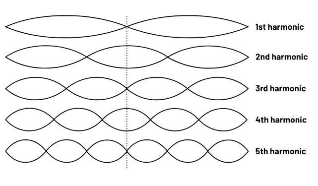
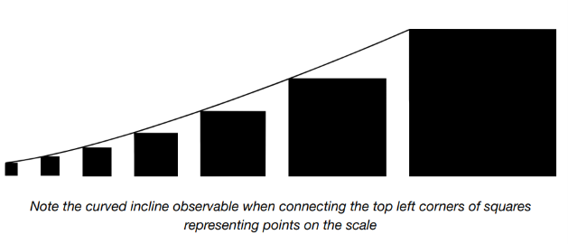

# Escala modular

La música es fundamentalmente una exposición matemática, y cuando hablamos de  [_la musicalidad de la tipografía_ ↗](https://typeandmusic.com/introducing-modular-scales/) es porque la composición tipográfica y la música comparten una base matemática.

Estamos seguros de que habrás oído hablar de conceptos como frecuencia, tono y armonía. Todos estos son matemáticamente determinables, pero ¿sabías que el tono percibido puede estar formado por múltiples frecuencias?

Una sola nota musical, como la producida al pulsar una cuerda de guitarra, es en sí misma una composición. Las diferentes frecuencias (o armónicos) juntos pertenecen a una _serie armónica_. Una serie armónica es una secuencia de fracciones basada en la serie aritmética de incremento en 1.

```
1, 2, 3, 4, 5, 6    // serie aritmética
1, ½, ⅓, ¼, ⅕, ⅙    // serie armónica
```



El sonido resultante es armonioso debido a su regularidad. La frecuencia fundamental es divisible por cada una de las frecuencias armónicas, y cada frecuencia armónica es la media de las frecuencias a cada lado de ella.

## Armonía visual

Deberíamos aspirar a la armonía también en nuestro layout visual. Como el sonido de una cuerda pulsada, debería ser cohesivo. Dado que trabajamos predominantemente con texto, es sensato tratar el `line-height` como base para extrapolar valores para el espacio en blanco. Un `font-size` de `1rem` (implícitamente), y un `line-height` de `1.5` crea un valor por defecto de `1.5rem`. Un espacio armoniosamente más grande podría ser `3rem` (2 × 1.5) o `4.5rem` (3 × 1.5).

Crear una secuencia sumando 1.5 en cada paso resulta en intervalos grandes. En su lugar, podemos _multiplicar_ por 1.5. El resultado sigue siendo regular; los incrementos solo más pequeños.

```
1 * 1.5;       // 1.5
1.5 * 1.5;     // 2.25
1.5 * 1.5 * 1.5; // 3.375
```

Este algoritmo se llama _escala modular_, y al igual que una escala musical está destinada a producir armonía. Cómo la emplees en tu diseño depende de la tecnología que estés usando.

## Propiedades personalizadas (custom properties)

En CSS, puedes describir una escala modular usando custom properties y la función `calc()`, que soporta aritmética simple. En el siguiente ejemplo, dividimos o multiplicamos por la propiedad personalizada (variable) `--ratio` para crear los puntos en nuestra escala. Podemos hacer uso de puntos ya establecidos para generar nuevos. Es decir, `var(--s2) * var(--ratio)` es equivalente a `var(--ratio) * var(--ratio) * var(--ratio)`.

```css linenums="1"
:root {
  --ratio: 1.5;
  --s-5: calc(var(--s-4) / var(--ratio));
  --s-4: calc(var(--s-3) / var(--ratio));
  --s-3: calc(var(--s-2) / var(--ratio));
  --s-2: calc(var(--s-1) / var(--ratio));
  --s-1: calc(var(--s0) / var(--ratio));
  --s0: 1rem;
  --s1: calc(var(--s0) * var(--ratio));
  --s2: calc(var(--s1) * var(--ratio));
  --s3: calc(var(--s2) * var(--ratio));
  --s4: calc(var(--s3) * var(--ratio));
  --s5: calc(var(--s4) * var(--ratio));
}
```



??? info "Explicacion"

    La idea principal de todo este apartado es:

    > **Los tamaños y espacios de una interfaz no deberían elegirse al azar, sino seguir una progresión matemática regular para producir armonía visual.**

    La comparación con la música es más una analogía que algo que necesites memorizar. Lo importante empieza realmente en "Armonía visual".

    ---

    __1. Tomamos una medida base__

    Supongamos:

    ```css
    font-size: 1rem;
    line-height: 1.5;
    ```

    Entonces la altura de una línea de texto será:

    ```text
    1rem × 1.5 = 1.5rem
    ```

    Ese 1.5rem puede servir como unidad básica para construir todos los espacios de la página.

    ---

    __2. ¿Por qué no sumar siempre 1.5?__

    Podríamos hacer:

    ```text
    1.5
    3
    4.5
    6
    7.5
    9
    ```

    (sumando 1.5 cada vez)

    Pero los saltos entre valores son grandes y constantes.

    ---

    __3. En lugar de sumar, multiplicamos__

    Usamos un ratio, por ejemplo:

    ```text
    1 × 1.5 = 1.5
    1.5 × 1.5 = 2.25
    2.25 × 1.5 = 3.375
    3.375 × 1.5 = 5.0625
    ```

    La secuencia queda:

    ```text
    1
    1.5
    2.25
    3.375
    5.0625
    7.59375
    ...
    ```

    Los tamaños siguen una progresión regular, parecida a las notas musicales.

    Eso es una **escala modular**.

    ---

    __4. ¿Para qué sirve?__

    En lugar de inventarte tamaños:

    ```css
    margin: 17px;
    padding: 23px;
    gap: 42px;
    ```

    utilizas valores pertenecientes a la escala:

    ```css
    padding: 1.5rem;
    gap: 2.25rem;
    margin-bottom: 3.375rem;
    ```

    Todo mantiene una relación matemática.

    ---

    __5. ¿Qué hacen estas variables?__

    ```css
    :root {
      --ratio: 1.5;
    ```

    El factor de multiplicación es 1.5.

    La medida central es:

    ```css
    --s0: 1rem;
    ```

    A partir de ella se generan las demás.

    ---

    __Hacia arriba__

    ```css
    --s1: calc(var(--s0) * var(--ratio));
    ```

    equivale a:

    ```text
    1 × 1.5 = 1.5rem
    ```

    ---

    ```css
    --s2: calc(var(--s1) * var(--ratio));
    ```

    equivale a:

    ```text
    1.5 × 1.5 = 2.25rem
    ```

    ---

    ```css
    --s3: calc(var(--s2) * var(--ratio));
    ```

    equivale a:

    ```text
    2.25 × 1.5 = 3.375rem
    ```

    ---

    __6. También puede crecer hacia abajo__

    ```css
    --s-1: calc(var(--s0) / var(--ratio));
    ```

    produce:

    ```text
    1 / 1.5 = 0.667rem
    ```

    ---

    ```css
    --s-2: calc(var(--s-1) / var(--ratio));
    ```

    produce:

    ```text
    0.667 / 1.5 = 0.444rem
    ```

    ---

    Por tanto, la escala completa sería:

    | Variable | Valor aproximado |
    | -------- | ---------------- |
    | --s-2    | 0.444rem         |
    | --s-1    | 0.667rem         |
    | --s0     | 1rem             |
    | --s1     | 1.5rem           |
    | --s2     | 2.25rem          |
    | --s3     | 3.375rem         |
    | --s4     | 5.063rem         |
    | --s5     | 7.594rem         |

    ---

    __7. ¿Por qué Every Layout usa esto?__

    Porque luego puedes escribir:

    ```html
    <stack-l space="var(--s1)">
    ```

    o

    ```html
    <stack-l space="var(--s3)">
    ```

    o

    ```css
    .card {
        padding: var(--s2);
    }
    ```

    y todos los espacios de la página estarán relacionados entre sí.

    ---

    __La filosofía detrás de esto__

    Imagina una casa construida por varias personas.

    Sin una escala:

    ```text
    Ventana → 17 cm
    Puerta → 91 cm
    Mesa → 63 cm
    Escalón → 24 cm
    ```

    Todo funciona, pero parece improvisado.

    Con una escala modular:

    ```text
    Ventana → s2
    Puerta → s4
    Mesa → s3
    Escalón → s1
    ```

    Todo guarda proporciones y la composición resulta más armoniosa.

    Por eso Every Layout recomienda no pensar en:

    > "¿Cuántos píxeles pongo aquí?"

    sino en:

    > "¿Qué punto de mi escala quiero utilizar aquí?".

    De esta forma, el diseño se vuelve más consistente y mucho más fácil de mantener.

??? example

    Ejemplo de seccion [Aqui ↗](../../examples/modularScale/custumProperties.html)

    ```html linenums="1"
    <body>
        <div class="contenedor">
            <h1>Exercices</h1>

            <div class="card">
                <h2>NVIDIA-750GH | CARD </h2>
                <p>Lorem ipsum dolor sit amet consectetur adipisicing elit. Aspernatur odit enim blanditiis mollitia nesciunt amet, aut quae. Expedita voluptate eum excepturi, aliquam dolorem doloremque impedit cum, laboriosam ex pariatur accusamus?</p>
                <p>259$</p>
            </div>

            <div class="buttoms">
                <button class="btn-1">Mesage</button>
                <button class="btn-2">Mesage</button>
                <button class="btn-3">Mesage</button>
                <button class="btn-4">Mesage</button>
                <button class="btn-5">Mesage</button>
            </div>
            <div class="article">

            </div>
        </div>
    </body>
    ```
    ```css linenums="1" 
    :root{
      --ratio: 1.5;
      --s5:calc(var(--s4) * var(--ratio));
      --s4:calc(var(--s3) * var(--ratio));
      --s3:calc(var(--s2) * var(--ratio));
      --s2:calc(var(--s1) * var(--ratio));
      --s1:calc(var(--s0) * var(--ratio));
      --s0: 1rem;
      --s-1:calc(var(--s0)  / var(--ratio));
      --s-2:calc(var(--s-1) / var(--ratio));
      --s-3:calc(var(--s-2) / var(--ratio));
      --s-4:calc(var(--s-3) / var(--ratio));
      --s-5:calc(var(--s-4) / var(--ratio));
      }
      body{
          background-color: rgb(7, 7, 7);
      }
      h1{ font-size: var(--s2);}
      .card {
          background-color: rgb(230, 241, 251);
          padding: var(--s-1);
      }
      .card h2 { font-size: var(--s0); }
      .card p  { font-size: var(--s0); }
      .buttoms{
          margin-top: var(--s-1);
          background-color: rgb(35, 41, 39);
          padding: var(--s-2);

      }
      .btn-1{ font-size: var(--s2);}
      .btn-2{ font-size: var(--s1);}
      .btn-3{ font-size: var(--s0);}
      .btn-4{ font-size: var(--s-1);}
      .btn-5{ font-size: var(--s-2);}
    ```


## La función `pow()`

Al momento de escribir esto, los navegadores solo soportan aritmética básica en operaciones `calc()`. Sin embargo, un [_nuevo conjunto de funciones matemáticas/expresiones_ ↗](https://drafts.csswg.org/css-values/#math) están llegando a CSS. Crucialmente, esto incluye la función `pow()`, con la cual acceder y crear puntos de escala modular se vuelve mucho más fácil.

```css linenums="1"
:root {
  --ratio: 1.5rem;
}
.my-element {
  /* ↓ 1.5 * 1.5 * 1.5 es igual a 1.5³ */
  font-size: pow(var(--ratio), 3);
}
```
??? info "Explicacion"

    A día de hoy (2026) ya puedes usar pow() en CSS moderno. La función forma parte del conjunto de funciones matemáticas de CSS y está disponible en los navegadores actuales. La idea principal es:

    > **En vez de multiplicar repetidamente para construir una escala modular, podremos elevar un número a una potencia usando `pow()`.**

    Por ejemplo, hasta ahora haces:

    ```css
    :root {
        --ratio: 1.5;
        --s0: 1rem;
        --s1: calc(var(--s0) * var(--ratio));
        --s2: calc(var(--s1) * var(--ratio));
        --s3: calc(var(--s2) * var(--ratio));
    }
    ```

    Lo que matemáticamente es:

    ```text
    s1 = 1 × 1.5
    s2 = 1 × 1.5 × 1.5
    s3 = 1 × 1.5 × 1.5 × 1.5
    ```

    o equivalentemente:

    ```text
    s1 = 1.5¹
    s2 = 1.5²
    s3 = 1.5³
    ```

    ---

    __¿Qué hace `pow()`?__

    La función:

    ```css
    pow(base, exponente)
    ```

    devuelve:

    ```text
    baseexponente
    ```

    (es decir, la base elevada al exponente).

    Por ejemplo:

    ```css
    pow(2, 3)
    ```

    significa:

    ```text
    2³ = 2 × 2 × 2 = 8
    ```

    ---

    __Aplicado a una escala modular__

    Si tienes:

    ```css
    :root {
        --ratio: 1.5;
    }
    ```

    entonces:

    ```css
    font-size: pow(var(--ratio), 3);
    ```

    es equivalente a:

    ```text
    1.5³
    ```

    es decir:

    ```text
    1.5 × 1.5 × 1.5 = 3.375
    ```

    Por tanto:

    ```css
    font-size: 3.375rem;
    ```

    ---

    __Hay un pequeño detalle__

    En el ejemplo del libro aparece:

    ```css
    :root {
      --ratio: 1.5rem;
    }
    ```

    pero normalmente el ratio debería ser:

    ```css
    :root {
      --ratio: 1.5;
    }
    ```

    sin unidades, porque el ratio representa una proporción.

    Entonces podrías escribir algo como:

    ```css
    :root {
        --ratio: 1.5;
        --base-size: 1rem;
    }

    h1 {
        font-size: calc(var(--base-size) * pow(var(--ratio), 3));
    }
    ```

    que sería:

    ```text
    1rem × 1.5³
    = 1rem × 3.375
    = 3.375rem
    ```

    ---

    __¿Por qué es mejor?__

    Con la forma actual necesitas:

    ```css
    --s1
    --s2
    --s3
    --s4
    --s5
    ```

    y mantener toda la cadena.

    Con `pow()` podrías simplemente decir:

    ```css
    padding: calc(1rem * pow(1.5, 2));
    font-size: calc(1rem * pow(1.5, 4));
    margin-top: calc(1rem * pow(1.5, -1));
    ```

    sin tener que declarar:

    ```css
    --s-1
    --s0
    --s1
    --s2
    --s3
    --s4
    ...
    ```

    ---

    Por ejemplo:

    ```css
    .card {
        padding: calc(1rem * pow(1.5, 2)); /* 2.25rem */
    }

    .card h2 {
        font-size: calc(1rem * pow(1.5, 3)); /* 3.375rem */
    }

    .card p {
        margin-top: calc(1rem * pow(1.5, -1)); /* 0.667rem */
    }
    ```

    La ventaja es que el índice de la escala (`2`, `3`, `-1`, etc.) se convierte directamente en el exponente. Así, en el futuro, construir una escala modular en CSS será mucho más sencillo y flexible.

## Acceso desde JavaScript

Nuestras variables de escala se colocan en el elemento `:root`, haciéndolas globalmente disponibles. Y por global, queremos decir _verdaderamente_ global. Las custom properties están disponibles para JavaScript y también "atraviesan" los límites de Shadow DOM para afectar el CSS de una hoja de estilo `shadowRoot`.

JavaScript consume las custom properties de CSS como propiedades JSON. Puedes pensar en las custom properties globales como configuraciones compartidas por CSS y JavaScript. Así es como obtendrías el punto `--s3` en la escala usando JavaScript (`document.documentElement` representa el elemento `:root` o `<html>`):

```js
const rootStyles = getComputedStyle(document.documentElement);
const scale3 = rootStyles.getPropertyValue('--s3');
```
??? info "Explicacion"

    Esta sección te está diciendo algo muy poderoso:

    > Las variables CSS no pertenecen exclusivamente al CSS. También pueden ser leídas y modificadas desde JavaScript.

    Por ejemplo, si tienes:

    ```css
    :root {
        --ratio: 1.5;
        --s0: 1rem;
        --s1: calc(var(--s0) * var(--ratio));
        --s2: calc(var(--s1) * var(--ratio));
        --s3: calc(var(--s2) * var(--ratio));
    }
    ```

    esas variables viven en `:root`, es decir, en:

    ```html
    <html>
    ```

    y por ser heredables, toda la página puede utilizarlas.

    ---

    __Accediendo desde JavaScript__

    Primero obtenemos el elemento raíz:

    ```javascript
    document.documentElement
    ```

    que representa:

    ```html
    <html>
    ```

    Luego usamos:

    ```javascript
    getComputedStyle(document.documentElement)
    ```

    para obtener todos los estilos calculados del elemento `<html>`.

    Por ejemplo:

    ```javascript
    const rootStyles = getComputedStyle(document.documentElement);
    ```

    Ahora `rootStyles` contiene todas las propiedades calculadas de `<html>`, incluyendo nuestras custom properties.

    ---

    __Obteniendo una variable concreta__

    ```javascript
    const scale3 = rootStyles.getPropertyValue('--s3');
    ```

    Esto devuelve algo como:

    ```javascript
    "3.375rem"
    ```

    ---

    __¿Por qué dice que las consume como propiedades JSON?__

    No es que las convierta literalmente en JSON.

    Lo que quiere decir es que JavaScript las trata como pares:

    ```text
    nombre → valor
    ```

    igual que un objeto:

    ```javascript
    {
        "--s1": "1.5rem",
        "--s2": "2.25rem",
        "--s3": "3.375rem"
    }
    ```

    aunque internamente no sea un objeto JSON.

    ---

    __¿Para qué serviría esto?__

    Supongamos que quieres crear dinámicamente una tarjeta:

    ```javascript
    const card = document.querySelector('.card');

    card.style.padding =
        rootStyles.getPropertyValue('--s2');
    ```

    y la tarjeta tendrá:

    ```css
    padding: 2.25rem;
    ```

    ---

    __O hacer una animación__

    ```javascript
    const modal = document.querySelector('.modal');

    modal.style.marginTop =
        rootStyles.getPropertyValue('--s3');
    ```

    ---

    __O cambiar la escala completa__

    Imagina:

    ```css
    :root {
        --ratio: 1.5;
    }
    ```

    Desde JavaScript podrías hacer:

    ```javascript
    document.documentElement
        .style
        .setProperty('--ratio', '2');
    ```

    y toda la interfaz que dependa de esa variable cambiaría automáticamente.

    ---

    __¿Qué significa que atraviesan el Shadow DOM?__

    Normalmente, el Shadow DOM aísla los estilos.

    Sin embargo, las custom properties son especiales.

    Si tienes:

    ```css
    :root {
        --color-primary: blue;
    }
    ```

    un componente con Shadow DOM todavía puede hacer:

    ```css
    button {
        background: var(--color-primary);
    }
    ```

    porque las custom properties atraviesan esa barrera.

    ---

    __La idea más importante__

    Every Layout quiere que veas las variables globales como:

    ```text
                Configuración compartida

                      :root
                        │
            ┌────────────┼────────────┐
            │            │            │
          CSS        JavaScript    Shadow DOM
    ```

    De modo que:

    * CSS puede usar:

    ```css
    padding: var(--s2);
    ```

    * JavaScript puede leer:

    ```javascript
    rootStyles.getPropertyValue('--s2');
    ```

    * JavaScript puede modificar:

    ```javascript
    document.documentElement
    .style.setProperty('--s2', '4rem');
    ```

    y todo el sistema se mantiene sincronizado.

    Por eso las custom properties son mucho más que "variables de CSS". Son una especie de **sistema global de configuración compartido entre CSS y JavaScript**.

## Soporte de Shadow DOM

La misma propiedad `--s3` se aplica exitosamente cuando se invoca en Shadow DOM, como en el siguiente ejemplo. El selector `:host` se refiere al propio custom element hipotético.

```js
this.shadowRoot.innerHTML = `
  <style>
    :host {
      padding: var(--s3);
    }
  </style>
  <slot></slot>
`;
```

## Pasando mediante props

A veces podríamos querer que nuestro custom element consuma ciertos estilos desde propiedades (props) — en este caso una prop `padding`.

```html
<my-element padding="var(--s3)">
  <!-- Light DOM contents -->
</my-element>
```

La cadena `var(--s3)` puede ser interpolada en el CSS de la instancia del custom element usando un [_template literal_ ↗](https://developer.mozilla.org/en-US/docs/Web/JavaScript/Reference/Template_literals):

```js
this.shadowRoot.innerHTML = `
  <style>
    :host {
      padding: ${this.padding};
    }
  </style>
  <slot></slot>
`;
```

Pero primero necesitamos escribir un _getter_ y un _setter_ para nuestra prop. El sufijo `|| 'var(--s1)'` en la línea del getter es el valor de retorno por defecto. El uso de valores por defecto sensatos hace que trabajar con componentes de layout sea menos laborioso; apuntamos a [_convención sobre configuración_ ↗](https://en.wikipedia.org/wiki/Convention_over_configuration).

```js
get padding() {
  return this.getAttribute('padding') || 'var(--s1)';
}
set padding(val) {
  return this.setAttribute('padding', val);
}
```
??? info "Explicacion"

    Este apartado te está enseñando algo muy importante: **cómo un custom element puede recibir valores desde el HTML y usarlos dentro de su CSS**. Es decir, cómo funcionan las **props**.

    La idea es muy parecida a pasar argumentos a una función.

    ---

    __1. El usuario escribe__

    ```html
    <my-element padding="var(--s3)">
        <!-- contenido -->
    </my-element>
    ```

    Aquí:

    * `<my-element>` es tu custom element.
    * `padding="var(--s3)"` es una prop.
    * El usuario está diciendo:

    > "Quiero que este componente tenga un padding de `var(--s3)`."

    ---

    __2. Dentro del componente__

    Imagina que tienes:

    ```javascript
    class MyElement extends HTMLElement {
        ...
    }
    ```

    y defines:

    ```javascript
    get padding() {
        return this.getAttribute('padding') || 'var(--s1)';
    }
    ```

    ---

    __¿Qué hace `this.getAttribute('padding')`?__

    Lee el atributo:

    ```html
    <my-element padding="var(--s3)">
    ```

    y devuelve:

    ```javascript
    "var(--s3)"
    ```

    ---

    __¿Y el `|| 'var(--s1)'`?__

    Significa:

    > "Si no existe el atributo `padding`, usa `var(--s1)`."

    Por ejemplo:

    __Caso 1__

    ```html
    <my-element padding="var(--s3)">
    ```

    el getter devuelve:

    ```javascript
    "var(--s3)"
    ```

    ---

    __Caso 2__

    ```html
    <my-element>
    ```

    como no hay atributo `padding`, devuelve:

    ```javascript
    "var(--s1)"
    ```

    que es el valor por defecto.

    ---

    __3. El template literal__

    Luego aparece esto:

    ```javascript
    this.shadowRoot.innerHTML = `
      <style>
        :host {
          padding: ${this.padding};
        }
      </style>
      <slot></slot>
    `;
    ```

    El símbolo:

    ```javascript
    ${...}
    ```

    significa:

    > "Inserta aquí el valor."

    ---

    Si:

    ```javascript
    this.padding
    ```

    vale:

    ```javascript
    "var(--s3)"
    ```

    entonces el navegador construye:

    ```html
    <style>
        :host {
            padding: var(--s3);
        }
    </style>
    ```

    ---

    Si el usuario escribió:

    ```html
    <my-element>
    ```

    el getter devuelve:

    ```javascript
    "var(--s1)"
    ```

    y el CSS generado será:

    ```html
    <style>
        :host {
            padding: var(--s1);
        }
    </style>
    ```

    ---

    __¿Qué es `:host`?__

    Dentro del Shadow DOM, `:host` representa:

    ```html
    <my-element>
    ```

    Es decir:

    ```css
    :host {
        padding: var(--s3);
    }
    ```

    es equivalente a decir:

    ```css
    my-element {
        padding: var(--s3);
    }
    ```

    pero desde dentro del Shadow DOM.

    ---

    __¿Y el setter?__

    ```javascript
    set padding(val) {
        return this.setAttribute('padding', val);
    }
    ```

    permite hacer:

    ```javascript
    element.padding = 'var(--s4)';
    ```

    y eso producirá:

    ```html
    <my-element padding="var(--s4)">
    ```

    ---

    __La filosofía de Every Layout__

    Los layouts tienen valores razonables por defecto:

    ```javascript
    get space() {
        return this.getAttribute('space') || 'var(--s1)';
    }
    ```

    Así puedes escribir simplemente:

    ```html
    <stack-l>
    ```

    y obtendrás:

    ```css
    margin-top: var(--s1);
    ```

    sin configurar nada.

    Pero si necesitas más espacio:

    ```html
    <stack-l space="var(--s3)">
    ```

    entonces el layout se adapta.

    ---

    Piensa en ello como una función:

    ```javascript
    crearStack(space = "var(--s1)")
    ```

    y luego:

    ```javascript
    crearStack()
    ```

    usa:

    ```text
    var(--s1)
    ```

    mientras que:

    ```javascript
    crearStack("var(--s3)")
    ```

    usa:

    ```text
    var(--s3)
    ```

    Las props son simplemente los parámetros con los que configuras una instancia particular del componente sin modificar el componente en sí.

    Y precisamente por eso Every Layout puede tener un solo `<stack-l>` y cientos de configuraciones diferentes:

    ```html
    <stack-l>
    <stack-l space="var(--s2)">
    <stack-l space="var(--s4)">
    ```

    todos usando la misma lógica interna.

## ⚠ Evitando Shadow DOM

Los custom elements utilizados para implementar los layouts de _Every Layout_ no usan Shadow DOM porque están diseñados para aprovechar más plenamente los estilos 'globales'. Consulta _Global and local styling_ para más información.

No usar Shadow DOM también facilita el renderizado del lado del servidor de los estilos incrustados. El estilo de _cualquier_ layout inicial de _Every Layout_ se incrusta en el documento como parte del proceso de construcción, lo que significa que los custom elements no dependen de JavaScript, _excepto_ para el procesamiento dinámico de sus valores en herramientas de desarrollo, o a través de tu propio scripting personalizado.

## Imponiendo consistencia

Esta prop `padding` es actualmente permisiva; el autor puede proporcionar una custom property, o un valor de longitud simple como `1.25rem`. Si quisiéramos imponer el uso de nuestra escala modular, aceptaríamos solo números (`2`, `3`, `-1`) y los interpolaríamos así: `var(--${this.padding})`.

Podríamos verificar que se está pasando un valor numérico usando `isNaN()`. El doble "!!" es porque primero debemos realizar [_type coercion_ ↗](https://developer.mozilla.org/en-US/docs/Glossary/Type_coercion), convirtiendo un potencial "1" o "2" en `1` o `2`.

```js
if (!!isNaN(this.padding)) {
  console.error('<my-component> el valor de padding debe ser un número que represente un punto en la escala modular');
  return;
}
```

La escala modular se basa en un único número, en este caso `1.5`. A través de la extrapolación — como multiplicador y divisor — la presencia del número se puede sentir en todo el diseño visual. El diseño consistente y equilibrado se siembra a partir de axiomas simples como la relación de la escala modular.

Algunos creen que la relación específica utilizada para la escala modular es importante, y muchos se adhieren a la [_proporción áurea_ ↗](https://en.wikipedia.org/wiki/Golden_ratio) de `1.61803398875`. Pero es en la adherencia estricta a la relación _que elijas_ donde se crea la armonía.

??? info "Explicacion"

    Este apartado está hablando de algo muy importante en diseño de componentes: **cómo evitar que los usuarios rompan el sistema de diseño**.

    Hasta ahora, supongamos que tu componente es así:

    ```html
    <my-element padding="var(--s3)">
    ```

    o incluso:

    ```html
    <my-element padding="1.25rem">
    ```

    y tu getter:

    ```javascript
    get padding() {
        return this.getAttribute('padding') || 'var(--s1)';
    }
    ```

    es muy permisivo, porque acepta:

    * `"var(--s3)"`
    * `"1rem"`
    * `"25px"`
    * `"banana"` 😆
    * `"123abc"`

    En otras palabras, cualquiera puede poner cualquier cosa.

    ---

    ## ¿Qué propone el autor?

    Que en vez de permitir cualquier valor, el usuario solo pueda escribir:

    ```html
    <my-element padding="3">
    ```

    o:

    ```html
    <my-element padding="-1">
    ```

    es decir, **el índice del punto de la escala**.

    Luego, dentro del componente, tú construyes la variable CSS:

    ```javascript
    var(--s3)
    ```

    o

    ```javascript
    var(--s-1)
    ```

    haciendo:

    ```javascript
    var(--s${this.padding})
    ```

    Por ejemplo:

    Si:

    ```html
    <my-element padding="3">
    ```

    entonces:

    ```javascript
    this.padding
    ```

    vale:

    ```javascript
    "3"
    ```

    y puedes generar:

    ```javascript
    var(--s3)
    ```

    Si:

    ```html
    <my-element padding="-1">
    ```

    obtienes:

    ```javascript
    var(--s-1)
    ```

    ---

    # ¿Por qué hacer esto?

    Porque así nadie puede hacer:

    ```html
    <my-element padding="17px">
    ```

    y romper la armonía del sistema.

    Todos los espacios provendrán de la escala modular.

    ---

    # ¿Qué hace esto?

    ```javascript
    if (!!isNaN(this.padding)) {
        console.error(
            '<my-component> el valor de padding debe ser un número'
        );
        return;
    }
    ```

    ## `isNaN()`

    significa:

    > "¿Esto no es un número?"

    Por ejemplo:

    ```javascript
    isNaN("3")
    ```

    devuelve:

    ```javascript
    false
    ```

    porque `"3"` puede convertirse en el número `3`.

    ---

    ```javascript
    isNaN("hola")
    ```

    devuelve:

    ```javascript
    true
    ```

    porque `"hola"` no puede convertirse en un número.

    ---

    ### Entonces:

    Si alguien hace:

    ```html
    <my-element padding="hola">
    ```

    el componente mostrará:

    ```text
    <my-component> el valor de padding debe ser un número que represente un punto en la escala modular
    ```

    ---

    # ¿Y por qué el doble `!!`?

    La verdad es que aquí el autor está siendo un poco rebuscado.

    ```javascript
    !!isNaN(this.padding)
    ```

    simplemente fuerza el resultado a un booleano:

    ```javascript
    true
    ```

    o

    ```javascript
    false
    ```

    Pero realmente podrías escribir:

    ```javascript
    if (isNaN(this.padding)) {
        ...
    }
    ```

    y funcionaría igual.

    ---

    # La idea filosófica

    Imagina que tu sistema tiene:

    ```text
    s-2
    s-1
    s0
    s1
    s2
    s3
    ```

    y alguien escribe:

    ```html
    <my-element padding="2">
    ```

    Tú sabes inmediatamente que eso significa:

    ```css
    padding: var(--s2);
    ```

    Nadie puede poner:

    ```html
    padding="13px"
    padding="1.73rem"
    padding="42px"
    ```

    porque esos valores romperían la coherencia del diseño.

    ---

    # Lo más importante del apartado

    No es la proporción áurea ni el `1.5`.

    El mensaje principal es:

    > **La armonía no proviene del número mágico que elijas, sino de usarlo consistentemente.**

    Puedes escoger:

    ```text
    1.2
    1.333
    1.5
    1.618
    ```

    y todos producirán sistemas armoniosos.

    Lo que destruye la armonía es hacer:

    ```text
    1rem
    2.25rem
    17px
    31px
    0.93rem
    42px
    ```

    sin una relación clara entre ellos.

    Por eso Every Layout prefiere restringir a los usuarios a los índices:

    ```text
    -2, -1, 0, 1, 2, 3...
    ```

    y que el propio componente traduzca esos números a:

    ```text
    var(--s-2)
    var(--s-1)
    var(--s0)
    var(--s1)
    var(--s2)
    var(--s3)
    ```

    manteniendo así la coherencia y la armonía visual del sistema.


