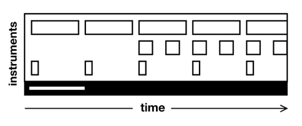
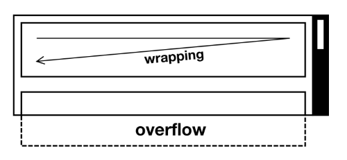
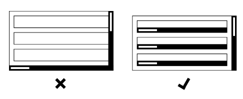
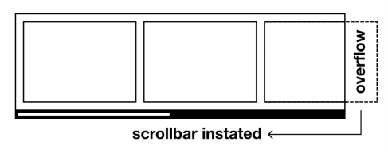
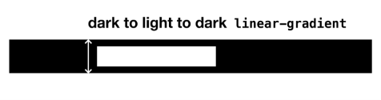
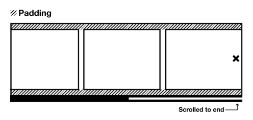
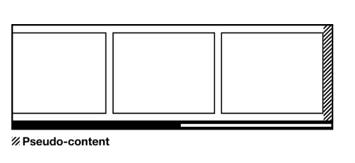
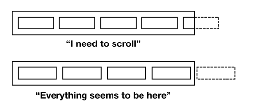

# The Reel

## El problema

Cuando estoy secuenciando música, no sé cuánto tiempo tendrá la pista que estoy creando hasta que termino. Mi software de secuenciación es consciente de esto y provisiona tiempo *bajo demanda*, a medida que agrego compases de sonido. Así como los secuenciadores de música provisionan tiempo dinámicamente, las páginas web provisionan espacio. Si todas las canciones tuvieran que durar cuatro minutos y veintiséis segundos, o todas las páginas web tuvieran `768px` de alto, bueno, eso sería innecesariamente restrictivo.



El mecanismo mediante el cual el espacio provisionado puede ser explorado dentro de un "viewport" fijo se llama *scrolling*. Sin él, los dispositivos de todos tendrían que ser exactamente del mismo tamaño, forma y nivel de aumento en todo momento. Escribir contenido para tal espacio se convertiría en un juego formalista, como escribir haiku. Gracias al scrolling, no tienes que preocuparte por el espacio al escribir contenido web. Escribir para impresión no tiene el mismo lujo.

El `writing-mode` CSS con el que probablemente estés más familiarizado es `horizontal-tb`. En este modo, el texto y los elementos inline progresan horizontalmente (ya sea de izquierda a derecha, como en inglés, o de derecha a izquierda) y los elementos block fluyen de arriba a abajo (esa es la parte `tb`). Dado que se instruye a los elementos de texto e inline para que *hagan wrap*, el desbordamiento horizontal que activaría el scrolling horizontal generalmente se evita. Debido a que no se permite que el contenido llegue *hacia afuera*, se resuelve llegando *hacia abajo*. La progresión vertical de los elementos block inevitablemente activa el scrolling vertical.



Como lector occidental, acostumbrado al modo de escritura `horizontal-tb`, el scrolling vertical es convencional y esperado. Cuando descubres que la página necesita ser desplazada verticalmente para ver todo el contenido, no piensas que algo ha salido mal. Cuando encuentras scrolling *horizontal*, no solo es inesperado sino que tiene claras implicaciones de usabilidad: donde el desbordamiento sigue la dirección de escritura, cada línea sucesiva de texto tiene que ser desplazada para ser leída.

Todo esto no quiere decir que el scrolling horizontal esté estrictamente prohibido dentro de un modo de escritura `horizontal-tb`. De hecho, donde se implementa deliberada y claramente, las secciones de desplazamiento horizontal dentro de una página de desplazamiento vertical pueden ser una forma ergonómica de navegar por el contenido. Los servicios de streaming de televisión tienden a diseccionar su contenido por categoría verticalmente y por programa horizontalmente, por ejemplo. Lo único que realmente quieres evitar son elementos individuales que se desplazan *bidireccionalmente*. Esto se considera una falla bajo el criterio *1.4.10 Reflow* de WCAG.



Formalicé un *"carousel" accesible para la BBC* ↗ que — en lugar de diferir enteramente a JavaScript para la funcionalidad de navegación — simplemente invoca el scrolling nativo con `overflow`. Los botones de navegación proporcionados son meramente una mejora progresiva, e incrementan la posición de desplazamiento. El `Reel` de Every Layout es similar, pero prescinde del JavaScript para confiar únicamente en el comportamiento estándar de desplazamiento del navegador.

## La solución

Como establecimos en *The Cluster*, una forma eficiente de cambiar la dirección del flujo de bloque es crear un contexto Flexbox. Al aplicar `display: flex` a un elemento, sus hijos cambiarán de progresar *hacia abajo* a progresar *hacia la derecha* — al menos donde la escritura predeterminada LTR (left-to-right) está en efecto.

Al omitir la declaración a menudo complementaria `flex-wrap: wrap`, los elementos se ven obligados a mantener una formación de una sola fila. Cuando esta línea de contenido es más larga de lo que el elemento padre es ancho, ocurre desbordamiento. Por defecto, esto hará que la página misma se desplace horizontalmente. No queremos eso, porque es solo nuestro contenido Flexbox el que realmente necesita desplazamiento. Sería mejor que todo lo demás se quede quieto. Entonces, en su lugar, aplicamos `overflow: auto` al elemento Flex, que invoca automáticamente el desplazamiento *solo* en ese elemento y solo donde el desbordamiento realmente ocurre.

```css linenums="1"
.reel {
  display: flex;
  /* ↓ Solo queremos desplazamiento horizontal */
  overflow-x: auto;
}
```



Todavía tengo que abordar la *affordance* (hacer que el elemento se vea desplazable), y también está el tema del espaciado que abordar, pero este es el núcleo del layout. Debido a que capitaliza el comportamiento estándar del navegador, es extremadamente conciso en código y robusto — bastante diferente del carousel/slider promedio de jQuery.

## La barra de desplazamiento

El desplazamiento es funcionalidad multimodal: hay muchas formas de hacerlo, y puedes elegir la que mejor te convenga. Mientras que el tacto, los gestos del trackpad y las pulsaciones de teclas de flecha pueden ser algunos de los modos más ergonómicos, hacer clic y arrastrar la barra de desplazamiento misma es probablemente la más familiar, especialmente para usuarios mayores en desktop.

Tener una barra de desplazamiento visible tiene dos ventajas:

1. Permite el desplazamiento arrastrando el control deslizante (o "thumb")
2. Indica que el desplazamiento está disponible por este y otros medios (aumenta la *affordance*)

Algunos sistemas operativos y navegadores ocultan la barra de desplazamiento por defecto, pero hay métodos CSS para revelarla. Los navegadores basados en Webkit y Blink ofrecen las siguientes propiedades prefijadas:

```css linenums="1"
::-webkit-scrollbar {}
::-webkit-scrollbar-button {}
::-webkit-scrollbar-track {}
::-webkit-scrollbar-track-piece {}
::-webkit-scrollbar-thumb {}
::-webkit-scrollbar-corner {}
::-webkit-resizer {}
```

A partir de la versión 64, también hay oportunidades limitadas para estilizar la barra de desplazamiento en Firefox, con las propiedades estandarizadas `scrollbar-color` y `scrollbar-width`. Nota que la configuración de `scrollbar-color` solo tiene efecto en MacOS donde *Show scroll bars* está establecido a *Always* (en *Settings > General*).

Establecer colores de la barra de desplazamiento es cuestión de estética, que no es realmente de lo que trata Every Layout. Pero es importante, por razones de *affordance*, que las barras de desplazamiento sean *aparentes*. Los siguientes estilos en blanco y negro se eligen solo para adaptarse a la estética propia de Every Layout. Puedes ajustarlos como desees.

```css linenums="1"
.reel {
  display: flex;
  /* ↓ Solo queremos desplazamiento horizontal */
  overflow-x: auto;
  /* ↓ Primer valor: thumb; segundo valor: track */
  scrollbar-color: var(--color-light) var(--color-dark);
}
.reel::-webkit-scrollbar {
  height: 1rem;
}
.reel::-webkit-scrollbar-track {
  background-color: var(--color-dark);
}
.reel::-webkit-scrollbar-thumb {
  background-color: var(--color-dark);
  background-image: linear-gradient(var(--color-dark) 0, var(--color-dark) 0.25rem, var(--color-light) 0.25rem, var(--color-light) 0.75rem, var(--color-dark) 0.75rem);
}
```

No todas las propiedades son compatibles con estas pseudo-clases propietarias. Por lo tanto, visualmente el thumb es cuestión de pintar una franja centrada usando un `linear-gradient` en lugar de intentar un margen o borde.



## Altura

¿Cuál debería ser la altura de una instancia de `Reel`? Probablemente más corta que el viewport, para que todo el `Reel` pueda verse en la pantalla.

Pero, ¿deberíamos establecer una altura en absoluto? Probablemente no. La mejor respuesta es *tan alto como necesite ser*, y es una cuestión de la altura del *contenido*.

En la siguiente demostración, un elemento `Reel` alberga un conjunto de componentes tipo tarjeta. La altura del `Reel` está determinada por la altura de la tarjeta más alta, que es la tarjeta con más contenido. Nota que el último elemento de cada "tarjeta" (una simple atribución) se empuja al fondo del espacio, usando un `Stack` con `splitAfter="2"`.

*Esta demostración interactiva solo está disponible en el sitio de Every Layout* ↗.

Para imágenes, que pueden ser muy grandes o usar diferentes relaciones de aspecto, es posible que queramos establecer la altura del `Reel`. La imagen común debe tener la `height` correspondientemente establecida a `100%` y el `width` a `auto`. Esto asegurará que las imágenes compartan una altura pero mantengan su propia relación de aspecto.

```css linenums="1"
.reel {
  height: 50vh;
}
.reel > img {
  height: 100%;
  width: auto;
}
```

*Esta demostración interactiva solo está disponible en el sitio de Every Layout* ↗.

## Selectores hijo versus descendiente

Nota cómo estamos usando `.reel > img` y no `.reel img`. Solo queremos afectar el diseño de las imágenes *si* son descendientes directos (o *hijos*) del `Reel`. De ahí, el combinador de hijo `>`.

## Espaciado

Espaciar los elementos hijos solía ser un asunto sorprendentemente complicado. Se aplica un borde alrededor del `Reel` en este caso, para darle su forma.

Hasta hace poco, habríamos tenido que usar `margin` y el combinador de hermano adyacente para agregar espacio entre los elementos hijos:

```css linenums="1"
.reel > * + * {
  margin-left: var(--s1);
}
```

Ahora, dado que estamos en un contexto Flexbox, también podemos usar la propiedad `gap`, que se aplica al padre:

Sin embargo, el contenido del `Reel` no está diseñado para envolverse, por lo que usaremos la solución basada en `margin` en su lugar. Es más larga y mejor soportada.

Agregar espaciado *alrededor* de los elementos hijos (entre ellos y el elemento padre) es un asunto más complicado. Desafortunadamente, el `padding` del `.reel` interactúa inesperadamente con el scrolling ↗. El efecto en el lado derecho es como si no hubiera padding en absoluto.



Entonces, si queremos espaciado alrededor de los hijos, adoptamos un enfoque diferente. Agregamos margen a todos excepto al lado derecho de cada elemento hijo, luego insertamos espacio usando pseudo-contenido en el último de esos hijos.

```css linenums="1"
.reel {
  border-width: var(--border-thin);
}
.reel > * {
  margin: var(--s0);
  margin-right: 0;
}
.reel::after {
  content: '';
  flex-basis: var(--s0);
  /* ↓ El valor predeterminado es 1, por lo que necesita ser anulado */
  flex-shrink: 0;
}
```

## ⚠ Estilos de borde en cascada

Aquí, solo estamos aplicando el ancho del borde, y no el color o estilo del borde. Para que esto tenga efecto, el `border-style` tiene que estar aplicado en algún lugar ya. En la hoja de estilo propia de Every Layout, el `border-style` se aplica *universalmente*, haciendo que el `border-width` sea la única preocupación continua para la mayoría de los casos de borde:

```css linenums="1"
*,
*::before,
*::after {
  border-style: solid;
  /* ↓ 0 por defecto */
  border-width: 0;
}
```



La implementación a seguir asume que no necesitas padding en el elemento `Reel` en sí mismo; el enfoque usando `.reel > * + *` por lo tanto es suficiente.

Eso solo deja el espacio entre los hijos y la barra de desplazamiento (donde está presente y visible) para manejar. No es un problema, podrías pensar: solo agrega algo de padding en la parte inferior del padre (`class="reel"` aquí). El problema es que esto crea un espacio redundante donde el `Reel` no se está desbordando y la barra de desplazamiento no se ha invocado.

Idealmente, habría una pseudo-clase para elementos con desbordamiento/scroll. Entonces podríamos agregar el padding selectivamente. Actualmente, el *`:overflowed-content` pseudo-class* ↗ existe como poco más que una idea. Por ahora, podemos aplicar el margen y eliminarlo usando JavaScript y un simple `ResizeObserver`. Innatamente, esta es una técnica de mejora progresiva: donde JavaScript no está disponible, o `ResizeObserver` no es compatible, el padding no aparece para un `Reel` con desbordamiento — pero con poco efecto detrimental. Solo presiona la barra de desplazamiento contra el contenido.

```javascript linenums="1"
const reels = Array.from(document.querySelectorAll('.reel'));
const toggleOverflowClass = elem => {
  elem.classList.toggle('overflowing', elem.scrollWidth > elem.clientWidth);
};
for (let reel of reels) {
  if ('ResizeObserver' in window) {
    new ResizeObserver(entries => {
      toggleOverflowClass(entries[0].target);
    }).observe(reel);
  }
}
```

Dentro del observer, el `scrollWidth` del `Reel` se compara con su `clientWidth`. Si el `scrollWidth` es más grande, la clase `overflowing` se agrega.

```css linenums="1"
.reel.overflowing {
  padding-bottom: var(--s0);
}
```

## Concatenación de clases

Observa cómo las clases `reel` y `overflowing` se concatenan. Esto tiene la ventaja de que los estilos definidos aquí se aplican a componentes `overflowing` *solo* a componentes `Reel`. Es decir, no pueden ser aplicados inadvertidamente a otros elementos y componentes que también podrían tomar una clase `overflowing`.

Algunos desarrolladores usan namespacing verboso para localizar sus estilos, como prefijar cada clase asociada con un componente con el nombre del componente (ej. `reel--overflowing`). La especificación deliberada a través de la concatenación de clases es menos verbosa y más elegante.

Todavía no hemos terminado, porque no hemos tratado el caso de que los elementos hijos se eliminen dinámicamente del `Reel`. Eso también afectará a `scrollWidth`. Podemos abstraer la función de alternancia de clase y agregar un `MutationObserver` que observe el `childList` del `Reel`.

*MutationObserver es casi ubicuamente soportado* ↗

```javascript linenums="1"
const reels = Array.from(document.querySelectorAll('.reel'));
const toggleOverflowClass = elem => {
  elem.classList.toggle('overflowing', elem.scrollWidth > elem.clientWidth);
};
for (let reel of reels) {
  if ('ResizeObserver' in window) {
    new ResizeObserver(entries => {
      toggleOverflowClass(entries[0].target);
    }).observe(reel);
  }
  if ('MutationObserver' in window) {
    new MutationObserver(entries => {
      toggleOverflowClass(entries[0].target);
    }).observe(reel, {childList: true});
  }
}
```

Es justo decir que esto es un poco *exagerado* si solo se usa para agregar o eliminar ese poco de padding. Pero estos observers pueden usarse para otras mejoras, incluso más allá del estilo. Por ejemplo, podría ser beneficioso para los usuarios de teclado que un `Reel` con desbordamiento/scroll tome el atributo `tabindex="0"`. Esto haría que el elemento sea enfocable por teclado y, por lo tanto, desplazable usando las teclas de flecha. Si cada `Reel` es enfocable, o incluye un elemento hijo enfocable, esto puede no ser necesario: enfocar un elemento automáticamente lo trae a la vista cambiando la posición de desplazamiento.

## Casos de uso

El `Reel` es un antídoto robusto y eficiente para los componentes de carousel/slider. Como ya se discutió y demostró, es ideal para navegar por categorías de cosas: películas; productos; noticias; fotografías.

Además, se puede usar para suplantar los sistemas de menú activados por botón. Lo que Bradley Taunt llama *sausage links* ↗ bien puede ser más usable que los menús "hamburguesa" para muchos. Para tal caso de uso, la barra de desplazamiento visible es probablemente demasiado pesada. Es por eso que la siguiente *implementación de elemento personalizado* incluye una propiedad booleana `noBar`.

*Esta demostración interactiva solo está disponible en el sitio de Every Layout* ↗.

¡No hay razón por la que los enlaces tengan que tener forma de salchichas, por supuesto! Eso es solo un resquicio etimológico. Una cosa a tener en cuenta, sin embargo, es la falta de *affordance* que representa la omisión de la barra de desplazamiento. Siempre que el último elemento hijo visible a la derecha esté parcialmente oscurecido, está relativamente claro que está ocurriendo un desbordamiento y la capacidad de desplazarse está presente. Si este no es el caso, puede parecer que todos los elementos disponibles ya están a la vista.



Desde una perspectiva de layout, puedes reducir la probabilidad de "Everything seems to be here" evitando ciertos tipos de ancho. Los anchos porcentuales como `25%` o `33.333%` van a ser problemáticos porque — al menos en ausencia de espaciado — esto ajustará los elementos exactamente dentro del espacio.

Además, puedes indicar la disponibilidad de desplazamiento por otros medios. Puedes capitalizar la clase `overflowing` de los observers para revelar una instrucción textual (leyendo quizás *"scroll for more"*):

```css linenums="1"
.reel.overflowing + .instruction {
  display: block;
}
```

Sin embargo, esto no es reactivo a la posición de desplazamiento. Podrías usar scripting adicional para detectar cuándo el elemento se desplaza completamente hacia un lado u otro, y agregar clases `start` o `end` en consecuencia. La siempre innovadora *Lea Verou concibió una forma de lograr algo similar usando imágenes CSS solamente* ↗. Las imágenes de "sombra" toman `background-attachment: scroll` y permanecen en cada extremo del elemento desplazable. Las imágenes de "fondo de cubierta de sombra" toman `background-attachment: local` con el contenido en movimiento. Cada vez que el usuario alcanza un extremo del área desplazable, estos fondos de "cubierta de sombra" oscurecen las sombras debajo de ellos.

Estas consideraciones no se relacionan estrictamente con el layout, más con la comunicación, pero vale la pena explorarlas más a fondo para mejorar la usabilidad.

## El generador

Usa esta herramienta para generar CSS y HTML básicos. Querrías incluir el script `ResizeObserver` junto con el código generado. Aquí hay una versión implementada como una Expresión de Función Invocada Inmediatamente (IIFE):

```javascript linenums="1"
(function() {
  const className = 'reel';
  const reels = Array.from(document.querySelectorAll(`.${className}`));
  const toggleOverflowClass = elem => {
    elem.classList.toggle('overflowing', elem.scrollWidth > elem.clientWidth);
  };
  for (let reel of reels) {
    if ('ResizeObserver' in window) {
      new ResizeObserver(entries => {
        toggleOverflowClass(entries[0].target);
      }).observe(reel);
    }
    if ('MutationObserver' in window) {
      new MutationObserver(entries => {
        toggleOverflowClass(entries[0].target);
      }).observe(reel, {childList: true});
    }
  }
})();
```

La herramienta generadora de código solo está disponible en el *sitio de documentación adjunto* ↗. Aquí está la solución básica, con comentarios. El código que oculta la barra de desplazamiento se ha eliminado por brevedad, pero está disponible a través de la propiedad `noBar` en la implementación del componente personalizado.

**HTML**

```html linenums="1"
<div class="reel">
  <div><!-- elemento hijo --></div>
  <div><!-- otro elemento hijo --></div>
  <div><!-- etc --></div>
  <div><!-- etc --></div>
</div>
```

**CSS**

```css linenums="1"
.reel {
  /* ↓ Propiedades personalizadas para facilitar el ajuste */
  --space: 1rem;
  --color-light: #fff;
  --color-dark: #000;
  --reel-height: auto;
  --item-width: 25ch;
  display: flex;
  height: var(--reel-height);
  /* ↓ Desbordamiento */
  overflow-x: auto;
  overflow-y: hidden;
  /* ↓ Para Firefox */
  scrollbar-color: var(--color-light) var(--color-dark);
}
reel-l::-webkit-scrollbar {
  /*
  ↓ En su lugar, podrías hacer que la altura de la barra de
  desplazamiento sea también una variable. Esto se deja
  como ejercicio (¡ten cuidado con el linear-gradient!)
  */
  height: 1rem;
}
reel-l::-webkit-scrollbar-track {
  background-color: var(--color-dark);
}
reel-l::-webkit-scrollbar-thumb {
  background-color: var(--color-dark);
  /* ↓ El linear-gradient 'inseta' el thumb blanco dentro de la barra negra */
  background-image: linear-gradient(var(--color-dark) 0, var(--color-dark) 0.25rem, var(--color-light) 0.25rem, var(--color-light) 0.75rem, var(--color-dark) 0.75rem);
}
.reel > * {
  /*
  ↓ Solo un `width` no funcionaría porque
  `flex-shrink: 1` (predeterminado) todavía se aplica
  */
  flex: 0 0 var(--item-width);
}
reel-l > img {
  /* ↓ Reinicio para imágenes */
  height: 100%;
  flex-basis: auto;
  width: auto;
}
.reel > * + * {
  margin-left: var(--space);
}
.reel.overflowing:not(.no-bar) {
  /* ↓ Solo aplicar si hay una barra de desplazamiento (ver el JavaScript) */
  padding-bottom: var(--space);
}
/* ↓ Ocultar barra de desplazamiento con la clase `no-bar` */
.reel.no-bar {
  scrollbar-width: none;
}
.reel.no-bar::-webkit-scrollbar {
  display: none;
}
```

**JavaScript**

Solo una Expresión de Función Invocada Inmediatamente (IIFE):

```javascript linenums="1"
(function() {
  const className = 'reel';
  const reels = Array.from(document.querySelectorAll(`.${className}`));
  const toggleOverflowClass = elem => {
    elem.classList.toggle('overflowing', elem.scrollWidth > elem.clientWidth);
  };
  for (let reel of reels) {
    if ('ResizeObserver' in window) {
      new ResizeObserver(entries => {
        for (let entry of entries) {
          toggleOverflowClass(entry.target);
        }
      }).observe(reel);
    }
    if ('MutationObserver' in window) {
      new MutationObserver(entries => {
        for (let entry of entries) {
          toggleOverflowClass(entry.target);
        }
      }).observe(reel, {childList: true});
    }
  }
})();
```

## El componente

Una implementación de elemento personalizado del `Reel` está disponible para descargar ↗.

**API de Props**

Las siguientes props (atributos) harán que el componente se renderice nuevamente cuando se alteren. Pueden ser alterados a mano — en las herramientas de desarrollo del navegador — o como sujetos del estado de la aplicación heredada.

| Nombre | Tipo | Default | Descripción |
|---|---|---|---|
| `itemWidth` | string | `"auto"` | El ancho de cada elemento (hijo) en el Reel |
| `space` | string | `"var(--s0)"` | El espacio entre los elementos del Reel (hijos) |
| `height` | string | `"auto"` | La altura del Reel en sí mismo |
| `noBar` | boolean | `false` | Si mostrar la barra de desplazamiento |

## Ejemplos

### Card slider

En este ejemplo, a las tarjetas se les da un ancho de `20rem`. Nota que un ancho "fijo" es aceptable en esta circunstancia, ya que el espacio horizontal se provisiona según sea necesario, y el wrapping se encarga del texto y los elementos inline: se permite que las tarjetas crezcan *hacia abajo*.

```html linenums="1"
<reel-l itemWidth="20rem">
  <box-l>
    <stack-l>
      <!-- contenido de la tarjeta -->
    </stack-l>
  </box-l>
  <box-l>
    <stack-l>
      <!-- contenido de la tarjeta -->
    </stack-l>
  </box-l>
  <box-l>
    <stack-l>
      <!-- contenido de la tarjeta -->
    </stack-l>
  </box-l>
  <!-- ad infinitum -->
</reel-l>
```

### Slidable links (Enlaces deslizables)

Nota el uso de `role="list"` y `role="listitem"` para comunicar el componente como una lista en la salida del lector de pantalla. Esto es habitual para las regiones de navegación.

```html linenums="1"
<reel-l role="list" noBar>
  <div role="listitem">
    <a class="cta" href="/path/to/home">Home</a>
  </div>
  <div role="listitem">
    <a class="cta" href="/path/to/about">About</a>
  </div>
  <div role="listitem">
    <a class="cta" href="/path/to/pricing">Pricing</a>
  </div>
  <div role="listitem">
    <a class="cta" href="/path/to/docs">Documentation</a>
  </div>
  <div role="listitem">
    <a class="cta" href="/path/to/testimonials">Testimonials</a>
  </div>
</reel-l>
```
