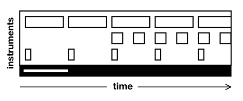
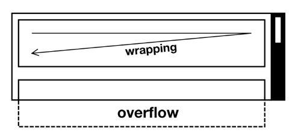
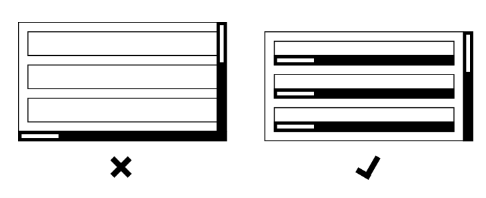
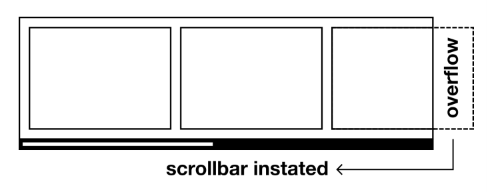
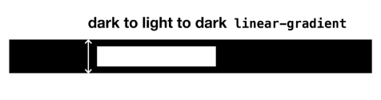
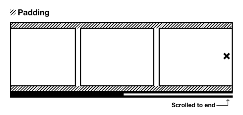
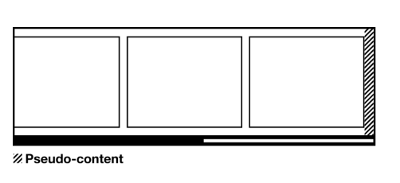
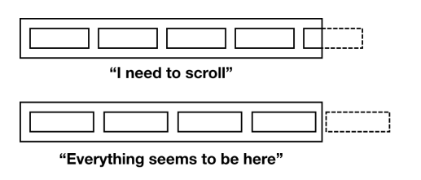

# The Reel

## El problema

Cuando estoy secuenciando música, no sé cuánto tiempo tendrá la pista que estoy creando hasta que termino. Mi software de secuenciación es consciente de esto y provisiona tiempo *bajo demanda*, a medida que agrego compases de sonido. Así como los secuenciadores de música provisionan tiempo dinámicamente, las páginas web provisionan espacio. Si todas las canciones tuvieran que durar cuatro minutos y veintiséis segundos, o todas las páginas web tuvieran `768px` de alto, bueno, eso sería innecesariamente restrictivo.



El mecanismo mediante el cual el espacio provisionado puede ser explorado dentro de un "viewport" fijo se llama *scrolling*. Sin él, los dispositivos de todos tendrían que ser exactamente del mismo tamaño, forma y nivel de aumento en todo momento. Escribir contenido para tal espacio se convertiría en un juego formalista, como escribir haiku. Gracias al scrolling, no tienes que preocuparte por el espacio al escribir contenido web. Escribir para impresión no tiene el mismo lujo.

El `writing-mode` CSS con el que probablemente estés más familiarizado es `horizontal-tb`. En este modo, el texto y los elementos inline progresan horizontalmente (ya sea de izquierda a derecha, como en inglés, o de derecha a izquierda) y los elementos block fluyen de arriba a abajo (esa es la parte `tb`). Dado que se instruye a los elementos de texto e inline para que *hagan wrap*, el desbordamiento horizontal que activaría el scrolling horizontal generalmente se evita. Debido a que no se permite que el contenido llegue *hacia afuera*, se resuelve llegando *hacia abajo*. La progresión vertical de los elementos block inevitablemente activa el scrolling vertical.



Como lector occidental, acostumbrado al modo de escritura `horizontal-tb`, el scrolling vertical es convencional y esperado. Cuando descubres que la página necesita ser desplazada verticalmente para ver todo el contenido, no piensas que algo ha salido mal. Cuando encuentras scrolling *horizontal*, no solo es inesperado sino que tiene claras implicaciones de usabilidad: donde el desbordamiento sigue la dirección de escritura, cada línea sucesiva de texto tiene que ser desplazada para ser leída.

Todo esto no quiere decir que el scrolling horizontal esté estrictamente prohibido dentro de un modo de escritura `horizontal-tb`. De hecho, donde se implementa deliberada y claramente, las secciones de desplazamiento horizontal dentro de una página de desplazamiento vertical pueden ser una forma ergonómica de navegar por el contenido. Los servicios de streaming de televisión tienden a diseccionar su contenido por categoría verticalmente y por programa horizontalmente, por ejemplo. Lo único que realmente quieres evitar son elementos individuales que se desplazan *bidireccionalmente*. Esto se considera una falla bajo el criterio *1.4.10 Reflow* de WCAG.



Formalicé un [*"carousel" accesible para la BBC* ↗](https://bbc.github.io/gel/components/carousels/) que — en lugar de diferir enteramente a JavaScript para la funcionalidad de navegación — simplemente invoca el scrolling nativo con `overflow`. Los botones de navegación proporcionados son meramente una mejora progresiva, e incrementan la posición de desplazamiento. El `Reel` de Every Layout es similar, pero prescinde del JavaScript para confiar únicamente en el comportamiento estándar de desplazamiento del navegador.

??? info "Explicacion"

    Claro. Esta sección de **Every Layout** está explicando el patrón **Reel**, pero antes de entrar al CSS, el autor quiere que entiendas **qué problema de layout está resolviendo**.

    __1. La idea principal: una página no tiene una altura fija__

    La comparación con la música es bastante buena.

    Imagina un secuenciador musical:

    * empiezas una canción;
    * al principio tienes 10 segundos;
    * agregas más compases;
    * ahora necesitas 30 segundos;
    * agregas más música;
    * ahora necesitas 4 minutos.

    El software **no decide desde el principio**:

    > "Esta canción va a medir exactamente 4:26."

    Simplemente va **provisionando espacio conforme lo necesita**.

    Una página web funciona igual:

    ```text
    ┌─────────────────────────┐
    │                         │
    │       contenido         │
    │                         │
    │                         │
    ├─────────────────────────┤ ← viewport
    │                         │
    └─────────────────────────┘

            ↓ scroll

    ┌─────────────────────────┐
    │       más contenido     │
    │                         │
    │                         │
    └─────────────────────────┘
    ```

    El viewport tiene un tamaño limitado, pero **el documento no**.

    Por eso no hacemos:

    ```css
    body {
      height: 768px;
    }
    ```

    porque estaríamos diciendo:

    > "Toda la web tiene que caber en 768 píxeles."

    Eso sería absurdo.

    ---

    __2. El navegador tiene dos espacios diferentes__

    Esta distinción es importante:

    __Viewport__

    Es la ventana que tienes disponible para ver la página.

    Por ejemplo:

    ```text
    1920 × 1080
    ```

    __Documento__

    Es todo el contenido de la página.

    Podría medir:

    ```text
    1920 × 5000
    ```

    Entonces:

    ```text
            VIEWPORT
    ┌───────────────────────┐
    │                       │
    │      contenido        │
    │                       │
    │                       │
    │                       │
    └───────────────────────┘
              ↓
            scroll
              ↓
    ┌───────────────────────┐
    │                       │
    │      contenido        │
    │                       │
    │                       │
    └───────────────────────┘
              ↓
              ...
    ```

    El **scrolling** es precisamente el mecanismo que permite explorar un documento que es más grande que el viewport.

    ---

    __3. ¿Por qué normalmente hacemos scroll vertical?__

    Aquí entra algo interesante: **CSS tiene modos de escritura**.

    El más habitual es:

    ```css
    writing-mode: horizontal-tb;
    ```

    Significa:

    ```text
    horizontal
        ↓
    de arriba hacia abajo
    ```

    Es decir, el texto avanza horizontalmente:

    ```text
    Hola, este es un texto que va →
    ```

    y cuando llega al límite:

    ```text
    Hola, este es un texto que va
    aquí continúa la siguiente línea
    y después otra línea
    ```

    Eso es el **wrap**.

    El contenido textual intenta evitar desbordarse horizontalmente.

    Por eso el crecimiento termina ocurriendo hacia abajo:

    ```text
    ┌──────────────────────┐
    │ línea 1               │
    │ línea 2               │
    │ línea 3               │
    │ línea 4               │
    │ línea 5               │
    │ ...                    │
    └──────────────────────┘
                ↓
            scroll
    ```

    Por eso el scroll vertical es tan natural en la web occidental.

    ---

    __4. ¿Y por qué el scroll horizontal suele ser problemático?__

    Imagina esto:

    ```text
    ┌─────────────────────────┐
    │ Este texto continúa →→→ │
    └─────────────────────────┘
                    →
                scroll
    ```

    Ahora tienes que desplazarte horizontalmente para terminar de leer **cada línea**.

    Sería bastante incómodo:

    ```text
    leer → scroll → leer → scroll → leer
    ```

    En cambio:

    ```text
    leer
    ↓
    leer
    ↓
    leer
    ↓
    scroll
    ↓
    leer
    ```

    es mucho más natural.

    Por eso el autor dice que el scrolling horizontal **no está prohibido**, pero normalmente no quieres que el contenido principal de lectura obligue al usuario a desplazarse horizontalmente.

    ---

    __5. Pero aquí viene la parte importante: horizontal puede ser excelente__

    El autor pone el ejemplo de Netflix y otros servicios de streaming.

    Imagina:

    ```text
    Películas populares

    ┌─────┐ ┌─────┐ ┌─────┐ ┌─────┐ ┌─────┐
    │  A  │ │  B  │ │  C  │ │  D  │ │  E  │ →
    └─────┘ └─────┘ └─────┘ └─────┘ └─────┘


    Series

    ┌─────┐ ┌─────┐ ┌─────┐ ┌─────┐ ┌─────┐
    │  F  │ │  G  │ │  H  │ │  I  │ │  J  │ →
    └─────┘ └─────┘ └─────┘ └─────┘ └─────┘
    ```

    Aquí tienes:

    * **vertical** para cambiar de categoría;
    * **horizontal** para explorar los elementos de una categoría.

    Y eso funciona muy bien.

    La diferencia es que el desplazamiento horizontal es **intencional**.

    ---

    __6. Lo que NO quieres: scroll bidireccional accidental__

    Este es el problema que realmente quiere evitar el autor.

    Supongamos que tienes:

    ```text
    ┌────────────────────────────┐
    │                            │
    │  contenido que no cabe →   │
    │                            │
    │                            │
    └────────────────────────────┘
                ↕
                ↔
    ```

    Ahora el usuario tiene que desplazarse:

    * verticalmente;
    * horizontalmente.

    Y peor todavía, **dentro del mismo contenido**.

    Esto puede convertirse en una pesadilla de UX.

    La regla mental sería:

    > **Scroll vertical para recorrer el documento; scroll horizontal solamente cuando el contenido horizontal lo justifica.**

    ---

    __7. Entonces aparece el Reel__

    Aquí está el concepto que tienes que llevarte.

    Un **Reel** es básicamente un contenedor de elementos que:

    1. se colocan en una fila;
    2. pueden superar el ancho disponible;
    3. **no hacen wrap**;
    4. permiten desplazamiento horizontal.

    Por ejemplo:

    ```text
    ┌───────────────────────────────┐
    │ ┌────┐ ┌────┐ ┌────┐ ┌────┐ →│
    │ │ 1  │ │ 2  │ │ 3  │ │ 4  │  │
    │ └────┘ └────┘ └────┘ └────┘  │
    └───────────────────────────────┘
    ```

    Hay más elementos de los que caben.

    En lugar de hacer:

    ```text
    1  2  3
    4  5  6
    ```

    el Reel conserva:

    ```text
    1  2  3  4  5  6  →
    ```

    y deja que el navegador haga el scrolling.

    ---

    __8. La magia realmente es `overflow`__

    El principio fundamental del Reel es algo conceptualmente parecido a:

    ```css
    .reel {
      display: flex;
      overflow-x: auto;
    }

    .reel > * {
      flex: 0 0 auto;
    }
    ```

    La primera regla:

    ```css
    overflow-x: auto;
    ```

    le dice al navegador:

    > "Si el contenido se vuelve más ancho que este elemento, permite desplazamiento horizontal."

    Y:

    ```css
    flex: 0 0 auto;
    ```

    evita que los hijos se encojan para intentar meterlos todos dentro.

    Por ejemplo:

    ```text
    contenedor
    ─────────────────────────────
    │ [A] [B] [C] [D] [E] [F] →│
    ─────────────────────────────
    ```

    El contenedor podría medir:

    ```text
    500px
    ```

    pero sus hijos juntos:

    ```text
    900px
    ```

    Entonces el navegador no destruye el layout.

    Simplemente dice:

    > "Perfecto. Hay 400px que no caben. Los puedes explorar mediante scroll."

    Eso es **provisionar espacio bajo demanda**, exactamente como la metáfora de la pista musical.

    ---

    __9. ¿Por qué el Reel no necesita JavaScript?__

    Esta es probablemente la parte más bonita del enfoque de **Every Layout**.

    Un desarrollador podría pensar:

    > "Necesito un carrusel. Voy a hacer un componente JavaScript."

    Y terminar con:

    ```text
    ← botón
      ↓
    [ A ][ B ][ C ][ D ]
      ↑
    JavaScript
      ↓
    posición = posición + 300
    ```

    Pero el autor dice:

    **¿Y si el navegador ya sabe hacer esto?**

    El navegador ya proporciona:

    ```css
    overflow-x: auto;
    ```

    Por lo tanto:

    ```text
    usuario
      ↓
    scroll horizontal
      ↓
    navegador
      ↓
    contenido desplazado
    ```

    No necesitas construir un sistema de scrolling desde cero.

    ---

    __10. ¿Y los botones de navegación?__

    El ejemplo de la BBC va un paso más allá.

    Puedes tener:

    ```text
                        →
    ┌──────────────────────────────┐
    │ [A] [B] [C] [D] [E]         │
    └──────────────────────────────┘
    ```

    y agregar botones:

    ```text
    ←                         →
    ```

    Pero los botones **no son los que hacen posible el carrusel**.

    Son una mejora.

    La funcionalidad fundamental sigue siendo:

    ```css
    overflow-x: auto;
    ```

    Si JavaScript desaparece:

    ```text
    ❌ botones
    ❌ comportamiento adicional

    pero:

    ✅ scroll nativo sigue funcionando
    ```

    Eso es **progressive enhancement**.

    ---

    __11. La filosofía de Every Layout detrás de esto__

    Y aquí conecta perfectamente con todo lo que has estado estudiando.

    Every Layout intenta decir:

    > **No empieces pensando en cómo programar el componente. Empieza pensando en qué comportamiento ya proporciona el navegador.**

    En este caso:

    __Enfoque tradicional__

    ```text
    "Necesito un carousel"

            ↓

    JavaScript

            ↓

    estado

            ↓

    botones

            ↓

    transform: translateX()

            ↓

    responsive hacks

            ↓

    más código
    ```

    __Enfoque Reel__

    ```text
    "Necesito una fila de elementos
    que pueda explorar horizontalmente"

            ↓

    flex

            ↓

    overflow-x: auto

            ↓

    FIN
    ```

    Y solamente después, si realmente aporta valor:

    ```text
    + botones
    + scroll snapping
    + indicadores
    + JS
    ```

    ---

    __La idea que quiero que te quede__

    Piensa en **Reel** como:

    > **"Una fila que deliberadamente puede ser más grande que su contenedor y que se explora horizontalmente mediante el scrolling nativo."**

    Visualmente:

    ```text
    CONTENEDOR
    ┌────────────────────────────────┐
    │                                │
    │  [A] [B] [C] [D] [E] [F] →    │
    │                                │
    └────────────────────────────────┘
              ↑
        viewport del Reel

          contenido real
    ──────────────────────────────────────→
    ```

    Y esto es importante: **Reel no intenta hacer que todo quepa**.

    Eso lo diferencia de muchos layouts responsivos que has visto.

    El Reel dice:

    > **"No voy a comprimir, encoger ni envolver necesariamente los elementos. Si no caben, los dejo fuera del viewport y permito que el usuario los explore."**

    Es una solución muy elegante para cosas como **carruseles de productos, tarjetas, películas, artículos relacionados, imágenes, categorías, etc.**

    Y encaja con la filosofía que vienes aprendiendo en *Every Layout*: **el layout no debería depender de conocer de antemano el tamaño exacto de la pantalla.**


## La solución

Como establecimos en *The Cluster*, una forma eficiente de cambiar la dirección del flujo de bloque es crear un contexto Flexbox. Al aplicar `display: flex` a un elemento, sus hijos cambiarán de progresar *hacia abajo* a progresar *hacia la derecha* — al menos donde la escritura predeterminada LTR (left-to-right) está en efecto.

Al omitir la declaración a menudo complementaria `flex-wrap: wrap`, los elementos se ven obligados a mantener una formación de una sola fila. Cuando esta línea de contenido es más larga de lo que el elemento padre es ancho, ocurre desbordamiento. Por defecto, esto hará que la página misma se desplace horizontalmente. No queremos eso, porque es solo nuestro contenido Flexbox el que realmente necesita desplazamiento. Sería mejor que todo lo demás se quede quieto. Entonces, en su lugar, aplicamos `overflow: auto` al elemento Flex, que invoca automáticamente el desplazamiento *solo* en ese elemento y solo donde el desbordamiento realmente ocurre.

```css linenums="1"
.reel {
  display: flex;
  /* ↓ Solo queremos desplazamiento horizontal */
  overflow-x: auto;
}
```



Todavía tengo que abordar la *affordance* (hacer que el elemento se vea desplazable), y también está el tema del espaciado que abordar, pero este es el núcleo del layout. Debido a que capitaliza el comportamiento estándar del navegador, es extremadamente conciso en código y robusto — bastante diferente del carousel/slider promedio de jQuery.

??? info "Explicacion"

    Exactamente. Esta parte es la que convierte toda la explicación anterior en **una solución CSS muy pequeña**. Vamos línea por línea.

    __1. Primero: `display: flex`__

    El autor dice:

    > una forma eficiente de cambiar la dirección del flujo de bloque es crear un contexto Flexbox.

    Normalmente, los elementos `block` se colocan uno debajo de otro:

    ```html
    <div>A</div>
    <div>B</div>
    <div>C</div>
    ```

    produce conceptualmente:

    ```text
    A
    B
    C
    ```

    Pero cuando haces:

    ```css
    .reel {
      display: flex;
    }
    ```

    los hijos pasan a formar una fila:

    ```text
    A  B  C
    ```

    ¿Por qué?

    Porque Flexbox, por defecto, tiene:

    ```css
    flex-direction: row;
    ```

    Así que:

    ```css
    display: flex;
    ```

    cambia el eje principal de los hijos.

    ```text
    ANTES: flujo block

    [A]
    [B]
    [C]

    DESPUÉS: flex

    [A] [B] [C]
    ```

    ---

    __2. ¿Por qué dice que progresan "hacia la derecha"?__

    Porque el ejemplo está suponiendo el modo de escritura habitual:

    ```css
    writing-mode: horizontal-tb;
    direction: ltr;
    ```

    Es decir:

    ```text
    left → right
    ```

    Por eso:

    ```css
    display: flex;
    ```

    produce:

    ```text
    [A] → [B] → [C] → [D]
    ```

    Pero conceptualmente es mejor pensar en **"row"** y no en "derecha".

    Flexbox trabaja con ejes:

    ```text
    main axis →
    cross axis
        ↓
    ```

    En el caso normal:

    ```css
    flex-direction: row;
    ```

    el eje principal es horizontal.

    ---

    __3. Ahora viene una parte MUY importante: `flex-wrap`__

    Por defecto, Flexbox tiene:

    ```css
    flex-wrap: nowrap;
    ```

    Es decir:

    > "No hagas otra fila."

    Supongamos que tienes:

    ```html
    <div class="reel">
      <article>A</article>
      <article>B</article>
      <article>C</article>
      <article>D</article>
      <article>E</article>
    </div>
    ```

    Si el contenedor es suficientemente pequeño:

    ```text
    ┌─────────────────────────┐
    │ A   B   C   D   E       │
    └─────────────────────────┘
    ```

    Los elementos pueden superar el ancho disponible.

    Y eso es **precisamente lo que queremos**.

    ---

    __4. ¿Qué ocurriría si usáramos `flex-wrap: wrap`?__

    Tendríamos:

    ```css
    .reel {
      display: flex;
      flex-wrap: wrap;
    }
    ```

    Y entonces:

    ```text
    ┌─────────────────────────┐
    │ A   B   C               │
    │ D   E                   │
    └─────────────────────────┘
    ```

    El contenido se reorganizaría para intentar mantenerse dentro del contenedor.

    Pero **Reel no quiere eso**.

    Quiere:

    ```text
    A B C D E F G H →
    ```

    una sola fila.

    Por eso el autor dice:

    > "Al omitir la declaración `flex-wrap: wrap`, los elementos se ven obligados a mantener una formación de una sola fila."

    En realidad, técnicamente no es que "omitir `flex-wrap: wrap`" haga algo especial: estás aprovechando el valor predeterminado:

    ```css
    flex-wrap: nowrap;
    ```

    ---

    __5. Entonces aparece el overflow__

    Supongamos:

    ```text
    Ancho del Reel: 500px

    Contenido:
    800px
    ```

    Tenemos:

    ```text
                500px
          ┌───────────────┐
          │ A B C D E F → │
          └───────────────┘
                        ↑
                  300px fuera
    ```

    Los elementos **no caben**.

    Eso es:

    > **overflow**

    Es decir, el contenido desborda el área disponible.

    ---

    __6. ¿Qué ocurre si no hacemos nada?__

    Aquí está el detalle importante.

    Si simplemente haces:

    ```css
    .reel {
      display: flex;
    }
    ```

    y los hijos necesitan más espacio que el viewport, el desbordamiento puede terminar afectando al **documento completo**.

    Conceptualmente:

    ```text
    ┌──────────────────────────────┐
    │ página                       │
    │                              │
    │ Reel → → → → → → → →        │
    │                              │
    └──────────────────────────────┘
                            →
                        scroll de página
    ```

    Entonces cuando haces scroll horizontal:

    **se mueve toda la página.**

    Eso es lo que el autor no quiere.

    ---

    __7. Queremos encapsular el scrolling__

    La solución es:

    ```css
    .reel {
      display: flex;
      overflow-x: auto;
    }
    ```

    Ahora le estamos diciendo al navegador:

    > "Si el contenido de `.reel` es demasiado ancho, permite desplazamiento horizontal **dentro de `.reel`**."

    Así:

    ```text
    Página
    ┌────────────────────────────────────┐
    │                                    │
    │  ┌──────────────────────────────┐  │
    │  │ A  B  C  D  E  F  G  →      │  │
    │  └──────────────────────────────┘  │
    │                                    │
    │  Otro contenido                    │
    │                                    │
    └────────────────────────────────────┘
    ```

    El Reel tiene su propio viewport.

    Cuando haces scroll:

    ```text
    ┌──────────────────────────────┐
    │ A B C D E F →                │
    └──────────────────────────────┘
                ↑
            solo Reel
    ```

    El resto de la página permanece quieto.

    ---

    __8. ¿Por qué `overflow-x` y no simplemente `overflow`?__

    El autor utiliza:

    ```css
    overflow-x: auto;
    ```

    porque quiere dejar muy clara la intención:

    > "El problema que estoy resolviendo es el overflow horizontal."

    Además, `auto` significa:

    > "Si hace falta scrolling, créalo. Si no hace falta, no."

    Por ejemplo:

    ### Poco contenido

    ```text
    ┌─────────────────────────┐
    │ A  B  C                 │
    └─────────────────────────┘
    ```

    No necesitas scroll.

    ### Mucho contenido

    ```text
    ┌─────────────────────────┐
    │ A  B  C  D  E  F  →    │
    └─────────────────────────┘
    ```

    Ahora aparece la posibilidad de desplazarse.

    Eso es muy elegante.

    ---

    __9. Fíjate en lo poco que necesita__

    El núcleo completo del Reel es:

    ```css
    .reel {
      display: flex;
      overflow-x: auto;
    }
    ```

    Y ya tienes:

    ```text
    ┌─────────────────────────────┐
    │ [1] [2] [3] [4] [5] →       │
    └─────────────────────────────┘
    ```

    No necesitas:

    ```text
    JavaScript
    + estado
    + botones obligatorios
    + cálculo de posiciones
    + translateX()
    + listeners
    + resize handlers
    + detectar viewport
    + lógica de touch
    ```

    El navegador ya sabe hacer scrolling.

    ---

    __10. Aquí está la filosofía de Every Layout__

    Esta frase es probablemente la más importante:

    > "Debido a que capitaliza el comportamiento estándar del navegador..."

    Eso significa:

    **No estás programando un comportamiento que el navegador ya tiene.**

    Estás componiendo capacidades nativas:

    ```text
    Flexbox
      +
    overflow
      +
    scrolling nativo
      =
    Reel
    ```

    Y eso produce un componente muy resistente.

    ---

    __11. ¿Qué significa "robusto"?__

    Supongamos que cambia el tamaño de la pantalla:

    __Desktop__

    ```text
    ┌────────────────────────────────────┐
    │ A  B  C  D  E  F                  │
    └────────────────────────────────────┘
    ```

    Todos caben.

    No ocurre nada especial.

    __Tablet__

    ```text
    ┌──────────────────────────┐
    │ A  B  C  D  E  →        │
    └──────────────────────────┘
    ```

    Aparece overflow.

    Puedes desplazarte.

    __Móvil__

    ```text
    ┌────────────────┐
    │ A  B  C  →     │
    └────────────────┘
    ```

    También funciona.

    Y **no escribiste ningún breakpoint**.

    Eso conecta directamente con todo lo que has estado estudiando de *Every Layout*:

    > **El layout responde a sus propias restricciones, no a una lista de tamaños de dispositivos.**

    ---

    __12. Pero todavía faltan dos cosas__

    El autor dice:

    > "Todavía tengo que abordar la affordance ... y también está el tema del espaciado."

    Es decir, esto:

    ```css
    .reel {
      display: flex;
      overflow-x: auto;
    }
    ```

    resuelve **el mecanismo**, pero no necesariamente **la experiencia visual**.

    __Affordance__

    El usuario debe poder darse cuenta de:

    > "Oye, aquí hay más contenido hacia la derecha."

    Porque si tienes:

    ```text
    ┌──────────────────────────┐
    │ [A] [B] [C]              │
    └──────────────────────────┘
    ```

    el usuario podría pensar:

    > "Ah, solo existen A, B y C."

    Aunque realmente existan:

    ```text
    [A] [B] [C] [D] [E] [F]
    ```

    Entonces posteriormente Every Layout aborda cómo hacer **visible/intuitivo** ese desplazamiento.

    __Espaciado__

    También necesitamos controlar la separación:

    ```text
    [A] [B] [C] [D]
        ↑
      gap
    ```

    Probablemente mediante `gap`, padding, etc.

    Pero esas son capas adicionales.

    El **motor fundamental** ya está resuelto:

    ```css
    .reel {
      display: flex;
      overflow-x: auto;
    }
    ```

    __Qué debes recordar__

    Si quieres memorizar Reel en una sola frase:

    > **Flexbox mantiene los elementos en una fila; `overflow-x: auto` convierte el exceso horizontal en un scroll local.**

    O visualmente:

    ```text
                    FLEX
                      ↓
    [A] [B] [C] [D] [E] [F]
    ───────────────────────────
            ↑
          contenedor
            ↓
    ┌─────────────────────┐
    │ [A] [B] [C] [D] →  │
    └─────────────────────┘
            ↑
    overflow-x: auto
    ```

    Y esa es la verdadera genialidad del patrón: **no intenta hacer desaparecer el contenido que no cabe; acepta que no cabe y le da al usuario una forma natural de explorarlo.**

## La barra de desplazamiento

El desplazamiento es funcionalidad multimodal: hay muchas formas de hacerlo, y puedes elegir la que mejor te convenga. Mientras que el tacto, los gestos del trackpad y las pulsaciones de teclas de flecha pueden ser algunos de los modos más ergonómicos, hacer clic y arrastrar la barra de desplazamiento misma es probablemente la más familiar, especialmente para usuarios mayores en desktop.

Tener una barra de desplazamiento visible tiene dos ventajas:

1. Permite el desplazamiento arrastrando el control deslizante (o "thumb")
2. Indica que el desplazamiento está disponible por este y otros medios (aumenta la *affordance*)

Algunos sistemas operativos y navegadores ocultan la barra de desplazamiento por defecto, pero hay métodos CSS para revelarla. Los navegadores basados en Webkit y Blink ofrecen las siguientes propiedades prefijadas:

```css linenums="1"
::-webkit-scrollbar {}
::-webkit-scrollbar-button {}
::-webkit-scrollbar-track {}
::-webkit-scrollbar-track-piece {}
::-webkit-scrollbar-thumb {}
::-webkit-scrollbar-corner {}
::-webkit-resizer {}
```

A partir de la versión 64, también hay oportunidades limitadas para estilizar la barra de desplazamiento en Firefox, con las propiedades estandarizadas `scrollbar-color` y `scrollbar-width`. Nota que la configuración de `scrollbar-color` solo tiene efecto en MacOS donde *Show scroll bars* está establecido a *Always* (en *Settings > General*).

Establecer colores de la barra de desplazamiento es cuestión de estética, que no es realmente de lo que trata Every Layout. Pero es importante, por razones de *affordance*, que las barras de desplazamiento sean *aparentes*. Los siguientes estilos en blanco y negro se eligen solo para adaptarse a la estética propia de Every Layout. Puedes ajustarlos como desees.

```css linenums="1"
.reel {
  display: flex;
  /* ↓ Solo queremos desplazamiento horizontal */
  overflow-x: auto;
  /* ↓ Primer valor: thumb; segundo valor: track */
  scrollbar-color: var(--color-light) var(--color-dark);
}
.reel::-webkit-scrollbar {
  height: 1rem;
}
.reel::-webkit-scrollbar-track {
  background-color: var(--color-dark);
}
.reel::-webkit-scrollbar-thumb {
  background-color: var(--color-dark);
  background-image: linear-gradient(var(--color-dark) 0, var(--color-dark) 0.25rem, var(--color-light) 0.25rem, var(--color-light) 0.75rem, var(--color-dark) 0.75rem);
}
```

No todas las propiedades son compatibles con estas pseudo-clases propietarias. Por lo tanto, visualmente el thumb es cuestión de pintar una franja centrada usando un `linear-gradient` en lugar de intentar un margen o borde.



??? info "Explicacion"

    Sí. Aquí el autor está resolviendo **la segunda parte del Reel** que mencionó antes: no basta con que el contenido se pueda desplazar; hay que darle al usuario una pista clara de que **se puede desplazar**.

    Eso es lo que llama **affordance**.

    ---

    __1. ¿Qué es *affordance* aquí?__

    Es, básicamente:

    > **Una señal visual que le dice al usuario cómo puede interactuar con algo.**

    Por ejemplo, un botón:

    ```text
    ┌──────────────┐
    │   GUARDAR    │
    └──────────────┘
    ```

    Tiene apariencia de botón.

    Un enlace subrayado:

    ```text
    Ver más
    ────────
    ```

    te sugiere que puedes hacer clic.

    Con un Reel tenemos otro problema:

    ```text
    ┌───────────────────────────┐
    │ [A] [B] [C]               │
    └───────────────────────────┘
    ```

    El usuario podría pensar:

    > "Ah, solamente hay A, B y C."

    Pero realmente hay:

    ```text
    [A] [B] [C] [D] [E] [F] [G]
    ```

    Por eso necesitamos hacer evidente:

    > **"Aquí hay más contenido horizontal."**

    ---

    __2. ¿Por qué habla de la barra de desplazamiento?__

    Porque la scrollbar es una señal visual extremadamente clara.

    Por ejemplo:

    ```text
    ┌───────────────────────────┐
    │ [A] [B] [C] [D] [E]      │
    ├───────────────────────────┤
    │ █████████░░░░░░░░░░░░░░░ │
    └───────────────────────────┘
    ```

    El usuario ve inmediatamente:

    * hay un área desplazable;
    * el contenido continúa;
    * puede arrastrar el `thumb`.

    Y aquí aparecen los dos beneficios que menciona el autor.

    ### 1. Es un mecanismo de interacción

    Puedes agarrar:

    ```text
    ██████
      ↑
    thumb
    ```

    y arrastrarlo.

    __2. Es una indicación visual__

    Aunque nunca arrastres el thumb, la barra te comunica:

    > "Esto se puede desplazar."

    Por eso tiene valor como **affordance**.

    ---

    __3. El `thumb` y el `track`__

    Esta terminología es importante.

    La barra completa:

    ```text
    ────────────────────────────────
    ```

    se llama **track**.

    El indicador que puedes arrastrar:

    ```text
    ████
    ```

    se llama **thumb**.

    Conceptualmente:

    ```text
    TRACK
    ┌─────────────────────────────────┐
    │██████                           │
    └─────────────────────────────────┘
      ↑
    THUMB
    ```

    El `thumb` representa aproximadamente **qué parte del contenido estás viendo**.

    Por ejemplo:

    ```text
    Contenido total:
    [A][B][C][D][E][F][G][H][I][J]

    Viewport:
    [A][B][C]

    Scrollbar:
    ████░░░░░░░░░░░
    ```

    Como solamente estás viendo una pequeña parte del contenido, el thumb es relativamente pequeño.

    Si casi todo el contenido cabe:

    ```text
    [A][B][C][D][E]

    ████████████░░
    ```

    el thumb será más grande.

    El navegador calcula esto automáticamente.

    ---

    __4. ¿Por qué menciona diferentes formas de hacer scroll?__

    Porque **scrolling no significa necesariamente agarrar la barra**.

    Puedes desplazarte mediante:

    * rueda del mouse;
    * touch;
    * trackpad;
    * teclas de flecha;
    * Page Up / Page Down;
    * arrastre de scrollbar;
    * gestos;
    * etc.

    Por eso dice que es una funcionalidad **multimodal**.

    El Reel no debería depender de una sola forma de interacción.

    La idea es:

    ```text
                  Reel
                    │
          ┌────────┼────────┐
          ↓        ↓        ↓
        mouse    trackpad   touch
          │        │        │
          └────────┼────────┘
                    ↓
                scroll
    ```

    Y eso es muy importante para accesibilidad.

    ---

    __5. Ahora llegamos al CSS__

    Primero:

    ```css
    .reel {
      display: flex;
      overflow-x: auto;
      scrollbar-color: var(--color-light) var(--color-dark);
    }
    ```

    Ya conoces las dos primeras:

    ```css
    display: flex;
    ```

    crea la fila.

    ```css
    overflow-x: auto;
    ```

    hace que esa fila pueda desplazarse horizontalmente.

    Ahora aparece:

    ```css
    scrollbar-color:
      var(--color-light)
      var(--color-dark);
    ```

    Esto controla los colores de la scrollbar en navegadores que soportan esta propiedad.

    El comentario lo explica:

    ```text
    primer valor → thumb
    segundo valor → track
    ```

    Así que:

    ```css
    scrollbar-color: light dark;
    ```

    significa conceptualmente:

    ```text
    ┌──────────────────────────────┐
    │██████                        │
    └──────────────────────────────┘
      ↑              ↑
    thumb          track
    ```

    ---

    __6. ¿Por qué después aparece `::-webkit-scrollbar`?__

    Porque históricamente los navegadores basados en WebKit/Blink utilizan pseudo-elementos específicos para personalizar la scrollbar.

    Por ejemplo:

    ```css
    .reel::-webkit-scrollbar {
      height: 1rem;
    }
    ```

    Aquí están diciendo:

    > "La barra horizontal tendrá `1rem` de altura."

    Visualmente:

    ```text
    ┌─────────────────────────────┐
    │       contenido             │
    ├─────────────────────────────┤
    │████████░░░░░░░░░░░░░░░░░░  │ ← 1rem
    └─────────────────────────────┘
    ```

    ¿Por qué `height`?

    Porque la scrollbar es **horizontal**.

    Para una scrollbar vertical normalmente controlarías el ancho.

    ---

    __7. El `track`__

    Después:

    ```css
    .reel::-webkit-scrollbar-track {
      background-color: var(--color-dark);
    }
    ```

    Esto pinta el **track**.

    Conceptualmente:

    ```text
    ████████████████████████████
    ```

    Todo el fondo de la barra.

    ---

    __8. El `thumb`__

    Luego:

    ```css
    .reel::-webkit-scrollbar-thumb {
      background-color: var(--color-dark);
      background-image: linear-gradient(
        var(--color-dark) 0,
        var(--color-dark) 0.25rem,
        var(--color-light) 0.25rem,
        var(--color-light) 0.75rem,
        var(--color-dark) 0.75rem
      );
    }
    ```

    Esta parte parece mucho más complicada de lo que realmente es.

    El autor quiere que el thumb tenga una **franja clara en el centro**.

    Algo parecido a:

    ```text
    ██████████████████████
    ██████████████████████
    ░░░░░░░░░░░░░░░░░░░░░░
    ░░░░░░░░░░░░░░░░░░░░░░
    ██████████████████████
    ██████████████████████
    ```

    La franja clara está centrada verticalmente.

    ---

    __9. ¿Por qué no usa `margin` o `border`?__

    Esta es una de las partes más interesantes.

    Uno podría pensar:

    > "Simplemente pongo un borde o un margen para separar el thumb."

    Pero las pseudo-clases de scrollbar **no soportan todas las propiedades CSS de la misma manera**.

    Por eso el autor utiliza un truco:

    ```css
    background-image: linear-gradient(...)
    ```

    Es decir:

    > **No estoy creando realmente una franja independiente; estoy pintando el fondo del thumb de manera que parezca que existe una franja.**

    ---

    __10. Entendamos el `linear-gradient`__

    Esta parte:

    ```css
    linear-gradient(
      var(--color-dark) 0,
      var(--color-dark) 0.25rem,
      var(--color-light) 0.25rem,
      var(--color-light) 0.75rem,
      var(--color-dark) 0.75rem
    )
    ```

    puedes leerla como instrucciones de pintura.

    __De `0` a `0.25rem`__

    ```text
    dark
    ```

    __De `0.25rem` a `0.75rem`__

    ```text
    light
    ```

    __Desde `0.75rem` en adelante__

    ```text
    dark
    ```

    Entonces:

    ```text
    0
    ↓
    ████████  dark
    ████████  dark
    ░░░░░░░░  light
    ░░░░░░░░  light
    ████████  dark
    ████████  dark
    ↑
    ```

    Eso crea una línea clara en el centro.

    ---

    __11. ¿Por qué es un `linear-gradient` si no parece un degradado?__

    ¡Exacto!

    Normalmente pensamos:

    ```css
    linear-gradient(black, white);
    ```

    y obtenemos una transición gradual:

    ```text
    ████▓▓▒▒░░░░
    ```

    Pero aquí las posiciones están definidas de manera que los cambios son abruptos:

    ```css
    dark 0
    dark 0.25rem
    light 0.25rem
    light 0.75rem
    dark 0.75rem
    ```

    Así obtenemos algo parecido a bloques sólidos:

    ```text
    dark
    dark
    ──────
    light
    light
    ──────
    dark
    dark
    ```

    Es básicamente un **gradient usado como herramienta de dibujo**, no como degradado visual.

    ---

    __12. ¿Por qué todo este esfuerzo?__

    Porque el objetivo de Every Layout no es:

    > "Hacer una scrollbar bonita."

    El objetivo es:

    > **hacer evidente que el Reel se puede desplazar.**

    La estética:

    ```css
    var(--color-light)
    var(--color-dark)
    ```

    es secundaria.

    La función principal es:

    ```text
    Usuario ve Reel
          ↓
    Ve scrollbar
          ↓
    Entiende que hay contenido oculto
          ↓
    Sabe que puede desplazarse
          ↓
    Explora el contenido
    ```

    Eso es **affordance**.

    ---

    __13. La idea completa del Reel hasta ahora__

    Ya podemos construir mentalmente las capas.

    __Capa 1 — Crear la fila__

    ```css
    display: flex;
    ```

    ```text
    [A] [B] [C] [D] [E]
    ```

    __Capa 2 — Impedir que se convierta en varias filas__

    El comportamiento predeterminado:

    ```css
    flex-wrap: nowrap;
    ```

    ```text
    [A] [B] [C] [D] [E] →
    ```

    __Capa 3 — Encerrar el overflow__

    ```css
    overflow-x: auto;
    ```

    ```text
    ┌──────────────────────┐
    │ [A] [B] [C] [D] →   │
    └──────────────────────┘
    ```

    __Capa 4 — Hacer visible la posibilidad de scroll__

    Scrollbar:

    ```text
    ┌──────────────────────┐
    │ [A] [B] [C] [D] →   │
    ├──────────────────────┤
    │ ███████░░░░░░░░░░░░ │
    └──────────────────────┘
    ```

    Y esa es la evolución que está siguiendo el capítulo:

    ```text
    Reel
    │
    ├── Flexbox
    │      ↓
    │   una sola fila
    │
    ├── overflow-x: auto
    │      ↓
    │   scrolling local
    │
    ├── scrollbar
    │      ↓
    │   affordance
    │
    └── spacing
            ↓
        presentación
    ```

    **La filosofía sigue siendo la misma:** primero resuelves el comportamiento con las capacidades nativas del navegador; después agregas presentación y mejoras. No construyes un Ferrari de JavaScript para hacer lo que el navegador ya hace gratis.

## Altura

¿Cuál debería ser la altura de una instancia de `Reel`? Probablemente más corta que el viewport, para que todo el `Reel` pueda verse en la pantalla.

Pero, ¿deberíamos establecer una altura en absoluto? Probablemente no. La mejor respuesta es *tan alto como necesite ser*, y es una cuestión de la altura del *contenido*.

En la siguiente demostración, un elemento `Reel` alberga un conjunto de componentes tipo tarjeta. La altura del `Reel` está determinada por la altura de la tarjeta más alta, que es la tarjeta con más contenido. Nota que el último elemento de cada "tarjeta" (una simple atribución) se empuja al fondo del espacio, usando un `Stack` con `splitAfter="2"`.

[*Esta demostración interactiva solo está disponible en el sitio de Every Layout* ↗](https://every-layout.dev/demos/reel-cards/).

Para imágenes, que pueden ser muy grandes o usar diferentes relaciones de aspecto, es posible que queramos establecer la altura del `Reel`. La imagen común debe tener la `height` correspondientemente establecida a `100%` y el `width` a `auto`. Esto asegurará que las imágenes compartan una altura pero mantengan su propia relación de aspecto.

```css linenums="1"
.reel {
  height: 50vh;
}
.reel > img {
  height: 100%;
  width: auto;
}
```

[*Esta demostración interactiva solo está disponible en el sitio de Every Layout* ↗](https://every-layout.dev/demos/reel-images/).

??? info "Explicacion"

    Aquí el autor está resolviendo una pregunta muy concreta:

    > **Si un Reel es horizontal, ¿qué altura debería tener?**

    Y la respuesta de Every Layout es bastante coherente con todo lo anterior: **no fijes una altura si el contenido puede determinarla por sí mismo.**

    ---

    __1. El Reel tiene dos dimensiones diferentes__

    Hasta ahora nos hemos concentrado en el **ancho**:

    ```text
    ┌───────────────────────────────┐
    │ [A] [B] [C] [D] [E] →        │
    └───────────────────────────────┘
    ```

    El ancho puede quedarse corto, y entonces aparece:

    ```css
    overflow-x: auto;
    ```

    Pero ahora tenemos que decidir la **altura**:

    ```text
                  altura
                    ↓
            ┌───────────────┐
            │               │
            │   contenido   │
            │               │
            └───────────────┘
                  ancho →
    ```

    La pregunta es:

    > ¿Ponemos `height: 300px`? ¿`400px`? ¿`50vh`?

    Para tarjetas normales, el autor dice: **ninguna de esas.**

    ---

    __2. La altura debería venir del contenido__

    La idea es:

    > **"Tan alto como necesite ser."**

    Supongamos que tenemos tarjetas:

    ```text
    ┌────────┐ ┌────────┐ ┌────────┐
    │        │ │        │ │        │
    │ Card A │ │ Card B │ │ Card C │
    │        │ │        │ │        │
    │        │ │ texto  │ │        │
    │        │ │ texto  │ │        │
    │        │ │ texto  │ │        │
    └────────┘ └────────┘ └────────┘
    ```

    La tarjeta B tiene más contenido.

    Entonces:

    ```text
              altura del Reel
                    ↓
    ┌────────┐ ┌────────┐ ┌────────┐
    │        │ │        │ │        │
    │ Card A │ │ Card B │ │ Card C │
    │        │ │ texto  │ │        │
    │        │ │ texto  │ │        │
    │        │ │ texto  │ │        │
    │        │ │ texto  │ │        │
    └────────┘ └────────┘ └────────┘
                    ↑
              tarjeta más alta
    ```

    El Reel termina teniendo la altura de la tarjeta más alta.

    No necesitas decir:

    ```css
    height: 400px;
    ```

    El navegador puede resolverlo mediante el layout normal.

    ---

    __3. Esto es importante: no confundas `height` con `min-height`__

    El autor no está diciendo:

    > "La altura siempre debe ser automática."

    Está diciendo:

    > **No establezcas una altura artificial cuando el contenido puede determinarla correctamente.**

    En otras palabras, si tienes:

    ```html
    <div class="reel">
      <article>...</article>
      <article>...</article>
      <article>...</article>
    </div>
    ```

    y las tarjetas tienen diferentes alturas, Flexbox permite que el Reel se adapte.

    Conceptualmente:

    ```text
    Reel
    │
    ├── Card A → 300px
    ├── Card B → 450px  ← más alta
    └── Card C → 350px

    Reel → 450px
    ```

    ---

    __4. ¿Por qué es mejor esto?__

    Porque evita que tengas que adivinar.

    Supongamos que haces:

    ```css
    .reel {
      height: 350px;
    }
    ```

    Y mañana el contenido cambia.

    Antes:

    ```text
    Card = 320px
    Reel = 350px
    ```

    Perfecto.

    Pero después:

    ```text
    Card = 480px
    Reel = 350px
    ```

    Ahora tienes un problema.

    El contenido ya no cabe.

    Tendrías que empezar a pensar:

    ```text
    ¿overflow?
    ¿altura mínima?
    ¿media queries?
    ¿qué pasa en móvil?
    ¿qué pasa si cambia el texto?
    ```

    En cambio:

    ```text
    altura = contenido
    ```

    es mucho más resistente.

    ---

    __5. Esto conecta directamente con la filosofía de Every Layout__

    Es el mismo principio que has visto en los otros layouts:

    **No deberías establecer dimensiones arbitrarias cuando el contenido puede determinar la dimensión.**

    Por ejemplo:

    ❌ Mentalidad tradicional:

    ```css
    .card {
      height: 400px;
    }
    ```

    Porque:

    > "En mi diseño la tarjeta mide 400px."

    Every Layout prefiere:

    ```text
    ¿Cuánto necesita medir?
            ↓
    El contenido determina eso.
    ```

    Es un cambio de mentalidad bastante importante.

    ---

    __6. Pero hay una excepción: imágenes__

    Aquí viene el segundo caso.

    Las imágenes son diferentes porque pueden tener tamaños y relaciones de aspecto muy diferentes.

    Supongamos:

    ```text
    Imagen A → 16:9
    Imagen B → 4:3
    Imagen C → 1:1
    Imagen D → 3:2
    ```

    Si simplemente las colocas:

    ```text
    ┌────────────┐ ┌──────────┐ ┌───────┐
    │            │ │          │ │       │
    │    16:9    │ │   4:3    │ │  1:1  │
    │            │ │          │ │       │
    └────────────┘ └──────────┘ └───────┘
    ```

    las alturas podrían variar.

    Para un Reel de imágenes, quizá quieres:

    > **Todas las imágenes deben tener la misma altura.**

    Pero sin deformarlas.

    ---

    __7. Ahí sí tiene sentido establecer una altura__

    El ejemplo dice:

    ```css
    .reel {
      height: 50vh;
    }
    ```

    Aquí `vh` significa:

    > **viewport height**

    Por lo tanto:

    ```css
    50vh
    ```

    significa aproximadamente:

    > 50% de la altura del viewport.

    Si tu viewport mide:

    ```text
    800px
    ```

    entonces:

    ```text
    50vh ≈ 400px
    ```

    Visualmente:

    ```text
    ┌──────────────────────────────┐
    │                              │
    │         viewport             │
    │                              │
    │  ┌────────────────────────┐  │
    │  │                        │  │
    │  │         Reel           │  │ ← 50vh
    │  │                        │  │
    │  └────────────────────────┘  │
    │                              │
    └──────────────────────────────┘
    ```

    ---

    __8. Ahora viene la parte interesante: `height: 100%`__

    Para las imágenes:

    ```css
    .reel > img {
      height: 100%;
      width: auto;
    }
    ```

    Esto significa:

    ```text
    altura de imagen
          ↓
    igual a la altura del Reel
    ```

    Si:

    ```css
    .reel {
      height: 50vh;
    }
    ```

    entonces:

    ```css
    .reel > img {
      height: 100%;
    }
    ```

    hace que cada imagen ocupe toda esa altura.

    ---

    __9. ¿Por qué `width: auto`?__

    Esta es la parte clave.

    Supongamos que tienes una imagen:

    ```text
    1000 × 500
    ```

    Su relación de aspecto es:

    ```text
    2:1
    ```

    Si le dices:

    ```css
    height: 400px;
    width: auto;
    ```

    el navegador calcula automáticamente el ancho proporcional:

    ```text
    1000 × 500
        ↓
    800 × 400
    ```

    No la deformará.

    Visualmente:

    ```text
    ┌────────────────┐
    │                │
    │     imagen     │
    │                │
    └────────────────┘
          800×400
    ```

    Ahora otra imagen:

    ```text
    500 × 500
    ```

    con:

    ```css
    height: 400px;
    width: auto;
    ```

    será:

    ```text
    400 × 400
    ```

    Y otra:

    ```text
    500 × 1000
    ```

    será aproximadamente:

    ```text
    200 × 400
    ```

    Así todas comparten:

    ```text
    altura = 400px
    ```

    pero conservan sus proporciones.

    ---

    __10. El resultado__

    Imagina un Reel con imágenes de diferentes proporciones:

    ```text
                mismo alto
                    ↓
    ┌──────┐ ┌──────────────┐ ┌──────┐ ┌──────────┐
    │      │ │              │ │      │ │          │
    │      │ │              │ │      │ │          │
    │  A   │ │      B       │ │  C   │ │    D     │
    │      │ │              │ │      │ │          │
    │      │ │              │ │      │ │          │
    └──────┘ └──────────────┘ └──────┘ └──────────┘
        ←──── todas tienen la misma altura ────→
    ```

    Pero sus anchos son diferentes.

    Eso es exactamente lo que queremos.

    ---

    __11. ¿Por qué `width: 100%` sería mala idea?__

    Porque estarías diciendo:

    > "Todas las imágenes deben tener exactamente el ancho del contenedor."

    Y eso podría deformarlas o provocar otros problemas dependiendo del resto de las reglas.

    En cambio:

    ```css
    height: 100%;
    width: auto;
    ```

    dice:

    > **"Todas tendrán la misma altura; calcula el ancho que corresponda a cada una."**

    Es una distinción fundamental.

    ---

    __12. Entonces tenemos dos estrategias__

    __Reel de contenido/tarjetas__

    No fijamos altura:

    ```css
    .reel {
      display: flex;
      overflow-x: auto;
    }
    ```

    La altura viene del contenido:

    ```text
    tarjeta más alta
          ↓
    altura del Reel
    ```

    __Reel de imágenes__

    Podemos fijar una altura:

    ```css
    .reel {
      height: 50vh;
    }

    .reel > img {
      height: 100%;
      width: auto;
    }
    ```

    Porque queremos una restricción visual concreta:

    ```text
    TODAS
      ↓
    misma altura
      ↓
    diferente ancho
      ↓
    misma proporción
    ```

    ---

    __La regla mental que te conviene guardar__

    **Para contenido normal:**

    > Deja que el contenido determine la altura.

    **Para una galería de imágenes:**

    > Puedes establecer una altura común y dejar que `width: auto` preserve la relación de aspecto.

    Y fíjate en cómo *Every Layout* vuelve a evitar una cosa que te has encontrado varias veces en estos capítulos: **poner dimensiones fijas porque sí**.

    La pregunta no es:

    > "¿Qué altura debería tener mi componente?"

    Sino:

    > **"¿Qué restricción necesita realmente este componente?"**

    Para tarjetas: ninguna altura artificial.

    Para imágenes: una altura común puede ser precisamente la restricción que hace que el sistema funcione.

## Selectores hijo versus descendiente

Nota cómo estamos usando `.reel > img` y no `.reel img`. Solo queremos afectar el diseño de las imágenes *si* son descendientes directos (o *hijos*) del `Reel`. De ahí, el combinador de hijo `>`.

??? info "Explicacion"

    Sí. Esta parte parece pequeña, pero es **muy importante para escribir CSS que no produzca efectos secundarios**.

    La diferencia está entre:

    ```css
    .reel > img
    ```

    y:

    ```css
    .reel img
    ```

    La clave es entender **hijo directo** vs **descendiente**.

    ---

    __1. `.reel > img`: hijo directo__

    Mira este HTML:

    ```html
    <div class="reel">
      
      
      
    </div>
    ```

    La estructura es:

    ```text
    .reel
    ├── img
    ├── img
    └── img
    ```

    Los `img` están **directamente dentro** de `.reel`.

    Por eso:

    ```css
    .reel > img {
      height: 100%;
      width: auto;
    }
    ```

    selecciona esas imágenes.

    El símbolo:

    ```css
    >
    ```

    significa:

    > **"selecciona solamente los hijos directos."**

    ---

    __2. `.reel img`: cualquier descendiente__

    Ahora imagina:

    ```html
    <div class="reel">
      <article>
        
      </article>
    </div>
    ```

    La estructura es:

    ```text
    .reel
    └── article
        └── img
    ```

    El `img` **no es hijo directo** de `.reel`.

    Es un **descendiente**.

    Pero esto:

    ```css
    .reel img {
      height: 100%;
      width: auto;
    }
    ```

    sí lo seleccionaría.

    Porque el espacio significa:

    > **"Busca cualquier `img` que esté dentro de `.reel`, sin importar cuántos niveles haya."**

    ---

    __3. Visualmente__

    ### Selector hijo

    ```css
    .reel > img
    ```

    solo:

    ```text
    .reel
    ├── img       ✅
    ├── img       ✅
    └── article
        └── img   ❌
    ```

    __Selector descendiente__

    ```css
    .reel img
    ```

    selecciona:

    ```text
    .reel
    ├── img       ✅
    ├── img       ✅
    └── article
        └── img   ✅
    ```

    ---

    __4. ¿Por qué Every Layout prefiere `>` aquí?__

    Porque el autor quiere expresar una intención muy concreta:

    > **"Estas reglas son para las imágenes que forman parte directamente del Reel."**

    No quiere decir:

    > "Cualquier imagen que algún día aparezca dentro del Reel debe recibir estas dimensiones."

    Esto es mucho más seguro.

    Por ejemplo, podrías tener:

    ```html
    <div class="reel">
      

      <article>
        <h2>Artículo</h2>
        
      </article>
    </div>
    ```

    Con:

    ```css
    .reel img {
      height: 100%;
      width: auto;
    }
    ```

    terminarías afectando **ambas imágenes**.

    Pero:

    ```css
    .reel > img {
      height: 100%;
      width: auto;
    }
    ```

    solo afecta:

    ```text
    foto1.jpg ✅
    autor.jpg ❌
    ```

    Eso evita efectos secundarios.

    ---

    __5. Esto conecta con una idea importante de CSS__

    Cuando escribes:

    ```css
    .reel img
    ```

    estás diciendo algo bastante amplio:

    > "Todas las imágenes que estén dentro de Reel."

    Cuando escribes:

    ```css
    .reel > img
    ```

    estás diciendo:

    > "Las imágenes que son parte estructural inmediata de Reel."

    El segundo selector expresa mejor la **estructura que esperas**.

    Y eso es precisamente lo que busca *Every Layout*: que los componentes sean **predecibles y resistentes a cambios**.

    ---

    __6. Una forma fácil de recordarlo__

    Piensa en una familia:

    ```text
    PADRE
    │
    ├── HIJO
    │   └── NIETO
    │
    └── HIJO
    ```

    __`>` significa:__

    > **"Mi hijo directo."**

    ```css
    .padre > .hijo
    ```

    Solo selecciona:

    ```text
    padre
    ├── hijo      ✅
    └── hijo      ✅
    ```

    No:

    ```text
    hijo
    └── nieto     ❌
    ```

    __Un espacio significa:__

    > **"Cualquier descendiente mío."**

    ```css
    .padre .nieto
    ```

    puede encontrar:

    ```text
    padre
    └── hijo
        └── nieto  ✅
    ```

    ---

    __Y aquí hay una razón de diseño importante__

    Esto:

    ```css
    .reel > img
    ```

    hace que el **contrato del componente** sea más claro:

    ```text
    Reel
    │
    ├── imagen → recibe el tratamiento especial
    ├── imagen → recibe el tratamiento especial
    └── imagen → recibe el tratamiento especial
    ```

    Mientras que:

    ```css
    .reel img
    ```

    es más permisivo:

    ```text
    Reel
    │
    ├── imagen → afectada
    ├── tarjeta
    │   └── imagen → también afectada
    └── componente
        └── otra cosa
            └── imagen → también afectada
    ```

    Por eso, cuando sabes exactamente qué nivel de la estructura quieres afectar, **`>` suele ser una elección más precisa**.

    En una frase:

    > **`>` = hijo directo. Espacio = cualquier descendiente.**

    Y en el Reel, `>` está diciendo explícitamente: **"solo las imágenes que son elementos del Reel, no imágenes que estén enterradas dentro de otros componentes."**

## Espaciado

Espaciar los elementos hijos solía ser un asunto sorprendentemente complicado. Se aplica un borde alrededor del `Reel` en este caso, para darle su forma.

Hasta hace poco, habríamos tenido que usar `margin` y el combinador de hermano adyacente para agregar espacio entre los elementos hijos:

```css linenums="1"
.reel > * + * {
  margin-left: var(--s1);
}
```

Ahora, dado que estamos en un contexto Flexbox, también podemos usar la propiedad `gap`, que se aplica al padre:

Sin embargo, el contenido del `Reel` no está diseñado para envolverse, por lo que usaremos la solución basada en `margin` en su lugar. Es más larga y mejor soportada.

Agregar espaciado *alrededor* de los elementos hijos (entre ellos y el elemento padre) es un asunto más complicado. Desafortunadamente, el `padding` del `.reel` [interactúa inesperadamente con el scrolling ↗](https://www.brunildo.org/test/overscrollback.html). El efecto en el lado derecho es como si no hubiera padding en absoluto.



Entonces, si queremos espaciado alrededor de los hijos, adoptamos un enfoque diferente. Agregamos margen a todos excepto al lado derecho de cada elemento hijo, luego insertamos espacio usando pseudo-contenido en el último de esos hijos.

```css linenums="1"
.reel {
  border-width: var(--border-thin);
}
.reel > * {
  margin: var(--s0);
  margin-right: 0;
}
.reel::after {
  content: '';
  flex-basis: var(--s0);
  /* ↓ El valor predeterminado es 1, por lo que necesita ser anulado */
  flex-shrink: 0;
}
```

??? info "Explicacion"

    Esta parte es probablemente la más "tramposa" del Reel, porque entra en un problema real de CSS: **el `padding` de un contenedor con scroll horizontal no siempre se comporta como uno esperaría**.

    Vamos por partes.

    ---

    __1. Primero: ¿cómo separamos las tarjetas?__

    Imagina:

    ```text
    [A][B][C][D]
    ```

    Queremos:

    ```text
    [A]  [B]  [C]  [D]
        ↑    ↑    ↑
        espacio
    ```

    Una forma antigua de hacerlo era:

    ```css
    .reel > * + * {
      margin-left: var(--s1);
    }
    ```

    Este selector merece atención.

    ---

    __2. ¿Qué significa `.reel > * + *`?__

    Vamos a descomponerlo.

    __`>`__

    Ya lo vimos:

    ```css
    .reel > *
    ```

    significa:

    > todos los hijos directos de `.reel`.

    El `*` significa:

    > cualquier elemento.

    Así:

    ```text
    .reel
    ├── A  ← *
    ├── B  ← *
    ├── C  ← *
    └── D  ← *
    ```

    ---

    __Ahora `+`__

    El combinador:

    ```css
    A + B
    ```

    significa:

    > **B que viene inmediatamente después de A.**

    Por ejemplo:

    ```html
    <div>A</div>
    <div>B</div>
    <div>C</div>
    ```

    Entonces:

    ```css
    div + div
    ```

    selecciona:

    ```text
    A
    B ← seleccionado
    C ← seleccionado
    ```

    No selecciona el primero.

    ---

    __3. Entonces `.reel > * + *`__

    Significa:

    > **"Selecciona todos los hijos directos de `.reel` excepto el primero."**

    Por ejemplo:

    ```text
    .reel
    ├── A       ❌
    ├── B       ✅
    ├── C       ✅
    └── D       ✅
    ```

    Entonces:

    ```css
    .reel > * + * {
      margin-left: var(--s1);
    }
    ```

    produce:

    ```text
    [A] [B] [C] [D]
        ↑   ↑   ↑
        gap gap gap
    ```

    Es una técnica CSS clásica.

    ---

    __4. ¿Por qué no usar `gap`?__

    Porque estamos en Flexbox.

    Normalmente podríamos hacer:

    ```css
    .reel {
      display: flex;
      gap: var(--s1);
    }
    ```

    Mucho más limpio:

    ```text
    [A]  [B]  [C]  [D]
    ```

    Y el autor reconoce precisamente eso:

    > Ahora que estamos en un contexto Flexbox, podemos usar `gap`.

    Pero...

    ---

    __5. El problema: el Reel no hace wrap__

    Aquí está la razón por la que el autor decide conservar `margin`.

    Un Reel es una fila que puede ser más ancha que su contenedor:

    ```text
    ┌──────────────────────────┐
    │ [A] [B] [C] [D] [E] →   │
    └──────────────────────────┘
    ```

    El contenido está pensado para **no envolverse**.

    Por eso el autor prefiere:

    ```css
    .reel > * + * {
      margin-left: var(--s1);
    }
    ```

    aunque sea más largo.

    La lógica es muy *Every Layout*:

    > Si una técnica aparentemente más moderna introduce problemas en un caso concreto, utiliza la técnica más robusta para ese comportamiento.

    No se trata de usar `gap` porque sea más nuevo.

    Se trata de usar lo que mejor resuelva **este layout**.

    ---

    __6. Ahora viene el problema realmente interesante: `padding`__

    Supongamos que quieres esto:

    ```text
    ┌──────────────────────────────────────┐
    │                                      │
    │  [A]  [B]  [C]  [D]  [E]            │
    │                                      │
    └──────────────────────────────────────┘
    ↑                                    ↑
    padding                            padding
    ```

    Lo natural sería:

    ```css
    .reel {
      padding: var(--s0);
    }
    ```

    Y aparentemente debería funcionar.

    Pero con un contenedor que tiene scrolling horizontal:

    ```css
    .reel {
      overflow-x: auto;
    }
    ```

    el comportamiento del `padding` en el extremo de desplazamiento puede ser inesperado.

    ---

    __7. ¿Qué problema ocurre?__

    Imagina que tienes:

    ```text
    ┌──────────────────────────┐
    │ [A] [B] [C] [D] [E] →   │
    └──────────────────────────┘
    ```

    Quieres que después de `E` exista:

    ```text
    ┌──────────────────────────┐
    │ [A] [B] [C] [D] [E]  ... │
    └──────────────────────────┘
                            ↑
                          espacio
    ```

    Pero el `padding-right` del Reel puede no producir ese espacio final como intuitivamente esperarías al llegar al extremo del scroll.

    Es decir, visualmente terminas con algo parecido a:

    ```text
    [A] [B] [C] [D] [E]
                      ↑
                demasiado pegado
                al final
    ```

    Este es el problema que muestra la imagen del libro.

    ---

    __8. Entonces Every Layout cambia la estrategia__

    En vez de decir:

    > "Voy a poner espacio **dentro del contenedor**."

    dice:

    > **"Voy a poner espacio como parte del contenido desplazable."**

    Esta diferencia es fundamental.

    En vez de:

    ```text
    CONTENEDOR
    ┌──────────────────────────────┐
    │ padding [A][B][C][D] padding │
    └──────────────────────────────┘
    ```

    hacemos:

    ```text
    CONTENIDO DEL REEL
    [A] [B] [C] [D] [ESPACIO]
    ```

    Ese espacio **forma parte de la fila que se desplaza**.

    ---

    __9. Primera parte de la solución__

    Tenemos:

    ```css
    .reel > * {
      margin: var(--s0);
      margin-right: 0;
    }
    ```

    Esto significa que cada hijo recibe:

    ```text
    margin-left
    margin-top
    margin-bottom
    ```

    y también inicialmente:

    ```text
    margin-right
    ```

    pero después hacemos:

    ```css
    margin-right: 0;
    ```

    Así que, en la práctica, cada elemento obtiene margen alrededor, excepto en el lado derecho.

    Conceptualmente:

    ```text
      margen
        ↓
      [ A ]
    ↑     ↑
        margen
    ```

    Pero el margen derecho se elimina porque vamos a controlar el espacio entre elementos de otra forma.

    ---

    __10. ¿Por qué eliminar `margin-right`?__

    Porque queremos que el último elemento tenga un espacio especial después de él.

    Tenemos:

    ```text
    [A] [B] [C] [D]
    ```

    y queremos:

    ```text
    [A] [B] [C] [D]   ← espacio final
    ```

    En vez de darle a cada elemento:

    ```text
    [A]  [B]  [C]  [D]
          ↑    ↑    ↑
    ```

    incluimos un elemento invisible al final.

    ---

    __11. Ese elemento es `::after`__

    Aquí está la parte ingeniosa:

    ```css
    .reel::after {
      content: '';
      flex-basis: var(--s0);
      flex-shrink: 0;
    }
    ```

    Aunque parece extraño, piensa en `::after` como si el Reel tuviera un hijo adicional:

    ```text
    .reel
    ├── A
    ├── B
    ├── C
    ├── D
    └── ::after   ← espacio invisible
    ```

    Visualmente:

    ```text
    [A] [B] [C] [D] [      ]
                    espacio
    ```

    Y ese espacio **también forma parte del contenido que puede desplazarse**.

    ---

    __12. ¿Qué hace `content: ''`?__

    Esto:

    ```css
    content: '';
    ```

    hace que exista el pseudo-elemento `::after`.

    Sin `content`, normalmente el pseudo-elemento no se genera.

    Ahora tenemos un elemento flex invisible.

    ---

    __13. ¿Qué hace `flex-basis`?__

    Esto es importante porque ya has estado estudiando Flexbox.

    ```css
    flex-basis: var(--s0);
    ```

    Le dice:

    > **"Mi tamaño inicial en el eje principal es `var(--s0)`."**

    Como nuestro Reel es:

    ```css
    flex-direction: row;
    ```

    el eje principal es horizontal.

    Por lo tanto:

    ```css
    flex-basis: var(--s0);
    ```

    significa aproximadamente:

    > "Quiero ocupar `var(--s0)` de ancho."

    Así:

    ```text
    [A] [B] [C] [D] [          ]
                          ↑
                        --s0
    ```

    No necesitamos contenido real.

    El elemento existe principalmente para **crear espacio**.

    ---

    __14. ¿Por qué `flex-shrink: 0`?__

    Esta línea es importantísima:

    ```css
    flex-shrink: 0;
    ```

    Recuerda que Flexbox puede intentar encoger los elementos.

    Por defecto:

    ```css
    flex-shrink: 1;
    ```

    Así que si tenemos un elemento cuyo tamaño base es:

    ```text
    100px
    ```

    Flexbox podría reducirlo si fuera necesario.

    Pero nosotros queremos que el espacio final sea realmente:

    ```text
    var(--s0)
    ```

    No queremos:

    ```text
    var(--s0)
          ↓
    "Bueno, como no cabe, lo reduzco a 0."
    ```

    Por eso:

    ```css
    flex-shrink: 0;
    ```

    significa:

    > **"No me reduzcas."**

    ---

    __15. Hay una pequeña sutileza importante__

    El comentario del libro dice:

    ```css
    /* ↓ El valor predeterminado es 1, por lo que necesita ser anulado */
    flex-shrink: 0;
    ```

    Porque si no lo hacemos:

    ```css
    flex-shrink: 1;
    ```

    y el espacio final podría comprimirse.

    Queremos que sea un espacio **real y estable**.

    ---

    __16. ¿Qué hemos conseguido?__

    Tenemos algo así:

    ```text
    REEL
    ┌────────────────────────────────────┐
    │ [A]  [B]  [C]  [D]  [E]           │
    └────────────────────────────────────┘
                                      ↑
                                espacio final
    ```

    Y cuando desplazamos:

    ```text
                    ↓ scroll

    ┌────────────────────────────────────┐
    │ [B]  [C]  [D]  [E]               │
    └────────────────────────────────────┘
                                      ↑
                                  espacio
    ```

    El espacio final se puede alcanzar porque **forma parte del contenido desplazable**.

    Ese es el truco.

    ---

    __17. La solución completa__

    La idea queda:

    ```css
    .reel {
      display: flex;
      overflow-x: auto;
      border-width: var(--border-thin);
    }

    .reel > * {
      margin: var(--s0);
      margin-right: 0;
    }

    .reel::after {
      content: '';
      flex-basis: var(--s0);
      flex-shrink: 0;
    }
    ```

    Mentalmente:

    ```text
                    REEL
    ┌──────────────────────────────────────────┐
    │                                          │
    │  [A]   [B]   [C]   [D]   [E]   espacio  │
    │   ↑     ↑     ↑     ↑     ↑       ↑     │
    │ margin margin margin margin margin  ::after
    │                                          │
    └──────────────────────────────────────────┘
                        →
                    scroll horizontal
    ```

    ---

    __18. ¿Por qué esto es tan interesante?__

    Porque vuelve a aparecer una filosofía central de *Every Layout*:

    __No luches contra el navegador.__

    El autor podría haber intentado:

    ```text
    padding
      ↓
    problema
      ↓
    JavaScript
      ↓
    calcular scrollWidth
      ↓
    añadir espacio
      ↓
    más código
    ```

    En lugar de eso:

    ```text
    padding tiene comportamiento incómodo
                  ↓
    hacemos que el espacio sea
    parte del contenido
                  ↓
    pseudo-elemento flex
                  ↓
    scroll nativo
    ```

    Mucho más sencillo y robusto.

    ---

    __La idea que debes quedarte__

    Hay **dos problemas distintos**:

    __Espacio entre elementos__

    ```text
    [A]  [B]  [C]  [D]
    ```

    Se puede resolver tradicionalmente con:

    ```css
    .reel > * + * {
      margin-left: var(--s1);
    }
    ```

    aunque `gap` normalmente sería más corto.

    __Espacio al final del Reel__

    No confiamos en:

    ```css
    padding-right
    ```

    porque puede interactuar mal con el scrolling.

    En su lugar hacemos:

    ```text
    [A] [B] [C] [D] [ESPACIO]
                        ↑
                    ::after
    ```

    mediante:

    ```css
    .reel::after {
      content: '';
      flex-basis: var(--s0);
      flex-shrink: 0;
    }
    ```

    **La clave conceptual es esta:** el espacio final no es `padding`; es **un elemento invisible dentro de la propia fila desplazable**. Por eso el navegador lo considera parte del contenido y puedes llegar hasta él haciendo scroll.

## ⚠ Estilos de borde en cascada

Aquí, solo estamos aplicando el ancho del borde, y no el color o estilo del borde. Para que esto tenga efecto, el `border-style` tiene que estar aplicado en algún lugar ya. En la hoja de estilo propia de Every Layout, el `border-style` se aplica *universalmente*, haciendo que el `border-width` sea la única preocupación continua para la mayoría de los casos de borde:

```css linenums="1"
*,
*::before,
*::after {
  border-style: solid;
  /* ↓ 0 por defecto */
  border-width: 0;
}
```



La implementación a seguir asume que no necesitas padding en el elemento `Reel` en sí mismo; el enfoque usando `.reel > * + *` por lo tanto es suficiente.

Eso solo deja el espacio entre los hijos y la barra de desplazamiento (donde está presente y visible) para manejar. No es un problema, podrías pensar: solo agrega algo de padding en la parte inferior del padre (`class="reel"` aquí). El problema es que esto crea un espacio redundante donde el `Reel` no se está desbordando y la barra de desplazamiento no se ha invocado.

Idealmente, habría una pseudo-clase para elementos con desbordamiento/scroll. Entonces podríamos agregar el padding selectivamente. Actualmente, el [*`:overflowed-content` pseudo-class* ↗](https://github.com/w3c/csswg-drafts/issues/2011) existe como poco más que una idea. Por ahora, podemos aplicar el margen y eliminarlo usando JavaScript y un simple `ResizeObserver`. Innatamente, esta es una técnica de mejora progresiva: donde JavaScript no está disponible, o `ResizeObserver` no es compatible, el padding no aparece para un `Reel` con desbordamiento — pero con poco efecto detrimental. Solo presiona la barra de desplazamiento contra el contenido.

```javascript linenums="1"
const reels = Array.from(document.querySelectorAll('.reel'));
const toggleOverflowClass = elem => {
  elem.classList.toggle('overflowing', elem.scrollWidth > elem.clientWidth);
};
for (let reel of reels) {
  if ('ResizeObserver' in window) {
    new ResizeObserver(entries => {
      toggleOverflowClass(entries[0].target);
    }).observe(reel);
  }
}
```

Dentro del observer, el `scrollWidth` del `Reel` se compara con su `clientWidth`. Si el `scrollWidth` es más grande, la clase `overflowing` se agrega.

```css linenums="1"
.reel.overflowing {
  padding-bottom: var(--s0);
}
```
??? info "Explicacion"

    Aquí el autor está entrando en **el último detalle del Reel**: qué hacer con el espacio entre el contenido y la barra de desplazamiento.

    Y además aprovecha para enseñar dos conceptos muy buenos: **la cascada de los estilos de borde** y **cómo detectar overflow con JavaScript sin romper el comportamiento si JS no está disponible**.

    ---

    __1. Primero: ¿qué significa `border-width` sin `border-style`?__

    Tenemos:

    ```css
    .reel {
      border-width: var(--border-thin);
    }
    ```

    A primera vista podrías pensar:

    > "Perfecto, ya tengo un borde."

    Pero no necesariamente.

    CSS necesita varias propiedades para que un borde sea visible:

    ```css
    border-width
    border-style
    border-color
    ```

    Por ejemplo:

    ```css
    border-width: 1px;
    border-style: solid;
    border-color: black;
    ```

    Si haces solamente:

    ```css
    border-width: 1px;
    ```

    pero tienes:

    ```css
    border-style: none;
    ```

    el borde no aparece.

    ---

    __2. Entonces Every Layout establece el estilo universalmente__

    Su hoja de estilos tiene:

    ```css
    *,
    *::before,
    *::after {
      border-style: solid;
      border-width: 0;
    }
    ```

    Esto significa:

    > "Todos los elementos tienen borde sólido por defecto, pero con ancho `0`."

    Así:

    ```text 
    border-style → solid
    border-width → 0
    ```

    Por defecto no ves nada.

    Pero luego puedes hacer:

    ```css
    .reel {
      border-width: 1px;
    }
    ```

    Y automáticamente tienes:

    ```text 
    border-style → solid
    border-width → 1px
    ```

    El borde aparece.

    ---

    __3. ¿Por qué dice que esto es "cascada"?__

    Porque `.reel` solamente está proporcionando:

    ```css
    border-width
    ```

    mientras que una regla más general:

    ```css
    *
    ```

    ya proporcionó:

    ```css
    border-style
    ```

    Es una combinación:

    ```text 
    Regla universal
          ↓
    border-style: solid

          +

    Regla específica
          ↓
    .reel → border-width: 1px

          ↓

    Borde visible
    ```

    Esto es precisamente aprovechar la **cascada de CSS**.

    ---

    __4. Ahora volvemos al Reel__

    El autor dice que su solución anterior funciona suponiendo:

    > **No necesitas `padding` dentro del propio Reel.**

    Es decir, puedes tener:

    ```text 
    ┌─────────────────────────────┐
    │ [A] [B] [C] [D]            │
    └─────────────────────────────┘
    ```

    y controlar el espacio entre los elementos mediante:

    ```css 
    .reel > * + * {
      margin-left: var(--s1);
    }
    ```

    Pero ahora aparece otro problema.

    ---

    __5. Queremos separar las tarjetas de la scrollbar__

    Cuando existe overflow:

    ```text 
    ┌──────────────────────────────┐
    │ [A]  [B]  [C]  [D]  [E] →  │
    ├──────────────────────────────┤
    │████████████░░░░░░░░░░░░░░░░│
    └──────────────────────────────┘
    ```

    El contenido está demasiado cerca de la scrollbar.

    Idealmente queremos:

    ```text 
    ┌──────────────────────────────┐
    │ [A]  [B]  [C]  [D]  [E] →  │
    │                              │
    ├──────────────────────────────┤
    │████████████░░░░░░░░░░░░░░░░│
    └──────────────────────────────┘
    ```

    Es decir:

    ```text 
    contenido
      ↓
    espacio
      ↓
    scrollbar
    ```

    ---

    __6. La solución obvia sería `padding-bottom`__

    Podríamos pensar:

    ```css 
    .reel {
      padding-bottom: var(--s0);
    }
    ```

    Y cuando hay scrollbar:

    ```text 
    contenido
    ──────────
    padding
    ──────────
    scrollbar
    ```

    Perfecto.

    **Pero aparece un problema.**

    ---

    __7. El padding aparecería aunque NO haya overflow__

    Recuerda que tenemos:

    ```css 
    overflow-x: auto;
    ```

    `auto` significa:

    > "Solo necesito scrollbar si el contenido realmente desborda."

    Supongamos que tenemos pocas tarjetas:

    ```text 
    ┌──────────────────────────────┐
    │ [A] [B] [C]                 │
    │                              │
    │                              │ ← padding innecesario
    └──────────────────────────────┘
    ```

    No hay scrollbar.

    Pero nuestro:

    ```css 
    padding-bottom: var(--s0);
    ```

    seguiría creando espacio.

    Entonces tenemos:

    ```text
    NO OVERFLOW
        ↓
    NO SCROLLBAR
        ↓
    pero...
        ↓
    PADDING
        ↓
    espacio vacío innecesario
    ```

    Eso es lo que el autor quiere evitar.

    ---

    __8. Lo ideal sería poder preguntar a CSS:__

    > "¿Este elemento está desbordando?"

    Algo conceptualmente como:

    ```css
    .reel:overflowing {
      padding-bottom: var(--s0);
    }
    ```

    Pero CSS no tiene actualmente una pseudo-clase estándar de ese tipo.

    El texto menciona una propuesta/idea:

    ```text
    :overflowed-content
    ```

    pero no es una herramienta estándar disponible para utilizar de forma general.

    Entonces...

    **JavaScript entra en escena.**

    Pero de una manera bastante elegante.

    ---

    __9. La estrategia: JavaScript solamente mejora el componente__

    El código comienza:

    ```javascript
    const reels = Array.from(
      document.querySelectorAll('.reel')
    );
    ```

    Esto busca todos los elementos:

    ```html
    <div class="reel">
    ```

    y los convierte en un array.

    Si tienes:

    ```text
    Reel 1
    Reel 2
    Reel 3
    ```

    obtienes:

    ```text
    reels = [Reel1, Reel2, Reel3]
    ```

    ---

    __10. La función importante__

    Después:

    ```javascript
    const toggleOverflowClass = elem => {
      elem.classList.toggle(
        'overflowing',
        elem.scrollWidth > elem.clientWidth
      );
    };
    ```

    Esta es realmente la parte que debes entender.

    Tenemos dos propiedades:

    ```javascript
    elem.scrollWidth
    ```

    y:

    ```javascript
    elem.clientWidth
    ```

    ---

    __11. `clientWidth`__

    `clientWidth` representa aproximadamente:

    > **el ancho visible/interno disponible del elemento.**

    Por ejemplo:

    ```text id="lh44ju"
    ┌──────────────────────┐
    │                      │
    │      viewport        │
    │                      │
    └──────────────────────┘
            ↑
        clientWidth
    ```

    Supongamos:

    ```javascript
    clientWidth = 500;
    ```

    ---

    __12. `scrollWidth`__

    `scrollWidth` representa el ancho total que necesitaría el contenido para estar disponible completamente.

    Supongamos:

    ```text id="g4d9qn"
    Contenido real:

    [A][B][C][D][E][F][G]
    ←──────── 800px ────────→
    ```

    Entonces:

    ```javascript
    scrollWidth = 800;
    ```

    Mientras:

    ```javascript
    clientWidth = 500;
    ```

    Tenemos:

    ```text id="1f2d8y"
    scrollWidth
    800
      >
    clientWidth
    500
    ```

    Por lo tanto:

    > **Hay overflow horizontal.**

    ---

    __13. La comparación es la clave__

    El código hace:

    ```javascript
    elem.scrollWidth > elem.clientWidth
    ```

    Si:

    ```text id="3sj3ar"
    800 > 500
    ```

    es:

    ```javascript
    true
    ```

    Entonces:

    ```javascript
    elem.classList.toggle('overflowing', true);
    ```

    agrega:

    ```html
    class="reel overflowing"
    ```

    ---

    Si:

    ```text id="q4h3mb"
    400 > 500
    ```

    es:

    ```javascript
    false
    ```

    Entonces:

    ```javascript
    elem.classList.toggle('overflowing', false);
    ```

    quita la clase.

    ---

    __14. ¿Qué hace `classList.toggle` con el segundo argumento?__

    Esta sintaxis:

    ```javascript
    element.classList.toggle(
      'overflowing',
      condicion
    );
    ```

    es muy útil.

    Es prácticamente:

    ```text id="xw9n3v"
    condición true
        ↓
    AGREGAR clase

    condición false
        ↓
    QUITAR clase
    ```

    Por eso el código puede ser tan compacto.

    ---

    __15. Ahora aparece `ResizeObserver`__

    Esta parte:

    ```javascript
    if ('ResizeObserver' in window) {
    ```

    pregunta:

    > "¿Este navegador soporta `ResizeObserver`?"

    Si no:

    ```text id="f8t9eq"
    No ResizeObserver
          ↓
    no JS adicional
          ↓
    Reel sigue funcionando
    ```

    Eso es **progressive enhancement**.

    ---

    __16. ¿Qué hace `ResizeObserver`?__

    Observa cambios en el tamaño de un elemento.

    Por ejemplo:

    ```text id="7r5kmb"
    Reel
    500px
      ↓
    observando...
      ↓
    700px
      ↓
    observando...
      ↓
    400px
    ```

    Cada vez que cambia su tamaño, ejecuta una función.

    Aquí:

    ```javascript
    new ResizeObserver(entries => {
      toggleOverflowClass(entries[0].target);
    }).observe(reel);
    ```

    En palabras humanas:

    > **"Observa este Reel y cada vez que cambie su tamaño, vuelve a comprobar si tiene overflow."**

    ---

    __17. ¿Por qué necesitamos observar el tamaño?__

    Porque el overflow puede cambiar dinámicamente.

    Por ejemplo:

    __Desktop__

    ```text
    Reel = 1000px
    Contenido = 800px

    800 < 1000
    ```

    No hay overflow.

    Luego reduces la ventana:

    ```text
    Reel = 500px
    Contenido = 800px

    800 > 500
    ```

    Ahora sí hay overflow.

    El JavaScript detecta el cambio y añade:

    ```html
    class="overflowing"
    ```

    ---

    __18. Finalmente, CSS utiliza esa clase__

    Tenemos:

    ```css 
    .reel.overflowing {
      padding-bottom: var(--s0);
    }
    ```

    Por tanto:

    __Sin overflow__

    ```html
    <div class="reel">
    ```

    No hay padding inferior.

    __Con overflow__

    ```html
    <div class="reel overflowing">
    ```

    se aplica:

    ```css
    padding-bottom: var(--s0);
    ```

    Visualmente:

    ```text 
    SIN OVERFLOW

    ┌─────────────────────────┐
    │ [A] [B] [C]            │
    └─────────────────────────┘
    ```

    y:

    ```text 
    CON OVERFLOW

    ┌─────────────────────────┐
    │ [A] [B] [C] [D] →      │
    │                         │
    ├─────────────────────────┤
    │████████░░░░░░░░░░░░░░░│
    └─────────────────────────┘
    ```

    Ahora el espacio solamente existe cuando tiene sentido.

    ---

    __19. Y aquí está lo bonito: JavaScript no controla el scroll__

    Esto es muy importante.

    El JavaScript **no está haciendo esto**:

    ```javascript
    scrollLeft += 300;
    ```

    No está moviendo el Reel.

    No está implementando el carrusel.

    No está reemplazando el scrolling nativo.

    Solo responde una pregunta:

    > **"¿Hay overflow?"**

    Y añade una clase.

    El navegador sigue encargándose completamente de:

    ```css
    overflow-x: auto;
    ```

    ---

    __20. Si JavaScript falla, el Reel sigue funcionando__

    Esto es lo que el autor llama **progressive enhancement**.

    Sin JavaScript:

    ```text 
    Flexbox
      +
    overflow-x: auto
      +
    scroll nativo
    ```

    Todo sigue funcionando.

    Lo único que pierdes es:

    ```text 
    padding-bottom dinámico
    ```

    Entonces la scrollbar puede quedar más pegada al contenido.

    Pero:

    **el Reel sigue siendo usable.**

    Eso es exactamente lo que quieres.

    ---

    __21. El flujo completo del Reel__

    Ahora podemos ver toda la arquitectura:

    ```text id="skmqub"
                        REEL
                          │
                ┌────────┴────────┐
                ↓                 ↓
            display:flex    overflow-x:auto
                │                 │
                ↓                 ↓
            una sola fila     scroll nativo
                │                 │
                └────────┬────────┘
                          ↓
                  ¿contenido excede?
                          │
                    ResizeObserver
                          │
                          ↓
          scrollWidth > clientWidth
                    /            \
                  NO              SÍ
                  ↓               ↓
          sin .overflowing   .overflowing
                                  │
                                  ↓
                        padding-bottom
    ```

    Y fíjate en algo muy importante:

    **JavaScript aparece al final, no al principio.**

    Primero:

    ```text
    CSS → resuelve el layout
    ```

    Después:

    ```text
    CSS → resuelve el scrolling
    ```

    Después:

    ```text
    CSS → resuelve el spacing
    ```

    Y solamente donde CSS no puede detectar directamente el estado de overflow:

    ```text
    JS → añade una mejora
    ```

    Esa es probablemente una de las lecciones más valiosas de este capítulo.

    > **No uses JavaScript para hacer el trabajo que el navegador ya sabe hacer. Úsalo para añadir comportamiento cuando realmente falta una capacidad de CSS.**

    Y eso explica por qué el Reel termina siendo un componente sorprendentemente pequeño pero bastante robusto.


## Concatenación de clases

Observa cómo las clases `reel` y `overflowing` se concatenan. Esto tiene la ventaja de que los estilos definidos aquí se aplican a componentes `overflowing` *solo* a componentes `Reel`. Es decir, no pueden ser aplicados inadvertidamente a otros elementos y componentes que también podrían tomar una clase `overflowing`.

Algunos desarrolladores usan namespacing verboso para localizar sus estilos, como prefijar cada clase asociada con un componente con el nombre del componente (ej. `reel--overflowing`). La especificación deliberada a través de la concatenación de clases es menos verbosa y más elegante.

Todavía no hemos terminado, porque no hemos tratado el caso de que los elementos hijos se eliminen dinámicamente del `Reel`. Eso también afectará a `scrollWidth`. Podemos abstraer la función de alternancia de clase y agregar un `MutationObserver` que observe el `childList` del `Reel`.

[*MutationObserver es casi ubicuamente soportado* ↗](https://caniuse.com/mutationobserver)

```javascript linenums="1"
const reels = Array.from(document.querySelectorAll('.reel'));
const toggleOverflowClass = elem => {
  elem.classList.toggle('overflowing', elem.scrollWidth > elem.clientWidth);
};
for (let reel of reels) {
  if ('ResizeObserver' in window) {
    new ResizeObserver(entries => {
      toggleOverflowClass(entries[0].target);
    }).observe(reel);
  }
  if ('MutationObserver' in window) {
    new MutationObserver(entries => {
      toggleOverflowClass(entries[0].target);
    }).observe(reel, {childList: true});
  }
}
```

Es justo decir que esto es un poco *exagerado* si solo se usa para agregar o eliminar ese poco de padding. Pero estos observers pueden usarse para otras mejoras, incluso más allá del estilo. Por ejemplo, podría ser beneficioso para los usuarios de teclado que un `Reel` con desbordamiento/scroll tome el atributo `tabindex="0"`. Esto haría que el elemento sea enfocable por teclado y, por lo tanto, desplazable usando las teclas de flecha. Si cada `Reel` es enfocable, o incluye un elemento hijo enfocable, esto puede no ser necesario: enfocar un elemento automáticamente lo trae a la vista cambiando la posición de desplazamiento.

??? info "Explicacion"

    Claro. Esta parte mezcla **CSS + JavaScript + observers**, así que vamos por capas. La idea central es sencilla: **detectar cuándo un Reel tiene contenido que desborda y ponerle una clase especial solamente en ese caso.**

    ---

    __1. ¿Qué significa "concatenación de clases"?__

    Supongamos que tienes:

    ```html
    <div class="reel overflowing">
    ```

    Ese elemento tiene **dos clases simultáneamente**:

    * `reel` → identifica el componente.
    * `overflowing` → indica que actualmente tiene overflow.

    La gracia está en el selector CSS:

    ```css
    .reel.overflowing {
      padding-inline-end: 1rem;
    }
    ```

    Esto significa:

    > "Aplica estos estilos únicamente a elementos que tengan **las dos clases**."

    No significa:

    ```css
    .reel .overflowing
    ```

    Eso sería diferente. El espacio significa **descendiente**.

    __`.reel.overflowing`__

    ```html
    <div class="reel overflowing"></div>
    ```

    ✅ El mismo elemento tiene ambas clases.

    __`.reel .overflowing`__

    ```html
    <div class="reel">
      <div class="overflowing"></div>
    </div>
    ```

    ✅ Busca un `.overflowing` **dentro de** `.reel`.

    ---

    __2. ¿Por qué es útil?__

    Imagina que tienes otros componentes que también utilizan:

    ```html
    <div class="overflowing">
    ```

    Si escribieras:

    ```css
    .overflowing {
      padding-right: 1rem;
    }
    ```

    estarías diciendo:

    > Todo elemento con `overflowing` recibe este estilo.

    Eso puede generar conflictos.

    En cambio:

    ```css
    .reel.overflowing {
      padding-right: 1rem;
    }
    ```

    dice:

    > Solo los elementos que sean un `reel` **y además** estén `overflowing`.

    Es una especie de **namespacing mediante composición de clases**.

    ---

    __3. ¿Qué está haciendo JavaScript?__

    Mira esta función:

    ```javascript
    const toggleOverflowClass = elem => {
      elem.classList.toggle(
        'overflowing',
        elem.scrollWidth > elem.clientWidth
      );
    };
    ```

    Esta función pregunta:

    > "¿El contenido interno del Reel es más ancho que el espacio visible?"

    La comparación es:

    ```javascript
    elem.scrollWidth > elem.clientWidth
    ```

    __`clientWidth`__

    Es aproximadamente:

    > El ancho visible disponible dentro del elemento.

    __`scrollWidth`__

    Es:

    > El ancho total que necesita su contenido, incluyendo la parte que está fuera de la zona visible.

    Por ejemplo:

    ```text
          clientWidth
        <------------>
    ┌─────────────────────┐
    │ A B C D E F G H I → │
    └─────────────────────┘
    <---------------------------->
              scrollWidth
    ```

    Si:

    ```javascript
    scrollWidth > clientWidth
    ```

    entonces existe overflow horizontal.

    ---

    __4. ¿Qué hace `classList.toggle()`?__

    Esta línea es bastante elegante:

    ```javascript
    elem.classList.toggle('overflowing', condicion);
    ```

    El segundo argumento determina qué hacer.

    Si:

    ```javascript
    condicion === true
    ```

    añade:

    ```html
    class="reel overflowing"
    ```

    Si:

    ```javascript
    condicion === false
    ```

    elimina:

    ```html
    overflowing
    ```

    Por lo tanto, no necesitas hacer:

    ```javascript
    if (elem.scrollWidth > elem.clientWidth) {
      elem.classList.add('overflowing');
    } else {
      elem.classList.remove('overflowing');
    }
    ```

    `toggle()` te ahorra todo eso.

    ---

    __5. ¿Por qué necesitamos `ResizeObserver`?__

    Aquí está lo interesante.

    Supongamos que inicialmente tienes:

    ```text
    ┌──────────────────────────┐
    │ A B C D E                │
    └──────────────────────────┘
    ```

    No hay overflow.

    Pero reduces el ancho de la ventana:

    ```text
    ┌──────────────┐
    │ A B C D →    │
    └──────────────┘
    ```

    Ahora sí hay overflow.

    El contenido no cambió.

    **Cambió el tamaño del Reel.**

    Por eso existe:

    ```javascript
    new ResizeObserver(entries => {
      toggleOverflowClass(entries[0].target);
    }).observe(reel);
    ```

    El `ResizeObserver` dice:

    > "Avísame cuando cambie el tamaño de este elemento."

    Entonces vuelve a ejecutar:

    ```javascript
    toggleOverflowClass(reel);
    ```

    y comprueba nuevamente:

    ```javascript
    reel.scrollWidth > reel.clientWidth
    ```

    ---

    __6. ¿Y por qué necesitamos `MutationObserver`?__

    Ahora viene el otro problema.

    Supongamos que inicialmente:

    ```html
    <div class="reel">
      <div>A</div>
      <div>B</div>
      <div>C</div>
    </div>
    ```

    No hay overflow.

    Pero JavaScript agrega:

    ```html
    <div>D</div>
    <div>E</div>
    <div>F</div>
    ```

    Ahora el contenido puede desbordar.

    **El tamaño del Reel podría no haber cambiado.**

    Lo que cambió fue su contenido: sus hijos.

    Por eso:

    ```javascript
    new MutationObserver(entries => {
      toggleOverflowClass(entries[0].target);
    }).observe(reel, {
      childList: true
    });
    ```

    Le estás diciendo:

    > "Observa los cambios en los hijos de este Reel."

    ---

    __7. Entonces tenemos dos situaciones diferentes__

    Esta es probablemente la parte más importante de todo el fragmento:

    __Cambia el tamaño del Reel__

    Por ejemplo:

    ```text
    ventana grande → ventana pequeña
    ```

    Usamos:

    ```javascript
    ResizeObserver
    ```

    ---

    __Cambian los hijos del Reel__

    Por ejemplo:

    ```text
    A B C
    ↓
    A B C D E F
    ```

    Usamos:

    ```javascript
    MutationObserver
    ```

    ---

    __8. El código completo visto conceptualmente__

    Primero busca todos los Reels:

    ```javascript
    const reels = Array.from(
      document.querySelectorAll('.reel')
    );
    ```

    Obtienes algo como:

    ```text
    reels
    ├── reel 1
    ├── reel 2
    └── reel 3
    ```

    Luego defines una función reutilizable:

    ```javascript
    const toggleOverflowClass = elem => {
      elem.classList.toggle(
        'overflowing',
        elem.scrollWidth > elem.clientWidth
      );
    };
    ```

    Después recorres cada Reel:

    ```javascript
    for (let reel of reels) {
    ```

    Y le colocas un observador de tamaño:

    ```javascript
    new ResizeObserver(...).observe(reel);
    ```

    Y otro observador de modificaciones de hijos:

    ```javascript
    new MutationObserver(...).observe(reel, {
      childList: true
    });
    ```

    La arquitectura queda así:

    ```text
                        ┌──────────────────┐
                        │      REEL        │
                        └────────┬─────────┘
                                │
                    ┌────────────┴────────────┐
                    │                         │
              cambia tamaño              cambian hijos
                    │                         │
                    ▼                         ▼
          ResizeObserver             MutationObserver
                    │                         │
                    └────────────┬────────────┘
                                ▼
                      toggleOverflowClass()
                                │
                                ▼
                    scrollWidth > clientWidth?
                            /           \
                          sí             no
                          │               │
                          ▼               ▼
                  + overflowing    - overflowing
    ```

    Ese es el verdadero patrón que está enseñando *Every Layout*.

    ---

    __9. ¿Y qué tiene que ver `tabindex="0"`?__

    Esto ya no es estrictamente necesario para detectar overflow. Es una **mejora de accesibilidad**.

    Un Reel puede ser algo como:

    ```html
    <div class="reel">
      
      
      
      
      
    </div>
    ```

    Si hay overflow horizontal, el usuario puede necesitar desplazarse:

    ```text
    ← → 
    ```

    Pero un `<div>` normalmente **no recibe foco del teclado**.

    Si haces:

    ```html
    <div class="reel" tabindex="0">
    ```

    el Reel puede recibir foco.

    Entonces el usuario puede interactuar con él mediante el teclado.

    La idea sería incluso hacer dinámicamente:

    ```javascript
    reel.toggleAttribute(
      'tabindex',
      reel.scrollWidth > reel.clientWidth
    );
    ```

    aunque el texto de *Every Layout* está planteando esto como una posible mejora, no como parte imprescindible del código mostrado.

    ---

    __10. La última frase es importante__

    Dice:

    > "Si cada Reel es enfocable, o incluye un elemento hijo enfocable, esto puede no ser necesario..."

    ¿Por qué?

    Porque cuando un elemento recibe foco, el navegador puede desplazar automáticamente el contenedor para que ese elemento sea visible.

    Por ejemplo:

    ```text
    ┌──────────────────────┐
    │ A B C D E F →        │
    └──────────────────────┘
    ```

    Si haces foco en `F`, el navegador puede mover el scroll:

    ```text
    ┌──────────────────────┐
    │ C D E F              │
    └──────────────────────┘
    ```

    Así que quizá no necesitas convertir todo el Reel en un elemento enfocable.

    ---

    __La idea que debes quedarte__

    Este fragmento realmente está enseñando **diseño de componentes robustos**:

    > **No preguntes solamente "¿cómo hago que se vea bien?", sino "¿qué pasa cuando cambia el tamaño, cambia el contenido o cambia la interacción?"**

    Por eso tienen:

    * `.reel` → identifica el componente.
    * `.overflowing` → estado del componente.
    * `.reel.overflowing` → ese estado **solo dentro de Reel**.
    * `ResizeObserver` → detecta cambios de tamaño.
    * `MutationObserver` → detecta cambios en los hijos.
    * `scrollWidth > clientWidth` → determina si realmente hay overflow.
    * `tabindex="0"` → posible mejora de accesibilidad.

    Y esto encaja perfectamente con la filosofía de *Every Layout*: **el componente no debería depender de que el desarrollador adivine de antemano todas las situaciones; debería adaptarse a las relaciones reales entre tamaño, contenido y espacio disponible.**

## Casos de uso

El `Reel` es un antídoto robusto y eficiente para los componentes de carousel/slider. Como ya se discutió y demostró, es ideal para navegar por categorías de cosas: películas; productos; noticias; fotografías.

Además, se puede usar para suplantar los sistemas de menú activados por botón. Lo que Bradley Taunt llama *sausage links* ↗ bien puede ser más usable que los menús "hamburguesa" para muchos. Para tal caso de uso, la barra de desplazamiento visible es probablemente demasiado pesada. Es por eso que la siguiente *implementación de elemento personalizado* incluye una propiedad booleana `noBar`.

[*Esta demostración interactiva solo está disponible en el sitio de Every Layout* ↗](https://every-layout.dev/demos/reel-links/).

¡No hay razón por la que los enlaces tengan que tener forma de salchichas, por supuesto! Eso es solo un resquicio etimológico. Una cosa a tener en cuenta, sin embargo, es la falta de *affordance* que representa la omisión de la barra de desplazamiento. Siempre que el último elemento hijo visible a la derecha esté parcialmente oscurecido, está relativamente claro que está ocurriendo un desbordamiento y la capacidad de desplazarse está presente. Si este no es el caso, puede parecer que todos los elementos disponibles ya están a la vista.



Desde una perspectiva de layout, puedes reducir la probabilidad de "Everything seems to be here" evitando ciertos tipos de ancho. Los anchos porcentuales como `25%` o `33.333%` van a ser problemáticos porque — al menos en ausencia de espaciado — esto ajustará los elementos exactamente dentro del espacio.

Además, puedes indicar la disponibilidad de desplazamiento por otros medios. Puedes capitalizar la clase `overflowing` de los observers para revelar una instrucción textual (leyendo quizás *"scroll for more"*):

```css linenums="1"
.reel.overflowing + .instruction {
  display: block;
}
```

Sin embargo, esto no es reactivo a la posición de desplazamiento. Podrías usar scripting adicional para detectar cuándo el elemento se desplaza completamente hacia un lado u otro, y agregar clases `start` o `end` en consecuencia. La siempre innovadora [*Lea Verou concibió una forma de lograr algo similar usando imágenes CSS solamente* ↗](https://lea.verou.me/blog/2012/04/background-attachment-local/). Las imágenes de "sombra" toman `background-attachment: scroll` y permanecen en cada extremo del elemento desplazable. Las imágenes de "fondo de cubierta de sombra" toman `background-attachment: local` con el contenido en movimiento. Cada vez que el usuario alcanza un extremo del área desplazable, estos fondos de "cubierta de sombra" oscurecen las sombras debajo de ellos.

Estas consideraciones no se relacionan estrictamente con el layout, más con la comunicación, pero vale la pena explorarlas más a fondo para mejorar la usabilidad.

??? info "Explicacion"

    Sí. Esta sección es importante porque **Every Layout deja de hablar solamente de cómo construir el `Reel` y empieza a hablar de cuándo conviene usarlo y, sobre todo, de cómo hacer evidente para el usuario que existe contenido oculto**.

    Vamos por partes.

    ---

    __1. El `Reel` como alternativa al carousel__

    El texto empieza diciendo que `Reel` puede sustituir muchos componentes tradicionales de:

    * carousel
    * slider
    * carrusel de productos
    * carrusel de noticias
    * galería de fotografías

    La diferencia fundamental es que un carousel tradicional suele tener JavaScript controlando cosas como:

    ```text
    ←      producto 1  producto 2  producto 3      →
    ```

    con botones, animaciones, posiciones, etc.

    El `Reel`, en cambio, básicamente dice:

    > "Aquí tienes una fila que puede desbordarse horizontalmente. Si no cabe, se desplaza."

    Por ejemplo:

    ```text
    ┌─────────────────────────────────────┐
    │ 🖼️  🖼️  🖼️  🖼️  🖼️  🖼️  →        │
    └─────────────────────────────────────┘
    ```

    El navegador ya sabe hacer el scroll.

    No necesitas construir un mini sistema de física nuclear para mover tres tarjetas. 😂

    ---

    __2. También puede utilizarse para menús__

    Aquí viene una idea interesante.

    En lugar de hacer:

    ```text
    ☰
    ```

    y esconder todas las opciones detrás de un menú hamburguesa, puedes ponerlas horizontalmente:

    ```text
    Inicio   Películas   Series   Noticias   Fotos   Más →
    ```

    Si no caben:

    ```text
    ┌──────────────────────────────────────┐
    │ Inicio  Películas  Series  Noticias →│
    └──────────────────────────────────────┘
    ```

    El usuario puede desplazarse horizontalmente.

    A esto el texto se refiere cuando menciona los **"sausage links"**.

    No significa que tengan que parecer literalmente salchichas. Es simplemente el nombre que se usa para este patrón de enlaces horizontales.

    ---

    __3. ¿Por qué quitar la barra de scroll?__

    Normalmente el Reel puede tener una barra de desplazamiento:

    ```text
    ┌──────────────────────────────────────┐
    │ A   B   C   D   E   F   G   →       │
    ├───────────────────────────────▰──────┤
    └──────────────────────────────────────┘
    ```

    Pero para un menú:

    ```text
    Inicio | Productos | Servicios | Blog
    ```

    esa barra puede verse bastante pesada.

    Por eso la implementación de Every Layout tiene:

    ```javascript
    noBar
    ```

    Es una propiedad booleana.

    Conceptualmente:

    ```html
    <reel-l no-bar>
    ```

    significa:

    > "Este Reel sigue siendo desplazable, pero no quiero mostrar visualmente la barra."

    ---

    __4. Pero aquí aparece un problema importante__

    Si escondes la barra, **¿cómo sabe el usuario que hay más contenido?**

    Imagina esto:

    ```text
    ┌───────────────────────────────────┐
    │ Inicio  Productos  Servicios     │
    └───────────────────────────────────┘
    ```

    El usuario puede pensar:

    > "Ah, eso es todo."

    Pero en realidad existe:

    ```text
    Blog | Contacto | Nosotros
    ```

    fuera de la pantalla.

    El problema no es técnico.

    El problema es de **comunicación**.

    ---

    __5. Esto es lo que significa "affordance"__

    Una *affordance* es, simplificando mucho:

    > Una señal que indica cómo se puede interactuar con algo.

    Por ejemplo, un botón:

    ```text
    ┌──────────────┐
    │   Comprar    │
    └──────────────┘
    ```

    visualmente parece algo que puedes pulsar.

    Una barra de scroll:

    ```text
    ───────────────▰──────
    ```

    indica:

    > "Aquí hay contenido que puedes desplazar."

    Por eso la barra proporciona una affordance.

    Si la eliminas:

    ```text
    Inicio  Productos  Servicios
    ```

    puedes quitar también la pista visual de que existe más contenido.

    ---

    __6. ¿Por qué un elemento parcialmente cortado ayuda?__

    Esta es una idea muy buena del texto.

    Supongamos:

    ```text
    ┌──────────────────────────────┐
    │ Producto 1  Producto 2  Prod…│
    └──────────────────────────────┘
    ```

    El usuario ve que el último elemento está **cortado**.

    El cerebro inmediatamente piensa:

    > "Ah, hay algo más."

    Por tanto:

    ```text
    Elemento cortado
            ↓
    Hay contenido fuera
            ↓
    Probablemente puedo desplazarme
    ```

    Eso comunica el comportamiento sin necesidad de instrucciones.

    ---

    __7. El problema de `25%` y `33.333%`__

    Esta parte es particularmente importante para entender diseño responsive.

    Supongamos que tienes cuatro elementos:

    ```css
    .item {
      width: 25%;
    }
    ```

    Y el Reel mide:

    ```text
    100%
    ```

    Entonces:

    ```text
    25% + 25% + 25% + 25% = 100%
    ```

    Resultado:

    ```text
    ┌──────────────────────────────────┐
    │   A   │   B   │   C   │   D      │
    └──────────────────────────────────┘
    ```

    Todo encaja perfectamente.

    No queda nada cortado.

    El usuario podría pensar:

    > "Esto es todo."

    Aunque quizás exista:

    ```text
    E F G H
    ```

    fuera de la pantalla.

    ---

    __8. ¿Por qué eso es malo para un Reel?__

    Porque el Reel depende parcialmente de una señal visual:

    ```text
    ┌─────────────────────────────┐
    │ A      B      C      D      │
    └─────────────────────────────┘
    ```

    No sabes si:

    ```text
    A B C D
    ```

    son todos los elementos...

    o si hay:

    ```text
    A B C D E F G
    ```

    y simplemente no hay ninguna pista.

    Por eso el texto dice que ciertos tipos de ancho pueden ser problemáticos.

    En particular:

    ```css
    width: 25%;
    ```

    o:

    ```css
    width: 33.333%;
    ```

    pueden hacer que los elementos encajen exactamente.

    ---

    __9. ¿Qué sería mejor?__

    Puedes usar tamaños que permitan que el siguiente elemento quede parcialmente visible.

    Por ejemplo:

    ```css
    .item {
      flex-basis: 18rem;
    }
    ```

    Entonces podrías terminar con:

    ```text
    ┌──────────────────────────────────┐
    │ AAAAA  BBBBB  CCCCC  DDDD        │
    │                         →         │
    └──────────────────────────────────┘
    ```

    Y quizá el siguiente elemento aparezca parcialmente:

    ```text
    ┌──────────────────────────────────┐
    │ AAAAA  BBBBB  CCCCC  DD│
    └──────────────────────────────────┘
    ```

    Eso funciona como una **pista visual**.

    ---

    __10. Pero hay otra solución: `overflowing`__

    Recuerda lo que vimos antes.

    JavaScript detecta:

    ```javascript
    elem.scrollWidth > elem.clientWidth
    ```

    y entonces añade:

    ```html
    class="reel overflowing"
    ```

    Ahora puedes utilizar ese estado para mostrar una instrucción.

    Por ejemplo:

    ```html
    <div class="reel">
      ...
    </div>

    <div class="instruction">
      Scroll for more
    </div>
    ```

    Y CSS:

    ```css
    .reel.overflowing + .instruction {
      display: block;
    }
    ```

    Aquí aparece otra vez la concatenación de clases que acabamos de estudiar.

    ---

    __11. ¿Qué significa exactamente ese selector?__

    Tenemos:

    ```css
    .reel.overflowing + .instruction
    ```

    Hay **tres cosas** aquí:

    __`.reel.overflowing`__

    El elemento tiene ambas clases:

    ```html
    <div class="reel overflowing">
    ```

    __`+`__

    Significa:

    > El elemento que está inmediatamente después.

    __`.instruction`__

    Ese elemento siguiente debe tener:

    ```html
    class="instruction"
    ```

    Por lo tanto:

    ```html
    <div class="reel overflowing">
    </div>

    <div class="instruction">
      Scroll for more
    </div>
    ```

    Coincide.

    Pero:

    ```html
    <div class="reel">
    </div>

    <div class="instruction">
      Scroll for more
    </div>
    ```

    No coincide.

    Porque el Reel no tiene `overflowing`.

    ---

    __12. Hay un problema con esa solución__

    La instrucción:

    ```text
    Scroll for more
    ```

    aparecería siempre que exista overflow.

    Pero imagina que el usuario ya llegó al final:

    ```text
    ┌──────────────────────────────┐
    │ C   D   E   F   G            │
    └──────────────────────────────┘
                            FINAL
    ```

    Todavía tienes:

    ```html
    class="reel overflowing"
    ```

    porque **sigue existiendo overflow**.

    La clase no significa:

    > "Todavía queda contenido por ver."

    Significa:

    > "El contenido total es mayor que el espacio visible."

    Son cosas diferentes.

    ---

    __13. Por eso aparecen `start` y `end`__

    Aquí el texto propone algo más sofisticado.

    Podríamos tener:

    ```html
    <div class="reel overflowing start">
    ```

    cuando estamos al principio.

    Y:

    ```html
    <div class="reel overflowing">
    ```

    cuando estamos en medio.

    Y:

    ```html
    <div class="reel overflowing end">
    ```

    cuando llegamos al final.

    Conceptualmente:

    ```text
    INICIO

    ┌───────────────────────────┐
    │ A B C D E →               │
    └───────────────────────────┘
        ↑
        start
    ```

    Después:

    ```text
    MITAD

    ┌───────────────────────────┐
    │ C D E F G →               │
    └───────────────────────────┘
    ```

    Y finalmente:

    ```text
    FINAL

    ┌───────────────────────────┐
    │ E F G H                   │
    └───────────────────────────┘
                              ↑
                            end
    ```

    Ahora CSS puede reaccionar a esos estados.

    Por ejemplo:

    ```css
    .reel.start {
      /* indicar que hay contenido hacia la derecha */
    }

    .reel.end {
      /* indicar que ya no hay más hacia la derecha */
    }
    ```

    ---

    __14. ¿Y qué tiene que ver Lea Verou?__

    Ella propuso una solución muy ingeniosa que permite crear **sombras indicadoras de scroll usando CSS**.

    La idea visual sería:

    ```text
    ┌──────────────────────────────────┐
    │ A B C D E F G H                  │
    │▰                              ▰  │
    └──────────────────────────────────┘
    ```

    Las sombras de los extremos funcionan como indicadores.

    Cuando estás en el inicio:

    ```text
    ▰──────────────────────────────
    ```

    Cuando estás en medio:

    ```text
    ──▰──────────────────────────▰──
    ```

    Cuando estás en el final:

    ```text
    ──────────────────────────────▰
    ```

    Y lo interesante es que esto puede conseguirse con una combinación de fondos CSS y:

    ```css
    background-attachment
    ```

    con valores:

    ```css
    scroll
    ```

    y:

    ```css
    local
    ```

    Es una técnica bastante elegante.

    ---

    __15. ¿Qué quiere decir "shadow cover"?__

    La idea es tener dos capas conceptuales.

    Una sombra:

    ```text
    ████
    ```

    y una "cubierta" que puede ocultarla dependiendo de dónde esté el scroll.

    Cuando estás en un extremo, la cubierta tapa la sombra.

    Cuando te alejas del extremo, la sombra vuelve a aparecer.

    Visualmente el usuario percibe:

    ```text
    inicio
    ↓
    ████────────────────────
    ```

    y entiende:

    > "Hay más contenido hacia ese lado."

    Es una forma de proporcionar **feedback visual sin botones adicionales**.

    ---

    __16. Lo más importante de toda esta sección__

    El problema que Every Layout está intentando resolver ya no es:

    > "¿Cómo hago que el contenido se desborde?"

    Eso ya lo resolvimos.

    El verdadero problema es:

    > **"¿Cómo hago que el usuario entienda que el contenido se puede desplazar?"**

    Y aquí hay varias estrategias:

    __1. Barra de scroll__

    ```text
    ──────────▰──────
    ```

    Muy clara, pero visualmente pesada.

    __2. Contenido parcialmente cortado__

    ```text
    A  B  C  D│
              ↑
          hay más
    ```

    Simple y natural.

    __3. Instrucción textual__

    ```text
    A B C D

    → Scroll for more
    ```

    Muy explícita.

    __4. Sombras__

    ```text
    ▰ A B C D E F ▰
    ```

    Sutil y elegante.

    __5. Estado `start` / `end`__

    Permite modificar dinámicamente la interfaz según dónde esté el usuario.

    ---

    __Y aquí aparece una lección de diseño muy importante__

    **Layout y UX no son exactamente lo mismo.**

    El CSS puede hacer perfectamente esto:

    ```text
    contenido → overflow → scroll
    ```

    Pero eso no garantiza que el usuario **sepa** que puede hacer scroll.

    Una interfaz técnicamente correcta puede ser UX pésima si no comunica sus posibilidades.

    Por eso el último párrafo dice que estas consideraciones son más de **comunicación** que de layout.

    Y esa distinción te va a servir muchísimo cuando pases de *Every Layout* a diseño visual: **primero haces que el sistema funcione; después haces que el usuario entienda intuitivamente cómo funciona.**

## El generador

Usa esta herramienta para generar CSS y HTML básicos. Querrías incluir el script `ResizeObserver` junto con el código generado. Aquí hay una versión implementada como una Expresión de Función Invocada Inmediatamente (IIFE):

```javascript linenums="1"
(function() {
  const className = 'reel';
  const reels = Array.from(document.querySelectorAll(`.${className}`));
  const toggleOverflowClass = elem => {
    elem.classList.toggle('overflowing', elem.scrollWidth > elem.clientWidth);
  };
  for (let reel of reels) {
    if ('ResizeObserver' in window) {
      new ResizeObserver(entries => {
        toggleOverflowClass(entries[0].target);
      }).observe(reel);
    }
    if ('MutationObserver' in window) {
      new MutationObserver(entries => {
        toggleOverflowClass(entries[0].target);
      }).observe(reel, {childList: true});
    }
  }
})();
```

La herramienta generadora de código solo está disponible en el [*sitio de documentación adjunto* ↗](https://every-layout.dev/layouts/frame/#the-generator). Aquí está la solución básica, con comentarios. El código que oculta la barra de desplazamiento se ha eliminado por brevedad, pero está disponible a través de la propiedad `noBar` en la implementación del componente personalizado.

**HTML**

```html linenums="1"
<div class="reel">
  <div><!-- elemento hijo --></div>
  <div><!-- otro elemento hijo --></div>
  <div><!-- etc --></div>
  <div><!-- etc --></div>
</div>
```

**CSS**

```css linenums="1"
.reel {
  /* ↓ Propiedades personalizadas para facilitar el ajuste */
  --space: 1rem;
  --color-light: #fff;
  --color-dark: #000;
  --reel-height: auto;
  --item-width: 25ch;
  display: flex;
  height: var(--reel-height);
  /* ↓ Desbordamiento */
  overflow-x: auto;
  overflow-y: hidden;
  /* ↓ Para Firefox */
  scrollbar-color: var(--color-light) var(--color-dark);
}
reel-l::-webkit-scrollbar {
  /*
  ↓ En su lugar, podrías hacer que la altura de la barra de
  desplazamiento sea también una variable. Esto se deja
  como ejercicio (¡ten cuidado con el linear-gradient!)
  */
  height: 1rem;
}
reel-l::-webkit-scrollbar-track {
  background-color: var(--color-dark);
}
reel-l::-webkit-scrollbar-thumb {
  background-color: var(--color-dark);
  /* ↓ El linear-gradient 'inseta' el thumb blanco dentro de la barra negra */
  background-image: linear-gradient(var(--color-dark) 0, var(--color-dark) 0.25rem, var(--color-light) 0.25rem, var(--color-light) 0.75rem, var(--color-dark) 0.75rem);
}
.reel > * {
  /*
  ↓ Solo un `width` no funcionaría porque
  `flex-shrink: 1` (predeterminado) todavía se aplica
  */
  flex: 0 0 var(--item-width);
}
reel-l > img {
  /* ↓ Reinicio para imágenes */
  height: 100%;
  flex-basis: auto;
  width: auto;
}
.reel > * + * {
  margin-left: var(--space);
}
.reel.overflowing:not(.no-bar) {
  /* ↓ Solo aplicar si hay una barra de desplazamiento (ver el JavaScript) */
  padding-bottom: var(--space);
}
/* ↓ Ocultar barra de desplazamiento con la clase `no-bar` */
.reel.no-bar {
  scrollbar-width: none;
}
.reel.no-bar::-webkit-scrollbar {
  display: none;
}
```

**JavaScript**

Solo una Expresión de Función Invocada Inmediatamente (IIFE):

```javascript linenums="1"
(function() {
  const className = 'reel';
  const reels = Array.from(document.querySelectorAll(`.${className}`));
  const toggleOverflowClass = elem => {
    elem.classList.toggle('overflowing', elem.scrollWidth > elem.clientWidth);
  };
  for (let reel of reels) {
    if ('ResizeObserver' in window) {
      new ResizeObserver(entries => {
        for (let entry of entries) {
          toggleOverflowClass(entry.target);
        }
      }).observe(reel);
    }
    if ('MutationObserver' in window) {
      new MutationObserver(entries => {
        for (let entry of entries) {
          toggleOverflowClass(entry.target);
        }
      }).observe(reel, {childList: true});
    }
  }
})();
```
??? info "Explicacion"

    Claro. Este código es básicamente **la implementación completa del patrón Reel de Every Layout**. La idea fundamental es sencilla:

    > **Crear una fila horizontal de elementos que no se comprimen, permita desplazamiento horizontal cuando no caben y detecte automáticamente cuándo existe overflow.**

    Vamos por partes.

    ---

    __1. ¿Qué problema intenta resolver `Reel`?__

    Imagina esto:

    ```html
    <div class="reel">
      <div>Uno</div>
      <div>Dos</div>
      <div>Tres</div>
      <div>Cuatro</div>
      <div>Cinco</div>
    </div>
    ```

    En una pantalla grande quizá caben todos:

    ```text
    ┌───────────────────────────────────────────────┐
    │ Uno │ Dos │ Tres │ Cuatro │ Cinco             │
    └───────────────────────────────────────────────┘
    ```

    Pero en una pantalla pequeña:

    ```text
    ┌────────────────────────┐
    │ Uno │ Dos │ Tres │ →   │
    └────────────────────────┘
    ```

    En lugar de:

    * hacer que los elementos se aplasten,
    * hacer `wrap`,
    * crear media queries,
    * cambiar manualmente el layout,

    el Reel dice:

    > "Si no caben, que sigan horizontalmente y que el usuario haga scroll."

    Eso es **overflow horizontal intencional**.

    ---

    __2. El HTML__

    Tenemos:

    ```html
    <div class="reel">
      <div>Uno</div>
      <div>Dos</div>
      <div>Tres</div>
      <div>Cuatro</div>
    </div>
    ```

    El elemento `.reel` es el **contenedor**.

    Los `div` internos son los **elementos que forman la fila**.

    La estructura conceptual es:

    ```text
    .reel
    │
    ├── elemento
    ├── elemento
    ├── elemento
    └── elemento
    ```

    ---

    __3. `display: flex`__

    Primero:

    ```css
    .reel {
      display: flex;
    }
    ```

    Esto convierte al Reel en un **flex container**.

    Por defecto, Flexbox coloca los hijos horizontalmente:

    ```text
    [1] [2] [3] [4] [5]
    ```

    No verticalmente:

    ```text
    [1]
    [2]
    [3]
    [4]
    [5]
    ```

    ---

    __4. El detalle más importante: `flex: 0 0 var(--item-width)`__

    Esta línea es probablemente la más importante de todo el CSS:

    ```css
    .reel > * {
      flex: 0 0 var(--item-width);
    }
    ```

    Y:

    ```css
    --item-width: 25ch;
    ```

    Aquí tienes una abreviación de tres propiedades:

    ```css
    flex: 0 0 25ch;
    ```

    equivale aproximadamente a:

    ```css
    flex-grow: 0;
    flex-shrink: 0;
    flex-basis: 25ch;
    ```

    Es decir:

    __`flex-grow: 0`__

    No permitas que los elementos crezcan.

    __`flex-shrink: 0`__

    **No permitas que se encojan.**

    Esto es crucial.

    Si tienes:

    ```text
    [████████] [████████] [████████]
    ```

    y la pantalla se hace pequeña, los elementos **no se convierten en versiones diminutas**.

    Siguen teniendo su tamaño.

    __`flex-basis: 25ch`__

    Cada elemento parte de un tamaño de:

    ```css
    25ch
    ```

    Por tanto:

    ```text
    [   25ch   ][   25ch   ][   25ch   ][   25ch   ]
    ```

    Cuando no caben...

    **overflow.**

    Y eso es precisamente lo que queremos.

    ---

    __5. ¿Por qué no basta con `width`?__

    El comentario del código dice:

    ```css
    /* Solo un `width` no funcionaría porque
      `flex-shrink: 1` (predeterminado) todavía se aplica */
    ```

    Esto es importantísimo.

    Si haces:

    ```css
    .reel > * {
      width: 25ch;
    }
    ```

    Flexbox todavía tiene:

    ```css
    flex-shrink: 1;
    ```

    por defecto.

    Entonces podría hacer:

    ```text
    pantalla grande:

    [25ch] [25ch] [25ch] [25ch]


    pantalla pequeña:

    [18ch][18ch][18ch][18ch]
    ```

    Los elementos se encogen para intentar solucionar el problema.

    Pero con:

    ```css
    flex: 0 0 25ch;
    ```

    le dices:

    > "No crezcas, no te encojas y parte de 25ch."

    Entonces:

    ```text
    [25ch][25ch][25ch][25ch]
                  ───────────→
                    scroll
    ```

    ---

    __6. `overflow-x: auto`__

    Ahora viene:

    ```css
    overflow-x: auto;
    ```

    Esto significa:

    > Si el contenido se desborda horizontalmente, crea un mecanismo para desplazarte horizontalmente.

    Por ejemplo:

    ```text
    ┌──────────────────────────┐
    │ A │ B │ C │ D │ E │ F → │
    └──────────────────────────┘
    ```

    El usuario puede desplazarse hacia la derecha.

    Mientras que:

    ```css
    overflow-y: hidden;
    ```

    evita el desplazamiento vertical.

    ---

    __7. ¿Por qué `overflow-x: auto` y no `scroll`?__

    Porque `auto` es más inteligente.

    ```css
    overflow-x: auto;
    ```

    significa:

    > "Si hace falta, permite scroll."

    Si todo cabe:

    ```text
    ┌────────────────────────────┐
    │ A │ B │ C │ D              │
    └────────────────────────────┘
    ```

    No necesitas barra.

    Si no cabe:

    ```text
    ┌────────────────────────────┐
    │ A │ B │ C │ D │ E │ →      │
    └────────────────────────────┘
    ```

    aparece el mecanismo de desplazamiento.

    ---

    __8. El `gap` está hecho de otra manera__

    Aquí:

    ```css
    .reel > * + * {
      margin-left: var(--space);
    }
    ```

    significa:

    > Selecciona todos los hijos que tengan un hermano anterior.

    Por ejemplo:

    ```html
    <div class="reel">
      <div>A</div>
      <div>B</div>
      <div>C</div>
      <div>D</div>
    </div>
    ```

    El selector:

    ```css
    .reel > * + *
    ```

    selecciona:

    ```text
    A   ← NO
    B   ← SÍ
    C   ← SÍ
    D   ← SÍ
    ```

    Por eso:

    ```css
    margin-left: var(--space);
    ```

    crea:

    ```text
    [A]  [B]  [C]  [D]
        ↑    ↑    ↑
        gap  gap  gap
    ```

    Es una técnica clásica de Every Layout para expresar **relaciones entre elementos**, en lugar de poner márgenes arbitrarios a todos.

    ---

    __9. ¿Qué hace `ResizeObserver`?__

    Ahora llegamos a JavaScript.

    Esta parte:

    ```javascript
    if ('ResizeObserver' in window) {
      new ResizeObserver(entries => {
        for (let entry of entries) {
          toggleOverflowClass(entry.target);
        }
      }).observe(reel);
    }
    ```

    sirve para detectar:

    > **"¿Cambió el tamaño de este Reel?"**

    Por ejemplo:

    ```text
    ventana grande
          ↓
    ┌───────────────────────────────┐
    │ A │ B │ C │ D │ E             │
    └───────────────────────────────┘
    ```

    Todo cabe.

    Pero redimensionas la ventana:

    ```text
    ventana pequeña
          ↓
    ┌──────────────────┐
    │ A │ B │ C │ →     │
    └──────────────────┘
    ```

    El `ResizeObserver` detecta el cambio.

    ---

    __10. ¿Qué hace `MutationObserver`?__

    Este otro:

    ```javascript
    new MutationObserver(entries => {
      for (let entry of entries) {
        toggleOverflowClass(entry.target);
      }
    }).observe(reel, {childList: true});
    ```

    detecta modificaciones en los **hijos del Reel**.

    Por ejemplo inicialmente:

    ```html
    <div class="reel">
      <div>A</div>
      <div>B</div>
    </div>
    ```

    Luego JavaScript agrega:

    ```html
    <div>C</div>
    ```

    Ahora:

    ```text
    [A] [B] [C]
    ```

    Puede que antes cupiera:

    ```text
    [A] [B]
    ```

    pero ahora haya overflow.

    `MutationObserver` se entera:

    > "Oye, cambiaron los hijos."

    Y vuelve a comprobar el overflow.

    ---

    __11. La función realmente importante__

    Todo termina aquí:

    ```javascript
    const toggleOverflowClass = elem => {
      elem.classList.toggle(
        'overflowing',
        elem.scrollWidth > elem.clientWidth
      );
    };
    ```

    Esta función pregunta:

    > **¿El contenido interno es más ancho que el espacio visible?**

    Compara:

    ```javascript
    elem.scrollWidth
    ```

    contra:

    ```javascript
    elem.clientWidth
    ```

    ---

    __12. `clientWidth` vs `scrollWidth`__

    Supongamos:

    ```text
    ┌──────────────────────────┐
    │ A │ B │ C │ D │ E        │
    └──────────────────────────┘
    ```

    El área visible mide:

    ```text
    clientWidth = 500px
    ```

    Pero el contenido completo necesita:

    ```text
    scrollWidth = 900px
    ```

    Entonces:

    ```javascript
    900 > 500
    ```

    es:

    ```javascript
    true
    ```

    Por tanto:

    ```javascript
    elem.classList.toggle('overflowing', true);
    ```

    termina haciendo:

    ```html
    <div class="reel overflowing">
    ```

    ---

    __13. Si no hay overflow__

    Supongamos:

    ```text
    clientWidth = 900px
    scrollWidth = 900px
    ```

    Entonces:

    ```javascript
    900 > 900
    ```

    es:

    ```javascript
    false
    ```

    y queda:

    ```html
    <div class="reel">
    ```

    sin `overflowing`.

    Por eso la clase es **dinámica**.

    ---

    __14. ¿Para qué sirve entonces `.overflowing`?__

    Aquí:

    ```css
    .reel.overflowing:not(.no-bar) {
      padding-bottom: var(--space);
    }
    ```

    Esto significa:

    > Solo agrega espacio inferior cuando realmente existe overflow y además no estamos ocultando la barra.

    Es decir:

    ```html
    <div class="reel">
    ```

    → no hay padding adicional.

    Pero:

    ```html
    <div class="reel overflowing">
    ```

    → aparece:

    ```css
    padding-bottom: var(--space);
    ```

    ¿Por qué?

    Porque la barra de desplazamiento ocupa espacio y se quiere separar visualmente del contenido.

    ---

    __15. ¿Y qué significa `.no-bar`?__

    Puedes tener:

    ```html
    <div class="reel no-bar">
    ```

    Entonces:

    ```css
    .reel.no-bar {
      scrollbar-width: none;
    }
    ```

    y:

    ```css
    .reel.no-bar::-webkit-scrollbar {
      display: none;
    }
    ```

    La barra desaparece.

    Pero **el scroll sigue funcionando**.

    Esto es importante:

    ```text
    barra visible      → scroll funciona
    barra invisible    → scroll funciona
    ```

    Ocultar la barra **no elimina el desplazamiento**.

    En móvil esto puede ser bastante elegante porque el usuario puede hacer swipe horizontal.

    ---

    __16. ¿Por qué existen esas reglas raras de__ `::-webkit-scrollbar`?

    Estas:

    ```css
    reel-l::-webkit-scrollbar
    reel-l::-webkit-scrollbar-track
    reel-l::-webkit-scrollbar-thumb
    ```

    personalizan la barra de desplazamiento en navegadores basados en WebKit/Blink.

    Por ejemplo:

    ```css
    ::-webkit-scrollbar {
      height: 1rem;
    }
    ```

    controla la altura de la barra horizontal.

    Luego:

    ```css
    ::-webkit-scrollbar-track
    ```

    es el fondo de la barra.

    Y:

    ```css
    ::-webkit-scrollbar-thumb
    ```

    es la parte que arrastras.

    Visualmente:

    ```text
    TRACK
    ┌─────────────────────────────────────┐
    │       ┌────────────┐                │
    │       │    THUMB   │                │
    │       └────────────┘                │
    └─────────────────────────────────────┘
    ```

    ---

    __17. La parte de `linear-gradient`__

    Esta línea:

    ```css
    background-image: linear-gradient(
      var(--color-dark) 0,
      var(--color-dark) 0.25rem,
      var(--color-light) 0.25rem,
      var(--color-light) 0.75rem,
      var(--color-dark) 0.75rem
    );
    ```

    es simplemente una técnica para hacer que el thumb blanco parezca **más pequeño verticalmente** dentro de una barra negra.

    La barra tiene:

    ```text
    ████████████████████████
    ```

    pero el thumb visualmente queda:

    ```text
        ─────────────
        ─────────────
    ```

    Es diseño, no lógica del Reel.

    ---

    __18. ¿Por qué hay `reel-l` si estamos usando `.reel`?__

    Esto que muestras:

    ```css
    reel-l::-webkit-scrollbar
    ```

    es para el **componente personalizado** de Every Layout:

    ```html
    <reel-l>
    ```

    Mientras que:

    ```css
    .reel
    ```

    es la versión basada en clase:

    ```html
    <div class="reel">
    ```

    Por eso parece inconsistente.

    En una implementación puramente basada en clases, normalmente escribirías:

    ```css
    .reel::-webkit-scrollbar
    ```

    en lugar de:

    ```css
    reel-l::-webkit-scrollbar
    ```

    Es decir, **no mezcles ambas variantes accidentalmente**.

    ---

    __19. ¿Qué hace la IIFE?__

    Finalmente tenemos:

    ```javascript
    (function() {
      ...
    })();
    ```

    Esto es una:

    > **Immediately Invoked Function Expression**

    o **IIFE**.

    Normalmente escribirías:

    ```javascript
    function hacerAlgo() {
      ...
    }
    ```

    Pero esa función no se ejecuta.

    Con:

    ```javascript
    (function() {
      ...
    })();
    ```

    la función:

    1. se crea,
    2. se ejecuta inmediatamente,
    3. desaparecen sus variables locales.

    Por ejemplo:

    ```javascript
    (function() {
      const className = 'reel';
    })();
    ```

    `className` no queda disponible globalmente.

    Eso evita contaminar:

    ```javascript
    window
    ```

    con variables innecesarias.

    Es una técnica bastante clásica de JavaScript.

    ---

    __20. ¿Por qué convierte `querySelectorAll` en Array?__

    Aquí:

    ```javascript
    const reels = Array.from(
      document.querySelectorAll(`.${className}`)
    );
    ```

    Primero:

    ```javascript
    document.querySelectorAll('.reel')
    ```

    encuentra todos los Reel:

    ```html
    <div class="reel"></div>
    <div class="reel"></div>
    <div class="reel"></div>
    ```

    Y:

    ```javascript
    Array.from(...)
    ```

    los convierte en un Array real.

    Después:

    ```javascript
    for (let reel of reels)
    ```

    puede recorrerlos.

    ---

    __21. El flujo completo__

    Ahora podemos ver toda la arquitectura:

    ```text
    HTML
      │
      ▼
    <div class="reel">
      │
      ▼
    CSS → display:flex
      │
      ├── hijos no se encogen
      ├── cada hijo tiene un ancho
      ├── espacio entre hijos
      └── overflow-x:auto
              │
              ▼
          ¿caben todos?
          /       \
        SÍ         NO
        │           │
        ▼           ▼
    normal      scroll horizontal
                    │
                    ▼
            ResizeObserver /
            MutationObserver
                    │
                    ▼
            scrollWidth > clientWidth
                    │
              ┌──────┴──────┐
              ▼             ▼
            false          true
              │             │
              ▼             ▼
          .reel      .reel.overflowing
    ```

    Ese es **el corazón del componente**.

    ---

    __22. Lo interesante desde el punto de vista de Every Layout__

    Aquí está la filosofía importante.

    El Reel **no pregunta**:

    ```text
    ¿Estoy en móvil?
    ```

    Ni:

    ```text
    ¿La pantalla mide menos de 768px?
    ```

    Ni utiliza:

    ```css
    @media (...)
    ```

    En cambio pregunta:

    > **¿Mi contenido cabe dentro del espacio que tengo?**

    Eso es mucho más modular.

    Por ejemplo, el mismo componente puede estar:

    ```text
    Página completa
    ┌──────────────────────────────────────────────┐
    │ [A] [B] [C] [D] [E]                         │
    └──────────────────────────────────────────────┘
    ```

    o dentro de un sidebar:

    ```text
    ┌──────────────┐
    │ [A] [B] →    │
    └──────────────┘
    ```

    y **no necesitas saber por adelantado dónde está colocado**.

    Ese es uno de los principios más potentes de *Every Layout*:

    > **El componente responde a su propio espacio disponible, no al tamaño global de la pantalla.**

    Y fíjate en algo todavía más interesante: **CSS ya resuelve casi todo**. JavaScript no está haciendo el layout; solo añade información semántica (`overflowing`) cuando CSS necesita saber si existe overflow para modificar detalles visuales. Esa separación de responsabilidades es precisamente lo elegante del patrón.

## El componente

Una implementación de elemento personalizado del `Reel` está disponible para descargar ↗.

**API de Props**

Las siguientes props (atributos) harán que el componente se renderice nuevamente cuando se alteren. Pueden ser alterados a mano — en las herramientas de desarrollo del navegador — o como sujetos del estado de la aplicación heredada.

| Nombre | Tipo | Default | Descripción |
|---|---|---|---|
| `itemWidth` | string | `"auto"` | El ancho de cada elemento (hijo) en el Reel |
| `space` | string | `"var(--s0)"` | El espacio entre los elementos del Reel (hijos) |
| `height` | string | `"auto"` | La altura del Reel en sí mismo |
| `noBar` | boolean | `false` | Si mostrar la barra de desplazamiento |

## Ejemplos

### Card slider

En este ejemplo, a las tarjetas se les da un ancho de `20rem`. Nota que un ancho "fijo" es aceptable en esta circunstancia, ya que el espacio horizontal se provisiona según sea necesario, y el wrapping se encarga del texto y los elementos inline: se permite que las tarjetas crezcan *hacia abajo*.

```html linenums="1"
<reel-l itemWidth="20rem">
  <box-l>
    <stack-l>
      <!-- contenido de la tarjeta -->
    </stack-l>
  </box-l>
  <box-l>
    <stack-l>
      <!-- contenido de la tarjeta -->
    </stack-l>
  </box-l>
  <box-l>
    <stack-l>
      <!-- contenido de la tarjeta -->
    </stack-l>
  </box-l>
  <!-- ad infinitum -->
</reel-l>
```

??? info "Explicacion"

    Sí. Este ejemplo es muy bueno porque muestra **cuándo un ancho fijo deja de ser un problema** dentro del patrón Reel.

    __1. ¿Qué está construyendo?__

    Tienes:

    ```html
    <reel-l itemWidth="20rem">
    ```

    y dentro varias tarjetas:

    ```html
    <box-l>
      <stack-l>
        <!-- contenido -->
      </stack-l>
    </box-l>
    ```

    Visualmente sería algo así:

    ```text
    ┌─────────────────────────────────────────────────────────┐
    │ ┌────────────┐  ┌────────────┐  ┌────────────┐          │
    │ │   CARD 1   │  │   CARD 2   │  │   CARD 3   │  →       │
    │ │            │  │            │  │            │          │
    │ │ contenido  │  │ contenido  │  │ contenido  │          │
    │ └────────────┘  └────────────┘  └────────────┘          │
    └─────────────────────────────────────────────────────────┘
    ```

    Cuando no haya suficiente espacio horizontal:

    ```text
    ┌──────────────────────────────┐
    │ ┌────────────┐  ┌─────────── │
    │ │   CARD 1   │  │   CARD 2  │
    │ │            │  │           │
    │ └────────────┘  └─────────── │
    └──────────────────────────────┘
                        ───────→
    ```

    El usuario hace **scroll horizontal**.

    ---

    __2. ¿Qué significa `itemWidth="20rem"`?__

    Aquí:

    ```html
    <reel-l itemWidth="20rem">
    ```

    le estás diciendo al componente:

    > "Cada tarjeta debe tener aproximadamente `20rem` de ancho."

    Por ejemplo, si:

    ```css
    1rem = 16px
    ```

    entonces:

    ```text
    20rem = 320px
    ```

    Así:

    ```text
    ┌────────────────┐
    │                │
    │     CARD       │
    │                │
    └────────────────┘
          20rem
    ```

    Y luego otra:

    ```text
    ┌────────────────┐  ┌────────────────┐
    │     CARD 1     │  │     CARD 2     │
    └────────────────┘  └────────────────┘
    ```

    ---

    __3. Pero ¿no decía Every Layout que no debemos usar tamaños fijos?__

    Aquí está la sutileza.

    No está diciendo:

    > "Nunca uses `20rem`."

    Está diciendo:

    > **No uses un ancho fijo cuando ese ancho pueda provocar que el contenido se vuelva incómodo o se rompa.**

    Mira la diferencia.

    __Mal caso__

    Supongamos:

    ```css
    width: 20rem;
    height: 5rem;
    ```

    y dentro:

    ```text
    "Este es un título extremadamente largo que no cabe"
    ```

    Podrías terminar con:

    ```text
    ┌────────────────────┐
    │ Este es un título  │
    │ extremadamente    │
    │ largo que...       │
    └────────────────────┘
    ```

    o incluso overflow.

    El problema es que fijaste **también la altura**.

    ---

    __4. Aquí solo estás fijando el ancho__

    En el Reel:

    ```html
    <reel-l itemWidth="20rem">
    ```

    estás estableciendo:

    ```text
    ancho → controlado
    alto  → flexible
    ```

    Entonces una tarjeta puede empezar así:

    ```text
    ┌───────────────────┐
    │ Mi título         │
    │                   │
    │ Texto             │
    └───────────────────┘
    ```

    Pero si el contenido necesita más espacio:

    ```text
    ┌───────────────────┐
    │ Un título mucho    │
    │ más largo que      │
    │ necesita dos líneas│
    │                   │
    │ Mucho más texto... │
    │                   │
    │ Otro contenido     │
    └───────────────────┘
    ```

    La tarjeta **crece hacia abajo**.

    Eso es lo que significa:

    > "se permite que las tarjetas crezcan hacia abajo."

    ---

    __5. ¿Quién se encarga de que el texto haga wrapping?__

    El propio navegador.

    Por ejemplo:

    ```text
    20rem
    ↓
    ┌────────────────────┐
    │ Este título es     │
    │ demasiado largo    │
    │ para una sola línea│
    └────────────────────┘
    ```

    El texto hace:

    ```text
    línea 1
    línea 2
    línea 3
    ```

    en lugar de intentar ampliar la tarjeta horizontalmente.

    Por eso el ancho de `20rem` es razonable.

    ---

    __6. Aquí aparece una idea muy importante__

    El Reel está resolviendo **una dimensión**:

    ```text
                horizontal
                    ↓
    [A][B][C][D][E] ─────────→
    ```

    Controla:

    * disposición horizontal,
    * ancho de los items,
    * separación,
    * overflow,
    * desplazamiento.

    Pero **no intenta controlar la altura del contenido**.

    La altura queda en manos del contenido:

    ```text
            ancho limitado
                  ↓
    ┌────────────────────┐
    │ contenido          │
    │ contenido          │
    │ contenido          │
    │ contenido          │
    └────────────────────┘
              ↑
          altura natural
    ```

    Esta separación es muy importante.

    ---

    __7. ¿Por qué usar `box-l` y `stack-l`?__

    Esto también es muy propio de Every Layout.

    Tienes:

    ```html
    <reel-l>
      <box-l>
        <stack-l>
          ...
        </stack-l>
      </box-l>
    </reel-l>
    ```

    Cada primitiva tiene una responsabilidad.

    __`reel-l`__

    Se encarga de:

    ```text
    fila horizontal
    +
    overflow
    +
    scroll
    ```

    __`box-l`__

    Se encarga de la **caja de la tarjeta**:

    ```text
    ┌────────────────────┐
    │                    │
    │      CARD          │
    │                    │
    └────────────────────┘
    ```

    Puede encargarse de padding, borde, fondo, etc.

    __`stack-l`__

    Se encarga de organizar verticalmente el contenido:

    ```text
    Título
      ↓
    Texto
      ↓
    Imagen
      ↓
    Botón
    ```

    Así no tienes un monstruo CSS:

    ```css
    .card {
      display: flex;
      ...
    }
    ```

    que intenta resolver 15 problemas simultáneamente.

    Cada primitiva tiene una responsabilidad.

    ---

    __8. Lo bonito es que las tarjetas pueden ser diferentes__

    Por ejemplo:

    ```text
    ┌───────────────┐ ┌───────────────┐ ┌───────────────┐
    │ CARD 1        │ │ CARD 2        │ │ CARD 3        │
    │               │ │               │ │               │
    │ texto corto   │ │ mucho texto   │ │ texto         │
    │               │ │ mucho texto   │ │               │
    │               │ │ mucho texto   │ │               │
    └───────────────┘ └───────────────┘ └───────────────┘
    ```

    No necesitas decir:

    ```css
    height: 300px;
    ```

    La primera puede ser más baja y la segunda más alta.

    El contenido determina la altura.

    ---

    __9. ¿Y qué pasa cuando la pantalla se hace pequeña?__

    Supongamos que tenemos:

    ```text
    20rem = 320px
    ```

    En una pantalla grande:

    ```text
    ┌──────────────────────────────────────────────────────────┐
    │ [ CARD ]   [ CARD ]   [ CARD ]   [ CARD ]                │
    └──────────────────────────────────────────────────────────┘
    ```

    Quizá caben tres.

    En una pantalla pequeña:

    ```text
    ┌──────────────────────────┐
    │ [ CARD ] [ CARD ] →      │
    └──────────────────────────┘
    ```

    No se hacen:

    ```text
    [160px] [160px] [160px]
    ```

    porque el Reel evita el `flex-shrink`.

    Tampoco hacen:

    ```text
    CARD
    CARD
    CARD
    ```

    porque **no hay wrapping**.

    En su lugar:

    ```text
    CARD → CARD → CARD → CARD
    ```

    y haces scroll.

    ---

    __10. Entonces, ¿por qué dice "un ancho fijo es aceptable"?__

    Porque aquí el ancho fijo **no está intentando hacer que todo el layout sea fijo**.

    Solo está estableciendo una **preferencia para cada tarjeta**:

    ```text
    cada tarjeta ≈ 20rem
    ```

    Mientras que:

    ```text
    cantidad de tarjetas visibles = variable
    altura de tarjeta = variable
    cantidad total de tarjetas = variable
    ancho del Reel = variable
    ```

    Por ejemplo:

    ```text
    pantalla grande:

    [20rem][20rem][20rem][20rem]


    pantalla mediana:

    [20rem][20rem][20rem]


    pantalla pequeña:

    [20rem][20rem] →


    móvil estrecho:

    [20rem] →
    ```

    El layout **se adapta sin necesidad de conocer previamente el breakpoint**.

    ---

    __La idea que deberías quedarte__

    Este ejemplo resume perfectamente el patrón:

    > **Fijo en la dimensión donde quieres consistencia; flexible en la dimensión donde el contenido necesita respirar.**

    Aquí:

    ```text
    ANCHO → 20rem aproximadamente
    ALTO  → automático
    ```

    Y cuando el espacio horizontal no alcanza:

    ```text
    NO comprimir
    NO envolver
    NO media query

    → hacer scroll horizontal
    ```

    Por eso el Reel es especialmente bueno para **cards, productos, películas, artículos, fotos, categorías, resultados de búsqueda**, etc.

    Y hay una conexión muy importante con lo que ya has estudiado de *Every Layout*: **el Reel no intenta adivinar si estás en móvil, tablet o desktop; simplemente responde a la relación entre el tamaño de sus hijos y el espacio disponible.** Esa es exactamente la mentalidad que buscan las primitivas del libro.


### Slidable links (Enlaces deslizables)

Nota el uso de `role="list"` y `role="listitem"` para comunicar el componente como una lista en la salida del lector de pantalla. Esto es habitual para las regiones de navegación.

```html linenums="1"
<reel-l role="list" noBar>
  <div role="listitem">
    <a class="cta" href="/path/to/home">Home</a>
  </div>
  <div role="listitem">
    <a class="cta" href="/path/to/about">About</a>
  </div>
  <div role="listitem">
    <a class="cta" href="/path/to/pricing">Pricing</a>
  </div>
  <div role="listitem">
    <a class="cta" href="/path/to/docs">Documentation</a>
  </div>
  <div role="listitem">
    <a class="cta" href="/path/to/testimonials">Testimonials</a>
  </div>
</reel-l>
```

??? info "Explicacion"

    Sí. Este ejemplo es muy interesante porque aquí el **Reel deja de usarse para tarjetas y se usa como una navegación horizontal que puede deslizarse**.

    La idea es:

    > Tenemos varios enlaces que queremos mantener en una sola fila. Si todos caben, perfecto. Si no caben, el usuario puede desplazarse horizontalmente.

    ---

    __1. La estructura__

    Tenemos:

    ```html
    <reel-l role="list" noBar>
    ```

    y dentro:

    ```html
    <div role="listitem">
      <a>Home</a>
    </div>
    ```

    La estructura conceptual es:

    ```text
    reel-l
    │
    ├── listitem → Home
    ├── listitem → About
    ├── listitem → Pricing
    ├── listitem → Documentation
    └── listitem → Testimonials
    ```

    Visualmente:

    ```text
    ┌───────────────────────────────────────────────────────┐
    │ Home   About   Pricing   Documentation   Testimonials │
    └───────────────────────────────────────────────────────┘
    ```

    Pero en una pantalla pequeña:

    ```text
    ┌─────────────────────────────┐
    │ Home  About  Pricing  →     │
    └─────────────────────────────┘
    ```

    El usuario puede deslizar horizontalmente.

    ---

    __2. ¿Por qué usar `Reel` para enlaces?__

    Porque una navegación horizontal tiene exactamente el mismo problema que las tarjetas:

    ```text
    contenido horizontal
            +
    espacio limitado
            ↓
    overflow
    ```

    Por ejemplo, imagina:

    ```text
    Home | About | Pricing | Documentation | Testimonials
    ```

    En una pantalla grande:

    ```text
    ┌──────────────────────────────────────────────────────┐
    │ Home  About  Pricing  Documentation  Testimonials    │
    └──────────────────────────────────────────────────────┘
    ```

    Todo cabe.

    Pero en una pantalla pequeña:

    ```text
    ┌───────────────────────────┐
    │ Home About Pricing →      │
    └───────────────────────────┘
    ```

    En vez de hacer esto:

    ```text
    Home
    About
    Pricing
    Documentation
    Testimonials
    ```

    o:

    ```text
    Home About
    Pricing Documentation
    Testimonials
    ```

    se mantiene la navegación **en una sola dimensión**:

    ```text
    Home → About → Pricing → Documentation → Testimonials
    ```

    ---

    __3. ¿Qué hace `noBar`?__

    Esta parte:

    ```html
    <reel-l role="list" noBar>
    ```

    es importante.

    `noBar` significa:

    > **Oculta visualmente la barra de desplazamiento.**

    Pero **no elimina el scroll**.

    Por ejemplo:

    ```text
    ┌──────────────────────────┐
    │ Home About Pricing       │
    └──────────────────────────┘
            ← swipe →
    ```

    Aunque no veas una scrollbar, puedes desplazarte.

    Esto es especialmente apropiado para interfaces táctiles.

    En un teléfono puedes hacer:

    ```text
    ←──────── swipe ────────→
    ```

    y descubrir:

    ```text
    Documentation
    Testimonials
    ```

    ---

    __4. Pero entonces aparece una cuestión de UX__

    Si ocultamos la barra:

    ```text
    ┌──────────────────────────┐
    │ Home About Pricing       │
    └──────────────────────────┘
    ```

    ¿cómo sabe el usuario que hay más contenido?

    Ahí entra una cuestión de **diseño**, no solamente de CSS.

    Puede ser útil que exista algún indicio visual:

    ```text
    ┌──────────────────────────┐
    │ Home About Pricing    →  │
    └──────────────────────────┘
    ```

    o un pequeño efecto de desvanecimiento:

    ```text
    Home  About  Pricing  Docu...
    ```

    La implementación de Every Layout te proporciona la infraestructura para el overflow, pero **no decide por ti cómo comunicar la affordance al usuario**.

    Eso es trabajo de diseño.

    ---

    __5. Ahora viene lo interesante: `role="list"`__

    Tenemos:

    ```html
    <reel-l role="list">
    ```

    Esto le dice a las tecnologías de asistencia:

    > "Este componente debe interpretarse como una lista."

    Entonces conceptualmente tenemos:

    ```text
    Lista
    ├── elemento 1
    ├── elemento 2
    ├── elemento 3
    ├── elemento 4
    └── elemento 5
    ```

    ---

    __6. ¿Y `role="listitem"`?__

    Cada hijo tiene:

    ```html
    <div role="listitem">
    ```

    Por ejemplo:

    ```html
    <div role="listitem">
      <a href="/path/to/home">Home</a>
    </div>
    ```

    Esto significa:

    > "Este elemento es un elemento de la lista."

    Entonces:

    ```text
    role="list"
          │
          ├── role="listitem"
          ├── role="listitem"
          ├── role="listitem"
          ├── role="listitem"
          └── role="listitem"
    ```

    El lector de pantalla puede interpretar la estructura como una lista de elementos.

    ---

    __7. ¿Por qué no poner simplemente los `<a>`?__

    Podrías pensar:

    ```html
    <reel-l>
      <a href="/">Home</a>
      <a href="/about">About</a>
      <a href="/pricing">Pricing</a>
    </reel-l>
    ```

    Y visualmente funcionaría.

    Pero aquí Every Layout está haciendo explícita la **estructura semántica**:

    ```html
    <reel-l role="list">
      <div role="listitem">
        <a>Home</a>
      </div>

      <div role="listitem">
        <a>About</a>
      </div>
    </reel-l>
    ```

    La idea es que el layout (`reel-l`) y la semántica (`list`) puedan coexistir.

    ---

    __8. ¿Y por qué no usar `<ul>` y `<li>`?__

    En HTML semántico tradicional podrías perfectamente hacer:

    ```html
    <ul>
      <li><a href="/">Home</a></li>
      <li><a href="/about">About</a></li>
      <li><a href="/pricing">Pricing</a></li>
    </ul>
    ```

    De hecho, **si conceptualmente tienes una lista, `ul`/`li` suele ser una excelente opción**.

    El ejemplo utiliza:

    ```html
    role="list"
    role="listitem"
    ```

    porque está demostrando que el componente puede recibir una semántica de lista incluso utilizando elementos genéricos.

    La lección importante no es:

    > "Siempre debes usar `role=list`."

    Sino:

    > **El layout no debería destruir la semántica del contenido.**

    ---

    __9. Y aquí hay otra cosa importante: el enlace sigue siendo un enlace__

    Observa:

    ```html
    <a class="cta" href="/path/to/home">Home</a>
    ```

    El `Reel` **no reemplaza la funcionalidad del enlace**.

    Simplemente organiza los enlaces.

    Tenemos:

    ```text
    Reel
    │
    ├── organiza horizontalmente
    │
    ├── controla overflow
    │
    └── permite scroll
          │
          ▼
        <a>
          │
          ├── navegación
          ├── teclado
          └── accesibilidad
    ```

    Esta separación es muy buena.

    ---

    __10. ¿Qué es `.cta`?__

    Esto:

    ```html
    <a class="cta">
    ```

    es simplemente una clase para darle estilo al enlace.

    Probablemente algo como:

    ```css
    .cta {
      ...
    }
    ```

    podría hacer que los enlaces parezcan botones:

    ```text
    ┌────────┐
    │  Home  │
    └────────┘
    ```

    Pero **`.cta` no forma parte del patrón Reel**.

    Es diseño del componente que está dentro del Reel.

    ---

    __11. Fíjate en la composición__

    Este ejemplo demuestra algo que Every Layout repite mucho:

    ```text
    Reel
    │
    ├── List
    │    │
    │    ├── Link
    │    ├── Link
    │    ├── Link
    │    └── Link
    │
    └── comportamiento horizontal
    ```

    Cada pieza tiene una responsabilidad:

    __`reel-l`__

    Se preocupa de:

    ```text
    horizontalidad
    overflow
    scroll
    ```

    __`role="list"`__

    Se preocupa de:

    ```text
    semántica
    ```

    __`role="listitem"`__

    Se preocupa de:

    ```text
    estructura de la lista
    ```

    __`<a>`__

    Se preocupa de:

    ```text
    navegación
    ```

    __`.cta`__

    Se preocupa de:

    ```text
    apariencia
    ```

    Eso es **composición de primitivas**, en lugar de construir un componente gigante que haga todo.

    ---

    __12. El patrón completo__

    Puedes pensar en este ejemplo así:

    ```text
                    REEL
                      │
            ┌─────────┴─────────┐
            │                   │
        CABE                 NO CABE
            │                   │
            ▼                   ▼
        se muestra          overflow-x
        normalmente             │
                                ▼
                            scroll
                                │
                                ▼
                          usuario desliza
    ```

    Y además:

    ```text
                    ACCESIBILIDAD
                          │
                      role="list"
                          │
                ┌────────┼────────┐
                ▼        ▼        ▼
              Home      About    Pricing
          listitem   listitem   listitem
    ```

    ---

    __La idea clave__

    Este ejemplo te está enseñando algo más profundo que "hacer un menú horizontal".

    **El Reel no sabe que contiene enlaces.**

    Para él podrían ser:

    ```text
    tarjetas
    imágenes
    productos
    categorías
    enlaces
    películas
    fotos
    ```

    Le da igual.

    Su única preocupación es:

    > **"Tengo una colección horizontal de elementos. Si no caben, permito desplazamiento."**

    Y luego tú compones encima:

    ```html
    <reel-l>
        contenido
    </reel-l>
    ```

    Eso es justamente la filosofía de *Every Layout*: **primitivas pequeñas, independientes y composables**, en lugar de componentes enormes llenos de reglas especiales.

