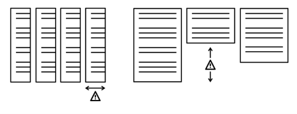
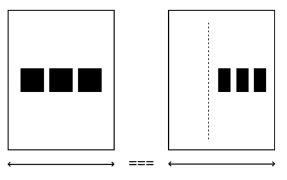
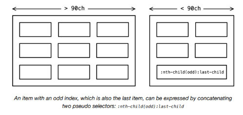
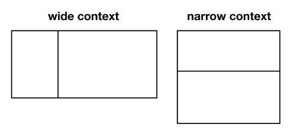
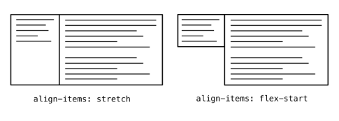
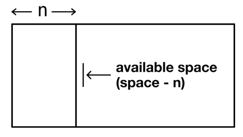
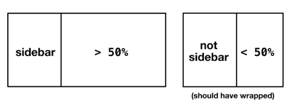
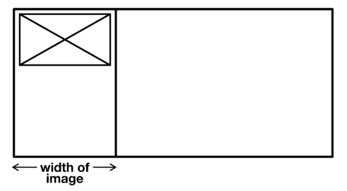

# The Sidebar

## El problema

Cuando las dimensiones y la configuración del medio para tu diseño visual son indeterminadas, incluso algo simple como *poner cosas al lado de otras cosas* es una incógnita. ¿Habrá suficiente espacio horizontal? Y, incluso si lo hay, ¿el layout hará el mejor uso del espacio vertical?



Cuando no hay suficiente espacio para dos elementos adyacentes, tendemos a emplear un breakpoint (una consulta `@media` basada en ancho) para reconfigurar el layout y colocar los dos elementos uno encima del otro.

Es importante que usemos consultas basadas en *contenido* en lugar de *dispositivo* `@media`. Es decir, deberíamos intervenir en cualquier lugar donde el contenido necesite reconfiguración, en lugar de adherirnos a anchos arbitrarios como `720px` y `1024px`. La masiva proliferación de dispositivos significa que no hay un conjunto real de dimensiones estándar para las cuales diseñar.

Pero incluso esta estrategia tiene una falla fundamental: las consultas `@media` para ancho pertenecen al ancho del *viewport*, y no tienen relación con el espacio disponible real. Un componente podría aparecer dentro de un contenedor de `300px` de ancho, o podría aparecer dentro de un contenedor más generoso de `500px` de ancho. Pero el ancho del viewport es el mismo en cualquier caso, por lo que no hay nada a lo que "responder".



Los sistemas de diseño tienden a catalogar componentes que pueden aparecer entre diferentes contextos y espacios, por lo que esto es un problema real. Solo con una capacidad como las *container queries* ↗ (consultas de contenedor) propuestas podríamos enseñar a nuestros componentes de layout a ser completamente *context aware* (conscientes del contexto).

En algunos aspectos, el módulo CSS Flexbox, con su provisión de `flex-basis`, ya puede gobernar su propio layout, por contexto, bastante bien. Considera el siguiente código:

```css linenums="1"
.parent {
  display: flex;
  flex-wrap: wrap;
}
.parent > * {
  flex-grow: 1;
  flex-shrink: 1;
  flex-basis: 30ch;
}
```

El valor `flex-basis` esencialmente determina un ancho *ideal* para los elementos hijos sujetos. Con crecimiento, contracción y wrapping habilitados, el espacio disponible se utiliza de tal manera que cada elemento está lo más cerca posible de `30ch` de ancho. En un contenedor ancho (`> 90ch`), más de tres hijos pueden aparecer por fila. Entre `60ch` y `90ch` solo pueden aparecer dos elementos, con un elemento ocupando toda la fila final (si el número total es impar).



> *Un elemento con un índice impar, que también es el último elemento, se puede expresar concatenando dos pseudo-selectores: `:nth-child(odd):last-child`*

Al diseñar según las dimensiones *ideales* del elemento, y tolerando una variación razonable, puedes esencialmente prescindir de los breakpoints `@media`. Tu componente maneja su propio layout, intrínsecamente, y sin necesidad de intervención manual. Muchos de los layouts que estamos cubriendo refinan este mecanismo básico para darte un control más preciso sobre la colocación y el wrapping.

Por ejemplo, podríamos querer crear un layout clásico de sidebar, donde uno de dos elementos adyacentes tiene un ancho fijo, y el otro —el elemento *principal*, por así decirlo— ocupa el resto del espacio disponible. Esto debería ser responsivo, sin breakpoints `@media`, y deberíamos poder establecer un punto de quiebre basado en *contenedor* para envolver los elementos en una configuración vertical.

## La solución

El layout `Sidebar` lleva el nombre del elemento que forma la *sidebar* diminutiva: el más estrecho de dos elementos adyacentes. Es un layout *cuántico*, existiendo simultáneamente en una de las dos configuraciones —horizontal y vertical— ilustradas abajo. Qué configuración se adopta no se conoce en el momento de la concepción, y depende completamente del espacio que se le otorgue cuando se coloca dentro de un contenedor padre.



Donde hay suficiente espacio, los dos elementos aparecen lado a lado. Críticamente, el ancho de la sidebar es *fijo* mientras los dos elementos están adyacentes, y el no-sidebar ocupa el resto del espacio disponible. Pero cuando los dos elementos se envuelven, cada uno ocupa el `100%` del contenedor compartido.

## Altura igual

Nota que los dos elementos adyacentes tienen la misma altura, independientemente del contenido que contengan. Esto es gracias a un valor por defecto de `align-items: stretch`. En la mayoría de los casos, esto es deseable (y era muy difícil de lograr antes del advenimiento de Flexbox). Sin embargo, puedes "desactivar" este comportamiento con `align-items: flex-start`.



Cómo forzar el wrapping en un punto determinado. Primero, necesitamos configurar el layout horizontal.

```css linenums="1"
.with-sidebar {
  display: flex;
  flex-wrap: wrap;
}
.sidebar {
  flex-basis: 20rem;
  flex-grow: 1;
}
.not-sidebar {
  flex-basis: 0;
  flex-grow: 999;
}
```

La clave para entender aquí es el rol del *espacio disponible*. Debido a que el valor de `flex-grow` del elemento `.not-sidebar` es muy alto (`999`), ocupa todo el espacio disponible. El valor de `flex-basis` del elemento `.sidebar` no se cuenta como espacio disponible y se resta del total, de ahí el layout tipo sidebar. El no-sidebar esencialmente aplasta la sidebar hasta su ancho ideal.



El elemento `.sidebar` todavía está técnicamente permitido crecer, y puede hacerlo cuando `.not-sidebar` se envuelve debajo de él. Para controlar dónde ocurre ese wrapping, podemos usar `min-width`.

```css linenums="1"
.not-sidebar {
  flex-basis: 0;
  flex-grow: 999;
  min-width: 50%;
}
```

Donde `.not-sidebar` está destinado a ser menor o igual al `50%` del ancho del contenedor, se fuerza a una nueva línea/fila y crece para ocupar todo su espacio. El valor puede ser cualquier cosa, pero `50%` es apto ya que una sidebar deja de ser una sidebar cuando ya no es la más estrecha de los dos elementos.



## El gutter (espaciado)

Hasta ahora, estamos tratando los dos elementos como si estuvieran tocándose. En su lugar, podríamos querer colocar un gutter/espacio entre ellos. Dado que queremos que ese espacio aparezca entre los elementos independientemente de la configuración *y* no queremos márgenes extraños en los bordes exteriores, usaremos la propiedad `gap` como lo hicimos para el layout `Cluster`.

Para un gutter de `1rem`, el CSS ahora se ve así:

```css linenums="1"
.with-sidebar {
  display: flex;
  flex-wrap: wrap;
  gap: 1rem;
}
.sidebar {
  /* ↓ El ancho cuando la sidebar _es_ una sidebar */
  flex-basis: 20rem;
  flex-grow: 1;
}
.not-sidebar {
  /* ↓ Crecer desde nada */
  flex-basis: 0;
  flex-grow: 999;
  /* ↓ Envolver cuando los elementos tienen el mismo ancho */
  min-width: 50%;
}
```

*Esta demostración interactiva solo está disponible en el sitio de Every Layout* ↗.

## Ancho de sidebar intrínseco

Hasta ahora, hemos estado prescribiendo el ancho de nuestro elemento sidebar (`flex-basis: 20rem`, en el último ejemplo). En su lugar, podríamos dejar que el *contenido* de la sidebar determine su ancho. Cuando no proporcionamos un valor `flex-basis` en absoluto, el ancho de la sidebar es igual al ancho de sus contenidos. El comportamiento de wrapping sigue siendo el mismo.



Si establecemos el ancho de una imagen dentro de nuestra sidebar a `15rem`, ese será el ancho de la sidebar en la configuración horizontal. Crecerá al `100%` en la configuración vertical.

### Intrinsic Web Design

El término *Intrinsic Web Design* ↗ fue acuñado por Jen Simmons, y se refiere a un movimiento reciente hacia herramientas y mecanismos en CSS que son más adecuados para el medio. El tipo de layouts *algorithmicos* y autónomos establecidos en esta serie podrían considerarse métodos de diseño intrínseco.

El término *intrínseco* connota procesos introspectivos; cálculos realizados por el patrón de layout sobre sí mismo. Mi uso de 'intrínseco' en esta sección se refiere específicamente al ancho inevitable de un elemento determinado por sus contenidos. El ancho de un botón, a menos que se establezca explícitamente, es el ancho de lo que hay dentro de él.

El CSS Box Sizing Module anteriormente se llamaba Intrinsic & Extrinsic Sizing Module, porque establecía cómo los elementos pueden dimensionarse tanto intrínseca como extrínsecamente. Generalmente, deberíamos inclinarnos hacia el lado del dimensionamiento intrínseco. Como se cubrió en *Axioms*, es mejor permitir que el navegador dimensione los elementos según su contenido, y solo proporcionar *sugerencias*, en lugar de *prescripciones*, para el layout. Somos *outsiders*.

## Casos de uso

El `Sidebar` es aplicable a todo tipo de contenido. El omnipresente "media object" (la colocación de un elemento de medios junto a una descripción) es un pilar, pero también se puede usar para alinear botones con entradas de formulario (donde el botón forma la sidebar y tiene un ancho *intrínseco* basado en el contenido).

El siguiente ejemplo usa la versión de componente, definida como un elemento personalizado.

```html linenums="1"
<form>
  <sidebar-l side="right" space="0" contentMin="66.666%">
    <input type="text">
    <button>Search</button>
  </sidebar-l>
</form>
```

*Esta demostración interactiva solo está disponible en el sitio de Every Layout* ↗.

## El generador

Usa esta herramienta para generar CSS y HTML básicos de Sidebar.

La herramienta generadora de código solo está disponible en el *sitio de documentación adjunto* ↗. Aquí está la solución básica, con comentarios. Se asume que el no-sidebar es el `:last-child` en este ejemplo.

**CSS**

```css linenums="1"
.with-sidebar {
  display: flex;
  flex-wrap: wrap;
  /* ↓ El valor por defecto es el primer punto en la escala modular */
  gap: var(--gutter, var(--s1));
}
.with-sidebar > :first-child {
  /* ↓ El ancho cuando la sidebar _es_ una sidebar */
  flex-basis: 20rem;
  flex-grow: 1;
}
.with-sidebar > :last-child {
  /* ↓ Crecer desde nada */
  flex-basis: 0;
  flex-grow: 999;
  /* ↓ Envolver cuando los elementos tienen el mismo ancho */
  min-width: 50%;
}
```

**HTML**

(No tienes que usar `<div>`s; usa elementos semánticos cuando sea apropiado.)

```html linenums="1"
<div class="with-sidebar">
  <div><!-- sidebar --></div>
  <div><!-- no-sidebar --></div>
</div>
```

## El componente

Una implementación de elemento personalizado del `Sidebar` está disponible para descargar ↗.

**API de Props**

Las siguientes props (atributos) harán que el componente se renderice nuevamente cuando se alteren. Pueden ser alterados a mano — en las herramientas de desarrollo del navegador — o como sujetos del estado de la aplicación heredada.

| Nombre | Tipo | Default | Descripción |
|---|---|---|---|
| `side` | string | `"left"` | Qué elemento tratar como la sidebar (todos los valores excepto `"left"` se consideran `"right"`) |
| `sideWidth` | string | `null` | Representa el ancho de la sidebar cuando está adyacente. Si no se establece (`null`), por defecto es el ancho del contenido de la sidebar |
| `contentMin` | string | `"50%"` | Un valor CSS de porcentaje. El ancho mínimo del elemento de contenido en la configuración horizontal |
| `space` | string | `"var(--s1)"` | Un valor CSS de `gap` que representa el espacio entre los dos elementos |
| `noStretch` | boolean | `false` | Hace que los elementos adyacentes adopten su altura natural |

## Ejemplos

### Media object

Usa el "breakpoint" `50%` por defecto y un valor `space` aumentado, tomado de la escala modular basada en propiedades personalizadas. La sidebar/imagen tiene `15rem` de ancho en la configuración horizontal.

Debido a que la imagen es un hijo flex, se debe suministrar `noStretch` para evitar que se distorsione. Si la imagen se colocara dentro de un `<div>` (haciendo del `<div>` el hijo flex) esto no sería necesario.

```html linenums="1"
<sidebar-l space="var(--s2)" sideWidth="15rem" noStretch>
  
  <p><!-- el texto que acompaña la imagen --></p>
</sidebar-l>
```

### Switched media object (Media object intercambiado)

Igual que el ejemplo anterior, excepto que el texto que *acompaña* la imagen es la sidebar (`side="right"`), permitiendo que la imagen crezca cuando el layout está en la configuración horizontal. La sidebar tiene un ancho (*measure*) de `30ch` (aproximadamente 30 caracteres) en la configuración horizontal.

La imagen está contenida en un `<div>`, por lo que `noStretch` no es necesario en este caso. La imagen debería crecer para usar el espacio disponible, así que el CSS básico para imágenes responsivas debería estar en tus estilos globales (`img { width: 100% }`).

```html linenums="1"
<sidebar-l space="var(--s2)" side="right" sideWidth="30ch">
  <div>
    
  </div>
  <p><!-- el texto que acompaña la imagen --></p>
</sidebar-l>
```

