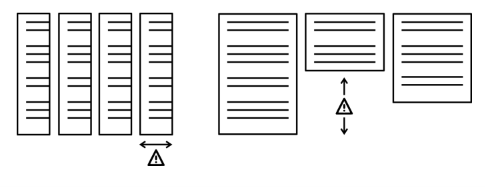
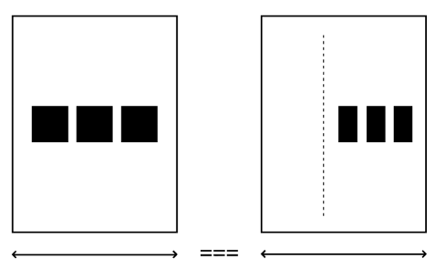
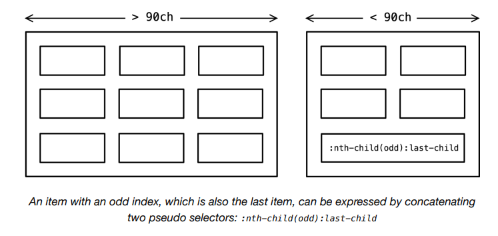
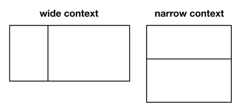
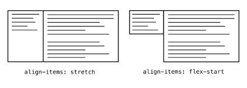
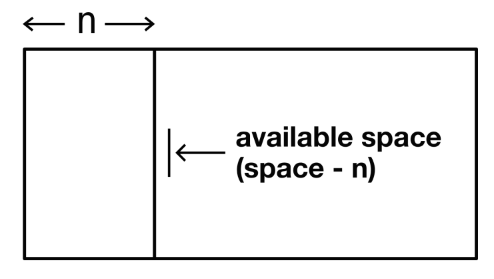
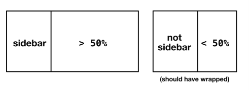
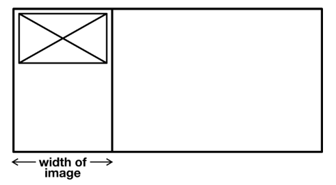

# The Sidebar

## El problema

Cuando las dimensiones y la configuración del medio para tu diseño visual son indeterminadas, incluso algo simple como *poner cosas al lado de otras cosas* es una incógnita. ¿Habrá suficiente espacio horizontal? Y, incluso si lo hay, ¿el layout hará el mejor uso del espacio vertical?



Cuando no hay suficiente espacio para dos elementos adyacentes, tendemos a emplear un breakpoint (una consulta `@media` basada en ancho) para reconfigurar el layout y colocar los dos elementos uno encima del otro.

Es importante que usemos consultas basadas en *contenido* en lugar de *dispositivo* `@media`. Es decir, deberíamos intervenir en cualquier lugar donde el contenido necesite reconfiguración, en lugar de adherirnos a anchos arbitrarios como `720px` y `1024px`. La masiva proliferación de dispositivos significa que no hay un conjunto real de dimensiones estándar para las cuales diseñar.

Pero incluso esta estrategia tiene una falla fundamental: las consultas `@media` para ancho pertenecen al ancho del *viewport*, y no tienen relación con el espacio disponible real. Un componente podría aparecer dentro de un contenedor de `300px` de ancho, o podría aparecer dentro de un contenedor más generoso de `500px` de ancho. Pero el ancho del viewport es el mismo en cualquier caso, por lo que no hay nada a lo que "responder".



Los sistemas de diseño tienden a catalogar componentes que pueden aparecer entre diferentes contextos y espacios, por lo que esto es un problema real. Solo con una capacidad como las [*container queries* ↗ (consultas de contenedor)](https://css-tricks.com/container-query-discussion/) propuestas podríamos enseñar a nuestros componentes de layout a ser completamente *context aware* (conscientes del contexto).

En algunos aspectos, el módulo CSS Flexbox, con su provisión de `flex-basis`, ya puede gobernar su propio layout, por contexto, bastante bien. Considera el siguiente código:

```css linenums="1"
.parent {
  display: flex;
  flex-wrap: wrap;
}
.parent > * {
  flex-grow: 1;
  flex-shrink: 1;
  flex-basis: 30ch;
}
```

El valor `flex-basis` esencialmente determina un ancho *ideal* para los elementos hijos sujetos. Con crecimiento, contracción y wrapping habilitados, el espacio disponible se utiliza de tal manera que cada elemento está lo más cerca posible de `30ch` de ancho. En un contenedor ancho (`> 90ch`), más de tres hijos pueden aparecer por fila. Entre `60ch` y `90ch` solo pueden aparecer dos elementos, con un elemento ocupando toda la fila final (si el número total es impar).



> *Un elemento con un índice impar, que también es el último elemento, se puede expresar concatenando dos pseudo-selectores: `:nth-child(odd):last-child`*

Al diseñar según las dimensiones *ideales* del elemento, y tolerando una variación razonable, puedes esencialmente prescindir de los breakpoints `@media`. Tu componente maneja su propio layout, intrínsecamente, y sin necesidad de intervención manual. Muchos de los layouts que estamos cubriendo refinan este mecanismo básico para darte un control más preciso sobre la colocación y el wrapping.

Por ejemplo, podríamos querer crear un layout clásico de sidebar, donde uno de dos elementos adyacentes tiene un ancho fijo, y el otro —el elemento *principal*, por así decirlo— ocupa el resto del espacio disponible. Esto debería ser responsivo, sin breakpoints `@media`, y deberíamos poder establecer un punto de quiebre basado en *contenedor* para envolver los elementos en una configuración vertical.

??? info "Explicacion"

    Claro. Este apartado de **The Sidebar** está introduciendo un problema muy importante en CSS moderno: **cómo hacer layouts responsivos sin depender de breakpoints arbitrarios como `768px` o `1024px`**.

    La idea central es:

    > **El componente debería adaptarse al espacio que realmente tiene disponible, no al tamaño de la pantalla.**

    Vamos paso a paso.

    ---

    __1. El problema: poner elementos uno al lado del otro__

    Imagina que tienes esto:

    ```text
    ┌─────────────────────────────────────┐
    │                                     │
    │  Elemento A       Elemento B        │
    │                                     │
    └─────────────────────────────────────┘
    ```

    Quieres que estén uno al lado del otro.

    Pero surge una pregunta:

    > ¿Hay suficiente espacio horizontal?

    Si el contenedor es suficientemente ancho:

    ```text
    ┌───────────────────────────────┐
    │                               │
    │  AAAAAAAA     BBBBBBBB        │
    │                               │
    └───────────────────────────────┘
    ```

    Perfecto.

    Pero si el espacio es pequeño:

    ```text
    ┌─────────────────┐
    │                 │
    │  AAAAAAAAAAAA   │
    │                 │
    │  BBBBBBBBBBBB   │
    │                 │
    └─────────────────┘
    ```

    Entonces necesitamos que uno pase debajo del otro.

    Esto es lo que normalmente llamamos **responsive design**.

    ---

    __2. La solución tradicional: `@media`__

    Tradicionalmente haríamos algo como:

    ```css
    .container {
      display: flex;
    }

    @media (max-width: 768px) {
      .container {
        flex-direction: column;
      }
    }
    ```

    En una pantalla grande:

    ```text
    ┌──────────────────────────────┐
    │       A       │       B      │
    └──────────────────────────────┘
    ```

    En una pantalla menor a `768px`:

    ```text
    ┌──────────────┐
    │      A       │
    ├──────────────┤
    │      B       │
    └──────────────┘
    ```

    El problema es que estamos diciendo:

    > "Cuando el **viewport** tenga menos de `768px`, cambia el layout".

    Pero el viewport no necesariamente representa el espacio real disponible para nuestro componente.

    Y aquí está la clave del capítulo.

    ---

    __3. El viewport no es lo mismo que el espacio disponible__

    Imagina una pantalla de:

    ```text
    1200px
    ```

    Tu componente podría estar dentro de un contenedor de:

    ```text
    300px
    ```

    Así:

    ```text
    ┌──────────────────────────────────────────────────────┐
    │                                                      │
    │  ┌──────────────────┐                                │
    │  │                  │                                │
    │  │    COMPONENTE    │                                │
    │  │      300px       │                                │
    │  │                  │                                │
    │  └──────────────────┘                                │
    │                                                      │
    └──────────────────────────────────────────────────────┘
            viewport = 1200px
    ```

    Tu `@media` ve:

    ```text
    viewport = 1200px
    ```

    Entonces piensa:

    > "Tengo mucho espacio. No necesito cambiar el layout".

    Pero el componente realmente solo tiene:

    ```text
    300px
    ```

    Y quizás necesita poner sus elementos verticalmente.

    El problema es que `@media` está mirando el **viewport**, no el espacio disponible para el componente.

    ---

    __4. El problema se vuelve más evidente con componentes reutilizables__

    Imagina que tienes un componente:

    ```html
    <div class="sidebar-layout">
        <aside>Sidebar</aside>
        <main>Contenido principal</main>
    </div>
    ```

    Ese componente puede aparecer en diferentes lugares.

    Por ejemplo:

    __Caso A__

    ```text
    Viewport: 1200px

    ┌──────────────────────────────────────────────┐
    │                                              │
    │  Sidebar │ Contenido principal               │
    │                                              │
    └──────────────────────────────────────────────┘
    ```

    Tiene espacio suficiente.

    Pero ahora el mismo componente aparece dentro de otra sección:

    ```text
    Viewport: 1200px

    ┌──────────────────────────────────────────────┐
    │                                              │
    │   ┌──────────────────────┐                   │
    │   │ Sidebar              │                   │
    │   │                      │                   │
    │   │ Contenido principal  │                   │
    │   └──────────────────────┘                   │
    │                                              │
    └──────────────────────────────────────────────┘
    ```

    El viewport sigue siendo:

    ```text
    1200px
    ```

    Pero el componente ahora solo tiene, por ejemplo:

    ```text
    400px
    ```

    Una `@media (max-width: 768px)` no se activa porque el viewport sigue teniendo `1200px`.

    Por eso el libro dice que las `@media` basadas en ancho tienen una **falla fundamental**.

    ---

    __5. Container Queries__

    La solución moderna es utilizar **Container Queries**.

    En lugar de preguntarnos:

    > ¿Cuánto mide la pantalla?

    Preguntamos:

    > ¿Cuánto espacio tiene mi contenedor?

    La diferencia conceptual es:

    ```text
    @media
      ↓
    Viewport
      ↓
    "¿Cuánto mide la pantalla?"
    ```

    Mientras que:

    ```text
    @container
      ↓
    Contenedor
      ↓
    "¿Cuánto espacio tengo yo?"
    ```

    Esto hace que el componente sea **context aware**, es decir:

    > consciente del contexto en el que está siendo utilizado.

    Esto es especialmente importante para componentes reutilizables.

    ---

    __6. Pero Flexbox ya tiene cierta capacidad de adaptación__

    Aquí aparece una parte muy interesante del texto.

    Dice que **Flexbox ya puede hacer algo parecido**, gracias a:

    ```css
    flex-basis
    ```

    Tenemos:

    ```css
    .parent {
      display: flex;
      flex-wrap: wrap;
    }

    .parent > * {
      flex-grow: 1;
      flex-shrink: 1;
      flex-basis: 30ch;
    }
    ```

    Vamos por partes.

    ---

    __7. `flex-basis: 30ch`__

    `flex-basis` define el tamaño inicial o **ideal** del elemento dentro del eje principal de Flexbox.

    Aquí:

    ```css
    flex-basis: 30ch;
    ```

    estamos diciendo aproximadamente:

    > "Me gustaría que cada elemento tuviera un ancho de `30ch`".

    No significa necesariamente:

    > "El elemento debe medir exactamente `30ch`".

    Es más bien:

    > "Este es mi tamaño preferido".

    Por eso el texto dice que es un ancho **ideal**.

    ---

    __8. `flex-grow: 1`__

    Tenemos:

    ```css
    flex-grow: 1;
    ```

    Esto significa:

    > Si sobra espacio, los elementos pueden crecer.

    Por ejemplo:

    ```text
    Ideal:

    30ch + 30ch + 30ch
    ```

    Pero hay más espacio disponible:

    ```text
    40ch + 40ch + 40ch
    ```

    Los elementos crecen para aprovechar el espacio.

    ---

    __9. `flex-shrink: 1`__

    Tenemos:

    ```css
    flex-shrink: 1;
    ```

    Esto permite que los elementos se reduzcan cuando no hay suficiente espacio.

    Por ejemplo, idealmente:

    ```text
    30ch + 30ch
    ```

    Pero el contenedor tiene menos espacio.

    Flexbox puede reducir los elementos:

    ```text
    25ch + 25ch
    ```

    hasta donde sea razonable.

    ---

    __10. `flex-wrap: wrap`__

    Esta propiedad es fundamental:

    ```css
    flex-wrap: wrap;
    ```

    Permite que los elementos pasen a una nueva línea.

    Sin `wrap`:

    ```text
    A ─── B ─── C ─── D
    ```

    Aunque no haya espacio suficiente, Flexbox intenta mantenerlos en la misma línea.

    Con:

    ```css
    flex-wrap: wrap;
    ```

    puede hacer:

    ```text
    A ─── B ─── C
    D
    ```

    O:

    ```text
    A ─── B
    C ─── D
    ```

    Dependiendo del espacio disponible.

    ---

    __11. Entonces, ¿qué está haciendo todo este código?__

    Tenemos:

    ```css
    .parent {
      display: flex;
      flex-wrap: wrap;
    }

    .parent > * {
      flex-grow: 1;
      flex-shrink: 1;
      flex-basis: 30ch;
    }
    ```

    Conceptualmente estamos diciendo:

    > "Cada hijo quiere medir aproximadamente `30ch`."

    > "Si sobra espacio, puede crecer."

    > "Si falta espacio, puede reducirse."

    > "Si ya no caben, pueden pasar a otra línea."

    Es decir, estamos dejando que **Flexbox tome decisiones automáticamente**.

    No estamos diciendo:

    ```css
    @media (max-width: 768px) {
      ...
    }
    ```

    Estamos diciendo:

    > "Organízate según el espacio disponible."

    Eso es lo que el libro llama un comportamiento más **intrínseco**.

    ---

    __12. ¿Qué significa lo de `> 90ch`?__

    Si cada elemento quiere aproximadamente:

    ```text
    30ch
    ```

    Entonces tres elementos necesitan aproximadamente:

    ```text
    30ch + 30ch + 30ch = 90ch
    ```

    Por lo tanto, si tienes más de `90ch`:

    ```text
    ┌─────────────────────────────────────┐
    │  AAAAA  │  BBBBB  │  CCCCC         │
    └─────────────────────────────────────┘
    ```

    pueden caber tres.

    Si tienes entre `60ch` y `90ch`:

    ```text
    ┌─────────────────────────────┐
    │  AAAAAAA  │  BBBBBBB        │
    │                            │
    │  CCCCCCCCC                 │
    └─────────────────────────────┘
    ```

    pueden caber dos por fila.

    Si tienes 3 elementos:

    ```text
    A + B
    C
    ```

    El tercero ocupa la siguiente línea.

    Eso es lo que significa:

    > "Entre `60ch` y `90ch` solo pueden aparecer dos elementos, con un elemento ocupando toda la fila final."

    ---

    __13. El selector `:nth-child(odd):last-child`__

    El texto menciona esto:

    ```css
    :nth-child(odd):last-child
    ```

    Son dos condiciones simultáneas.

    ```css
    :nth-child(odd)
    ```

    significa:

    > El elemento está en una posición impar.

    Por ejemplo:

    ```text
    1 → impar
    2 → par
    3 → impar
    4 → par
    5 → impar
    ```

    Y:

    ```css
    :last-child
    ```

    significa:

    > Es el último hijo.

    Entonces:

    ```css
    :nth-child(odd):last-child
    ```

    significa:

    > "Es el último elemento y además está en una posición impar".

    Por ejemplo:

    ```text
    A → 1
    B → 2
    C → 3  ← último + impar
    ```

    Esto es útil cuando quieres detectar que tienes una cantidad impar de elementos.

    ---

    __14. La idea más importante: diseño intrínseco__

    Este es probablemente el concepto que debes llevarte de todo este apartado.

    Hay dos formas de pensar:

    __Enfoque tradicional__

    ```text
    Viewport
        ↓
    ¿768px?
        ↓
    Cambiar layout
    ```

    Es decir:

    > "Yo decido cuándo cambia el layout."

    __Enfoque intrínseco__

    ```text
    Contenido
        ↓
    Espacio disponible
        ↓
    ¿Caben?
        ↓
    Sí → horizontal
    No → wrap
    ```

    Es decir:

    > "El layout se adapta según sus propias necesidades."

    Esto es muy parecido a lo que ya vimos con otros componentes de **Every Layout**: intentar que el componente tenga reglas que funcionen de manera autónoma, sin depender de conocer de antemano el tamaño de la pantalla.

    ---

    __15. Y aquí aparece finalmente `The Sidebar`__

    Hasta ahora el libro ha explicado cómo hacer elementos que se distribuyen dinámicamente.

    Ahora quiere construir algo más específico:

    ```text
    ┌─────────────────────────────────────────────┐
    │                                             │
    │  SIDEBAR  │       CONTENIDO PRINCIPAL       │
    │           │                                 │
    │           │                                 │
    └─────────────────────────────────────────────┘
    ```

    Tenemos dos elementos:

    ```text
    Sidebar
    +
    Main
    ```

    El Sidebar tiene un ancho determinado:

    ```text
    Sidebar → tamaño relativamente fijo
    ```

    Y el contenido principal ocupa el resto:

    ```text
    Main → espacio restante
    ```

    Por ejemplo:

    ```text
    ┌─────────────────────────────────────────────┐
    │  250px    │             RESTO               │
    │  Sidebar  │          Main Content           │
    └─────────────────────────────────────────────┘
    ```

    Pero cuando ya no hay suficiente espacio:

    ```text
    ┌───────────────────┐
    │      Sidebar      │
    ├───────────────────┤
    │   Main Content    │
    └───────────────────┘
    ```

    Y aquí está el objetivo final del capítulo:

    > Crear este comportamiento **sin `@media`**, haciendo que el componente detecte intrínsecamente cuándo ya no hay suficiente espacio.

    La idea sería algo como:

    ```text
    Mucho espacio
          ↓
    ┌──────────┬──────────────────┐
    │ Sidebar  │ Main             │
    └──────────┴──────────────────┘

    Poco espacio
          ↓
    ┌──────────────────────────────┐
    │ Sidebar                      │
    ├──────────────────────────────┤
    │ Main                         │
    └──────────────────────────────┘
    ```

    Y, si el componente está dentro de un contenedor pequeño, debería adaptarse **aunque la pantalla completa sea enorme**.

    ---

    __Resumen mental__

    Quédate con esta secuencia:

    ```text
    @media
    │
    ├── Mira el viewport
    │
    └── Problema: no sabe cuánto espacio tiene realmente el componente
    ```

    Mientras que el enfoque que busca **Every Layout** es:

    ```text
    Componente
    │
    ├── Mira su espacio disponible
    │
    ├── Tiene un tamaño ideal
    │
    ├── Puede crecer
    │
    ├── Puede encogerse
    │
    └── Puede hacer wrap
    ```

    Y el objetivo de **The Sidebar** será llevar esta filosofía a un layout clásico:

    ```text
    Sidebar + Main
    ```

    donde:

    ```text
    espacio suficiente → lado a lado
    espacio insuficiente → uno debajo del otro
    ```

    **sin tener que pensar primero en `768px`, `1024px` o en qué modelo de celular está usando el usuario.**

    La filosofía, en una frase, sería:

    > **No diseñes pensando en dispositivos; diseña pensando en las necesidades y dimensiones del contenido.**
        

## La solución

El layout `Sidebar` lleva el nombre del elemento que forma la *sidebar* diminutiva: el más estrecho de dos elementos adyacentes. Es un layout *cuántico*, existiendo simultáneamente en una de las dos configuraciones —horizontal y vertical— ilustradas abajo. Qué configuración se adopta no se conoce en el momento de la concepción, y depende completamente del espacio que se le otorgue cuando se coloca dentro de un contenedor padre.



Donde hay suficiente espacio, los dos elementos aparecen lado a lado. Críticamente, el ancho de la sidebar es *fijo* mientras los dos elementos están adyacentes, y el no-sidebar ocupa el resto del espacio disponible. Pero cuando los dos elementos se envuelven, cada uno ocupa el `100%` del contenedor compartido.

??? info "Explicacion" 

    Claro. Aquí el libro ya está explicando **la solución concreta del layout `Sidebar`**. La idea es sencilla, pero hay un par de conceptos importantes.

    ---

    __1. ¿Qué es el layout `Sidebar`?__

    El layout `Sidebar` sirve para colocar **dos elementos juntos**:

    ```text
    ┌──────────────┬──────────────────────────────┐
    │   Sidebar    │      Contenido principal     │
    │              │                              │
    └──────────────┴──────────────────────────────┘
    ```

    Uno de ellos es más estrecho:

    ```text
    Sidebar
    ```

    Y el otro ocupa el espacio restante:

    ```text
    No-sidebar
    ```

    Por ejemplo:

    ```text
    ┌───────────┬────────────────────────────────┐
    │ Filtros   │ Productos                      │
    │           │                                │
    │ Categorías│                                │
    │           │                                │
    └───────────┴────────────────────────────────┘
    ```

    Aquí:

    * **Sidebar** → filtros y categorías.
    * **No-sidebar** → productos.

    Otro ejemplo:

    ```text
    ┌───────────┬────────────────────────────────┐
    │ Menú      │ Contenido                      │
    │           │                                │
    └───────────┴────────────────────────────────┘
    ```

    * Sidebar → menú.
    * No-sidebar → contenido.

    ---

    __2. ¿Por qué se llama `Sidebar`?__

    Porque el elemento más estrecho actúa como una **barra lateral**.

    Por ejemplo:

    ```text
    ┌──────────┬──────────────────────────┐
    │          │                          │
    │ SIDEBAR  │     MAIN CONTENT         │
    │          │                          │
    └──────────┴──────────────────────────┘
    ```

    La sidebar está "al lado" del contenido principal.

    Pero atención:

    > `Sidebar` no significa necesariamente que el elemento tenga que estar siempre a la izquierda.

    El concepto importante es que tienes:

    ```text
    elemento estrecho + elemento principal
    ```

    El layout se encarga de organizarlos.

    ---

    __3. ¿Qué significa que es un layout "cuántico"?__

    Esta es probablemente la parte más rara del texto.

    Cuando dice:

    > "Es un layout cuántico"

    no está hablando realmente de física cuántica 😄.

    Es una forma metafórica de decir que el componente puede existir en **dos estados posibles** dependiendo de su contexto.

    Estado 1:

    ```text
    HORIZONTAL
    ```

    ```text
    ┌──────────┬─────────────────────────┐
    │ Sidebar  │ Main                    │
    └──────────┴─────────────────────────┘
    ```

    Estado 2:

    ```text
    VERTICAL
    ```

    ```text
    ┌─────────────────────────────────────┐
    │ Sidebar                             │
    ├─────────────────────────────────────┤
    │ Main                                │
    └─────────────────────────────────────┘
    ```

    El componente puede adoptar uno u otro estado.

    Lo importante es que **el componente no sabe de antemano cuál tendrá**.

    ---

    __4. ¿Quién decide si es horizontal o vertical?__

    El **espacio disponible**.

    No decides:

    ```text
    Si pantalla > 768px → horizontal
    Si pantalla < 768px → vertical
    ```

    En cambio, la idea es:

    ```text
    ¿Tengo suficiente espacio?
            │
            ├── Sí → Horizontal
            │
            └── No → Vertical
    ```

    Por ejemplo:

    __Contenedor grande__

    ```text
    ┌───────────────────────────────────────────┐
    │                                           │
    │ Sidebar │        Main                     │
    │                                           │
    └───────────────────────────────────────────┘
    ```

    __Contenedor pequeño__

    ```text
    ┌───────────────────────┐
    │ Sidebar               │
    ├───────────────────────┤
    │ Main                  │
    └───────────────────────┘
    ```

    El mismo componente puede estar en ambos casos.

    ---

    __5. El componente no conoce su configuración al crearse__

    Esta frase es importante:

    > "Qué configuración se adopta no se conoce en el momento de la concepción"

    Imagina que tú creas un componente:

    ```html
    <div class="sidebar">
        <aside>Sidebar</aside>
        <main>Contenido</main>
    </div>
    ```

    Cuando escribes el componente, no sabes necesariamente dónde será utilizado.

    Puede estar aquí:

    ```text 
    ┌─────────────────────────────────────────────┐
    │                                             │
    │ Sidebar │ Contenido                         │
    │                                             │
    └─────────────────────────────────────────────┘
    ```

    O aquí:

    ```text 
    ┌───────────────────────┐
    │ Sidebar               │
    ├───────────────────────┤
    │ Contenido             │
    └───────────────────────┘
    ```

    El componente no debería necesitar que tú le digas:

    > "Ahora estás dentro de un contenedor de `300px`, así que debes cambiar".

    La idea es que el propio layout se adapte.

    Por eso el texto dice:

    > "depende completamente del espacio que se le otorgue cuando se coloca dentro de un contenedor padre."

    En otras palabras:

    ```text
    Contenedor padre
          │
          ▼
      espacio disponible
          │
          ▼
        Sidebar
          │
          ├── suficiente → horizontal
          │
          └── insuficiente → vertical
    ```

    ---

    __6. La Sidebar tiene un ancho fijo__

    Ahora viene una característica fundamental.

    Cuando hay suficiente espacio para colocar ambos elementos horizontalmente:

    ```text
    ┌──────────────┬──────────────────────────────────┐
    │              │                                  │
    │   SIDEBAR    │       CONTENIDO PRINCIPAL        │
    │              │                                  │
    └──────────────┴──────────────────────────────────┘
    ```

    La sidebar mantiene un ancho fijo.

    Por ejemplo:

    ```text
    Sidebar = 250px
    ```

    Entonces:

    ```text
    ┌──────────250px────────┬──────── RESTO ─────────┐
    │                       │                         │
    │       Sidebar         │         Main            │
    │                       │                         │
    └───────────────────────┴─────────────────────────┘
    ```

    El contenido principal ocupa:

    ```text
    espacio restante
    ```

    Si el contenedor tiene `1000px`:

    ```text
    Sidebar = 250px
    Main = 750px
    ```

    Si el contenedor tiene `1200px`:

    ```text
    Sidebar = 250px
    Main = 950px
    ```

    Si el contenedor tiene `1500px`:

    ```text
    Sidebar = 250px
    Main = 1250px
    ```

    La sidebar sigue siendo:

    ```text
    250px
    ```

    Mientras que el contenido principal crece.

    La relación sería:

    ```text
    ┌──────────────┬─────────────────────────────┐
    │   Sidebar    │         Main                │
    │    FIJA      │      FLEXIBLE               │
    └──────────────┴─────────────────────────────┘
    ```

    ---

    __7. ¿Qué significa "el no-sidebar ocupa el resto"?__

    Significa que el segundo elemento funciona como un elemento flexible.

    Tenemos:

    ```text
    Sidebar = fijo
    No-sidebar = flexible
    ```

    Conceptualmente:

    ```text
    ┌────────────┬───────────────────────────────┐
    │            │                               │
    │  Sidebar   │          No-sidebar           │
    │            │                               │
    └────────────┴───────────────────────────────┘
          ↑                     ↑
        fijo             ocupa el espacio restante
    ```

    Por ejemplo:

    ```text
    Contenedor = 1000px

    Sidebar = 250px
    No-sidebar = 750px
    ```

    Si el contenedor cambia:

    ```text
    Contenedor = 1400px

    Sidebar = 250px
    No-sidebar = 1150px
    ```

    La sidebar mantiene su tamaño y el contenido principal absorbe el cambio.

    ---

    __8. ¿Qué pasa cuando ya no caben?__

    Aquí ocurre la segunda configuración.

    Supongamos que tenemos:

    ```text
    Sidebar = 250px
    ```

    y el contenido principal necesita al menos:

    ```text
    Main = 300px
    ```

    Entonces necesitamos al menos:

    ```text
    250px + 300px = 550px
    ```

    Si el contenedor tiene:

    ```text
    800px
    ```

    Perfecto:

    ```text
    ┌────────250px────┬──────────550px─────────┐
    │    Sidebar      │         Main            │
    └─────────────────┴────────────────────────┘
    ```

    Pero si el contenedor solo tiene:

    ```text
    400px
    ```

    Ya no caben cómodamente:

    ```text
    250px + 300px = 550px
    ```

    Entonces el layout hace `wrap`.

    Es decir:

    ```text
    ┌────────────────────────────┐
    │ Sidebar                    │
    ├────────────────────────────┤
    │ Main                       │
    └────────────────────────────┘
    ```

    Y aquí cambia una regla importante.

    ---

    __9. Cuando hacen wrap, ambos ocupan `100%`__

    El texto dice:

    > "cuando los dos elementos se envuelven, cada uno ocupa el `100%` del contenedor compartido."

    Esto significa que cuando pasan a disposición vertical:

    ```text
    ┌──────────────────────────┐
    │                          │
    │ Sidebar                  │  ← 100%
    │                          │
    ├──────────────────────────┤
    │                          │
    │ Main                     │  ← 100%
    │                          │
    └──────────────────────────┘
    ```

    Ambos elementos pasan a tener todo el ancho disponible.

    Antes:

    ```text
    HORIZONTAL

    Sidebar     Main
    250px      resto
    ```

    Después:

    ```text
    VERTICAL

    Sidebar
    100%

    Main
    100%
    ```

    Por eso el comportamiento completo es:

    ```text
                    Sidebar Layout
                          │
                ┌─────────┴─────────┐
                │                   │
          ¿Hay espacio?        ¿No hay espacio?
                │                   │
                ▼                   ▼
            HORIZONTAL            VERTICAL
                │                   │
        ┌───────┴───────┐     ┌─────┴─────┐
        │               │     │           │
      Sidebar           Main  Sidebar     Main
      fijo             resto   100%       100%
    ```

    ---

    __10. La idea fundamental del Sidebar__

    El layout busca conseguir esto:

    ```text
                        CONTEXTO
                          │
                          ▼
                  Espacio disponible
                          │
                  ┌────────┴────────┐
                  │                 │
              Suficiente         Insuficiente
                  │                 │
                  ▼                 ▼
            Lado a lado           Wrap
                  │                 │
                  ▼                 ▼
          Sidebar fijo       Ambos al 100%
          Main = resto
    ```

    Y lo más importante:

    > **No necesitas decirle al layout en qué dispositivo está.**

    No importa si estás en:

    * un celular,
    * una tablet,
    * un monitor,
    * una tarjeta dentro de una página,
    * una columna de un dashboard.

    El componente simplemente pregunta, conceptualmente:

    > **"¿Tengo suficiente espacio para mantener mi estructura horizontal?"**

    Si sí:

    ```text
    Sidebar | Main
    ```

    Si no:

    ```text
    Sidebar
    Main
    ```

    ---

    __Una analogía sencilla__

    Piensa en una mesa.

    Tienes:

    ```text
    👤 Sidebar + 👤 Main
    ```

    Si la mesa es grande:

    ```text
    ┌─────────────────────────────┐
    │ 👤 Sidebar    👤 Main       │
    └─────────────────────────────┘
    ```

    Si la mesa se hace pequeña, no intentas meterlos a la fuerza:

    ```text
    ┌───────────────┐
    │ 👤 Sidebar    │
    │               │
    │ 👤 Main       │
    └───────────────┘
    ```

    Eso es exactamente la filosofía de `Sidebar`.

    **El componente no está diseñado para una pantalla. Está diseñado para adaptarse al espacio que le toque.**

    Y esto conecta directamente con lo anterior: `Sidebar` es un ejemplo de **responsive design intrínseco**. En lugar de pensar *"cuando la pantalla mida 768px, cambia"*, piensas *"cuando mis dos elementos ya no puedan convivir cómodamente, se apilan"*. Esa diferencia es pequeña en código, pero enorme en filosofía de diseño.


## Altura igual

Nota que los dos elementos adyacentes tienen la misma altura, independientemente del contenido que contengan. Esto es gracias a un valor por defecto de `align-items: stretch`. En la mayoría de los casos, esto es deseable (y era muy difícil de lograr antes del advenimiento de Flexbox). Sin embargo, puedes "desactivar" este comportamiento con `align-items: flex-start`.



Cómo forzar el wrapping en un punto determinado. Primero, necesitamos configurar el layout horizontal.

```css linenums="1"
.with-sidebar {
  display: flex;
  flex-wrap: wrap;
}
.sidebar {
  flex-basis: 20rem;
  flex-grow: 1;
}
.not-sidebar {
  flex-basis: 0;
  flex-grow: 999;
}
```

La clave para entender aquí es el rol del *espacio disponible*. Debido a que el valor de `flex-grow` del elemento `.not-sidebar` es muy alto (`999`), ocupa todo el espacio disponible. El valor de `flex-basis` del elemento `.sidebar` no se cuenta como espacio disponible y se resta del total, de ahí el layout tipo sidebar. El no-sidebar esencialmente aplasta la sidebar hasta su ancho ideal.



El elemento `.sidebar` todavía está técnicamente permitido crecer, y puede hacerlo cuando `.not-sidebar` se envuelve debajo de él. Para controlar dónde ocurre ese wrapping, podemos usar `min-width`.

```css linenums="1"
.not-sidebar {
  flex-basis: 0;
  flex-grow: 999;
  min-width: 50%;
}
```

Donde `.not-sidebar` está destinado a ser menor o igual al `50%` del ancho del contenedor, se fuerza a una nueva línea/fila y crece para ocupar todo su espacio. El valor puede ser cualquier cosa, pero `50%` es apto ya que una sidebar deja de ser una sidebar cuando ya no es la más estrecha de los dos elementos.



??? info "Explicacion"

    Sí. Esta parte es **la más importante técnicamente** de `Sidebar`, porque aquí el libro muestra **cómo conseguir el comportamiento del layout usando Flexbox**, especialmente con la combinación de:

    * `flex-basis`
    * `flex-grow`
    * `flex-wrap`
    * `min-width`
    * `align-items`

    Vamos paso a paso.

    ---

    __1. Altura igual: `align-items: stretch`__

    Imagina este layout:

    ```text
    ┌──────────────┬─────────────────────────────┐
    │              │                             │
    │   Sidebar    │   Contenido principal       │
    │              │                             │
    │              │                             │
    │              │                             │
    └──────────────┴─────────────────────────────┘
    ```

    Supongamos que la Sidebar tiene poco contenido:

    ```text
    Sidebar:
    - Inicio
    - Perfil
    ```

    Pero el contenido principal tiene mucho:

    ```text
    Main:
    - Título
    - Texto
    - Imagen
    - Tabla
    - Más contenido
    ```

    Naturalmente podrías pensar:

    ```text
    ┌──────────┬──────────────────┐
    │ Sidebar  │ Main             │
    │          │                  │
    │          │                  │
    │          │                  │
    │          │                  │
    └──────────┴──────────────────┘
    ```

    Es decir, la Sidebar debería medir solamente lo que necesita.

    Pero Flexbox, por defecto, hace esto:

    ```text
    ┌──────────┬──────────────────┐
    │ Sidebar  │ Main             │
    │          │                  │
    │          │                  │
    │          │                  │
    │          │                  │
    └──────────┴──────────────────┘
    ```

    La Sidebar **se estira verticalmente** para alcanzar la altura del elemento más alto.

    Esto ocurre por:

    ```css
    align-items: stretch;
    ```

    Y `stretch` es el valor por defecto de `align-items` en un contenedor Flexbox.

    ---

    __2. ¿Qué significa `stretch`?__

    `stretch` significa:

    > "Estira los elementos para que ocupen todo el espacio disponible en el eje transversal."

    Si el Flexbox está funcionando horizontalmente:

    ```css
    flex-direction: row;
    ```

    Tenemos:

    ```text
    Eje principal → horizontal
    Eje transversal ↓ vertical
    ```

    Entonces:

    ```css
    align-items: stretch;
    ```

    hace que los elementos se estiren verticalmente.

    Por eso:

    ```text
    ┌────────────┬─────────────────────┐
    │            │                     │
    │  Sidebar   │       Main          │
    │            │                     │
    │            │                     │
    │            │                     │
    └────────────┴─────────────────────┘
    ```

    Ambos terminan teniendo la misma altura.

    ---

    __3. ¿Por qué esto es útil?__

    En muchos layouts esto es exactamente lo que queremos.

    Por ejemplo, imagina una tarjeta:

    ```text
    ┌─────────────┬───────────────────────┐
    │             │                       │
    │  Imagen     │  Información          │
    │             │                       │
    │             │  Descripción          │
    │             │                       │
    └─────────────┴───────────────────────┘
    ```

    Que ambos lados tengan la misma altura puede hacer que el diseño se vea mucho más limpio.

    Antes de Flexbox esto era bastante complicado de conseguir de forma sencilla.

    ---

    __4. ¿Cómo desactivarlo?__

    Puedes utilizar:

    ```css
    align-items: flex-start;
    ```

    Entonces los elementos ya no se estiran.

    Por ejemplo:

    ```text
    ┌────────────┬─────────────────────┐
    │  Sidebar   │                     │
    │            │       Main          │
    │            │                     │
    └────────────┘                     │
                  │                   │
                  └───────────────────┘
    ```

    Ahora cada elemento tiene su propia altura.

    La diferencia sería:

    ```css
    align-items: stretch;
    ```

    ```text
    Sidebar ─────────────┐
                        │
                        │ misma altura
                        │
    Main ────────────────┘
    ```

    Mientras que:

    ```css
    align-items: flex-start;
    ```

    ```text
    Sidebar ────────┐

    Main ───────────┴───────────────
    ```

    Cada uno conserva su altura natural.

    ---

    __5. Ahora viene el código principal de Sidebar__

    El libro propone:

    ```css
    .with-sidebar {
      display: flex;
      flex-wrap: wrap;
    }

    .sidebar {
      flex-basis: 20rem;
      flex-grow: 1;
    }

    .not-sidebar {
      flex-basis: 0;
      flex-grow: 999;
    }
    ```

    Vamos a entenderlo como un sistema.

    ---

    __6. Primero: `display: flex`__

    ```css
    .with-sidebar {
      display: flex;
    }
    ```

    Esto convierte al elemento `.with-sidebar` en un contenedor Flexbox.

    Tenemos:

    ```html
    <div class="with-sidebar">
      <div class="sidebar">
        Sidebar
      </div>

      <div class="not-sidebar">
        Contenido principal
      </div>
    </div>
    ```

    Visualmente:

    ```text
    ┌─────────────────────────────────────┐
    │                                     │
    │ Sidebar        Main                 │
    │                                     │
    └─────────────────────────────────────┘
    ```

    ---

    __7. Segundo: `flex-wrap: wrap`__

    ```css
    .with-sidebar {
      display: flex;
      flex-wrap: wrap;
    }
    ```

    Esto permite que los elementos pasen a una nueva línea.

    Por ejemplo:

    ```text
    ┌─────────────────────────────┐
    │ Sidebar │ Main              │
    └─────────────────────────────┘
    ```

    Si ya no caben:

    ```text
    ┌─────────────────────────────┐
    │ Sidebar                     │
    │ Main                        │
    └─────────────────────────────┘
    ```

    Pero aquí todavía tenemos un problema:

    > ¿En qué momento exactamente deberían dejar de estar lado a lado?

    La respuesta está en la combinación de `flex-grow`, `flex-basis` y posteriormente `min-width`.

    ---

    __8. La Sidebar: `flex-basis: 20rem`__

    Tenemos:

    ```css
    .sidebar {
      flex-basis: 20rem;
    }
    ```

    Esto dice:

    > "La Sidebar tiene como tamaño ideal `20rem`."

    Por ejemplo, conceptualmente:

    ```text
    Sidebar
        ↓
    20rem
    ```

    No significa necesariamente:

    > "Siempre tendrá exactamente 20rem".

    Significa:

    > "Este es su tamaño base o ideal dentro del algoritmo de Flexbox."

    ---

    __9. La Sidebar puede crecer__

    Tenemos:

    ```css
    .sidebar {
      flex-basis: 20rem;
      flex-grow: 1;
    }
    ```

    Esto significa:

    > La Sidebar quiere empezar con `20rem`, pero puede crecer si sobra espacio.

    Por ejemplo:

    ```text
    Contenedor: 1000px
    ```

    Podríamos tener:

    ```text
    ┌───────────────┬───────────────────────────────┐
    │   Sidebar     │          Main                 │
    │   ~300px      │          ~700px               │
    └───────────────┴───────────────────────────────┘
    ```

    Pero ahora aparece una pregunta:

    > ¿Cómo hacemos que el `Main` sea el que se quede con casi todo el espacio?

    Aquí entra la parte interesante.

    ---

    __10. `.not-sidebar` tiene `flex-basis: 0`__

    Tenemos:

    ```css
    .not-sidebar {
      flex-basis: 0;
    }
    ```

    Esto es muy importante.

    Estamos diciendo:

    > "Para el cálculo inicial del espacio flexible, considera que el tamaño base de `.not-sidebar` es `0`."

    Así tenemos:

    ```text
    Sidebar
    flex-basis: 20rem

    Main
    flex-basis: 0
    ```

    Conceptualmente:

    ```text
    ┌──────────────┬────────────────────────────┐
    │              │                            │
    │   20rem      │             0              │
    │   Sidebar    │             Main           │
    │              │                            │
    └──────────────┴────────────────────────────┘
    ```

    No significa que el Main vaya a terminar midiendo `0`.

    Es solamente su **punto de partida para el cálculo de Flexbox**.

    ---

    __11. Ahora aparece `flex-grow: 999`__

    Tenemos:

    ```css
    .not-sidebar {
      flex-basis: 0;
      flex-grow: 999;
    }
    ```

    Mientras que Sidebar tiene:

    ```css
    flex-grow: 1;
    ```

    Entonces tenemos:

    ```text
    Sidebar
    flex-grow: 1

    Main
    flex-grow: 999
    ```

    La diferencia es enorme.

    ```text
    1 : 999
    ```

    Por eso el `Main` tiene una prioridad muchísimo mayor para absorber el espacio sobrante.

    Conceptualmente:

    ```text
    ┌────────────┬──────────────────────────────────┐
    │            │                                  │
    │  Sidebar   │             Main                 │
    │            │                                  │
    │  flex-grow │          flex-grow               │
    │      1     │             999                  │
    └────────────┴──────────────────────────────────┘
    ```

    Por eso el libro dice:

    > "El no-sidebar ocupa todo el espacio disponible."

    ---

    __12. ¿Qué significa que la Sidebar es "aplastada"?__

    Esta frase puede confundir:

    > "El no-sidebar esencialmente aplasta la sidebar hasta su ancho ideal."

    Imagina que el contenedor es pequeño.

    El Main dice:

    > "Yo quiero crecer todo lo posible."

    La Sidebar dice:

    > "Yo tengo un tamaño ideal de `20rem`."

    Como `.not-sidebar` tiene:

    ```css
    flex-grow: 999;
    ```

    se prioriza el crecimiento del Main.

    El resultado es que la Sidebar se mantiene cerca de su tamaño ideal mientras el Main aprovecha el espacio.

    Conceptualmente:

    ```text
    ┌─────────────────────────────────────────┐
    │ Sidebar │              Main             │
    │ 20rem   │          todo el resto        │
    └─────────┴───────────────────────────────┘
    ```

    Por eso se consigue el comportamiento:

    ```text
    Sidebar = relativamente fija
    Main = flexible
    ```

    ---

    __13. Pero todavía hay un problema__

    Tenemos:

    ```css
    .sidebar {
      flex-basis: 20rem;
      flex-grow: 1;
    }

    .not-sidebar {
      flex-basis: 0;
      flex-grow: 999;
    }
    ```

    Y:

    ```css
    flex-wrap: wrap;
    ```

    La pregunta es:

    > ¿Cuándo hacemos el wrapping?

    Porque Flexbox todavía puede intentar mantener ambos elementos juntos.

    La Sidebar puede crecer.

    Y el Main también puede adaptarse.

    Necesitamos establecer una especie de **límite mínimo**.

    Aquí aparece:

    ```css
    min-width
    ```

    ---

    __14. `min-width: 50%`__

    El libro añade:

    ```css
    .not-sidebar {
      flex-basis: 0;
      flex-grow: 999;
      min-width: 50%;
    }
    ```

    Esto significa:

    > El elemento `.not-sidebar` no puede ocupar menos del `50%` del ancho del contenedor.

    Por ejemplo, si el contenedor mide:

    ```text
    1000px
    ```

    Entonces:

    ```text
    min-width: 50%
    ```

    equivale a:

    ```text
    500px
    ```

    Por tanto:

    ```text
    Main
    mínimo = 500px
    ```

    ---

    __15. ¿Por qué esto provoca el wrapping?__

    Aquí está la clave.

    Supongamos:

    ```text
    Contenedor = 1000px
    ```

    La Sidebar quiere:

    ```text
    20rem
    ```

    Y el Main necesita como mínimo:

    ```text
    50%
    ```

    Entonces tenemos algo parecido a:

    ```text
    Sidebar + Main mínimo
    ```

    Si ambos pueden convivir:

    ```text
    ┌───────────────┬─────────────────────────────┐
    │   Sidebar     │           Main              │
    │               │                             │
    └───────────────┴─────────────────────────────┘
    ```

    Pero si el espacio disponible no permite que el Main tenga su mínimo del `50%`, entonces Flexbox hace wrap:

    ```text
    ┌──────────────────────────────────────────────┐
    │ Sidebar                                      │
    ├──────────────────────────────────────────────┤
    │ Main                                         │
    └──────────────────────────────────────────────┘
    ```

    Y como el Main tiene:

    ```css
    min-width: 50%;
    ```

    cuando está solo en la nueva línea puede crecer y ocupar todo el espacio disponible.

    ---

    __16. El `50%` funciona como punto de quiebre intrínseco__

    Esto es muy interesante.

    Tradicionalmente haríamos:

    ```css
    @media (max-width: 768px) {
      .with-sidebar {
        flex-direction: column;
      }
    }
    ```

    El breakpoint sería:

    ```text
    768px
    ```

    Pero con este enfoque tenemos:

    ```css
    .not-sidebar {
      min-width: 50%;
    }
    ```

    El breakpoint no está basado en:

    ```text
    📱 ¿Qué dispositivo es?
    ```

    Sino en:

    ```text
    📦 ¿Cuánto espacio tiene el contenedor?
    ```

    Por eso es un breakpoint **intrínseco**.

    El layout decide:

    > "Si no puedo mantener una Sidebar y un Main razonables lado a lado, los separo."

    ---

    __17. ¿Por qué exactamente `50%`?__

    El libro da una explicación conceptual muy buena.

    Una Sidebar existe porque tenemos:

    ```text
    Elemento pequeño + Elemento grande
    ```

    Por ejemplo:

    ```text
    Sidebar = 30%
    Main = 70%
    ```

    Eso claramente es:

    ```text
    Sidebar < Main
    ```

    Pero si tenemos:

    ```text
    Sidebar = 50%
    Main = 50%
    ```

    Ya no hay realmente un elemento "sidebar" y otro "principal".

    Son dos columnas iguales.

    Y si tenemos:

    ```text
    Sidebar = 60%
    Main = 40%
    ```

    Entonces el supuesto `Sidebar` es incluso más grande que el contenido principal.

    Eso rompe la idea conceptual de Sidebar.

    Por eso `50%` tiene sentido:

    ```text
    Sidebar < 50%
    Main > 50%
    ```

    Mientras están juntos:

    ```text
    ┌──────────────┬─────────────────────────┐
    │   Sidebar    │         Main            │
    │    < 50%     │          > 50%          │
    └──────────────┴─────────────────────────┘
    ```

    Cuando ya no es posible mantener esa relación:

    ```text
    Sidebar ≥ 50%
    Main     ≤ 50%
    ```

    Entonces:

    ```text
    WRAP
    ```

    Y queda:

    ```text
    ┌──────────────────────────────┐
    │ Sidebar                      │
    ├──────────────────────────────┤
    │ Main                         │
    └──────────────────────────────┘
    ```

    ---

    __18. Visualmente, todo el algoritmo sería así__

    Tenemos:

    ```css
    .with-sidebar {
      display: flex;
      flex-wrap: wrap;
    }

    .sidebar {
      flex-basis: 20rem;
      flex-grow: 1;
    }

    .not-sidebar {
      flex-basis: 0;
      flex-grow: 999;
      min-width: 50%;
    }
    ```

    El comportamiento mental sería:

    ```text
                        CONTENEDOR
                            │
                            ▼
                ¿Hay suficiente espacio?
                            │
                ┌──────────┴──────────┐
                │                     │
                SÍ                     NO
                │                     │
                ▼                     ▼
          ┌───────────────┐      ┌───────────────┐
          │ Sidebar | Main│      │ Sidebar       │
          └───────────────┘      ├───────────────┤
                                │ Main          │
                                └───────────────┘
    ```

    Mientras están juntos:

    ```text
    Sidebar
    └── flex-basis: 20rem
    └── flex-grow: 1

    Main
    └── flex-basis: 0
    └── flex-grow: 999
    └── min-width: 50%
    ```

    El resultado:

    ```text
    Sidebar → mantiene su papel de elemento estrecho
    Main    → ocupa el espacio restante
    ```

    Cuando el Main ya no puede mantener su mínimo razonable:

    ```text
    min-width: 50%
    ```

    se produce el wrapping.

    ---

    __La idea que debes llevarte__

    La magia de este `Sidebar` no está en una sola propiedad. Está en la **combinación de varias reglas que cooperan**:

    ```text
    flex-basis
        ↓
    Define el tamaño base/ideal

    flex-grow
        ↓
    Decide quién absorbe el espacio sobrante

    flex-wrap
        ↓
    Permite pasar a otra fila

    min-width
        ↓
    Define cuándo ya no es razonable permanecer juntos
    ```

    Y el resultado es:

    ```text
            ESPACIO DISPONIBLE
                    │
                    ▼
          ┌─────────────────────┐
          │ ¿Caben razonablemente? │
          └──────────┬──────────┘
                    │
              ┌──────┴──────┐
              │             │
            SÍ             NO
              │             │
              ▼             ▼
        ┌───────────┐   ┌───────────┐
        │ Sidebar   │   │ Sidebar   │
        │    Main   │   │           │
        └───────────┘   │ Main      │
                        └───────────┘
    ```

    La genialidad está en que **nadie escribió `768px`**. El propio layout determina su comportamiento según el espacio real que tiene.

    Y hay una conexión muy importante con lo que vimos antes: **`flex-basis` define la aspiración, `flex-grow` reparte el espacio y `min-width` establece el umbral de convivencia**. Es casi como negociar un contrato entre los dos elementos: *"vivimos juntos mientras ambos podamos conservar un tamaño razonable; si no, nos separamos y cada uno ocupa su fila."*


## El gutter (espaciado)

Hasta ahora, estamos tratando los dos elementos como si estuvieran tocándose. En su lugar, podríamos querer colocar un gutter/espacio entre ellos. Dado que queremos que ese espacio aparezca entre los elementos independientemente de la configuración *y* no queremos márgenes extraños en los bordes exteriores, usaremos la propiedad `gap` como lo hicimos para el layout `Cluster`.

Para un gutter de `1rem`, el CSS ahora se ve así:

```css linenums="1"
.with-sidebar {
  display: flex;
  flex-wrap: wrap;
  gap: 1rem;
}
.sidebar {
  /* ↓ El ancho cuando la sidebar _es_ una sidebar */
  flex-basis: 20rem;
  flex-grow: 1;
}
.not-sidebar {
  /* ↓ Crecer desde nada */
  flex-basis: 0;
  flex-grow: 999;
  /* ↓ Envolver cuando los elementos tienen el mismo ancho */
  min-width: 50%;
}
```

!!! info "Demo"

    [*Esta demostración interactiva solo está disponible en el sitio de Every Layout* ↗](https://every-layout.dev/demos/sidebar-media-object/).

??? info "Explicacion"

    Claro. Esta parte es bastante sencilla porque **`gap` viene a resolver el problema del espacio entre la Sidebar y el contenido principal**. Pero hay un detalle importante: **ese espacio también participa en el cálculo de cuándo ocurre el wrapping**.

    ---

    __1. El problema: los elementos están pegados__

    Hasta ahora teníamos:

    ```text 
    ┌──────────────┬─────────────────────────────┐
    │   Sidebar    │           Main              │
    │              │                             │
    └──────────────┴─────────────────────────────┘
    ```

    Los elementos están literalmente uno junto al otro.

    Pero visualmente quizá queremos:

    ```text 
    ┌──────────────┐    ┌────────────────────────┐
    │              │    │                        │
    │   Sidebar    │    │         Main           │
    │              │    │                        │
    └──────────────┘    └────────────────────────┘
    ```

    Ese espacio entre ambos es el **gutter**.

    En CSS moderno, lo hacemos con:

    ```css 
    gap: 1rem;
    ```

    ---

    __2. ¿Qué es un gutter?__

    Un **gutter** es simplemente el espacio que separa elementos.

    Por ejemplo:

    ```text 
    Sidebar    ← 1rem →    Main
    ```

    Visualmente:

    ```text 
    ┌──────────┐    1rem    ┌───────────────────┐
    │ Sidebar  │   espacio  │ Main              │
    └──────────┘            └───────────────────┘
    ```

    Es el mismo concepto que vimos anteriormente con `Cluster`.

    ---

    __3. ¿Por qué usar `gap` y no `margin`?__

    Podríamos hacer algo como:

    ```css 
    .sidebar {
      margin-right: 1rem;
    }
    ```

    Pero esto tiene varios problemas.

    Cuando los elementos cambien de orientación:

    ```text 
    Sidebar
    Main
    ```

    el margen derecho ya no tendría mucho sentido.

    Podríamos terminar necesitando:

    ```css 
    margin-right: 1rem;
    margin-bottom: 1rem;
    ```

    Y luego tendríamos que controlar cuidadosamente qué márgenes se aplican.

    Con `gap`:

    ```css
    .with-sidebar {
      display: flex;
      gap: 1rem;
    }
    ```

    el navegador entiende:

    > "Quiero `1rem` de espacio entre los elementos."

    Y funciona automáticamente tanto horizontal como verticalmente.

    Horizontal:

    ```text 
    ┌──────────┐  gap  ┌───────────────┐
    │ Sidebar  │       │ Main          │
    └──────────┘       └───────────────┘
    ```

    Vertical:

    ```text 
    ┌─────────────────┐
    │ Sidebar         │
    └─────────────────┘
          gap
    ┌─────────────────┐
    │ Main            │
    └─────────────────┘
    ```

    No necesitas cambiar márgenes.

    ---

    __4. `gap` tampoco crea espacio en los bordes__

    Esta es otra ventaja importante.

    Con:

    ```css 
    gap: 1rem;
    ```

    el espacio aparece **entre los elementos**, no alrededor del contenedor.

    Por ejemplo:

    ```text 
    ┌──────────────────────────────────────────┐
    │┌──────────┐    gap    ┌────────────────┐│
    ││ Sidebar  │            │ Main           ││
    │└──────────┘            └────────────────┘│
    └──────────────────────────────────────────┘
    ```

    No tenemos:

    ```text 
    ┌──────────────────────────────────────────┐
    │  ┌──────────┐      ┌────────────────┐   │
    │  │ Sidebar  │      │ Main           │   │
    │  └──────────┘      └────────────────┘   │
    └──────────────────────────────────────────┘
      ↑                                  ↑
    margen                             margen
    ```

    El `gap` solo crea separación **entre los hijos**.

    Por eso el texto dice:

    > "no queremos márgenes extraños en los bordes exteriores"

    Con `gap`, eso se resuelve elegantemente.

    ---

    __5. El CSS completo__

    Ahora tenemos:

    ```css 
    .with-sidebar {
      display: flex;
      flex-wrap: wrap;
      gap: 1rem;
    }

    .sidebar {
      flex-basis: 20rem;
      flex-grow: 1;
    }

    .not-sidebar {
      flex-basis: 0;
      flex-grow: 999;
      min-width: 50%;
    }
    ```

    Vamos a interpretar cada parte.

    ---

    __`.with-sidebar`__

    ```css 
    .with-sidebar {
      display: flex;
      flex-wrap: wrap;
      gap: 1rem;
    }
    ```

    __`display: flex`__

    Activa Flexbox:

    ```text 
    Sidebar | Main
    ```

    __`flex-wrap: wrap`__

    Permite que se separen en filas:

    ```text 
    Sidebar
    Main
    ```

    __`gap: 1rem`__

    Añade espacio entre ellos:

    Horizontal:

    ```text 
    Sidebar  ← 1rem →  Main
    ```

    Vertical:

    ```text 
    Sidebar
      ↕
    1rem
      ↕
    Main
    ```

    ---

    __6. La Sidebar__

    ```css 
    .sidebar {
      flex-basis: 20rem;
      flex-grow: 1;
    }
    ```

    Su tamaño ideal es:

    ```text 
    20rem
    ```

    Y puede crecer si hay espacio.

    Conceptualmente:

    ```text 
    Sidebar
        ↓
    "Me gustaría medir unos 20rem"
        ↓
    "Pero puedo crecer si es necesario"
    ```

    ---

    __7. El Main__

    ```css 
    .not-sidebar {
      flex-basis: 0;
      flex-grow: 999;
      min-width: 50%;
    }
    ```

    Esto significa:

    __`flex-basis: 0`__

    ```text 
    "Parto de 0 para calcular el espacio flexible"
    ```

    __`flex-grow: 999`__

    ```text 
    "Si sobra espacio, dame prácticamente todo"
    ```

    __`min-width: 50%`__

    ```text 
    "No quiero ser menor que la mitad del contenedor"
    ```

    Esto último controla el wrapping.

    ---

    __8. El detalle importante: `gap` también ocupa espacio__

    Aquí hay algo que conviene entender bien.

    Supongamos que tienes:

    ```text 
    Contenedor = 1000px
    ```

    Y:

    ```text 
    gap = 1rem
    ```

    Si `1rem` equivale a `16px`, tenemos:

    ```text 
    1000px de contenedor
    ```

    Pero entre los dos elementos necesitamos:

    ```text 
    16px de gap
    ```

    Por lo tanto, el espacio que realmente pueden ocupar los elementos es:

    ```text 
    1000px - 16px = 984px
    ```

    Visualmente:

    ```text 
    ┌──────────────────────────────────────────────┐
    │                                              │
    │  Sidebar      16px gap       Main            │
    │                                              │
    └──────────────────────────────────────────────┘
          ←──────── 984px ────────→
    ```

    Esto es importante porque el `gap` forma parte del espacio que Flexbox debe tener en cuenta.

    ---

    __9. ¿Qué pasa cuando hacen wrap?__

    Cuando ya no caben horizontalmente:

    ```text 
    ┌───────────────────────────┐
    │ Sidebar                   │
    ├───────────────────────────┤
    │                           │
    │ Main                      │
    └───────────────────────────┘
    ```

    El `gap` sigue funcionando.

    Ahora el espacio aparece verticalmente:

    ```text 
    ┌───────────────────────────┐
    │ Sidebar                   │
    └───────────────────────────┘
                ↕
              1rem
                ↕
    ┌───────────────────────────┐
    │ Main                      │
    └───────────────────────────┘
    ```

    No necesitas cambiar:

    ```css 
    margin-right
    ```

    por:

    ```css 
    margin-bottom
    ```

    El mismo:

    ```css 
    gap: 1rem;
    ```

    se adapta automáticamente.

    ---

    __10. La razón de usar `gap` aquí__

    El objetivo del `Sidebar` es tener **dos configuraciones posibles**:

    __Configuración horizontal__

    ```text 
    ┌──────────────┐   gap   ┌───────────────────────┐
    │              │         │                       │
    │   Sidebar    │         │         Main          │
    │              │         │                       │
    └──────────────┘         └───────────────────────┘
    ```

    __Configuración vertical__

    ```text 
    ┌───────────────────────────────┐
    │ Sidebar                       │
    └───────────────────────────────┘
                  ↕
                gap
                  ↕
    ┌───────────────────────────────┐
    │ Main                          │
    └───────────────────────────────┘
    ```

    Y queremos que el espacio sea consistente en ambos casos.

    Por eso:

    ```css 
    gap: 1rem;
    ```

    es perfecto.

    ---

    __La idea fundamental__

    La implementación final del `Sidebar` se puede entender como un pequeño sistema:

    ```text 
    .with-sidebar
    │
    ├── display: flex
    │       ↓
    │   Los elementos se organizan con Flexbox
    │
    ├── flex-wrap: wrap
    │       ↓
    │   Pueden pasar a otra fila
    │
    └── gap: 1rem
            ↓
        Siempre hay separación
    ```

    Y luego:

    ```text 
    .sidebar
    │
    ├── flex-basis: 20rem
    │       ↓
    │   Tamaño ideal
    │
    └── flex-grow: 1
            ↓
        Puede crecer
    ```

    Mientras:

    ```text 
    .not-sidebar
    │
    ├── flex-basis: 0
    │       ↓
    │   Parte desde cero
    │
    ├── flex-grow: 999
    │       ↓
    │   Absorbe el espacio disponible
    │
    └── min-width: 50%
            ↓
        Fuerza el wrapping cuando
        ya no puede ser el elemento principal
    ```

    El resultado final es un componente que dice:

    > **"Si cabemos, vivimos juntos con un espacio de `1rem`. Si ya no cabemos de manera razonable, me voy a la siguiente fila. Y el espacio entre nosotros sigue siendo `1rem`."**

    Ese es precisamente el espíritu de **Every Layout**: construir reglas que describan **cómo debe comportarse el contenido**, en lugar de llenar el CSS de excepciones para cada tamaño de pantalla.


## Ancho de sidebar intrínseco

Hasta ahora, hemos estado prescribiendo el ancho de nuestro elemento sidebar (`flex-basis: 20rem`, en el último ejemplo). En su lugar, podríamos dejar que el *contenido* de la sidebar determine su ancho. Cuando no proporcionamos un valor `flex-basis` en absoluto, el ancho de la sidebar es igual al ancho de sus contenidos. El comportamiento de wrapping sigue siendo el mismo.



Si establecemos el ancho de una imagen dentro de nuestra sidebar a `15rem`, ese será el ancho de la sidebar en la configuración horizontal. Crecerá al `100%` en la configuración vertical.

??? info "Explicacion"

    Claro, Alex. La idea principal de este texto es **dejar de decirle a la sidebar cuánto debe medir y permitir que su contenido decida su tamaño**.

    Vamos paso a paso.

    __1. Antes: nosotros fijábamos el ancho__

    Probablemente tenías algo parecido a esto:

    ```css
    .sidebar {
      flex-basis: 20rem;
    }
    ```

    Esto significa:

    > "Quiero que la sidebar tenga inicialmente un tamaño de `20rem`."

    Por ejemplo:

    ```text
    ┌───────────────────────────┬──────────────┐
    │                           │              │
    │      CONTENIDO PRINCIPAL  │   SIDEBAR    │
    │                           │              │
    │                           │    20rem     │
    │                           │              │
    └───────────────────────────┴──────────────┘
    ```

    Aquí **el CSS decide el tamaño** de la sidebar.

    ---

    __2. Ahora: el contenido decide el ancho__

    El texto dice:

    > "Cuando no proporcionamos un valor `flex-basis` en absoluto, el ancho de la sidebar es igual al ancho de sus contenidos."

    Entonces quitamos:

    ```css
    flex-basis: 20rem;
    ```

    Y dejamos algo así:

    ```css
    .sidebar {
      /* No flex-basis */
    }
    ```

    Ahora imagina que dentro de la sidebar tienes una imagen:

    ```html
    <aside class="sidebar">
      
    </aside>
    ```

    Y la imagen tiene:

    ```css
    .sidebar img {
      width: 15rem;
    }
    ```

    La idea es que la imagen necesita **15rem de espacio**, por lo que la sidebar se adapta a ese contenido.

    ```text
    ┌───────────────────────────┬────────────────┐
    │                           │                │
    │      CONTENIDO PRINCIPAL  │    IMAGEN      │
    │                           │                │
    │                           │     15rem      │
    │                           │                │
    └───────────────────────────┴────────────────┘
                                  ↑
                            Sidebar ≈ 15rem
    ```

    Es decir:

    ```text
    Ancho de la sidebar
            ↓
    depende de
            ↓
    ancho de su contenido
    ```

    Eso es lo que significa **ancho intrínseco** en este contexto.

    ---

    __3. ¿Por qué dice que "el comportamiento de wrapping sigue siendo el mismo"?__

    Esto es importante.

    La sidebar probablemente está dentro de un layout que permite que los elementos se coloquen horizontalmente cuando hay espacio y verticalmente cuando no lo hay.

    Por ejemplo:

    ```text
    PANTALLA GRANDE

    ┌───────────────────────────┬──────────────┐
    │                           │              │
    │       MAIN                │   SIDEBAR    │
    │                           │              │
    └───────────────────────────┴──────────────┘
    ```

    Pero cuando la pantalla se hace pequeña:

    ```text
    PANTALLA PEQUEÑA

    ┌───────────────────────────┐
    │                           │
    │          MAIN             │
    │                           │
    ├───────────────────────────┤
    │                           │
    │         SIDEBAR           │
    │                           │
    └───────────────────────────┘
    ```

    Esto es el **wrapping**.

    Los elementos estaban uno al lado del otro:

    ```text
    MAIN | SIDEBAR
    ```

    Pero ya no caben:

    ```text
    MAIN
    SIDEBAR
    ```

    La diferencia es que ahora la sidebar **no necesita que tú le digas `20rem`**.

    ---

    __4. ¿Qué significa "crecerá al 100% en la configuración vertical"?__

    Aquí está la parte que puede confundir.

    Cuando los elementos están en horizontal:

    ```text
    MAIN              SIDEBAR
    ██████████████    ███████
                      ↑
                    15rem
    ```

    La sidebar tiene aproximadamente el ancho de su contenido:

    ```css
    img {
      width: 15rem;
    }
    ```

    Entonces:

    ```text
    Sidebar → 15rem
    ```

    Pero cuando se produce el wrapping y la sidebar pasa abajo:

    ```text
    ┌──────────────────────────┐
    │          MAIN            │
    └──────────────────────────┘
    ┌──────────────────────────┐
    │         SIDEBAR          │
    └──────────────────────────┘
    ```

    Ahora la sidebar ocupa todo el ancho disponible:

    ```text
    Sidebar → 100%
    ```

    Visualmente:

    ```text
    Horizontal:

    ┌──────────────────────┬─────────────┐
    │        MAIN          │   SIDEBAR   │
    │                      │    15rem    │
    └──────────────────────┴─────────────┘


    Vertical:

    ┌─────────────────────────────────────┐
    │                MAIN                 │
    └─────────────────────────────────────┘

    ┌─────────────────────────────────────┐
    │               SIDEBAR               │
    │                100%                 │
    └─────────────────────────────────────┘
    ```

    __La idea clave__

    La diferencia entre ambas técnicas es esta:

    **Antes:**

    ```css
    .sidebar {
      flex-basis: 20rem;
    }
    ```

    Le dices al navegador:

    > "La sidebar debe empezar midiendo 20rem."

    **Ahora:**

    ```css
    /* Sin flex-basis */
    ```

    Le dices al navegador:

    > "No voy a fijar el tamaño. Deja que el contenido determine cuánto espacio necesita."

    Por eso, si la imagen mide `15rem`:

    ```text
    Imagen = 15rem
          ↓
    Sidebar ≈ 15rem
    ```

    Y cuando el layout cambia a vertical:

    ```text
    Sidebar → ocupa todo el ancho disponible
    ```

    En resumen, **"intrínseco" significa que el tamaño viene determinado por las necesidades naturales del contenido, en lugar de imponerle un tamaño fijo desde afuera**.

    Es una idea muy importante en el enfoque de *Every Layout*: **en vez de diseñar pensando "quiero que esta columna mida exactamente 20rem", intentas crear reglas que permitan que el contenido y el espacio disponible determinen el resultado**.


## Intrinsic Web Design

El término [*Intrinsic Web Design* ↗](https://noti.st/jensimmons/h0XWcf) fue acuñado por Jen Simmons, y se refiere a un movimiento reciente hacia herramientas y mecanismos en CSS que son más adecuados para el medio. El tipo de layouts *algorithmicos* y autónomos establecidos en esta serie podrían considerarse métodos de diseño intrínseco.

El término *intrínseco* connota procesos introspectivos; cálculos realizados por el patrón de layout sobre sí mismo. Mi uso de 'intrínseco' en esta sección se refiere específicamente al ancho inevitable de un elemento determinado por sus contenidos. El ancho de un botón, a menos que se establezca explícitamente, es el ancho de lo que hay dentro de él.

El CSS Box Sizing Module anteriormente se llamaba Intrinsic & Extrinsic Sizing Module, porque establecía cómo los elementos pueden dimensionarse tanto intrínseca como extrínsecamente. Generalmente, deberíamos inclinarnos hacia el lado del dimensionamiento intrínseco. Como se cubrió en *Axioms*, es mejor permitir que el navegador dimensione los elementos según su contenido, y solo proporcionar *sugerencias*, en lugar de *prescripciones*, para el layout. Somos *outsiders*.

??? info "Explicacion"

    Sí. Este texto conecta directamente con lo que acabamos de ver sobre la **sidebar intrínseca**. La idea central es bastante filosófica, pero también muy práctica: **en CSS, intenta darle libertad al navegador para calcular el layout en lugar de imponerle medidas exactas para todo**.

    Vamos por partes.

    ---

    __1. ¿Qué es "Intrinsic Web Design"?__

    El término fue popularizado por Jen Simmons.

    La idea de **Intrinsic Web Design** es diseñar páginas aprovechando las capacidades propias del navegador y de CSS moderno.

    En lugar de pensar:

    > "La pantalla tiene 1200px, entonces mi contenido debe medir 800px y la sidebar 300px."

    Piensas:

    > "Tengo estos elementos y este contenido. Veamos cómo puede distribuirlos el navegador de forma flexible."

    Por ejemplo, un diseño tradicional podría ser:

    ```css
    .sidebar {
      width: 300px;
    }

    .main {
      width: 800px;
    }
    ```

    Estás **prescribiendo** el layout.

    Es decir:

    ```text
    TÚ → "Hazlo exactamente así"
    ```

    En cambio, un enfoque intrínseco busca algo más parecido a:

    ```css
    .sidebar {
      /* El contenido influye en su tamaño */
    }

    .main {
      flex: 1;
    }
    ```

    Ahora le das al navegador más margen para decidir:

    ```text
    TÚ → "Estas son mis reglas y preferencias"
              ↓
    NAVEGADOR → "Yo calculo cómo encajan"
    ```

    ---

    __2. ¿Qué significa "intrínseco"?__

    Aquí el texto utiliza la palabra **intrínseco** en un sentido específico.

    Dice:

    > "El ancho inevitable de un elemento determinado por sus contenidos."

    Imagina un botón:

    ```html
    <button>
      Comprar
    </button>
    ```

    Si no le das un ancho explícito, el navegador calcula un tamaño basándose en:

    * el texto `"Comprar"`
    * el tamaño de la fuente
    * el `padding`
    * otros factores del modelo de caja

    Visualmente:

    ```text
    ┌─────────────────┐
    │    Comprar      │
    └─────────────────┘
    ```

    El botón no tiene:

    ```css
    width: 200px;
    ```

    Su tamaño nace de su contenido.

    Ahora cambia el texto:

    ```html
    <button>
      Comprar ahora mismo
    </button>
    ```

    El botón naturalmente se hace más ancho:

    ```text
    ┌────────────────────────────┐
    │    Comprar ahora mismo     │
    └────────────────────────────┘
    ```

    Eso es **intrínseco**.

    El contenido influye en el tamaño.

    ---

    __3. Intrínseco vs. extrínseco__

    Esta es probablemente la distinción más importante.

    __Dimensionamiento extrínseco__

    Tú impones el tamaño:

    ```css
    button {
      width: 200px;
    }
    ```

    Le estás diciendo:

    > "Mide 200px, independientemente de lo que haya dentro."

    ```text
    ┌──────────────────────────────┐
    │         Comprar              │
    └──────────────────────────────┘
                200px
    ```

    El tamaño viene **desde afuera**.

    ---

    __Dimensionamiento intrínseco__

    Dejas que el contenido participe en la determinación del tamaño:

    ```css
    button {
      padding: 1rem 2rem;
    }
    ```

    No dices:

    ```css
    width: 200px;
    ```

    El navegador calcula algo como:

    ```text
    ancho del texto
          +
    padding
          =
    ancho final
    ```

    Por eso:

    ```text
    "OK"
          ↓
    ┌──────────┐
    │    OK    │
    └──────────┘


    "Comprar ahora"
          ↓
    ┌────────────────────┐
    │   Comprar ahora    │
    └────────────────────┘
    ```

    El tamaño se adapta al contenido.

    ---

    __4. ¿Qué quiere decir "layouts algorítmicos"?__

    Esta parte es muy importante para entender **Every Layout**.

    Un layout tradicional podría decir:

    ```css
    .container {
      width: 1200px;
    }

    .sidebar {
      width: 300px;
    }

    .main {
      width: 900px;
    }
    ```

    Tú decides todas las dimensiones.

    Es un enfoque bastante rígido.

    Un layout algorítmico, en cambio, utiliza reglas:

    ```css
    .container {
      display: flex;
    }

    .main {
      flex: 1;
    }

    .sidebar {
      /* tamaño influenciado por su contenido */
    }
    ```

    Ahora el navegador ejecuta su algoritmo:

    ```text
    ¿Hay suficiente espacio?
            │
            ├── SÍ → elementos en horizontal
            │
            └── NO → elementos hacen wrap
    ```

    No necesitas escribir:

    ```css
    @media (max-width: 768px) {
      ...
    }
    ```

    necesariamente.

    El layout puede adaptarse por sí mismo.

    Eso es lo que el texto llama:

    > **layouts algorítmicos y autónomos**

    Son layouts que **responden a las condiciones disponibles**, en lugar de depender de una larga lista de instrucciones específicas para cada tamaño de pantalla.

    ---

    __5. "Sugerencias" vs. "prescripciones"__

    Esta es probablemente la frase más importante de todo el texto.

    > "Es mejor permitir que el navegador dimensione los elementos según su contenido, y solo proporcionar sugerencias, en lugar de prescripciones."

    Vamos a traducirlo a CSS.

    __Prescripción__

    ```css
    .sidebar {
      width: 300px;
    }
    ```

    Le estás diciendo:

    > "Sidebar, tienes que medir exactamente 300px."

    Es una **orden**.

    ---

    __Sugerencia__

    ```css
    .sidebar {
      flex-basis: 20rem;
    }
    ```

    En muchos contextos de Flexbox, `flex-basis` funciona más como un **tamaño inicial preferido** dentro del algoritmo de flexibilidad, no necesariamente como una dimensión absolutamente rígida.

    La idea conceptual es:

    > "Me gustaría que la sidebar rondara este tamaño, pero si las condiciones cambian, puedes ajustar."

    Y todavía más flexible sería dejar que su contenido determine su tamaño:

    ```css
    .sidebar {
      /* sin flex-basis explícito */
    }
    ```

    Entonces:

    ```text
    Contenido
        ↓
    determina
        ↓
    tamaño intrínseco
        ↓
    el algoritmo de Flexbox
        ↓
    ajusta el layout
    ```

    ---

    __6. ¿Qué significa "Somos outsiders"?__

    Esta frase es poética.

    El texto dice:

    > **"Somos outsiders."**

    En el contexto de *Every Layout*, significa que **nosotros, como desarrolladores, no deberíamos intentar controlar absolutamente todo**.

    El navegador tiene un motor de layout extremadamente sofisticado.

    Nosotros ponemos las reglas generales:

    ```text
    "Quiero que estos elementos estén juntos."
    "Quiero un espacio entre ellos."
    "Quiero que puedan envolverse."
    "Preferiría que esta sidebar sea aproximadamente de este tamaño."
    ```

    Y luego dejamos que el navegador haga su trabajo.

    Es como decir:

    ```text
    Diseñador
      ↓
    Define las reglas
      ↓
    CSS
      ↓
    Navegador calcula
      ↓
    Resultado
    ```

    No intentamos controlar cada píxel.

    ---

    __7. Aplicándolo a tu ejemplo de la sidebar__

    Antes:

    ```css
    .sidebar {
      flex-basis: 20rem;
    }
    ```

    Estás diciendo:

    > "Quiero que esta sidebar tenga como tamaño base 20rem."

    Es una **sugerencia de tamaño**.

    Después:

    ```css
    .sidebar img {
      width: 15rem;
    }
    ```

    Y eliminas el `flex-basis`.

    Ahora el contenido tiene una influencia mayor sobre el tamaño:

    ```text
    IMAGEN
    15rem
      ↓
    SIDEBAR
    ≈ 15rem
    ```

    Cuando el espacio se acaba:

    ```text
    MAIN | SIDEBAR
    ```

    puede convertirse en:

    ```text
    MAIN
    ──────
    SIDEBAR
    ```

    Y la sidebar puede aprovechar el ancho disponible.

    No has escrito:

    ```css
    @media (...) {
      .sidebar {
        width: 100%;
      }
    }
    ```

    El sistema de layout resuelve la situación.

    ---

    __La idea que debes quedarte__

    Piensa en estas tres palabras:

    ```text
    PRESCRIBIR
        ↓
    "Quiero exactamente 300px"


    SUGERIR
        ↓
    "Preferiría aproximadamente 20rem"


    INTRÍNSECO
        ↓
    "Deja que el contenido y el navegador
    determinen lo que tenga sentido"
    ```

    Y la filosofía de **Intrinsic Web Design** sería algo así:

    > **No diseñes contra el navegador. Diseña con el navegador.**

    En vez de intentar adivinar todas las pantallas posibles y decirle al navegador exactamente qué hacer en cada una, construyes **reglas simples, flexibles y basadas en el contenido**.

    Esa es, en esencia, la filosofía que estás viendo en *Every Layout*: **menos control manual, más confianza en los algoritmos de CSS**.


## Casos de uso

El `Sidebar` es aplicable a todo tipo de contenido. El omnipresente "media object" (la colocación de un elemento de medios junto a una descripción) es un pilar, pero también se puede usar para alinear botones con entradas de formulario (donde el botón forma la sidebar y tiene un ancho *intrínseco* basado en el contenido).

El siguiente ejemplo usa la versión de componente, definida como un elemento personalizado.

```html linenums="1"
<form>
  <sidebar-l side="right" space="0" contentMin="66.666%">
    <input type="text">
    <button>Search</button>
  </sidebar-l>
</form>
```

!!! info "Demo"

    [*Esta demostración interactiva solo está disponible en el sitio de Every Layout* ↗](https://every-layout.dev/demos/sidebar-input-with-button/).

??? info "Explicacion"

    Sí. Aquí el texto está mostrando **un caso práctico muy bueno del layout `Sidebar`**: usarlo para colocar un **campo de texto y un botón juntos**, dejando que el botón tenga un ancho determinado por su propio contenido.

    Vamos paso a paso.

    ---

    __1. ¿Qué es un "media object"?__

    El texto empieza diciendo:

    > "El omnipresente media object..."

    Un **media object** es un patrón muy común donde tienes:

    ```text
    ┌──────────┬─────────────────────────────┐
    │          │                             │
    │  IMAGEN  │  Título                     │
    │          │  Descripción                │
    │          │                             │
    └──────────┴─────────────────────────────┘
    ```

    Por ejemplo:

    ```text
    [ FOTO ]  Juan Pérez
              Ingeniero de Software
    ```

    La imagen sería la **sidebar**:

    ```text
    SIDEBAR       CONTENIDO PRINCIPAL
      ↓                  ↓
    [ FOTO ]     Juan Pérez
                Ingeniero de Software
    ```

    El patrón `Sidebar` es perfecto para esto porque tienes dos elementos:

    ```text
    MEDIO | DESCRIPCIÓN
    ```

    Y cuando no hay espacio suficiente:

    ```text
    MEDIO
    ─────
    DESCRIPCIÓN
    ```

    El layout se adapta.

    ---

    __2. Pero también podemos usarlo con un formulario__

    Aquí está el ejemplo interesante.

    Tenemos:

    ```html
    <form>
      <sidebar-l side="right" space="0" contentMin="66.666%">
        <input type="text">
        <button>Search</button>
      </sidebar-l>
    </form>
    ```

    Visualmente queremos conseguir esto:

    ```text
    ┌─────────────────────────────────────┬──────────┐
    │                                     │          │
    │          INPUT                      │  Search  │
    │                                     │          │
    └─────────────────────────────────────┴──────────┘
    ```

    Tenemos dos elementos:

    ```text
    ┌───────────────────────────────┐
    │ <input>       │ <button>      │
    └───────────────────────────────┘
        contenido       sidebar
        principal       derecha
    ```

    En este caso, el botón es la **sidebar**.

    El campo `input` es el **contenido principal**.

    ---

    __3. ¿Por qué el botón es la sidebar?__

    Mira:

    ```html
    <input type="text">
    <button>Search</button>
    ```

    El botón tiene un ancho natural.

    El texto es:

    ```text
    Search
    ```

    Por lo tanto, el navegador necesita suficiente espacio para mostrar:

    ```text
    ┌───────────┐
    │  Search   │
    └───────────┘
    ```

    No necesitamos decir:

    ```css
    button {
      width: 100px;
    }
    ```

    Ni:

    ```css
    button {
      width: 200px;
    }
    ```

    Dejamos que el contenido determine el ancho.

    Eso es exactamente lo que el texto llama:

    > **ancho intrínseco basado en el contenido**

    El botón mide lo que necesita para mostrar:

    ```text
    Search
    ```

    más su `padding`.

    Por ejemplo:

    ```text
    Texto:       Search
    Padding:     2rem
                  ↓
    ┌─────────────────┐
    │     Search      │
    └─────────────────┘
          ↑
      ancho natural
    ```

    ---

    __4. ¿Qué significa `side="right"`?__

    Tenemos:

    ```html
    <sidebar-l side="right">
    ```

    Esto significa:

    > La sidebar debe colocarse a la derecha.

    Entonces:

    ```text
    ┌───────────────────────────────┬──────────┐
    │                               │          │
    │           INPUT              │  Search  │
    │                               │          │
    └───────────────────────────────┴──────────┘
                                    ↑
                                  right
    ```

    La sidebar es:

    ```text
    <button>Search</button>
    ```

    Y está a la derecha.

    Si fuera:

    ```html
    <sidebar-l side="left">
    ```

    Tendríamos:

    ```text
    ┌──────────┬───────────────────────────────┐
    │          │                               │
    │  Search  │           INPUT               │
    │          │                               │
    └──────────┴───────────────────────────────┘
        ↑
      left
    ```

    ---

    __5. ¿Qué significa `space="0"`?__

    Tenemos:

    ```html
    space="0"
    ```

    Esto controla el espacio entre el contenido principal y la sidebar.

    Con:

    ```text
    space="0"
    ```

    tenemos:

    ```text
    INPUT│Search
    ```

    No hay espacio entre ambos.

    Visualmente:

    ```text
    ┌─────────────────────────────┬─────────┐
    │                             │         │
    │            INPUT            │ Search  │
    └─────────────────────────────┴─────────┘
    ```

    Si hubiera un espacio, sería algo como:

    ```text
    ┌─────────────────────────────┐  ┌───────┐
    │            INPUT            │  │ Search│
    └─────────────────────────────┘  └───────┘
                ↑
                gap
    ```

    El valor `0` significa:

    > "No quiero espacio entre los dos elementos."

    ---

    __6. La parte más importante: `contentMin="66.666%"`__

    Esta propiedad es muy interesante:

    ```html
    contentMin="66.666%"
    ```

    La idea es decirle al componente:

    > "El contenido principal necesita como mínimo el 66.666% del ancho disponible."

    Tenemos:

    ```text
    ┌─────────────────────────────────────────────┐
    │                                             │
    │                  CONTENIDO                  │
    │                 mínimo 66.6%                │
    │                                             │
    └─────────────────────────────────────────────┘
    ```

    El botón ocupa el resto:

    ```text
    ┌──────────────────────────────┬──────────────┐
    │                              │              │
    │          INPUT               │    Search    │
    │         ≥ 66.6%              │              │
    │                              │              │
    └──────────────────────────────┴──────────────┘
                  ↑                       ↑
              Content                 Sidebar
    ```

    En términos sencillos:

    ```text
    INPUT  → necesita al menos 2/3 del espacio
    BOTÓN  → ocupa su ancho intrínseco
    ```

    Esto evita que el campo de texto se vuelva demasiado pequeño.

    ---

    __7. ¿Qué pasa cuando la pantalla se hace pequeña?__

    Aquí es donde el `Sidebar` demuestra su valor.

    En una pantalla grande:

    ```text
    ┌──────────────────────────────────────────┐
    │                                          │
    │  Escribe aquí tu búsqueda...   [Search]  │
    │                                          │
    └──────────────────────────────────────────┘
    ```

    Pero imagina que reducimos mucho el espacio:

    ```text
    ┌──────────────────┐
    │                  │
    │ Escribe aquí...  │
    │                  │
    ├──────────────────┤
    │                  │
    │     [Search]     │
    │                  │
    └──────────────────┘
    ```

    Los elementos pueden **envolverse**.

    Es decir, pasan de:

    ```text
    INPUT | BUTTON
    ```

    a:

    ```text
    INPUT
    BUTTON
    ```

    El patrón sigue siendo útil porque el botón conserva su tamaño intrínseco.

    ---

    __8. ¿Por qué es mejor que poner `width: 100%`?__

    Podrías hacer algo como:

    ```css
    input {
      width: 80%;
    }

    button {
      width: 20%;
    }
    ```

    Pero esto sería una solución bastante rígida.

    ¿Qué pasa si cambias el texto del botón?

    ```html
    <button>Search</button>
    ```

    a:

    ```html
    <button>Buscar ahora</button>
    ```

    Ahora necesitas más espacio.

    Con porcentajes rígidos:

    ```text
    INPUT 80% | BUTTON 20%
    ```

    podrías terminar con un botón demasiado pequeño.

    Con el enfoque intrínseco:

    ```text
    INPUT → ocupa el espacio disponible
    BUTTON → ocupa lo que necesita
    ```

    El navegador puede calcular mejor la distribución.

    ```text
    ┌─────────────────────────────────────────┐
    │                                         │
    │   INPUT                         Search   │
    │   ←──── espacio flexible ────→  ←auto→  │
    │                                         │
    └─────────────────────────────────────────┘
    ```

    ---

    __La idea central del ejemplo__

    Este ejemplo es una aplicación directa de todo lo que acabamos de estudiar:

    ```text
                    SIDEBAR
                      │
                      ▼
              ┌─────────────────┐
              │     BUTTON      │
              │     Search      │
              └─────────────────┘
                      │
                ancho intrínseco
                      │
                      ▼
              "Mide lo que necesitas"
    ```

    Mientras tanto:

    ```text
    ┌───────────────────────────────────────┐
    │              INPUT                    │
    │                                       │
    │       ocupa el espacio restante       │
    └───────────────────────────────────────┘
    ```

    Por eso el `Sidebar` no significa necesariamente **"una barra lateral de una página"**.

    Eso es lo importante.

    En *Every Layout*, `Sidebar` es más bien un **patrón de distribución**:

    > **Un elemento principal acompañado por otro elemento secundario que puede tener un ancho intrínseco y que puede cambiar de posición o envolverse cuando el espacio disponible no es suficiente.**

    Puede ser:

    ```text
    [ IMAGEN ] + [ TEXTO ]
    ```

    o:

    ```text
    [ TEXTO ] + [ BOTÓN ]
    ```

    o:

    ```text
    [ PRECIO ] + [ BOTÓN COMPRAR ]
    ```

    o:

    ```text
    [ PRODUCTO ] + [ ACCIONES ]
    ```

    o incluso:

    ```text
    [ CONTENIDO ] + [ MENÚ ]
    ```

    La verdadera genialidad del patrón es que **no estás diseñando una página específica; estás creando una regla de comportamiento reutilizable**. Le dices al navegador: *"estos dos elementos trabajan juntos; este es el principal, este es el secundario, y cuando el espacio se acabe, reorganízalos"*. El navegador hace el resto.
    

## El generador

Usa esta herramienta para generar CSS y HTML básicos de Sidebar.

La herramienta generadora de código solo está disponible en el *sitio de documentación adjunto* ↗. Aquí está la solución básica, con comentarios. Se asume que el no-sidebar es el `:last-child` en este ejemplo.

**CSS**

```css linenums="1"
.with-sidebar {
  display: flex;
  flex-wrap: wrap;
  /* ↓ El valor por defecto es el primer punto en la escala modular */
  gap: var(--gutter, var(--s1));
}
.with-sidebar > :first-child {
  /* ↓ El ancho cuando la sidebar _es_ una sidebar */
  flex-basis: 20rem;
  flex-grow: 1;
}
.with-sidebar > :last-child {
  /* ↓ Crecer desde nada */
  flex-basis: 0;
  flex-grow: 999;
  /* ↓ Envolver cuando los elementos tienen el mismo ancho */
  min-width: 50%;
}
```

**HTML**

(No tienes que usar `<div>`s; usa elementos semánticos cuando sea apropiado.)

```html linenums="1"
<div class="with-sidebar">
  <div><!-- sidebar --></div>
  <div><!-- no-sidebar --></div>
</div>
```

??? info "Explicacion"

    Perfecto. Este código es **la implementación manual del patrón `Sidebar`** que has estado estudiando. Aquí ya no usamos `<sidebar-l>`, sino que construimos el comportamiento directamente con **Flexbox**.

    La idea es que entiendas qué hace **cada propiedad** y, sobre todo, por qué funciona.

    ---

    __1. La estructura general__

    Tenemos:

    ```html
    <div class="with-sidebar">
      <div><!-- sidebar --></div>
      <div><!-- no-sidebar --></div>
    </div>
    ```

    Visualmente:

    ```text
    .with-sidebar
    │
    ├── first-child  → Sidebar
    │
    └── last-child   → No-sidebar
    ```

    Es decir:

    ```text
    ┌───────────────────────────┬──────────────┐
    │                           │              │
    │      SIDEBAR              │  NO-SIDEBAR  │
    │                           │              │
    └───────────────────────────┴──────────────┘
    ```

    En este ejemplo, la sidebar es **el primer elemento**.

    El contenido principal es **el último elemento**.

    Por eso CSS usa:

    ```css
    .with-sidebar > :first-child
    ```

    y:

    ```css
    .with-sidebar > :last-child
    ```

    ---

    __2. El contenedor: `display: flex`__

    Primero:

    ```css
    .with-sidebar {
      display: flex;
    }
    ```

    Esto convierte al elemento `.with-sidebar` en un **contenedor Flexbox**.

    Sus hijos:

    ```html
    <div><!-- sidebar --></div>
    <div><!-- no-sidebar --></div>
    ```

    se colocan inicialmente en una fila:

    ```text
    ┌───────────────────────────┬──────────────┐
    │        SIDEBAR            │    MAIN      │
    └───────────────────────────┴──────────────┘
    ```

    Sin `display: flex`, los elementos `div` normalmente se colocarían uno debajo del otro.

    ---

    __3. `flex-wrap: wrap`__

    Después tenemos:

    ```css
    flex-wrap: wrap;
    ```

    Esta propiedad es **fundamental**.

    Significa:

    > "Si los elementos ya no caben en una sola línea, permite que se envuelvan y pasen a otra línea."

    Por ejemplo, si tenemos espacio:

    ```text
    ┌──────────────────────────────────────────┐
    │  SIDEBAR             │       MAIN        │
    └──────────────────────────────────────────┘
    ```

    Pero reducimos el ancho:

    ```text
    ┌──────────────────────┐
    │      SIDEBAR         │
    ├──────────────────────┤
    │        MAIN          │
    └──────────────────────┘
    ```

    Esto es el **wrapping**.

    La gran ventaja es que no necesitas necesariamente un breakpoint:

    ```css
    @media (max-width: 768px) {
      ...
    }
    ```

    El layout reacciona según el **espacio real disponible**.

    ---

    __4. `gap`__

    Tenemos:

    ```css
    gap: var(--gutter, var(--s1));
    ```

    Esto crea un espacio entre los dos elementos.

    Por ejemplo:

    ```text
    SIDEBAR        MAIN
    ███████   ←    █████████
              gap
    ```

    En lugar de usar:

    ```css
    margin-right: 1rem;
    ```

    se utiliza `gap`, porque el espacio se crea **entre los elementos**, no en los bordes exteriores.

    La parte:

    ```css
    var(--gutter, var(--s1))
    ```

    significa:

    > "Usa la variable `--gutter`; si no existe, usa `--s1`."

    Es decir:

    ```text
    --gutter existe
          ↓
    usar --gutter

    --gutter no existe
          ↓
    usar --s1
    ```

    Esto es un **fallback**.

    ---

    __5. Ahora viene la parte importante: la Sidebar__

    Tenemos:

    ```css
    .with-sidebar > :first-child {
      flex-basis: 20rem;
      flex-grow: 1;
    }
    ```

    Este es nuestro primer elemento:

    ```html
    <div><!-- sidebar --></div>
    ```

    ---

    __`flex-basis: 20rem`__

    Esto establece el tamaño base:

    ```css
    flex-basis: 20rem;
    ```

    La idea es:

    > "Cuando este elemento funcione como sidebar, me gustaría que partiera de unos `20rem`."

    Visualmente:

    ```text
    ┌──────────────────────┬────────────────────────────┐
    │                      │                            │
    │       SIDEBAR        │           MAIN             │
    │       20rem          │                            │
    │                      │                            │
    └──────────────────────┴────────────────────────────┘
    ```

    Pero recuerda algo importante de lo que aprendiste anteriormente:

    **`flex-basis` no necesariamente significa "exactamente 20rem".**

    Es el tamaño base que entra en el algoritmo de Flexbox.

    Por eso puede cambiar dependiendo de las otras reglas.

    ---

    __6. `flex-grow: 1`__

    Tenemos:

    ```css
    flex-grow: 1;
    ```

    Esto significa:

    > "Si sobra espacio, esta sidebar puede crecer."

    Imaginemos:

    ```text
    Sidebar → flex-grow: 1
    Main    → flex-grow: 999
    ```

    Los dos pueden crecer, pero el segundo tiene una capacidad de crecimiento muchísimo mayor.

    Más adelante veremos por qué.

    ---

    __7. Ahora el `no-sidebar`__

    El último elemento:

    ```css
    .with-sidebar > :last-child {
      flex-basis: 0;
      flex-grow: 999;
      min-width: 50%;
    }
    ```

    Este es el contenido principal:

    ```html
    <div><!-- no-sidebar --></div>
    ```

    Vamos propiedad por propiedad.

    ---

    __8. `flex-basis: 0`__

    Tenemos:

    ```css
    flex-basis: 0;
    ```

    Esto es muy interesante.

    Estamos diciendo:

    > "No partas de un ancho base propio."

    Visualmente, conceptualmente:

    ```text
    SIDEBAR
    20rem

    MAIN
    0
    ```

    Pero ojo: **eso no significa que el contenido principal desaparezca**.

    Simplemente estamos estableciendo su tamaño base en `0` dentro del algoritmo flexible.

    Luego entra:

    ```css
    flex-grow: 999;
    ```

    ---

    __9. `flex-grow: 999`__

    Esta es la clave del patrón.

    Tenemos:

    ```css
    .sidebar {
      flex-grow: 1;
    }

    .main {
      flex-grow: 999;
    }
    ```

    Entonces:

    ```text
    Sidebar → 1
    Main    → 999
    ```

    Esto significa que el `main` tiene una capacidad de crecimiento muchísimo mayor.

    Por lo tanto, cuando hay espacio disponible:

    ```text
    ┌──────────────────────┬─────────────────────────────────────┐
    │                      │                                     │
    │       SIDEBAR        │               MAIN                  │
    │       ~20rem         │          ocupa el resto              │
    │                      │                                     │
    └──────────────────────┴─────────────────────────────────────┘
    ```

    La sidebar conserva aproximadamente su tamaño base.

    El contenido principal absorbe la mayor parte del espacio restante.

    Podríamos pensar:

    ```text
    SIDEBAR
    flex-grow: 1
          ↓
    crece poco

    MAIN
    flex-grow: 999
          ↓
    crece mucho
    ```

    No es que `999` sea un número mágico. Podría ser otro número suficientemente grande.

    La intención es expresar:

    > **"El contenido principal tiene mucha más prioridad para crecer que la sidebar."**

    ---

    __10. Pero entonces, ¿cuándo se envuelven?__

    Aquí entra:

    ```css
    min-width: 50%;
    ```

    Esta propiedad pertenece al `no-sidebar`:

    ```css
    .with-sidebar > :last-child {
      min-width: 50%;
    }
    ```

    Esto significa:

    > "El contenido principal no debería ser menor que el 50% del ancho disponible."

    Imagina una pantalla suficientemente grande:

    ```text
    ┌──────────────────────────────────────────────┐
    │ SIDEBAR              │ MAIN                   │
    │                      │                        │
    └──────────────────────────────────────────────┘
    ```

    Pero cuando el espacio empieza a reducirse, Flexbox intenta mantenerlos juntos.

    Llega un momento en que el `main` ya no puede reducirse por debajo de:

    ```text
    50%
    ```

    Entonces el layout hace wrap.

    ```text
    ┌─────────────────────────────┐
    │          SIDEBAR            │
    ├─────────────────────────────┤
    │            MAIN             │
    │            ≥ 50%            │
    └─────────────────────────────┘
    ```

    La idea del comentario:

    ```css
    /* ↓ Envolver cuando los elementos tienen el mismo ancho */
    min-width: 50%;
    ```

    es que cuando ambos elementos necesitan aproximadamente la mitad del espacio, el navegador permite que uno pase a la siguiente línea.

    ---

    __11. El comportamiento completo__

    Ahora podemos juntar todo.

    Tenemos:

    ```css
    .with-sidebar {
      display: flex;
      flex-wrap: wrap;
      gap: var(--gutter, var(--s1));
    }
    ```

    Esto significa:

    ```text
    Flexbox
      +
    Permitir wrap
      +
    Separación
    ```

    Luego:

    ```css
    .with-sidebar > :first-child {
      flex-basis: 20rem;
      flex-grow: 1;
    }
    ```

    La sidebar:

    ```text
    Tamaño base ≈ 20rem
    Puede crecer
    ```

    Y:

    ```css
    .with-sidebar > :last-child {
      flex-basis: 0;
      flex-grow: 999;
      min-width: 50%;
    }
    ```

    El contenido principal:

    ```text
    Parte desde 0
    Crece muchísimo
    No baja de 50%
    ```

    El resultado es:

    __Pantalla amplia__

    ```text
    ┌──────────────────────┬─────────────────────────────────────┐
    │                      │                                     │
    │       SIDEBAR        │                MAIN                 │
    │       ~20rem         │              flexible               │
    │                      │                                     │
    └──────────────────────┴─────────────────────────────────────┘
    ```

    __Pantalla más pequeña__

    ```text
    ┌──────────────────────┬──────────────────────────────┐
    │       SIDEBAR        │             MAIN             │
    │                      │          ≥ 50%                │
    └──────────────────────┴──────────────────────────────┘
    ```

    __Pantalla demasiado pequeña__

    ```text
    ┌──────────────────────────────────────┐
    │               SIDEBAR                │
    └──────────────────────────────────────┘
    ┌──────────────────────────────────────┐
    │                 MAIN                 │
    └──────────────────────────────────────┘
    ```

    Y todo esto ocurre **sin escribir un breakpoint específico**.

    ---

    __12. La clave conceptual de todo el código__

    Este patrón combina varias ideas que has ido aprendiendo:

    ```text
                    .with-sidebar
                          │
                          ▼
                  display: flex
                          │
                          ▼
                  flex-wrap: wrap
                          │
                ┌─────────┴─────────┐
                │                   │
                ▼                   ▼
            SIDEBAR              MAIN
                │                   │
                │                   │
      flex-basis: 20rem      flex-basis: 0
      flex-grow: 1           flex-grow: 999
                                min-width: 50%
                │                   │
                └─────────┬─────────┘
                          ▼
                Algoritmo Flexbox
                          │
                ┌─────────┴─────────┐
                ▼                   ▼
          Hay espacio          No hay espacio
                │                   │
                ▼                   ▼
        lado a lado              wrap
    ```

    La filosofía de *Every Layout* aquí es muy clara:

    > **No le decimos al navegador: "a 768px cambia a columna".**

    Le decimos:

    > **"Estos elementos pueden estar juntos, pero el contenido principal necesita al menos la mitad del espacio. Si ya no caben correctamente, envuélvelos."**

    Eso es mucho más **intrínseco y algorítmico**.

    Y hay una frase que resume todo este patrón:

    > **No estamos diseñando para un tamaño de pantalla; estamos diseñando para las condiciones del layout.**

    Esa es una de las ideas más potentes que estás aprendiendo con `Every Layout`.


## El componente

Una implementación de elemento personalizado del `Sidebar` está disponible para descargar ↗.

**API de Props**

Las siguientes props (atributos) harán que el componente se renderice nuevamente cuando se alteren. Pueden ser alterados a mano — en las herramientas de desarrollo del navegador — o como sujetos del estado de la aplicación heredada.

| Nombre | Tipo | Default | Descripción |
|---|---|---|---|
| `side` | string | `"left"` | Qué elemento tratar como la sidebar (todos los valores excepto `"left"` se consideran `"right"`) |
| `sideWidth` | string | `null` | Representa el ancho de la sidebar cuando está adyacente. Si no se establece (`null`), por defecto es el ancho del contenido de la sidebar |
| `contentMin` | string | `"50%"` | Un valor CSS de porcentaje. El ancho mínimo del elemento de contenido en la configuración horizontal |
| `space` | string | `"var(--s1)"` | Un valor CSS de `gap` que representa el espacio entre los dos elementos |
| `noStretch` | boolean | `false` | Hace que los elementos adyacentes adopten su altura natural |

## Ejemplos

### Media object

Usa el "breakpoint" `50%` por defecto y un valor `space` aumentado, tomado de la escala modular basada en propiedades personalizadas. La sidebar/imagen tiene `15rem` de ancho en la configuración horizontal.

Debido a que la imagen es un hijo flex, se debe suministrar `noStretch` para evitar que se distorsione. Si la imagen se colocara dentro de un `<div>` (haciendo del `<div>` el hijo flex) esto no sería necesario.

```html linenums="1"
<sidebar-l space="var(--s2)" sideWidth="15rem" noStretch>
  
  <p><!-- el texto que acompaña la imagen --></p>
</sidebar-l>
```

??? info "Explicacion"

    Claro. Este ejemplo es una aplicación del patrón `Sidebar` para construir el famoso **media object**: una imagen junto a un texto.

    La estructura visual que queremos conseguir es esta:

    ```text
    ┌──────────────────┬────────────────────────────────────┐
    │                  │                                    │
    │                  │   Este es el texto que acompaña    │
    │     IMAGEN       │   a la imagen. Puede contener      │
    │                  │   varias líneas de contenido.      │
    │                  │                                    │
    └──────────────────┴────────────────────────────────────┘
    ```

    Vamos a entender cada parte.

    ---

    __1. El HTML__

    Tenemos:

    ```html
    <sidebar-l space="var(--s2)" sideWidth="15rem" noStretch>
      
      <p><!-- el texto que acompaña la imagen --></p>
    </sidebar-l>
    ```

    Aquí tenemos dos hijos directos de `<sidebar-l>`:

    ```text
    <sidebar-l>
    │
    ├──   ← Sidebar
    │
    └── <p>    ← No-sidebar / contenido principal
    ```

    Por lo tanto:

    ```text
    ┌───────────────┬─────────────────────────────┐
    │               │                             │
    │     IMG       │          P               │
    │               │                             │
    └───────────────┴─────────────────────────────┘
    ```

    La imagen es la **sidebar** y el párrafo es el **contenido principal**.

    ---

    __2. `space="var(--s2)"`__

    Tenemos:

    ```html
    space="var(--s2)"
    ```

    Esto define el espacio entre la imagen y el texto.

    Visualmente:

    ```text
    ┌──────────────┐       ┌──────────────────────┐
    │              │       │                      │
    │    IMAGEN    │ ←gap→ │       TEXTO          │
    │              │       │                      │
    └──────────────┘       └──────────────────────┘
    ```

    Aquí el espacio viene de:

    ```css
    var(--s2)
    ```

    Recuerda que `--s2` pertenece a una **escala modular** de variables CSS.

    Por ejemplo, conceptualmente podríamos tener:

    ```css
    --s1: 0.75rem;
    --s2: 1.125rem;
    --s3: 1.6875rem;
    ```

    No necesariamente esos valores exactos, pero la idea es que tienes una escala coherente:

    ```text
    --s1 → pequeño
    --s2 → mediano
    --s3 → grande
    ```

    Entonces:

    ```html
    space="var(--s2)"
    ```

    significa:

    > "Usa el segundo tamaño de espacio definido en mi sistema de diseño."

    Esto es mejor que escribir directamente:

    ```html
    space="18px"
    ```

    porque si cambias tu escala modular, todos los layouts pueden adaptarse de forma coherente.

    ---

    __3. `sideWidth="15rem"`__

    Esta es la propiedad que determina el ancho de la sidebar.

    ```html
    sideWidth="15rem"
    ```

    Como la imagen es la sidebar:

    ```text
    Sidebar
      ↓
    ┌───────────────┐
    │               │
    │    IMAGEN     │  ← 15rem
    │               │
    └───────────────┘
    ```

    Por lo tanto, en la configuración horizontal:

    ```text
    ┌────────────────┐   ┌──────────────────────────────┐
    │                │   │                              │
    │     IMAGEN     │   │            TEXTO             │
    │     15rem      │   │                              │
    │                │   │                              │
    └────────────────┘   └──────────────────────────────┘
          ↑                       ↑
        Sidebar                 Main
    ```

    La imagen tiene un ancho base de `15rem`.

    ---

    __4. ¿Qué significa "breakpoint 50%"?__

    El texto dice:

    > "Usa el breakpoint `50%` por defecto."

    Esto se refiere al momento en el que el layout deja de funcionar bien horizontalmente.

    Imaginemos:

    ```text
    IMAGEN  |  TEXTO
    ```

    La imagen necesita aproximadamente:

    ```text
    15rem
    ```

    Y el texto necesita suficiente espacio para poder leerse cómodamente.

    Cuando la pantalla se vuelve demasiado estrecha:

    ```text
    ┌──────────────┬───────────┐
    │              │           │
    │    IMAGEN    │   TEXTO   │
    │              │           │
    └──────────────┴───────────┘
    ```

    Llega un momento en el que mantenerlos juntos ya no tiene sentido.

    Entonces el patrón hace wrap:

    ```text
    ┌───────────────────────────────┐
    │                               │
    │            IMAGEN             │
    │                               │
    └───────────────────────────────┘

    ┌───────────────────────────────┐
    │                               │
    │            TEXTO              │
    │                               │
    └───────────────────────────────┘
    ```

    El `50%` funciona como el punto de referencia para decidir cuándo ambos elementos ya no deberían permanecer en la misma fila.

    En otras palabras:

    > Si cada elemento necesita aproximadamente la mitad del espacio disponible, el layout puede pasar a una disposición vertical.

    ---

    __5. La parte más importante: `noStretch`__

    Ahora viene la parte que puede resultar confusa.

    Tenemos:

    ```html
    noStretch
    ```

    Esto evita que la imagen se estire.

    ¿Por qué?

    Porque recuerda que la imagen es un **hijo directo de Flexbox**:

    ```text
    sidebar-l
      │
      ├── img  ← hijo flex
      │
      └── p    ← hijo flex
    ```

    Por defecto, Flexbox puede utilizar un comportamiento de `align-items: stretch`.

    Conceptualmente:

    ```text
    ┌──────────────────┬──────────────────────────────┐
    │                  │                              │
    │                  │                              │
    │      IMAGEN      │           TEXTO              │
    │                  │                              │
    │                  │                              │
    └──────────────────┴──────────────────────────────┘
    ```

    La imagen podría terminar adaptándose a la altura del elemento más alto.

    Por ejemplo:

    ```text
    Imagen original:

    ┌───────────┐
    │           │
    │           │
    │           │
    └───────────┘

    Proporción:
    1:1
    ```

    Pero si Flexbox la estira:

    ```text
    ┌───────────┐
    │           │
    │           │
    │           │
    │           │
    │           │
    │           │
    └───────────┘

    ¡La proporción cambia!
    ```

    La imagen puede verse deformada.

    Por eso se utiliza:

    ```html
    noStretch
    ```

    La idea es:

    > **"No estires este elemento para igualar la altura del otro."**

    Así la imagen conserva sus proporciones.

    ```text
    ┌───────────────┬──────────────────────────────┐
    │               │                              │
    │   ┌───────┐   │   Texto de varias líneas     │
    │   │       │   │                              │
    │   │ IMAGEN│   │   Más contenido...           │
    │   │       │   │                              │
    │   └───────┘   │                              │
    │               │                              │
    └───────────────┴──────────────────────────────┘
    ```

    La imagen mantiene su relación de aspecto.

    ---

    __6. ¿Por qué dice que no sería necesario dentro de un `<div>`?__

    El texto dice:

    > "Si la imagen se colocara dentro de un `<div>` (haciendo del `<div>` el hijo flex) esto no sería necesario."

    Esta parte es muy importante.

    Ahora tenemos:

    ```html
    <sidebar-l>
      
      <p>
    </sidebar-l>
    ```

    Los hijos directos son:

    ```text
    sidebar-l
    │
    ├── img  ← hijo flex
    └── p    ← hijo flex
    ```

    Pero podríamos hacer:

    ```html
    <sidebar-l>
      <div>
        
      </div>

      <p>
        ...
      </p>
    </sidebar-l>
    ```

    Ahora la estructura es:

    ```text
    sidebar-l
    │
    ├── div  ← hijo flex
    │    └── img
    │
    └── p    ← hijo flex
    ```

    La diferencia está aquí:

    __Antes__

    ```text
    Flexbox
    │
    ├── IMG
    └── P
    ```

    La imagen directamente participa en el comportamiento Flexbox.

    __Ahora__

    ```text
    Flexbox
    │
    ├── DIV
    │    └── IMG
    │
    └── P
    ```

    Ahora quien participa directamente en Flexbox es el `<div>`.

    La imagen está dentro del `<div>` y ya no es un **flex item directo**.

    Por eso el estiramiento de Flexbox afecta al `<div>`, no directamente a la imagen.

    ```text
    ┌──────────────────────────────────────────┐
    │              Flex container              │
    │                                          │
    │  ┌───────────┐       ┌───────────────┐  │
    │  │    DIV    │       │       P       │  │
    │  │  ┌─────┐  │       │               │  │
    │  │  │ IMG │  │       │     TEXTO     │  │
    │  │  └─────┘  │       │               │  │
    │  └───────────┘       └───────────────┘  │
    └──────────────────────────────────────────┘
    ```

    Por eso puedes evitar `noStretch` en algunos casos.

    ---

    __7. Todo el ejemplo junto__

    El componente:

    ```html
    <sidebar-l
      space="var(--s2)"
      sideWidth="15rem"
      noStretch
    >
      

      <p>
        Texto que acompaña a la imagen.
      </p>
    </sidebar-l>
    ```

    Se comporta conceptualmente así:

    ```text
                        PANTALLA GRANDE

    ┌───────────────────────────────────────────────────┐
    │                                                   │
    │  ┌───────────────┐    ┌────────────────────────┐ │
    │  │               │    │                        │ │
    │  │               │    │      TEXTO             │ │
    │  │    IMAGEN     │    │                        │ │
    │  │    15rem      │    │      TEXTO             │ │
    │  │               │    │                        │ │
    │  │               │    │                        │ │
    │  └───────────────┘    └────────────────────────┘ │
    │                     ↑                             │
    │                   --s2                            │
    └───────────────────────────────────────────────────┘
    ```

    Cuando no hay suficiente espacio:

    ```text
                        PANTALLA PEQUEÑA

    ┌───────────────────────────────┐
    │                               │
    │          IMAGEN               │
    │                               │
    └───────────────────────────────┘

    ┌───────────────────────────────┐
    │                               │
    │          TEXTO                │
    │                               │
    └───────────────────────────────┘
    ```

    ---

    __En resumen__

    Este código:

    ```html
    <sidebar-l space="var(--s2)" sideWidth="15rem" noStretch>
    ```

    se puede leer mentalmente como:

    > **"Coloca estos dos elementos juntos. Dale a la sidebar (la imagen) un ancho de 15rem, deja un espacio `--s2` entre ambos, y no estires la imagen para igualar la altura del contenido."**

    Y cuando ya no haya suficiente espacio:

    > **"Deja de intentar mantenerlos lado a lado y reorganízalos verticalmente."**

    La idea fundamental aquí vuelve a ser la misma que en todo `Every Layout`: **no estamos diciendo "en 768px haz esto y en 480px haz aquello"**. Estamos definiendo **las reglas del comportamiento** y dejamos que el navegador determine cuándo esas reglas ya no pueden cumplirse cómodamente.


### Switched media object (Media object intercambiado)

Igual que el ejemplo anterior, excepto que el texto que *acompaña* la imagen es la sidebar (`side="right"`), permitiendo que la imagen crezca cuando el layout está en la configuración horizontal. La sidebar tiene un ancho (*measure*) de `30ch` (aproximadamente 30 caracteres) en la configuración horizontal.

La imagen está contenida en un `<div>`, por lo que `noStretch` no es necesario en este caso. La imagen debería crecer para usar el espacio disponible, así que el CSS básico para imágenes responsivas debería estar en tus estilos globales (`img { width: 100% }`).

```html linenums="1"
<sidebar-l space="var(--s2)" side="right" sideWidth="30ch">
  <div>
    
  </div>
  <p><!-- el texto que acompaña la imagen --></p>
</sidebar-l>
```

??? info "Explicacion"

    Sí. Este ejemplo es prácticamente el **mismo patrón anterior**, pero ahora se intercambia cuál de los dos elementos es la `sidebar`. Esto cambia bastante el comportamiento.

    La clave es esta:

    > **Antes:** la imagen era la `sidebar` → la imagen tenía un ancho controlado (`15rem`).

    > **Ahora:** el texto es la `sidebar` → el texto tiene un ancho controlado (`30ch`) y **la imagen puede crecer para ocupar el espacio restante**.

    Vamos paso a paso.

    ---

    __1. La estructura__

    Tenemos:

    ```html 
    <sidebar-l space="var(--s2)" side="right" sideWidth="30ch">
      <div>
        
      </div>
      <p><!-- el texto que acompaña la imagen --></p>
    </sidebar-l>
    ```

    Visualmente:

    ```text 
    ┌───────────────────────────────────┬─────────────────────┐
    │                                   │                     │
    │             IMAGEN                │       TEXTO         │
    │                                   │                     │
    └───────────────────────────────────┴─────────────────────┘
                                        ↑
                                      Sidebar
    ```

    Aquí:

    ```text 
    <div> +   → elemento principal
    <p>             → Sidebar
    ```

    La diferencia fundamental está en:

    ```html 
    side="right"
    ```

    La `sidebar` se coloca a la derecha.

    ---

    __2. ¿Por qué ahora el texto es la sidebar?__

    Mira el HTML:

    ```html 
    <div>
      
    </div>

    <p>
      Texto...
    </p>
    ```

    Tenemos dos hijos directos:

    ```text 
    sidebar-l
    │
    ├── DIV  ← contenido principal
    │    └── IMG
    │
    └── P    ← sidebar
    ```

    Como tenemos:

    ```html 
    side="right"
    ```

    el segundo elemento, el `<p>`, se coloca a la derecha.

    Por eso:

    ```text 
    ┌───────────────────────────────┬───────────────────┐
    │                               │                   │
    │            IMAGEN             │       TEXTO       │
    │                               │                   │
    └───────────────────────────────┴───────────────────┘
                                    ↑
                                  Sidebar
    ```

    El texto es ahora la sidebar.

    ---

    __3. `sideWidth="30ch"`__

    Tenemos:

    ```html 
    sideWidth="30ch"
    ```

    Esto define el ancho de la sidebar.

    Como la sidebar ahora es el `<p>`:

    ```text 
    Sidebar
      ↓
    ┌───────────────────┐
    │                   │
    │       TEXTO       │
    │                   │
    └───────────────────┘
          30ch
    ```

    La unidad `ch` es muy interesante aquí.

    `1ch` representa aproximadamente el ancho del carácter `0` de la fuente utilizada.

    Por eso:

    ```text 
    30ch ≈ 30 caracteres
    ```

    No significa que siempre puedas poner exactamente 30 letras. Depende de la tipografía, pero sirve como una referencia relacionada con la **cantidad de texto que cabe en una línea**.

    Esto es muy útil para textos porque evita que las líneas sean demasiado largas.

    Por ejemplo:

    ```text 
    Texto demasiado ancho:

    Este texto ocupa demasiado espacio y se vuelve
    difícil de leer porque los ojos tienen que recorrer
    una distancia demasiado larga de izquierda a derecha.
    ```

    Con `30ch`:

    ```text 
    Este texto tiene una medida
    más controlada y resulta más
    cómodo para la lectura.
    ```

    La idea es que la sidebar textual tenga una **medida legible**.

    ---

    __4. La imagen ahora puede crecer__

    Esta es la diferencia más importante respecto al ejemplo anterior.

    Antes teníamos:

    ```text 
    IMAGEN → Sidebar
    TEXTO  → Main
    ```

    La imagen tenía:

    ```text 
    sideWidth="15rem"
    ```

    Por lo tanto:

    ```text 
    Imagen → aproximadamente 15rem
    ```

    Ahora tenemos:

    ```text 
    IMAGEN → Main
    TEXTO  → Sidebar
    ```

    Y:

    ```text 
    sideWidth="30ch"
    ```

    Por lo tanto:

    ```text 
    Texto → aproximadamente 30ch
    ```

    La imagen queda con el espacio restante.

    Por ejemplo:

    ```text 
    ┌──────────────────────────────────────┬───────────────┐
    │                                      │               │
    │                IMAGEN                │     TEXTO     │
    │                                      │     30ch      │
    │                                      │               │
    └──────────────────────────────────────┴───────────────┘
          ↑                                      ↑
    espacio restante                         ancho fijo
    ```

    La imagen puede crecer:

    ```text 
    Pantalla mediana:

    ┌────────────────────────┐ ┌───────────┐
    │                        │ │           │
    │         IMAGEN         │ │  TEXTO    │
    │                        │ │  30ch     │
    └────────────────────────┘ └───────────┘


    Pantalla grande:

    ┌──────────────────────────────────────────┐ ┌───────────┐
    │                                          │ │           │
    │                 IMAGEN                   │ │  TEXTO    │
    │                                          │ │  30ch     │
    └──────────────────────────────────────────┘ └───────────┘
    ```

    La imagen aprovecha el espacio disponible.

    ---

    __5. ¿Por qué la imagen está dentro de un `<div>`?__

    Tenemos:

    ```html 
    <div>
      
    </div>
    ```

    Esto significa que los hijos directos del `sidebar-l` son:

    ```text 
    sidebar-l
    │
    ├── DIV
    │    └── IMG
    │
    └── P
    ```

    El Flexbox trabaja directamente con:

    ```text 
    DIV
    P
    ```

    No directamente con:

    ```text 
    IMG
    ```

    Por eso la imagen no recibe directamente el comportamiento de `stretch` de Flexbox.

    Esto permite que no necesitemos:

    ```html 
    noStretch
    ```

    El `<div>` es el flex item, mientras que la imagen está dentro del `<div>`.

    ---

    __6. ¿Por qué `img { width: 100% }`?__

    El texto dice:

    > "La imagen debería crecer para usar el espacio disponible."

    Para conseguirlo, normalmente tenemos una regla global como:

    ```css 
    img {
      width: 100%;
    }
    ```

    Entonces ocurre esto:

    ```text 
    DIV
    ┌───────────────────────────────────┐
    │                                   │
    │              IMG                  │
    │                                   │
    └───────────────────────────────────┘
    ```

    La imagen ocupa todo el ancho de su contenedor.

    Si el `div` mide:

    ```text 
    600px
    ```

    la imagen mide:

    ```text 
    100% → 600px
    ```

    Si el `div` mide:

    ```text 
    800px
    ```

    la imagen mide:

    ```text 
    100% → 800px
    ```

    Así la imagen es **responsiva**.

    ---

    __7. Pero ¿no se puede deformar la imagen?__

    Normalmente:

    ```css 
    img {
      width: 100%;
    }
    ```

    hace que la imagen se adapte al ancho, pero mantiene su proporción si la altura es `auto` (que es el comportamiento habitual):

    ```css 
    img {
      width: 100%;
      height: auto;
    }
    ```

    Por ejemplo, una imagen original:

    ```text 
    800 × 600
    ```

    Si ocupa:

    ```text 
    400px de ancho
    ```

    su altura proporcional será:

    ```text 
    300px
    ```

    No se deforma.

    ---

    __8. ¿Qué ocurre cuando la pantalla se hace pequeña?__

    Al principio:

    ```text 
    ┌──────────────────────────────────────────────┬──────────────┐
    │                                              │              │
    │                    IMAGEN                    │    TEXTO     │
    │                                              │    30ch      │
    │                                              │              │
    └──────────────────────────────────────────────┴──────────────┘
    ```

    La imagen crece para ocupar el espacio restante.

    Pero llega un momento en que ya no caben cómodamente:

    ```text 
    Imagen + 30ch + gap
    ```

    Entonces el `Sidebar` hace wrapping.

    Resultado:

    ```text 
    ┌────────────────────────────────────┐
    │                                    │
    │              IMAGEN                │
    │                                    │
    └────────────────────────────────────┘

    ┌────────────────────────────────────┐
    │                                    │
    │              TEXTO                 │
    │                                    │
    └────────────────────────────────────┘
    ```

    Y la imagen puede aprovechar todo el ancho disponible:

    ```text 
    ┌────────────────────────────────────┐
    │                                    │
    │               IMG                  │
    │             width: 100%            │
    │                                    │
    └────────────────────────────────────┘
    ```

    ---

    __9. Comparación con el ejemplo anterior__

    Aquí está la diferencia más importante entre ambos ejemplos:

    | Ejemplo anterior                               | Ejemplo actual                   |
    | ---------------------------------------------- | -------------------------------- |
    | Imagen = Sidebar                               | Texto = Sidebar                  |
    | `sideWidth="15rem"`                            | `sideWidth="30ch"`               |
    | Imagen tiene ancho controlado                  | Texto tiene ancho controlado     |
    | Imagen no debería estirarse                    | Imagen puede crecer              |
    | Necesita `noStretch`                           | No necesita `noStretch`          |
    | Imagen está directamente dentro del componente | Imagen está dentro de `<div>`    |
    | Texto ocupa el espacio restante                | Imagen ocupa el espacio restante |

    Visualmente:

    ```text 
    EJEMPLO ANTERIOR

    ┌──────────────┬───────────────────────────────┐
    │    IMAGEN    │             TEXTO             │
    │    15rem     │          flexible             │
    └──────────────┴───────────────────────────────┘
          ↑
      Sidebar


    EJEMPLO ACTUAL

    ┌───────────────────────────────┬──────────────┐
    │             IMAGEN            │    TEXTO     │
    │           flexible            │    30ch      │
    └───────────────────────────────┴──────────────┘
                                    ↑
                                  Sidebar
    ```

    __La idea clave__

    El patrón `Sidebar` es **simétrico**. No significa que siempre tengas que poner la imagen como sidebar.

    Puedes decidir qué elemento quieres controlar.

    Si quieres que la imagen tenga un tamaño relativamente estable:

    ```text 
    IMAGEN = Sidebar
    ```

    Si quieres que el texto tenga una medida legible y que la imagen aproveche todo el espacio sobrante:

    ```text 
    TEXTO = Sidebar
    ```

    Y ahí aparece una idea muy poderosa del diseño intrínseco:

    > **En lugar de decirle a la imagen cuánto debe medir, controlas la medida del texto —que sí tiene una necesidad de legibilidad— y dejas que la imagen se adapte al espacio que queda.**

    Es una decisión de diseño mucho más inteligente que simplemente decir `width: 50%` a ambos elementos. El texto tiene una restricción basada en la lectura (`30ch`), mientras que la imagen tiene libertad para aprovechar el espacio disponible.
