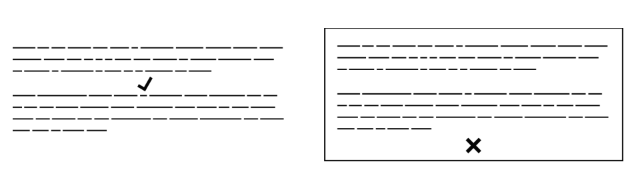
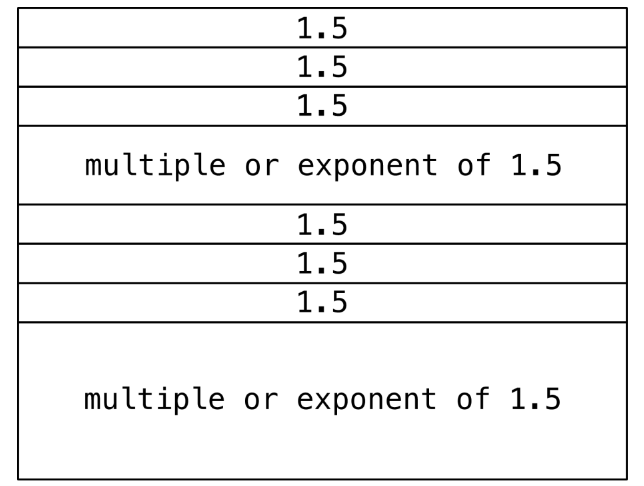
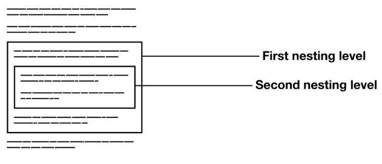
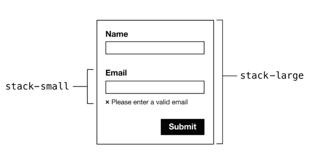
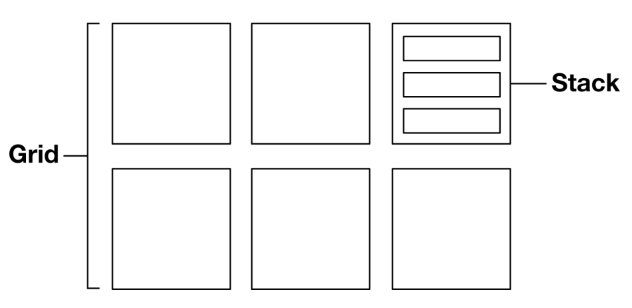
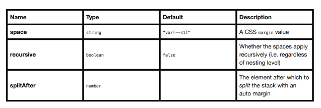

# El Stack

## El problema

Los elementos de flujo requieren espacio (a veces denominado _espacio en blanco_) para separarlos física y conceptualmente de los elementos que vienen antes y después de ellos. Este es el propósito de la propiedad `margin`.

Sin embargo, los sistemas de diseño conciben elementos y componentes de forma aislada. Al momento de la concepción, no está establecido si habrá contenido circundante o cuál será la naturaleza de ese contenido. Un elemento o componente probablemente aparecerá en diferentes contextos, y el requisito de espaciado diferirá.

Estamos en la costumbre de estilizar elementos, o clases de elementos, directamente: hacemos declaraciones de estilo que _pertenecen_ a los elementos. Típicamente, esto no produce problemas, pero `margin` es realmente una propiedad de la _relación_ entre dos elementos próximos. Por lo tanto, el siguiente código es problemático:

```css linenums="1"
p {
  margin-bottom: 1.5rem;
}
```

Dado que la declaración no es sensible al contexto, cualquier aplicación correcta del margen es cuestión de suerte. Si el párrafo es sucedido por otro elemento, el efecto es deseable. Pero un párrafo `:last-child` produce un margen redundante. Dentro de un elemento padre con padding, este margen redundante se combina con el padding del padre para producir el doble del espacio previsto. Este es solo un problema que produce este enfoque.



??? info "Explicacion"

    Este texto está explicando un problema muy común en CSS: **¿quién debería ser responsable del espacio entre los elementos?** Vamos paso por paso.

    ---

    __1. ¿Qué es el flujo?__

    Los elementos HTML normalmente se colocan uno debajo del otro. A eso se le llama **flujo normal del documento**.

    Por ejemplo:

    ```html
    <h1>Título</h1>
    <p>Primer párrafo.</p>
    <p>Segundo párrafo.</p>
    <button>Enviar</button>
    ```

    El navegador los acomoda así:

    ```
    Título

    Primer párrafo.

    Segundo párrafo.

    [Enviar]
    ```

    Pero si no hubiera márgenes, quedarían pegados.

    ---

    __2. ¿Para qué sirve `margin`?__

    El `margin` agrega espacio **por fuera** del elemento.

    ```css
    p {
        margin-bottom: 24px;
    }
    ```

    Ahora cada párrafo deja 24px debajo de él.

    ```
    Primer párrafo.
    ↓ 24px

    Segundo párrafo.
    ↓ 24px

    Botón
    ```

    Hasta aquí parece perfecto.

    ---

    __3. ¿Dónde está el problema?__

    El problema es que el párrafo **no sabe** qué viene después.

    Supón este HTML:

    ```html
    <div class="card">
        <p>Hola</p>
    </div>
    ```

    Y este CSS:

    ```css
    .card {
        padding: 20px;
    }

    p {
        margin-bottom: 20px;
    }
    ```

    Visualmente ocurre esto:

    ```
    +------------------------+
    | padding                |
    |                        |
    | Hola                   |
    |                        | ← margin-bottom
    |                        |
    | padding                |
    +------------------------+
    ```

    Hay:

    * 20px de margin del `<p>`
    * 20px de padding del `.card`

    Entonces abajo del texto hay **40px**.

    Cuando probablemente solo querías 20px.

    ---

    __4. El párrafo no sabe si es el último__

    Imagina:

    ```html
    <div>
        <p>Uno</p>
        <p>Dos</p>
    </div>
    ```

    Aquí sí tiene sentido:

    ```
    Uno
    ↓

    Dos
    ```

    Porque el margen separa dos párrafos.

    Pero ahora:

    ```html
    <div>
        <p>Dos</p>
    </div>
    ```

    Ese margen ya no separa nada.

    Solo deja un espacio vacío al final.

    ---

    __5. El problema de diseñar componentes__

    Imagina que creas un componente:

    ```html
    <Card>
        <p>Descripción</p>
    </Card>
    ```

    Mañana alguien usa el mismo componente así:

    ```html
    <Card>
        <p>Descripción</p>
        <button>Comprar</button>
    </Card>
    ```

    Y pasado mañana así:

    ```html
    <Card>
        
        <p>Descripción</p>
        <ul>...</ul>
    </Card>
    ```

    El mismo `<p>` aparece en tres contextos distintos.

    Entonces...

    **¿Cuánto margen debería tener?**

    No existe una respuesta universal.

    ---

    __6. Lo que dice el texto__

    Cuando escribes:

    ```css
    p {
        margin-bottom: 1.5rem;
    }
    ```

    Estás diciendo:

    > "Todos los párrafos del mundo siempre tendrán espacio debajo."

    Pero eso no siempre es correcto.

    Lo correcto sería decir:

    > "Cuando un párrafo tiene otro elemento después, quiero que exista espacio entre ellos."

    Es decir, el espacio pertenece a **la relación entre dos elementos**, no al párrafo en sí.

    ---

    __7. Una mejor forma__

    En lugar de poner margen a todos los párrafos, muchos sistemas modernos hacen algo como:

    ```css
    .stack > * + * {
        margin-top: 1.5rem;
    }
    ```

    Este selector significa:

    > "Todo elemento que venga inmediatamente después de otro tendrá un margen arriba."

    Por ejemplo:

    ```html
    <div class="stack">
        <h1>Título</h1>
        <p>Texto</p>
        <button>Enviar</button>
    </div>
    ```

    Solo reciben margen los elementos **que tienen un hermano anterior**:

    ```
    Título

    Texto

    Botón
    ```

    Pero el último elemento **no deja un margen sobrante al final**, porque el espacio se añade únicamente **entre elementos consecutivos**, no al final del contenedor.

    ---

    __La idea principal__

    La enseñanza más importante de este apartado es esta:

    * ❌ `margin` no debería verse como una propiedad propia de un elemento ("todos los `<p>` tienen margen").
    * ✅ `margin` representa la **separación entre dos elementos vecinos**. Por eso, en sistemas de diseño modernos, suele controlarse desde el **contenedor** (como un `Stack`) o mediante selectores que aplican espacio solo entre hermanos, evitando márgenes redundantes y componentes que se comportan de forma distinta según el contexto.

??? example 

    Aqui puedes revisar el [Ejemplo](../../examples/stack/withOutMargin.html)

    ```html linenums="1"
    <!DOCTYPE html>
    <html lang="en">
    <head>
        <meta charset="UTF-8">
        <meta name="viewport" content="width=device-width, initial-scale=1.0">
        <title>Document</title>
        <style>
            .contenedor-1{ padding: 10px; background-color: skyblue; }
            .contenedor-2{ background-color: skyblue;}

            .titulo-1{margin-bottom: 1.5rem; background-color: salmon;}
            .titulo-2{background-color: salmon;}
            
            .parrafo-1{margin-bottom:1.5rem ; background-color: beige;}
            .parrafo-2{margin-bottom:1.5rem ; background-color: beige;}
            
            .trasnparente{ background-color: transparent; }

        </style>
    </head>
    <body>
        <div class="contenedor-1">
            <h2 class="titulo-1">Title Card</h2>
            <p class="parrafo-1">Lorem ipsum dolor sit amet consectetur adipisicing elit. Aperiam tempora consectetur nisi magnam at nostrum, error quia magni laborum sint, totam accusamus vel quae, autem similique deleniti voluptatibus aliquam libero?</p>
            <p class="parrafo-1">Al final de este parrafo podemos ver como se agregan(suman) tanto el <strong>margin</strong>  como el <strong>padding</strong>. Por lo tanto, se aprecia un espacio, que es el resultado de la suma de estos dos.</p>
        </div>
        
        <div class="contenedor-2">
            <h2 class="titulo-2">Title Card</h2>
            <p class="parrafo-2">Lorem ipsum dolor sit amet consectetur adipisicing elit. Aperiam tempora consectetur nisi magnam at nostrum, error quia magni laborum sint, totam accusamus vel quae, autem similique deleniti voluptatibus aliquam libero?</p>
            <p class="parrafo-2">Al final de este parrafo, aunque no se puede ver, al final de este parrafo tambien tenemos que se agrego un margen. Solo que adiferencia del anterior ejemplo aqui no agregamos un paddig. <br><br> Puedes aplicar la transparencia para ver que aqui no existe padding, tambien te dijiera que si aplicas la trasnparencia pudieras ver el margin pero lamentablemente este efecto nose puede ver ya que margin no tiene color y por eso he puesto una imagen para que veas que ese margin si existe a pesar de que no lo veas, Revisa la imagen de abajo. <button id="btn">Transparente</button> <button id="btn-c">Dar Color</button></p>
        </div>
        


        <script>
            function trasnparencia(){
                
                parrafoOne.classList.add('trasnparente')
                parrafoTwo.classList.add('trasnparente')
            }
            function pintar(){
                parrafoOne.classList.remove('trasnparente')
                parrafoTwo.classList.remove('trasnparente')
            }

            const boton = document.getElementById('btn')
            const btnColor =  document.getElementById('btn-c')

            const parrafoOne = document.getElementsByClassName('parrafo-2')[0]
            const parrafoTwo = document.getElementsByClassName('parrafo-2')[1]

            boton.addEventListener('click',trasnparencia)
            btnColor.addEventListener('click', pintar)
        </script>
    </body>
    </html>
    ```
## La solución

El truco está en estilizar el _contexto_, no el(los) elemento(s) individual(es). La primitiva de layout _Stack_ inyecta margen entre elementos a través de su padre común:

```css linenums="1"
.stack > * + * {
  margin-top: 1.5rem;
}
```

Usando el combinador de hermano adyacente (`+`), `margin-top` solo se aplica donde el elemento está precedido por otro elemento: no hay margen "sobrante". El selector universal (o _wildcard_) `*` asegura que cualquier y todos los elementos se vean afectados. Esta construcción clave se conoce como el [_* + * owl_ ↗](https://alistapart.com/article/axiomatic-css-and-lobotomized-owls/) (_búho_).

??? info "Explicacion"

    Esta es una de las ideas más importantes de los sistemas de diseño modernos. Vamos a desmenuzarla.

    ---

    __¿Qué problema intenta resolver?__

    Antes hacíamos esto:

    ```css
    p {
        margin-bottom: 1.5rem;
    }
    ```

    El problema era que **el párrafo siempre tenía margen**, aunque fuera el último elemento.

    Entonces el espacio sobraba.

    La solución consiste en **no darle margen al elemento**, sino **crear el espacio únicamente cuando existen dos elementos consecutivos**.

    ---

    __La solución__

    ```css
    .stack > * + * {
        margin-top: 1.5rem;
    }
    ```

    A primera vista parece un selector extraño, pero en realidad está formado por tres partes.

    ---

    __Primera parte__

    ```css
    .stack
    ```

    Selecciona un elemento que tenga la clase:

    ```html
    <div class="stack">
    ```

    Por ejemplo:

    ```html
    <div class="stack">
        ...
    </div>
    ```

    Todo lo que ocurra en el selector sucede dentro de ese contenedor.

    ---

    __Segunda parte__

    ```css
    >
    ```

    Es el **combinador de hijo directo**.

    Significa:

    > "Solo quiero los hijos directos."

    Por ejemplo:

    ```html
    <div class="stack">

        <h1></h1>

        <p></p>

    </div>
    ```

    Sí los selecciona.

    Pero:

    ```html
    <div class="stack">

        <section>

            <p></p>

        </section>

    </div>
    ```

    El `<p>` **no** es hijo directo.

    Solo lo es `<section>`.

    ---

    __Tercera parte__

    ```css
    *
    ```

    El asterisco significa:

    > "Cualquier elemento."

    Puede ser:

    * `h1`
    * `p`
    * `button`
    * `img`
    * `section`
    * `ul`

    Todos.

    ---

    Hasta ahora tenemos:

    ```css
    .stack > *
    ```

    Que significa:

    > "Todos los hijos directos de `.stack`."

    ---

    __La parte interesante__

    ```css
    +
    ```

    Es el **combinador de hermano adyacente**.

    Significa:

    > "Selecciona un elemento que esté inmediatamente después de otro."

    Ejemplo:

    ```html
    <h1></h1>
    <p></p>
    <button></button>
    ```

    Aquí:

    * el `<p>` está inmediatamente después del `<h1>`
    * el `<button>` está inmediatamente después del `<p>`

    Por lo tanto ambos cumplen la condición.

    ---

    __¿Y el segundo `*`?__

    ```css
    * + *
    ```

    Se lee así:

    > "Cualquier elemento que esté inmediatamente después de otro elemento."

    Eso significa que **el primer elemento nunca será seleccionado**.

    ---

    __Veámoslo con un ejemplo__

    ```html
    <div class="stack">

        <h1>Título</h1>

        <p>Texto</p>

        <button>Enviar</button>

    </div>
    ```

    El navegador analiza:

    ```
    h1
    ```

    ¿Tiene un hermano antes?

    No.

    No recibe margen.

    ---

    Luego analiza:

    ```
    p
    ```

    ¿Tiene un hermano inmediatamente antes?

    Sí.

    Es el `h1`.

    Entonces recibe:

    ```css
    margin-top: 1.5rem;
    ```

    ---

    Después analiza:

    ```
    button
    ```

    ¿Tiene un hermano antes?

    Sí.

    Es el `p`.

    También recibe margen.

    ---

    Resultado:

    ```
    Título

    Texto

    Botón
    ```

    Observa algo importante:

    ```
    Título
    ↑
    sin margen

    Texto
    ↑
    con margen

    Botón
    ↑
    con margen
    ```

    Solo los elementos que tienen un hermano anterior reciben espacio.

    ---

    __¿Por qué no sobra espacio al final?__

    Porque el margen pertenece al elemento siguiente.

    Visualmente ocurre esto:

    ```
    Título

    Texto

    Botón
    ```

    No ocurre esto:

    ```
    Título

    Texto

    Botón

    ← margen sobrante
    ```

    Nadie está agregando un margen después del botón.

    Simplemente el botón tiene un margen **encima**.

    Por eso nunca aparece espacio adicional debajo del último elemento.

    ---

    __¿Por qué usan `margin-top` y no `margin-bottom`?__

    Podrían hacerlo al revés, pero usar `margin-top` tiene una ventaja muy importante:

    Cada elemento (excepto el primero) es responsable de separarse del anterior.

    Así el espacio siempre está **entre dos elementos**, nunca después del último.

    ---

    __¿Qué es el `* + * owl`?__

    Esta construcción:

    ```css
    * + *
    ```

    es tan útil que tiene un nombre propio:

    > **The Owl Selector** (el selector búho).

    Se llama así porque los símbolos:

    ```css
    * + *
    ```

    recuerdan la cara de un búho:

    ```
    *   *
    \_/
      +
    ```

    Es una técnica muy utilizada en sistemas de diseño como **Every Layout**, porque permite separar automáticamente cualquier tipo de elementos sin importar si son títulos, párrafos, imágenes, botones o listas.

    ---

    __Idea principal__

    Antes pensábamos así:

    ```text
    El párrafo debe tener margen.
    ```

    Ahora pensamos así:

    ```text
    Dos elementos consecutivos deben tener espacio entre ellos.
    ```

    Ese cambio de mentalidad es fundamental. En lugar de asignar el espaciado a un elemento específico, se asigna a la **relación entre elementos hermanos**, logrando componentes más reutilizables, predecibles y sin márgenes sobrantes.

??? example 

    Aqui puedes revisar este [Ejemplo](../../examples/stack/stacksolution.html)

    ```html
    <!DOCTYPE html>
    <html lang="en">
    <head>
        <meta charset="UTF-8">
        <meta name="viewport" content="width=device-width, initial-scale=1.0">
        <title>Document</title>
        <style>
            *{ margin: 0; }
            .stack > * + * { margin-top: 1.5rem; }
            .parrafo{ margin-top: 1.5rem;}
        </style>
    </head>
    
    <body>
        <div class="stack">
            <h2>Title</h2>
            <p>Aqui el margin se aplica unicamente al elemento que tiene un hermano adyacente, osea un elemento que esta precedido de otro elemento. Por lo tanto no hay margen sobrante. <br><br> Tambien se puede ver que Title no recibe margen porque es el primer elemento y entonces no esta precedido de otro elemento, en consecuencia no recibe margen.</p>
            <p>Lorem ipsum dolor sit amet consectetur adipisicing elit. Ea numquam sapiente repellat dignissimos, fuga quos ratione optio. Suscipit tempore, obcaecati earum recusandae aut dolor, iste perferendis facilis nostrum, hic odit.</p>
            
        </div> 
        
        <div class="stack-2">
            <h2>Title</h2>
            <p class="parrafo">En este segundo ejemplo (que al igual que en el anterior de arriba) podemos ver que cuando usamos la propiedad <strong>margin-top</strong> evitamos el "margen sobrante". <i>Revisar el seguiente ejemplo de esta misma seccion.</i></p>
            <p class="parrafo">Tambien podemos ver en el codigo de este ejemplo, que a diferencia de la seccion de arriba donde se usa la clase <strong>stack</strong>, donde cada vez que agregamos un nuevo elemento dentro del stack se agregaba automaticamente el margen en dicho elemento. Bueno aqui(en stack-2) resulta un poco diferente porque tenemos que agregar el margen uno por uno de forma manual. </p>
            <p class="parrafo"> Estas son las dos principales diferencias que descubri.</p>
        </div> 
                
    </body>
    </html>
    ```
??? example 

    Aqui puedes revisar el [Ejemplo](../../examples/stack/stacksolution2.html)

    ```html linenums="1"
    <!DOCTYPE html>
    <html lang="en">
    <head>
        <meta charset="UTF-8">
        <meta name="viewport" content="width=device-width, initial-scale=1.0">
        <title>Document</title>
        <style>
            *{ margin: 0; }
            .stack > * + * { margin-top: 1.5rem; }
            .stack-2 > * + * { margin-bottom: 1.5rem; }


        </style>
    </head>
    
    <body>
        <div class="stack">
            <h2>Title</h2>
            <p>Aqui cuando usamos <strong>margin-top</strong> evitamos el margen sobrante.</p>
            <p>Lorem ipsum dolor sit amet consectetur adipisicing elit. Ea numquam sapiente repellat dignissimos, fuga quos ratione optio. Suscipit tempore, obcaecati earum recusandae aut dolor, iste perferendis facilis nostrum, hic odit.</p>
            
        </div> 

        <div class="stack-2">
            <h2>Title</h2>
            <p>Aqui cuando usamos <strong>margin-button</strong> no podemos evitar el margen sobrante, osea que aqui si existe</p>
            <p>Lorem ipsum dolor sit amet consectetur adipisicing elit. Ea numquam sapiente repellat dignissimos, fuga quos ratione optio. Suscipit tempore, obcaecati earum recusandae aut dolor, iste perferendis facilis nostrum, hic odit.</p>
            
        </div> 
        
    </body>
    </html>
    ```

## Altura de línea y escala modular

En el ejemplo anterior, usamos un valor `margin-top` de `1.5rem`. Estamos en la costumbre de usar este valor porque refleja nuestra altura de línea (`line-height`) del texto del cuerpo (generalmente preferida) de `1.5`.

El espaciado vertical de tu diseño debería basarse en tu `line-height` estándar porque el texto domina el layout de la mayoría de las páginas, haciendo que una línea de texto sea un denominador natural.

Si el texto del cuerpo tiene un `line-height` de `1.5` (es decir, `1.5` × el `font-size`), tiene sentido usar `1.5` como la relación para tu escala modular. Lee la _introducción a la escala modular_, y cómo se puede expresar con custom properties de CSS.



??? info "Explicacion"

    Este apartado ya no habla del **cómo agregar el espacio**, sino de **cuánto espacio usar**. Vamos paso por paso.

    ---

    __¿Qué dice el texto?__

    En el ejemplo anterior se utilizó:

    ```css
    margin-top: 1.5rem;
    ```

    Y el autor pregunta implícitamente:

    > **¿Por qué precisamente `1.5rem`?**

    La respuesta es que ese valor proviene de la **altura de línea (`line-height`)** del texto.

    ---

    __¿Qué es `line-height`?__

    La propiedad `line-height` controla la distancia entre una línea de texto y la siguiente.

    Por ejemplo:

    ```css
    p {
        font-size: 16px;
        line-height: 1.5;
    }
    ```

    Si el tamaño de letra es:

    ```
    16px
    ```

    Entonces:

    ```
    line-height = 16 × 1.5

    = 24px
    ```

    Cada línea ocupa 24px de alto.

    Visualmente:

    ```
    Primera línea
    ──────────────

    Segunda línea
    ──────────────

    Tercera línea
    ```

    No solo cuenta el tamaño de las letras, sino también el espacio vertical que existe entre ellas.

    ---

    __¿Por qué usar ese mismo valor para los márgenes?__

    Porque casi todas las páginas web están dominadas por texto.

    Piensa en una noticia.

    ```
    Título

    Párrafo

    Párrafo

    Imagen

    Párrafo
    ```

    O un blog.

    ```
    Título

    Subtítulo

    Texto

    Lista

    Texto
    ```

    O la documentación que estás leyendo.

    Todo gira alrededor del texto.

    Por eso el autor dice:

    > La altura de una línea de texto es una excelente unidad para construir todo el espaciado vertical.

    ---

    __Ejemplo__

    Si tu CSS es:

    ```css
    body {
        font-size: 16px;
        line-height: 1.5;
    }
    ```

    Entonces una línea mide:

    ```
    24px
    ```

    En lugar de inventarte valores como:

    ```css
    margin-top: 17px;
    ```

    o

    ```css
    margin-top: 21px;
    ```

    usas:

    ```css
    margin-top: 1.5rem;
    ```

    Así el espacio entre bloques coincide con la altura de una línea de texto.

    Todo se ve más equilibrado.

    ---

    __¿Qué es una escala modular?__

    Aquí aparece un concepto nuevo.

    Una **escala modular** es un conjunto de tamaños que mantienen una proporción constante entre sí.

    Por ejemplo:

    ```
    1
    1.5
    2.25
    3.375
    5.0625
    ...
    ```

    Observa que cada número se obtiene multiplicando el anterior por **1.5**.

    ```
    1 × 1.5 = 1.5

    1.5 × 1.5 = 2.25

    2.25 × 1.5 = 3.375
    ```

    Eso es una escala modular.

    ---

    __¿Para qué sirve?__

    En lugar de elegir tamaños al azar:

    ```
    12px

    19px

    31px

    47px

    83px
    ```

    Todos los tamaños siguen una misma relación.

    Por ejemplo:

    ```
    16px

    24px

    36px

    54px

    81px
    ```

    Todo mantiene armonía visual.

    ---

    __También sirve para los espacios__

    No solo para el texto.

    También puedes usar la misma escala para:

    * márgenes;
    * paddings;
    * separación entre secciones;
    * tamaños de títulos;
    * tamaños de iconos.

    Por ejemplo:

    ```
    1rem

    1.5rem

    2.25rem

    3.375rem
    ```

    Todos pertenecen a la misma familia de tamaños.

    ---

    __¿Qué son las *Custom Properties*?__

    En lugar de escribir los valores una y otra vez:

    ```css
    margin-top: 1.5rem;

    padding: 1.5rem;

    gap: 1.5rem;
    ```

    Puedes definirlos una sola vez.

    ```css
    :root {
        --space: 1.5rem;
    }
    ```

    Y luego reutilizarlos:

    ```css
    .stack > * + * {
        margin-top: var(--space);
    }

    .card {
        padding: var(--space);
    }

    .grid {
        gap: var(--space);
    }
    ```

    Si algún día decides que el espacio debe ser mayor:

    ```css
    --space: 2rem;
    ```

    Todo el sitio se actualiza automáticamente.

    ---

    __Idea principal__

    El autor propone una filosofía sencilla:

    * Como el **texto es el elemento predominante** en la mayoría de interfaces, la **altura de una línea de texto (`line-height`)** es una excelente unidad base para construir el espaciado vertical.
    * En lugar de elegir márgenes y tamaños de forma arbitraria, utiliza una **escala modular**, donde todos los valores mantienen una misma proporción.
    * Centraliza esos valores mediante **CSS Custom Properties**, para conseguir un diseño consistente, fácil de mantener y de ajustar en el futuro.

??? example

    Este ejemplo es bastante simple solo trata de demostrar lo que se explica, nada mas. Lo puedes ver aqui en [Example](../../examples/stack/heigthLinear.html)

    ```html linenums="1"
    <!DOCTYPE html>
    <html lang="en">
    <head>
        <meta charset="UTF-8">
        <meta name="viewport" content="width=device-width, initial-scale=1.0">
        <title>Document</title>
    <style>
        :root{
            --ratio: 1.5;
            --s3: calc(var(--s2) * var(--ratio));
            --s2: calc(var(--s1) * var(--ratio));
            --s1: calc(var(--s0) * var(--ratio));
            --s0: 1rem ;
            --s-1: calc(var(--s0) / var(--ratio));
            --s-2: calc(var(--s-1) / var(--ratio));
        }


    .stack > * + * {

    margin-top: var(--s1);
    line-height:1.5;

    }
    </style>
    </head>
    <body>
        <div class="stack">
            <h2>Title Page</h2>
            <p>Lorem ipsum dolor sit amet consectetur adipisicing elit. Sequi vitae soluta provident quae et ducimus eaque ex vero. Repellat fuga distinctio, repudiandae sit sint esse eius amet. Quod, ad mollitia?</p>
            <p>Lorem ipsum dolor sit amet consectetur, adipisicing elit. Fugiat sapiente id quia? Aspernatur, deleniti autem, libero nihil cumque laboriosam delectus aliquid molestias eos dolor vel nulla fugit excepturi aliquam ea!</p>
        </div>
    </body>
    </html>
    ```

## Recursión

En el ejemplo anterior, el combinador de hijo (`>`) asegura que los márgenes solo se apliquen a los hijos del elemento `.stack`. Sin embargo, es posible inyectar márgenes recursivamente eliminando este combinador del selector.

```css linenums="1"
.stack * + * {
  margin-top: 1.5rem;
}
```

Esto puede ser útil donde quieras afectar elementos en cualquier nivel de anidamiento, manteniendo la regularidad del espacio en blanco. 



En la siguiente demostración (usando el componente _Stack_ para seguir) hay un conjunto de elementos con forma de caja. Dos de estos están anidados dentro de otro. Debido a que se aplica recursión, cada caja está espaciada uniformemente usando solo un `Stack` padre.

!!! info 

    [This interactive demo is only available on the Every Layout site ↗.](https://every-layout.dev/demos/stack-recursion/)


Es probable que encuentres que el modo recursivo afecta elementos no deseados. Por ejemplo, los elementos de lista genéricos que típicamente no están separados por márgenes se dispersarán inesperadamente.


??? info "Explicacion"

    Este apartado explica una variante del selector anterior. La idea principal es: **¿quieres aplicar el espaciado solo a los hijos directos o a todos los elementos, incluso los que están anidados?**

    ---

    __¿Qué cambia?__

    Antes teníamos:

    ```css
    .stack > * + * {
        margin-top: 1.5rem;
    }
    ```

    Ahora queda así:

    ```css
    .stack * + * {
        margin-top: 1.5rem;
    }
    ```

    Parece un cambio pequeño (desaparece el `>`), pero cambia completamente el comportamiento.

    ---

    __Recordemos qué hacía `>`__

    El símbolo:

    ```css
    >
    ```

    significa:

    > **Selecciona únicamente los hijos directos.**

    Por ejemplo:

    ```html
    <div class="stack">
        <h1>Título</h1>

        <section>
            <p>Texto</p>
        </section>

        <button>Enviar</button>
    </div>
    ```

    La estructura es:

    ```
    .stack
    ├── h1
    ├── section
    │   └── p
    └── button
    ```

    Con este selector:

    ```css
    .stack > * + *
    ```

    Solo se consideran:

    * `h1`
    * `section`
    * `button`

    El `<p>` queda fuera porque **no es hijo directo** de `.stack`.

    ---

    __¿Qué ocurre al quitar el `>`?__

    Ahora usamos:

    ```css
    .stack * + *
    ```

    El selector ya no dice:

    > "Hijos directos."

    Ahora dice:

    > **"Cualquier elemento que esté dentro de `.stack`."**

    Eso incluye:

    ```
    .stack
    ├── h1
    ├── section
    │   ├── p
    │   ├── img
    │   └── button
    └── footer
    ```

    Todos esos elementos pueden recibir el margen.

    ---

    __¿Por qué se llama recursión?__

    Porque el selector entra en **todos los niveles de anidamiento**.

    No importa cuántos niveles existan.

    Ejemplo:

    ```html
    <div class="stack">

        <section>

            <article>

                <div>

                    <p>Hola</p>

                </div>

            </article>

        </section>

    </div>
    ```

    Aunque el `<p>` esté muy profundo, el selector sigue alcanzándolo.

    Es como si recorriera todo el árbol del DOM.

    ---

    __Ejemplo visual__

    Sin recursión:

    ```
    .stack

    Caja 1

    Caja 2
        Caja 2.1
        Caja 2.2

    Caja 3
    ```

    Solo se separan:

    ```
    Caja 1

    Caja 2

    Caja 3
    ```

    Las cajas internas mantienen su propio comportamiento.

    ---

    Con recursión:

    ```
    Caja 1

    Caja 2

        Caja 2.1

        Caja 2.2

    Caja 3
    ```

    Ahora también existe separación entre:

    * Caja 2.1
    * Caja 2.2

    aunque estén dentro de otra caja.

    ---

    __¿Por qué puede ser útil?__

    Imagina que estás escribiendo un artículo.

    ```html
    <div class="stack">

        <h1>Título</h1>

        <section>

            <p>Texto...</p>

            

            <blockquote>

                <p>Cita...</p>

            </blockquote>

        </section>

    </div>
    ```

    Gracias a la recursión, **todo el contenido mantiene un espaciado uniforme**, sin importar el nivel donde se encuentre.

    No necesitas crear reglas específicas para cada contenedor.

    ---

    __¿Cuál es el problema?__

    El propio texto advierte que esta técnica puede afectar elementos que **no quieres separar**.

    Por ejemplo, una lista.

    ```html
    <ul>

        <li>Uno</li>

        <li>Dos</li>

        <li>Tres</li>

    </ul>
    ```

    Con el selector recursivo:

    ```css
    .stack * + * {
        margin-top: 1.5rem;
    }
    ```

    Cada `<li>` recibe un margen superior.

    El resultado sería algo parecido a esto:

    ```
    • Uno


    • Dos


    • Tres
    ```

    Cuando normalmente esperamos una lista más compacta.

    Lo mismo puede ocurrir con:

    * elementos de un menú;
    * botones agrupados;
    * tablas;
    * formularios;
    * otros componentes que ya gestionan su propio espaciado.

    ---

    __¿Cuándo usar cada uno?__

    __Usa hijos directos (`>`)__

    ```css
    .stack > * + *
    ```

    Cuando quieras controlar únicamente el espaciado entre los elementos principales de un contenedor.

    Es la opción más segura y la que se utiliza con mayor frecuencia.

    ---

    __Usa el modo recursivo__

    ```css
    .stack * + *
    ```

    Cuando quieras que **todo el contenido**, sin importar su nivel de anidamiento, siga la misma regla de espaciado vertical.

    Es muy útil para documentos largos, artículos o contenido generado dinámicamente.

    ---

    __Idea principal__

    La diferencia entre ambos selectores es sencilla:

    * `> * + *` → aplica el margen **solo a los hijos directos** del contenedor.
    * `* + *` → aplica el margen **a cualquier elemento dentro del contenedor**, incluso si está anidado varios niveles.

    La versión recursiva consigue un espaciado uniforme en todo el árbol del DOM, pero puede introducir márgenes en elementos que normalmente no deberían tenerlos, como los elementos de una lista (`<li>`). Por eso debe usarse con cuidado.

??? example

    Aqui puedes revisar el [Example](../../examples/stack/recursion.html)

    ```html linenums="1"
    <!DOCTYPE html>
    <html lang="en">
    <head>
        <meta charset="UTF-8">
        <meta name="viewport" content="width=device-width, initial-scale=1.0">
        <title>Document</title>
        <style>
            :root{
                --rate:1.5;
                --s1:calc(var(var(--s0)) * var(--rate));
                --s0:1rem;
                --s-1:calc(var(--s0)/ var(--rate));
            }
            .stack-1 * + * {
            line-height: 1.5;
            margin-top: var(--s0); 
            
            }
            .stack-2 > * + *{
                line-height: 1.5;
                margin-top: var(--s0); 
            
            }
            .caja-1{background-color: skyblue;}
            .caja-2{background-color: skyblue;}
            .caja-3{background-color: skyblue;}
            .caja-1-1{ background-color:beige}
            .caja-1-2{  background-color:beige}

            .caja-4{background-color: skyblue;}
            .caja-5{background-color: skyblue;}
            .caja-6{background-color: skyblue;}
            .caja-4-1{ background-color:beige}
            .caja-4-2{  background-color:beige}

            .note{
                background-color: gray;
                font-size: var(--s-1);
                margin-bottom: 1rem;
                margin-top: 1rem;
            }
            .style-stack{
                background-color: orange;
                padding: 1rem;
            }


        </style>
    </head>
    <body>
        <div class="note">Aqui usamos recursion y podemos ver como todas las cajas se afectan por el margen sin importar la profundidad del anidamientos, esto se aplica a todas las cajas dentro del stack sin execpcion. Aqui usamos la esta notacion <strong>* + *</strong> sin el <strong>></strong>. Por eso se aplican a todas los elementos son importar el nivel de profundidad de anidamiento. <br><br> Tambien podemosver que al igual que en los anteriores ejemplo el primer elemento no se afecta ya que al usar el * + * <i></i> siempre afectara a los elementos que tenga un hermano anterior</div>
        
        <div class="stack-1 style-stack">
            <div class="caja-1">
                [CAJA 1] Lorem ipsum dolor sit amet consectetur adipisicing elit. Sequi quidem tenetur eligendi suscipit quod quis architecto a labore dolor? Sequi ut nemo dicta natus sit exercitationem totam qui nam sed.
                <div class="caja-1-1">
                    [CAJA 1-1] Lorem ipsum dolor sit amet consectetur adipisicing elit. Sunt maxime, laboriosam neque quia nam adipisci veritatis ab enim labore! Sunt, quae molestias minima deserunt dolor corporis vitae quod repudiandae maxime.
                </div>
                <div class="caja-1-2">
                    [CAJA 1 - 2] Lorem ipsum dolor sit amet consectetur adipisicing elit. Necessitatibus natus placeat qui est minima nihil commodi, aspernatur quibusdam odio delectus a consequatur voluptas repellendus nobis consectetur, quae perferendis exercitationem debitis.
                </div>
            </div>
            <div class="caja-2"> [CAJA 2]Lorem ipsum dolor, sit amet consectetur adipisicing elit. Reiciendis, porro deleniti dolores dignissimos minima ea dolor tempore dolorem nisi obcaecati aspernatur ipsam odio laboriosam, corrupti, repudiandae iste. Tempora, quos repudiandae!</div>
            <div class="caja-3"> [CAJA 3] Lorem ipsum dolor sit amet consectetur adipisicing elit. Culpa a, temporibus voluptate sit laudantium magnam, cum quas distinctio, aperiam facilis quidem repudiandae minima fugiat quos sapiente error possimus eveniet sed!</div>
        </div>
        <div class="note">
            Mientras tanto que aqui solo aplican para las cajas hijas dentro del stack, aqui usamos  > * + *. Aqui los elemetos dentro de la primera caja no tiene margin como en el anterior ejemplo.
        </div>
        
        <div class="stack-2  style-stack">
            <div class="caja-4">
                [CAJA 4] Lorem ipsum dolor sit amet consectetur adipisicing elit. Rem blanditiis ab corrupti ea maxime voluptate consectetur ut voluptas sapiente ad nobis modi, explicabo nam perspiciatis praesentium dolor animi soluta at!
                <div class="caja-4-1">[CAJA 4-1] Lorem ipsum dolor sit, amet consectetur adipisicing elit. Beatae numquam quae dicta nulla nisi dignissimos consectetur repellendus aut, praesentium, dolorem molestiae est iusto eaque provident. Eos veritatis assumenda quas corrupti?</div>
                <div class="caja-4-2">[CAJA 4-2]Lorem ipsum dolor sit amet consectetur adipisicing elit. Obcaecati adipisci aut delectus temporibus quam, eius veritatis laboriosam assumenda provident vel odio quas officiis, aliquid architecto nostrum cumque illo. Omnis, officia?</div>
            </div>
            <div class="caja-5">[CAJA 5]Lorem, ipsum dolor sit amet consectetur adipisicing elit. Accusantium velit porro atque eos odit, officia voluptatibus, ut animi natus praesentium delectus doloremque earum vero veniam itaque excepturi amet aliquid aspernatur.</div>
            <div class="caja-6">[CAJA 6]Lorem ipsum, dolor sit amet consectetur adipisicing elit. Atque dicta ab totam, aliquam ullam alias ad sed provident dolores architecto quasi adipisci quis nisi neque voluptatum facilis fugiat facere delectus!</div>
        </div>
    </body>
    </html>
    ```
## Variantes anidadas

La recursión aplica el mismo margen sin importar la profundidad de anidamiento. Un enfoque más deliberado sería configurar `Stacks` no recursivos alternativos con diferentes valores de margen, y anidarlos donde sea adecuado. Considera lo siguiente:

```css linenums="1"
[class^='stack'] > * {
  margin-top: 0;
  margin-bottom: 0;
}
.stack-large > * + * {
  margin-top: 3rem;
}
.stack-small > * + * {
  margin-top: 0.5rem;
}
```

!!! info

    [This interactive demo is only available on the Every Layout site ↗](https://every-layout.dev/demos/stack-variants/)

El selector del primer bloque de declaración restablece el margen vertical para todos los elementos similares a `stack` (coincidiendo con valores de clase que _comienzan_ con `stack`). Importantemente, solo se restablecen los márgenes verticales, porque el stack solo _afecta_ el margen vertical, y no queremos que alcance fuera de su competencia. Puede que no necesites este restablecimiento si un restablecimiento universal para `margin` ya está en su lugar (ver _Global and local styling_).

Los siguientes dos bloques configuran `Stacks` alternativos, con diferentes valores de margen. Estos pueden anidarse para producir — por ejemplo — el layout de formulario ilustrado. Ten en cuenta que los elementos `<label>` necesitarían tener `display: block` aplicado para aparecer arriba de los inputs, y para que sus márgenes realmente produzcan espacios (el margen vertical de los elementos inline no tiene efecto; ver _The display property_).



En _Every Layout_, se usan custom elements para implementar componentes/primitivas de layout como el _Stack_. En el componente _Stack_, la prop (propiedad; atributo) `space` se usa para definir el valor de espaciado. El ejemplo de clases modificadas anterior es solo para ilustración. Ver el _ejemplo anidado_.

??? info "Explicacion"

    Este apartado explica cómo resolver un problema de la recursión: **no todo el contenido necesita la misma separación**. En lugar de aplicar un único margen a todos los niveles, puedes crear **Stacks con diferentes tamaños de espaciado** y anidarlos según la necesidad.

    ---

    __¿Cuál es el problema de la recursión?__

    Recordemos el selector recursivo:

    ```css
    .stack * + * {
        margin-top: 1.5rem;
    }
    ```

    Este aplica **el mismo margen** a todos los elementos, sin importar dónde estén.

    Por ejemplo:

    ```html
    <div class="stack">

        <h1>Título</h1>

        <section>

            <p>Texto</p>

            <button>Aceptar</button>

        </section>

    </div>
    ```

    El espacio entre:

    * `Título` y `section`
    * `Texto` y `button`

    será exactamente el mismo.

    Pero muchas veces eso no es lo que queremos.

    ---

    __¿Por qué?__

    Porque distintos grupos de elementos necesitan distintos espacios.

    Por ejemplo:

    * Entre secciones de una página → mucho espacio.
    * Entre un `<label>` y su `<input>` → poco espacio.

    No tendría sentido usar el mismo margen para ambos casos.

    ---

    __La solución__

    Crear varios tipos de **Stack**.

    ```css
    .stack-large > * + * {
        margin-top: 3rem;
    }

    .stack-small > * + * {
        margin-top: 0.5rem;
    }
    ```

    Ahora existen dos variantes.

    __Stack grande__

    ```css
    .stack-large
    ```

    Espacio:

    ```
    3rem
    ```

    Ideal para separar secciones completas.

    ---

    __Stack pequeño__

    ```css
    .stack-small
    ```

    Espacio:

    ```
    0.5rem
    ```

    Ideal para elementos relacionados entre sí.

    ---

    __¿Qué hace este selector?__

    ```css
    [class^='stack'] > * {
        margin-top: 0;
        margin-bottom: 0;
    }
    ```

    Es probablemente la parte más extraña del ejemplo.

    ---

    __`[class^='stack']`__

    Significa:

    > Selecciona cualquier elemento cuya clase **empiece por** `"stack"`.

    Por ejemplo:

    ```html
    <div class="stack"></div>

    <div class="stack-small"></div>

    <div class="stack-large"></div>

    <div class="stack-form"></div>
    ```

    Todos coinciden.

    Pero esto:

    ```html
    <div class="card"></div>
    ```

    No coincide.

    ---

    __¿Qué hace el bloque?__

    ```css
    [class^='stack'] > * {

        margin-top: 0;

        margin-bottom: 0;

    }
    ```

    Elimina cualquier margen vertical que ya tengan los hijos.

    ¿Por qué?

    Porque muchos elementos HTML ya traen márgenes por defecto.

    Por ejemplo:

    ```html
    <h1></h1>

    <p></p>

    <ul></ul>
    ```

    Los navegadores les agregan márgenes automáticamente.

    Si no los eliminas, terminarías con:

    ```
    margen del navegador

    +

    margen del Stack
    ```

    Y el espacio sería impredecible.

    Por eso primero se reinician los márgenes y luego el Stack agrega exactamente el espacio que desea.

    ---

    __¿Por qué solo reinicia los márgenes verticales?__

    Observa:

    ```css
    margin-top: 0;

    margin-bottom: 0;
    ```

    No hace esto:

    ```css
    margin: 0;
    ```

    ¿Por qué?

    Porque el Stack solo controla el espaciado vertical.

    No quiere modificar:

    * `margin-left`
    * `margin-right`

    Eso pertenece a otros componentes o layouts.

    Cada componente debe responsabilizarse únicamente de aquello que controla.

    ---

    __Ejemplo práctico__

    Imagina un formulario.

    ```html
    <form class="stack-large">

        <section class="stack-small">

            <label>Nombre</label>

            <input>

        </section>

        <section class="stack-small">

            <label>Email</label>

            <input>

        </section>

        <button>Guardar</button>

    </form>
    ```

    Visualmente:

    ```
    Nombre
    [input]


    Email
    [input]


    [Guardar]
    ```

    Observa que:

    * Entre `label` e `input` hay poco espacio (`0.5rem`).
    * Entre cada grupo del formulario hay mucho más espacio (`3rem`).

    Todo esto se consigue simplemente anidando distintos Stacks.

    ---

    __¿Por qué menciona `display: block` en los `<label>`?__

    Los `<label>` son elementos **inline** por defecto.

    ```html
    <label>Nombre</label>
    <input>
    ```

    Se muestran así:

    ```
    Nombre [________]
    ```

    Si queremos que aparezcan uno encima del otro:

    ```
    Nombre

    [________]
    ```

    Debemos convertir el `label` en un elemento de bloque.

    ```css
    label {
        display: block;
    }
    ```

    Además, los elementos **inline** ignoran los márgenes verticales (`margin-top` y `margin-bottom`), por lo que convertirlos en `block` permite que el espaciado del Stack funcione correctamente.

    ---

    __¿Qué significa el último párrafo?__

    El autor aclara que este ejemplo usa clases como:

    ```css
    .stack-small

    .stack-large
    ```

    Solo para facilitar la explicación.

    En **Every Layout**, realmente se utiliza un componente llamado **Stack**, al que se le pasa una propiedad (`space`) para indicar cuánto espacio debe haber.

    La idea conceptual es la misma: definir el espaciado desde el contenedor, pero la implementación es más flexible.

    ---

    __Idea principal__

    En lugar de usar un único Stack recursivo para todo el documento, es mejor crear **variantes de Stack** con diferentes tamaños de espaciado (por ejemplo, grande y pequeño) y anidarlas según el contexto. De este modo, cada grupo de elementos recibe la separación adecuada, el diseño resulta más consistente y el control del espaciado sigue estando centralizado en los contenedores en lugar de en los elementos individuales.

??? example 

    Aqui puedes ver el [Example](../../examples/stack/stacks.html).

    ```html
    <!DOCTYPE html>
    <html lang="en">
    <head>
        <meta charset="UTF-8">
        <meta name="viewport" content="width=device-width, initial-scale=1.0">
        <title>Document</title>
            <style>
            :root{
                --rate:1.5;
                --s2:calc( var(--s1) * var(--rate) );
                --s1:calc( var(--s0) * var(--rate) );
                --s1: 1rem;
                --s-1:calc(var(--s1) / var(--rate));
            }
            

            label { display: block; }

    
            [class^='stack']> *{
                margin-top: 0;
                margin-bottom: 0;
            }
            .stack-large > * + * {
                margin-top: var(--s2) ;
            }
            .stack-small > * + * {
            margin-top: var(--s0);
            }

            #formulario{
                color: rgb(198, 198, 198);
                background-color: rgb(7, 6, 13);
                max-width: 21.5ch;
                padding: var(--s1);
                border-radius: 2%;
            }


        </style>
    </head>
    <body>
        <div id="formulario">
            <form class="stack-large">
                <div class="stack-small">
                    <label for="nameuser">Name:</label>
                    <input name="nameuser"/>
                </div>
                <div class="stack-small">
                    <label for="email">Email:</label>
                    <input name="email"/>

                </div>
                <div>
                    <button>Enviar</button>
                </div>
            </form>
        </div>
        

    </body>
    </html>
    ```
## Excepciones

CSS funciona mejor como un lenguaje basado en excepciones. Escribes reglas de gran alcance, luego usas la cascada para anular estas reglas en casos especiales. Como está escrito en [_Managing Flow and Rhythm with CSS Custom Properties_ ↗](https://24ways.org/2018/managing-flow-and-rhythm-with-css-custom-properties/), puedes crear excepciones por elemento dentro de un solo contexto (es decir, en el mismo nivel de anidamiento).

```css linenums="1"
.stack > * + * {
  margin-top: var(--space, 1.5em);
}
.stack-exception,
.stack-exception + * {
  --space: 3rem;
}
```

Observa que estamos aplicando el espaciado aumentado _por encima y por debajo_ del elemento `.stack-exception`, donde sea aplicable. Si solo quisieras aumentar el espacio _por encima_, eliminarías `.stack-exception + *`.

Esto funciona porque `*` tiene especificidad _cero_, así que `.stack > * + *` y `.stack-exception` tienen la misma especificidad y `.stack-exception` anula en la cascada (al aparecer más abajo en la hoja de estilo).

??? info "Explicacion"

      Este apartado introduce una idea muy importante de CSS: **no escribas muchas reglas específicas desde el principio; escribe una regla general y crea excepciones cuando sean necesarias.**

      ---

      __¿Qué significa "CSS funciona mejor como un lenguaje basado en excepciones"?__

      La filosofía es esta:

      1. Escribes una regla que funcione para el **90% de los casos**.
      2. Solo cuando aparece un caso especial, lo modificas.

      Es mejor hacer esto:

      ```css
      .stack > * + * {
          margin-top: 1.5rem;
      }
      ```

      Que esto:

      ```css
      .titulo {
          margin-top: 3rem;
      }

      .parrafo {
          margin-top: 1.5rem;
      }

      .lista {
          margin-top: 2rem;
      }

      .imagen {
          margin-top: 4rem;
      }

      /* ...y así con decenas de reglas */
      ```

      La primera opción es mucho más fácil de mantener.

      ---

      __La regla general__

      ```css
      .stack > * + * {
          margin-top: var(--space, 1.5em);
      }
      ```

      Aquí aparece algo nuevo:

      ```css
      var(--space, 1.5em)
      ```

      ---

      __¿Qué significa `var()`?__

      `var()` obtiene el valor de una **Custom Property**.

      ```css
      --space
      ```

      Si existe:

      ```css
      --space: 3rem;
      ```

      Entonces:

      ```css
      margin-top: var(--space);
      ```

      equivale a:

      ```css
      margin-top: 3rem;
      ```

      ---

      __¿Y el `1.5em`?__

      Es el **valor por defecto**.

      ```css
      var(--space, 1.5em)
      ```

      Se lee así:

      > Usa `--space`.

      Pero...

      > Si `--space` no existe, usa `1.5em`.

      Es exactamente igual a decir:

      ```
      ¿Existe --space?

      Sí → úsalo.

      No → usa 1.5em.
      ```

      ---

      __Ahora aparece la excepción__

      ```css
      .stack-exception,
      .stack-exception + * {
          --space: 3rem;
      }
      ```

      Aquí no se modifica directamente el margen.

      Solo cambia el valor de:

      ```css
      --space
      ```

      Y como el margen depende de esa variable...

      ```css
      margin-top: var(--space);
      ```

      El margen cambia automáticamente.

      ---

      __Veamos un ejemplo__

      ```html
      <div class="stack">

          <h1>Título</h1>

          <p>Introducción</p>

          <hr class="stack-exception">

          <p>Nuevo capítulo</p>

      </div>
      ```

      Por defecto:

      ```
      Título

      Introducción

      <hr>

      Nuevo capítulo
      ```

      Todos tienen:

      ```
      1.5em
      ```

      de separación.

      ---

      Pero cuando el navegador encuentra:

      ```html
      <hr class="stack-exception">
      ```

      Sucede esto:

      ```css
      --space: 3rem;
      ```

      Entonces el espacio cambia.

      Resultado:

      ```
      Título

      Introducción


      ──────────────


      Nuevo capítulo
      ```

      El separador (`<hr>`) queda más aislado visualmente.

      ---

      __¿Por qué hay dos selectores?__

      ```css
      .stack-exception,
      .stack-exception + *
      ```

      El primero:

      ```css
      .stack-exception
      ```

      Afecta al propio elemento.

      El segundo:

      ```css
      .stack-exception + *
      ```

      Afecta al elemento inmediatamente siguiente.

      Entonces:

      ```html
      <p>Texto</p>

      <hr class="stack-exception">

      <p>Otro texto</p>
      ```

      Visualmente:

      ```
      Texto


      <hr>


      Otro texto
      ```

      Hay espacio:

      * antes del `<hr>`;
      * después del `<hr>`.

      ---

      __¿Y si solo quiero espacio arriba?__

      Entonces eliminarías:

      ```css
      .stack-exception + *
      ```

      Quedaría:

      ```css
      .stack-exception {
          --space: 3rem;
      }
      ```

      Ahora solo aumenta el espacio antes del elemento especial.

      ---

      __¿Por qué funciona?__

      El texto habla de la **especificidad**.

      Observa la regla principal:

      ```css
      .stack > * + *
      ```

      El selector universal:

      ```css
      *
      ```

      tiene **especificidad 0**.

      En cambio:

      ```css
      .stack-exception
      ```

      es una clase.

      Las clases tienen más peso que `*`.

      Además, la regla aparece **después** en la hoja de estilos.

      Cuando dos reglas tienen la misma prioridad, CSS aplica la última que encuentra.

      Por eso:

      ```css
      --space: 3rem;
      ```

      reemplaza el valor anterior.

      ---

      __¿Por qué modificar la variable y no el margen?__

      Podríamos hacer esto:

      ```css
      .stack-exception {
          margin-top: 3rem;
      }
      ```

      Pero eso rompe la filosofía del Stack.

      La idea es que **el Stack siga siendo quien controla el espaciado**.

      Las excepciones solo cambian el valor que usa el Stack.

      Es mucho más flexible.

      ---

      __Idea principal__

      En lugar de escribir reglas especiales para modificar directamente los márgenes, el Stack utiliza una **Custom Property** (`--space`) como fuente del espaciado. La regla general aplica ese valor a todos los elementos y, cuando aparece un caso especial, solo se cambia el valor de la variable para ese elemento (o para el siguiente). De esta manera, el mecanismo de espaciado sigue siendo el mismo y las excepciones se integran de forma limpia gracias a la cascada y la especificidad de CSS.

??? example

    Aqui puedes revisar el [Example](../../examples/stack/execptions.html)

    Aqui se puede ver que el margin del primer separador solamente se aplica a la parte de arriba, mientras  que el segundo separador se aplica el margin tanto arriba como abajo.

    ```html linenums="1"
    <!DOCTYPE html>
    <html lang="en">
    <head>
        <meta charset="UTF-8">
        <meta name="viewport" content="width=device-width, initial-scale=1.0">
        <title>Document</title>
        <style>
            :root{
                --rate:1.2;
                --s2:calc(var(--s1) var(--rate));
                --s1:calc(var(--s0) * var(--rate));
                --s0: 1rem;
                --s-1: calc(var(--s0) / var(--rate))
            }

            [class^='stack'] > * {
                margin-top: 0;
                margin-bottom: 0;
            }

            .stack-large > * + * { margin-top: var(--space, var(--s0) ); }
            .exeption-1{ --space:3em; }
            .exeption-2,
            .exeption-2 +*{ --space:5em; }
        </style>
    </head>
    <body>
        <div class="stack-large">
            <h2>Titulo</h2>
            <p>Lorem ipsum dolor sit amet consectetur adipisicing elit. Modi veniam quae debitis cum reiciendis cupiditate ipsa exercitationem unde velit. Voluptatem ad minus nulla rem architecto amet labore porro, voluptas minima.</p>
            <p>Lorem ipsum dolor sit amet consectetur adipisicing elit. Omnis saepe ipsam dignissimos esse vero doloremque nostrum, alias, quaerat accusamus tenetur ratione iusto sunt quia error quod dolorum? Excepturi, mollitia possimus?</p>
        <hr class="exeption-1">
            <p>Lorem, ipsum dolor sit amet consectetur adipisicing elit. Corporis, illo harum animi ipsum cumque dignissimos ipsa. Facilis, sit minus libero eaque eligendi doloribus non unde, laudantium illo at ad repellat.</p>
            <p>Lorem, ipsum dolor sit amet consectetur adipisicing elit. Maiores quam fugit vero dolorem delectus, nesciunt deserunt ullam distinctio et ipsa nihil nobis officia, animi, iste ratione dolores perspiciatis harum quae!</p>
            <p>Lorem ipsum dolor sit amet, consectetur adipisicing elit. Saepe minima earum officiis voluptatum sit magnam. Facilis eveniet maxime in, voluptatibus facere fuga optio tempora nihil ex consequatur excepturi amet cum.</p>
            <hr class="exeption-2">
            <p>Lorem, ipsum dolor sit amet consectetur adipisicing elit. Maiores quam fugit vero dolorem delectus, nesciunt deserunt ullam distinctio et ipsa nihil nobis officia, animi, iste ratione dolores perspiciatis harum quae!</p>
            <p>Lorem ipsum dolor sit amet, consectetur adipisicing elit. Saepe minima earum officiis voluptatum sit magnam. Facilis eveniet maxime in, voluptatibus facere fuga optio tempora nihil ex consequatur excepturi amet cum.</p>
        </div>
    </body>
    </html>
    ```

    

## Dividiendo el stack

Al hacer del `Stack` un contexto Flexbox, podemos darle un poder final: la capacidad de agregar un margen `auto` a un elemento elegido. De esta manera, podemos agrupar elementos en la parte superior e inferior del espacio vertical. Útil para componentes tipo tarjeta.

En el siguiente ejemplo, hemos elegido agrupar elementos _después_ del segundo elemento hacia la parte inferior del espacio.

```css linenums="1"
.stack {
  display: flex;
  flex-direction: column;
  justify-content: flex-start;
}
.stack > * + * {
  margin-top: var(--space, 1.5rem);
}
.stack > :nth-child(2) {
  margin-bottom: auto;
}
```
??? info "Explicacion"

    Este patrón aprovecha una característica muy poderosa de **Flexbox**: los márgenes automáticos (`auto`).

    Veamos el código paso a paso:

    ```css
    .stack {
    display: flex;
    flex-direction: column;
    justify-content: flex-start;
    }
    ```

    Aquí el contenedor se convierte en un Flexbox vertical:

    ```
    Elemento 1
    Elemento 2
    Elemento 3
    Elemento 4
    ```

    porque `flex-direction: column` apila los elementos de arriba hacia abajo.

    ---

    Luego:

    ```css
    .stack > * + * {
    margin-top: var(--space, 1.5rem);
    }
    ```

    Esto agrega espacio entre todos los elementos:

    ```
    Elemento 1

    Elemento 2

    Elemento 3

    Elemento 4
    ```

    ---

    La parte interesante es esta:

    ```css
    .stack > :nth-child(2) {
    margin-bottom: auto;
    }
    ```

    Selecciona el **segundo hijo**:

    ```
    Elemento 1
    Elemento 2 ← aquí
    Elemento 3
    Elemento 4
    ```

    y le pone:

    ```css
    margin-bottom: auto;
    ```

    En Flexbox, un margen `auto` absorbe todo el espacio libre disponible.

    Imagina que el contenedor tiene una altura de 500px:

    ```
    ┌───────────────┐
    │ Elemento 1    │
    │               │
    │ Elemento 2    │
    │               │ ← espacio libre absorbido
    │               │
    │               │
    │ Elemento 3    │
    │ Elemento 4    │
    └───────────────┘
    ```

    El resultado es que:

    * Los elementos **antes** del margen auto quedan arriba.
    * Los elementos **después** del margen auto son empujados hacia abajo.

    Visualmente:

    ```
    Elemento 1
    Elemento 2
    ──────────────
    (espacio libre)
    ──────────────
    Elemento 3
    Elemento 4
    ```

    ---

    __¿Por qué se usa en tarjetas?__

    Imagina una tarjeta:

    ```html
    <div class="card stack">
    <h2>Título</h2>
    <p>Descripción</p>
    <button>Comprar</button>
    </div>
    ```

    Si haces:

    ```css
    .card {
    height: 300px;
    }

    .card p {
    margin-bottom: auto;
    }
    ```

    obtienes:

    ```
    ┌──────────────┐
    │ Título       │
    │ Descripción  │
    │              │
    │              │
    │              │
    │              │
    │ Comprar      │
    └──────────────┘
    ```

    El botón siempre queda pegado abajo, aunque la descripción tenga diferente longitud.

    ---

    La clave es entender que en **Flexbox**, `margin-bottom: auto` no significa "calcular el margen automáticamente" como en otros contextos. Significa:

    > "Toma todo el espacio libre que quede y úsalo como margen."

    Por eso actúa como un separador flexible que empuja los elementos siguientes hacia el final del contenedor.

    ??? info "¿ A que te refieres con que absorbe el espacio libre disponible ?"

        Esa es la idea clave de `auto` en Flexbox. Vamos a verlo con un ejemplo muy visual.

        Supón que tienes este contenedor:

        ```css
        .stack {
            display: flex;
            flex-direction: column;
            height: 500px;
        }
        ```

        Y dentro hay cuatro elementos de **50 px** de alto cada uno:

        ```
        ┌─────────────────────┐
        │ Elemento 1 (50px)   │
        │ Elemento 2 (50px)   │
        │ Elemento 3 (50px)   │
        │ Elemento 4 (50px)   │
        └─────────────────────┘
        ```

        En total ocupan:

        * Contenedor: **500 px**
        * Elementos: **200 px**

        Entonces sobran:

        ```
        500 - 200 = 300 px
        ```

        Esos **300 px** son el **espacio libre**.

        ---

        __Sin `margin-bottom: auto`__

        Ese espacio queda al final del contenedor:

        ```
        ┌─────────────────────┐
        │ Elemento 1          │
        │ Elemento 2          │
        │ Elemento 3          │
        │ Elemento 4          │
        │                     │
        │                     │
        │                     │
        └─────────────────────┘
        ```

        ---

        __Con `margin-bottom: auto` en el segundo elemento__

        ```css
        :nth-child(2) {
            margin-bottom: auto;
        }
        ```

        Ahora Flexbox dice:

        > "Como el margen inferior es `auto`, le voy a dar TODO el espacio libre."

        Es decir:

        ```
        margin-bottom = 300px
        ```

        El resultado es:

        ```
        ┌─────────────────────┐
        │ Elemento 1          │
        │ Elemento 2          │
        │                     │
        │                     │ ← estos 300px ahora
        │                     │    son el margen
        │                     │
        │ Elemento 3          │
        │ Elemento 4          │
        └─────────────────────┘
        ```

        Observa que **el espacio no desapareció**.

        Simplemente **dejó de estar al final** y pasó a formar parte del margen inferior del segundo elemento.

        ---

        __¿Por qué se dice "absorber"?__

        Imagina el espacio libre como agua:

        ```
        Contenedor
        ┌─────────────────────┐
        │  Agua (espacio)     │
        │  Agua (espacio)     │
        │  Agua (espacio)     │
        └─────────────────────┘
        ```

        Cuando escribes:

        ```css
        margin-bottom: auto;
        ```

        ese margen es como una esponja que dice:

        > "Dame toda el agua que sobre."

        Y Flexbox le entrega todo el espacio libre.

        ---

        __Si hubiera dos márgenes `auto`__

        Por ejemplo:

        ```css
        .elemento2 {
            margin-bottom: auto;
        }

        .elemento3 {
            margin-top: auto;
        }
        ```

        Los dos márgenes se repartirían el espacio libre.

        Si sobraban **300 px**, Flexbox asignaría aproximadamente:

        * `margin-bottom` del elemento 2 → **150 px**
        * `margin-top` del elemento 3 → **150 px**

        Por eso se dice que los márgenes `auto` **consumen** o **absorben** el espacio libre disponible: toman el espacio que no está siendo utilizado por los elementos y lo convierten en margen. Esa es una capacidad especial de los márgenes `auto` dentro de un contenedor Flexbox.
    
    ??? info "¿ Y que pasa si no hay espacio libre disponible "

        Muy buena pregunta. **Si no hay espacio libre, `margin: auto` no tiene nada que absorber.**

        Veamos varios casos.

        __Caso 1: Sí hay espacio libre__

        Contenedor de **500 px**.

        Cada elemento mide **50 px**.

        ```text
        Contenedor: 500 px
        Elementos: 200 px

        Espacio libre: 300 px
        ```

        Entonces:

        ```css
        :nth-child(2) {
            margin-bottom: auto;
        }
        ```

        El margen inferior pasa a medir **300 px**.

        ---

        __Caso 2: No hay espacio libre__

        Ahora el contenedor mide exactamente lo mismo que el contenido.

        ```text
        Contenedor: 200 px
        Elementos: 200 px

        Espacio libre: 0 px
        ```

        Visualmente:

        ```text
        ┌─────────────────────┐
        │ Elemento 1          │
        │ Elemento 2          │
        │ Elemento 3          │
        │ Elemento 4          │
        └─────────────────────┘
        ```

        Aunque tengas:

        ```css
        :nth-child(2) {
            margin-bottom: auto;
        }
        ```

        el resultado es exactamente el mismo.

        ¿Por qué?

        Porque Flexbox calcula:

        ```text
        Espacio libre = 0 px
        ```

        Entonces:

        ```text
        margin-bottom = 0 px
        ```

        No hay nada que repartir.

        ---

        __Caso 3: El contenido es más grande que el contenedor__

        Supón:

        ```text
        Contenedor: 200 px
        Contenido: 300 px
        ```

        Ahora ni siquiera sobra espacio.

        Faltan **100 px**.

        ```text
        200 - 300 = -100 px
        ```

        Hay **espacio libre negativo**, es decir, el contenido desborda el contenedor.

        En ese caso:

        ```css
        margin-bottom: auto;
        ```

        tampoco empuja nada.

        Simplemente se comporta como si fuera **0**.

        ---

        __La regla general__

        Flexbox primero hace este cálculo:

        ```text
        Espacio libre =
        Tamaño del contenedor
        − tamaño de los elementos
        − márgenes fijos
        − paddings
        − bordes
        ```

        * Si el resultado es **positivo**, los márgenes `auto` lo absorben.
        * Si es **0**, no absorben nada.
        * Si es **negativo**, tampoco absorben nada.

        Por eso `margin: auto` **no crea espacio**; solo **usa el espacio que ya existe**.

        Esa es la diferencia con escribir algo como:

        ```css
        margin-bottom: 100px;
        ```

        Ese margen siempre será de 100 px, haya o no espacio suficiente (lo que incluso puede hacer que el contenido se desborde).

        En cambio:

        ```css
        margin-bottom: auto;
        ```

        solo utiliza el espacio sobrante. Si no sobra nada, el margen efectivo es 0.

??? example

    !!! note

        Sí. De hecho, esa es una de las características fundamentales de Flexbox.

        Cuando haces:

        ```css
        .contenedor {
            display: flex;
        }
        ```

        ocurren dos cosas importantes:

        1. El contenedor se convierte en un **contenedor flex**.
        2. **Todos sus hijos directos** pasan a ser **flex items**.

        Por defecto, Flexbox usa:

        ```css
        flex-direction: row;
        ```

        Es decir, el eje principal es horizontal.

        Entonces, si tienes:

        ```html
        <div class="contenedor">
            <div>1</div>
            <div>2</div>
            <div>3</div>
            <div>4</div>
            <div>5</div>
        </div>
        ```

        con

        ```css
        .contenedor {
            display: flex;
        }
        ```

        se verá así:

        ```text
        ┌─────────────────────────────┐
        │ 1   2   3   4   5           │
        └─────────────────────────────┘
        ```

        No importa si son 3, 10 o 100 hijos: **todos intentarán colocarse uno al lado del otro**.

        ---

        __Entonces, ¿por qué parece que siguen "apilándose"?__

        Hay varias razones posibles.

        __Caso 1. Son hijos directos__

        Esto funciona:

        ```html
        <div class="contenedor">
            <div>Uno</div>
            <div>Dos</div>
            <div>Tres</div>
        </div>
        ```

        porque los tres `div` son hijos directos del contenedor.

        ---

        __Caso 2. No son hijos directos__

        Mira este ejemplo:

        ```html
        <div class="contenedor">

            <section>
                <div>Uno</div>
                <div>Dos</div>
            </section>

        </div>
        ```

        Aquí **solo hay un hijo directo** del contenedor:

        ```text
        contenedor
        └── section
            ├── div
            └── div
        ```

        Flexbox solo organiza al `section`.

        Los dos `div` siguen siendo elementos normales y permanecen uno debajo del otro.

        ---

        __Caso 3. No caben en el ancho__

        Por defecto, Flexbox tiene:

        ```css
        flex-wrap: nowrap;
        ```

        Eso significa:

        > "No salten a otra línea."

        Entonces, si agregas muchos elementos:

        ```text
        1 2 3 4 5 6 7 8 9 10 11
        ```

        **no se apilan verticalmente**. Lo que ocurre es que:

        * Se encogen (`flex-shrink`).
        * O desbordan el contenedor si ya no pueden reducirse más.

        Solo si escribes:

        ```css
        .contenedor {
            display: flex;
            flex-wrap: wrap;
        }
        ```

        entonces sí pasarán a la siguiente línea:

        ```text
        1 2 3 4
        5 6 7 8
        9 10 11
        ```

        ---

        __Lo que probablemente te está confundiendo__

        Quizá estás pensando en esto:

        ```html
        <div class="contenedor">
            <div>1</div>
        </div>

        <div>2</div>

        <div>3</div>
        ```

        Solo el primer `div` está dentro del contenedor flex.

        Los otros dos están fuera, por eso aparecen debajo.

        O quizá tienes esto:

        ```html
        <div class="contenedor">
            <div>
                <p>Uno</p>
                <p>Dos</p>
                <p>Tres</p>
            </div>
        </div>
        ```

        Aquí Flexbox solo organiza el `div` hijo. Los `p` no son hijos directos del contenedor flex, así que siguen comportándose como elementos de bloque y se muestran uno debajo del otro.

    Aqui puedes ver el [Example](../../examples/stack/dividiendoStack.html)

    ```html linenums="1"
        <!DOCTYPE html>
        <html lang="en">
        <head>
            <meta charset="UTF-8">
            <meta name="viewport" content="width=device-width, initial-scale=1.0">
            <title>Dividiendo el stack</title>
            <style>
                :root{
                    --rate:1.3;
                    --s2:calc(var(--s1)*var(--rate));
                    --s1:calc(var(--s0)*var(--rate));
                    --s0:1rem;
                    --s-1:calc(var(--s0)/ var(--rate))
                }
                .stack{
                    display: flex;
                    flex-direction: column;
                    justify-content: flex-start;
                    
                    /* Ponemos estos valores para mejor entendimiento y claridad del ejemplo*/
                    background-color: rgb(224, 216, 232);
                    height: 30ch; 
                }
                .stack > * + * {
                    margin-top: var(--space-exeption, var(--s0));
                }
                .stack > :nth-child(3) {
                margin-bottom: auto;  
                }

            </style>
        </head>
        <body>

            <div class="stack">
                <div>Lorem ipsum dolor sit amet consectetur adipisicing elit.</div>
                <div>Lorem ipsum dolor sit amet consectetur adipisicing elit.</div>
                <div>Lorem ipsum dolor sit amet consectetur adipisicing elit.</div>
                <div>Lorem ipsum dolor sit amet consectetur adipisicing elit.</div>
                <div>Lorem ipsum dolor sit amet consectetur adipisicing elit.</div>
                <div>Lorem ipsum dolor sit amet consectetur adipisicing elit.</div> 
            </div>
            
        </body>
        </html>
    ```


## Colocación de la custom property

Importantemente, a pesar de que ahora establecemos algunas propiedades en el elemento padre, todavía estamos estableciendo el valor `--space` en los hijos, no "subiéndolo" al padre. Si el padre es donde se establece la propiedad, se anulará si el padre se convierte en hijo en anidamiento (ver _Variantes anidadas_, arriba).

Esto se puede ver funcionando en contexto en la siguiente demo que representa un editor de presentaciones/diapositivas. El elemento `Cover` a la derecha tiene una altura mínima de `66.666vh`, forzando la altura de la barra lateral izquierda a ser más alta que su contenido. Esto es lo que produce el espacio entre las imágenes de las diapositivas y el botón "Add slide".

!!! info 

    Aqui puedes ver la interactiva [ demo](https://every-layout.dev/demos/stack-split/)

Donde el `Stack` es el único hijo de su padre, nada lo fuerza a estirarse como en el último ejemplo/demo. Un `height` de `100%` asegura que la altura del `Stack` iguale la del padre y la división pueda ocurrir.

```css linenums="1"
.stack:only-child {
  height: 100%;
}
```


??? info "Explicacion"

    Esta parte es un poco difícil porque habla de **cómo heredan las variables CSS** y de un problema que aparece cuando **anidas componentes**. Vamos por partes.

    ---

    __1. ¿Qué quiere decir "no subir la custom property al padre"?__

    Supón que tienes este `Stack`:

    ```html
    <div class="stack">
        <h1>Título</h1>
        <p>Texto</p>
        <button>Guardar</button>
    </div>
    ```

    La regla general es:

    ```css
    .stack > * + * {
        margin-top: var(--space, 1.5rem);
    }
    ```

    Observa que **`margin-top` pertenece a los hijos**, no al padre.

    ---

    Ahora imagina que quieres que un elemento tenga más separación.

    Lo correcto sería:

    ```css
    .excepcion {
        --space: 3rem;
    }
    ```

    Porque esa variable queda **en ese hijo**.

    ---

    __¿Qué pasaría si la pusieras en el padre?__

    ```css
    .stack {
        --space: 3rem;
    }
    ```

    Ahora **todos los hijos** reciben esa variable.

    Visualmente:

    ```text
    Stack
    │
    ├── Hijo 1
    ├── Hijo 2
    └── Hijo 3
    ```

    Todos heredan:

    ```text
    --space = 3rem
    ```

    ---

    __2. ¿Por qué eso puede ser un problema?__

    Imagina que tienes un `Stack` dentro de otro.

    ```html
    <div class="stack">
        <h1>Título</h1>

        <div class="stack">
            <p>A</p>
            <p>B</p>
        </div>

        <button>Guardar</button>
    </div>
    ```

    Árbol:

    ```text
    Stack exterior
    │
    ├── Título
    ├── Stack interior
    │   ├── A
    │   └── B
    └── Botón
    ```

    Si haces:

    ```css
    .stack {
        --space: 3rem;
    }
    ```

    el `Stack` interior también hereda ese valor.

    Entonces ahora el `Stack` interior también usará:

    ```text
    --space = 3rem
    ```

    aunque tú quizá querías que usara el valor por defecto de `1.5rem`.

    Por eso el artículo dice que **no conviene poner la variable en el padre**, porque cuando un `Stack` se convierte en hijo de otro `Stack`, esa variable se hereda y cambia el comportamiento del componente anidado.

    En cambio, si asignas `--space` solo al hijo que necesita una excepción, el resto del árbol no se ve afectado.

    ---

    __3. Ahora la parte de `height: 100%`__

    El artículo dice:

    > Donde el Stack es el único hijo de su padre, nada lo fuerza a estirarse.

    ¿Por qué?

    Imagina esto:

    ```html
    <div class="sidebar">
        <div class="stack">
            ...
        </div>
    </div>
    ```

    Supón que la barra lateral mide **600px**.

    ```text
    ┌───────────────┐
    │               │
    │               │
    │               │
    │               │
    │               │
    │               │
    └───────────────┘
    ```

    Pero el contenido del `Stack` solo necesita **250px**.

    Entonces el navegador hace esto:

    ```text
    Sidebar (600px)
    ┌───────────────┐
    │ Stack (250px) │
    │               │
    │               │
    │               │
    │               │
    └───────────────┘
    ```

    El `Stack` **no ocupa toda la altura del padre**.

    ---

    __4. ¿Qué problema causa eso?__

    Recuerda que el truco de:

    ```css
    margin-bottom: auto;
    ```

    solo funciona cuando existe espacio libre **dentro del contenedor flex**.

    Si el `Stack` mide exactamente lo que mide su contenido:

    ```text
    Contenido = 250px
    Stack = 250px
    ```

    Entonces:

    ```text
    Espacio libre = 0
    ```

    No hay nada que absorber.

    ---

    __5. ¿Qué hace `height: 100%`?__

    ```css
    .stack:only-child {
        height: 100%;
    }
    ```

    Significa:

    > "Si este `Stack` es el único hijo de su padre, haz que mida el 100% de la altura del padre."

    Ahora:

    ```text
    Sidebar = 600px

    Stack = 600px
    ```

    Ya existe espacio libre:

    ```text
    600 - 250 = 350px
    ```

    Y ese espacio puede ser absorbido por:

    ```css
    margin-bottom: auto;
    ```

    Produciendo algo como:

    ```text
    ┌────────────────────┐
    │ Imagen 1           │
    │ Imagen 2           │
    │ Imagen 3           │
    │                    │
    │                    │ ← espacio libre
    │                    │
    │ Add Slide          │
    └────────────────────┘
    ```

    ---

    __En resumen__

    Hay dos ideas distintas en ese fragmento:

    1. **Las variables CSS (`--space`) se colocan en los hijos que necesitan una excepción**, no en el padre, para evitar que un `Stack` anidado herede un valor que no le corresponde.

    2. **`height: 100%` hace que el `Stack` ocupe toda la altura de su padre**. Así aparece espacio libre dentro del `Stack`, y propiedades como `margin-bottom: auto` pueden usar ese espacio para empujar algunos elementos (por ejemplo, un botón) hasta la parte inferior.


## Casos de uso

El posible alcance del layout `Stack` difícilmente puede sobreestimarse. En cualquier lugar donde los elementos se apilen uno encima de otro, es probable que un `Stack` debería estar en efecto. Solo los elementos adyacentes (como las celdas de cuadrícula) no deberían estar sujetos a un `Stack`. Las celdas de la cuadrícula _son_ probablemente `Stacks`, sin embargo, y la cuadrícula misma un miembro de un `Stack`.
    



??? info "Explicacion"

    Este párrafo resume una de las ideas más importantes de **Every Layout**:

    > **Un `Stack` no es un componente específico (como una tarjeta o un formulario). Es un patrón de layout que puede aparecer casi en cualquier parte de una interfaz.**

    Vamos frase por frase.

    ---

    __"El posible alcance del layout Stack difícilmente puede sobreestimarse."__

    Quiere decir:

    > Es difícil exagerar lo útil que es el `Stack`.

    ¿Por qué?

    Porque en una página web constantemente apilamos elementos unos debajo de otros.

    Por ejemplo:

    ```text
    Título

    Subtítulo

    Párrafo

    Botón
    ```

    Eso ya es un `Stack`.

    ---

    __"En cualquier lugar donde los elementos se apilen uno encima de otro..."__

    Es decir:

    ```text
    Elemento 1
    Elemento 2
    Elemento 3
    Elemento 4
    ```

    Si los elementos están organizados **verticalmente**, probablemente deberías usar un `Stack`.

    Por ejemplo:

    __Una tarjeta__

    ```text
    ───────────────
    Imagen

    Título

    Descripción

    Botón
    ───────────────
    ```

    Todo eso es un `Stack`.

    ---

    __Un formulario__

    ```text
    Nombre

    [________]

    Correo

    [________]

    Contraseña

    [________]

    [Enviar]
    ```

    También es un `Stack`.

    ---

    __Un artículo__

    ```text
    Título

    Fecha

    Autor

    Contenido

    Comentarios
    ```

    Otra vez, un `Stack`.

    ---

    __"Solo los elementos adyacentes (como las celdas de cuadrícula) no deberían estar sujetos a un Stack."__

    Aquí hacen una excepción.

    Piensa en una cuadrícula (Grid):

    ```text
    ┌────┬────┬────┐
    │ A  │ B  │ C  │
    ├────┼────┼────┤
    │ D  │ E  │ F  │
    └────┴────┴────┘
    ```

    Las celdas:

    ```text
    A  B  C
    ```

    están **una al lado de otra**, no una debajo de otra.

    Ahí un `Stack` no tiene sentido.

    Para eso existe **Grid** o **Flexbox**.

    ---

    __"Las celdas de la cuadrícula son probablemente Stacks."__

    Aquí viene la parte interesante.

    Aunque la cuadrícula organiza las celdas horizontal y verticalmente...

    ```text
    ┌────┬────┬────┐
    │ A  │ B  │ C  │
    └────┴────┴────┘
    ```

    **cada celda puede contener un `Stack`.**

    Por ejemplo:

    ```text
    ┌──────────────┐
    │ Imagen       │
    │              │
    │ Título       │
    │              │
    │ Precio       │
    │              │
    │ Botón        │
    └──────────────┘
    ```

    Dentro de esa tarjeta:

    * Imagen
    * Título
    * Precio
    * Botón

    están apilados verticalmente.

    Entonces esa celda es un `Stack`.

    ---

    __"La cuadrícula misma un miembro de un Stack."__

    Imagina una tienda en línea.

    ```text
    Título

    Filtros

    ┌─────┬─────┬─────┐
    │Card │Card │Card │
    ├─────┼─────┼─────┤
    │Card │Card │Card │
    └─────┴─────┴─────┘

    Paginación
    ```

    Observa que:

    * Título
    * Filtros
    * Cuadrícula de productos
    * Paginación

    están uno debajo del otro.

    Entonces:

    ```text
    Stack
    │
    ├── Título
    ├── Filtros
    ├── Grid
    └── Paginación
    ```

    La **cuadrícula completa** es simplemente **un elemento más dentro de un `Stack`**.

    Y cada tarjeta dentro de la cuadrícula también es un `Stack`.

    Visualmente:

    ```text
    Página (Stack)
    │
    ├── Header
    ├── Buscador
    ├── Grid
    │   ├── Card (Stack)
    │   ├── Card (Stack)
    │   ├── Card (Stack)
    │   └── ...
    └── Footer
    ```

    __La idea que quieren transmitir__

    En *Every Layout* se promueve construir interfaces **componiendo layouts pequeños** en lugar de crear un layout gigante para toda la página.

    En vez de pensar:

    > "Voy a diseñar una página."

    Piensas:

    * La página es un **Stack**.
    * Dentro hay un **Grid**.
    * Cada elemento del Grid es otro **Stack**.
    * Dentro de un Stack puede haber otro Grid, y así sucesivamente.

    Es una forma muy modular de diseñar interfaces: cada patrón resuelve un solo problema de distribución y luego los combinas como bloques de construcción.

## El generador

La herramienta generadora de código solo está disponible en _el sitio de documentación adjunto_ ↗. Aquí está la solución básica, con comentarios:

### CSS

```css linenums="1"
.stack {
  /* ↓ El contexto flex */
  display: flex;
  flex-direction: column;
  justify-content: flex-start;
}
.stack > * {
  /* ↓ Los márgenes verticales existentes se eliminan */
  margin-top: 0;
  margin-bottom: 0;
}
.stack > * + * {
  /* ↓ El margen superior solo se aplica a elementos sucesivos */
  margin-top: var(--space, 1.5rem);
}
```

### HTML

```html
<div class="stack">
  <div><!-- child --></div>
  <div><!-- child --></div>
  <div><!-- etc --></div>
</div>
```

### El componente

Una implementación de custom element del Stack está disponible para _descargar_ ↗.

### Props API

Las siguientes props (atributos) harán que el componente se vuelva a renderizar cuando se alteren. Pueden alterarse a mano — en las herramientas de desarrollo del navegador — o como sujetos del estado de la aplicación heredada.




| **Nombre**     | **Tipo**  | **Valor predeterminado** | **Descripción**                                                                                                    |
| -------------- | --------- | ------------------------ | ------------------------------------------------------------------------------------------------------------------ |
| **space**      | `string`  | `"var(--s1)"`            | Un valor de margen de CSS.                                                                                         |
| **recursive**  | `boolean` | `false`                  | Indica si los espacios se aplican de forma recursiva (es decir, sin importar el nivel de anidamiento).             |
| **splitAfter** | `number`  | —                        | El número del elemento **después del cual** se divide el `Stack` utilizando un margen automático (`margin: auto`). |

__Una aclaración sobre `splitAfter`__

La descripción puede sonar rara. Lo que significa es:

```text
splitAfter: 2
```

Quiere decir:

```text
Elemento 1
Elemento 2
─────────────── ← aquí se hace la separación
(espacio libre)
───────────────
Elemento 3
Elemento 4
```

Internamente, el componente hace algo equivalente a:

```css
.stack > :nth-child(2) {
    margin-bottom: auto;
}
```

Es decir, **divide el Stack después del segundo elemento**, empujando todos los elementos siguientes hacia la parte inferior del contenedor.

??? info "Explicacion"

    Esta sección ya no habla del concepto de `Stack`, sino del **componente `<stack-l>`** como un **Web Component** (un componente de JavaScript).

    La frase clave es:

    > **"Las siguientes props (atributos) harán que el componente se vuelva a renderizar cuando se alteren."**

    Vamos a desmenuzarla.

    ---

    __¿Qué significa "props (atributos)"?__

    En este componente, puedes escribir algo como:

    ```html
    <stack-l space="2rem">
        ...
    </stack-l>
    ```

    o

    ```html
    <stack-l splitAfter="2">
        ...
    </stack-l>
    ```

    o

    ```html
    <stack-l recursive>
        ...
    </stack-l>
    ```

    Esos son **atributos HTML** del componente.

    Internamente, el componente los lee y modifica su comportamiento.

    ---

    __¿Qué significa "se volverá a renderizar"?__

    Renderizar significa:

    > **Construir o actualizar el HTML y el CSS que usa el componente.**

    Supongamos que tienes:

    ```html
    <stack-l space="1rem">
    ```

    El componente genera internamente algo equivalente a:

    ```css
    .stack > * + * {
        margin-top: 1rem;
    }
    ```

    Ahora, desde JavaScript haces:

    ```javascript
    stack.setAttribute("space", "3rem");
    ```

    El componente detecta el cambio y dice:

    > "Mi atributo cambió. Debo actualizarme."

    Entonces vuelve a aplicar sus estilos:

    ```css
    .stack > * + * {
        margin-top: 3rem;
    }
    ```

    Eso es **volver a renderizar**.

    ---

    __¿Por qué menciona las herramientas del navegador?__

    Porque puedes abrir las DevTools y cambiar un atributo.

    Por ejemplo:

    Antes:

    ```html
    <stack-l space="1rem">
    ```

    Después:

    ```html
    <stack-l space="4rem">
    ```

    Sin recargar la página.

    El componente detecta el cambio y actualiza el espaciado.

    ---

    __¿Qué significa "estado de la aplicación"?__

    Imagina que usas React, Vue o Angular.

    En React podrías tener:

    ```jsx
    <Stack space={espacio} />
    ```

    Y luego:

    ```javascript
    setEspacio("3rem");
    ```

    Como el valor cambió, el componente recibe:

    ```html
    space="3rem"
    ```

    y se vuelve a renderizar automáticamente.

    ---

    __Ahora veamos cada propiedad__

    ---

    __1. `space`__

    ```text
    Tipo: string
    ```

    Es el espacio entre elementos.

    ```html
    <stack-l space="2rem">
    ```

    Produce algo parecido a:

    ```css
    margin-top: 2rem;
    ```

    ---

    También puede ser una variable CSS:

    ```html
    <stack-l space="var(--s3)">
    ```

    o

    ```html
    <stack-l space="10px">
    ```

    o

    ```html
    <stack-l space="5%">
    ```

    Mientras sea un valor válido para un margen, funciona.

    ---

    __2. `recursive`__

    ```text
    Tipo: boolean
    ```

    Por defecto:

    ```text
    false
    ```

    Significa:

    > "Solo aplica el espacio a los hijos directos."

    Ejemplo:

    ```html
    <stack-l>

        <div>A</div>

        <div>

            <p>B</p>
            <p>C</p>

        </div>

    </stack-l>
    ```

    Con `recursive = false`:

    ```text
    A

    (div)
    ```

    Los `<p>` no reciben el espaciado del `Stack`.

    ---

    Si activas:

    ```html
    <stack-l recursive>
    ```

    el componente también aplicará el patrón dentro de los elementos anidados (según cómo esté implementado).

    ---

    __3. `splitAfter`__

    ```text
    Tipo: number
    ```

    Ejemplo:

    ```html
    <stack-l splitAfter="2">
    ```

    Internamente hace algo parecido a:

    ```css
    :nth-child(2) {
        margin-bottom: auto;
    }
    ```

    Resultado:

    ```text
    Elemento 1

    Elemento 2
    ──────────────
    (espacio libre)
    ──────────────
    Elemento 3

    Elemento 4
    ```

    Es muy útil para tarjetas.

    ---

    __¿Por qué estas propiedades son "reactivas"?__

    Porque el componente las está observando.

    En muchos Web Components existe algo como:

    ```javascript
    static get observedAttributes() {
        return [
            "space",
            "recursive",
            "splitAfter"
        ];
    }
    ```

    Cuando cualquiera cambia:

    ```javascript
    setAttribute(...)
    ```

    el navegador ejecuta:

    ```javascript
    attributeChangedCallback(...)
    ```

    Y ahí el componente vuelve a calcular sus estilos.

    ---

    __En resumen__

    La tabla no está describiendo propiedades de CSS, sino **atributos configurables del componente `<stack-l>`**. Cada uno modifica cómo se comporta el `Stack`:

    * **`space`**: controla la separación entre los elementos.
    * **`recursive`**: decide si ese espaciado también se aplica a elementos anidados.
    * **`splitAfter`**: indica después de qué elemento debe crearse una separación flexible usando `margin-bottom: auto`.

    La ventaja es que puedes cambiar cualquiera de esos atributos en tiempo de ejecución (desde JavaScript, un framework o incluso las herramientas de desarrollo del navegador) y el componente actualizará automáticamente su diseño sin necesidad de recargar la página.

## Ejemplos

### Básico

```html
<stack-l>
  <h2><!-- algún texto --></h2>
  
  <p><!-- más texto --></p>
</stack-l>
```

### Anidado

```html
<stack-l space="3rem">
  <h2><!-- etiqueta de encabezado --></h2>
  <stack-l space="1.5rem">
    <p><!-- texto del cuerpo --></p>
    <p><!-- texto del cuerpo --></p>
    <p><!-- texto del cuerpo --></p>
  </stack-l>
  <h2><!-- etiqueta de encabezado --></h2>
  <stack-l space="1.5rem">
    <p><!-- texto del cuerpo --></p>
    <p><!-- texto del cuerpo --></p>
    <p><!-- texto del cuerpo --></p>
  </stack-l>
</stack-l>
```

### Recursivo

```html
<stack-l recursive>
  <div><!-- hijo de primer nivel --></div>
  <div><!-- hermano de primer nivel --></div>
  <div>
    <div><!-- hijo de segundo nivel --></div>
    <div><!-- hermano de segundo nivel --></div>
  </div>
</stack-l>
```

### Semántica de lista

En algunos casos, los navegadores deberían interpretar el `Stack` como una lista para el software de lector de pantalla. Puedes usar la siguiente atribución ARIA para lograr esto.

```html
<stack-l role="list">
  <div role="listitem"><!-- contenido del elemento 1 --></div>
  <div role="listitem"><!-- contenido del elemento 2 --></div>
  <div role="listitem"><!-- contenido del elemento 3 --></div>
</stack-l>
```
??? info "Explicacion"

    Este apartado ya no habla de CSS, sino de **accesibilidad**.

    La idea es esta:

    > **Visualmente**, un `Stack` solo apila elementos verticalmente. Pero **semánticamente**, a veces esos elementos representan una **lista** y los lectores de pantalla deberían saberlo.

    __¿Qué es la semántica?__

    La semántica le dice al navegador **qué significa** un elemento, no solo cómo se ve.

    Por ejemplo, estas dos estructuras pueden verse exactamente igual:

    ```html
    <div>
        <div>Manzana</div>
        <div>Pera</div>
        <div>Naranja</div>
    </div>
    ```

    y

    ```html
    <ul>
        <li>Manzana</li>
        <li>Pera</li>
        <li>Naranja</li>
    </ul>
    ```

    Visualmente podrían verse iguales con CSS.

    Pero para un lector de pantalla son muy diferentes.

    En el segundo caso anunciará algo como:

    > "Lista con 3 elementos."

    Eso ayuda muchísimo a una persona con discapacidad visual.

    ---

    __¿Por qué usan `role="list"`?__

    El componente `stack-l` es un **elemento personalizado** (Web Component).

    ```html
    <stack-l>
    ```

    El navegador **no sabe qué significa**.

    No sabe si es:

    * un menú,
    * un formulario,
    * una lista,
    * un artículo...

    Entonces se lo indicamos con ARIA:

    ```html
    <stack-l role="list">
    ```

    Con eso le decimos:

    > "Este componente debe comportarse como una lista."

    ---

    ## ¿Y qué hace `role="listitem"`?

    Cada hijo representa un elemento de esa lista.

    ```html
    <div role="listitem">
        Manzana
    </div>
    ```

    Es equivalente a un:

    ```html
    <li>Manzana</li>
    ```

    ---

    Entonces:

    ```html
    <stack-l role="list">

        <div role="listitem">
            Manzana
        </div>

        <div role="listitem">
            Pera
        </div>

        <div role="listitem">
            Naranja
        </div>

    </stack-l>
    ```

    Para un lector de pantalla es prácticamente como escribir:

    ```html
    <ul>
        <li>Manzana</li>
        <li>Pera</li>
        <li>Naranja</li>
    </ul>
    ```

    ---

    __¿Por qué no usar directamente `<ul>`?__

    Esa es una muy buena pregunta.

    Si realmente estás mostrando una lista, **lo recomendable es usar HTML semántico**:

    ```html
    <ul>
        <li>...</li>
    </ul>
    ```

    No necesitas ARIA.

    El artículo propone `role="list"` porque el componente `stack-l` es un componente reutilizable que puede servir para muchas cosas:

    * una tarjeta,
    * un formulario,
    * un panel,
    * una lista,
    * etc.

    Solo cuando ese `Stack` representa una lista, le añades:

    ```html
    role="list"
    ```

    y a sus hijos:

    ```html
    role="listitem"
    ```

    ---

    __Regla importante de accesibilidad__

    Existe un principio muy conocido:

    > **No uses ARIA cuando HTML nativo ya proporciona la semántica que necesitas.**

    Por ejemplo, esto es innecesario:

    ```html
    <ul role="list">
        <li role="listitem">A</li>
        <li role="listitem">B</li>
    </ul>
    ```

    Porque `ul` y `li` **ya tienen** esos roles implícitos.

    En cambio, un elemento personalizado como:

    ```html
    <stack-l>
    ```

    no tiene ninguna semántica incorporada. Ahí sí tiene sentido añadir `role="list"` y `role="listitem"` cuando el contenido representa una lista.
