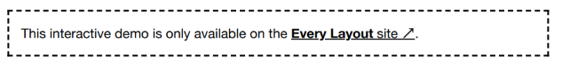

# El Stack

## El problema

Los elementos de flujo requieren espacio (a veces denominado _espacio en blanco_) para separarlos física y conceptualmente de los elementos que vienen antes y después de ellos. Este es el propósito de la propiedad `margin`.

Sin embargo, los sistemas de diseño conciben elementos y componentes de forma aislada. Al momento de la concepción, no está establecido si habrá contenido circundante o cuál será la naturaleza de ese contenido. Un elemento o componente probablemente aparecerá en diferentes contextos, y el requisito de espaciado diferirá.

Estamos en la costumbre de estilizar elementos, o clases de elementos, directamente: hacemos declaraciones de estilo que _pertenecen_ a los elementos. Típicamente, esto no produce problemas, pero `margin` es realmente una propiedad de la _relación_ entre dos elementos próximos. Por lo tanto, el siguiente código es problemático:

```css linenums="1"
p {
  margin-bottom: 1.5rem;
}
```

Dado que la declaración no es sensible al contexto, cualquier aplicación correcta del margen es cuestión de suerte. Si el párrafo es sucedido por otro elemento, el efecto es deseable. Pero un párrafo `:last-child` produce un margen redundante. Dentro de un elemento padre con padding, este margen redundante se combina con el padding del padre para producir el doble del espacio previsto. Este es solo un problema que produce este enfoque.


## La solución

El truco está en estilizar el _contexto_, no el(los) elemento(s) individual(es). La primitiva de layout _Stack_ inyecta margen entre elementos a través de su padre común:

```css linenums="1"
.stack > * + * {
  margin-top: 1.5rem;
}
```

Usando el combinador de hermano adyacente (`+`), `margin-top` solo se aplica donde el elemento está precedido por otro elemento: no hay margen "sobrante". El selector universal (o _wildcard_) `*` asegura que cualquier y todos los elementos se vean afectados. Esta construcción clave se conoce como el _* + * owl_ ↗ (_búho_).

## Altura de línea y escala modular

En el ejemplo anterior, usamos un valor `margin-top` de `1.5rem`. Estamos en la costumbre de usar este valor porque refleja nuestra altura de línea (`line-height`) del texto del cuerpo (generalmente preferida) de `1.5`.

El espaciado vertical de tu diseño debería basarse en tu `line-height` estándar porque el texto domina el layout de la mayoría de las páginas, haciendo que una línea de texto sea un denominador natural.

Si el texto del cuerpo tiene un `line-height` de `1.5` (es decir, `1.5` × el `font-size`), tiene sentido usar `1.5` como la relación para tu escala modular. Lee la _introducción a la escala modular_, y cómo se puede expresar con custom properties de CSS.


## Recursión

En el ejemplo anterior, el combinador de hijo (`>`) asegura que los márgenes solo se apliquen a los hijos del elemento `.stack`. Sin embargo, es posible inyectar márgenes recursivamente eliminando este combinador del selector.

```css linenums="1"
.stack * + * {
  margin-top: 1.5rem;
}
```

Esto puede ser útil donde quieras afectar elementos en cualquier nivel de anidamiento, manteniendo la regularidad del espacio en blanco. 


En la siguiente demostración (usando el componente _Stack_ para seguir) hay un conjunto de elementos con forma de caja. Dos de estos están anidados dentro de otro. Debido a que se aplica recursión, cada caja está espaciada uniformemente usando solo un `Stack` padre.



Es probable que encuentres que el modo recursivo afecta elementos no deseados. Por ejemplo, los elementos de lista genéricos que típicamente no están separados por márgenes se dispersarán inesperadamente.

## Variantes anidadas

La recursión aplica el mismo margen sin importar la profundidad de anidamiento. Un enfoque más deliberado sería configurar `Stacks` no recursivos alternativos con diferentes valores de margen, y anidarlos donde sea adecuado. Considera lo siguiente:

```css linenums="1"
[class^='stack'] > * {
  margin-top: 0;
  margin-bottom: 0;
}
.stack-large > * + * {
  margin-top: 3rem;
}
.stack-small > * + * {
  margin-top: 0.5rem;
}
```

El selector del primer bloque de declaración restablece el margen vertical para todos los elementos similares a `stack` (coincidiendo con valores de clase que _comienzan_ con `stack`). Importantemente, solo se restablecen los márgenes verticales, porque el stack solo _afecta_ el margen vertical, y no queremos que alcance fuera de su competencia. Puede que no necesites este restablecimiento si un restablecimiento universal para `margin` ya está en su lugar (ver _Global and local styling_).

Los siguientes dos bloques configuran `Stacks` alternativos, con diferentes valores de margen. Estos pueden anidarse para producir — por ejemplo — el layout de formulario ilustrado. Ten en cuenta que los elementos `<label>` necesitarían tener `display: block` aplicado para aparecer arriba de los inputs, y para que sus márgenes realmente produzcan espacios (el margen vertical de los elementos inline no tiene efecto; ver _The display property_).


En _Every Layout_, se usan custom elements para implementar componentes/primitivas de layout como el _Stack_. En el componente _Stack_, la prop (propiedad; atributo) `space` se usa para definir el valor de espaciado. El ejemplo de clases modificadas anterior es solo para ilustración. Ver el _ejemplo anidado_.

## Excepciones

CSS funciona mejor como un lenguaje basado en excepciones. Escribes reglas de gran alcance, luego usas la cascada para anular estas reglas en casos especiales. Como está escrito en _Managing Flow and Rhythm with CSS Custom Properties_ ↗, puedes crear excepciones por elemento dentro de un solo contexto (es decir, en el mismo nivel de anidamiento).

```css linenums="1"
.stack > * + * {
  margin-top: var(--space, 1.5em);
}
.stack-exception,
.stack-exception + * {
  --space: 3rem;
}
```

Observa que estamos aplicando el espaciado aumentado _por encima y por debajo_ del elemento `.stack-exception`, donde sea aplicable. Si solo quisieras aumentar el espacio _por encima_, eliminarías `.stack-exception + *`.

Esto funciona porque `*` tiene especificidad _cero_, así que `.stack > * + *` y `.stack-exception` tienen la misma especificidad y `.stack-exception` anula en la cascada (al aparecer más abajo en la hoja de estilo).

## Dividiendo el stack

Al hacer del `Stack` un contexto Flexbox, podemos darle un poder final: la capacidad de agregar un margen `auto` a un elemento elegido. De esta manera, podemos agrupar elementos en la parte superior e inferior del espacio vertical. Útil para componentes tipo tarjeta.

En el siguiente ejemplo, hemos elegido agrupar elementos _después_ del segundo elemento hacia la parte inferior del espacio.

```css linenums="1"
.stack {
  display: flex;
  flex-direction: column;
  justify-content: flex-start;
}
.stack > * + * {
  margin-top: var(--space, 1.5rem);
}
.stack > :nth-child(2) {
  margin-bottom: auto;
}
```

## Colocación de la custom property

Importantemente, a pesar de que ahora establecemos algunas propiedades en el elemento padre, todavía estamos estableciendo el valor `--space` en los hijos, no "subiéndolo" al padre. Si el padre es donde se establece la propiedad, se anulará si el padre se convierte en hijo en anidamiento (ver _Variantes anidadas_, arriba).

Esto se puede ver funcionando en contexto en la siguiente demo que representa un editor de presentaciones/diapositivas. El elemento `Cover` a la derecha tiene una altura mínima de `66.666vh`, forzando la altura de la barra lateral izquierda a ser más alta que su contenido. Esto es lo que produce el espacio entre las imágenes de las diapositivas y el botón "Add slide".

Donde el `Stack` es el único hijo de su padre, nada lo fuerza a estirarse como en el último ejemplo/demo. Un `height` de `100%` asegura que la altura del `Stack` iguale la del padre y la división pueda ocurrir.

```css linenums="1"
.stack:only-child {
  height: 100%;
}
```

## Casos de uso

El posible alcance del layout `Stack` difícilmente puede sobreestimarse. En cualquier lugar donde los elementos se apilen uno encima de otro, es probable que un `Stack` debería estar en efecto. Solo los elementos adyacentes (como las celdas de cuadrícula) no deberían estar sujetos a un `Stack`. Las celdas de la cuadrícula _son_ probablemente `Stacks`, sin embargo, y la cuadrícula misma un miembro de un `Stack`.


## El generador

La herramienta generadora de código solo está disponible en _el sitio de documentación adjunto_ ↗. Aquí está la solución básica, con comentarios:

### CSS

```css linenums="1"
.stack {
  /* ↓ El contexto flex */
  display: flex;
  flex-direction: column;
  justify-content: flex-start;
}
.stack > * {
  /* ↓ Los márgenes verticales existentes se eliminan */
  margin-top: 0;
  margin-bottom: 0;
}
.stack > * + * {
  /* ↓ El margen superior solo se aplica a elementos sucesivos */
  margin-top: var(--space, 1.5rem);
}
```

### HTML

```html
<div class="stack">
  <div><!-- child --></div>
  <div><!-- child --></div>
  <div><!-- etc --></div>
</div>
```

### El componente

Una implementación de custom element del Stack está disponible para _descargar_ ↗.

### Props API

Las siguientes props (atributos) harán que el componente se vuelva a renderizar cuando se alteren. Pueden alterarse a mano — en las herramientas de desarrollo del navegador — o como sujetos del estado de la aplicación heredada.


## Ejemplos

### Básico

```html
<stack-l>
  <h2><!-- algún texto --></h2>
  
  <p><!-- más texto --></p>
</stack-l>
```

### Anidado

```html
<stack-l space="3rem">
  <h2><!-- etiqueta de encabezado --></h2>
  <stack-l space="1.5rem">
    <p><!-- texto del cuerpo --></p>
    <p><!-- texto del cuerpo --></p>
    <p><!-- texto del cuerpo --></p>
  </stack-l>
  <h2><!-- etiqueta de encabezado --></h2>
  <stack-l space="1.5rem">
    <p><!-- texto del cuerpo --></p>
    <p><!-- texto del cuerpo --></p>
    <p><!-- texto del cuerpo --></p>
  </stack-l>
</stack-l>
```

### Recursivo

```html
<stack-l recursive>
  <div><!-- hijo de primer nivel --></div>
  <div><!-- hermano de primer nivel --></div>
  <div>
    <div><!-- hijo de segundo nivel --></div>
    <div><!-- hermano de segundo nivel --></div>
  </div>
</stack-l>
```

### Semántica de lista

En algunos casos, los navegadores deberían interpretar el `Stack` como una lista para el software de lector de pantalla. Puedes usar la siguiente atribución ARIA para lograr esto.

```html
<stack-l role="list">
  <div role="listitem"><!-- contenido del elemento 1 --></div>
  <div role="listitem"><!-- contenido del elemento 2 --></div>
  <div role="listitem"><!-- contenido del elemento 3 --></div>
</stack-l>
```
