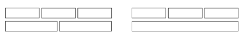
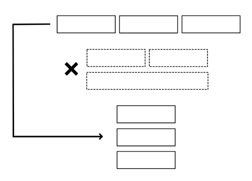
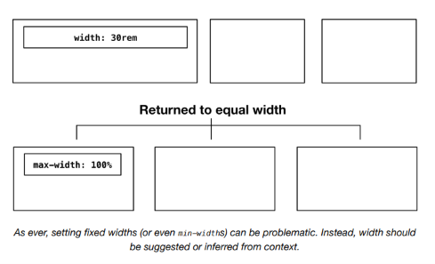
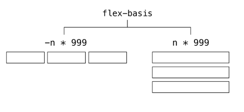
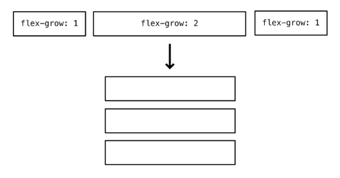
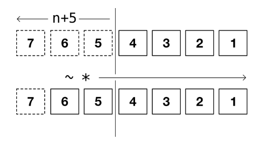
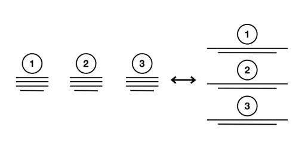

# The Switcher

Como establecimos en *Boxes*, es mejor proporcionar *sugerencias* en lugar de dictados sobre la forma en que se diseña el diseño visual. Un uso excesivo de breakpoints `@media` puede ocurrir fácilmente cuando tratamos de *arreglar* diseños para diferentes contextos y dispositivos. Al solo sugerirle al navegador cómo debería organizar nuestras cajas de layout, pasamos de crear múltiples layouts a crear layouts *cuánticos* únicos que existen simultáneamente en diferentes estados.

La propiedad `flex-basis` es una herramienta especialmente útil al adoptar tal enfoque. Una declaración de `width: 20rem` significa exactamente eso: hazlo de `20rem` de ancho — independientemente de las circunstancias. Pero `flex-basis: 20rem` es más matizado. Le dice al navegador que considere `20rem` como un ancho ideal o "objetivo". Luego es libre de calcular qué tan cerca se puede asemejar al objetivo dado el contenido y el espacio disponible. Le das poder al navegador para tomar la decisión correcta para el contenido, y para el usuario que lee ese contenido, dadas sus circunstancias.

Considera el siguiente código.

```css linenums="1"
.grid {
  display: flex;
  flex-wrap: wrap;
}
.grid > * {
  width: 33.333%;
}
@media (max-width: 60rem) {
  .grid > * {
    width: 50%;
  }
}
@media (max-width: 30rem) {
  .grid > * {
    width: 100%;
  }
}
```

El error aquí es adoptar un enfoque *extrínseco* al layout: estamos pensando primero en el viewport, luego adaptando nuestras cajas a él. Es verboso, poco confiable y no aprovecha al máximo las capacidades de Flexbox.

Con `flex-basis`, es fácil hacer un layout tipo Grid responsivo que no necesita intervención de breakpoints `@media`. Considera este código alternativo:

```css linenums="1"
.grid {
  display: flex;
  flex-wrap: wrap;
}
.grid > * {
  flex: 1 1 20rem;
}
```

Ahora estoy pensando *intrínsecamente* — en términos de las dimensiones propias de los elementos sujetos. Eso se traduce a la *propiedad shorthand `flex`* ↗: "deja que cada elemento crezca y se contraiga para llenar el espacio, pero intenta que tenga aproximadamente `20rem` de ancho". En lugar de emparejar manualmente el conteo de columnas con el ancho del viewport, le estoy diciendo al navegador que *genere* las columnas basándose en mi ancho de columna deseado. He automatizado mi layout.

Como ha señalado *Zoe Mickley Gillenwater* ↗, `flex-basis`, en combinación con `flex-grow` y `flex-shrink`, logra algo similar a una *element/container query* ↗ en la que los "cortes" ocurren, implícitamente, según el espacio disponible en lugar del ancho del viewport. Por lo tanto: layout cuántico.

## Problemas con la simetría bidimensional

Si bien este es un mecanismo de layout funcional, solo produce dos layouts donde cada elemento tiene el mismo ancho:

- El layout de una sola columna (dado el más estrecho de los contenedores)
- El layout regular de múltiples columnas (donde cada fila tiene un número igual de columnas)

En otros casos, el número de elementos y el espacio disponible conspiran para producir layouts como estos:



Esto no es necesariamente un problema que deba resolverse, dependiendo del brief. Siempre que el contenido se configure para permanecer en el espacio, sin obstruirse, la batalla más importante se ha ganado. Sin embargo, para números más pequeños de elementos sujetos, puede haber casos donde desees cambiar directamente de un layout horizontal (una fila) a un layout vertical (una columna) y evitar los estados intermedios.

Cualquier elemento que se haya envuelto y haya crecido para adoptar un ancho diferente podría ser percibido por el usuario como "seleccionado"; hecho para verse deliberadamente diferente, o más importante. Deberíamos querer evitar esta confusión.



## La solución

El elemento `Switcher` (basado en el extrañamente nombrado *Flexbox Holy Albatross* ↗) cambia un contexto Flexbox entre un layout horizontal y uno vertical en un breakpoint dado basado en *contenedor*. Esto es, si el breakpoint es `30rem`, el layout cambiará a una configuración vertical cuando el elemento padre tenga menos de `30rem` de ancho.

Para lograr este cambio, primero se instaura un layout horizontal básico, con wrapping y `flex-grow` habilitados:

```css linenums="1"
.switcher > * {
  display: flex;
  flex-wrap: wrap;
}
.switcher > * > * {
  flex-grow: 1;
}
```

El valor `flex-basis` ingresa el ancho (actual) del contenedor, expresado como `100%`, en un cálculo con el breakpoint designado de `30rem`: `30rem - 100%`.

Dependiendo del valor analizado de `100%`, esto devolverá un valor *positivo* o *negativo*: positivo si el contenedor es más estrecho que `30rem`, o negativo si es más ancho. Este número luego se multiplica por `999` para producir un número positivo *muy grande* o un número negativo *muy grande*: `(30rem - 100%) * 999`.

Aquí está la declaración `flex-basis` in situ:

```css linenums="1"
.switcher > * {
  display: flex;
  flex-wrap: wrap;
}
.switcher > * > * {
  flex-grow: 1;
  flex-basis: calc((30rem - 100%) * 999);
}
```

Un valor `flex-basis` negativo no es válido y se descarta. Gracias al manejo de errores resiliente de CSS, esto significa que solo la línea `flex-basis` se ignora, y el resto del CSS aún se aplica. El valor erróneo negativo se corrige a `flex-basis: 0` y —debido a que `flex-grow` está presente— cada elemento crece para ocupar una proporción igual del espacio horizontal.

## ⚠ Ancho del contenido

La declaración anterior, "cada elemento crece para ocupar una proporción igual del espacio horizontal", es verdadera donde el *contenido* de cualquier elemento no exceda esa proporción asignada. Para mantener las cosas en orden, a los elementos anidados se les puede dar un `max-width: 100%`.



> Como siempre, establecer anchos fijos (o incluso `min-width`) puede ser problemático. En su lugar, el ancho debería ser *sugerido* o *inferido* del contexto.

Si, por otro lado, el valor calculado de `flex-basis` es un número positivo grande, cada elemento se *expande al máximo* para ocupar una fila completa. Esto resulta en la configuración vertical. Los estados intermedios se evitan con éxito.



## Gutters (espaciado)

Para soportar márgenes ('gutters'; 'gaps') entre los elementos sujetos, podríamos adaptar la *técnica de margen negativo cubierta en la documentación de Cluster*. Sin embargo, el cálculo de `flex-basis` necesitaría ser adaptado para compensar el ancho aumentado producido por el estiramiento del contenedor padre. Esto es, al aplicar márgenes negativos en todos los lados, el padre se vuelve más ancho que su contenedor y sus valores de `100%` ya no coinciden.

```css linenums="1"
.switcher {
  --threshold: 30rem;
  --space: 1rem;
}
.switcher > * {
  display: flex;
  flex-wrap: wrap;
  /* ↓ Multiplicar por -1 para hacerlo negativo */
  margin: calc(var(--space) / 2 * -1);
}
.switcher > * > * {
  flex-grow: 1;
  flex-basis: calc((var(--threshold) - (100% - var(--space))) * 999);
  /* ↓ La mitad del valor para cada elemento, combinándose para formar el total */
  margin: calc(var(--space) / 2);
}
```

En su lugar, dado que `gap` ahora es compatible en todos los navegadores principales, no tenemos que preocuparnos por tales cálculos. La propiedad `gap` representa que el navegador haga esos cálculos por nosotros. Y nos permite reducir tanto el HTML como el CSS bastantes.

```css linenums="1"
.switcher {
  display: flex;
  flex-wrap: wrap;
  gap: 1rem;
  --threshold: 30rem;
}
.switcher > * {
  flex-grow: 1;
  flex-basis: calc((var(--threshold) - 100%) * 999);
}
```

*Esta demostración interactiva solo está disponible en el sitio de Every Layout* ↗.

## Gestión de proporciones

No hay razón por la que uno o más de los elementos, cuando están en una configuración horizontal, no puedan recibir más o menos del espacio disponible. Al darle al segundo elemento (`:nth-child(2)`) un `flex-grow: 2`, será el doble de ancho que sus hermanos (y los hermanos se encogerán para compensar).

```css linenums="1"
.switcher > :nth-child(2) {
  flex-grow: 2;
}
```



## Umbral de cantidad

En la configuración horizontal, la cantidad de espacio asignado a cada elemento está determinada por dos cosas:

- El espacio total disponible (el ancho del contenedor)
- El número de elementos hermanos

Hasta ahora, mi `Switcher` cambia según el espacio disponible. Pero podemos agregar tantos elementos como queramos, y se distribuirán juntos horizontalmente por encima del breakpoint (o *threshold*). Cuantos más elementos agreguemos, menos espacio se le asigna a cada uno, y las cosas pueden comenzar a apretarse fácilmente.

Esto es algo que podría abordarse en la documentación, o proporcionando mensajes de advertencia o error en la consola del desarrollador. Pero eso no es muy eficiente o robusto. Mejor enseñarle al layout a manejar este problema por sí mismo. El objetivo de cada uno de los layouts en este proyecto es hacerlos lo más autónomos posible.

Es bastante posible estilizar cada uno de un grupo de elementos hermanos basándose en cuántos hermanos hay en total. La técnica se llama *quantity query* ↗. Considera el siguiente código.

```css linenums="1"
.switcher > :nth-last-child(n+5),
.switcher > :nth-last-child(n+5) ~ * {
  flex-basis: 100%;
}
```

Aquí, estamos aplicando un `flex-basis: 100%` a cada elemento, solo donde hay *cinco o más elementos en total*. El selector `:nth-last-child(n+5)` apunta a cualquier elemento que esté a más de 4 del *final* del conjunto. Luego, el combinador general de hermanos (`~`) aplica la misma regla al resto de los elementos (coincide con cualquier cosa después de `:nth-last-child(n+5)`). Si hay menos de 5 elementos, ningún elemento coincide con `:nth-last-child(n+5)` y el estilo no se aplica.



Ahora el layout tiene dos tipos de umbral que puede manejar, y es el doble de robusto como resultado.

## Casos de uso

Hay muchas situaciones en las que podrías querer cambiar directamente entre un layout horizontal y uno vertical. Pero es especialmente útil donde cada elemento debe considerarse igual, o parte de un continuo. Las tarjetas de componentes que anuncian productos deberían compartir el mismo ancho sin importar la orientación, de lo contrario, una o más tarjetas podrían percibirse como resaltadas o destacadas de alguna manera.

Un conjunto de pasos numerados también es más fácil de procesar cognitivamente si esos pasos se colocan a lo largo de una sola línea horizontal o vertical.



## El generador

La herramienta generadora de código solo está disponible en el *sitio de documentación adjunto* ↗. Aquí está la solución básica, con comentarios:

**CSS**

```css linenums="1"
.switcher {
  display: flex;
  flex-wrap: wrap;
  /* ↓ El valor por defecto es el primer punto en la escala modular */
  gap: var(--gutter, var(--s1));
  /* ↓ El ancho en el que el layout "se rompe" */
  --threshold: 30rem;
}
.switcher > * {
  /* ↓ Permitir que los hijos crezcan */
  flex-grow: 1;
  /* ↓ Cambiar el layout en el --threshold */
  flex-basis: calc((var(--threshold) - 100%) * 999);
}
.switcher > :nth-last-child(n+5),
.switcher > :nth-last-child(n+5) ~ * {
  /* ↓ Cambiar a una configuración vertical si
  hay más de 4 elementos hijos */
  flex-basis: 100%;
}
```

**HTML**

```html linenums="1"
<div class="switcher">
  <div><!-- elemento hijo --></div>
  <div><!-- otro elemento hijo --></div>
  <div><!-- etc --></div>
</div>
```

## El componente

Una implementación de elemento personalizado del `Switcher` está disponible para descargar ↗.

**API de Props**

Las siguientes props (atributos) harán que el componente se renderice nuevamente cuando se alteren. Pueden ser alterados a mano — en las herramientas de desarrollo del navegador — o como sujetos del estado de la aplicación heredada.

| Nombre | Tipo | Default | Descripción |
|---|---|---|---|
| `threshold` | string | `"var(--measure)"` | Un valor CSS de `width` (representando el 'container breakpoint') |
| `space` | string | `"var(--s1)"` | Un valor CSS de `gap` |
| `limit` | integer | `4` | Un número que representa la cantidad máxima de elementos permitidos para un layout horizontal |
