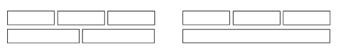
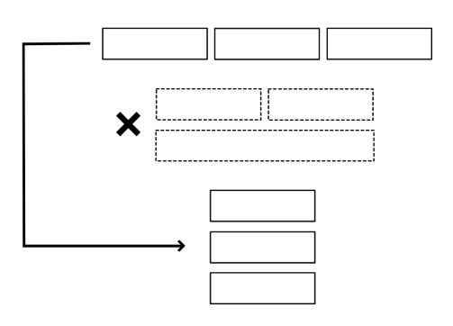
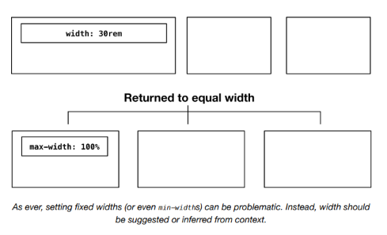
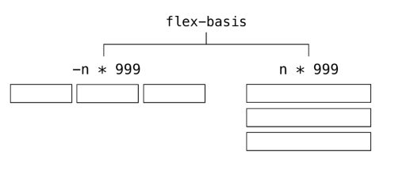
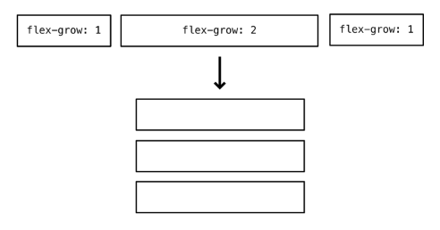
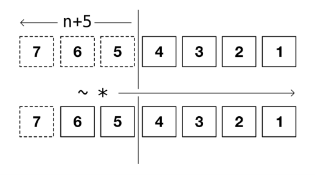
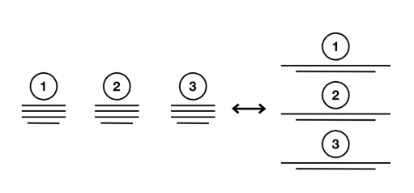

# The Switcher

Como establecimos en *Boxes*, es mejor proporcionar *sugerencias* en lugar de dictados sobre la forma en que se diseña el diseño visual. Un uso excesivo de breakpoints `@media` puede ocurrir fácilmente cuando tratamos de *arreglar* diseños para diferentes contextos y dispositivos. Al solo sugerirle al navegador cómo debería organizar nuestras cajas de layout, pasamos de crear múltiples layouts a crear layouts *cuánticos* únicos que existen simultáneamente en diferentes estados.

La propiedad `flex-basis` es una herramienta especialmente útil al adoptar tal enfoque. Una declaración de `width: 20rem` significa exactamente eso: hazlo de `20rem` de ancho — independientemente de las circunstancias. Pero `flex-basis: 20rem` es más matizado. Le dice al navegador que considere `20rem` como un ancho ideal o "objetivo". Luego es libre de calcular qué tan cerca se puede asemejar al objetivo dado el contenido y el espacio disponible. Le das poder al navegador para tomar la decisión correcta para el contenido, y para el usuario que lee ese contenido, dadas sus circunstancias.

Considera el siguiente código.

```css linenums="1"
.grid {
  display: flex;
  flex-wrap: wrap;
}
.grid > * {
  width: 33.333%;
}
@media (max-width: 60rem) {
  .grid > * {
    width: 50%;
  }
}
@media (max-width: 30rem) {
  .grid > * {
    width: 100%;
  }
}
```

El error aquí es adoptar un enfoque *extrínseco* al layout: estamos pensando primero en el viewport, luego adaptando nuestras cajas a él. Es verboso, poco confiable y no aprovecha al máximo las capacidades de Flexbox.

Con `flex-basis`, es fácil hacer un layout tipo Grid responsivo que no necesita intervención de breakpoints `@media`. Considera este código alternativo:

```css linenums="1"
.grid {
  display: flex;
  flex-wrap: wrap;
}
.grid > * {
  flex: 1 1 20rem;
}
```

Ahora estoy pensando *intrínsecamente* — en términos de las dimensiones propias de los elementos sujetos. Eso se traduce a la [*propiedad shorthand `flex`* ↗:](https://css-tricks.com/almanac/properties/f/flex/) "deja que cada elemento crezca y se contraiga para llenar el espacio, pero intenta que tenga aproximadamente `20rem` de ancho". En lugar de emparejar manualmente el conteo de columnas con el ancho del viewport, le estoy diciendo al navegador que *genere* las columnas basándose en mi ancho de columna deseado. He automatizado mi layout.

Como ha señalado [*Zoe Mickley Gillenwater* ↗](https://zomigi.com/), `flex-basis`, en combinación con `flex-grow` y `flex-shrink`, logra algo similar a una [*element/container query* ↗](https://www.smashingmagazine.com/2016/07/how-i-ended-up-with-element-queries-and-how-you-can-use-them-today/) en la que los "cortes" ocurren, implícitamente, según el espacio disponible en lugar del ancho del viewport. Por lo tanto: layout cuántico.

??? info "Explicacion"

    Este capítulo es una de las ideas más importantes de **Every Layout**. No está enseñando un componente nuevo todavía; primero está cambiando la forma de pensar sobre los layouts responsivos.

    Voy por partes.

    ---

    __La idea principal__

    Tradicionalmente hacemos esto:

    > "Si la pantalla mide X, usa 3 columnas."
    >
    > "Si mide Y, usa 2 columnas."
    >
    > "Si mide Z, usa 1 columna."

    Es decir, pensamos en el **viewport** (el tamaño de la ventana).

    ```css
    @media (max-width: 60rem) {
      /* 2 columnas */
    }

    @media (max-width: 30rem) {
      /* 1 columna */
    }
    ```

    La filosofía de Every Layout dice:

    > **No pienses en el tamaño de la pantalla. Piensa en el tamaño que necesitan los elementos.**

    Ese pequeño cambio hace una enorme diferencia.

    ---

    __¿Qué significa "sugerencias" en lugar de "dictados"?__

    Supongamos que tienes una persona ayudándote a acomodar cajas.

    __Dictado__

    Le dices:

    > "Pon exactamente tres cajas por fila."

    No importa si las cajas quedan apretadas.

    No importa si sobra espacio.

    Debe obedecer.

    Eso hace:

    ```css
    width: 33.333%;
    ```

    Estás imponiendo una regla.

    ---

    __Sugerencia__

    Ahora le dices:

    > "Sería ideal que cada caja mida unos 20 cm. Si caben más, pon más. Si no caben, baja algunas a la siguiente fila."

    Ya no le dices exactamente cómo hacerlo.

    Le das un objetivo.

    Eso hace:

    ```css
    flex-basis: 20rem;
    ```

    ---

    __¿Qué significa realmente `flex-basis`?__

    No significa:

    > "Hazlo de 20rem."

    Significa:

    > "Intenta que mida 20rem."

    Es un tamaño **preferido**, no obligatorio.

    Por eso dicen que es más "matizado".

    ---

    __width__

    ```css
    width: 20rem;
    ```

    Es una orden.

    ```
    Elemento

    ████████████████
    20rem
    ```

    ---

    __flex-basis__

    ```css
    flex-basis: 20rem;
    ```

    Es una sugerencia.

    Si hay espacio:

    ```
    20rem
    ```

    Si sobra espacio:

    ```
    23rem
    ```

    Si falta:

    ```
    18rem
    ```

    El navegador decide.

    ---

    __¿Por qué eso es mejor?__

    Porque Flexbox conoce cosas que tú no sabes.

    Por ejemplo:

    * cuánto mide realmente el texto
    * cuánto mide la pantalla
    * cuánto mide el padre
    * cuántos elementos hay
    * cuánto espacio queda libre

    Entonces dejas que él haga el cálculo.

    ---

    __Analicemos el primer ejemplo__

    ```css
    .grid {
      display: flex;
      flex-wrap: wrap;
    }
    ```

    Hasta aquí:

    ```
    □□□□□□□□□□
    □□□□□□□□□□
    ```

    Los elementos pueden saltar de línea.

    ---

    Luego:

    ```css
    .grid > * {
        width: 33.333%;
    }
    ```

    Cada elemento ocupa exactamente un tercio.

    ```
    |----33%----|
    |----33%----|
    |----33%----|
    ```

    Siempre.

    ---

    Después:

    ```css
    @media (max-width:60rem){
        width:50%;
    }
    ```

    Ahora cambias la regla.

    ```
    |------50%------|
    |------50%------|
    ```

    ---

    Después:

    ```css
    @media (max-width:30rem){
        width:100%;
    }
    ```

    Ahora otra regla.

    ```
    |------100%------|
    ```

    ---

    __¿Cuál es el problema?__

    Que eres tú quien decide cuándo cambiar.

    Debes adivinar:

    > "Creo que a los 960px ya no caben."

    Pero...

    ¿Y si el texto es muy largo?

    ¿Y si el usuario hizo zoom?

    ¿Y si cambió el tamaño de la fuente?

    ¿Y si el contenedor no ocupa toda la pantalla?

    Tus *breakpoints* dejan de ser ideales.

    ---

    __¿Qué propone Every Layout?__

    Esto:

    ```css
    .grid {
        display:flex;
        flex-wrap:wrap;
    }

    .grid > *{
        flex:1 1 20rem;
    }
    ```

    Veámoslo.

    ---

    __flex-grow__

    ```css
    1
    ```

    Puede crecer.

    ---

    __flex-shrink__

    ```css
    1
    ```

    Puede encogerse.

    ---

    __flex-basis__

    ```css
    20rem
    ```

    Quisiera medir aproximadamente eso.

    Todo junto:

    ```css
    flex:1 1 20rem;
    ```

    Significa:

    > "Intenta medir unos 20rem, pero adapta el tamaño según el espacio disponible."

    ---

    __¿Qué hace el navegador?__

    Supongamos un contenedor de:

    ```
    80rem
    ```

    Cada elemento quiere:

    ```
    20rem
    ```

    Entonces el navegador piensa:

    ```
    80 / 20 = 4
    ```

    Caben cuatro.

    ```
    □ □ □ □
    ```

    ---

    Si el contenedor mide:

    ```
    60rem
    ```

    Ahora calcula:

    ```
    60 / 20 = 3
    ```

    ```
    □ □ □
    ```

    ---

    Si mide:

    ```
    40rem
    ```

    ```
    40 / 20 = 2
    ```

    ```
    □ □
    ```

    ---

    Si mide:

    ```
    18rem
    ```

    Ya no caben dos.

    Entonces:

    ```
    □
    ```

    Una sola columna.

    Todo eso ocurrió sin escribir:

    ```css
    @media(...)
    ```

    ---

    __¿Por qué lo llaman enfoque "intrínseco"?__

    Porque el diseño nace de las necesidades del contenido.

    No dices:

    > "Cuando la pantalla mida tanto..."

    Dices:

    > "Cada tarjeta funciona bien alrededor de 20rem."

    La propia tarjeta determina cuándo cambiar de fila.

    ---

    __¿Qué significa "extrínseco"?__

    Extrínseco = depende de algo externo.

    En este caso:

    ```
    Viewport
    ```

    Si cambia el viewport:

    ```
    @media(...)
    ```

    Cambias el layout.

    ---

    __¿Qué significa "intrínseco"?__

    Intrínseco = depende del propio elemento.

    No importa si el contenedor mide:

    * 500px
    * 700px
    * 1300px

    Cada elemento intenta mantenerse cerca de:

    ```
    20rem
    ```

    El navegador reorganiza automáticamente las filas.

    ---

    __¿Qué quiere decir con "layout cuántico"?__

    No tiene relación con la física cuántica; es una metáfora.

    Los autores quieren decir que el layout no tiene estados rígidos como:

    ```
    Estado A

    ↓

    Estado B

    ↓

    Estado C
    ```

    Sino que está "preparado" para todos los estados posibles y el navegador elige el adecuado según el espacio disponible.

    Es como si el diseño existiera simultáneamente en muchas configuraciones y solo "colapsara" a una cuando conoce el tamaño del contenedor.

    Por ejemplo, el mismo CSS puede producir:

    ```
    □□□□
    ```

    o

    ```
    □□□
    ```

    o

    ```
    □□
    ```

    o

    ```
    □
    ```

    Sin que hayas escrito cuatro reglas diferentes.

    ---

    __¿Qué significa que es parecido a una "container query"?__

    Antes de existir las *container queries*, Flexbox ya permitía algo parecido.

    Con:

    ```css
    flex: 1 1 20rem;
    ```

    el cambio de columnas depende del **espacio disponible en el contenedor**, no necesariamente del ancho de toda la ventana.

    Imagina una tarjeta dentro de un panel lateral estrecho y la misma tarjeta en una sección principal amplia. Aunque la ventana del navegador no cambie de tamaño, cada contenedor puede terminar mostrando un número distinto de columnas porque Flexbox calcula cuánto espacio tiene realmente cada uno.

    ---

    __Resumen__

    La diferencia de filosofía es:

    | Enfoque tradicional                | Enfoque Every Layout                             |
    | ---------------------------------- | ------------------------------------------------ |
    | Pienso en el viewport.             | Pienso en el tamaño ideal del contenido.         |
    | Escribo varios `@media`.           | Dejo que Flexbox calcule.                        |
    | Impongo un número de columnas.     | Sugiero un ancho ideal para cada elemento.       |
    | Uso `width`.                       | Uso `flex-basis` (dentro de `flex`).             |
    | Yo decido cuándo cambia el diseño. | El navegador decide según el espacio disponible. |

    Ese cambio de mentalidad es precisamente el que da origen al componente **Switcher** que verás a continuación: un layout que cambia automáticamente entre disposición horizontal y vertical cuando el espacio deja de ser suficiente, sin necesidad de *breakpoints* explícitos.

## Problemas con la simetría bidimensional

Si bien este es un mecanismo de layout funcional, solo produce dos layouts donde cada elemento tiene el mismo ancho:

- El layout de una sola columna (dado el más estrecho de los contenedores)
- El layout regular de múltiples columnas (donde cada fila tiene un número igual de columnas)

En otros casos, el número de elementos y el espacio disponible conspiran para producir layouts como estos:



Esto no es necesariamente un problema que deba resolverse, dependiendo del brief. Siempre que el contenido se configure para permanecer en el espacio, sin obstruirse, la batalla más importante se ha ganado. Sin embargo, para números más pequeños de elementos sujetos, puede haber casos donde desees cambiar directamente de un layout horizontal (una fila) a un layout vertical (una columna) y evitar los estados intermedios.

Cualquier elemento que se haya envuelto y haya crecido para adoptar un ancho diferente podría ser percibido por el usuario como "seleccionado"; hecho para verse deliberadamente diferente, o más importante. Deberíamos querer evitar esta confusión.



??? info "Explicacion"

    Aquí los autores están explicando **la limitación del enfoque anterior** (`flex: 1 1 20rem`) y por qué necesitan crear un nuevo layout llamado **Switcher**.

    Vamos paso a paso.

    ---

    __Lo que teníamos hasta ahora__

    Con este código:

    ```css
    .grid {
        display: flex;
        flex-wrap: wrap;
    }

    .grid > * {
        flex: 1 1 20rem;
    }
    ```

    el navegador intenta que todos midan aproximadamente `20rem`.

    Si caben cuatro:

    ```
    ┌────┐ ┌────┐ ┌────┐ ┌────┐
    │ A  │ │ B  │ │ C  │ │ D  │
    └────┘ └────┘ └────┘ └────┘
    ```

    Todo perfecto.

    ---

    Si caben tres:

    ```
    ┌────┐ ┌────┐ ┌────┐
    │ A  │ │ B  │ │ C  │
    └────┘ └────┘ └────┘
    ```

    También perfecto.

    ---

    __El problema aparece cuando el número de elementos no llena completamente la última fila__

    Supongamos que tienes **5 tarjetas**.

    Hay espacio para tres por fila.

    El resultado será:

    ```
    ┌────┐ ┌────┐ ┌────┐
    │ A  │ │ B  │ │ C  │
    └────┘ └────┘ └────┘

    ┌──────────┐ ┌──────────┐
    │    D     │ │    E     │
    └──────────┘ └──────────┘
    ```

    Observa lo que pasó.

    Las tarjetas **D** y **E** crecieron porque `flex-grow: 1` les permitió ocupar todo el espacio disponible.

    Ahora ya no tienen el mismo ancho que las de arriba.

    ---

    __Otro ejemplo__

    Supongamos que tienes 7 elementos.

    ```
    ┌────┐ ┌────┐ ┌────┐
    │ A  │ │ B  │ │ C  │
    └────┘ └────┘ └────┘

    ┌────┐ ┌────┐ ┌────┐
    │ D  │ │ E  │ │ F  │
    └────┘ └────┘ └────┘

    ┌──────────────────┐
    │        G         │
    └──────────────────┘
    ```

    El último ocupa toda la fila.

    Eso ocurre porque Flexbox piensa:

    > "Como solo queda un elemento, le daré todo el espacio."

    Tiene sentido para el navegador.

    Pero visualmente puede ser raro.

    ---

    __¿Qué quieren decir con "simetría bidimensional"?__

    La palabra **bidimensional** significa que el diseño tiene dos dimensiones:

    * horizontal (columnas)
    * vertical (filas)

    Cuando todo mide igual obtenemos una cuadrícula muy simétrica.

    ```
    □ □ □
    □ □ □
    □ □ □
    ```

    Todas las filas y columnas mantienen el mismo aspecto.

    ---

    Pero cuando la última fila cambia de tamaño:

    ```
    □ □ □

    ■■
    ```

    Ya no existe esa simetría.

    Las cajas inferiores son diferentes.

    ---

    __¿Por qué puede ser un problema?__

    Imagina una página con productos.

    ```
    📱  📱  📱

    📱      📱
    ```

    Los dos últimos aparecen mucho más grandes.

    El usuario puede pensar:

    * son destacados
    * son promociones
    * son recomendados
    * tienen mayor importancia

    Cuando en realidad simplemente quedaron solos en la última fila.

    ---

    Eso es exactamente lo que dice el texto:

    > "Podría percibirse como seleccionado."

    No porque realmente lo esté.

    Sino porque **nuestro cerebro asocia tamaño con importancia**.

    ---

    __¿Siempre es un problema?__

    No.

    Por eso dicen:

    > "Esto no es necesariamente un problema."

    Hay muchos casos donde está perfectamente bien.

    Por ejemplo:

    * galería de fotos
    * lista de artículos
    * tarjetas de productos

    Si el diseño sigue siendo claro, no hace falta hacer nada.

    ---

    __Pero hay casos donde sí molesta__

    Imagina solo dos tarjetas.

    Cuando hay espacio:

    ```
    ┌──────┐ ┌──────┐
    │ Login│ │Signup│
    └──────┘ └──────┘
    ```

    Todo bien.

    ---

    La ventana se hace un poco más pequeña.

    Con `flex-wrap` ocurre esto:

    ```
    ┌──────────────┐
    │    Login     │
    └──────────────┘

    ┌──────────────┐
    │    Signup    │
    └──────────────┘
    ```

    También bien.

    ---

    Pero existe una zona intermedia donde todavía caben en dos filas parcialmente.

    Por ejemplo:

    ```
    ┌───────────────┐
    │    Login      │
    └───────────────┘

    ┌──────────────────────────┐
    │         Signup           │
    └──────────────────────────┘
    ```

    La segunda termina siendo mucho más ancha.

    Visualmente parece que tiene más importancia.

    ---

    __¿Qué solución propone Every Layout?__

    En lugar de permitir todos los estados posibles, propone un componente llamado **Switcher**.

    Su comportamiento es muy simple:

    **Si caben todos en una sola fila:**

    ```
    □ □ □
    ```

    Perfecto.

    ---

    **Si dejan de caber:**

    En lugar de permitir:

    ```
    □ □

    □
    ```

    o

    ```
    □ □ □

    □□
    ```

    cambia directamente a:

    ```
    □
    □
    □
    ```

    Es decir, **salta directamente de una fila a una columna**, evitando los estados intermedios donde unas cajas terminan siendo más anchas que otras.

    ---

    __En resumen__

    El layout basado en `flex: 1 1 20rem` es excelente para crear **grillas flexibles**, pero cuando la última fila queda incompleta, algunos elementos crecen más que otros y se rompe la uniformidad visual. En muchos casos eso no importa, pero cuando todos los elementos deberían tener exactamente la misma importancia (por ejemplo, botones de acciones, opciones de configuración o tarjetas equivalentes), esos tamaños distintos pueden confundir al usuario.

    El **Switcher** nace precisamente para resolver ese caso: en lugar de permitir filas incompletas con elementos de distinto ancho, cambia automáticamente entre **"todos en una fila"** y **"todos en una columna"**, manteniendo una apariencia más consistente.

## La solución

El elemento `Switcher` (basado en el extrañamente nombrado *[Flexbox Holy Albatross* ↗](https://heydonworks.com/article/the-flexbox-holy-albatross/) ) cambia un contexto Flexbox entre un layout horizontal y uno vertical en un breakpoint dado basado en *contenedor*. Esto es, si el breakpoint es `30rem`, el layout cambiará a una configuración vertical cuando el elemento padre tenga menos de `30rem` de ancho.

Para lograr este cambio, primero se instaura un layout horizontal básico, con wrapping y `flex-grow` habilitados:

```css linenums="1"
.switcher > * {
  display: flex;
  flex-wrap: wrap;
}
.switcher > * > * {
  flex-grow: 1;
}
```

El valor `flex-basis` ingresa el ancho (actual) del contenedor, expresado como `100%`, en un cálculo con el breakpoint designado de `30rem`: `30rem - 100%`.

Dependiendo del valor analizado de `100%`, esto devolverá un valor *positivo* o *negativo*: positivo si el contenedor es más estrecho que `30rem`, o negativo si es más ancho. Este número luego se multiplica por `999` para producir un número positivo *muy grande* o un número negativo *muy grande*: `(30rem - 100%) * 999`.

Aquí está la declaración `flex-basis` in situ:

```css linenums="1"
.switcher > * {
  display: flex;
  flex-wrap: wrap;
}
.switcher > * > * {
  flex-grow: 1;
  flex-basis: calc((30rem - 100%) * 999);
}
```

Un valor `flex-basis` negativo no es válido y se descarta. Gracias al manejo de errores resiliente de CSS, esto significa que solo la línea `flex-basis` se ignora, y el resto del CSS aún se aplica. El valor erróneo negativo se corrige a `flex-basis: 0` y —debido a que `flex-grow` está presente— cada elemento crece para ocupar una proporción igual del espacio horizontal.

??? info "Explicacion"

    Este es probablemente el fragmento más difícil de entender de **Every Layout**. La primera vez que se lee parece un truco de magia, pero en realidad se basa en cómo **Flexbox trata los valores inválidos de `flex-basis`**.

    Voy a desarmarlo paso a paso.

    ---

    __¿Qué quiere lograr el Switcher?__

    Quiere tener **solo dos estados**.

    Si el contenedor es ancho:

    ```text
    ┌────┐ ┌────┐ ┌────┐
    │ A  │ │ B  │ │ C  │
    └────┘ └────┘ └────┘
    ```

    Si el contenedor deja de ser suficientemente ancho:

    ```text
    ┌────┐
    │ A  │
    └────┘

    ┌────┐
    │ B  │
    └────┘

    ┌────┐
    │ C  │
    └────┘
    ```

    No quiere estados intermedios.

    ---

    __El layout base__

    Primero crean un Flexbox normal.

    ```css
    .switcher > * {
        display: flex;
        flex-wrap: wrap;
    }
    ```

    Nada nuevo.

    Los elementos pueden envolverse.

    ---

    Luego:

    ```css
    .switcher > * > * {
        flex-grow: 1;
    }
    ```

    Ya sabes qué hace.

    Significa:

    > Si sobra espacio, repártanlo entre todos.

    Todavía no hay nada especial.

    ---

    __La parte "mágica"__

    Luego aparece esto:

    ```css
    flex-basis: calc((30rem - 100%) * 999);
    ```

    Vamos despacio.

    ---

    __¿Qué significa `100%`?__

    Aquí **NO es el viewport**.

    Es el ancho del contenedor Flex.

    Imagina un contenedor que mide

    ```text
    40rem
    ```

    Entonces:

    ```css
    100%
    ```

    vale

    ```text
    40rem
    ```

    ---

    Si el contenedor mide

    ```text
    20rem
    ```

    entonces

    ```css
    100%
    ```

    vale

    ```text
    20rem
    ```

    ---

    __Primer caso__

    Supongamos que el contenedor mide

    ```text
    40rem
    ```

    El cálculo es

    ```text
    30rem - 40rem
    ```

    Resultado

    ```text
    -10rem
    ```

    Ahora multiplican por 999.

    ```text
    -9990rem
    ```

    Sigue siendo negativo.

    ---

    __Segundo caso__

    Ahora el contenedor mide

    ```text
    20rem
    ```

    El cálculo es

    ```text
    30rem - 20rem
    ```

    Resultado

    ```text
    10rem
    ```

    Multiplicado por 999:

    ```text
    9990rem
    ```

    Un número gigantesco.

    ---

    Entonces el resultado siempre será una de estas dos cosas:

    Si el contenedor es grande:

    ```text
    -9990rem
    ```

    Si el contenedor es pequeño:

    ```text
    9990rem
    ```

    ---

    __¿Por qué multiplicar por 999?__

    Porque quieren exagerar el resultado.

    No importa si da

    ```text
    5rem
    ```

    o

    ```text
    10rem
    ```

    Lo convierten en algo enorme.

    Es simplemente una forma de asegurarse de que el efecto sea contundente. El valor **999** no tiene nada de especial; podría ser 1000, 10000, etc. Solo necesita ser lo bastante grande.

    ---

    __Ahora viene el truco__

    ¿Qué ocurre si escribes esto?

    ```css
    flex-basis: -9990rem;
    ```

    Eso **no existe**.

    `flex-basis` no admite valores negativos.

    Entonces el navegador dice:

    > Ese valor es inválido.

    Y lo ignora.

    ---

    Aquí es donde el texto menciona el **manejo resiliente de errores de CSS**.

    CSS funciona así:

    Si una propiedad tiene un valor inválido:

    ```css
    color: rojoazulverde;
    ```

    No rompe toda la hoja de estilos.

    Simplemente ignora esa línea.

    Lo mismo ocurre aquí.

    ---

    __¿Qué pasa cuando ignora `flex-basis`?__

    El navegador actúa como si no existiera esa línea.

    Solo queda

    ```css
    flex-grow: 1;
    ```

    Y como todos tienen `flex-grow: 1`, el espacio horizontal se reparte por igual.

    Con tres elementos:

    ```text
    ┌────────┐┌────────┐┌────────┐
    │   A    ││   B    ││   C    │
    └────────┘└────────┘└────────┘
    ```

    Ese es el estado horizontal.

    ---

    __¿Y cuando el resultado es positivo?__

    Ahora imagina que el cálculo produce:

    ```css
    flex-basis: 9990rem;
    ```

    Ese valor **sí es válido**.

    Cada elemento dice:

    > Mi tamaño base es 9990rem.

    Obviamente ninguno cabe junto a otro.

    Flexbox intenta colocarlos en una fila:

    ```text
    [A]
    [B]
    [C]
    ```

    Pero como cada uno "quiere" medir casi diez mil rem, solo cabe uno por línea.

    Gracias a `flex-wrap`, el resto baja automáticamente a la siguiente fila.

    Así aparece el estado vertical.

    ---

    __Entonces el cálculo realmente hace esto__

    Si el contenedor es mayor de 30rem:

    ```text
    30rem - 40rem

    ↓

    negativo

    ↓

    valor inválido

    ↓

    flex-basis se ignora

    ↓

    todos comparten la fila
    ```

    ---

    Si el contenedor es menor de 30rem:

    ```text
    30rem - 20rem

    ↓

    positivo enorme

    ↓

    cada elemento quiere medir muchísimo

    ↓

    solo cabe uno por fila

    ↓

    layout vertical
    ```

    ---

    __¿Por qué dicen que es un breakpoint basado en el contenedor?__

    Con `@media` normalmente preguntas:

    ```text
    ¿Cuánto mide la ventana?
    ```

    Aquí la pregunta es distinta:

    ```text
    ¿Cuánto mide ESTE contenedor?
    ```

    No importa si la pantalla mide 3000 px.

    Si el contenedor específico mide menos de 30rem, el cambio ocurre.

    Por eso este patrón se adelantó varios años a las **container queries** modernas: el comportamiento depende del espacio real disponible para ese componente, no del tamaño global del navegador.

    ---

    __Resumen visual__

    ```
                    ¿Cuánto mide el contenedor?

                        40rem
                            │
                            ▼
                    30rem - 40rem
                            │
                            ▼
                      valor negativo
                            │
                            ▼
              flex-basis inválido → se ignora
                            │
                            ▼
                Todos comparten la fila
    ```

    ```
                    ¿Cuánto mide el contenedor?

                        20rem
                            │
                            ▼
                    30rem - 20rem
                            │
                            ▼
                      valor positivo
                            │
                            ▼
              flex-basis gigantesco (9990rem)
                            │
                            ▼
            Solo cabe un elemento por línea
                            │
                            ▼
                    Layout vertical
    ```

    En esencia, el "truco" del **Switcher** consiste en usar una expresión matemática para que `flex-basis` sea **inválido cuando el contenedor es ancho** (de modo que Flexbox distribuya los elementos horizontalmente) y **enorme cuando el contenedor es estrecho** (forzando que solo quepa un elemento por fila). Con una sola línea de CSS consigue un cambio automático entre ambos estados, sin usar `@media`.
      
## ⚠ Ancho del contenido

La declaración anterior, "cada elemento crece para ocupar una proporción igual del espacio horizontal", es verdadera donde el *contenido* de cualquier elemento no exceda esa proporción asignada. Para mantener las cosas en orden, a los elementos anidados se les puede dar un `max-width: 100%`.



> Como siempre, establecer anchos fijos (o incluso `min-width`) puede ser problemático. En su lugar, el ancho debería ser *sugerido* o *inferido* del contexto.

Si, por otro lado, el valor calculado de `flex-basis` es un número positivo grande, cada elemento se *expande al máximo* para ocupar una fila completa. Esto resulta en la configuración vertical. Los estados intermedios se evitan con éxito.



??? info "Explicacion"

    Esta sección aclara un detalle importante del comportamiento del **Switcher**. El truco funciona muy bien, **pero depende de que el contenido pueda adaptarse al espacio disponible**.

    Veámoslo.

    ---

    __Primero recuerdan esta frase__

    En la sección anterior dijeron:

    > "Cada elemento crece para ocupar una proporción igual del espacio horizontal."

    Por ejemplo, con tres elementos:

    ```text
    ┌─────────┐┌─────────┐┌─────────┐
    │    A    ││    B    ││    C    │
    └─────────┘└─────────┘└─────────┘
    ```

    Cada uno ocupa un tercio.

    Hasta aquí todo bien.

    ---

    __¿Pero qué pasa si un elemento tiene contenido muy ancho?__

    Imagina esto:

    ```text
    ┌─────────┐┌─────────┐┌─────────┐
    │  Hola   ││xxxxxxxxxxxxxxxxxxxxxxxx││ Adiós │
    └─────────┘└─────────┘└─────────┘
    ```

    Ese texto enorme no cabe dentro del tercio que le corresponde.

    Entonces ocurren cosas como:

    * el contenido se desborda;
    * rompe el diseño;
    * obliga a ensanchar esa columna;
    * empuja a las demás.

    El resultado deja de ser uniforme.

    ---

    __¿Qué significa "el contenido excede esa proporción"?__

    Supongamos un contenedor de **90rem**.

    Tres elementos.

    Cada uno recibe:

    ```text
    90rem / 3 = 30rem
    ```

    Pero uno contiene una imagen de:

    ```text
    50rem
    ```

    La imagen dice:

    > "Yo necesito 50rem."

    Mientras Flexbox dice:

    > "Solo tienes 30rem."

    Hay un conflicto.

    ---

    __¿Cómo evitarlo?__

    El libro propone:

    ```css
    max-width: 100%;
    ```

    Por ejemplo:

    ```css
    .switcher img {
        max-width: 100%;
    }
    ```

    ¿Qué significa?

    La imagen puede hacerse más pequeña si hace falta, pero nunca será más ancha que su contenedor.

    ---

    __Sin `max-width`__

    ```text
    ┌─────────────┐
    │             │
    │████████████████████████
    │             │
    └─────────────┘
    ```

    La imagen sobresale.

    ---

    __Con `max-width:100%`__

    ```text
    ┌─────────────┐
    │███████████  │
    └─────────────┘
    ```

    Ahora la imagen se adapta al ancho disponible.

    ---

    __¿Por qué dicen que no uses `width` fijo?__

    Porque un ancho fijo vuelve a imponer una orden.

    Por ejemplo:

    ```css
    img {
        width: 600px;
    }
    ```

    Eso significa:

    > "Quiero medir 600px siempre."

    Aunque el contenedor tenga solo:

    ```text
    350px
    ```

    La imagen seguirá intentando medir 600px.

    El resultado será un desbordamiento.

    ---

    __¿Y por qué tampoco recomiendan `min-width`?__

    Porque también impone un límite.

    ```css
    min-width: 500px;
    ```

    Eso significa:

    > "Nunca puedo ser menor de 500px."

    Si el contenedor mide:

    ```text
    350px
    ```

    El elemento seguirá queriendo ocupar:

    ```text
    500px
    ```

    Otra vez rompe el layout.

    ---

    __¿Qué quiere decir con "el ancho debería sugerirse"?__

    Es la filosofía que ya viste varias veces en Every Layout.

    En lugar de decir:

    ```css
    width:500px;
    ```

    Prefieren algo como:

    ```css
    flex-basis:20rem;
    ```

    o

    ```css
    max-width:100%;
    ```

    No obligas.

    Sugieres.

    El navegador decide el tamaño final.

    ---

    __Luego vuelve al truco del Switcher__

    Dice:

    > "Si el valor calculado de `flex-basis` es positivo..."

    Eso significa que el contenedor es más pequeño que el breakpoint.

    Por ejemplo:

    ```text
    30rem - 20rem = 10rem
    ```

    Después:

    ```text
    10rem × 999
    ```

    Da un número enorme.

    Entonces:

    ```css
    flex-basis:9990rem;
    ```

    Cada elemento piensa:

    > "Mi tamaño ideal es casi diez mil rem."

    Obviamente no caben dos en la misma fila.

    Entonces Flexbox hace:

    ```text
    ┌──────────────┐
    │      A       │
    └──────────────┘

    ┌──────────────┐
    │      B       │
    └──────────────┘

    ┌──────────────┐
    │      C       │
    └──────────────┘
    ```

    Cada uno ocupa toda una fila.

    ---

    __¿Qué significa "se expanden al máximo"?__

    No significa que realmente midan 9990rem.

    Eso sería imposible.

    Significa que **su tamaño base es tan grande** que Flexbox concluye:

    > "Solo puedo colocar un elemento por línea."

    Entonces cada uno termina ocupando el ancho disponible de su fila.

    ---

    __¿Qué son los "estados intermedios"?__

    Sin Switcher podrías tener esto:

    ```text
    A   B

    C
    ```

    o

    ```text
    A   B   C

    D
    ```

    o

    ```text
    A   B

    C   D

    E
    ```

    Esos son los estados intermedios que el libro quiere evitar porque algunas cajas quedan más anchas que otras.

    Con el Switcher solo existen dos configuraciones:

    **Horizontal**

    ```text
    A   B   C
    ```

    o **Vertical**

    ```text
    A
    B
    C
    ```

    Nunca aparecen distribuciones "a medias".

    ---

    __Idea clave__

    Esta sección no introduce un concepto nuevo, sino que añade dos aclaraciones importantes:

    1. El **Switcher** funciona correctamente siempre que el contenido también sea flexible. Si un elemento contiene imágenes, tablas o textos muy anchos, conviene limitar su tamaño con propiedades como `max-width: 100%` para evitar que rompan el diseño.

    2. El objetivo del Switcher es eliminar las configuraciones intermedias. Cuando el contenedor es suficientemente ancho, todos los elementos comparten una sola fila; cuando deja de serlo, el cálculo de `flex-basis` fuerza automáticamente que cada elemento ocupe una fila completa. Así se mantiene una apariencia consistente y se evita que unas cajas parezcan más importantes que otras solo porque crecieron para llenar el espacio disponible.
      
## Gutters (espaciado)

Para soportar márgenes ('gutters'; 'gaps') entre los elementos sujetos, podríamos adaptar la *técnica de margen negativo cubierta en la documentación de Cluster*. Sin embargo, el cálculo de `flex-basis` necesitaría ser adaptado para compensar el ancho aumentado producido por el estiramiento del contenedor padre. Esto es, al aplicar márgenes negativos en todos los lados, el padre se vuelve más ancho que su contenedor y sus valores de `100%` ya no coinciden.

```css linenums="1"
.switcher {
  --threshold: 30rem;
  --space: 1rem;
}
.switcher > * {
  display: flex;
  flex-wrap: wrap;
  /* ↓ Multiplicar por -1 para hacerlo negativo */
  margin: calc(var(--space) / 2 * -1);
}
.switcher > * > * {
  flex-grow: 1;
  flex-basis: calc((var(--threshold) - (100% - var(--space))) * 999);
  /* ↓ La mitad del valor para cada elemento, combinándose para formar el total */
  margin: calc(var(--space) / 2);
}
```

En su lugar, dado que `gap` ahora es compatible en todos los navegadores principales, no tenemos que preocuparnos por tales cálculos. La propiedad `gap` representa que el navegador haga esos cálculos por nosotros. Y nos permite reducir tanto el HTML como el CSS bastantes.

```css linenums="1"
.switcher {
  display: flex;
  flex-wrap: wrap;
  gap: 1rem;
  --threshold: 30rem;
}
.switcher > * {
  flex-grow: 1;
  flex-basis: calc((var(--threshold) - 100%) * 999);
}
```

!!! info "Demo"

    [*Esta demostración interactiva solo está disponible en el sitio de Every Layout* ↗](https://every-layout.dev/demos/switcher-basic/).

??? info "Explicacion"

    Esta sección no habla realmente del **Switcher**, sino de **cómo agregar espacio (`gap`) entre sus elementos sin romper el cálculo**.

    Lo interesante es entender **por qué el primer método es complicado** y **por qué `gap` lo soluciona**.

    ---

    __El problema__

    Hasta ahora el Switcher era algo así:

    ```css
    .switcher {
        display: flex;
        flex-wrap: wrap;
    }

    .switcher > * {
        flex-grow: 1;
        flex-basis: calc((30rem - 100%) * 999);
    }
    ```

    Funciona perfectamente.

    Pero ahora quieres separar los elementos.

    Sin separación:

    ```text
    ┌───┐┌───┐┌───┐
    │ A ││ B ││ C │
    └───┘└───┘└───┘
    ```

    Con separación:

    ```text
    ┌───┐   ┌───┐   ┌───┐
    │ A │   │ B │   │ C │
    └───┘   └───┘   └───┘
    ```

    Ese espacio es el **gutter** (o `gap`).

    ---

    __Antes de existir `gap`__

    Hace algunos años Flexbox no soportaba `gap`.

    Entonces había que usar márgenes.

    Por ejemplo:

    ```css
    .item {
        margin: .5rem;
    }
    ```

    Pero eso genera un problema.

    ---

    __El problema de los márgenes__

    Supongamos un contenedor de:

    ```text
    30rem
    ```

    Tres elementos.

    Cada uno tiene

    ```text
    margin: .5rem;
    ```

    Ahora cada elemento ya no mide solamente lo que Flexbox calculó.

    También tiene margen.

    Es decir, el espacio ocupado realmente es:

    ```text
    ancho + margen
    ```

    ---

    Entonces los cálculos dejan de cuadrar.

    Si Flexbox creía que cabían tres elementos...

    ...con márgenes quizá ya solo caben dos.

    ---

    __La técnica del margen negativo__

    Ya la viste en el componente **Cluster**.

    Era algo parecido a esto:

    ```css
    .parent {
        margin: -.5rem;
    }

    .child {
        margin: .5rem;
    }
    ```

    Visualmente funciona.

    ¿Por qué?

    Porque el margen negativo del padre "compensa" el margen positivo de los hijos.

    ---

    Sin margen negativo:

    ```text
    | espacio | A | espacio |
    ```

    Con margen negativo:

    ```text
    |A| espacio |B| espacio |C|
    ```

    Los espacios exteriores desaparecen.

    ---

    __Pero aparece un nuevo problema__

    El padre ahora es un poco más grande.

    Imagina:

    Contenedor:

    ```text
    30rem
    ```

    El padre recibe:

    ```css
    margin:-0.5rem;
    ```

    Visualmente pasa a ocupar algo parecido a:

    ```text
    31rem
    ```

    (No es exactamente así internamente, pero sirve para entender la idea.)

    ---

    Entonces...

    ¿Qué significa ahora esto?

    ```css
    100%
    ```

    Ya no representa los **30rem** originales.

    Representa el ancho del padre, que fue alterado por los márgenes.

    Y aquí está el problema.

    ---

    __El cálculo deja de ser correcto__

    Antes hacíamos:

    ```css
    calc(30rem - 100%)
    ```

    Pero ahora el `100%` ya no vale exactamente el ancho del contenedor.

    Vale un ancho ligeramente mayor.

    Por eso el libro dice:

    > "100% ya no coincide."

    ---

    __¿Cómo lo corrigen?__

    Modificando el cálculo.

    Antes:

    ```css
    calc(
    30rem - 100%
    )
    ```

    Ahora:

    ```css
    calc(
    30rem - (100% - 1rem)
    )
    ```

    Observa la diferencia.

    Le están restando el espacio del margen.

    ¿Por qué?

    Porque quieren recuperar el ancho real del contenedor.

    ---

    __¿Qué significa esta línea?__

    ```css
    margin: calc(var(--space) / 2);
    ```

    Supongamos:

    ```css
    --space:1rem;
    ```

    Cada hijo recibe:

    ```text
    0.5rem
    ```

    de margen.

    Entonces entre dos elementos ocurre esto:

    ```text
    0.5rem + 0.5rem
    ```

    Resultado:

    ```text
    1rem
    ```

    Que era justamente el espacio deseado.

    ---

    __¿Por qué la mitad?__

    Porque el espacio total aparece al sumar ambos márgenes.

    ```text
    A   .5rem | .5rem   B
    ```

    Entre ambos:

    ```text
    1rem
    ```

    ---

    __¿Y por qué el padre tiene margen negativo?__

    Porque también tiene medio margen por todos los lados.

    Si no compensara:

    ```text
    | .5rem A .5rem |
    ```

    Habría espacio también en los bordes exteriores.

    El margen negativo elimina ese exceso.

    ---

    __Entonces llegó `gap`__

    Hoy ya no hace falta hacer nada de eso.

    Simplemente:

    ```css
    .switcher{
        display:flex;
        flex-wrap:wrap;
        gap:1rem;
    }
    ```

    Y el navegador hace todos los cálculos.

    ---

    Ya no necesitas:

    ```css
    margin:-.5rem;
    ```

    Ni:

    ```css
    margin:.5rem;
    ```

    Ni:

    ```css
    calc(100% - var(--space))
    ```

    Nada.

    Solo:

    ```css
    gap:1rem;
    ```

    ---

    __Por eso el código queda muchísimo más limpio__

    Antes:

    ```css
    margin:-0.5rem;

    margin:0.5rem;

    calc(...100%-space...)
    ```

    Tres mecanismos distintos trabajando juntos.

    ---

    Ahora:

    ```css
    gap:1rem;
    ```

    Una sola propiedad.

    ---

    __El cálculo vuelve a ser simple__

    Como `gap` **no altera el tamaño del contenedor**, el `100%` sigue significando exactamente:

    > "El ancho del contenedor Flex."

    Así el cálculo original vuelve a funcionar:

    ```css
    flex-basis: calc((var(--threshold) - 100%) * 999);
    ```

    No hace falta corregir nada.

    ---

    __Resumen__

    La idea principal de esta sección es que **los márgenes cambian el espacio que ocupa el layout**, obligando a modificar el cálculo matemático del Switcher para compensarlo. En cambio, **`gap` crea separación entre los elementos sin alterar el ancho del contenedor**, por lo que el valor `100%` sigue representando correctamente el tamaño del contenedor y el cálculo de `flex-basis` continúa funcionando sin ajustes adicionales.

    Esa es una de las razones por las que **Every Layout** prefiere `gap` siempre que esté disponible: el CSS es más corto, más fácil de entender y menos propenso a errores.


## Gestión de proporciones

No hay razón por la que uno o más de los elementos, cuando están en una configuración horizontal, no puedan recibir más o menos del espacio disponible. Al darle al segundo elemento (`:nth-child(2)`) un `flex-grow: 2`, será el doble de ancho que sus hermanos (y los hermanos se encogerán para compensar).

```css linenums="1"
.switcher > :nth-child(2) {
  flex-grow: 2;
}
```



??? info "Explicacion"

    Esta sección es bastante sencilla. Lo que explica es que el **Switcher no obliga a que todos los elementos tengan el mismo ancho** cuando están en la disposición horizontal. Puedes decidir que algunos ocupen más espacio que otros usando `flex-grow`.

    ---

    __Recordemos cómo funciona `flex-grow`__

    Si todos tienen:

    ```css
    flex-grow: 1;
    ```

    Cada elemento recibe **la misma proporción** del espacio sobrante.

    Por ejemplo, con tres elementos:

    ```text
    ┌────────┐┌────────┐┌────────┐
    │   A    ││   B    ││   C    │
    └────────┘└────────┘└────────┘
    ```

    Todos miden igual porque todos tienen el mismo "peso".

    ---

    __¿Qué pasa si uno tiene `flex-grow: 2`?__

    ```css
    .switcher > :nth-child(2) {
        flex-grow: 2;
    }
    ```

    Esto significa:

    * Primer elemento → peso **1**
    * Segundo elemento → peso **2**
    * Tercer elemento → peso **1**

    En total hay:

    ```text
    1 + 2 + 1 = 4 partes
    ```

    El espacio libre se divide en **4 partes**:

    * A recibe **1/4**
    * B recibe **2/4**
    * C recibe **1/4**

    Visualmente:

    ```text
    ┌──────┐┌──────────────┐┌──────┐
    │  A   ││      B       ││  C   │
    └──────┘└──────────────┘└──────┘
    ```

    El segundo ocupa aproximadamente el doble de ancho que cada uno de sus hermanos.

    ---

    __¿Por qué los otros se encogen?__

    El contenedor sigue teniendo el mismo ancho.

    Imagina que mide:

    ```text
    80rem
    ```

    No puedes hacer que el segundo crezca sin quitar espacio a los demás.

    Es como repartir una pizza.

    Si tres personas comparten una pizza:

    ```text
    🍕🍕🍕
    ```

    Y una persona recibe dos porciones en lugar de una, las otras necesariamente reciben menos. No aparecen porciones nuevas.

    Eso mismo ocurre con `flex-grow`.

    ---

    __¿Por qué sigue funcionando el Switcher?__

    Lo importante es que **solo cambia el reparto del espacio horizontal**.

    El mecanismo del Switcher sigue siendo exactamente el mismo:

    * Si el contenedor es suficientemente ancho:

    ```text
    ┌────┐ ┌──────────┐ ┌────┐
    │ A  │ │    B     │ │ C  │
    └────┘ └──────────┘ └────┘
    ```

    * Si el contenedor es más estrecho que el umbral:

    ```text
    ┌──────────────┐
    │      A       │
    └──────────────┘

    ┌──────────────┐
    │      B       │
    └──────────────┘

    ┌──────────────┐
    │      C       │
    └──────────────┘
    ```

    Cuando el Switcher pasa al modo vertical, `flex-grow` deja de tener un efecto visible en el ancho porque cada elemento ocupa su propia fila completa.

    ---

    __¿Por qué usar `:nth-child(2)`?__

    Solo es una forma sencilla de seleccionar el segundo elemento.

    ```css
    .switcher > :nth-child(2) {
        flex-grow: 2;
    }
    ```

    Significa:

    > "El segundo hijo directo de `.switcher` crecerá el doble."

    Podrías hacer exactamente lo mismo con una clase:

    ```css
    .destacado {
        flex-grow: 2;
    }
    ```

    Y en el HTML:

    ```html
    <div class="switcher">
        <article>...</article>
        <article class="destacado">...</article>
        <article>...</article>
    </div>
    ```

    Esto suele ser más flexible y expresivo, porque el elemento destacado no depende de ocupar siempre la segunda posición.

    ---

    __La idea principal__

    El Switcher controla **cuándo** los elementos pasan de una fila a una columna. `flex-grow` controla **cómo se reparte el espacio** mientras permanecen en la fila horizontal. Ambos mecanismos son independientes: el primero decide la disposición general y el segundo decide las proporciones entre los elementos dentro de esa disposición.

## Umbral de cantidad

En la configuración horizontal, la cantidad de espacio asignado a cada elemento está determinada por dos cosas:

- El espacio total disponible (el ancho del contenedor)
- El número de elementos hermanos

Hasta ahora, mi `Switcher` cambia según el espacio disponible. Pero podemos agregar tantos elementos como queramos, y se distribuirán juntos horizontalmente por encima del breakpoint (o *threshold*). Cuantos más elementos agreguemos, menos espacio se le asigna a cada uno, y las cosas pueden comenzar a apretarse fácilmente.

Esto es algo que podría abordarse en la documentación, o proporcionando mensajes de advertencia o error en la consola del desarrollador. Pero eso no es muy eficiente o robusto. Mejor enseñarle al layout a manejar este problema por sí mismo. El objetivo de cada uno de los layouts en este proyecto es hacerlos lo más autónomos posible.

Es bastante posible estilizar cada uno de un grupo de elementos hermanos basándose en cuántos hermanos hay en total. La técnica se llama *quantity query* ↗. Considera el siguiente código.

```css linenums="1"
.switcher > :nth-last-child(n+5),
.switcher > :nth-last-child(n+5) ~ * {
  flex-basis: 100%;
}
```

Aquí, estamos aplicando un `flex-basis: 100%` a cada elemento, solo donde hay *cinco o más elementos en total*. El selector `:nth-last-child(n+5)` apunta a cualquier elemento que esté a más de 4 del *final* del conjunto. Luego, el combinador general de hermanos (`~`) aplica la misma regla al resto de los elementos (coincide con cualquier cosa después de `:nth-last-child(n+5)`). Si hay menos de 5 elementos, ningún elemento coincide con `:nth-last-child(n+5)` y el estilo no se aplica.



Ahora el layout tiene dos tipos de umbral que puede manejar, y es el doble de robusto como resultado.

??? info "Explicacion"

    Esta es una de las partes más ingeniosas del **Switcher**. Hasta ahora el componente solo sabía responder a una pregunta:

    > **¿Cuánto espacio hay?**

    Ahora le enseñan a responder otra:

    > **¿Cuántos elementos hay?**

    ---

    __El problema__

    Imagina un Switcher con **2 elementos**.

    ```text
    ┌────────────┐ ┌────────────┐
    │     A      │ │     B      │
    └────────────┘ └────────────┘
    ```

    Todo se ve bien.

    ---

    Ahora agregas otro.

    ```text
    ┌────────┐ ┌────────┐ ┌────────┐
    │   A    │ │   B    │ │   C    │
    └────────┘ └────────┘ └────────┘
    ```

    Todavía bien.

    ---

    Ahora agregas seis.

    ```text
    ┌──┐┌──┐┌──┐┌──┐┌──┐┌──┐
    │A ││B ││C ││D ││E ││F │
    └──┘└──┘└──┘└──┘└──┘└──┘
    ```

    El contenedor sigue siendo ancho.

    El breakpoint de **30rem** nunca se activó.

    Pero ahora cada elemento tiene muy poco espacio.

    El Switcher dice:

    > "Todavía hay suficiente ancho."

    Mientras tú piensas:

    > "Sí, pero ya son demasiados elementos."

    ---

    __El problema es que existen dos factores__

    Hasta ahora el Switcher solo miraba uno.

    __1. El ancho del contenedor__

    ```text
    100rem
    ```

    ---

    __2. El número de elementos__

    ```text
    2

    3

    5

    8

    12...
    ```

    Ambos afectan cuánto espacio recibe cada elemento.

    Si el ancho permanece igual pero aumentan los elementos:

    ```text
    100rem

    ↓

    50rem para cada uno (2 elementos)

    ↓

    33rem (3 elementos)

    ↓

    20rem (5 elementos)

    ↓

    10rem (10 elementos)
    ```

    Cada uno termina siendo más pequeño.

    ---

    __La solución__

    Los autores dicen:

    > Podemos limitar la cantidad de elementos.

    Si hay demasiados, cambiamos automáticamente al layout vertical.

    ---

    __El código__

    ```css
    .switcher > :nth-last-child(n+5),
    .switcher > :nth-last-child(n+5) ~ * {
        flex-basis:100%;
    }
    ```

    A primera vista parece imposible de leer.

    Lo dividimos.

    ---

    __Primera parte__

    ```css
    :nth-last-child(n+5)
    ```

    Ya conoces `:nth-child()`.

    Por ejemplo:

    ```css
    :nth-child(2)
    ```

    Selecciona:

    ```text
    A
    B  ←
    C
    D
    ```

    ---

    Ahora aparece:

    ```css
    :nth-last-child()
    ```

    La diferencia es que empieza a contar **desde el final**.

    Supongamos:

    ```text
    A
    B
    C
    D
    E
    ```

    Desde el final:

    ```text
    E → 1

    D → 2

    C → 3

    B → 4

    A → 5
    ```

    ---

    __¿Qué significa `n+5`?__

    Significa:

    > "Todos los elementos cuya posición desde el final sea 5 o mayor."

    Es decir:

    5

    6

    7

    8...

    ---

    __Ejemplo con cinco elementos__

    ```text
    A
    B
    C
    D
    E
    ```

    Contando desde abajo:

    ```text
    E =1

    D =2

    C =3

    B =4

    A =5
    ```

    Solo coincide:

    ```text
    A
    ```

    ---

    __Ejemplo con seis__

    ```text
    A
    B
    C
    D
    E
    F
    ```

    Desde abajo:

    ```text
    F =1

    E =2

    D =3

    C =4

    B =5

    A =6
    ```

    Coinciden:

    ```text
    A

    B
    ```

    ---

    __¿Y el `~ *`?__

    Esta es la otra mitad del truco.

    ```css
    selector ~ *
    ```

    Significa:

    > "Todos los hermanos que vienen después."

    Por ejemplo:

    ```text
    A
    B
    C
    D
    E
    ```

    Si seleccionas

    ```text
    C
    ```

    Entonces

    ```css
    C ~ *
    ```

    coincide con

    ```text
    D

    E
    ```

    ---

    __Juntando ambas cosas__

    Supongamos cinco elementos.

    ```text
    A
    B
    C
    D
    E
    ```

    `nth-last-child(n+5)` selecciona:

    ```text
    A
    ```

    Luego

    ```css
    A ~ *
    ```

    selecciona

    ```text
    B

    C

    D

    E
    ```

    Resultado:

    Todos.

    ---

    __¿Y si solo hay cuatro?__

    ```text
    A
    B
    C
    D
    ```

    Contando desde abajo:

    ```text
    D=1

    C=2

    B=3

    A=4
    ```

    Nadie es el número cinco.

    Entonces nadie coincide.

    Y como nadie coincide...

    ```css
    ~ *
    ```

    tampoco tiene desde dónde empezar.

    Resultado:

    No se aplica ninguna regla.

    ---

    __¿Qué hace la regla?__

    ```css
    flex-basis:100%;
    ```

    Ya sabes qué significa.

    Cada elemento dice:

    > "Mi tamaño base es el 100% del ancho."

    Entonces solo cabe uno por fila.

    ```text
    A

    B

    C

    D

    E
    ```

    ---

    __¿Qué consiguieron?__

    Antes el Switcher solo tenía un criterio.

    ```
    ¿El contenedor mide menos de 30rem?

    Sí → columna

    No → fila
    ```

    ---

    Ahora tiene dos.

    ```
    ¿El contenedor mide menos de 30rem?

    ↓

    Sí

    ↓

    Columna
    ```

    O también:

    ```
    ¿Hay cinco o más elementos?

    ↓

    Sí

    ↓

    Columna
    ```

    ---

    __¿Por qué lo llaman "umbral de cantidad"?__

    Porque ahora existe un segundo límite.

    Antes el único umbral era:

    ```
    30rem
    ```

    Ahora aparece otro:

    ```
    5 elementos
    ```

    Ambos pueden activar el cambio.

    ---

    __¿Por qué esto hace el layout más robusto?__

    Imagina que dentro de seis meses alguien modifica tu HTML.

    Original:

    ```html
    <div class="switcher">
        <article>A</article>
        <article>B</article>
        <article>C</article>
    </div>
    ```

    Todo bien.

    Luego otro desarrollador agrega:

    ```html
    <div class="switcher">
        <article>A</article>
        <article>B</article>
        <article>C</article>
        <article>D</article>
        <article>E</article>
        <article>F</article>
    </div>
    ```

    Sin esta técnica, el diseño seguiría intentando mostrarlos en una sola fila y cada tarjeta acabaría demasiado estrecha.

    Con la *quantity query*, el propio componente detecta que ya hay demasiados elementos y cambia automáticamente al modo vertical. Nadie tiene que recordar "no pongas más de cuatro tarjetas"; el componente se protege solo.

    ---

    __La idea clave__

    Hasta ahora el **Switcher** solo respondía al **espacio disponible**. Con la *quantity query* aprende a responder también a la **cantidad de elementos**. Si hay cinco o más hermanos, todos reciben `flex-basis: 100%`, lo que hace que cada uno ocupe una fila completa. De esta forma el componente deja de depender únicamente del tamaño del contenedor y también se adapta automáticamente cuando el contenido crece, haciéndolo mucho más autónomo y resistente a cambios futuros.


## Casos de uso

Hay muchas situaciones en las que podrías querer cambiar directamente entre un layout horizontal y uno vertical. Pero es especialmente útil donde cada elemento debe considerarse igual, o parte de un continuo. Las tarjetas de componentes que anuncian productos deberían compartir el mismo ancho sin importar la orientación, de lo contrario, una o más tarjetas podrían percibirse como resaltadas o destacadas de alguna manera.

Un conjunto de pasos numerados también es más fácil de procesar cognitivamente si esos pasos se colocan a lo largo de una sola línea horizontal o vertical.



## El generador

La herramienta generadora de código solo está disponible en el *sitio de documentación adjunto* ↗. Aquí está la solución básica, con comentarios:

**CSS**

```css linenums="1"
.switcher {
  display: flex;
  flex-wrap: wrap;
  /* ↓ El valor por defecto es el primer punto en la escala modular */
  gap: var(--gutter, var(--s1));
  /* ↓ El ancho en el que el layout "se rompe" */
  --threshold: 30rem;
}
.switcher > * {
  /* ↓ Permitir que los hijos crezcan */
  flex-grow: 1;
  /* ↓ Cambiar el layout en el --threshold */
  flex-basis: calc((var(--threshold) - 100%) * 999);
}
.switcher > :nth-last-child(n+5),
.switcher > :nth-last-child(n+5) ~ * {
  /* ↓ Cambiar a una configuración vertical si
  hay más de 4 elementos hijos */
  flex-basis: 100%;
}
```

**HTML**

```html linenums="1"
<div class="switcher">
  <div><!-- elemento hijo --></div>
  <div><!-- otro elemento hijo --></div>
  <div><!-- etc --></div>
</div>
```

## El componente

Una implementación de elemento personalizado del `Switcher` está disponible para descargar ↗.

**API de Props**

Las siguientes props (atributos) harán que el componente se renderice nuevamente cuando se alteren. Pueden ser alterados a mano — en las herramientas de desarrollo del navegador — o como sujetos del estado de la aplicación heredada.

| Nombre | Tipo | Default | Descripción |
|---|---|---|---|
| `threshold` | string | `"var(--measure)"` | Un valor CSS de `width` (representando el 'container breakpoint') |
| `space` | string | `"var(--s1)"` | Un valor CSS de `gap` |
| `limit` | integer | `4` | Un número que representa la cantidad máxima de elementos permitidos para un layout horizontal |
