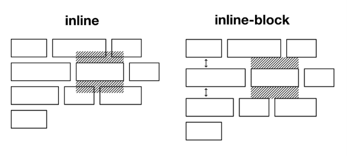
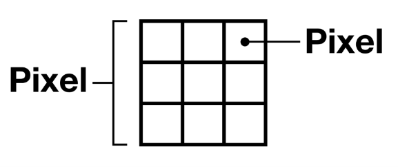
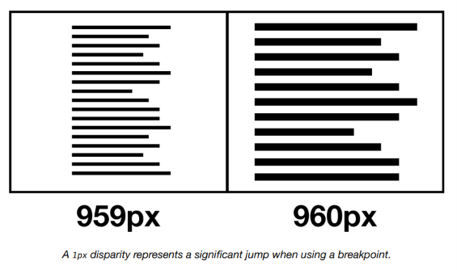
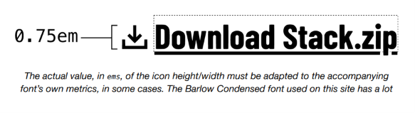
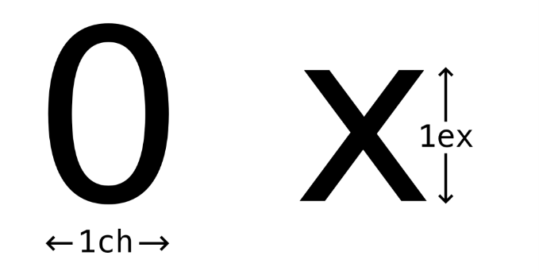

# Unidades

Todo lo que ves en la web está compuesto por los pequeños puntos de luz que conforman la pantalla de tu dispositivo: los _píxeles_. Por lo tanto, al medir los artefactos que componen nuestras interfaces, tiene sentido pensar en términos de píxeles y usar la unidad CSS `px`. ¿O no?

 [Las geometrías de los píxeles de las pantallas varían enormemente ↗](https://geometrian.com/resources/subpixelzoo/), y la mayoría de las pantallas modernas emplean _renderizado sub-píxel_, que es la manipulación de los componentes de color de píxeles individuales para suavizar bordes dentados y producir una resolución más alta. La noción de `1px` percibido es más difusa de lo que a menudo se representa.



> La Samsung Galaxy Tab S 10.5 alterna la disposición de los subpíxeles entre píxeles. Cada dos píxeles está compuesto de manera diferente.

Las resoluciones de pantalla — cuántos píxeles tienen las pantallas — también difieren. En consecuencia, mientras que un "pixel CSS" (`1px` en CSS) puede aproximarse a un píxel de "dispositivo" o "hardware" en una pantalla de baja resolución, una pantalla de alta resolución puede ofrecer múltiples píxeles de dispositivo por cada `1px` de CSS. Así que hay píxeles, y luego hay píxeles de píxeles.



Basta decir que, aunque las pantallas están hechas de píxeles, los píxeles no son regulares, inmutables o constantes. Una caja de `400px` vista por un usuario que ha hecho zoom simplemente no tiene `400px` en CSS. Puede que ni siquiera haya tenido `400px` en píxeles de dispositivo antes de que activaran el zoom.

Trabajar con la unidad `px` en CSS no es _incorrecto_ como tal; no verás ningún mensaje de error. Pero nos anima a trabajar bajo una premisa falsa: que la [_perfección del píxel_ ↗ ](https://www.kelliekowalski.com/)es tanto alcanzable como deseable.

## Escalado y accesibilidad

Diseñar usando la unidad `px` no solo nos anima a adoptar la mentalidad equivocada: también tiene limitaciones evidentes. Por un lado, cuando configuras tus fuentes usando `px`, los navegadores asumen que quieres __fijar__ las fuentes en ese tamaño. En consecuencia, el tamaño de fuente elegido por el usuario en la configuración de su navegador es ignorado.

Con los navegadores modernos que ahora soportan el [_zoom de página completa_ ↗](https://support.google.com/chrome/answer/96810?hl=en-GB) (donde todo, incluido el texto, se amplía proporcionalmente), esto a menudo se descarta como un problema resuelto. Sin embargo, como [_Evan Minto descubrió_ ↗](https://medium.com/@vamptvo/pixels-vs-ems-users-do-change-font-size-5cfb20831773), hay más usuarios que ajustan su tamaño de fuente predeterminado en la configuración del navegador que usuarios de los navegadores Edge o Internet Explorer. Es decir: ignorar a los usuarios que ajustan su tamaño de fuente predeterminado tiene tanto impacto como ignorar navegadores enteros.

Las unidades `em`, `rem`, `ch` y `ex` no presentan ese problema porque son unidades _relativas_ al tamaño de fuente predeterminado del usuario, configurado en su sistema operativo y/o navegador. Los navegadores traducen los valores que usan estas unidades a píxeles, por supuesto, pero de una manera sensible al contexto y la configuración. Las unidades relativas son mediadoras. 

??? info "Entendiendo: Las unidades `em`, `rem`, `ch` y `ex` " 

    Sí. De hecho, la mayoría de las explicaciones de estas unidades son demasiado técnicas y ocultan la pregunta más importante:

    > **"¿Respecto a qué se calcula esta unidad?"**

    1. `rem`

    **Pregunta:** ¿Respecto a qué se calcula?

    **Respuesta:** Respecto al tamaño de fuente del elemento raíz (`html`).

    Pero hay una aclaración importante:

    * Si `html` tiene un `font-size`, se usa ese valor.
    * Si `html` no tiene uno, se usa el tamaño por defecto del navegador (el cual el usuario puede cambiar).

    ```css
      h1 {
          font-size: 2rem;
      }
    ```

    Si el navegador tiene 16px:

    ```text
    1rem = 16px
    2rem = 32px
    ```

    Si el usuario configuró 20px:

    ```text
    1rem = 20px
    2rem = 40px
    ```

    __Piensa en `rem` como:__

    > "Mira al jefe de toda la página."

    Es la unidad más utilizada para:

    * Tamaño de letra.
    * Márgenes.
    * Paddings.
    * Espaciados globales.

      ---

    __2. `em`__

      **Pregunta:** ¿Respecto a qué se calcula?

      **Respuesta:** Respecto al tamaño de fuente del elemento padre.

      ```html
      <div>
          <p>Hola</p>
      </div>
      ```

      ```css
      div {
          font-size: 20px;
      }

      p {
          font-size: 2em;
      }
      ```

      El `p` mira a su padre:

      ```text
      2 × 20px = 40px
      ```

    __Piensa en `em` como:__

      > "Mira a tu padre."

      ---

    __¿Por qué existe `em`?__

      Porque permite que un componente crezca o se reduzca proporcionalmente.

      Por ejemplo:

      ```css
      button {
          font-size: 2rem;
          padding: 0.5em 1em;
      }
      ```

      Si cambias el tamaño del texto del botón, el padding crecerá junto con él. [Show example↗](../../examples/Unidades/unidades.html)


      ---

    __3. `ch`__

      **Pregunta:** ¿Respecto a qué se calcula?

      **Respuesta:** Respecto al ancho del carácter `0` de la fuente actual.

      ```css
      input {
          width: 20ch;
      }
      ```

      Significa aproximadamente:

      > "Haz este elemento suficientemente ancho para unas 20 letras."

      Por ejemplo:

      ```text
      12345678901234567890
      ```

      cabrá aproximadamente dentro.

      ---

    __Piensa en `ch` como:__

      > "¿Cuántos caracteres quiero que quepan?"

      Es útil para:

      * Inputs.
      * Formularios.
      * Limitar el ancho de líneas de texto.

      ```css
      article {
          max-width: 65ch;
      }
      ```

      Esto hace que las líneas tengan unas 65 letras, una longitud cómoda para leer.

      ---

    __4. `ex`__

      **Pregunta:** ¿Respecto a qué se calcula?

      **Respuesta:** Respecto a la altura de la letra minúscula `x`.

      ```css
      div {
          margin-top: 2ex;
      }
      ```

      La altura depende de la fuente:

      * Arial → una altura.
      * Roboto → otra.
      * Times New Roman → otra.

    __Piensa en `ex` como:__

      > "¿Qué tan alta es la letra x?"

      En la práctica casi nadie la utiliza.

      ---

    __Resumen mental__

      | Unidad | Pregunta que responde                      | Piensa en ella como   |
      | ------ | ------------------------------------------ | --------------------- |
      | `rem`  | ¿Cuál es el tamaño base de toda la página? | Mira al jefe (`html`) |
      | `em`   | ¿Cuál es el tamaño de mi padre?            | Mira a tu padre       |
      | `ch`   | ¿Cuántas letras quiero que entren?         | Cuenta caracteres     |
      | `ex`   | ¿Qué tan alta es una x?                    | Altura de la x        |

      ---

      Si tu objetivo es aprender CSS moderno, mi consejo es:

      1. Domina **`rem`** primero.
      2. Aprende después **`em`** y cuándo usarlo en componentes.
      3. Usa **`ch`** para controlar el ancho del texto.
      4. Considera **`ex`** una curiosidad histórica; es muy raro encontrarlo en proyectos reales.


## Relatividad

Los navegadores y sistemas operativos típicamente solo le permiten al usuario adaptar el tamaño de fuente _base_ o _del cuerpo_. Esto se puede expresar como `1rem`: exactamente una vez el tamaño de fuente raíz. Tus elementos de párrafo deberían ser siempre `1rem`, porque representan texto del cuerpo. No necesitas establecer `1rem` explícitamente, porque es el valor predeterminado.

```css linenums="1"
:root {
  /* ↓ redundante */
  font-size: 1rem;
}
p {
  /* ↓ también redundante */
  font-size: 1rem;
}
```

Los elementos, como los encabezados, deben establecerse _relativamente_ más grandes — de lo contrario se perderá la jerarquía. Mi `<h2>` podría ser `2.5rem`, por ejemplo.

```css linenums="1"
h2 {
  /* ↓ 2.5 × el tamaño de fuente raíz */
  font-size: 2.5rem;
}
```

Si bien las unidades `em`, `rem`, `ch` y `ex` son todas medidas de texto, pueden aplicarse por supuesto a las propiedades `width`, `height`, `margin` y `padding` (entre otras). Es solo que el texto es la base del medio web, y estas unidades son un recordatorio conveniente y constante de este hecho. Aprende a extrapolar tus layouts a partir de las dimensiones intrínsecas de tu texto y tus diseños serán hermosos.

## Conversión innecesaria

Mucha gente se ocupa convirtiendo entre `rem` y `px`, asegurándose de que cada valor que usan equivalga a un valor entero de píxeles. Por ejemplo, si el tamaño base es `16px`, `2.4375rem` sería `39px`, pero `2.43rem` sería `38.88px`.

No hay necesidad de hacer una conversión precisa, ya que los navegadores emplean renderizado sub-píxel y/o redondeo para igualar las cosas automáticamente. Es menos verboso usar fracciones simples como `1.25rem`, `1.5rem`, `1.75rem`, etc. — o dejar que `calc()` haga el trabajo pesado en tu _Modular scale_.

## Proporcionalidad y mantenibilidad

Mi `<h2>` es 2.5 veces el tamaño base/raíz. Si agrando el tamaño raíz, mi `<h2>` — y todas las demás dimensiones establecidas en múltiplos basados en `rem` — se ampliarán _proporcionalmente_. La ventaja es que escalar toda la interfaz es trivial:

```css linenums="1"
@media (min-width: 960px) {
  :root {
    /* ↓ Escalar al 125% en 960px */
    font-size: 125%;
  }
}
```

Si hubiera adoptado `px` en su lugar, las implicaciones para el mantenimiento serían claras: la falta de tamaño relativo y proporcional requeriría ajustar elementos individuales caso por caso.

```css linenums="1"
h3 {
  font-size: 32px;
}
h2 {
  font-size: 40px;
}
@media (min-width: 960px) {
  h3 {
    font-size: 40px;
  }
  h2 {
    font-size: 48px;
  }
  /* etc etc ad nauseum */
}
```

## Unidades de viewport

En _Every Layout_, evitamos las consultas basadas en ancho (`@media`). Estas representan la codificación rígida de reconfiguraciones de layout y no son sensibles al espacio disponible inmediato que realmente se le otorga al elemento o componente en cuestión. Escalar la interfaz en un _breakpoint_ discreto, como en el último ejemplo, es arbitrario. ¿Qué tiene de especial `960px`? ¿Realmente podemos decir que el tamaño más pequeño es aceptable en `959px`? 



> Una disparidad de `1px` representa un salto significativo cuando se usa un breakpoint.


Las  [_unidades de viewport_ ↗](https://css-tricks.com/fun-viewport-units/) son relativas al tamaño del viewport del navegador. Por ejemplo, `1vw` es igual al 1% del ancho de la pantalla, y `1vh` es igual al 1% de la altura de la pantalla. Usando unidades de viewport y `calc()` podemos crear un algoritmo mediante el cual las dimensiones se escalan proporcionalmente, pero desde un valor _mínimo_.

```css linenums="1"
:root {
  font-size: calc(1rem + 0.5vw);
}
```

La parte `1rem` de la ecuación asegura que el `font-size` nunca caiga _por debajo_ del valor predeterminado (sistema/navegador/usuario). Es decir, `+ 0vw` es `1rem`.

## La unidad `em`

La unidad `em` es para la unidad `rem` lo que una [_container query_ ↗](https://ethanmarcotte.com/wrote/on-container-queries/) es para una `@media`. Pertenece al contexto inmediato en lugar del documento externo. Si quisiera agrandar ligeramente el `font-size` de un elemento `<strong>` dentro de mi `<h2>`, podría usar unidades `em`:

??? info "Uso `@media` y `@container`"

    Sí. De la misma manera que hicimos con `rem`, `em`, `ch` y `ex`, creo que la mejor forma de entender las **Media Queries** y las **Container Queries** es olvidarse un poco de las definiciones técnicas y hacerse una sola pregunta:

    > **¿Quién decide cuándo cambia el diseño?**

      ---

    __1. `Media Query`__

    __¿Qué observa?__

      **La pantalla (viewport).**

    __Piensa en ella como:__

      > **"Mira al mundo exterior."**

      ```css
      @media (min-width: 768px) {
          .card {
              display: flex;
          }
      }
      ```

      La tarjeta dice:

      > "Cuando la pantalla sea lo suficientemente grande, me pondré horizontal."

      La condición no depende de la tarjeta, sino de la pantalla.

      ---

    __Ejemplo__

      Supongamos que tienes una tarjeta:

      ```text
      ┌────────────┐
      │ Imagen     │
      │ Texto      │
      └────────────┘
      ```

      Y escribes:

      ```css
      @media (min-width: 768px) {
          .card {
              display: flex;
          }
      }
      ```

      Cuando la pantalla supera los 768px:

      ```text
      ┌────────────────────┐
      │ Imagen | Texto     │
      └────────────────────┘
      ```

      ---

    __La pregunta que hace la Media Query es:__

      > **"¿Qué tan grande es la pantalla?"**

      [Show example ↗](../../examples/Unidades/media.html)

      ---

    __2. `Container Query`__

    __¿Qué observa?__

      **El contenedor del componente.**

    __Piensa en ella como:__

      > **"Mira el espacio que tienes alrededor."**

      ```css
      .card {
          container-type: inline-size;
      }

      @container (min-width: 400px) {
          .card-content {
              display: flex;
          }
      }
      ```

      La tarjeta dice:

      > "Si yo dispongo de al menos 400px de espacio, cambiaré mi diseño."

      ---

    __La pregunta que hace la Container Query es:__

      > **"¿Cuánto espacio tengo?"**

      ---

    __Ejemplo__

      Imagina una pantalla enorme:

      ```text
      ┌────────────────────────────────────┐
      │                                    │
      │         Contenido principal         │
      │                                    │
      │          ┌──────────┐              │
      │          │ Tarjeta  │              │
      │          └──────────┘              │
      └────────────────────────────────────┘
      ```

      Aunque la pantalla mida 2000px, la tarjeta puede tener solo 300px disponibles.

      Con una Container Query:

      ```css
      @container (min-width: 400px)
      ```

      la tarjeta dirá:

      > "No tengo suficiente espacio, así que seguiré usando mi diseño pequeño."

      ---

    __¿Por qué existen?__

      Porque hoy diseñamos componentes:

      * tarjetas
      * menús
      * encabezados
      * formularios
      * barras laterales

      y queremos que puedan vivir en cualquier parte de la página sin depender del tamaño de toda la pantalla.

      ---

    __Resumen mental__

      | Unidad              | Pregunta que responde                  | Piensa en ella como       |
      | ------------------- | -------------------------------------- | ------------------------- |
      | `rem`               | ¿Cuál es el tamaño base de la página?  | Mira al jefe (`html`)     |
      | `em`                | ¿Cuál es el tamaño de mi padre?        | Mira a tu padre           |
      | `ch`                | ¿Cuántos caracteres quiero que entren? | Cuenta letras             |
      | `ex`                | ¿Qué tan alta es una x?                | Altura de la x            |
      | **Media Query**     | ¿Qué tan grande es la pantalla?        | Mira al mundo exterior    |
      | **Container Query** | ¿Cuánto espacio tengo?                 | Mira tu entorno inmediato |

      ---

    __Regla práctica moderna (2026)__

      ### Media Queries

      Se usan para cosas globales:

      * Cambios entre móvil y escritorio.
      * Modo oscuro.
      * Orientación del dispositivo.
      * Preferencias del usuario.

      Piensa:

      > **"¿Depende de toda la pantalla?"**

      Si la respuesta es sí, usa una Media Query.

      ---

    __Container Queries__

      Se usan para componentes:

      * Tarjetas.
      * Galerías.
      * Menús.
      * Encabezados.
      * Widgets reutilizables.

      Piensa:

      > **"¿Depende solo del espacio disponible para este componente?"**

      Si la respuesta es sí, usa una Container Query.

      ---

      Y, al igual que te está pasando con `em` y `rem`, es completamente normal que ahora mismo entiendas la idea general pero todavía no veas todos los casos de uso. Cuando empieces a construir componentes más complejos, las Container Queries te parecerán una herramienta extremadamente natural.


```css linenums="1"
h2 {
  font-size: 2.5rem;
}
h2 strong {
  font-size: 1.125em;
}
```

El `font-size` del `<strong>` es ahora `1.125 × 2.5rem`, o `2.53125rem`. Si estableciera un valor `rem` para el `<strong>` en su lugar, no escalaría con su padre `<h2>`: si cambiara el valor `h2`, tendría que cambiar también el valor CSS de `h2 strong`.

Como regla general, las unidades `em` son mejores para dimensionar elementos inline, y las unidades `rem` son mejores para elementos en bloque. Los iconos SVG son candidatos perfectos ↗ para dimensionamiento basado en `em`, ya que acompañan o reemplazan texto. 



> El valor real, en `em`, de la altura/ancho del icono debe adaptarse a las métricas de la fuente que lo acompaña, en algunos casos. La fuente Barlow Condensed utilizada en este sitio tiene mucho espacio interno que compensar — de ahí el valor `0.75rem`.

## Las unidades `ch` y `ex`

Las unidades `ch` y `ex` pertenecen al ancho (aproximado) y la altura de un carácter respectivamente. `1ch` se basa en el ancho de un `0`, y `1ex` es igual a la _altura_ del carácter `x` de tu fuente — también conocido como _corpus size_ o _tamaño del corpus_ ↗.



En la sección _Axiomas_, la unidad `ch` se usa para restringir el [_measure_ ↗](https://en.wikipedia.org/wiki/Line_length) (medida) de los elementos para la legibilidad. Dado que la medida es una cuestión de caracteres por línea, `ch` (abreviatura de _character_) es la única unidad apropiada para esta tarea de estilo.

Un `<h2>` y un `<h3>` pueden tener diferentes valores de `font-size`, pero el mismo (máximo) _measure_:

```css linenums="1"
h2,
h3 {
  max-width: 60ch;
}
h3 {
  font-size: 2rem;
}
h2 {
  font-size: 2.5rem;
}
```

El ancho, en píxeles, de una línea completa de texto se _extrapola_ de la relación entre el `font-size` basado en `rem` y el `max-width` basado en `ch`. Al delegar un algoritmo para determinar este valor — en lugar de codificarlo rígidamente como un `width` basado en `px` — evitamos errores frecuentes y graves. En términos de layout CSS, un error es contenido malformado u oscurecido: _pérdida de datos para los seres humanos_.

